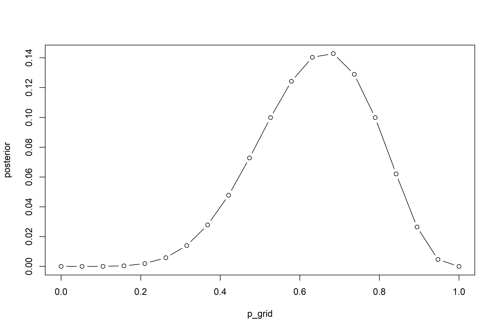
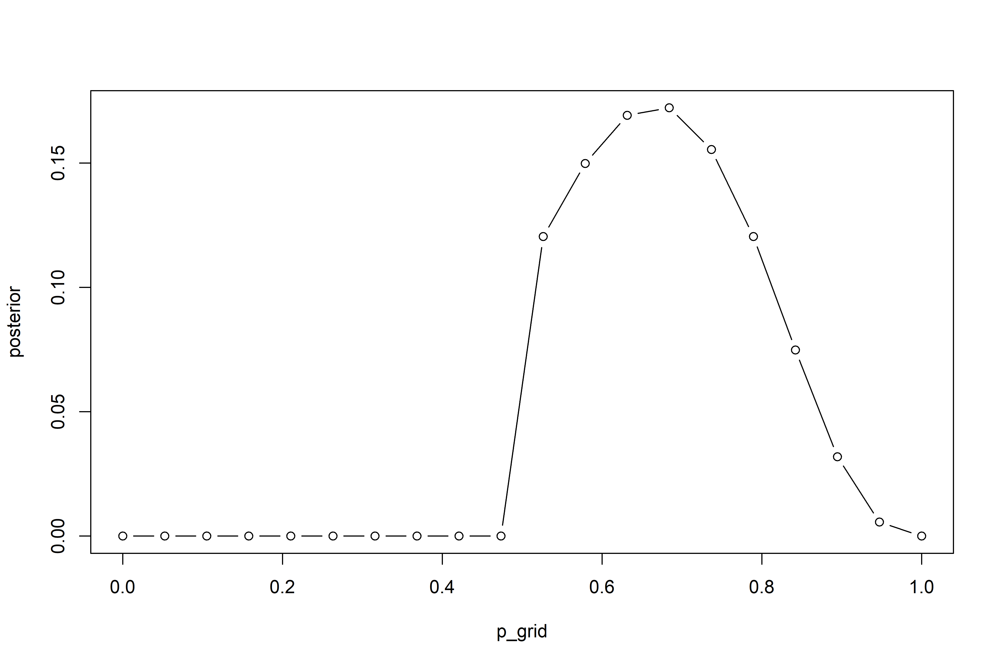
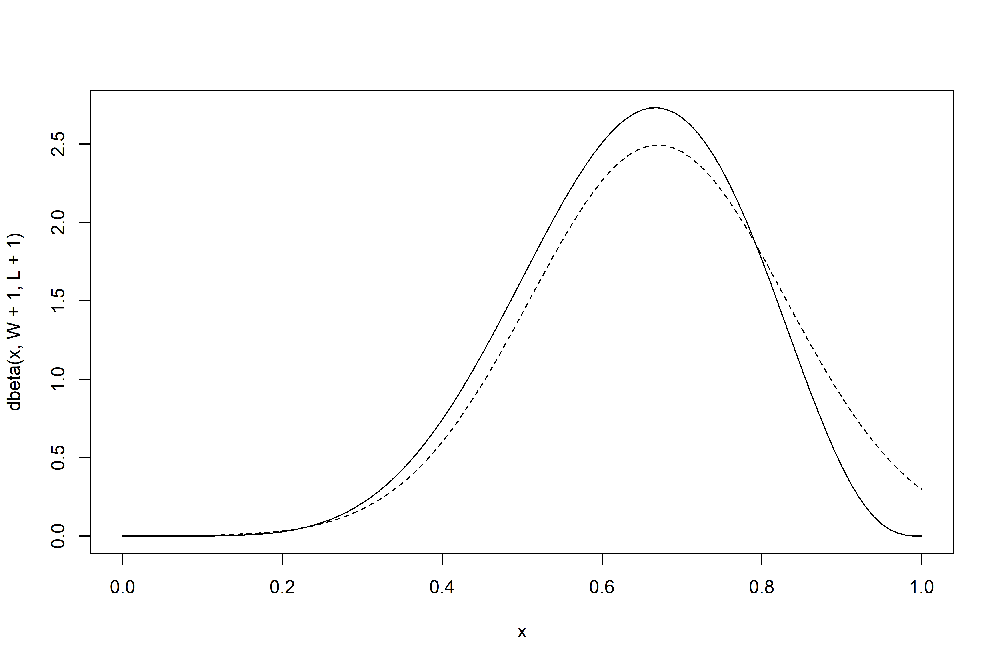
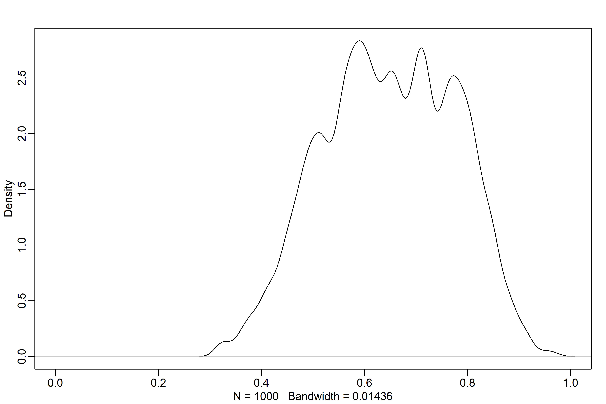

Small Worlds and Large Worlds
================

## 2.1 The garden of forking data

-   Bayesian analysis is a “garden of forking data”
-   In order to make good inference about what happened, it helps to
    consider everything that *could* have happened.

### 2.1.1 Counting possibilities

-   Walk through example of pulling marbles from a bag

### 2.1.2 Combining other information

-   Use prior counts from previous example as a *prior*
-   Multiply likelihood of observed data by prior to get new prior
    (yeehaw)
-   This book does not endorse “ignorant” priors.

### 2.1.3 From counts to probability

-   Easier to work with probabilities rather than counts:

``` r
ways <- c(0, 3, 8, 9, 0)
ways/sum(ways)
```

    ## [1] 0.00 0.15 0.40 0.45 0.00

-   Conjecture of values that influence outcome — **parameter**
-   Relative number of ways that the parameters can produce the data is
    the **likelihood**
-   Prior plausibility of any specific parameter/distribution is the
    **prior**
-   The new updated plausibility of any specific parameter/distribution
    is the **posterior**

## 2.2 Building a model

### 2.2.1 A data story

-   Describe the data generating process with a data story
-   For example, “it’s more likely to rain on warm days”

### 2.2.2 Bayesian updating

-   As data comes in, the posterior always tightens
-   Final posterior is indifferent to the order of the data

### 2.2.3 Evaluate

-   A model can be misleadingly confident about an inference, because
    inferences are conditional on the model.
-   Models can’t be checked for truth, but can be checked for some
    specific-purpose.

## 2.3 Components of the model

1.  The number of ways each conjecture could produce an observation
2.  The accumulated number of ways each conjecture could produce the
    entire data
3.  The initial plausibility of each conjectured cause of the data

### 2.3.1 Variables

-   Observed variables are generally *variables*
-   Unobserved variables are generally *parameters*

### 2.3.2 Definitions

#### 2.3.2.1 Observed variables

-   Likelihood — distribution function assigned to an observed variable.
-   Here’s an exmaple the likelihood of seeing 6 heads in a series of 9
    coin flips

``` r
dbinom(6, size = 9, prob = 0.5)
```

    ## [1] 0.1640625

#### 2.3.2.2 Unobserved variables

Some examples:

1.  What is the average difference between treatment groups?
2.  How strong is the association between a treatment and an outcome?
3.  Does the effect of the treatment depend upon a covariate?
4.  How much variation is there among groups?

-   For every parameter you must provide a prior
-   You *can* massage priors to get any output you want, but because
    priors are explicitly stated, you can’t hide from this!

### 2.3.3 A model is born

Let’s make a really simple model:

 \\
\\
p \sim Uniform(0, 1)\\
\end{align*}
")

## 2.4 Making the model go

-   For every unique combination of data, likelihood, parameters, and
    prior, there is a unique posterior distribution.

### 2.4.1 Bayes’ theorem

-   Bayes’ theorem is really just counting.
-   Posterior = (Prior \* Likelihood)/(Average probability of data)
-   “Average probability of data” is really just a normalizing factor

### 2.4.2 Motors

-   Most interesting models in contemporary science cannot be expressed
    formally, so there are various numerical techniques to approximate
    the mathematics that follows from the definition of Bayes’ theorem:

1.  Grid approximation
2.  Quadratic approximation
3.  Markov chain Monte Carlo (MCMC)

-   Stan uses Hamiltonian Monte Carlo (HMC), I believe
-   How you fit the model is a part of the model

### 2.4.3 Grid approximation

-   One of the simplest conditioning techniques
-   Useful for pedagogy, but not used a whole lot in practice (scales
    poorly)

``` r
# define grid
p_grid <- seq(from = 0, to = 1, length.out = 20)

# define prior
prior <- rep(1, 20)

plot_posterior <- function(prior) {
  
  # compute likelihood at each value in the grid
  # (from seeing 6/9 positives)
  likelihood <- dbinom(6, size = 9, prob = p_grid)
  
  # product of likelihood/prior
  unstd.posterior <- likelihood * prior
  
  # standardize the posterior so it sums to 1
  posterior <- unstd.posterior / sum(unstd.posterior)
  
  plot(p_grid, posterior, type = "b")
  
}

plot_posterior(prior)
```

<!-- -->

If we change the prior, we get differnt posteriors.

``` r
prior <- ifelse(p_grid < 0.5, 0, 1)
plot_posterior(prior)
```

<!-- -->

``` r
prior <- exp(-5*abs(p_grid - 0.5))
plot_posterior(prior)
```

<!-- -->

### 2.4.4 Quadratic approximation

-   Under quite general conditions, the region near the peak of the
    posterior will be nearly gaussian and can therefore be approximated
    by a normal distribution.
-   Called quadratic approximation because the logarithm of the normal
    distribution is a parabola

``` r
library(rethinking)

globe.qa <- 
  quap(
    alist(
      W ~ dbinom(W + L, p), # binomial likelihood
      p ~ dunif(0, 1) # uniform prior
    ),
    data = list(W = 6, L = 3)
  )

# display summary of quadratic approximation
precis(globe.qa)
```

    ##        mean        sd      5.5%     94.5%
    ## p 0.6666667 0.1571338 0.4155366 0.9177968

How does `quap()`’s approximation compare with the analytical solution?

``` r
# analytical calculation
W <- 6
L <- 3
curve(dbeta(x, W + 1, L + 1), from = 0, to = 1)

# quap
curve(dnorm(x, 0.67, 0.16), lty = 2, add = TRUE)
```

<!-- -->

-   Quadratic approximation improves as more data is gathered. However,
    the rate of improvement varies greatly depending on the details. In
    some models, quadratic approximation remains terrible even with
    thousands of samples.

### 2.4.5 Markov Chain Monte Carlo

-   For many models, neither grid approximation nor quadratic
    approximation are satisfactory.
-   MCMC allows for exploration by drawing samples of the posterior,
    rather than actually computing it.

``` r
# really basic mcmc
n_samples <- 1000
p <- rep(NA, n_samples)
p[1] <- 0.5
W <- 6
L <- 3

for (i in 2:n_samples) {
  
  p_new <- rnorm(1, p[i - 1], 0.1)
  if (p_new < 0) p_new <- abs(p_new)
  if (p_new > 1) p_new <- 2 - p_new
  q0 <- dbinom(W, W + L, p[i - 1])
  q1 <- dbinom(W, W + L, p_new)
  p[i] <- ifelse(runif(1) < q1/q0, p_new, p[i - 1])
  
}

dens(p, xlim = c(0, 1))
```

<!-- -->
