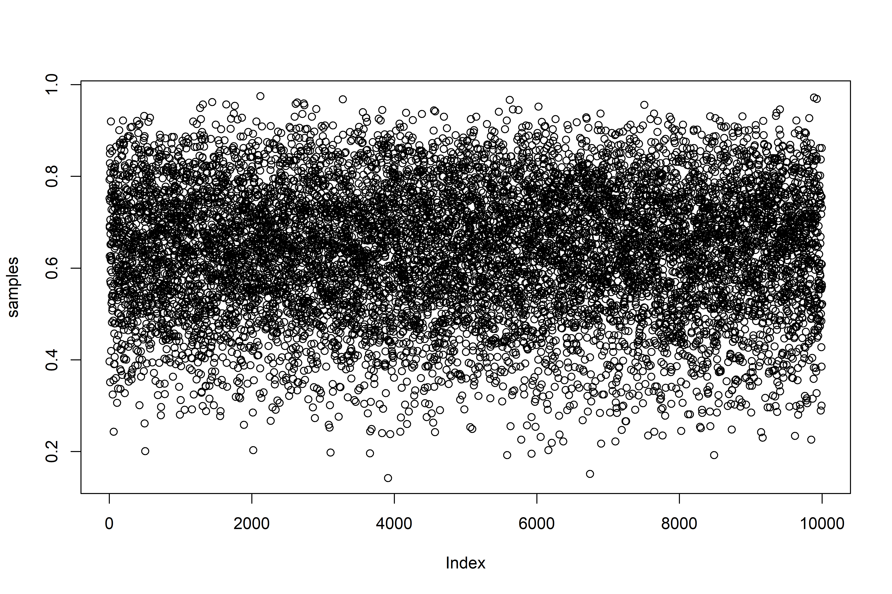
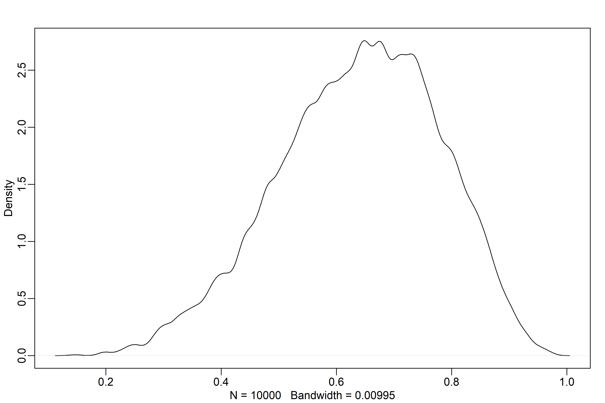
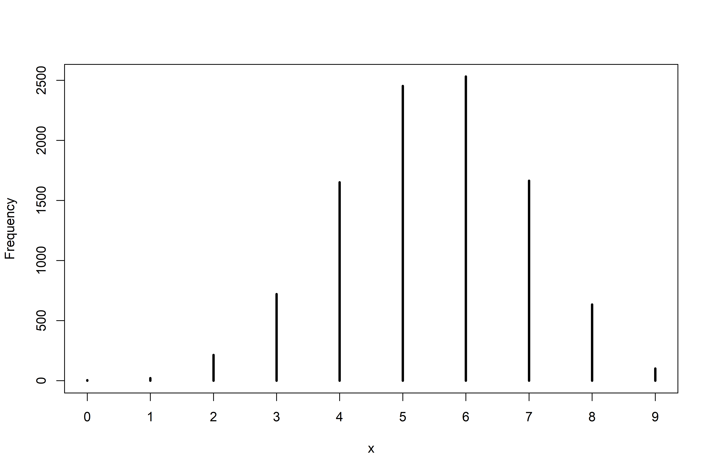
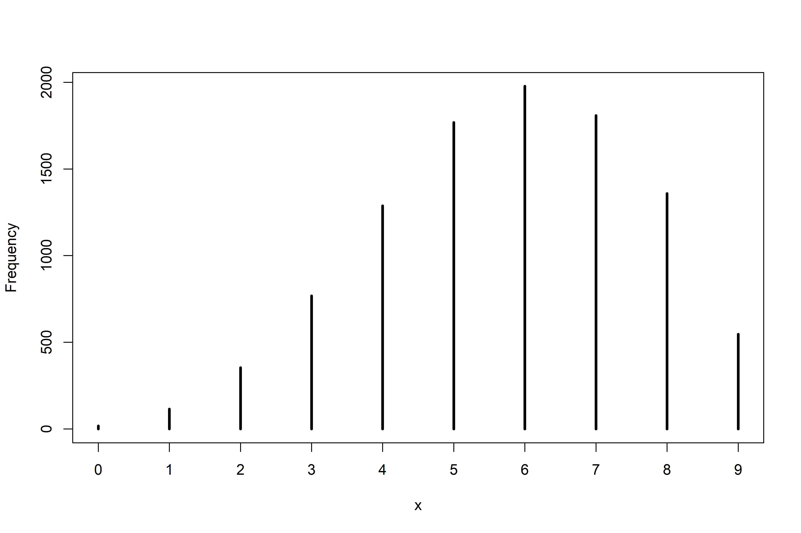

Sampling the Imaginary
================

-   Classic example of false postives (in this case, detecting
    vampirism): correct 95% of the time, but with a false positive rate
    of 1%. Finally, vampires are rare — about 0.1% of the population.
-   P(positive test result \| vampire) = 0.95
-   P(positive test result \| mortal) = 0.01
-   P(vampire) = 0.001
-   With a positive test result — what is the probability that person is
    a vampire?
-   P(vampire \| positive test result)

``` r
p_positive_vampire <- 0.95
p_positive_mortal <- 0.01
p_vampire <- 0.001

# first, need the probability of receiving a positive test result in general
p_positive <- p_positive_vampire * p_vampire + p_positive_mortal * (1 - p_vampire)

# then, apply bayes theorem
p_vampire_positive <- (p_positive_vampire * p_vampire)/p_positive

p_vampire_positive
```

    ## [1] 0.08683729

-   This presentation is a bit counterintuitive, though, so let’s try
    something else:

1.  In a population of 100,000 people, 100 of them are vampires (0.1%)
2.  Of the 100 who are vampires, 95 of them will test positive for
    vampirism (95%)
3.  of the 99,900 mortals, 999 of them will test positive for vampirism
    (1%)

-   If we test all 100,000 people, what proportion of those who test
    positive will actually be vampires?
-   `95/(95 + 999) ~ 0.087`
-   Framing in terms of counts (rather than integrals) is useful to
    think about because that’s how we’ll work with posterior
    distributions down the line.

## 3.1 Sampling from a grid-approximate posterior

-   Let’s recreate the posterior from the globe-tossing model, using a
    1000-point grid & a uniform prior probability of landing on water.

``` r
# generate grid-approximate posterior of the globe-tossing model
p_grid <- seq(from = 0, to = 1, length.out = 1000)

# uniorm prior p
prob_p <- rep(1, 1000)

# observations: 6 times lands on water out of 9 tosses
prob_data <- dbinom(6, size = 9, prob = p_grid)

# update prior
posterior <- prob_data * prob_p
posterior <- posterior/sum(posterior)
```

-   Now, sample from the posterior 10,000 times:

``` r
samples <- 
  sample(
    p_grid, 
    prob = posterior, 
    size = 10000, 
    replace = TRUE
  )

plot(samples)
```

<!-- -->

``` r
library(rethinking)
dens(samples)
```

<!-- -->

## 3.2 Sampling to summarize

-   Common questions:
    -   How much posterior probability lies below some parameter value?
    -   How much posterior probability lies between two parameter
        values?
    -   Which parameter value marks the lower 5% of the posterior
        probability?
    -   Which range of parameter values contains 90% of the posterior
        probability?
    -   Which parameter value has the highest posterior probability?

### 3.2.1 Intervals of defined boundaries

-   What is the posterior probability that the proportion of water is
    less than 0.5?
-   Just the sum of the posterior less than 0.5!

``` r
sum(posterior[p_grid < 0.5])
```

    ## [1] 0.1718746

-   This grid-approximation example, however, doesn’t generalize to
    many-parameter estimates.
-   However, working with the samples directly does:

``` r
sum(samples < 0.5)/length(samples)
```

    ## [1] 0.1677

-   Similar, but not exactly the same (expected)
-   Same approach let’s us say how much posterior probability lies
    between `0.5` & `0.75`:

``` r
sum(samples > 0.5 & samples < 0.75)/length(samples)
```

    ## [1] 0.6035

### 3.2.2 Intervals of defined mass

-   Where is the 80% percentile?

``` r
quantile(samples, 0.8)
```

    ##      80% 
    ## 0.761962

-   What is the middle 80% interval (between 10th & 90th percentile)?

``` r
quantile(samples, c(0.1, 0.9))
```

    ##       10%       90% 
    ## 0.4514515 0.8158158

-   This percentile interval method is okay in a lot of scenarios, but
    isn’t perfect.
-   Consider instead this posterior of the globe model, where we see 3
    waters after tossing 3 times & assigning a uniform prior:

``` r
p_grid <- seq(from = 0, to = 1, length.out = 1000)
prior <- rep(1, 1000)

likelihood <- dbinom(3, size = 3, prob = p_grid)
posterior <- likelihood * prior
posterior <- posterior/sum(posterior)

samples_skewed <- sample(p_grid, size = 10000, replace = TRUE, prob = posterior)

dens(samples_skewed)
```

<!-- -->

-   The most probable scenario from this model/data is `p = 1`, however
    a percentile interval ends up excluding this:

``` r
PI(samples_skewed, prob = 0.5)
```

    ##       25%       75% 
    ## 0.7097097 0.9329329

-   Alternatively, the *highest posterior density interval* finds the
    narrowest interval containing the specified probability mass (which
    will include the most probable)

``` r
HPDI(samples_skewed, prob = 0.5)
```

    ##      |0.5      0.5| 
    ## 0.8398398 1.0000000

-   In many scenarios, the HPDI & PI are very similar.
-   Although there are benefits to the HPDI over the PI, there are
    drawbacks (e.g., interpretability, computation).
-   Intervals are just helpful for summarizing it — if the choice of the
    interval leads to different inferences, then you’d be better off
    just plotting the entire distribution.

### 3.2.3 Point Estimates

-   What value should you report for a point estimate (when asked — the
    benefit of Bayesian analysis is generating a distribution;
    summarizing with a point estimate discards data)?
-   One way may be to report the *maximum a posteriori* (MAP) estimate:

``` r
# from grid approximation:
p_grid[which.max(posterior)]
```

    ## [1] 1

``` r
# or from the samples
chainmode(samples_skewed, adj = 0.01)
```

    ## [1] 0.9972416

-   What about the mean/median?

``` r
mean(samples_skewed)
```

    ## [1] 0.80061

``` r
median(samples_skewed)
```

    ## [1] 0.8398398

-   The mean, median, and mode (MAP) are all different!
-   One way to choose is to utilize a *loss function* (note that
    *different loss functions imply different point estimates*)
-   For example, what if we receive $100 for a correct estimate of the
    percentage of water, but proportionally less for a guess (`d`) that
    is different from the correct answer (`p`)?
-   If the guess is `0.5`, the expected loss will be:

``` r
sum(posterior * abs(0.5 - p_grid))
```

    ## [1] 0.3128752

We can repeat this for all possible choices in `p_grid`:

``` r
loss <- sapply(p_grid, function(d) sum(posterior * abs(d - p_grid)))
```

-   The parameter that minimizes this specific loss is, in this case,
    the same as the posterior median:

``` r
p_grid[which.min(loss)]
```

    ## [1] 0.8408408

-   Absolute loss functions (above) lead to the posterior median,
    quadratic loss functions (`(d - p) ^ 2`) leads to the posterior
    mean. If the distribution is symmetric & normal ish, these values
    converge.

## 3.3 Sampling to simulate prediction

-   Generating implied observations from a model is useful for at least
    four reasons:

1.  *Model design*: We can sample from the prior as well as the
    posterior — prior predictive checks are useful to see what the model
    expects.
2.  *Model checking*: Worth simulating to see if the fit worked
    correctly & to investigate model behavior.
3.  *Software validation*: In order to be sure the model-fitting
    software is working, it helps to simulate under a *known* model &
    attempt to recover the parameters the data were simulated under.
4.  *Research design*: If you can simulate observations from the
    hypothesis, you can evaulate whether research design can be
    effective (this can be used for power analysis, among other broader
    applications).
5.  *Forecasting*: Simulate new cases and future observations!

### 3.3.1 Dummy data

-   Let’s assume the “true probability” of the globe tossing model is
    `0.7` and simulate some data for 2 tosses:

``` r
dummy_w <- rbinom(1e5, size = 9, prob = 0.7)
table(dummy_w)/1e5
```

    ## dummy_w
    ##       0       1       2       3       4       5       6       7       8       9 
    ## 0.00001 0.00047 0.00340 0.02091 0.07369 0.17057 0.26448 0.26877 0.15711 0.04059

-   What about a simulation of 9 tosses?

``` r
dummy_w <- rbinom(1e5, size = 9, prob = 0.7)
simplehist(dummy_w, xlab = "dummy water count")
```

<!-- -->

### 3.3.2 Model Checking

1.  Ensure the model fitting worked correctly
2.  Evaluate the adequacy of a model

#### 3.3.2.1 Did the software work?

-   If we simulate data with known parameters, we’d expect the software
    to find these (retrodiction, rather than prediction)

#### 3.3.2.2 Is the model adequate?

-   Useful to look for aspects of the data that are not well described
    by the model’s expectations
-   In the globe tossing model, there is uncertainty both around `p` and
    the counts that are influenced by `p`

``` r
# predicted observations for a single value of p (p = 0.6)
w <- rbinom(1e4, size = 9, prob = 0.6)
simplehist(w)
```

<!-- -->

``` r
# predicted observations given the posterior uncertainty of p!
w <- rbinom(1e4, size = 9, prob = samples)
simplehist(w)
```

<!-- -->

## 3.4 Summary

-   Fundamental tool: samples of parameter values drawn from the
    posterior distribution.
-   Turns the problem from integral calculus to summarising data
-   Posterior predictive checks combine uncertainty about parameters
    with uncertainty about outcomes.
