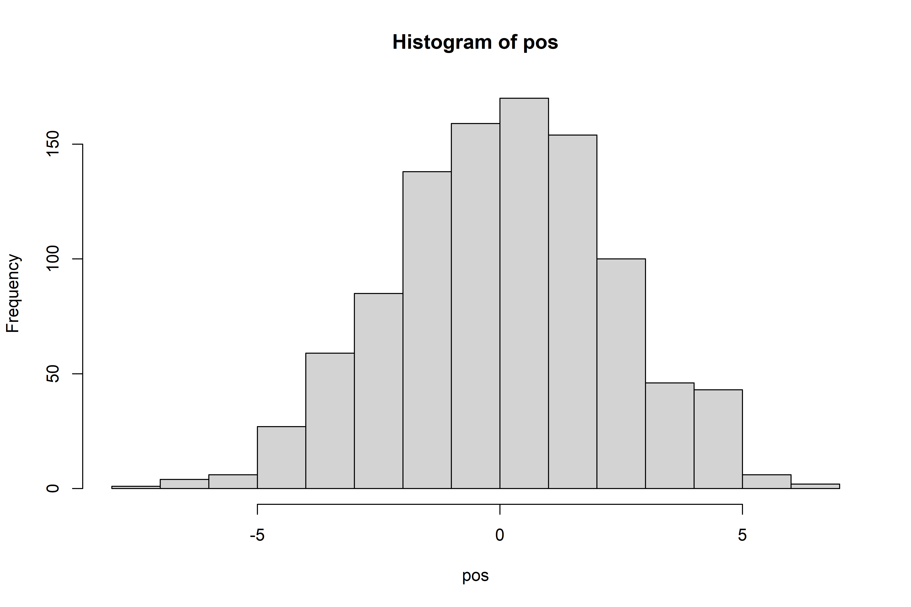
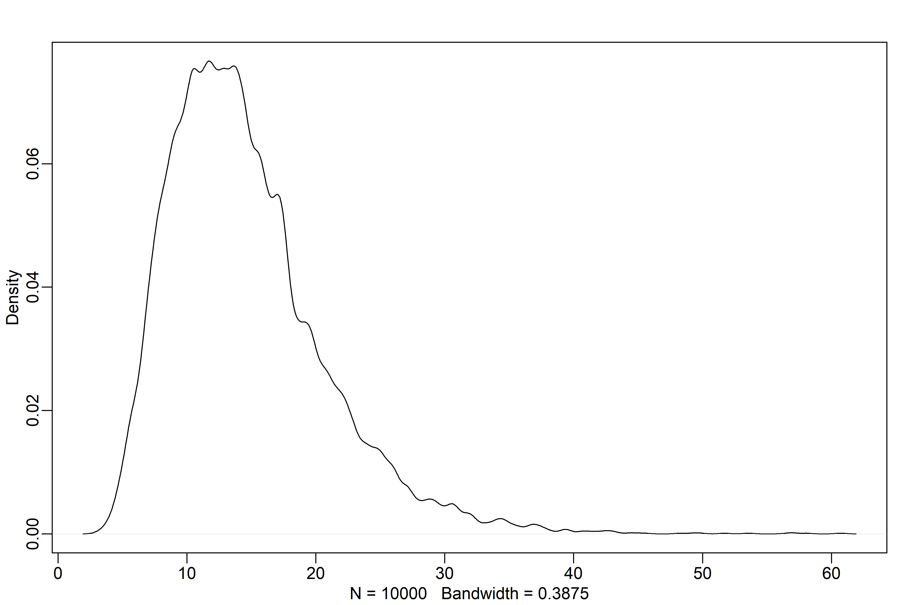
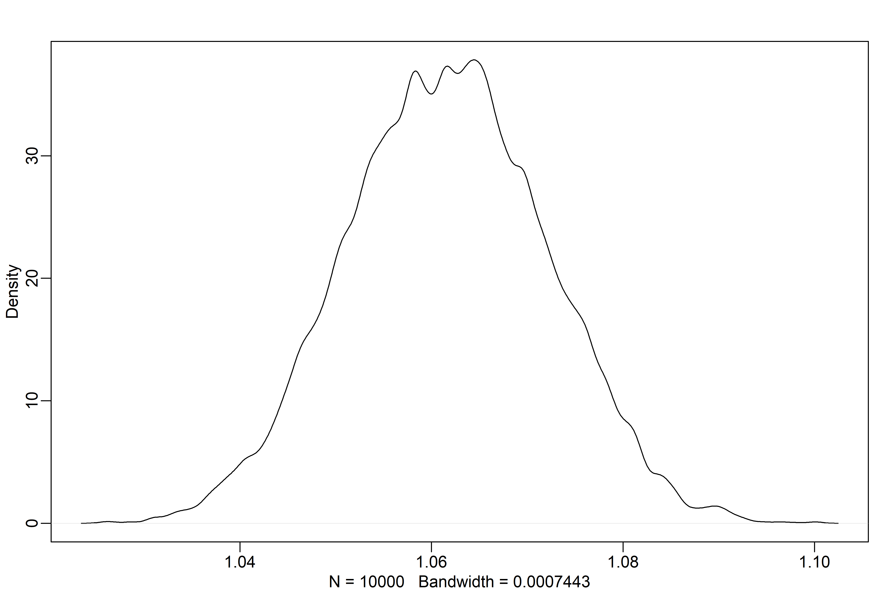
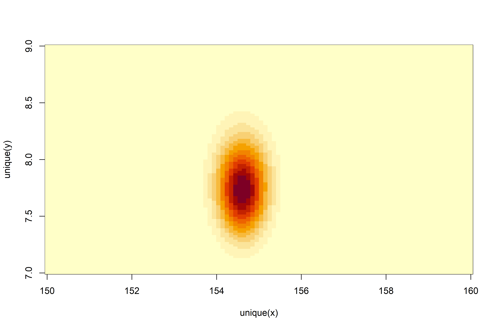
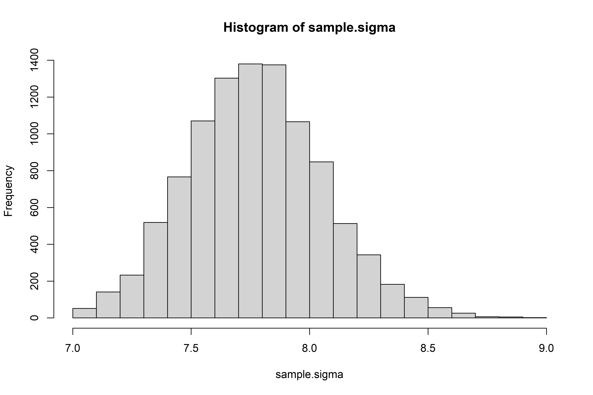
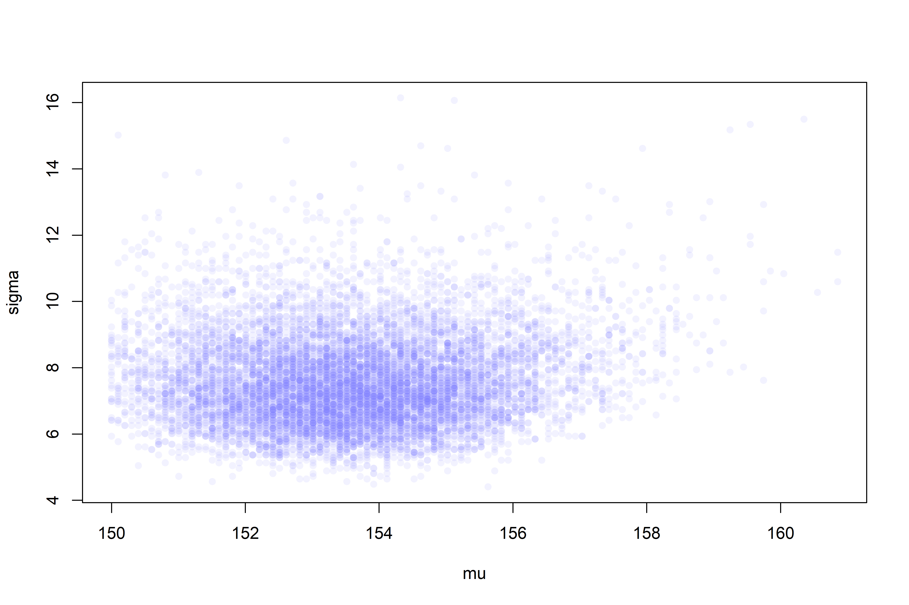
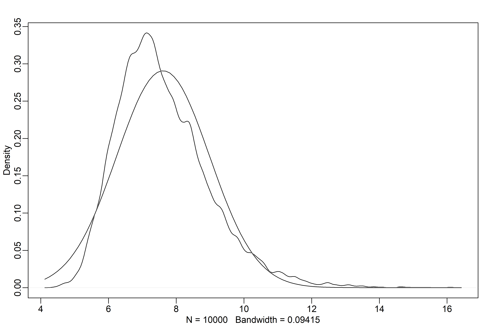

Geocentric Models
================

-   Ptolomey’s geocentric model of the solar system using epicycles
    could provide useful information about the future location of the
    planets, but was wrong.
-   *Linear regression* is our geocentric golem — it’s often not
    necessarily correct, but can be useful.

## 4.1 Why normal distributions are normal

### 4.1.1 Normal by addition

-   Let’s simulate 16 random steps forward/backward for 1000 people.
-   Even though these are effectively coin flips, we’ll end up with a
    normal-ish distribution of of final position at step 16 for these
    1000 people.

``` r
pos <- replicate(1000, sum(runif(16, -1, 1)))

hist(pos)
```

<!-- -->

``` r
plot(density(pos))
```

<!-- -->

-   Any process that adds together random values from the same
    distribution converges to a normal distribution.

### 4.1.2 Normal by multiplication

-   Let’s the growth rate of an organism is determined by a a dozen loci
    that interact, such that each increase growth by a percentage. This
    means the effects multiply. Here’s an example of 1:

``` r
prod(1 + runif(12, 0, 0.1))
```

    ## [1] 1.872262

-   Now let’s repeat this for 10,000 organisms:

``` r
growth <- replicate(10000, prod(1 + runif(12, 0, 0.1)))
rethinking::dens(growth, norm.comp = TRUE)
```

<!-- -->

-   This is because small multiplications are approximately additive
    (e.g., 1.1 \* 1.1 = 1.21)

``` r
big <- replicate(10000, prod(1 + runif(12, 0, 0.5)))
small <- replicate(10000, prod(1 + runif(12, 0, 0.01)))

rethinking::dens(big)
```

<!-- -->

``` r
rethinking::dens(small)
```

<!-- -->

### 4.1.3 Normal by log-multiplication

-   Large deviates that are multiplied together don’t produce gaussian
    distributions, but they do generate log-normal distributions

``` r
log.big <- replicate(10000, log(prod(1 + runif(12, 0, 0.5))))
rethinking::dens(log.big)
```

<!-- -->

### 4.1.4 Using Gaussian distributions

-   There are two justifications for using Gaussian distributions:
    -   **Ontological**: The world is full of Gaussian distributions.
        Other members of the *Exponential Family* of distributions
        (Gamma, Poisson) also arise in nature.
    -   **Epistemological**: When all we know or are willing to say
        about a distribution is their mean and variance, then ghe
        Gaussian is the most natural way to express this. This is also
        justified with information theory via measures of *maximum
        entropy*.

## 4.2 A language for describing models

1.  We have a set of variables to work with. Some of these are
    observable — we call these *data*. Others are unobservable — we call
    these *parameters*.
2.  We define each variable either in terms of other variables or in
    terms of a probability distribution.
3.  The combination of variables and their probability distributions
    defines a *joint generative model*.

-   The biggest difficulty in working with this framework is the subject
    matter — which variables matter and how does theory tell us to
    connect them?

### 4.2.1 Re-describing the globe tossing model

 \\
\\
p \sim Uniform(0, 1)\\
\end{align*}
")

-   Both lines in the above model are *stochastic* — that is no single
    variable on the left is known with certainty, but rather is
    described probabilistically.

## 4.3 Gaussian model of height

### 4.3.1 The data

``` r
library(rethinking)
data("Howell1")
d <- Howell1

str(d)
```

    ## 'data.frame':    544 obs. of  4 variables:
    ##  $ height: num  152 140 137 157 145 ...
    ##  $ weight: num  47.8 36.5 31.9 53 41.3 ...
    ##  $ age   : num  63 63 65 41 51 35 32 27 19 54 ...
    ##  $ male  : int  1 0 0 1 0 1 0 1 0 1 ...

``` r
precis(d)
```

    ##               mean         sd      5.5%     94.5%     histogram
    ## height 138.2635963 27.6024476 81.108550 165.73500 ▁▁▁▁▁▁▁▂▁▇▇▅▁
    ## weight  35.6106176 14.7191782  9.360721  54.50289 ▁▂▃▂▂▂▂▅▇▇▃▂▁
    ## age     29.3443934 20.7468882  1.000000  66.13500     ▇▅▅▃▅▂▂▁▁
    ## male     0.4724265  0.4996986  0.000000   1.00000    ▇▁▁▁▁▁▁▁▁▇

``` r
d2 <- d[d$age >= 18,]
```

### 4.3.2 The model

``` r
hist(d2$height)
```

<!-- -->

-   Can model height using a normal distribution
-   Notation note: *iid* = *independent and identically distributed*.
    This assumption is often wrong (for example, heights amongst family
    members are not independent), but also often useful.

 \\
\mu \sim Normal(178, 20) \\
\sigma \sim Uniform(0, 50)
")

``` r
# ***average*** height somewhere between 140 & 220 cm
curve(dnorm(x, 178, 20), 
      from = 100,
      to = 250)
```

<!-- -->

``` r
curve(dunif(x, 0, 50),
      from = -10,
      to = 60)
```

<!-- -->

``` r
# prior predictive simulation
sample_mu <- rnorm(1e4, 178, 20)
sample_sigma <- runif(1e4, 0, 50)
prior_h <- rnorm(1e4, sample_mu, sample_sigma)
dens(prior_h)
```

<!-- -->

-   Prior prediction is useful for setting reasonable priors.
-   For example, if the prior for the mean,
    ,
    was
    "),
    we’d end up with implausible (negative!) prior heights:

``` r
# this set of priors is unreasonable!
sample_mu <- rnorm(1e4, 178, 100)
prior_h <- rnorm(1e4, sample_mu, sample_sigma)
dens(prior_h)
```

<!-- -->

-   In this particular case, we have enough data and a simple enough
    model that a sill prior is harmless. But that won’t always be the
    case.

### 4.3.3 Grid approximation of the posterior distribution

-   For posterity, let’s generate the analytical solution to the
    posterior (won’t be useful in the long term, but approximations will
    be far quicker/less computationally expensive/just as good for
    practical purposes):

``` r
# generate grid of mu/sigma
mu.list <- seq(from = 150, to = 160, length.out = 100)
sigma.list <- seq(from = 7, to = 9, length.out = 100)

# generate every combination of mu/sigma (10000 total)
post <- expand.grid(mu = mu.list, sigma = sigma.list)

# generate log-likelihood of data based on each combination of mu/sigma
post$LL <- 
  sapply(1:nrow(post),
         function(i) sum(
           dnorm(d2$height, post$mu[i], post$sigma[i], log = TRUE)
         ))

# compute the log product of the likelihood & prior
post$prod <- post$LL + dnorm(post$mu, 178, 20, TRUE) + dunif(post$sigma, 0, 50, TRUE)

# find the posterior, convert from log to response scale
post$prob <- exp(post$prod - max(post$prod))
```

``` r
contour_xyz(post$mu, post$sigma, post$prob)
```

<!-- -->

``` r
image_xyz(post$mu, post$sigma, post$prob)
```

<!-- -->

### 4.3.4 Sampling from the posterior

-   Let’s sample parameter values from the posterior distribution

``` r
# sample.rows = row indices --- rows with greater plausibility are more likely 
# to be sampled
sample.rows <- 
  sample(1:nrow(post), size = 1e4, replace = TRUE, prob = post$prob)

sample.mu <- post$mu[sample.rows]
sample.sigma <- post$sigma[sample.rows]

plot(sample.mu,
     sample.sigma,
     cex = 1,
     pch = 16,
     col = col.alpha(rangi2, 0.1))
```

<!-- -->

``` r
hist(sample.mu)
```

<!-- -->

``` r
hist(sample.sigma)
```

<!-- -->

``` r
PI(sample.mu)
```

    ##       5%      94% 
    ## 153.9394 155.2525

``` r
PI(sample.sigma)
```

    ##       5%      94% 
    ## 7.323232 8.252525

-   One interesting thing to note is that
    
    is *right-skewed*.
-   This *basically* has to do with the fact that it must be positive —
    if variance is estimated to be near zero, then it can’t be much
    smaller, but could be a lot bigger.

``` r
# using a sample of 20 points will display this issue further
d3 <- sample(d2$height, size = 20)

# repeat analysis from above, this time looking at only 20 points
# priors:
mu.list <- seq(from = 150, to = 170, length.out = 200)
sigma.list <- seq(from = 4, to = 20, length.out = 200)

# combine all possible combinations
post2 <- expand.grid(mu = mu.list, sigma = sigma.list)

# log likelihood
post2$LL <- 
  sapply(
    1:nrow(post2),
    function(i) 
      sum(dnorm(d3, mean = post2$mu[i], sd = post2$sigma[i], log = TRUE))
  )

# log product of likelihood & prior
post2$prod <- post2$LL + dnorm(post2$mu, 178, 20, TRUE) + dunif(post2$sigma, 0, 50, TRUE)

# log posterior converted to response scale
post2$prob <- exp(post2$prod - max(post2$prod))

# sample from the posterior
sample2.rows <- sample(1:nrow(post2), size = 1e4, replace = TRUE, prob = post2$prob)
sample2.mu <- post2$mu[sample2.rows]
sample2.sigma <- post2$sigma[sample2.rows]

plot(sample2.mu, 
     sample2.sigma, 
     cex = 1, 
     col = col.alpha(rangi2, 0.1),
     xlab = "mu",
     ylab = "sigma",
     pch = 16)
```

<!-- -->

``` r
dens(sample2.sigma, norm.comp = TRUE)
```

<!-- -->

### 4.3.5 Finding the posterior distribution with `quap`

-   `quap()` will allow us to make a *quadratic approximation* of the
    posterior.
-   `quap()` will find the peak at the *maximum a posteriori* estimate
    (MAP), then approximate the posterior using the curvature at the
    MAP.
-   This is similar to what many non-Bayesian procedures do, just
    without any priors.
-   `quap()` allows us to define the formulas very similarly to the
    mathematical syntax:

 \\
\mu \sim Normal(178, 20) \\
\sigma \sim Uniform(0, 50)
")

``` r
flist <-
  alist(
    height ~ dnorm(mu, sigma),
    mu ~ dnorm(178, 20),
    sigma ~ dunif(0, 50)
  )
```

-   Very simple to fit the model to the data:

``` r
m4.1 <- quap(flist, data = d2)

precis(m4.1)
```

    ##             mean        sd       5.5%      94.5%
    ## mu    154.607024 0.4119947 153.948576 155.265471
    ## sigma   7.731333 0.2913860   7.265642   8.197024

-   The table from `precis()` provides the Gaussian approximations for
    each parameter’s *marginal* distribution.
-   This means the plausibility of each value of
    
    after averaging over the plausibilities of each value of
    
    is given by a Gaussian distribution with mean 154.6 & std. dev of
    0.4.
-   `quap()` will start at random parameter values by default, but you
    can also give it an explicit starting value:

``` r
start <- 
  list(
    mu = mean(d2$height),
    sigma = sd(d2$height)
  )

# use start values specified above
m4.1 <- quap(flist, data = d2, start = start)

# quap still finds pretty much the same estimates:
precis(m4.1)
```

    ##             mean        sd       5.5%      94.5%
    ## mu    154.607024 0.4119947 153.948576 155.265471
    ## sigma   7.731333 0.2913860   7.265642   8.197024

-   Previous priors were very weak — we can also specify very stron
    priors:

``` r
m4.2 <-
  quap(
    alist(
      height ~ dnorm(mu, sigma),
      mu ~ dnorm(178, 0.1), # very strong prior!!!
      sigma ~ dunif(0, 50)
    ),
    data = d2
  )

precis(m4.2)
```

    ##            mean        sd      5.5%     94.5%
    ## mu    177.86375 0.1002354 177.70356 178.02395
    ## sigma  24.51755 0.9289220  23.03295  26.00215

-   Strong priors regularize *a lot* so the estimate for
    
    has hardly moved.
-   Even though
    
    hasn’t moved,
    
    has *had* to move quite a bit to compensate.

### 4.3.6 Sampling from a `quap`

-   Quadratic approximation is just a multidimensional gaussian
    (
    and
    
    both contribute a dimension) distribution.
-   Just like a mean and standard deviation are enough to describe a
    one-dimensional Gaussian distribution, a list of means and a matrix
    of variances and covariances are enough to describe a
    multidimensional Gaussian distribution.

``` r
vcov(m4.1)
```

    ##                 mu        sigma
    ## mu    0.1697396109 0.0002180307
    ## sigma 0.0002180307 0.0849058224

-   `vcov()` returns a *variance-covariance* matrix which tells us how
    each parameter relates to every other parameter in the posterior
    distribution.
-   A variance-covariance matrix can be factored into two elements:
    1.  A vector of variances for the parameters.
    2.  A correlation matrix that tells us how changes in any parameter
        lead to correlated changes in the others.

``` r
diag(vcov(m4.1))
```

    ##         mu      sigma 
    ## 0.16973961 0.08490582

``` r
cov2cor(vcov(m4.1))
```

    ##                mu       sigma
    ## mu    1.000000000 0.001816174
    ## sigma 0.001816174 1.000000000

-   The two element vector returned by `diag()` is a list of variances
    (if you take the square root, you get the standard deviations that
    are shown by `precis()`).
-   Instead of sampling single values from a Gaussian, we sample vectors
    of values from a multi-dimensional gaussian.

``` r
post <- extract.samples(m4.1, n = 1e4)

head(post)
```

    ##         mu    sigma
    ## 1 155.1244 8.373928
    ## 2 154.2755 7.487040
    ## 3 154.4687 7.709748
    ## 4 155.8009 7.903479
    ## 5 154.6217 7.518115
    ## 6 154.3780 8.320202

``` r
precis(post)
```

    ##             mean        sd       5.5%      94.5%   histogram
    ## mu    154.606401 0.4069266 153.951643 155.258265     ▁▁▅▇▂▁▁
    ## sigma   7.728902 0.2871766   7.267613   8.192042 ▁▁▁▂▅▇▇▃▁▁▁

``` r
plot(post)
```

<!-- -->

## 4.4 Linear prediction

-   Thus far, we’ve only modeled height. Oftentimes, we want measure how
    an outcome is related to some other variable (e.g., predictors).
-   For example, height and weight are positvely associated:

``` r
plot(d2$height ~ d2$weight)
```

<!-- -->

### 4.4.1 The linear model strategy

-   The strategy is to make the parameter for the mean int oa linear
    function of the predictor(s).
-   For our height example:

 \\
\mu_i = \alpha + \beta(x_i - \overline{x}) \\
\alpha \sim Normal(178, 20) \\
\beta \sim Normal(0, 10) \\
\sigma \sim Uniform(0, 50)
")

#### 4.4.1.1 Probability of the data

-   Read
    
    and
    
    as “each
    ”
    and “each
    .
-   The mean of each now depends on unique values on each row
    .

#### 4.4.1.2 Linear model

-   
    is now *deterministic*, because it described by other parameters.
-   We’re asking two things in this regression:

1.  What is the expected height when
    ?
    The parameter
    
    answers this question — in this case
    
    is a centered intercept.
2.  What is the change in expected height when
    
    changes by 1 unit? The parameter
    
    answers this question — in this case the slope.

#### 4.4.1.3 Priors

-   Let’s check if the priors are reasonable:

``` r
set.seed(2971)
N <- 100
a <- rnorm(N, 178, 20)
b <- rnorm(N, 0, 10)

plot(NULL,
     xlim = range(d2$weight),
     ylim = c(-100, 400),
     xlab = "weight", ylab = "height")

abline(h = 0, lty = 2)
abline(h = 272, lty = 1, lwd = 0.5)
mtext("b ~ dnorm(0, 10)")
xbar <- mean(d2$weight)
for (i in 1:N) curve(a[i] + b[i]*(x - xbar),
                     from = min(d2$weight),
                     to = max(d2$weight),
                     add = TRUE,
                     col = col.alpha("black", 0.2))
```

<!-- -->

-   This is an unreasonable prior!
-   No one is shorter than 0 cm and there are not so many people who are
    taller than the world’s tallest person (272 cm).
-   A log-normal prior may be more reasonable.

``` r
b <- rlnorm(1e4, 0, 1)
dens(b, xlim = c(0, 5), adj = 0.1)
```

<!-- -->

``` r
set.seed(2971)
N <- 100
a <- rnorm(N, 178, 20)
b <- rlnorm(N, 0, 1)

plot(NULL,
     xlim = range(d2$weight),
     ylim = c(-100, 400),
     xlab = "weight", ylab = "height")

abline(h = 0, lty = 2)
abline(h = 272, lty = 1, lwd = 0.5)
mtext("b ~ dnorm(0, 10)")
xbar <- mean(d2$weight)
for (i in 1:N) curve(a[i] + b[i]*(x - xbar),
                     from = min(d2$weight),
                     to = max(d2$weight),
                     add = TRUE,
                     col = col.alpha("black", 0.2))
```

<!-- -->

-   This is a much more reasonable prior.
-   One thing to note — adjusting a prior in light of the observed
    sample just to get some desired result is the Bayesian equivalent of
    p-hacking.
-   In this example, we didn’t set a prior based on comparing to the
    data, but rather used our *prior knowledge* about what reasonable
    height/weight relationships might look like.

### 4.4.2 Finding the posterior distribution.

-   An update to the model:

\\
\mu_i = \alpha + \beta(x_i - \overline{x}) \\
\alpha \sim Normal(178, 20) \\
\beta \sim LogNormal(0, 1) \\
\sigma \sim Uniform(0, 50)
")

``` r
m4.3 <-
  quap(
    alist(
      height ~ dnorm(mu, sigma),
      mu <- a + b*(weight - xbar),
      a ~ dnorm(178, 20),
      b ~ dlnorm(0, 1),
      sigma ~ dunif(0, 50)
    ),
    data = d2
  )
```
