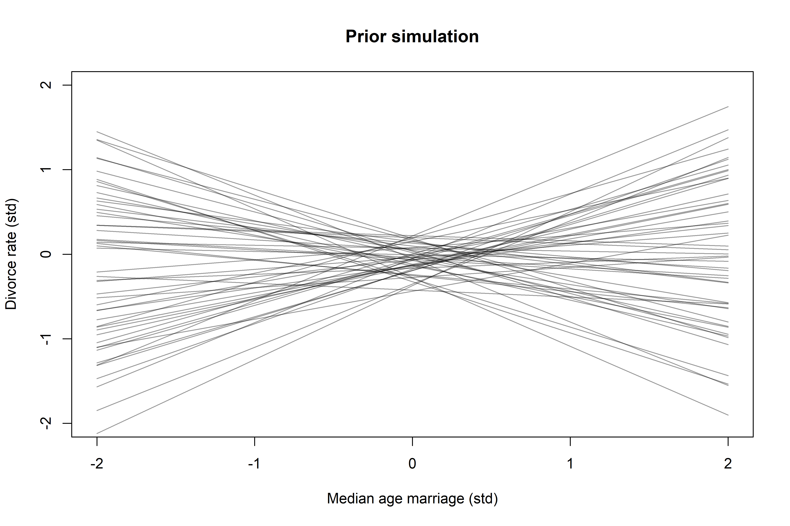
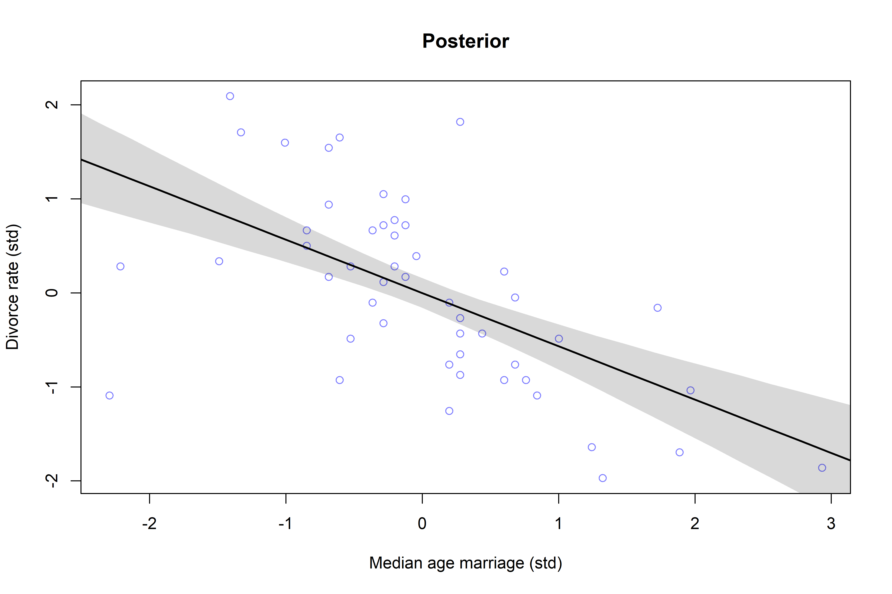
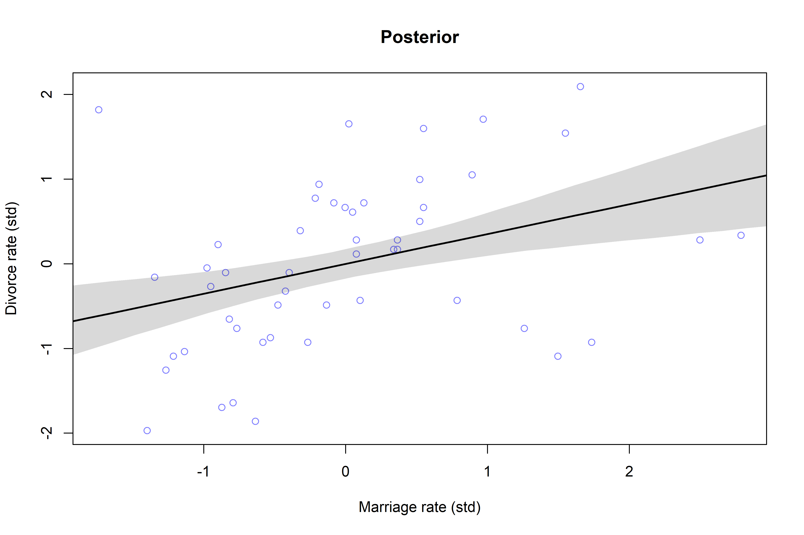
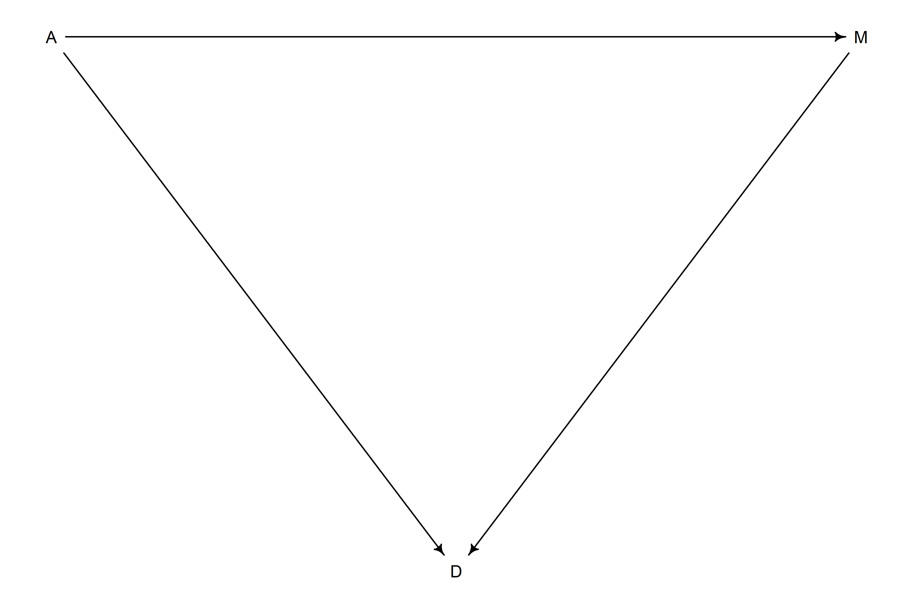
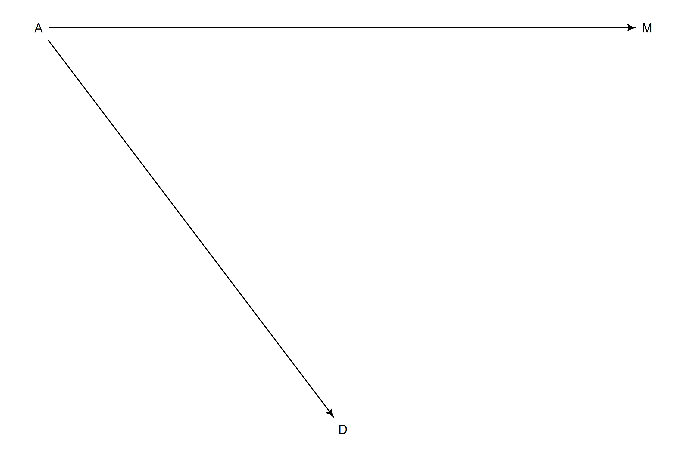
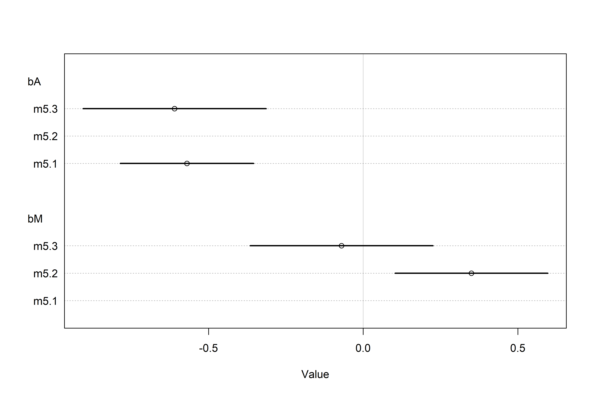
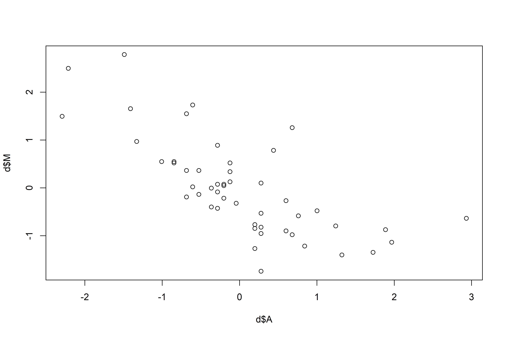
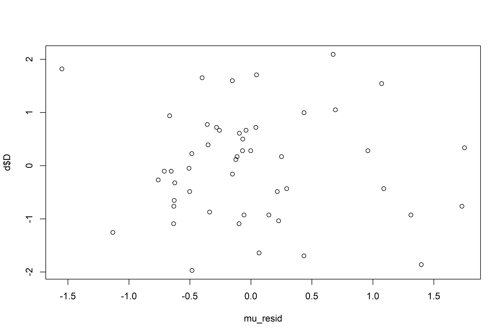

The Many Variables & The Spurious Waffles
================

-   States with the highest number of Waffle Houses also have the
    highest divorce rate.
-   This is a spurious relationship!
-   *Multiple regression* helps deflect spurious relationships (more on
    that later…):
    -   “Control” for confounds
    -   Multiple and complex causation
    -   Interactions

## 5.1 Spurious association

-   The rate that adults marry is a great predictor of divorce rate, but
    does marriage *cause* divorce?

``` r
library(rethinking)
data("WaffleDivorce")
d <- WaffleDivorce

# standardize variables
d$D <- standardize(d$Divorce)
d$M <- standardize(d$Marriage)
d$A <- standardize(d$MedianAgeMarriage)
```

 \\
\mu_i = \alpha + \beta_A A_i \\
\alpha \sim Normal(0, 0.2) \\
\beta_A \sim Normal(0, 0.5) \\
\sigma \sim Exponential(1)
")

``` r
# model
m5.1 <-
  quap(
    alist(D ~ dnorm(mu, sigma),
          mu <- a + bA * A,
          a ~ dnorm(0, 0.2),
          bA ~ dnorm(0, 0.5),
          sigma ~ dexp(1)),
    data = d
  )

# simulate from priors:
set.seed(10)
prior <- extract.prior(m5.1)
mu <- link(m5.1, post = prior, data = list(A = c(-2, 2)))

# plot!
plot(NULL, 
     xlim = c(-2,2), 
     ylim = c(-2,2),
     xlab = "Median age marriage (std)",
     ylab = "Divorce rate (std)",
     main = "Prior simulation")

for (i in 1:50) lines(c(-2,2), mu[i,], col = col.alpha("black", 0.4))
```

<!-- -->

``` r
# plotting function for posterior:


# compute percentile interval of mean
A_seq <- seq(from = -3, to = 3.2, length.out = 30)
mu <- link(m5.1, data = list(A = A_seq))
mu.mean <- apply(mu, 2, mean)
mu.PI <- apply(mu, 2, PI)

# plot it all!
plot(D ~ A,
     data = d,
     col = rangi2,
     xlab = "Median age marriage (std)",
     ylab = "Divorce rate (std)",
     main = "Posterior")

lines(A_seq,
      mu.mean,
      lwd = 2)

shade(mu.PI, A_seq)
```

<!-- -->

``` r
# model divorce rate as a fn of marriage rate
m5.2 <-
  quap(
    alist(D ~ dnorm(mu, sigma),
          mu <- a + bM * M,
          a ~ dnorm(0, 0.2),
          bM ~ dnorm(0, 0.5),
          sigma ~ dexp(1)),
    data = d
  )

# plot posterior for m5.2
M_seq <- seq(from = -2, to = 3, length.out = 30)
mu <- link(m5.2, data = list(M = M_seq))
mu.mean <- apply(mu, 2, mean)
mu.PI <- apply(mu, 2, PI)

plot(D ~ M,
     data = d,
     col = rangi2,
     xlab = "Marriage rate (std)",
     ylab = "Divorce rate (std)",
     main = "Posterior")

lines(M_seq,
      mu.mean,
      lwd = 2)

shade(mu.PI, M_seq)
```

<!-- -->

-   There is a weakly positive relationship between marriage and divorce
    rates, and a negative relationship between median age at marriage
    and divorce rate.
-   Comparing these single-variable models separately isn’t great — they
    could both provide value, be redundant, or one can eliminate the
    value of the other.
-   Goal: think *causally*, then fit a bigger regression.

### 5.1.1 Think before you regress

-   Three variables at play: D, M, and A.
-   A *Directed Acyclic Graph* (DAG) can help us think about the
    relationship between the variables.
-   A possible DAG for the divorce rate example could be:

``` r
library(dagitty)
dag5.1 <- dagitty("dag{A -> D; A -> M; M -> D}")
coordinates(dag5.1) <- 
  list(x = c(A = 0, D = 1, M = 2),
       y = c(A = 0, D = 1, M = 0))

drawdag(dag5.1)
```

<!-- -->

-   In this diagram, age influences divorce rates in two ways: directly
    (A -\> D) and indirectly through marriage rates (A -\> M -\> D)
-   To infer the strength of these different arrows, we’d need more than
    one model. `m5.1` only shows the *total* influence of age at
    marriage on the divorce rate (direct and indirect). It could
    possible that there is no direct effect and it is associated with D
    entirely through the indirect path. This is known as *mediation*.
-   Another alternative is that there is no relationship between M & D
    (this is still consistent with `m5.2`, because M in this DAG picks
    up information from A):

``` r
dag5.2 <- dagitty("dag{A -> M; A -> D}")
coordinates(dag5.2) <- coordinates(dag5.1)
drawdag(dag5.2)
```

<!-- -->

-   So, which is it?

### 5.1.2 Testable implications

-   To compare multiple probable causal model, we need to first consider
    the *testable implications* of each model. Consider the two DAGs
    above.
-   Any DAG may imply that some variables are independent of others
    under certain conditions (*conditional independencies*).
-   Conditional independencies come in two forms:
    1.  Statements of which variables should be associated with one
        another (or not) in the data.
    2.  Statements of which variables become dis-associated when we
        condition on some other set of variables.
-   For example, conditioning on a variable *Z* means learning it’s
    value, then asking if *X* adds any additional information about *Y*.
    If learning *X* doesn’t give you more information about *Y*, then
    *Y* is independent of *X* conditional on *Z*.
-   For `dag5.1`, every pair of variables is correlated (there is a
    causal arrow between every pair). Before we condition on anything,
    everything is associated with everything else.


-   In `dag5.2`, *M* has no influence on *D*, though *M* and *D* are
    associated via *A*. If we condition on *A*, *D* should be
    independent of *M*, because according to this DAG, *D* and *M* have
    no direct connection.


``` r
# returns nothing! because there are *no* conditional independencies (everything is connected!)
impliedConditionalIndependencies(dag5.1)

# returns 1 conditional independency between D and M conditioned on A
impliedConditionalIndependencies(dag5.2)
```

    ## D _||_ M | A

-   We can test this conditional independency! We first need a
    statistical model that conditions on *A* so we can see whether that
    renders *D* independent of *M*.
-   Multiple regression can help answer the question: *After I know the
    age at marriage, what additional value is there in also knowing the
    marriage rate?*

### 5.1.3 Multiple regression notation

1.  Nominate the predictor variables you want in the linear model of
    mean.
2.  For each predictor, make a parameter that will measure its
    conditional association with the outcome.
3.  Multiply the parameter by the variable and add that term to the
    linear model.

-   For the divorce case:

 \\
\mu_i = \alpha + \beta_M M_i + \beta_A A_i \\
\alpha \sim Normal(0, 0.2) \\
\beta_M \sim Normal(0, 0.5) \\
\beta_A \sim Normal(0, 0.5) \\
\sigma \sim Exponential(1)
")

-   One note — the mechanical definition of the model above doesn’t map
    onto a unique causal meaning (we’ll return to that later).
-   We can also write this in terms of compact notation / in terms of a
    design matrix:


-   In the design matrix, *m* is a vector of predicted means, *b* is a
    (column) vector of parameters, and *X* is a matrix with an extra
    first column for the intercept
    ().
-   Matrix multiplication can be performed in R with the `%*%` operator.

### 5.1.4 Approximating the posterior

``` r
m5.3 <-
  quap(
    alist(D ~ dnorm(mu, sigma),
          mu <- a + bM*M + bA*A,
          a ~ dnorm(0, 0.2),
          bM ~ dnorm(0, 0.5),
          bA ~ dnorm(0, 0.5),
          sigma ~ dexp(1)),
    data = d
  )

precis(m5.3)
```

    ##                mean         sd       5.5%      94.5%
    ## a      6.145791e-06 0.09707503 -0.1551385  0.1551508
    ## bM    -6.539899e-02 0.15077111 -0.3063603  0.1755624
    ## bA    -6.135264e-01 0.15098166 -0.8548242 -0.3722285
    ## sigma  7.851074e-01 0.07784077  0.6607028  0.9095120

-   The posterior mean for marriage rate, `bM`, is close to 0 with
    plenty of probability on both sides of 0.
-   The posterior mean for age at marriage, `bA`, is essentially
    unchanged.

``` r
coeftab_plot(coeftab(m5.1, m5.2, m5.3), pars = c("bA", "bM"))
```

<!-- -->

-   *Once we know the median age at marriage for a State, there is
    little or no additional predictive power in also knowing the rate of
    marriage in that State!*
-   Using DAG notation,
    
-   Since the first DAG did not imply this result, it is out!
-   Every DAG implies a simulation, and such simulations can help to
    design models to correctly infer relationships among variables:

### 5.1.5 Plotting multivariate posteriors

-   There’s a huge body of literature around visualizing the results of
    multiple linear regression, but in this book we’’l look at just a
    few:
    1.  *Predictor residual plots*
    2.  *Posterior predictive plots*
    3.  *Counterfactual plots* (implied predictions for imaginary
        experiments)

#### 5.1.5.1 Predictor residual plots

-   A predictor residual is the average prediction error when we use all
    of the other variables to model a predictor of interest.
-   For example, use *all other predictors* to predict *M*, and *use all
    other predictors* to predict *A*:

 \\
\mu_i = \alpha + \beta A_i \\
\alpha \sim Normal(0, 0.2) \\
\beta \sim Normal(0, 0.5) \\ 
\sigma \sim Exponential(1)
")

``` r
# model marriage rate based on median age at marriage
m5.4 <-
  quap(
    alist(M ~ dnorm(mu, sigma),
          mu <- a + bAM*A,
          a ~ dnorm(0, 0.2),
          bAM ~ dnorm(0, 0.5),
          sigma ~ dexp(1)),
    data = d
  )

# linque 
mu <- link(m5.4)
mu_mean <- apply(mu, 2, mean)
mu_resid <- d$M - mu_mean

plot(d$A, d$M)
```

<!-- -->

``` r
# plotting residuals of M ~ A against divorce rate plots the linear relationship 
# between divorce and marriage rates, having already conditioned on the age at marriage
plot(mu_resid, d$D)
```

<!-- -->

-   This procedure basically lets us *subtract out* the influence of
    other predictors.
