The Many Variables & The Spurious Waffles
================

-   States with the highest number of Waffle Houses also have the
    highest divorce rate.
-   This is a spurious relationship!
-   *Multiple regression* helps deflect spurious relationships (more on
    that later…):
    -   “Control” for confounds
    -   Multiple and complex causation
    -   Interactions

## 5.1 Spurious association

-   The rate that adults marry is a great predictor of divorce rate, but
    does marriage *cause* divorce?

``` r
library(rethinking)
data("WaffleDivorce")
d <- WaffleDivorce

# standardize variables
d$D <- standardize(d$Divorce)
d$M <- standardize(d$Marriage)
d$A <- standardize(d$MedianAgeMarriage)
```

$$
\\begin{gather}
D_i \\sim Normal(\\mu_i, \\sigma) \\\\
\\mu_i = \\alpha + \\beta_A A_i \\\\
\\alpha \\sim Normal(0, 0.2) \\\\
\\beta_A \\sim Normal(0, 0.5) \\\\
\\sigma \\sim Exponential(1)
\\end{gather}
$$

``` r
# model
m5.1 <-
  quap(
    alist(D ~ dnorm(mu, sigma),
          mu <- a + bA * A,
          a ~ dnorm(0, 0.2),
          bA ~ dnorm(0, 0.5),
          sigma ~ dexp(1)),
    data = d
  )

# simulate from priors:
set.seed(10)
prior <- extract.prior(m5.1)
mu <- link(m5.1, post = prior, data = list(A = c(-2, 2)))

# plot!
plot(NULL, 
     xlim = c(-2,2), 
     ylim = c(-2,2),
     xlab = "Median age marriage (std)",
     ylab = "Divorce rate (std)",
     main = "Prior simulation")

for (i in 1:50) lines(c(-2,2), mu[i,], col = col.alpha("black", 0.4))
```

<!-- -->

``` r
# plotting function for posterior:


# compute percentile interval of mean
A_seq <- seq(from = -3, to = 3.2, length.out = 30)
mu <- link(m5.1, data = list(A = A_seq))
mu.mean <- apply(mu, 2, mean)
mu.PI <- apply(mu, 2, PI)

# plot it all!
plot(D ~ A,
     data = d,
     col = rangi2,
     xlab = "Median age marriage (std)",
     ylab = "Divorce rate (std)",
     main = "Posterior")

lines(A_seq,
      mu.mean,
      lwd = 2)

shade(mu.PI, A_seq)
```

<!-- -->

``` r
# model divorce rate as a fn of marriage rate
m5.2 <-
  quap(
    alist(D ~ dnorm(mu, sigma),
          mu <- a + bM * M,
          a ~ dnorm(0, 0.2),
          bM ~ dnorm(0, 0.5),
          sigma ~ dexp(1)),
    data = d
  )

# plot posterior for m5.2
M_seq <- seq(from = -2, to = 3, length.out = 30)
mu <- link(m5.2, data = list(M = M_seq))
mu.mean <- apply(mu, 2, mean)
mu.PI <- apply(mu, 2, PI)

plot(D ~ M,
     data = d,
     col = rangi2,
     xlab = "Marriage rate (std)",
     ylab = "Divorce rate (std)",
     main = "Posterior")

lines(M_seq,
      mu.mean,
      lwd = 2)

shade(mu.PI, M_seq)
```

<!-- -->

-   There is a weakly positive relationship between marriage and divorce
    rates, and a negative relationship between median age at marriage
    and divorce rate.
-   Comparing these single-variable models separately isn’t great — they
    could both provide value, be redundant, or one can eliminate the
    value of the other.
-   Goal: think *causally*, then fit a bigger regression.

### 5.1.1 Think before you regress

-   Three variables at play: D, M, and A.
-   A *Directed Acyclic Graph* (DAG) can help us think about the
    relationship between the variables.
-   A possible DAG for the divorce rate example could be:

``` r
library(dagitty)
dag5.1 <- dagitty("dag{A -> D; A -> M; M -> D}")
coordinates(dag5.1) <- 
  list(x = c(A = 0, D = 1, M = 2),
       y = c(A = 0, D = 1, M = 0))

drawdag(dag5.1)
```

<!-- -->

-   In this diagram, age influences divorce rates in two ways: directly
    (A -\> D) and indirectly through marriage rates (A -\> M -\> D)
-   To infer the strength of these different arrows, we’d need more than
    one model. `m5.1` only shows the *total* influence of age at
    marriage on the divorce rate (direct and indirect). It could
    possible that there is no direct effect and it is associated with D
    entirely through the indirect path. This is known as *mediation*.
-   Another alternative is that there is no relationship between M & D
    (this is still consistent with `m5.2`, because M in this DAG picks
    up information from A):

``` r
dag5.2 <- dagitty("dag{A -> M; A -> D}")
coordinates(dag5.2) <- coordinates(dag5.1)
drawdag(dag5.2)
```

<!-- -->

-   So, which is it?

### 5.1.2 Testable implications

-   To compare multiple probable causal model, we need to first consider
    the *testable implications* of each model. Consider the two DAGs
    above.
-   Any DAG may imply that some variables are independent of others
    under certain conditions (*conditional independencies*).
-   Conditional independencies come in two forms:
    1.  Statements of which variables should be associated with one
        another (or not) in the data.
    2.  Statements of which variables become dis-associated when we
        condition on some other set of variables.
-   For example, conditioning on a variable *Z* means learning it’s
    value, then asking if *X* adds any additional information about *Y*.
    If learning *X* doesn’t give you more information about *Y*, then
    *Y* is independent of *X* conditional on *Z*.
-   For `dag5.1`, every pair of variables is correlated (there is a
    causal arrow between every pair). Before we condition on anything,
    everything is associated with everything else.

$$
\\begin{gather}
D \\not\\!\\perp\\!\\!\\!\\perp A \\\\
D \\not\\!\\perp\\!\\!\\!\\perp M \\\\
A \\not\\!\\perp\\!\\!\\!\\perp M
\\end{gather}
$$

-   In `dag5.2`, *M* has no influence on *D*, though *M* and *D* are
    associated via *A*. If we condition on *A*, *D* should be
    independent of *M*, because according to this DAG, *D* and *M* have
    no direct connection.

$$
\\begin{gather}
D \\!\\perp\\!\\!\\!\\perp M \| A
\\end{gather}
$$

``` r
# returns nothing! because there are *no* conditional independencies (everything is connected!)
impliedConditionalIndependencies(dag5.1)

# returns 1 conditional independency between D and M conditioned on A
impliedConditionalIndependencies(dag5.2)
```

    ## D _||_ M | A

-   We can test this conditional independency! We first need a
    statistical model that conditions on *A* so we can see whether that
    renders *D* independent of *M*.
-   Multiple regression can help answer the question: *After I know the
    age at marriage, what additional value is there in also knowing the
    marriage rate?*

### 5.1.3 Multiple regression notation

1.  Nominate the predictor variables you want in the linear model of
    mean.
2.  For each predictor, make a parameter that will measure its
    conditional association with the outcome.
3.  Multiply the parameter by the variable and add that term to the
    linear model.

-   For the divorce case:

$$
\\begin{gather}
D_i \\sim Normal(\\mu_i, \\sigma) \\\\
\\mu_i = \\alpha + \\beta_M M_i + \\beta_A A_i \\\\
\\alpha \\sim Normal(0, 0.2) \\\\
\\beta_M \\sim Normal(0, 0.5) \\\\
\\beta_A \\sim Normal(0, 0.5) \\\\
\\sigma \\sim Exponential(1)
\\end{gather}
$$

-   One note — the mechanical definition of the model above doesn’t map
    onto a unique causal meaning (we’ll return to that later).
-   We can also write this in terms of compact notation / in terms of a
    design matrix:

$$
\\begin{gather}
\\mu_i = \\alpha + \\sum\_{j = 1}^n \\beta_j x\_{ji} 
\\end{gather}
$$
$$
\\begin{gather}
m = Xb
\\end{gather}
$$

-   In the design matrix, *m* is a vector of predicted means, *b* is a
    (column) vector of parameters, and *X* is a matrix with an extra
    first column for the intercept (*α*).
-   Matrix multiplication can be performed in R with the `%*%` operator.

### 5.1.4 Approximating the posterior

``` r
m5.3 <-
  quap(
    alist(D ~ dnorm(mu, sigma),
          mu <- a + bM*M + bA*A,
          a ~ dnorm(0, 0.2),
          bM ~ dnorm(0, 0.5),
          bA ~ dnorm(0, 0.5),
          sigma ~ dexp(1)),
    data = d
  )

precis(m5.3)
```

    ##                mean         sd       5.5%      94.5%
    ## a      6.145791e-06 0.09707503 -0.1551385  0.1551508
    ## bM    -6.539899e-02 0.15077111 -0.3063603  0.1755624
    ## bA    -6.135264e-01 0.15098166 -0.8548242 -0.3722285
    ## sigma  7.851074e-01 0.07784077  0.6607028  0.9095120

-   The posterior mean for marriage rate, `bM`, is close to 0 with
    plenty of probability on both sides of 0.
-   The posterior mean for age at marriage, `bA`, is essentially
    unchanged.

``` r
coeftab_plot(coeftab(m5.1, m5.2, m5.3), pars = c("bA", "bM"))
```

<!-- -->

-   *Once we know the median age at marriage for a State, there is
    little or no additional predictive power in also knowing the rate of
    marriage in that State!*
-   Using DAG notation, *D* ⊥    ⊥ *M*\|*A*
-   Since the first DAG did not imply this result, it is out!
-   Every DAG implies a simulation, and such simulations can help to
    design models to correctly infer relationships among variables:

### 5.1.5 Plotting multivariate posteriors

-   There’s a huge body of literature around visualizing the results of
    multiple linear regression, but in this book we’’l look at just a
    few:
    1.  *Predictor residual plots*
    2.  *Posterior predictive plots*
    3.  *Counterfactual plots* (implied predictions for imaginary
        experiments)

#### 5.1.5.1 Predictor residual plots

-   A predictor residual is the average prediction error when we use all
    of the other variables to model a predictor of interest.
-   For example, use *all other predictors* to predict *M*, and *use all
    other predictors* to predict *A*:

$$
\\begin{gather}
M_i \\sim Normal(\\mu_i, \\sigma) \\\\
\\mu_i = \\alpha + \\beta A_i \\\\
\\alpha \\sim Normal(0, 0.2) \\\\
\\beta \\sim Normal(0, 0.5) \\\\ 
\\sigma \\sim Exponential(1)
\\end{gather}
$$

``` r
# model marriage rate based on median age at marriage
m5.4 <-
  quap(
    alist(M ~ dnorm(mu, sigma),
          mu <- a + bAM*A,
          a ~ dnorm(0, 0.2),
          bAM ~ dnorm(0, 0.5),
          sigma ~ dexp(1)),
    data = d
  )

# linque 
mu <- link(m5.4)
mu_mean <- apply(mu, 2, mean)
mu_resid <- d$M - mu_mean

plot(d$A, d$M)
```

<!-- -->

``` r
# plotting residuals of M ~ A against divorce rate plots the linear relationship 
# between divorce and marriage rates, having already conditioned on the age at marriage
plot(mu_resid, d$D)
```

<!-- -->

-   This procedure basically lets us *subtract out* the influence of
    other predictors.

#### 5.1.5.2 Posterior prediction plots

1.  Did the model correctly approximate the posterior distribution?
2.  How did the model fail?

``` r
# calling link without new data uses original data
mu <- link(m5.3)

# summarise samples across cases
mu_mean <- apply(mu, 2, mean)
mu_PI <- apply(mu, 2, PI)

# simulate observations - no new data supplied so original data used
D_sim <- sim(m5.3, n = 1e4)
D_PI <- apply(D_sim, 2, PI)

# plot!
plot(mu_mean ~ d$D,
     col = rangi2,
     ylim = range(mu_PI),
     xlab = "Observed divorce",
     ylab = "Predicted divorce")

# add y = x ref line
abline(a = 0, b = 1, lty = 2)

# add preds
for (i in 1:nrow(d)) lines(rep(d$D[i], 2), mu_PI[,i], col = rangi2)
```

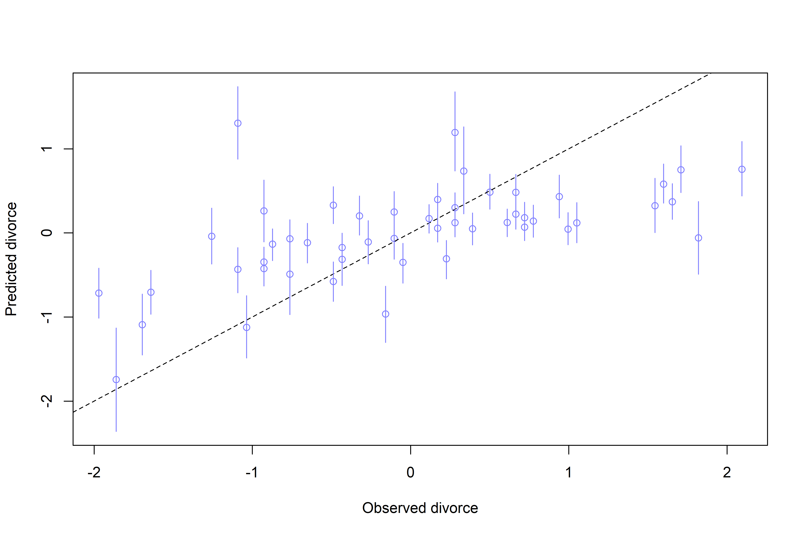<!-- -->

#### 5.1.5.3 Counterfactual plots

-   Counterfacutal plots display the causal implications of the model.
    For example, there are no states with a high median age at marriage
    and high marriage rate, but we can ask about that hypothetical.
-   Simplest use case is to see how the outcome would change as you
    change one predictor at a time
-   To generate:
    1.  Pick a variable to manipulate (the intervention variable)
    2.  Define the range of values to set the intervention variable to.
    3.  For each value of the intervention variable/each sample in the
        posterior, simulate the values of other variables (including the
        outcome).
-   Let’s use this DAG:

``` r
drawdag(dag5.1)
```

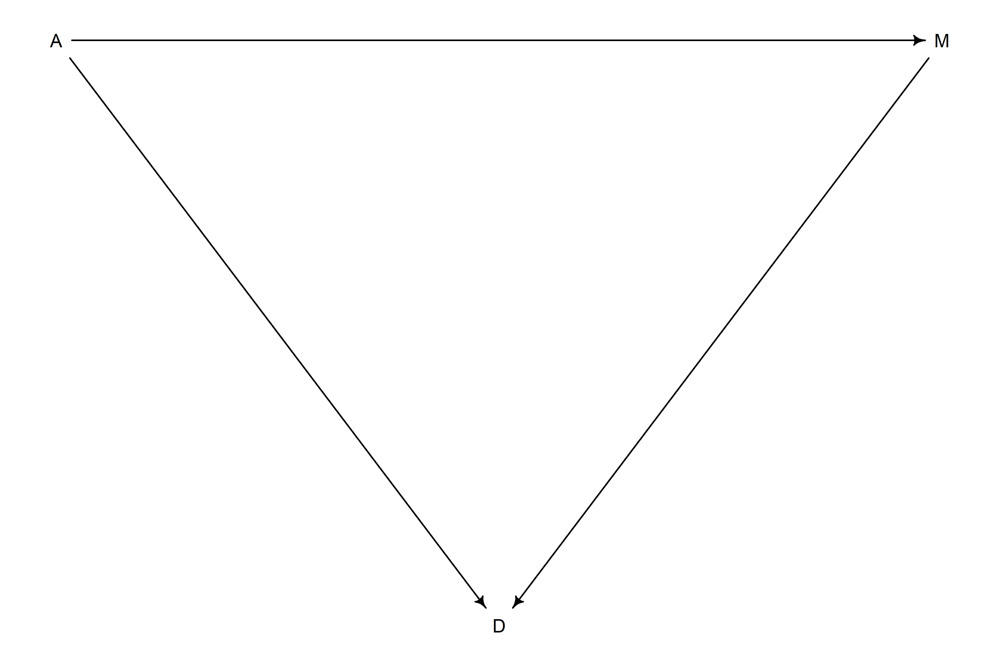<!-- -->

-   We’ll need a new model for this DAG, since `m5.3` ignored the
    assumption that *A* influences *M*.

``` r
m5.3_A <-
  quap(
    alist(D ~ dnorm(mu, sigma),
          mu <- a + bM*M + bA*A,
          a ~ dnorm(0, 0.2),
          bM ~ dnorm(0, 0.5),
          bA ~ dnorm(0, 0.5),
          sigma ~ dexp(1),
          # A -> M portion of DAG
          M ~ dnorm(mu_M, sigma_M),
          mu_M <- aM + bAM*A,
          aM ~ dnorm(0, 0.2),
          bAM ~ dnorm(0, 0.5),
          sigma_M ~ dexp(1)),
    data = d
  )

precis(m5.3_A)
```

    ##                  mean         sd       5.5%      94.5%
    ## a        1.580272e-08 0.09707605 -0.1551463  0.1551463
    ## bM      -6.538073e-02 0.15077309 -0.3063452  0.1755838
    ## bA      -6.135135e-01 0.15098363 -0.8548145 -0.3722125
    ## sigma    7.851182e-01 0.07784344  0.6607093  0.9095270
    ## aM      -1.903995e-08 0.08684788 -0.1387997  0.1387997
    ## bAM     -6.947376e-01 0.09572699 -0.8477278 -0.5417474
    ## sigma_M  6.817373e-01 0.06758016  0.5737312  0.7897434

-   Now let’s simulate what would happen if we manipulate A:

``` r
# range of values for A
A_seq <- seq(from = -2, to = 2, length.out = 30)

# simulate M & D 
# note - M is simulated ahead of D, because the causal diagram references the 
# joint influence of A/M on D
sim_dat <- data.frame(A = A_seq)
s <- sim(m5.3_A, data = sim_dat, vars = c("M", "D"))

# plot!
plot(sim_dat$A, 
     colMeans(s$D), 
     ylim = c(-2, 2), 
     type = "l",
     xlab = "manipulated A",
     ylab = "counterfacutal D")

shade(apply(s$D, 2, PI), sim_dat$A)
mtext("Total conterfactual effect of A on D")
```

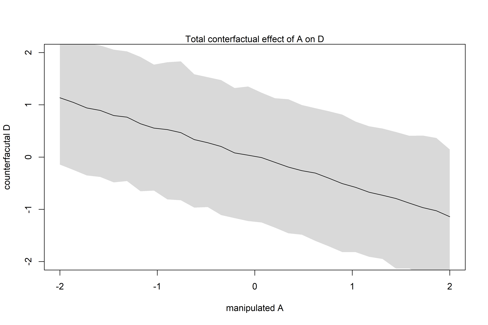<!-- -->

``` r
# plot!
plot(sim_dat$A, 
     colMeans(s$M), 
     ylim = c(-2, 2), 
     type = "l",
     xlab = "manipulated A",
     ylab = "counterfacutal M")

shade(apply(s$M, 2, PI), sim_dat$A)
mtext("Conterfactual effect A -> D")
```

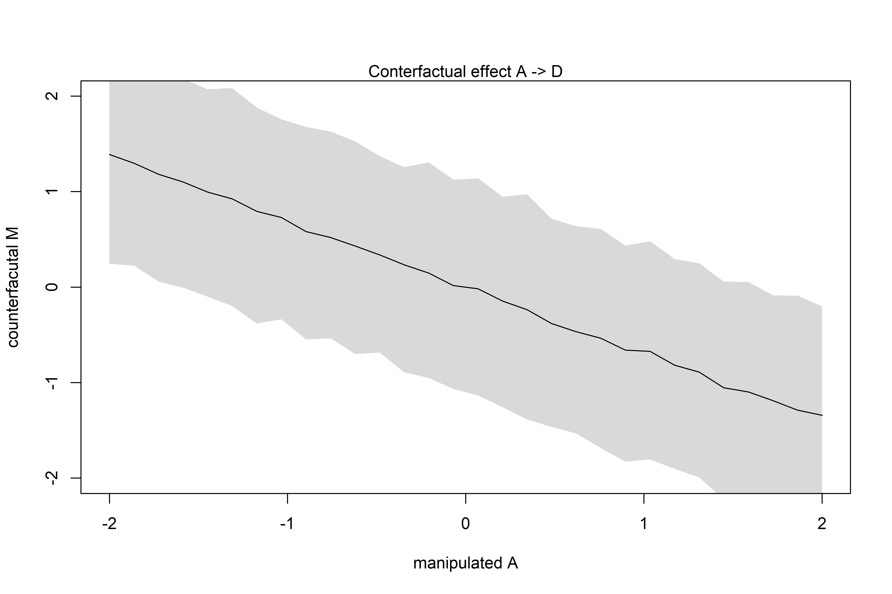<!-- -->

-   The total counterfactual effect (left) includes both pahts: A -\> D
    and A -\> M -\> D.
-   M -\> D is pretty small, so the second path doesn’t contribute much
    trend.

``` r
# the expected causal effect of increasing median age at marriage from 20 to 30
# (standardized to mean 26.1 and std dev 1.24)
sim2_dat <- data.frame(A = (c(20, 30) - 26.1)/1.24)
s2 <- sim(m5.3_A, data = sim2_dat, vars = c("M", "D"))

mean(s2$D[,2] - s2$D[,1])
```

    ## [1] -4.575098

-   That’s a huge effect (\~4.5 std deviations) — probably impossibly
    large.
-   When simulating counterfactuals, manipulating some variable *X* can
    break the causal influence of other variables on *X*.
-   For example, manipulating *M* directly deletes the arrow from *A* to
    *M* because when we control values for *M* directly, we don’t
    include the influence of *A*.

``` r
sim_dat <- 
  data.frame(M = seq(from = -2, to = 2, length.out = 30),
             A = 0)

s <-
  sim(m5.3_A, data = sim_dat, vars = "D")

plot(sim_dat$M, 
     colMeans(s),
     ylim = c(-2, 2),
     type = "l",
     xlab = "manipulated M",
     ylab = "counterfactual D")

shade(apply(s, 2, PI), sim_dat$M)
mtext("Total counterfactual effect of M on D")
```

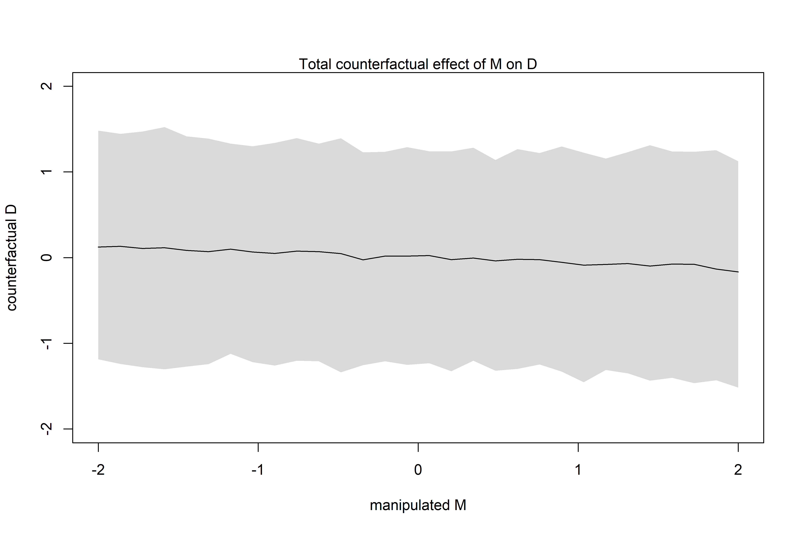<!-- -->

-   Above, we don’t simulate *A*, because *M* doesn’t influence it.
-   Because there is no strong evidence for a strong influence of *M* on
    *D*, the trend is pretty flat/weak!

## 5.2 Masked Relationship

``` r
data("milk")
d <- milk
str(d)
```

    ## 'data.frame':    29 obs. of  8 variables:
    ##  $ clade         : Factor w/ 4 levels "Ape","New World Monkey",..: 4 4 4 4 4 2 2 2 2 2 ...
    ##  $ species       : Factor w/ 29 levels "A palliata","Alouatta seniculus",..: 11 8 9 10 16 2 1 6 28 27 ...
    ##  $ kcal.per.g    : num  0.49 0.51 0.46 0.48 0.6 0.47 0.56 0.89 0.91 0.92 ...
    ##  $ perc.fat      : num  16.6 19.3 14.1 14.9 27.3 ...
    ##  $ perc.protein  : num  15.4 16.9 16.9 13.2 19.5 ...
    ##  $ perc.lactose  : num  68 63.8 69 71.9 53.2 ...
    ##  $ mass          : num  1.95 2.09 2.51 1.62 2.19 5.25 5.37 2.51 0.71 0.68 ...
    ##  $ neocortex.perc: num  55.2 NA NA NA NA ...

-   One hypothesis is that primates with larger brains produce more
    energetic milk. Let’s use this as a motivating example for this
    section.

``` r
d$K <- standardize(d$kcal.per.g)
d$N <- standardize(d$neocortex.perc)
d$M <- standardize(log(d$mass))
```

-   First consider a simple regression between kilocalories and
    neocortex percent:

$$
\\begin{gather}
K_i \\sim Normal(\\mu_i, \\sigma) \\\\
\\mu_i = \\alpha + \\beta_N N_i
\\end{gather}
$$

``` r
# vague priors
m5.5_draft <-
  quap(
    alist(K ~ dnorm(mu, sigma),
          mu <- a + bN*N,
          a ~ dnorm(0, 1),
          bN ~ dnorm(0, 1),
          sigma ~ dexp(1)),
    data = d
  )
```

    ## Error in quap(alist(K ~ dnorm(mu, sigma), mu <- a + bN * N, a ~ dnorm(0, : initial value in 'vmmin' is not finite
    ## The start values for the parameters were invalid. This could be caused by missing values (NA) in the data or by start values outside the parameter constraints. If there are no NA values in the data, try using explicit start values.

-   Oh no! missing variables in the training data!

``` r
d$neocortex.perc
```

    ##  [1] 55.16    NA    NA    NA    NA 64.54 64.54 67.64    NA 68.85 58.85 61.69
    ## [13] 60.32    NA    NA 69.97    NA 70.41    NA 73.40    NA 67.53    NA 71.26
    ## [25] 72.60    NA 70.24 76.30 75.49

-   One way to address is to only use *complete cases* (i.e., rows in
    the df where there are no missing data).

``` r
# the tidy equivalent would just be drop_na()
dcc <- d[complete.cases(d$K, d$N, d$M), ]

# re-draft model
m5.5_draft <-
  quap(
    alist(K ~ dnorm(mu, sigma),
          mu <- a + bN*N,
          a ~ dnorm(0, 1),
          bN ~ dnorm(0, 1),
          sigma ~ dexp(1)),
    data = dcc
  )

# plot priors:
prior <- extract.prior(m5.5_draft)
xseq <- c(-2, 2)
mu <- link(m5.5_draft, post = prior, data = list(N = xseq))

plot(NULL, xlim = xseq, ylim = xseq)
for (i in 1:50) lines(xseq, mu[i,], col = col.alpha("black", 0.3))
```

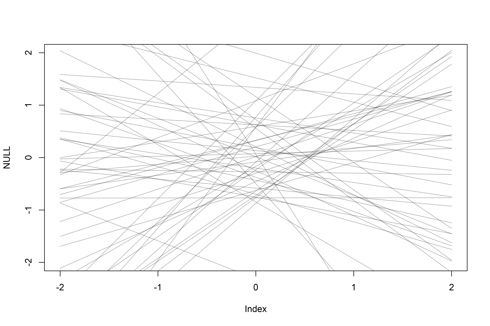<!-- -->

-   Bad prior! let’s tighten it up so we don’t end up producing
    unreasonable relationships

``` r
m5.5 <- 
  quap(
    alist(K ~ dnorm(mu, sigma),
          mu <- a + bN*N,
          a ~ dnorm(0, 0.2),
          bN ~ dnorm(0, 0.5),
          sigma ~ dexp(1)),
    data = dcc
  )

# prior check
prior <- extract.prior(m5.5)
xseq <- c(-2, 2)
mu <- link(m5.5, post = prior, data = list(N = xseq))

plot(NULL, xlim = xseq, ylim = xseq)
for (i in 1:50) lines(xseq, mu[i,], col = col.alpha("black", 0.3))
```

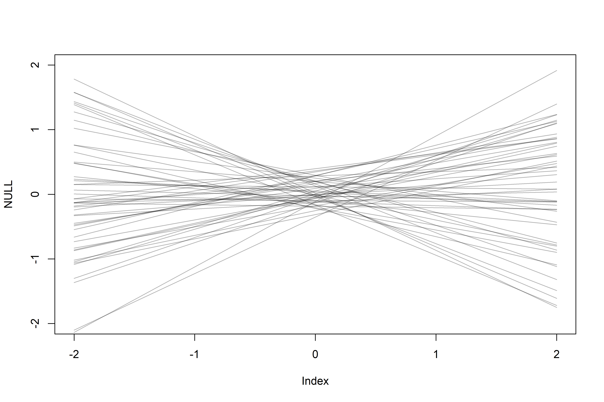<!-- -->

-   Much more reasonable — with two standardized variables, when the
    predictor is 0, the expected value of the outcome should also be 0.

``` r
precis(m5.5)
```

    ##             mean        sd       5.5%     94.5%
    ## a     0.03993992 0.1544908 -0.2069662 0.2868461
    ## bN    0.13323469 0.2237470 -0.2243562 0.4908256
    ## sigma 0.99982102 0.1647083  0.7365853 1.2630567

``` r
# plot
xseq <- seq(from = min(dcc$N) - 0.15,
            to = max(dcc$N) + 0.15,
            length.out = 30)

mu <- link(m5.5, data = list(N = xseq))
mu_mean <- apply(mu, 2, mean)
mu_PI <- apply(mu, 2, PI)
plot(K ~ N, data = dcc)
lines(xseq, mu_mean, lwd = 2)
shade(mu_PI, xseq)
```

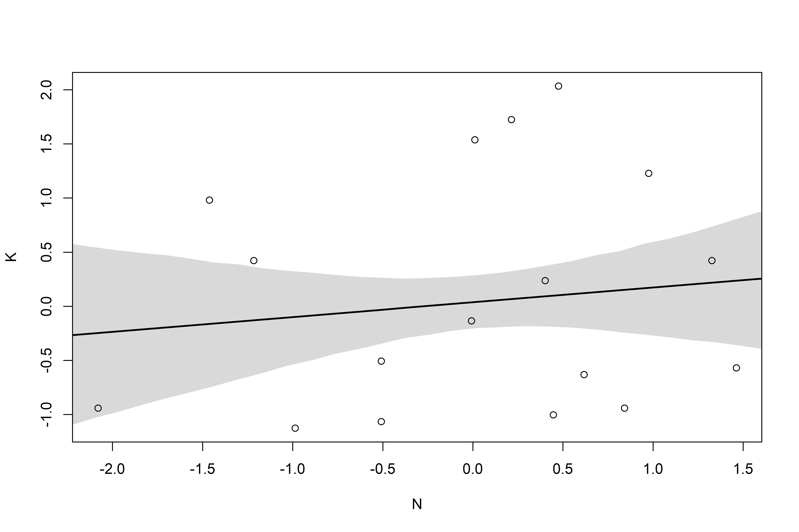<!-- -->

-   Weakly positive relationship, but highly imprecise
-   Adding `log(mass)` as another predictor may be useful!
-   Fist let’s consider a simple model based only on `log(mass)`
    (standardized as `M` in `dcc`).

``` r
m5.6 <-
  quap(
    alist(K ~ dnorm(mu, sigma),
          mu <- a + bM*M,
          a ~ dnorm(0, 0.2),
          bM ~ dnorm(0, 0.5),
          sigma ~ dexp(1)),
    data = dcc
  )

precis(m5.6)
```

    ##              mean        sd       5.5%     94.5%
    ## a      0.04654175 0.1512800 -0.1952330 0.2883165
    ## bM    -0.28253581 0.1928818 -0.5907982 0.0257266
    ## sigma  0.94927958 0.1570616  0.6982648 1.2002943

``` r
# plot
xseq <- seq(from = min(dcc$M) - 0.15,
            to = max(dcc$M) + 0.15,
            length.out = 30)

mu <- link(m5.6, data = list(M = xseq))
mu_mean <- apply(mu, 2, mean)
mu_PI <- apply(mu, 2, PI)
plot(K ~ M, data = dcc)
lines(xseq, mu_mean, lwd = 2)
shade(mu_PI, xseq)
```

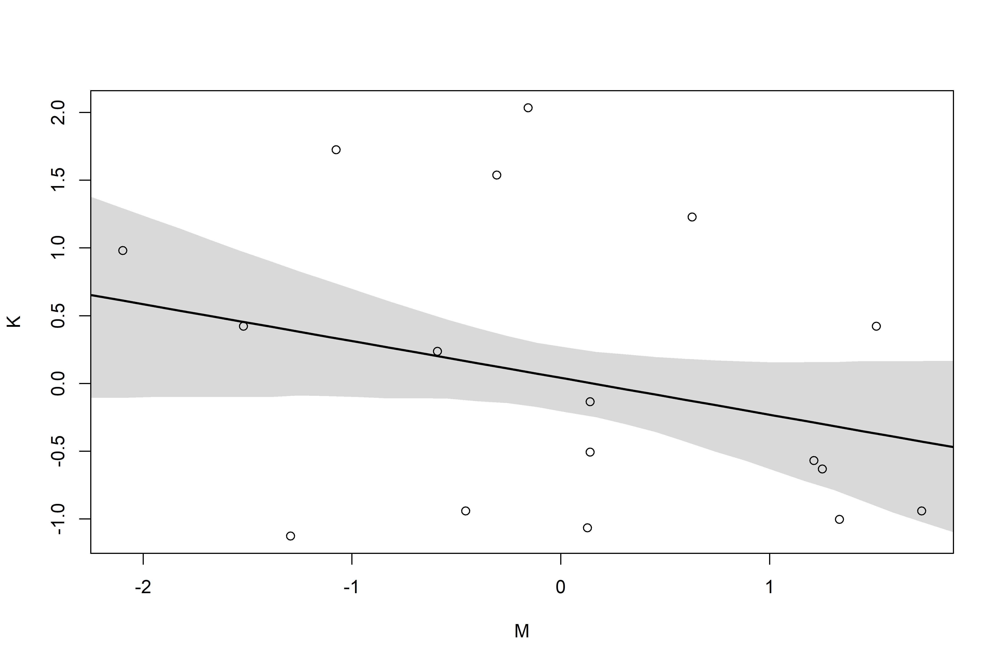<!-- -->

-   A model with both predictors may be more useful:

$$
\\begin{gather}
K_i \\sim Normal(\\mu_i, \\sigma) \\\\ 
\\mu_i = \\alpha + \\beta_N N_i + \\beta_M M_i \\\\
\\alpha \\sim Normal(0, 0.2) \\\\
\\beta_N \\sim Normal(0, 0.5) \\\\
\\beta_M \\sim Normal(0, 0.5) \\\\
\\sigma \\sim Exponential(1)
\\end{gather}
$$

``` r
m5.7 <-
  quap(
    alist(K ~ dnorm(mu, sigma),
          mu <- a + bN*N + bM*M,
          a ~ dnorm(0, 0.2),
          bN ~ dnorm(0, 0.5),
          bM ~ dnorm(0, 0.5),
          sigma ~ dexp(1)),
    data = dcc
  )

precis(m5.7)
```

    ##              mean        sd       5.5%      94.5%
    ## a      0.06800403 0.1339971 -0.1461491  0.2821572
    ## bN     0.67516085 0.2482919  0.2783424  1.0719793
    ## bM    -0.70304210 0.2207795 -1.0558903 -0.3501939
    ## sigma  0.73800018 0.1324559  0.5263100  0.9496904

-   By incorporating both predictors in the regression, the posterior
    association of both with the outcome has increased!

``` r
coeftab_plot(coeftab(m5.5, m5.6, m5.7), pars = c("bM", "bN"))
```

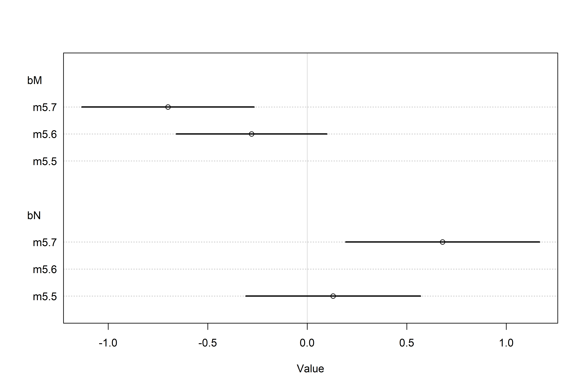<!-- -->

-   A pairs-plot can help appreciate this effect

``` r
pairs(~K + M + N, dcc)
```

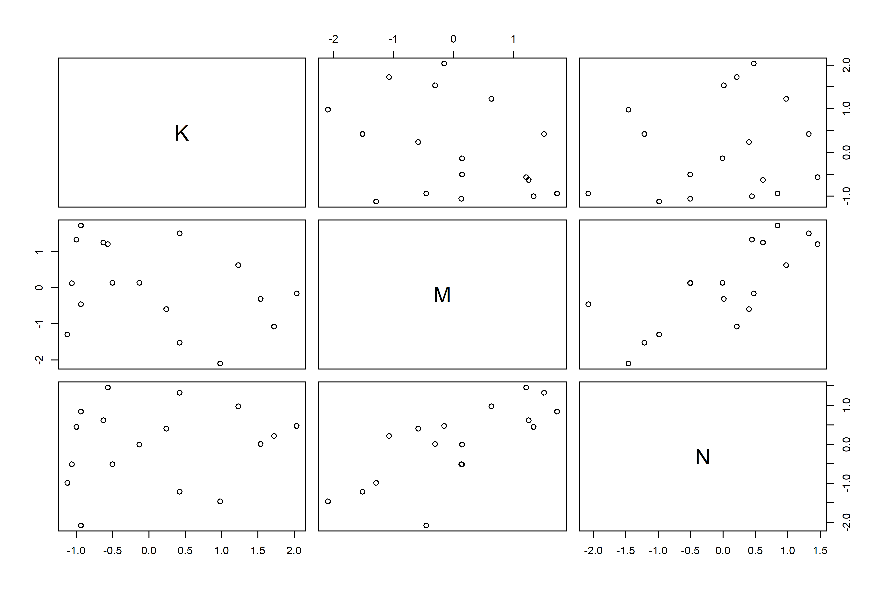<!-- -->

-   Multiple regression automatically finds the most revealing cases and
    uses them to produce inferences.
-   E.g., does a species that has high neocortex percent *for their body
    mass* have higher milk energy/does a species with a high body mass
    *for their neocortex percent* have higher milk energy?
-   There are three DAGs consistent with the data:
    1.  M -\> N; M -\> K; N -\> K;
    2.  N -\> M; N -\> K; M -\> K;
    3.  Unknown -\> M; Unknown -\> N; M -\> K; N -\> K;
-   We can’t tell from the data alone which is right because the graphs
    imply the same set of conditional independencies (in this case, no
    conditional independencies).
-   A set of DAGs with the same conditional independencies is a *Makrov
    Equivalence* set.
-   *Counterfactual plots* can help here:

``` r
# hold N = 0 & adjust body mass
xseq <- seq(from = min(dcc$M) - 0.15,
            to = max(dcc$M) + 0.15,
            length.out = 30)

mu <- link(m5.7, data = data.frame(M = xseq, N = 0))
mu_mean <- apply(mu, 2, mean)
mu_PI <- apply(mu, 2, PI)

plot(NULL, 
     xlim = range(dcc$M), 
     ylim = range(dcc$K),
     xlab = "log body mass (std)",
     ylab = "kilocal per g (std)")
lines(xseq, mu_mean, lwd = 2)
shade(mu_PI, xseq)
mtext("Counterfactual holding N = 0")
```

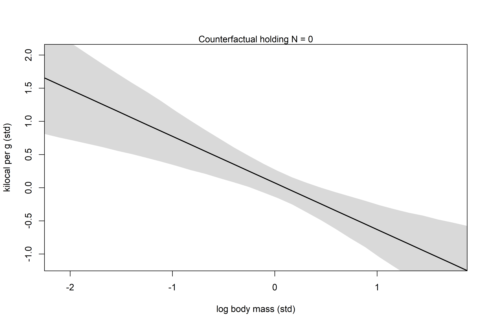<!-- -->

``` r
# hold M = 0 and adjust neocortex percent
xseq <- seq(from = min(dcc$N) - 0.15,
            to = max(dcc$N) + 0.15,
            length.out = 30)

mu <- link(m5.7, data = data.frame(N = xseq, M = 0))
mu_mean <- apply(mu, 2, mean)
mu_PI <- apply(mu, 2, PI)

plot(NULL, 
     xlim = range(dcc$N), 
     ylim = range(dcc$K),
     xlab = "neocortex percent (std)",
     ylab = "kilocal per g (std)")
lines(xseq, mu_mean, lwd = 2)
shade(mu_PI, xseq)
mtext("Counterfactual holding M = 0")
```

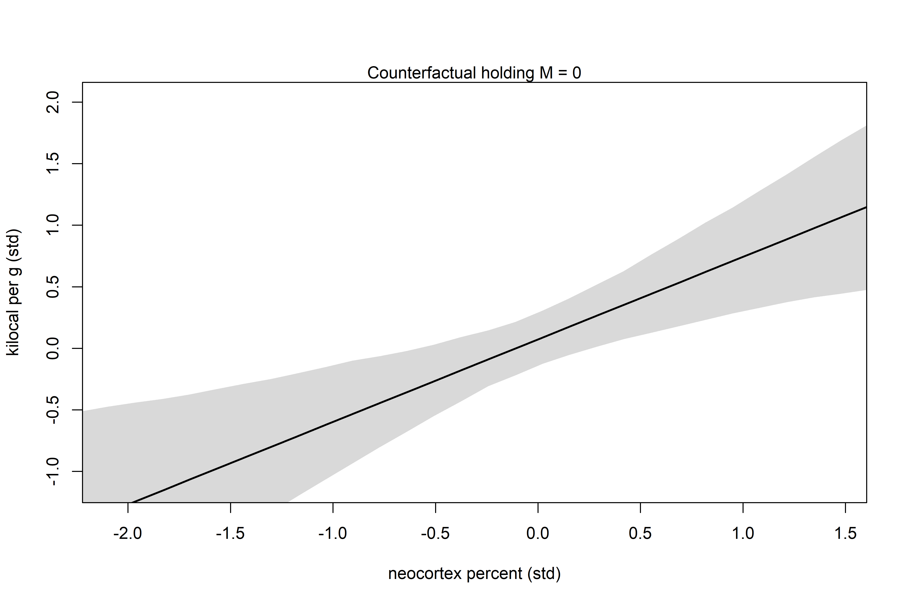<!-- -->

## 5.3 Categorical variables

-   Categories can be either ordered or unordered and are routinely
    included as factors in linear models.

### 5.3.1 Binary categories

-   E.g., *male* and *female* (tsk).
-   Let’s look back at the `Howell1` dataset where we predicted height:

``` r
data("Howell1")
d <- Howell1
str(d)
```

    ## 'data.frame':    544 obs. of  4 variables:
    ##  $ height: num  152 140 137 157 145 ...
    ##  $ weight: num  47.8 36.5 31.9 53 41.3 ...
    ##  $ age   : num  63 63 65 41 51 35 32 27 19 54 ...
    ##  $ male  : int  1 0 0 1 0 1 0 1 0 1 ...

-   Here, the `male` variable is an example of an *indicator variable*
    or *dummy variable*.

$$
\\begin{gather}
h_i \\sim Normal(\\mu_i, \\sigma) \\\\
\\mu_i = \\alpha + \\beta_m m_i \\\\
\\alpha \\sim Normal(178, 20) \\\\
\\beta_m \\sim Normal(0, 10) \\\\
\\sigma \\sim Uniform(0, 50)
\\end{gather}
$$

-   In this approach, *β*<sub>*m*</sub> represents the expected
    *difference* between males and females in height.
-   This also inherently assumes there is more incertainty in one of the
    categories — *male* in this case includes uncertainty in *α* and
    *β*<sub>*m*</sub> whereas *female* just includes uncertainty in *α*.
-   An alternative is to use *index variables*:

``` r
d$sex <- ifelse(d$male == 1, 2, 1)
str(d$sex)
```

    ##  num [1:544] 2 1 1 2 1 2 1 2 1 2 ...

-   Now 1 means female and 2 means male, though no order is applied
    (these are just indeces for the model):

$$
\\begin{gather}
h_i \\sim Normal(\\mu_i, \\sigma) \\\\
\\mu_i = \\alpha\_{SEX\[i\]} \\\\
\\alpha_j \\sim Normal(178, 20) \\\\
\\sigma \\sim Uniform(0, 50)
\\end{gather}
$$

-   This approach creates a list of *α* parameters. This solves the
    problem with priors — we can assign the same prior to each and
    neither category has more uncertainty than the other.

``` r
m5.8 <-
  quap(
    alist(height ~ dnorm(mu, sigma),
          mu <- a[sex],
          a[sex] ~ dnorm(178, 20),
          sigma ~ dunif(0, 50)),
    data = d
  )

precis(m5.8, depth = 2)
```

    ##            mean        sd      5.5%     94.5%
    ## a[1]  134.90645 1.6069829 132.33818 137.47472
    ## a[2]  142.58046 1.6975289 139.86748 145.29344
    ## sigma  27.31085 0.8281097  25.98737  28.63433

-   Interpreting these heights is easy enough, but often we want the
    difference:

``` r
post <- extract.samples(m5.8)
post$diff_fm <- post$a[,1] - post$a[,2]
precis(post, depth = 2)
```

    ##               mean        sd      5.5%      94.5%      histogram
    ## sigma    27.306599 0.8243496  25.99873  28.621726  ▁▁▁▃▇▇▇▃▂▁▁▁▁
    ## a[1]    134.906558 1.6053928 132.34014 137.472159  ▁▁▁▁▂▅▇▇▅▂▁▁▁
    ## a[2]    142.608389 1.6766222 139.90359 145.276287 ▁▁▁▂▃▇▇▇▃▂▁▁▁▁
    ## diff_fm  -7.701831 2.3310666 -11.43884  -3.956669     ▁▁▁▃▇▇▃▁▁▁

### 5.3.2 Many categories

-   In `lm()` (& in `recipes::step_dummy()` from tidymodels), k - 1
    indicator variables are created for k categories.
-   Here, we’ll stick with the index approach.

``` r
# load data & display
data(milk)
d <- milk
levels(d$clade)
```

    ## [1] "Ape"              "New World Monkey" "Old World Monkey" "Strepsirrhine"

``` r
# add an index for the clade variable
d$clade_id <- as.integer(d$clade)

# standardize & model
d$K <- standardize(d$kcal.per.g)
m5.9 <- 
  quap(
    alist(K ~ dnorm(mu, sigma),
          mu <- a[clade_id],
          a[clade_id] ~ dnorm(0, 0.5),
          sigma ~ dexp(1)),
    data = d
  )

precis(m5.9, depth = 2, pars = "a")
```

    ##            mean        sd       5.5%      94.5%
    ## a[1] -0.4843369 0.2176547 -0.8321911 -0.1364827
    ## a[2]  0.3662439 0.2170722  0.0193206  0.7131671
    ## a[3]  0.6750109 0.2575560  0.2633867  1.0866351
    ## a[4] -0.5856626 0.2745281 -1.0244116 -0.1469136

## 5.4 Summary

-   *What is the value of knowing each predictor, once we already know
    the other predictors?*
-   DAGs can represent assumptions from causal inference.
