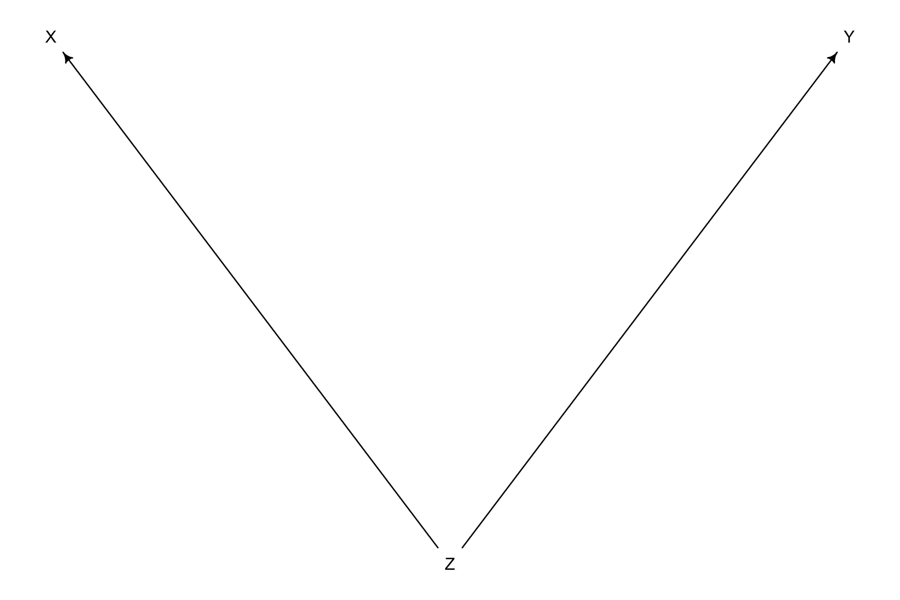

The Haunted DAG & The Causal Terror
================

-   It seems like the most newsworthy scientific studies are the least
    trustworthy.
-   This could actually be the case! *Selection distortion* can
    introduce *Berkson’s Paradox* in published papers:

``` r
set.seed(1914)

# simulate 200 proposals and select the top 10% based on newsworthiness & trustworthiness
N <- 200
p <- 0.1

# newsworthiness and trustworthiness are uncorrelated
nw <- rnorm(N)
tw <- rnorm(N)

# select the top 10% of combined scores
s <- nw + tw 
q <- quantile(s, 1 - p)

selected <- ifelse(s >= q, TRUE, FALSE)

# there's a negative correlation! (see 6.1 on page 162 for graph)
cor(tw[selected], nw[selected])
```

    ## [1] -0.7680083

-   Selection distortion can manifest in other ways (why do so many
    restaurants in good locations have bad food? Well the only way a
    restaurant with less-than-good food can survive is if it’s in a nice
    location).
-   Chucking everything into a regression will not sort out this issue.
-   *Collider bias* can mislead us into believing that there is a
    negative relationship between newsworthiness and trustworthiness in
    general, when it’s actually just a consequence of conditioning on
    some variable.
-   Three different hazards that can arise if we add variables to a
    regression with no regard to a causal model:
    1.  Multicollinearity
    2.  Post-treatment bias
    3.  Collider bias

## 6.1 Multicollinearity

-   *Multicollinearity* means that there is a strong association between
    two or more predictor variables.
-   The consequence of multicollinearity is that the posterior
    distribution will seem to suggest that no variable is reliably
    associated with the outcome, even if *all* are strongly associated
    with the outcome.

### 6.1.1 Multicollinear legs

-   Imagine trying to predict an individual’s height using the length of
    their legs as predictors.
-   Height is assoicated positively with leg length, but when we add two
    legs to the model, something confusing happens!

``` r
library(rethinking)

# simulate 100 people's heights
set.seed(909)
N <- 100
height <- rnorm(N, 10, 2)

# simulate leg length as a proportion of height
leg_prop <- runif(N, 0.4, 0.5)

# simulate right/left leg lengths as proportion + a bit o' error 
leg_left <- leg_prop * height + rnorm(N, 0, 0.02)
leg_right <- leg_prop * height + rnorm(N, 0, 0.02)

d <- data.frame(height, leg_left, leg_right)

# model using very wide priors (ensures weirdness is not driven by priors)
m6.1 <-
  quap(
    alist(height ~ dnorm(mu, sigma),
          mu <- a + bl*leg_left + br*leg_right,
          a ~ dnorm(10, 100),
          bl ~ dnorm(2, 10),
          br ~ dnorm(2, 10),
          sigma ~ dexp(1)),
    data = d
  )

precis(m6.1)
```

    ##            mean         sd       5.5%     94.5%
    ## a     0.9812791 0.28395540  0.5274635 1.4350947
    ## bl    0.2118585 2.52703706 -3.8268348 4.2505518
    ## br    1.7836774 2.53125061 -2.2617500 5.8291047
    ## sigma 0.6171026 0.04343427  0.5476862 0.6865189

``` r
precis_plot(precis(m6.1))
```

<!-- -->

-   It looks like both `bl` and `br` have weak/negligible association
    with `height`, even though we know they both have a strong
    *positive* relationship with `height`!
-   This is because multiple regression is answering the question *What
    is the value of knowing each leg’s length, after already knowing the
    other leg’s length?* The answer is weird, but logical - when we
    already know each leg’s length, the other’s is not important!
-   The posterior distribution for these two variables is also highly
    correlated — when `bl` is large, `br` must be small (& vice-versa):

``` r
post <- extract.samples(m6.1)
plot(bl ~ br, post, col = col.alpha(rangi2, 0.1), pch = 16)
```

<!-- -->

-   Another way to look at it is effectively using *x*<sub>*i*</sub>
    twice (aka, using both legs):

$$
\\begin{gather}
y_i \\sim Normal(\\mu_i, \\sigma) \\\\
\\mu_i = \\alpha + \\beta_1 x_i + \\beta_2 x_i \\\\
\\\\
\\mu_i = \\alpha + (\\beta_1 + \\beta_2) x_i
\\end{gather}
$$

-   The parameters *β*<sub>1</sub> and *β*<sub>2</sub> cannot be pulled
    apart, since they never separately influence the mean *μ*!

``` r
sum_blbr <- post$bl + post$br
dens(sum_blbr, col = rangi2, lwd = 2, xlab = "sum of bl and br")
```

<!-- -->

-   Fitting a regression for only one leg get’s approximately the same
    posterior mean as the sum:

``` r
m6.2 <-
  quap(
    alist(height ~ dnorm(mu, sigma),
          mu <- a + bl*leg_left,
          a ~ dnorm(10, 100),
          bl ~ dnorm(2, 10),
          sigma ~ dexp(1)),
    data = d
  )

precis(m6.2)
```

    ##            mean         sd      5.5%    94.5%
    ## a     0.9979326 0.28364620 0.5446112 1.451254
    ## bl    1.9920676 0.06115704 1.8943269 2.089808
    ## sigma 0.6186038 0.04353998 0.5490185 0.688189

``` r
post <- extract.samples(m6.2)

dens(post$bl, col = rangi2, lwd = 2, xlab = "m6.2: bl")
```

<!-- -->

### 6.1.2 Multicollinear milk

-   The leg length example is clear but a little silly — in real
    datasets we may not anticipate a clash between highly correlated
    predictors.

``` r
# load/prep data
data(milk)
d <- milk
d$K <- standardize(d$kcal.per.g)
d$F <- standardize(d$perc.fat)
d$L <- standardize(d$perc.lactose)

# model kcal/g on % fat
m6.3 <-
  quap(
    alist(K ~ dnorm(mu, sigma),
          mu <- a + bF*F,
          a ~ dnorm(0, 0.2),
          bF ~ dnorm(0, 0.5),
          sigma ~ dexp(1)),
    data = d
  )

# model kcal/g on % lactose
m6.4 <- 
  quap(
    alist(K ~ dnorm(mu, sigma),
          mu <- a + bL*L,
          a ~ dnorm(0, 0.2),
          bL ~ dnorm(0, 0.5),
          sigma ~ dexp(1)),
    data = d
  )

precis(m6.3)
```

    ##                mean         sd       5.5%     94.5%
    ## a     -7.022120e-06 0.07725211 -0.1234708 0.1234568
    ## bF     8.619062e-01 0.08426090  0.7272410 0.9965714
    ## sigma  4.510190e-01 0.05870789  0.3571925 0.5448456

``` r
precis(m6.4)
```

    ##                mean         sd       5.5%      94.5%
    ## a     -1.508376e-06 0.06661605 -0.1064668  0.1064638
    ## bL    -9.024555e-01 0.07132814 -1.0164516 -0.7884594
    ## sigma  3.804634e-01 0.04958200  0.3012218  0.4597050

``` r
precis_plot(precis(m6.3))
```

<!-- -->

``` r
precis_plot(precis(m6.4))
```

<!-- -->

-   The posterior for `bF` and `bL` are basically opposites!
-   We might assume both are strong predictors of total energy in milk,
    but watch what happens when we include both:

``` r
m6.5 <-
  quap(
    alist(K ~ dnorm(mu, sigma),
          mu <- a + bF*F + bL*L,
          a ~ dnorm(0, 0.2),
          bF ~ dnorm(0, 0.5),
          bL ~ dnorm(0, 0.5),
          sigma ~ dexp(1)),
    data = d
  )

precis(m6.5)
```

    ##                mean         sd        5.5%      94.5%
    ## a     -2.389107e-08 0.06603588 -0.10553812  0.1055381
    ## bF     2.435009e-01 0.18357894 -0.04989373  0.5368955
    ## bL    -6.780796e-01 0.18377701 -0.97179075 -0.3843684
    ## sigma  3.767425e-01 0.04918417  0.29813671  0.4553483

``` r
precis_plot(precis(m6.5))
```

<!-- -->

-   The posterior means for both are closer to 0 and the standard
    deviations are twice as large!
-   This is because `perc.fat` and `perc.lactose` contain much of the
    same information:

``` r
pairs(~ kcal.per.g + perc.fat + perc.lactose, data = d, col = rangi2)
```

<!-- -->

-   Both `perc.fat` and `perc.lactose` help in predicting `kcal.per.g`,
    but neither helps as much *once you already know the other*.
-   Some literature suggests various dodgy ways of coping with
    multicollinearity, though few of them take a causal perspective.
    Pairwise correlations are not the problem, it is the conditional
    associations — not correlations — that matter.
-   In this example, there may be some hidden variable, say, density
    (*D*), that determines both the fat (*F*) and lactose (*L*) content.
-   Multicollinearity is in the family of problems known as
    *Non-Identifiability*.
-   Non-identifiable parameters mean that the structure of the
    data/model do not make it possible to estimate the parameter’s
    value.

``` r
# overthinking! simulating collinearity
sim.coll <- function(r = 0.9) {
  
  d$x <- 
    rnorm(nrow(d), 
          mean = r*d$perc.fat, 
          sd = sqrt((1-r^2) * var(d$perc.fat)))
  
  m <- lm(kcal.per.g ~ perc.fat + x, data = d)
  
  sqrt(diag(vcov(m)))[2]
  
}

rep.sim.coll <- function(r = 0.9, n = 100) {
  
  stddev <- replicate(n, sim.coll(r))
  mean(stddev)
  
}

r.seq <- seq(from = 0, to = 0.99, by = 0.01)
stddev <- sapply(r.seq, function(z) rep.sim.coll(r = z, n = 100))
plot(stddev ~ r.seq, type = "l", col = rangi2, lwd = 2, xlab = "correlation")
```

<!-- -->

## 6.2 Post-treatment bias

-   *Omitted variable bias* and *included variable bias* can both
    introduce errors.
-   Included variable bias can take several forms — the first is
    *post-treatment bias*.
-   Consider growing plants in special anti-fungus soil, where we want
    to see if growing in this soil affects final height.
-   Some plants may develop fungus — we shouldn’t include the presence
    of fungus in the model if we want to make a causal inference about
    the soil treatment because the fungus is a *post treatment effect*.

``` r
set.seed(71)

# simulate initial heights of 100 plants
N <- 100
h0 <- rnorm(N, 10, 2)

# assign treatments and simulate fungus and growth
treatment <- rep(0:1, each = N/2)
fungus <- rbinom(N, size = 1, prob = 0.5 - treatment * 0.4)
h1 <- h0 + rnorm(N, 5 - 3*fungus)

d <- data.frame(h0 = h0, h1 = h1, treatment = treatment, fungus = fungus)
precis(d)
```

    ##               mean        sd      5.5%    94.5%    histogram
    ## h0         9.95978 2.1011623  6.570328 13.07874 ▁▂▂▂▇▃▂▃▁▁▁▁
    ## h1        14.39920 2.6880870 10.618002 17.93369     ▁▁▃▇▇▇▁▁
    ## treatment  0.50000 0.5025189  0.000000  1.00000   ▇▁▁▁▁▁▁▁▁▇
    ## fungus     0.23000 0.4229526  0.000000  1.00000   ▇▁▁▁▁▁▁▁▁▂

### 6.2.1 A prior is born

-   In the real world, we may not know the data generating process
    above, but may have information to guide model construction.
-   Even without knowledge of the data generating process, we know that
    plants at time *t* = 1 should be taller than at time *t* = 0. We may
    model the proportion of height to set priors more easily:

$$
\\begin{gather}
h\_{1,i} \\sim Normal(\\mu_i, \\sigma) \\\\
\\mu_i = h\_{0, i} \\times p
\\end{gather}
$$

-   In this case, $p = \\frac{h\_{1,i}}{h\_{0,i}}$. We can set *p* using
    a lognormal distribution, because it is always positive, but will
    allow for *p* to dip below 1 (in case plants shrink!)

``` r
m6.6 <- 
  quap(
    alist(h1 ~ dnorm(mu, sigma),
          mu <- h0*p,
          p ~ dlnorm(0, 0.25),
          sigma ~ dexp(1)),
    data = d
  )

precis(m6.6)
```

    ##           mean         sd     5.5%    94.5%
    ## p     1.426628 0.01759834 1.398503 1.454754
    ## sigma 1.792106 0.12496794 1.592383 1.991829

``` r
precis_plot(precis(m6.6))
```

<!-- -->

-   About \~40% growth, on average. Let’s see what happens when we
    include the soil treatment and presence of fungus in the model:

$$
\\begin{gather}
h\_{1,i} \\sim Normal(\\mu_i, \\sigma) \\\\
\\mu_i = h\_{0,i} \\times p \\\\
p = \\alpha + \\beta_T T_i + \\beta_F F_i \\\\
\\beta_T \\sim Normal(0, 0.5) \\\\
\\beta_F \\sim Normal(0, 0.5) \\\\ 
\\sigma \\sim Exponential(1)
\\end{gather}
$$

``` r
m6.7 <-
  quap(
    alist(h1 ~ dnorm(mu, sigma),
          mu <- h0 * p,
          p <- a + bt*treatment + bf*fungus,
          a ~ dlnorm(0, 0.2),
          bt ~ dnorm(0, 0.5),
          bf ~ dnorm(0, 0.5),
          sigma ~ dexp(1)),
    data = d
  )

precis(m6.7)
```

    ##              mean         sd        5.5%       94.5%
    ## a      1.48139094 0.02451068  1.44221815  1.52056373
    ## bt     0.00241255 0.02986963 -0.04532488  0.05014998
    ## bf    -0.26671805 0.03654770 -0.32512833 -0.20830777
    ## sigma  1.40879638 0.09862052  1.25118174  1.56641102

``` r
precis_plot(precis(m6.7))
```

<!-- -->

-   The treatment, `bt` is solidly 0, but the presences of fungus, `bf`,
    is solidly negative.
-   We know the treatment has a positive effect (because we built the
    simulation that way), so what’s going on here?

### 6.2.2 Blocked by consequence

-   The problem is that `fungus` is mostly a consequence of `treatment`
    (i.e., a *post treatment variable*).
-   When we control for `fungus`, the model is implicitly answering
    *once we already know whether or not a plant developed fungus, does
    soil treatment matter?* The answer is no, because soil treatment has
    its effects on growth by reducing fungus!
-   To measure the treatment properly, we should omit the post treatment
    variable `fungus`:

``` r
m6.8 <-
  quap(
    alist(h1 ~ dnorm(mu, sigma),
          mu <- h0 * p,
          p <- a + bt*treatment,
          a ~ dlnorm(0, 0.2),
          bt ~ dnorm(0, 0.5),
          sigma ~ dexp(1)),
    data = d
  )

precis(m6.8)
```

    ##             mean         sd       5.5%     94.5%
    ## a     1.38035157 0.02517700 1.34011386 1.4205893
    ## bt    0.08499494 0.03429912 0.03017831 0.1398116
    ## sigma 1.74641704 0.12193300 1.55154456 1.9412895

``` r
precis_plot(precis(m6.8))
```

<!-- -->

-   Including post-treatment variables can mask the treatment itself!

### 6.2.3 Fungus and d-separation

``` r
library(dagitty)

plant_dag <-
  dagitty(
    "dag{
      H_0 -> H_1
      F -> H_1
      T -> F
    }"
  )

coordinates(plant_dag) <-
  list(x = c(H_0 = 0, T = 2, F = 1.5, H_1 = 1),
       y = c(H_0 = 0, T = 0, F = 0, H_1 = 0))

drawdag(plant_dag)
```

<!-- -->

-   When we include *F*, the post-treatment effect, in the model, we end
    up blocking the path from the treatment *T* to the outcome,
    *H*<sub>1</sub>.
-   This is the DAG way of saying that learning the treatment tells us
    nothing about the outcome once we know the fungus status.
-   Another DAG way to say this is that conditioning on *F* induces
    *D-separation* (some variables in a directed graph are independent
    of others).
-   Aka, when we condition on *F*, we block the directed path
    *T* → *F* → *H*<sub>1</sub>, which makes *T* and *H*<sub>1</sub>
    independent.

``` r
impliedConditionalIndependencies(plant_dag)
```

    ## F _||_ H_0
    ## H_0 _||_ T
    ## H_1 _||_ T | F

-   Including post-treatment variables can also trick us into thinking
    treatments work. For example:

``` r
plant_dag <-
  dagitty(
    "dag{
      H_0 -> H_1
      M -> H_1
      M -> F
      T -> F
    }"
  )

coordinates(plant_dag) <-
  list(x = c(H_0 = 0, H_1 = 1, F = 2, T = 3, M = 1.5),
       y = c(H_0 = 0, H_1 = 0, F = 0, T = 0, M = 0.5))

drawdag(plant_dag)
```

<!-- -->

-   In this DAG, *M* is an unobserved moisture content variable.
-   A regression of *H*<sub>1</sub> on *T* will show no association
    between treatment and plant growth.
-   If we include *F* in the model, suddenly there will be an
    association!

``` r
# recreate dataframe using M
set.seed(71)
N <- 1000
h0 <- rnorm(N, 10, 2)
treatment <- rep(0:1, each = N/2)
M <- rbern(N)
fungus <- rbinom(N, size = 1, prob = 0.5 - treatment * 0.4 + 0.4 * M)
h1 <- h0 + rnorm(N, 5 + 3*M)
d2 <- data.frame(h0 = h0, h1 = h1, treatment = treatment, fungus = fungus)
```

-   If we rerun `m6.7` and `m6.8` using `d2`, we’ll see that fungus
    confounds inference about the treatment, this time by making it seem
    like it helped plants (even though it actually has no effect!).

``` r
m6.7 <- update(m6.7, data = d2)
m6.8 <- update(m6.8, data = d2)

precis_plot(precis(m6.7))
```

<!-- -->

``` r
precis_plot(precis(m6.8))
```

<!-- -->

-   A quick note — a lot of what we’ve talked about has no downside for
    prediction. Prediction and causal inference are just not the same
    task.

## 6.3 Collider bias

-   Consider a model of Selection for funding (*S*), based on
    Trustworthiness (*T*) and Newsworthiness (*N*).
-   A DAG with two arrows entering *S* shows that *S* is a *collider*:

``` r
funding_dag <-
  dagitty(
    "dag{
      T -> S
      N -> S
    }"
  )

coordinates(funding_dag) <- 
  list(x = c(T = 1, S = 2, N = 3),
       y = c(T = 0, S = 0, N = 0))

drawdag(funding_dag)
```

<!-- -->

-   Colliders create statistical — but not necessarily causal —
    associations among its causes.
-   In this case, once you learn that a proposal has been selected,
    learning its trustworthiness informs you about its newsworthiness.
    Why? Because if a proposal was selected with low trustworthiness,
    then it *must* have high newsworthiness.
-   If we end up including a collider as a predictor, we can generate a
    misleading association in a statistical model and erroneous causal
    inference.

### 6.3.1 Collider of false sorrow

-   Let’s consider how aging influences happiness — if we have a large
    survey of people rating how happy they are, is age associated with
    happiness? If so, is that association causal?
-   If we assume that happiness doesn’t change as age increases, but
    does influence your likelihood of marriage, we can create a causal
    model of marriage:

``` r
marriage_dag <-
  dagitty(
    "dag{
      H -> M
      A -> M
    }"
  )

coordinates(marriage_dag) <-
  list(x = c(H = 1, M = 2, A = 3),
       y = c(H = 0, M = 0, A = 0))

drawdag(marriage_dag)
```

<!-- -->

-   In this case, marriage is a collider. Even though there is no causal
    association between happiness and age, if we include marriage as a
    predictor in a regression, then it will induce a statistical
    relationship between age and happiness.
-   Let’s run a simulation:
    1.  Each year, 20 people are born with uniformly distributed
        happiness values.
    2.  Each year, each person ages one year. Happiness does not change.
    3.  At age 18, individuals can become married. The odds of marriage
        each year are proportional to an individual’s happiness.
    4.  Once married, an individual remains married.
    5.  After age 65, individuals leave the sample (they move to Spain).

``` r
d <- sim_happiness(seed = 1977, N_years = 1000)
precis(d)
```

    ##                    mean        sd      5.5%     94.5%     histogram
    ## age        3.300000e+01 18.768883  4.000000 62.000000 ▇▇▇▇▇▇▇▇▇▇▇▇▇
    ## married    3.007692e-01  0.458769  0.000000  1.000000    ▇▁▁▁▁▁▁▁▁▃
    ## happiness -1.000070e-16  1.214421 -1.789474  1.789474      ▇▅▇▅▅▇▅▇

-   A model exploring the effect of age while controlling for marriage
    status is simply:

*μ*<sub>*i*</sub> = *α*<sub>*M**I**D*\[*i*\]</sub> + *β*<sub>*A*</sub>*A*<sub>*i*</sub>

-   In this case, *M**I**D*\[*i*\] is an index for the marriage status
    of each individual.

``` r
# filter to only adults (18+)
d2 <- d[d$age > 17, ]

# rescale age so that 18 = 0 and 65 = 1:
d2$A <- (d2$age - 18)/(65 - 18)

# add mid as an index (1 or 2) for marriage
d2$mid <- d2$married + 1

# model
m6.9 <-
  quap(
    alist(happiness ~ dnorm(mu, sigma),
          mu <- a[mid] + bA*A,
          a[mid] ~ dnorm(0, 1),
          bA ~ dnorm(0, 2),
          sigma ~ dexp(1)),
    data = d2
  )

precis_plot(precis(m6.9, depth = 2))
```

<!-- -->

-   This model is quite sure that age is negatively associated with
    happiness!
-   Let’s compare inferences with a model that omits marriage status:

``` r
m6.10 <-
  quap(
    alist(happiness ~ dnorm(mu, sigma),
          mu <- a + bA*A,
          a ~ dnorm(0, 1),
          bA ~ dnorm(0, 2),
          sigma ~ dexp(1)),
    data = d2
  )

precis_plot(precis(m6.10))
```

<!-- -->

-   This one finds no association between age and happiness. This is
    exactly what we’d expect when we condition on a collider.
-   If you don’t have a causal model, you can’t make inferences from a
    multiple regression. And the regression itelf doesn’t provide the
    evidence you need to justify a causal model (you need some
    science!).

### 6.3.2 The haunted DAG

-   If we can get our graph sorted, we can avoid collider bias.
-   The problem is that there may be unmeasured causes that induce
    collider bias, and our DAG may be haunted!
-   Suppose we want to infer the influence of grandparents (*G*) and
    parents (*P*) on the educational attainment of children (*C*). Our
    DAG may look like:

``` r
education_dag <-
  dagitty(
    "dag{
      G -> P
      P -> C
      G -> C
    }"
  )

coordinates(education_dag) <-
  list(x = c(G = 0, P = 1, C = 1),
       y = c(G = 0, P = 0, C = 1))

drawdag(education_dag)
```

<!-- -->

-   There may be some unmeasured influence (*U*) common to parents and
    children that is not shared by grandparents (for example, a
    neighborhood parameter, since the parents and children live in the
    same neighborhood but the grandparents do not):

``` r
education_dag <-
  dagitty(
    "dag{
      G -> P
      P -> C
      G -> C
      U -> P
      U -> C
    }"
  )

coordinates(education_dag) <-
  list(x = c(G = 0, P = 1, C = 1, U = 1.5),
       y = c(G = 0, P = 0, C = 1, U = 0.5))

drawdag(education_dag)
```

<!-- -->

-   Now, *P* is a common consequence of *G* and *U*, so if we condition
    on *P* it will bias inference about *G* → *C*, even if we never
    measure *U*.
-   A simulation may be more illustrative:

``` r
# simulate 200 grandparent-parent-child trials:
N <- 200
b_GP <- 1 # direct effect of G on P
b_GC <- 0 # direct effect of G on C
b_PC <- 1 # direct effect of P on C
b_U <- 2  # direct effect of U on P and C

set.seed(1)
U <- 2*rbern(N, 0.5) - 1
G <- rnorm(N)
P <- rnorm(N, b_GP*G + b_U*U)
C <- rnorm(N, b_PC*P + b_GC*G + b_U*U)
d <- data.frame(C = C, P = P, G = G, U = U)

# model on collider P
m6.11 <-
  quap(
    alist(C ~ dnorm(mu, sigma),
          mu <- a + b_PC*P + b_GC*G,
          a ~ dnorm(0, 1),
          c(b_PC, b_GC) ~ dnorm(0, 1),
          sigma ~ dexp(1)),
    data = d
  )

precis(m6.11)
```

    ##             mean         sd       5.5%       94.5%
    ## a     -0.1174752 0.09919574 -0.2760091  0.04105877
    ## b_PC   1.7868915 0.04455355  1.7156863  1.85809664
    ## b_GC  -0.8389537 0.10614045 -1.0085867 -0.66932077
    ## sigma  1.4094891 0.07011139  1.2974375  1.52154063

``` r
precis_plot(precis(m6.11))
```

<!-- -->

-   Surprisingly, the model is confident that the direct effect of
    grandparents is to hurt their grandkids!
-   This is arising because of *Simpson’s Paradox* (see 6.5 on page 182)
-   If we measure *U*, we can remove collider bias:

``` r
m6.12 <-
  quap(
    alist(C ~ dnorm(mu, sigma),
          mu <- a + b_PC*P + b_GC*G + b_U*U,
          a ~ dnorm(0, 1),
          c(b_PC, b_GC, b_U) ~ dnorm(0, 1),
          sigma ~ dexp(1)),
    data = d
  )

# these are the slopes we simulated with
precis(m6.12)
```

    ##              mean         sd       5.5%        94.5%
    ## a     -0.12197510 0.07192588 -0.2369265 -0.007023655
    ## b_PC   1.01161103 0.06597258  0.9061741  1.117047948
    ## b_GC  -0.04081373 0.09728716 -0.1962974  0.114669941
    ## b_U    1.99648992 0.14770462  1.7604294  2.232550439
    ## sigma  1.01959911 0.05080176  0.9384081  1.100790130

``` r
precis_plot(precis(m6.12))
```

<!-- -->

## 6.4 Confronting confounding

-   Confounding is any context in which the association between an
    outcome *Y* and a predictor of interest *X* is not the same as it
    would be if we had experimentally determined *X*.
-   For example, let’s consider the influence of education (*E*) on
    wages (*W*) as confounded by many unobserved variables (*U*):

``` r
education_dag <-
  dagitty(
    "dag{
      U -> E
      U -> W
      E -> W
    }"
  )

coordinates(education_dag) <-
  list(x = c(E = 0, U = 0.5, W = 1),
       y = c(E = 0, U = -0.5, W = 0))

drawdag(education_dag)
```

<!-- -->

-   If we regress *W* on *E* (i.e., predict *W* using *E*), the causal
    effect will be confounded by *U*.
-   We could run an experiment to manually set education levels at
    random (effectively deleting the path *U* → *E*), we could measure
    the causal effect of *E*.
-   There are statistical methods to remove confounding as well — the
    most obvious is to condition on *U*.

### 6.4.1 Shutting the backdoor

-   We want to shut the backdoor for any spurious associations through
    non-causal paths!
-   Given a causal DAG, it is always possible to say which (if any)
    variables one must/must *not* control for in order to shut all the
    backdoor paths.
-   There are also only 4 types of variable relations that combine to
    form all possible paths. Every DAG, no matter how big and
    complicated, is comprised of these four “atomic DAGs”.

1.  **The Fork** *X* ← *Z* → *Y*: If we condition on *Z*, then learning
    *X* tells us nothing about *Y*. *X* and *Y* are independent,
    conditional on *Z*.

``` r
fork <- 
  dagitty(
    "dag{
      Z -> X
      Z -> Y
    }"
  )

coordinates(fork) <-
  list(x = c(X = 1, Z = 2, Y = 3),
       y = c(X = 0, Z = 1, Y = 0))

drawdag(fork)
```

<!-- -->

2.  **The Pipe** *X* → *Z* → *Y*: If we condition on *Z*, we block the
    path from *X* to *Y*:

``` r
pipe <- 
  dagitty(
    "dag{
      X -> Z
      Z -> Y
    }"
  )

coordinates(pipe) <-
  list(x = c(X = 0, Z = 1, Y = 2),
       y = c(X = 0, Z = 1, Y = 2))

drawdag(pipe)
```

<!-- -->

3.  **The Collider** *X* → *Z* ← *Y*: Unlike the previous two types of
    relations, there is no association between *X* and *Y* unless you
    condition on *Z*. Conditioning on *Z* opens the path of statistical
    association between *X* and *Y*, even though neither has any causal
    influence on the other.

``` r
collider <-
  dagitty(
    "dag{
      X -> Z
      Y -> Z
    }"
  )

coordinates(collider) <-
  list(x = c(X = 1, Z = 2, Y = 3),
       y = c(X = 1, Z = 0, Y = 1))

drawdag(collider)
```

<!-- -->

4.  **The Descendant**: Conditioning on descendants *D* will partially
    condition on their parent, which will leak information about *X* to
    *Y* through the collider *Z*.

``` r
descendant <- 
  dagitty(
    "dag{
      X -> Z
      Y -> Z
      Z -> D
    }"
  )

coordinates(descendant) <-
  list(x = c(X = 1, Z = 2, D = 2, Y = 3),
       y = c(X = 1, Z = 0, D = 0.8, Y = 1))

drawdag(descendant)
```

<!-- -->

-   To determine which variables to include/exclude you can follow the
    recipe:
    1.  List all paths connecting *X* (the potential cause of interest)
        to *Y* (the outcome).
    2.  Classify each path by whether it is open or closed (a path is
        open unless it contains a collider)
    3.  Classify each path by whether it is a backdoor path. A backdoor
        path has an arrow entering *X*.
    4.  If there are any open backdoor paths, decide which variable(s)
        to condition on to close it (if possible).

### 6.4.2 Two roads

-   In this example we’re interested in the *X* → *Y* path.

``` r
two_roads <-
  dagitty(
    "dag{
      U [unobserved]
      A -> U
      A -> C
      U -> B
      U -> X
      C -> B
      C -> Y
      X -> Y
    }"
  )

coordinates(two_roads) <-
  list(x = c(X = 0, U = 0, A = 1, B = 1, C = 2, Y = 2),
       y = c(X = 3, U = 1, A = 0, B = 2, C = 1, Y = 3))

drawdag(two_roads)
```

<!-- -->

-   There are two backdoor paths from *X* to *Y*:
    1.  *X* ← *U* ← *A* → *C* → *Y*
    2.  *X* ← *U* ← *B* ← *C* → *Y*
-   The first path through *A* is open because there is no collider in
    it. To shut this backdoor, we need to condition on one of its
    variables.
-   We can’t condition on *U* since it’s unobserved, but conditioning on
    either A or C will close it:

``` r
adjustmentSets(two_roads, exposure = "X", outcome = "Y")
```

    ## { C }
    ## { A }

-   *C* may be a better option since it could also help with the
    precision of the estimate of *X* → *Y*.
-   The second path through *B* contains a collider and is therefore
    closed. In fact, conditioning on *B* would open a path, creating a
    confound.

### 6.4.3 Backdoor waffles

-   Let’s go back to the Waffle House/divorce rate example. Data can
    test a DAG and tell us if it is wrong (but never tell us if it is
    right!)
-   If *S* is whether or not a state is in the south, *A* is the median
    age at marriage, *M* is the marriage rate, *W* is the number of
    Waffle Houses, and *D* is divorce rate, then a reasonable DAG may
    be:

``` r
waffle <-
  dagitty(
    "dag{
      S -> W
      S -> M
      S -> A
      A -> M
      A -> D
      M -> D
      W -> D
    }"
  )

coordinates(waffle) <-
  list(x = c(A = 0, S = 0, M = 1, W = 2, D = 2),
       y = c(A = 1, S = 0, M = 0.5, W = 0, D = 1))

drawdag(waffle)
```

<!-- -->

-   There are three open backdoor paths between *W* and *D*, but they
    all pass through *S*, so we can control them by conditioning on *S*:

``` r
adjustmentSets(waffle, exposure = "W", outcome = "D")
```

    ## { A, M }
    ## { S }

``` r
impliedConditionalIndependencies(waffle)
```

    ## A _||_ W | S
    ## D _||_ S | A, M, W
    ## M _||_ W | S

## 6.5 Summary

-   Multiple regression is no oracle, only a golem.
-   Multicollinearity, post-treatment bias, and collider bias can cause
    frustrations.
-   In all cases, causal models exist outside the statistical model and
    can be difficult to test.
-   It is, however, possible to reach valid causal inferences in the
    absence of experiments (this is good since we can’t always perform
    experiments for either practical or ethical reasons).
-   Causal inference makes my head spin.
