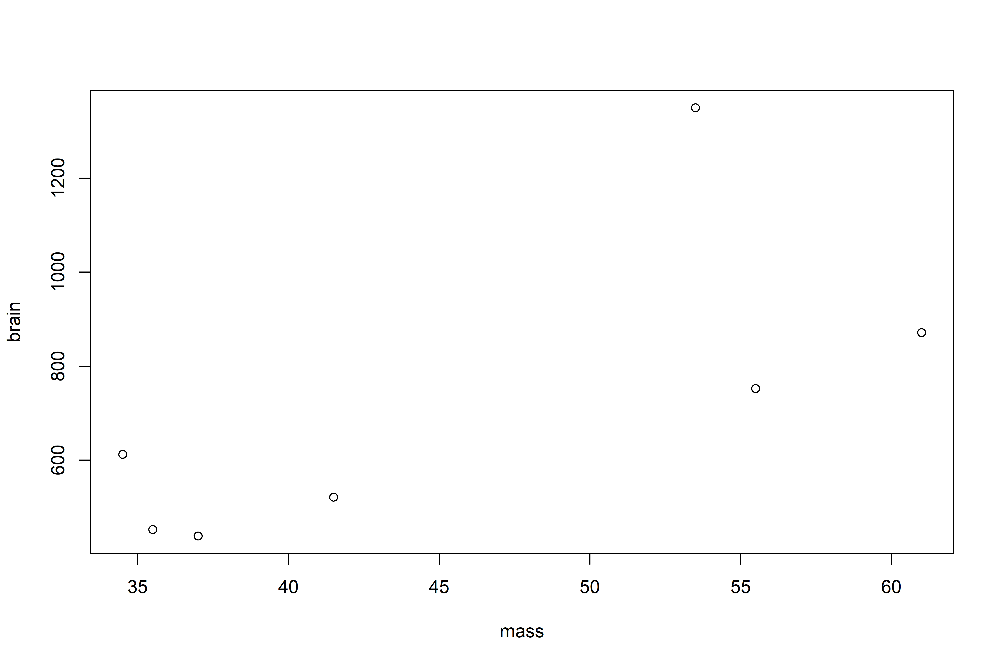
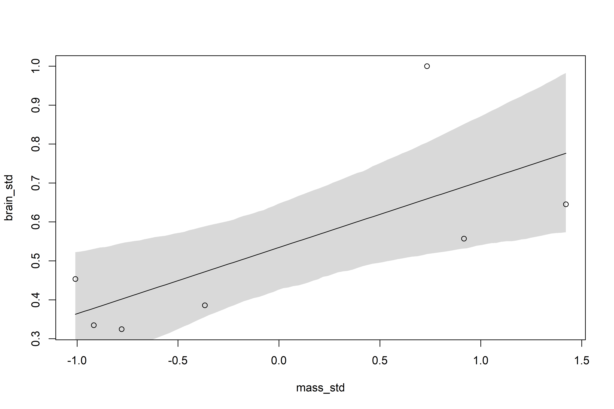
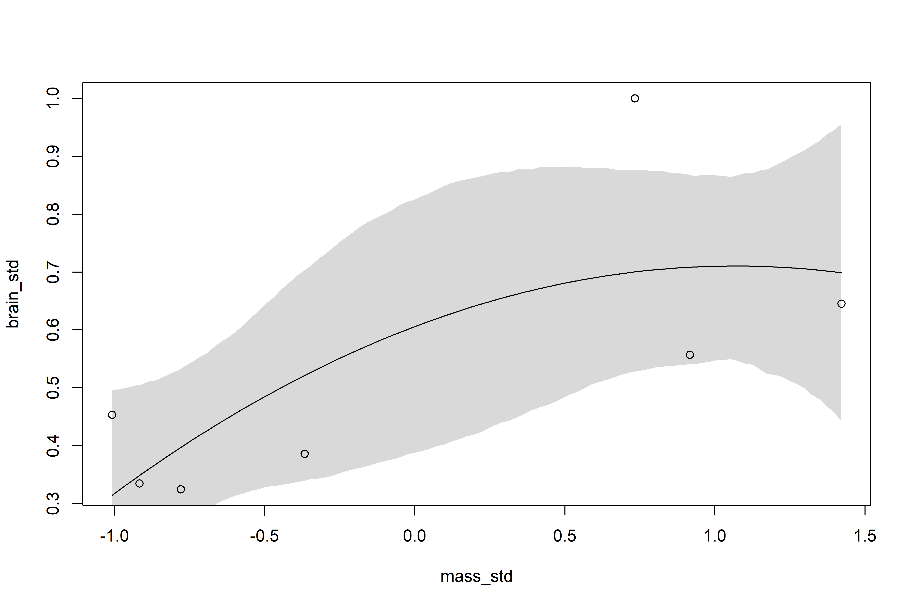
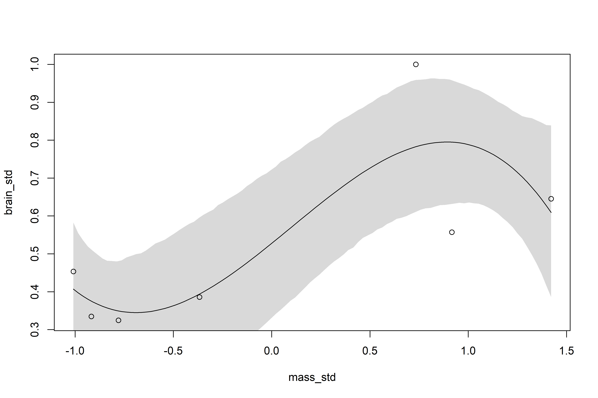
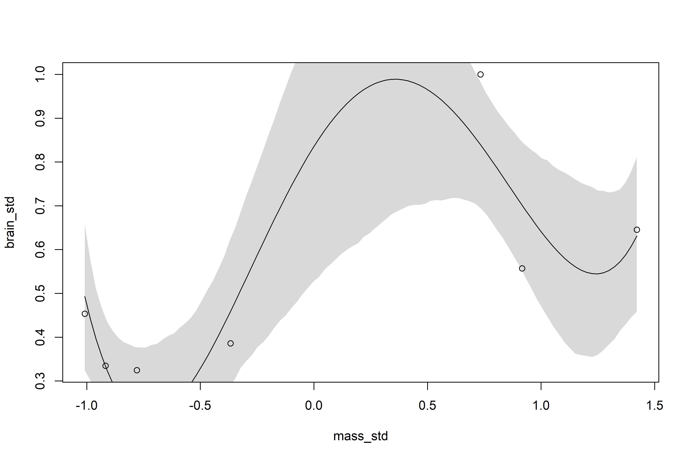
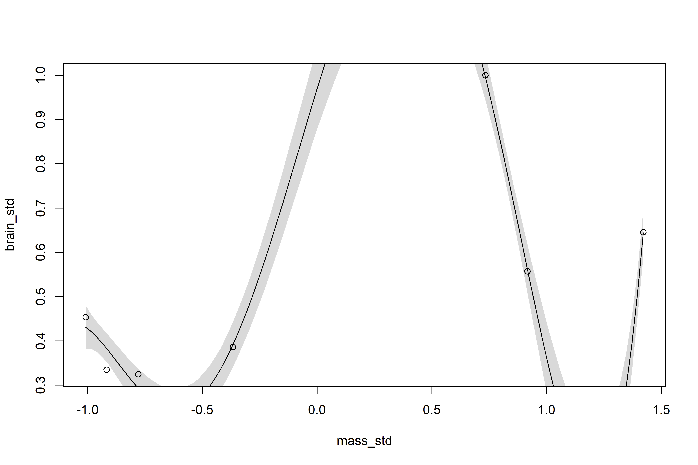
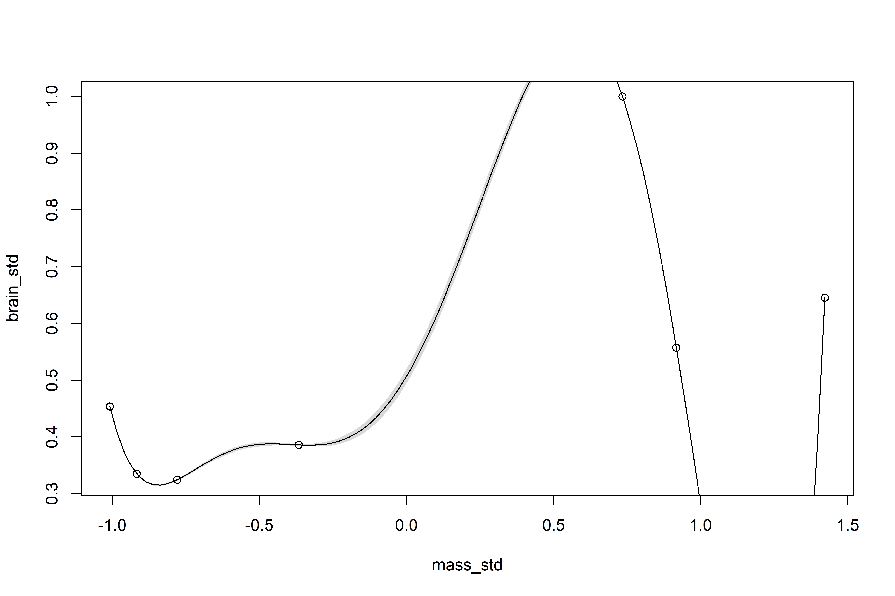
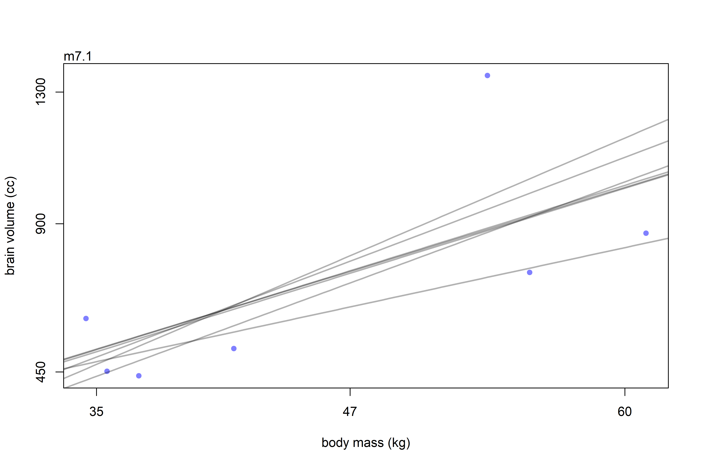
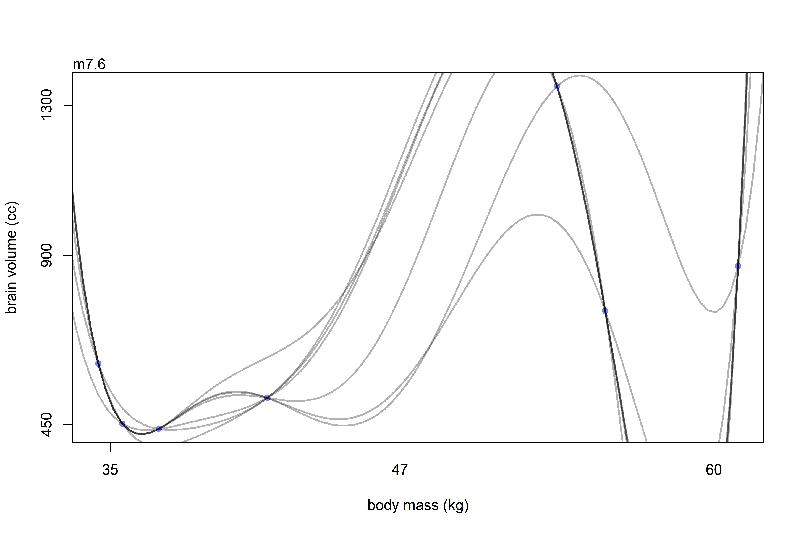

Ulysses’ Compass
================

-   The modeler’s *Ockham’s Razor*: *models with fewer assumptions are
    to be preferred*.
-   What if we want to evaluate the tradeoff between simplicity and
    accuracy?
-   There are two beasts to deal with: *overfitting* and *underfitting*
-   Two common approaches to navigating these two problems: utilizing a
    *regularizing prior* or a scoring device such as an *information
    criteria* or *cross-validation*.

## 7.1 The problem with parameters

-   Sometimes we don’t care about a causal model and just want to make
    good predictions.
-   This isn’t an excuse for just tossing everything into the model with
    no regard!
-   Adding a bunch of variables to a model will always increase
    *R*<sup>2</sup> but may actually make *out-of-sample* prediction
    *worse!*
-   A model that is too simple, on the other hand, may underfit both the
    training and out-of-sample data.

### 7.1.1 More parameters (almost) always improve fit

-   *Overfitting* occurs when a model learns too much from the sample.
-   Overfitting also happens automatically!

``` r
# let's create a dataset to explore overfitting
sppnames <- c("afarensis", "africanus", "habilis", "boisei", "rudolfensis", "ergaster", "sapiens")
brainvolcc <- c(438, 452, 612, 521, 752, 871, 1350)
masskg <- c(37.0, 35.5, 34.5, 41.5, 55.5, 61.0, 53.5)
d <- data.frame(species = sppnames, brain = brainvolcc, mass = masskg)

plot(brain ~ mass, data = d)
```

<!-- -->

``` r
d$mass_std <- (d$mass - mean(d$mass))/sd(d$mass)
d$brain_std <- d$brain/max(d$brain)
```

-   A simple model relating brain volume to body mass is shown below.
-   A quick note — these priors are very wide, particularly *β*

$$
\\begin{gather}
b_i \\sim Normal(\\mu_i, \\sigma) \\\\
\\mu_i = \\alpha + \\beta m_i \\\\
\\alpha \\sim Normal(0.5, 1) \\\\
\\beta \\sim Normal(0, 10) \\\\
\\sigma \\sim Lognormal(0, 1)
\\end{gather}
$$

``` r
library(rethinking)
m7.1 <-
  quap(
    alist(brain_std ~ dnorm(mu, exp(log_sigma)),
          mu <- a + b * mass_std,
          a ~ dnorm(0.5, 1),
          b ~ dnorm(0, 10),
          log_sigma ~ dnorm(0, 1)),
    data = d
  )
```

-   *R*<sup>2</sup>, the proportion of the variance explained by the
    model, is not really a great metric.
-   Let’s compute it for this/several models, “so we may bury it”

``` r
# r^2 for this model:
set.seed(12)
s <- sim(m7.1)
r <- apply(s, 2, mean) - d$brain_std
resid_var <- var2(r)
outcome_var <- var2(d$brain_std)
1 - resid_var/outcome_var
```

    ## [1] 0.4774589

``` r
# function for calculating r^2 for future models
R2_is_bad <- function(quap_fit) {
  
  s <- sim(quap_fit, refresh = 0)
  r <- apply(s, 2, mean) - d$brain_std
  1 - var2(r)/var2(d$brain_std)
  
}
```

-   Let’s consider several more models, each adding a polynomial of a
    higher degree to the fit.

$$
\\begin{gather}
b_i \\sim Normal(\\mu_i, \\sigma) \\\\
\\mu_i = \\alpha + \\beta_1 m_i + \\beta_2 m_i^2 \\\\
\\alpha \\sim Normal(0.5, 1) \\\\
\\beta_j \\sim Normal(0, 10) \\\\
\\sigma \\sim LogNormal(0, 1)
\\end{gather}
$$

``` r
# one mild trick we need to use is to tell quap() how long the vector b is
# this is why start = list(b = rep(0, 2)) is included
m7.2 <- 
  quap(
    alist(brain_std ~ dnorm(mu, exp(log_sigma)),
          mu <- a + b[1] * mass_std + b[2] * mass_std^2,
          a ~ dnorm(0.5, 1),
          b ~ dnorm(0, 10),
          log_sigma ~ dnorm(0, 1)),
    data = d,
    start = list(b = rep(0, 2))
  )

# cubic model
m7.3 <-
  quap(
    alist(brain_std ~ dnorm(mu, exp(log_sigma)),
          mu <- a + b[1] * mass_std + b[2] * mass_std^2 + b[3] * mass_std^3,
          a ~ dnorm(0.5, 1),
          b ~ dnorm(0, 10),
          log_sigma ~ dnorm(0, 1)),
    data = d,
    start = list(b = rep(0, 3))
  )

# quartic model
m7.4 <-
  quap(
    alist(brain_std ~ dnorm(mu, exp(log_sigma)),
          mu <- a + b[1] * mass_std + b[2] * mass_std^2 + b[3] * mass_std^3 + 
            b[4] * mass_std^4,
          a ~ dnorm(0.5, 1),
          b ~ dnorm(0, 10),
          log_sigma ~ dnorm(0, 1)),
    data = d,
    start = list(b = rep(0, 4))
  )

# quintic model
m7.5 <-
  quap(
    alist(brain_std ~ dnorm(mu, exp(log_sigma)),
          mu <- a + b[1] * mass_std + b[2] * mass_std^2 + b[3] * mass_std^3 + 
            b[4] * mass_std^4 + b[5] * mass_std ^5,
          a ~ dnorm(0.5, 1),
          b ~ dnorm(0, 10),
          log_sigma ~ dnorm(0, 1)),
    data = d,
    start = list(b = rep(0, 5))
  )

# 6-degree polynomial model
# this has another trick --- standard deviation is set to constant 0.001
# the model will not work otherwise, this will become clear when we plot
m7.6 <-
  quap(
    alist(brain_std ~ dnorm(mu, 0.001),
          mu <- a + b[1] * mass_std + b[2] * mass_std^2 + b[3] * mass_std^3 + 
            b[4] * mass_std^4 + b[5] * mass_std^5 + b[6] * mass_std^6,
          a ~ dnorm(0.5, 1),
          b ~ dnorm(0, 10)),
    data = d,
    start = list(b = rep(0, 6))
  )

# plots!
plot_polynomials <- function(quap_model) {
  
  post <- extract.samples(quap_model)
  mass_seq <- seq(from = min(d$mass_std), to = max(d$mass_std), length.out = 100)
  l <- link(quap_model, data = list(mass_std = mass_seq))
  mu <- apply(l, 2, mean)
  ci <- apply(l, 2, PI)
  plot(brain_std ~ mass_std, data = d)
  lines(mass_seq, mu)
  shade(ci, mass_seq)
  
}

plot_polynomials(m7.1)
```

<!-- -->

``` r
plot_polynomials(m7.2)
```

<!-- -->

``` r
plot_polynomials(m7.3)
```

<!-- -->

``` r
plot_polynomials(m7.4)
```

<!-- -->

``` r
plot_polynomials(m7.5)
```

<!-- -->

``` r
plot_polynomials(m7.6)
```

<!-- -->

-   In each of these models, adding an additional polynomial term
    *always* increases *R*<sup>2</sup> — *this doesn’t mean these models
    are better!*
-   The 5th degree polynomial has a *R*<sup>2</sup> value of 0.99 —
    however just looking at the path we can see that these increasing
    degree polynomials are absurd.
-   The 6th degree polynomial is able to *exactly* fit the data, but
    pays no price for absurd predictions in areas where no data is
    present.

### 7.1.2 Too few parameters hurts too

-   Overfitting produces estimates that are wildly accurate on in-sample
    data and wildly inaccurate on out-of-sample data.
-   Underfitting produces estimates that are mildly inaccurate on both
    in and out-of-sample data.
-   An underfit model is fairly insensitive to the sample — removing
    points doesn’t change much.
-   Contrast that with overfit models, where removing points changes
    predictions drastically:

``` r
brain_loo_plot(m7.1)
```

<!-- -->

``` r
brain_loo_plot(m7.6)
```

<!-- -->

## 7.2 Entropy and accuracy

-   The first step to navigating the bias-variance tradeoff is to pick a
    criterion of model performance (henceforth, the *target* in this
    section).
-   First, establish a measurement scale for the distance from perfect
    accuracy.
-   Second, establish *deviance* as an approximation of relative
    distance from perfect accuracy.
-   Finally, establish that the only deviance we care about is the
    out-of-sample deviance.

### 7.2.1 Firing the weatherperson

-   Accuracy depends on the definition of a target!
-   There is no universally best target — there are two major dimensions
    to worry about:
    1.  *Cost-benefit analysis*: How much does it cost when we’re
        wrong/how much do we win when we’re right?
    2.  *Accuracy in context*: Some predictions are inherently easier
        than others, so we need to judge accuracy in a way that accounts
        for how much a model could possibly improve.
-   Let’s imagine two weather forecasters predicting the probability of
    rain over the course of 10 days.
-   It rains the first three days, then doesn’t rain in the subsequent
    seven.
-   Weatherperson A predicts the following probabilities of rain: 100%,
    100%, 100%, 60%, 60%, 60%, 60%, 60%, 60%, 60%.
-   Weatherperson B predicts the following: 0%, 0%, 0%, 0%, 0%, 0%, 0%,
    0%, 0%, 0%.
-   If *hit rate* is the average chance of a correct prediction, the
    weatherperson A gets a score of 3 × 1 + 7 × 0.4 = 5.8 and
    weatherperson B gets a score of 3 × 0 + 7 × 1 = 7.
-   By hit rate alone, weatherperson B is the better forecaster. But
    intuitively, we wouldn’t want this person as our weatherperson!

#### 7.2.1.1 Costs and benefits

-   It’s easy to define another cost/benefit metric that ends up in
    weatherperson A’s favor.
-   If, for example, getting rained on “costs”  − 5 happiness points and
    carrying an umbrella “costs”  − 1 happiness points (and the
    probability of carrying an umbrella is equal to the probability of
    rain), then you get the following:
-   Weatherperson A’s score is 3 × (−1) + 7 × (−0.6) =  − 7.2 and
    Weatherperson B’s score is 3 × (−5) + 7 × 0 =  − 15.
-   By this metric, Weatherperson B provides a poor forecast!

#### 7.2.1.2 Measuring accuracy

-   There’s still ambiguity about which measure of accuracy to adopt.
-   In the above scenario, there’s nothing special about the hit rate.
-   If we consider the two forecasts above and the *joint probability*
    of correctly predicting the sequence of days, weatherperson A’s
    chances are: 1<sup>3</sup> × 4<sup>7</sup> ≈ 0.005 whereas
    weatherperson B’s chances are 0<sup>3</sup> × 1<sup>7</sup> = 0.
-   Weatherperson B is more accurate *on average*, but has a terrible
    *joint* probability of being correct.
-   We’ll see this measure of accuracy in literature as the *log-scoring
    rule*.

### 7.2.2 Information and uncertainty

-   So we want to use the log probability of the data to score the
    accuracy of competing models — but how do we measure the distance
    from a perfect prediction?
-   The solution comes from the field of *information theory* and the
    basic insight to ask: *How much is our uncertainty reduced by
    learning an outcome?*
-   *Information*: The reduction in uncertainty when we learn an
    outcome.
-   To use this definition, we need a way to quantify the uncertainty
    inherent in a probability distribution.
-   There are mayn possible ways to measure uncertainty, but the most
    common way begins by naming a few properties a measure of
    uncertainty should possess:
    1.  The measure of uncertainty should be continuous.
    2.  The measure of uncertainty should increase as the number of
        possible events increases.
    3.  The measure of uncertainty should be additive.
-   There is one function that satisfies these conditions: *information
    entropy*:

$$
\\begin{gather}
H(p) = - E \\; log(p_i) = - \\sum\_{i = 1}^n \\; p_i \\; log(p_i)
\\end{gather}
$$

-   In plainer terms, *the uncertainty contained in a probability
    distribution is the average log-probability of an event.*
-   Suppose the true probabilities of rain and shine are
    *p*<sub>*r**a**i**n*</sub> = 0.3 and
    *p*<sub>*s**h**i**n**e*</sub> = 0.7. *H*(*p*) would evaluate to:

*H*(*p*) =  − (*p*<sub>*r**a**i**n*</sub> *l**o**g*(*p*<sub>*r**a**i**n*</sub>) + *p*<sub>*s**h**i**n**e*</sub> *l**o**g*(*p*<sub>*s**h**i**n**e*</sub>)) ≈ 0.61

``` r
p <- c(0.3, 0.7)
-sum(p * log(p))
```

    ## [1] 0.6108643

-   If instead we live in Abu Dhabi and the probabilities of rain/shine
    are 0.01 and 0.99, respectively, then the entropy would be:

``` r
p <- c(0.01, 0.99)
-sum(p * log(p))
```

    ## [1] 0.05600153

### 7.2.3 From entropy to accuracy

-   Now we can say how hard it is to hit the target — how can we use
    information entropy to say how far a model is from the target?
-   *Divergence*: The additional uncertainty introduced by using
    probabilities from one distribution to describe another
    distribution.
-   If we know the true distribution for the probability of rain/shine
    is 0.3/0.7, but we instead believe that these events happen with
    probabilities (q) 0.25/0.75, then the *Kullback-Leibler divergence*
    is:

$$
\\begin{gather}
D\_{KL} (p, q) = \\sum\_{i = 1}^n \\ p_i \\ (log(p_i) - log(q_i)) = \\sum\_{i = 1}^n p_i \\ log(\\frac{p_i}{q_i})
\\end{gather}
$$

-   In plainer language, *divergence is the average difference in log
    probability between the target (p) and the model (q).*
-   When *p* = *q*, the divergence is 0.
-   As q becomes more accurate, the divergence will shrink. So if we
    have a pair of candidate distributions, then the candidate that
    minimizes the divergence will be closest to the target.
-   ^ we can use this fact to compare the accuracy of models!

### 7.2.4 Estimating divergence

-   The point of all this discussion about entropy is to establish two
    things (the first is established, the second remains):
    1.  How to measure the distance of a model from our target.
    2.  How to estimate the divergence in real statistical modeling
        tasks.
-   Thus far, we’ve assumed we’ve known the true distribution, *p*, but
    in reality we won’t know this!
-   But there’s a sneaky way out of this predicament — if we compare two
    models (*q* and *r*) and their divergences, the *p* term will cancel
    each other out!
-   So while we don’t know where *p* is, we can estimate how far apart
    *q* and *r* are and determine which is closer to the target.
-   So in practice, if we sum the log-probability of a model *q*, we get
    the *log-probability* score:

$$
\\begin{gather}
S(q) = \\sum\_{i = 1}^n \\ log(q_i)
\\end{gather}
$$

-   This is the gold standard way to compare the predictive accuracy of
    different models.
-   In a Bayesian model, we have to use the entire posterior
    distribution. `rethinking::lppd()` estimates the
    *log-pointwise-predictive-density* for `quap()` models.

``` r
set.seed(1)
lppd(m7.1, n = 1e4)
```

    ## [1]  0.6098668  0.6483437  0.5496091  0.6234934  0.4648142  0.4347603 -0.8444629

-   Some overthinking, for some data *y* and posterior distribution *θ*,
    the log-pointwise-predictive-density is:

$$
\\begin{gather}
lppd(y, \\theta) = \\sum_i \\ log \\frac{1}{S} \\ \\sum_s p (y_i \|\\theta_s)
\\end{gather}
$$

-   *S* is the number of samples and *θ*<sub>*s*</sub> is the *s*-th set
    of sampled parameter values for the posterior distribution. In code:

``` r
set.seed(1)

# this gives the same values as rethinking::lppd() above
logprob <- sim(m7.1, ll = TRUE, n = 1e4)
n <- ncol(logprob)
ns <- nrow(logprob)
f <- function(i) log_sum_exp(logprob[,i]) - log(ns)
sapply(1:n, f)
```

    ## [1]  0.6098668  0.6483437  0.5496091  0.6234934  0.4648142  0.4347603 -0.8444629

### 7.2.5 Scoring the right data

-   The log-probability score is a principled way to measure distance
    from the target, but it has the same flaw as *R*<sup>2</sup> — it
    always improves as models get more complex.
-   For example, computing the log-probability score on the previous
    models shows that the ridiculuous polynomial models have the best
    score:

``` r
set.seed(1)
sapply(list(m7.1, m7.2, m7.3, m7.4, m7.5, m7.6),
       function(m) sum(lppd(m)))
```

    ## [1]  2.490390  2.566165  3.707343  5.333750 14.090061 39.445390

-   It’s not the score on *training* data that interests us, it’s the
    score on *test data* that we ought to care about!
-   See figure 7.6 on page 212 for an example — adding parameters
    improves both in and out-of-sample data to a point, then adding more
    parameters continues to improve in-sample performance while
    out-of-sample performance gets worse!

## 7.3 Golem taming: regularization

-   The root of overfitting is a model’s tendency to get overexcited by
    the training sample.
-   A *regularizing prior* can help reduce overfitting while still
    allowing the model to learn from the training sample.
-   If a prior regularizes too much, the model may underfit, so the
    problem turns to one of tuning.
-   Consider this model with very diffuse priors:

$$
\\begin{gather}
y_i \\sim Normal(\\mu_i, \\sigma) \\\\
\\mu_i = \\alpha + \\beta x_i \\\\
\\alpha \\sim Normal(0, 100) \\\\
\\beta \\sim Normal(0, 1) \\\\
\\sigma \\sim Exponential(1)
\\end{gather}
$$

-   Here (assuming that the predictors are standardized so that the mean
    is 0 and standard deviation is 1), the prior on *α* is basically
    flat & has no practical effect on inference.
-   The prior on *β* is narrower and meant to regularize — this golem is
    skeptical of values above 2 and below -2.
-   See figure 7.8 on page 216 for examples of varying levels of priors
    and the effect on out of sample prediction.
-   When there is a lot of data, regularizing priors have less of an
    impact.
-   Regularization (from the machine learning literature: ridge, lasso,
    and elastic-net) can be understood from both Bayesian and
    non-Bayesian standpoints.

## 7.4 Predicting predictive accuracy

-   Two families of strategies for navigating between overfitting and
    underfitting:
    1.  *Cross-validation*
    2.  *Information criteria*

### 7.4.1 Cross-validation

-   Basic strategy of cross validation: leave out a small chunk of
    observations & evaluating the model on these.

-   Generally divide the sample into a discrete number of chunks (folds)
    (k-fold cross validation).

-   *How many folds to use?* is an understudied question — the maximum
    number of folds results in *leave-one-out cross-validation* (LOO).

-   This is the default in `rethinking::cv_quap()`.

-   LOO, however, can be incredibly time consuming. Luckily, there are
    clever ways to approximate cross-validation without actually
    re-running the model over and over again.

-   One approach is to use the “importance” of each observation in the
    posterior (i.e., if we remove an import observation, the posterior
    changes more).

-   This approximation is called *Pareto-smoothed importance sampling
    cross-validation* (PSIS) and can be computed with
    `rethinking::PSIS()`.

-   One feature of PSIS is that it self notes that particular
    observations with very high weights could make it’s own PSIS score
    inaccurate.

-   Cross-validation estimates the out-of-sample LPPD. If you have *N*
    observations and fit the model *N* times (each time dropping a
    single observation *y*<sub>*i*</sub>), then the out-of-sample LPPD
    is the sum of the average accuracy for each omitted
    *y*<sub>*i*</sub>:

$$
\\begin{gather}
lppd\_{CV} = \\sum\_{i = 1}^N \\ \\frac{1}{S} \\ \\sum\_{s = 1}^S \\ log \\ Pr(y_i \| \\theta\_{-i, s})
\\end{gather}
$$

-   Here, *s* indexes samples from a Markov chain and
    *θ*<sub>−*i*, *s*</sub> is the *s*-th sample from the posterior
    distribution computed for observations omitting *y*<sub>*i*</sub>.
-   Importance sampling replaces the computation of *N* posterior
    distributions by using an estimate of the importance of each *i* to
    the posterior distribution.
-   So we re-weight each sample *s* by the inverse of the probability of
    the omitted observation:

$$
\\begin{gather}
r(\\theta_s) = \\frac{1}{p(y_i \| \\theta_s)}
\\end{gather}
$$

-   This gives the importance sampling estimate of out-of-sample LPPD:

$$
\\begin{gather}
lppd\_{IS} = \\sum\_{i = 1}^N \\ log \\ \\frac{\\sum\_{s = 1}^S r(\\theta_s) \\ p(y_i \| \\theta_s)}{\\sum\_{s = 1}^S \\ r(\\theta_s)}
\\end{gather}
$$

-   The next step is to incorporate Pareto smoothing. This is because if
    any *r*(*θ*<sub>*s*</sub>) is too large, it can ruin the LPPD
    estimate by dominating it.
-   PSIS exploits the fact that the distribution of weights ought to
    follow a *Pareto distribution*:

$$
\\begin{gather}
p(r\|u, \\sigma, k) = \\sigma^{-1} (1 + k(r - u) \\sigma^{-1})^{-\\frac{1}{k} - 1}
\\end{gather}
$$

-   Where *u*, *σ*, and *k* correspond to the *location*, *scale*, and
    *shape* parameters.
-   For each observation *y*<sub>*i*</sub>, the largest weights are used
    to estimate a Pareto distribution then smoothed using that
    distribution.
-   Larger values of *k* indicate larger variance — in
    theory/simulation, PSIS weights perform well as long as *k* \< 0.7.

### 7.4.2 Information criteria

-   The second major approach is to use an *information criteria* to
    compute an expected score out-of-sample.
-   For ordinary linear regressions with flat priors, the expected
    overfitting penalty is about 2x the number of parameters. This is
    the phenomenon behind information criteria.
-   The best known criterion is *Akaike information criterion*, or
    *AIC*.

$$
\\begin{gather}
AIC = D\_{train} + 2p = -2 \\ lppd + 2p
\\end{gather}
$$

-   Where *p* is the number of free parameters in the posterior
    distribution (2 is just there for scaling).
-   While this is the best known, AIC is mostly just of historical
    interest now, since it’s only reliable when:
    1.  The priors are flat or overwhelmed by the likelihood.
    2.  The posterior distribution is approximately multivariate
        Gaussian.
    3.  The sample size *N* is much greater than the number of
        parameters *k*.
-   A more general criterion, the *deviance information criterion*
    (DIC), can handle informative priors, but still assumes the
    posterior is multivariate Gaussian and that *N \>\> k*.
-   Even more general than that is the *widely applicable information
    criterion* (WAIC), which makes no assumption about the shape of the
    posterior.
-   In large samples, WAIC converges on the cross-validation
    approximation. In small samples, it can disagree, since it’s not
    trying to approximate the cV score, but rather guess the
    out-of-sample Kullback-Leiber (KL) divergence (in large samples,
    these tend to be the same).
-   WAIC is calculated simply as the LPPD from earlier plus a penalty
    proportional to the variance in posterior predictions:

$$
\\begin{gather}
WAIC(y, \\Theta) = -2(lppd - \\sum_i \\ var\_{\\theta} \\ log \\ p(y_i\|\\theta))
\\end{gather}
$$

-   The penalty term (everything after the sum) means, “compute the
    variance in log-probabilities for each observation *i*, then sum up
    these variances to get the total penalty.”
-   Because of the historical ties to AIC, the penalty term in WAIC is
    sometimes called the *effective number of parameters*, labeled
    *p*<sub>*W**A**I**C*</sub>. This makes historical sense, but not
    much mathematical sense.
-   `rethinking::WAIC()` will compute WAIC for a model fit with
    `quap()`, `ulam()`, or using `{rstan}`.
-   Like PSIS, WAIC is *pointwise* (computed for each point in the
    data).
-   To see how WAIC actually works, let’s do a lil bit of overthinking
    with a simple model:

``` r
# predict a car's stopping distance based on its top speed
data("cars")
m <-
  quap(
    alist(dist ~ dnorm(mu, sigma),
          mu <- a + b*speed,
          a ~ dnorm(0, 100),
          b ~ dnorm(0, 10),
          sigma ~ dexp(1)),
    data = cars
  )

# get 1000 draws from the posterior 
set.seed(94)
post <- extract.samples(m, n = 1000)

# compute the log-likelihood of each observation i at each sample s from the posterior
n_samples <- 1000
logprob <-
  sapply(1:n_samples,
         function(s) {
           mu <- post$a[s] + post$b[s] * cars$speed
           dnorm(cars$dist, mu, post$sigma[s], log = TRUE)
         })

# logprob is a 50x1000 matrix of log-likelihoods
# observations are rows and samples are columns

# calculate lppd for each observation
n_cases <- nrow(cars)
lppd <- sapply(1:n_cases, function(i) log_sum_exp(logprob[i,] - log(n_samples)))

# sum(lppd) gives lppd as defined in 7.2.4
sum(lppd)
```

    ## [1] -206.8787

``` r
sum(lppd(m))
```

    ## [1] -206.8781

``` r
# the penalty term:
pWAIC <- sapply(1:n_cases, function(i) var(logprob[i,]))

# finally, WAIC:
-2 * (sum(lppd) - sum(pWAIC))
```

    ## [1] 423.3188

``` r
# matches WAIC() (with some variability):
WAIC(m)
```

    ##     WAIC      lppd  penalty  std_err
    ## 1 422.82 -206.8799 4.530137 17.27583

### 7.4.3 Comparing CV, PSIS, and WAIC

-   Honestly, just recommend rereading section 7.4.3 on page 223 in
    conjunction with referencing figure 7.9 on page 224.
-   PSIS and WAIC perform very similarly in the context of ordinary
    linear models.
-   Where there are important differences, they lie in other model types
    where the posterior is not approximately gaussian or in the presence
    of observations that strongly influence the posterior.
-   CV and PSIS have higher variance as estimators of KL divergence,
    while WAIC has greater bias.
-   We should expect that each is slightly better in different contexts,
    however, in practice any advantage may be much smaller than the
    expected error.
-   One recommendation is to compute both WAIC and PSIS — if there are
    large differences, this implies that one or both criteria are
    unreliable.
-   PSIS has the unique advantage in that it warns the user when it is
    unreliable (via *k* values).
-   Some rethinking: these criteria are just scores for models, and
    statistics is no substitute for science (see the rethinking box on
    224/225).

## 7.5 Model comparison

-   Some review — when there are several plausible models, how should we
    compare the accuracy?
-   Following the fit to the sample is no good, because it will always
    favor more complex models.
-   Information divergence is the right measure of accuracy, but it will
    always favor more complex models.
-   We need to evaluate the models on out-of-sample data.
-   Flat priors produce bad predictions — regularizing priors reduce the
    fit to the sample but improve predictive accuracy.
-   We can get a useful guess of predictive accuracy with the criteria
    of CV, PSIS, and WAIC.
-   Regularizing priors and CV/PSIS/WAIC are complementary tools.
-   Using these tools is much easier than understanding them — which
    makes them incredibly useful but potentially dangerous.
-   A common use of CV/information criteria is to perform *model
    selection*, which refers to tossing out all but the model with the
    lowest criterion value.
-   You should never do this! It discards information about the relative
    model accuracy.
-   Why? Sometimes the differences are large and sometimes they are
    small. Additionally, scores say nothing about the *causality* of
    each model.
-   Maximizing the expected predictive accuracy is not the same as
    inferring causation; highly confounded models can still make good
    predictions but won’t tell us about the consequences of an
    intervention. We need to be clear about the goal of the model.
-   Instead of model selection, we’ll focus on *model comparison*.
