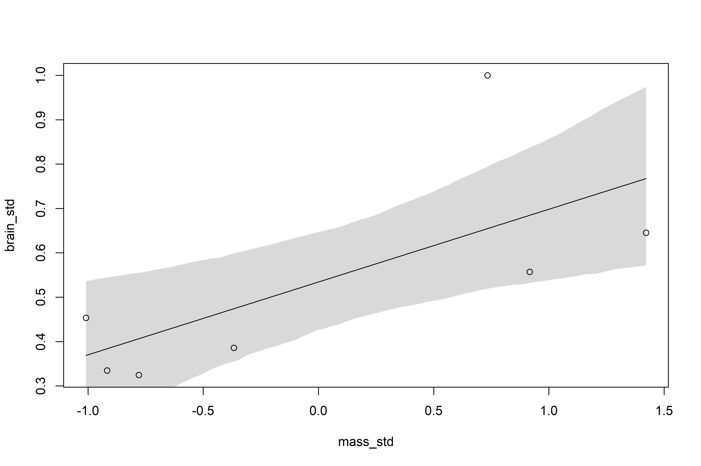

Ulysses’ Compass
================

-   The modeler’s *Ockham’s Razor*: *models with fewer assumptions are
    to be preferred*.
-   What if we want to evaluate the tradeoff between simplicity and
    accuracy?
-   There are two beasts to deal with: *overfitting* and *underfitting*
-   Two common approaches to navigating these two problems: utilizing a
    *regularizing prior* or a scoring device such as an *information
    criteria* or *cross-validation*.

## 7.1 The problem with parameters

-   Sometimes we don’t care about a causal model and just want to make
    good predictions.
-   This isn’t an excuse for just tossing everything into the model with
    no regard!
-   Adding a bunch of variables to a model will always increase
    *R*<sup>2</sup> but may actually make *out-of-sample* prediction
    *worse!*
-   A model that is too simple, on the other hand, may underfit both the
    training and out-of-sample data.

### 7.1.1 More parameters (almost) always improve fit

-   *Overfitting* occurs when a model learns too much from the sample.
-   Overfitting also happens automatically!

``` r
# let's create a dataset to explore overfitting
sppnames <- c("afarensis", "africanus", "habilis", "boisei", "rudolfensis", "ergaster", "sapiens")
brainvolcc <- c(438, 452, 612, 521, 752, 871, 1350)
masskg <- c(37.0, 35.5, 34.5, 41.5, 55.5, 61.0, 53.5)
d <- data.frame(species = sppnames, brain = brainvolcc, mass = masskg)

plot(brain ~ mass, data = d)
```

<!-- -->

``` r
d$mass_std <- (d$mass - mean(d$mass))/sd(d$mass)
d$brain_std <- d$brain/max(d$brain)
```

-   A simple model relating brain volume to body mass is shown below.
-   A quick note — these priors are very wide, particularly *β*

$$
\\begin{gather}
b_i \\sim Normal(\\mu_i, \\sigma) \\\\
\\mu_i = \\alpha + \\beta m_i \\\\
\\alpha \\sim Normal(0.5, 1) \\\\
\\beta \\sim Normal(0, 10) \\\\
\\sigma \\sim Lognormal(0, 1)
\\end{gather}
$$

``` r
library(rethinking)
m7.1 <-
  quap(
    alist(brain_std ~ dnorm(mu, exp(log_sigma)),
          mu <- a + b * mass_std,
          a ~ dnorm(0.5, 1),
          b ~ dnorm(0, 10),
          log_sigma ~ dnorm(0, 1)),
    data = d
  )
```

-   *R*<sup>2</sup>, the proportion of the variance explained by the
    model, is not really a great metric.
-   Let’s compute it for this/several models, “so we may bury it”

``` r
# r^2 for this model:
set.seed(12)
s <- sim(m7.1)
r <- apply(s, 2, mean) - d$brain_std
resid_var <- var2(r)
outcome_var <- var2(d$brain_std)
1 - resid_var/outcome_var
```

    ## [1] 0.4770232

``` r
# function for calculating r^2 for future models
R2_is_bad <- function(quap_fit) {
  
  s <- sim(quap_fit, refresh = 0)
  r <- apply(s, 2, mean) - d$brain_std
  1 - var2(r)/var2(d$brain_std)
  
}
```

-   Let’s consider several more models, each adding a polynomial of a
    higher degree to the fit.

$$
\\begin{gather}
b_i \\sim Normal(\\mu_i, \\sigma) \\\\
\\mu_i = \\alpha + \\beta_1 m_i + \\beta_2 m_i^2 \\\\
\\alpha \\sim Normal(0.5, 1) \\\\
\\beta_j \\sim Normal(0, 10) \\\\
\\sigma \\sim LogNormal(0, 1)
\\end{gather}
$$

``` r
# one mild trick we need to use is to tell quap() how long the vector b is
# this is why start = list(b = rep(0, 2)) is included
m7.2 <- 
  quap(
    alist(brain_std ~ dnorm(mu, exp(log_sigma)),
          mu <- a + b[1] * mass_std + b[2] * mass_std^2,
          a ~ dnorm(0.5, 1),
          b ~ dnorm(0, 10),
          log_sigma ~ dnorm(0, 1)),
    data = d,
    start = list(b = rep(0, 2))
  )

# cubic model
m7.3 <-
  quap(
    alist(brain_std ~ dnorm(mu, exp(log_sigma)),
          mu <- a + b[1] * mass_std + b[2] * mass_std^2 + b[3] * mass_std^3,
          a ~ dnorm(0.5, 1),
          b ~ dnorm(0, 10),
          log_sigma ~ dnorm(0, 1)),
    data = d,
    start = list(b = rep(0, 3))
  )

# quartic model
m7.4 <-
  quap(
    alist(brain_std ~ dnorm(mu, exp(log_sigma)),
          mu <- a + b[1] * mass_std + b[2] * mass_std^2 + b[3] * mass_std^3 + 
            b[4] * mass_std^4,
          a ~ dnorm(0.5, 1),
          b ~ dnorm(0, 10),
          log_sigma ~ dnorm(0, 1)),
    data = d,
    start = list(b = rep(0, 4))
  )

# quintic model
m7.5 <-
  quap(
    alist(brain_std ~ dnorm(mu, exp(log_sigma)),
          mu <- a + b[1] * mass_std + b[2] * mass_std^2 + b[3] * mass_std^3 + 
            b[4] * mass_std^4 + b[5] * mass_std ^5,
          a ~ dnorm(0.5, 1),
          b ~ dnorm(0, 10),
          log_sigma ~ dnorm(0, 1)),
    data = d,
    start = list(b = rep(0, 5))
  )

# 6-degree polynomial model
# this has another trick --- standard deviation is set to constant 0.001
# the model will not work otherwise, this will become clear when we plot
m7.6 <-
  quap(
    alist(brain_std ~ dnorm(mu, 0.001),
          mu <- a + b[1] * mass_std + b[2] * mass_std^2 + b[3] * mass_std^3 + 
            b[4] * mass_std^4 + b[5] * mass_std^5 + b[6] * mass_std^6,
          a ~ dnorm(0.5, 1),
          b ~ dnorm(0, 10)),
    data = d,
    start = list(b = rep(0, 6))
  )

# plots!
plot_polynomials <- function(quap_model) {
  
  post <- extract.samples(quap_model)
  mass_seq <- seq(from = min(d$mass_std), to = max(d$mass_std), length.out = 100)
  l <- link(quap_model, data = list(mass_std = mass_seq))
  mu <- apply(l, 2, mean)
  ci <- apply(l, 2, PI)
  plot(brain_std ~ mass_std, data = d)
  lines(mass_seq, mu)
  shade(ci, mass_seq)
  
}

plot_polynomials(m7.1)
```

<!-- -->

``` r
plot_polynomials(m7.2)
```

<!-- -->

``` r
plot_polynomials(m7.3)
```

<!-- -->

``` r
plot_polynomials(m7.4)
```

<!-- -->

``` r
plot_polynomials(m7.5)
```

<!-- -->

``` r
plot_polynomials(m7.6)
```

<!-- -->

-   In each of these models, adding an additional polynomial term
    *always* increases *R*<sup>2</sup> — *this doesn’t mean these models
    are better!*
-   The 5th degree polynomial has a *R*<sup>2</sup> value of 0.99 —
    however just looking at the path we can see that these increasing
    degree polynomials are absurd.
-   The 6th degree polynomial is able to *exactly* fit the data, but
    pays no price for absurd predictions in areas where no data is
    present.

### 7.1.2 Too few parameters hurts too

-   Overfitting produces estimates that are wildly accurate on in-sample
    data and wildly inaccurate on out-of-sample data.
-   Underfitting produces estimates that are mildly inaccurate on both
    in and out-of-sample data.
-   An underfit model is fairly insensitive to the sample — removing
    points doesn’t change much.
-   Contrast that with overfit models, where removing points changes
    predictions drastically:

``` r
brain_loo_plot(m7.1)
```

<!-- -->

``` r
brain_loo_plot(m7.6)
```

<!-- -->

## 7.2 Entropy and accuracy
