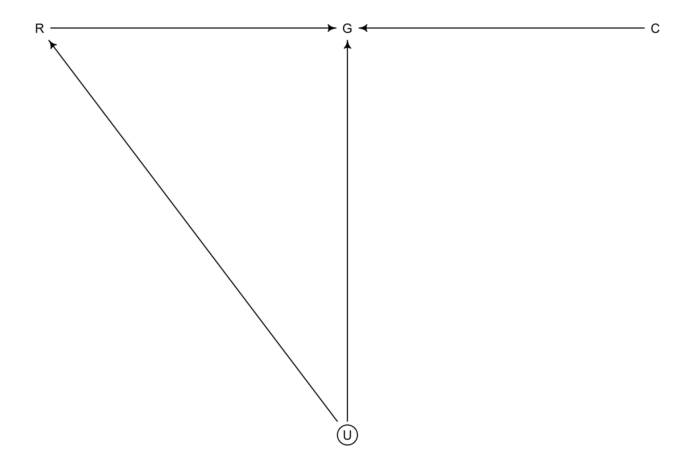
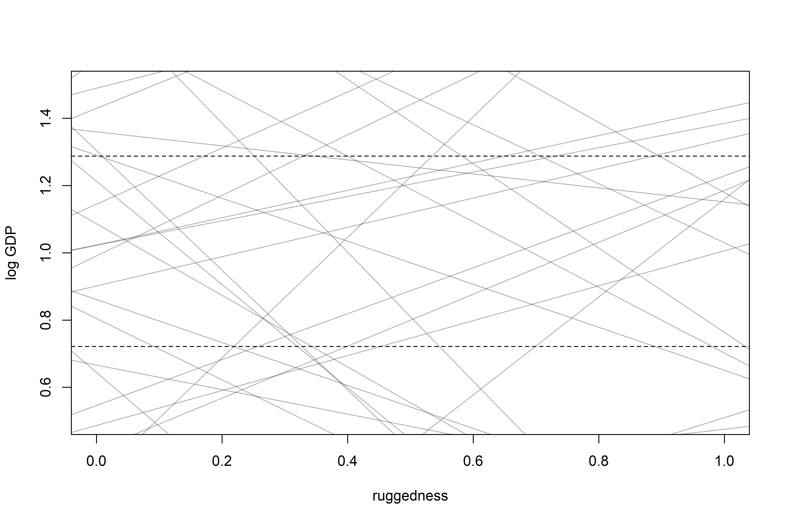
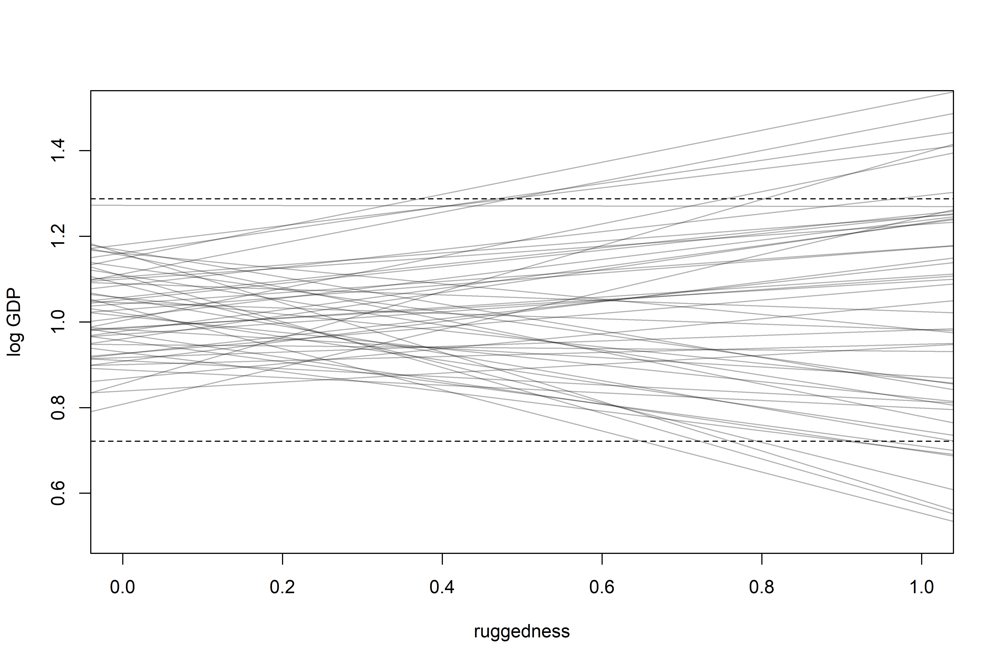
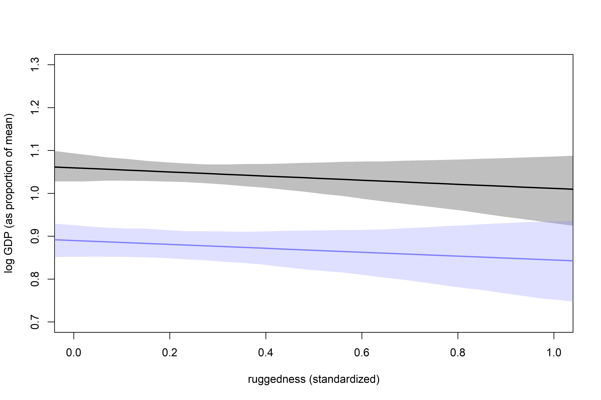
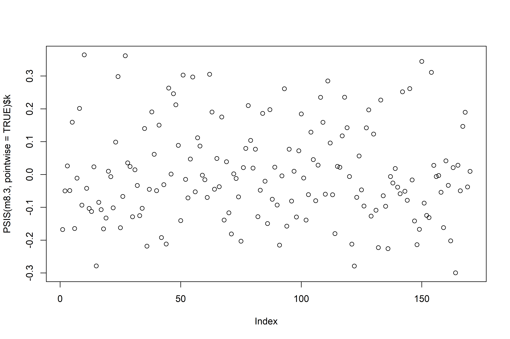

Conditional Manatees
================

-   During WWII, Royal Air Force bombers were being shot down in droves
    — those that weren’t returned with bullet holes covering the wings,
    but no bullet holes on the engine/compartment.
-   The air force needed to protect the bombers as efficiently as
    possible — but putting more armor on the areas that had the most
    bullet holes wouldn’t work!
-   This is because wings can withstand bullet damage, but the engine
    can’t!
-   In this way, data (like the bomber damage), is *conditional* on how
    they get into the sample.
-   Sometimes, the importance of one predictor depends on another
    predictor — this is known as an *interaction*.

## 8.1 Building an interaction

-   In countries outside Africa, GDP (or rather, log(GDP)) is negatively
    associated with terrain ruggedness. For countries within Africa,
    however, there’s a positive relationship! This is a clear indication
    of an interaction.
-   If *R* is terrain ruggedness, *G* is GDP, *C* is continent, and *U*
    is some set of unobserved confounders, a potential DAG may look
    like:

``` r
library(rethinking)
library(dagitty)

africa_dag <-
  dagitty(
    "dag{
      U [unobserved]
      U -> R
      U -> G
      R -> G
      C -> G
    }"
  )

coordinates(africa_dag) <-
  list(x = c(R = 0, G = 1, C = 2, U = 1),
       y = c(R = 0, G = 0, C = 0, U = 1))

drawdag(africa_dag)
```

<!-- -->

-   Here, both *R* and *C* influence *G*. This could be independent, or
    through an interaction (DAGs don’t describe whethere there is an
    action, just says that *G* is *some function* of *R* and *G*).
-   Splitting the data into separate models for different continents
    isn’t a great idea, for a few reasons:
    1.  Some variables (like *σ*) may not depend on the continent at all
    2.  In order to learn something about the continent variable itself,
        we need to include it directly in the model!
    3.  We may want to compare models based on an information criteria,
        & it’s only useful to do so with models that use the same data
    4.  Once we get into multilevel models, we’ll see that there’s a lot
        of benefit to “borrowing” information across categories.

### 8.1.1 Making a rugged model

-   Let’s first fit a model that *doesn’t* use an interaction between
    continent & ruggedness.

``` r
data(rugged)
d <- rugged

# make log version of outcome
d$log_gdp <- log(d$rgdppc_2000)

# extract countries with GDP data
dd <- d[complete.cases(d$rgdppc_2000), ]

# rescale variables
dd$log_gdp_std <- dd$log_gdp / mean(dd$log_gdp)
dd$rugged_std <- dd$rugged / max(dd$rugged)
```

-   Scaling makes setting the priors a bit easier to work with — a *μ*
    value of 1 corresponds to the average log(GDP), so a
    *N**o**r**m**a**l*(1,1) prior makes sense.
-   *β* has no bias towards positive or negative, so a
    *N**o**r**m**a**l*(0,1) prior is reasonable.
-   Finally, if we assume we have no knowledge about standard deviation,
    we can use an *E**x**p**o**n**e**n**t**i**a**l*(1) prior for *σ*.

$$
\\begin{gather}
log(y_i) \\sim Normal(\\mu_i, \\sigma) \\\\
\\mu_i = \\alpha + \\beta(r_i - \\overline{r}) \\\\
\\alpha \\sim Normal(1, 1) \\\\
\\beta \\sim Normal(0, 1) \\\\
\\sigma \\sim Exponential(1) 
\\end{gather}
$$

``` r
# build a model
m8.1 <-
  quap(
    alist(log_gdp_std ~ dnorm(mu, sigma),
          mu <- a + b*(rugged_std - 0.215), # 0.215 is the average ruggedness, courtesy of Dr. McElreath
          a ~ dnorm(1, 1),
          b ~ dnorm(0, 1),
          sigma ~ dexp(1)),
    data = dd
  )

# put together prior predictions
set.seed(7)
prior <- extract.prior(m8.1)

# plot!
plot(NULL,
     xlim = c(0,1),
     ylim = c(0.5, 1.5),
     xlab = "ruggedness",
     ylab = "log GDP")

abline(h = min(dd$log_gdp_std), lty = 2)
abline(h = max(dd$log_gdp_std), lty = 2)

# draw 50 lines from the prior
rugged_seq <- seq(rom = 0.1, to = 1.1, length.out = 30)
mu <- link(m8.1, post = prior, data = data.frame(rugged_std = rugged_seq))
for (i in 1:50) lines(rugged_seq, mu[i,], col = col.alpha("black", 0.3))
```

<!-- -->

-   Oh no! many of these regression lines end up in impossible
    territory!
-   Let’s update our priors to be more reasonable, given what we know
    about what ought to be reasonable:

``` r
m8.1 <-
  quap(
    alist(log_gdp_std ~ dnorm(mu, sigma),
          mu <- a + b*(rugged_std - 0.215),
          a ~ dnorm(1, 0.1),
          b ~ dnorm(0, 0.3),
          sigma ~ dexp(1)),
    data = dd
  )

# replot priors
set.seed(7)
prior <- extract.prior(m8.1)

# plot!
plot(NULL,
     xlim = c(0,1),
     ylim = c(0.5, 1.5),
     xlab = "ruggedness",
     ylab = "log GDP")

abline(h = min(dd$log_gdp_std), lty = 2)
abline(h = max(dd$log_gdp_std), lty = 2)

# draw 50 lines from the prior
rugged_seq <- seq(rom = 0.1, to = 1.1, length.out = 30)
mu <- link(m8.1, post = prior, data = data.frame(rugged_std = rugged_seq))
for (i in 1:50) lines(rugged_seq, mu[i,], col = col.alpha("black", 0.3))
```

<!-- -->

-   Much more reasonable!
-   Now what is the posterior relationship between ruggedness &
    log(GDP)?

``` r
precis(m8.1)
```

    ##              mean          sd       5.5%      94.5%
    ## a     0.999999515 0.010411972  0.9833592 1.01663986
    ## b     0.001990935 0.054793464 -0.0855796 0.08956147
    ## sigma 0.136497402 0.007396152  0.1246769 0.14831788

-   Basically nothing!

### 8.1.2 Adding an indicator variable isn’t enough

-   Adding an indicator for African nations, `const_africa`, won’t
    correct our slope issue!
-   Let’s still fit this model so we can see why (here,
    *α*<sub>*C**I**D*\[*i*\]</sub> is an index for continent id):

$$
\\begin{gather}
\\mu_i = \\alpha\_{CID\[i\]} + \\beta(r_i - \\overline r)
\\end{gather}
$$

``` r
# make variable to index countries in africa (1) or not (2)
# this means that our prior for african nations isn't more uncertain than non-african nations
dd$cid <- ifelse(dd$cont_africa == 1, 1, 2)

# fit with indicator variable
m8.2 <-
  quap(
    alist(log_gdp_std ~ dnorm(mu, sigma),
          mu <- a[cid] + b*(rugged_std - 0.215),
          a[cid] ~ dnorm(1, 0.1),
          b ~ dnorm(0, 0.3),
          sigma ~ dexp(1)),
    data = dd
  )

# compare with WAIC:
compare(m8.1, m8.2)
```

    ##           WAIC       SE    dWAIC      dSE    pWAIC       weight
    ## m8.2 -252.2687 15.30518  0.00000       NA 4.258517 1.000000e+00
    ## m8.1 -188.7542 13.29295 63.51448 15.14678 2.690401 1.614382e-14

``` r
# show parameter values
precis(m8.2, depth = 2)
```

    ##              mean          sd       5.5%      94.5%
    ## a[1]   0.88041284 0.015937003  0.8549424 0.90588325
    ## a[2]   1.04916425 0.010185554  1.0328858 1.06544274
    ## b     -0.04651347 0.045686725 -0.1195297 0.02650274
    ## sigma  0.11238738 0.006091077  0.1026527 0.12212209

-   Here, `a[1]` is the intercept for African nations and is reliably
    lower than `a[2]` (non-African nations)

``` r
# compare the posterior difference between a1/a2
post <- extract.samples(m8.2)
diff_a1_a2 <- post$a[,1] - post$a[,2]
PI(diff_a1_a2)
```

    ##         5%        94% 
    ## -0.1990118 -0.1378490

-   Despite this difference in intercepts, there is not a difference in
    slopes (see figure 8.4 on page 247)

``` r
rugged_seq <- seq(from = -0.1, to = 1.1, length.out = 30)

# compute mu over samples, fixing cid = 2 and then cid = 1
mu.notAfrica <- link(m8.2, data = data.frame(cid = 2, rugged_std = rugged_seq))
mu.Africa <- link(m8.2, data = data.frame(cid = 1, rugged_std = rugged_seq))

# summarise to means and intervals
mu.notAfrica_mu <- apply(mu.notAfrica, 2, mean)
mu.notAfrica_ci <- apply(mu.notAfrica, 2, PI, prob = 0.97)
mu.Africa_mu <- apply(mu.Africa, 2, mean)
mu.Africa_ci <- apply(mu.Africa, 2, PI, prob = 0.97)

# plot
plot(NULL,
     xlab = "ruggedness (standardized)",
     ylab = "log GDP (as proportion of mean)",
     xlim = c(0, 1),
     ylim = c(0.7, 1.3))

lines(x = rugged_seq, y = mu.notAfrica_mu, lwd = 2)
shade(mu.notAfrica_ci, rugged_seq, col = col.alpha("black", 0.25))
lines(x = rugged_seq, y = mu.Africa_mu, lwd = 2, col = rangi2)
shade(mu.Africa_ci, rugged_seq, col = col.alpha(rangi2, 0.25))
```

<!-- -->

### 8.1.3 Adding an interaction does work

-   To add an interaction, we can double down on indexing to make our
    slope conditional as well as the intercept (as an aside, I really
    appreciate this way of looking at indicators and interactions, it
    makes it way easier to generalize to hierarchical models):

$$
\\begin{gather}
\\mu_i = \\alpha\_{CID\[i\]} + \\beta\_{CID\[i\]} (r_i - \\overline r)
\\end{gather}
$$

``` r
# fit a model with an interaction
m8.3 <-
  quap(
    alist(log_gdp_std ~ dnorm(mu, sigma),
          mu <- a[cid] + b[cid]*(rugged_std - 0.215),
          a[cid] ~ dnorm(1, 0.1),
          b[cid] ~ dnorm(0, 0.3),
          sigma ~ dexp(1)),
    data = dd
  )

# inspect the marginal posterior distribution
precis(m8.3, depth = 2)
```

    ##             mean          sd        5.5%       94.5%
    ## a[1]   0.8865442 0.015676378  0.86149028  0.91159804
    ## a[2]   1.0505689 0.009937071  1.03468758  1.06645030
    ## b[1]   0.1326132 0.074207629  0.01401504  0.25121129
    ## b[2]  -0.1427253 0.054751746 -0.23022921 -0.05522148
    ## sigma  0.1094993 0.005935989  0.10001242  0.11898613

``` r
# investigate predictions based on PSIS:
compare(m8.1, m8.2, m8.3, func = PSIS)
```

    ##           PSIS       SE    dPSIS       dSE    pPSIS       weight
    ## m8.3 -259.1326 15.21911  0.00000        NA 5.166182 9.716174e-01
    ## m8.2 -252.0662 15.40450  7.06637  6.670773 4.340923 2.838263e-02
    ## m8.1 -188.5944 13.37393 70.53821 15.453690 2.750823 4.680775e-16

-   If prediction is the end goal, this is very strong evidence for the
    interaction effect.
-   The little bit of weight for `m8.2` suggests that the posterior
    means for slopes in `m8.3` are a bit overfit. The standard error of
    the difference in PSIS is almost the same as the difference itself!

``` r
plot(PSIS(m8.3, pointwise = TRUE)$k)
```

<!-- -->
