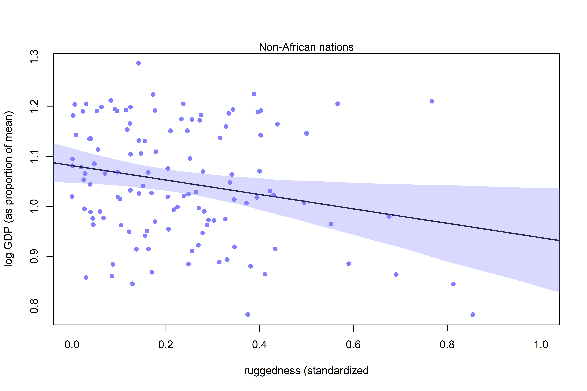

Conditional Manatees
================

-   During WWII, Royal Air Force bombers were being shot down in droves
    — those that weren’t returned with bullet holes covering the wings,
    but no bullet holes on the engine/compartment.
-   The air force needed to protect the bombers as efficiently as
    possible — but putting more armor on the areas that had the most
    bullet holes wouldn’t work!
-   This is because wings can withstand bullet damage, but the engine
    can’t!
-   In this way, data (like the bomber damage), is *conditional* on how
    they get into the sample.
-   Sometimes, the importance of one predictor depends on another
    predictor — this is known as an *interaction*.

## 8.1 Building an interaction

-   In countries outside Africa, GDP (or rather, log(GDP)) is negatively
    associated with terrain ruggedness. For countries within Africa,
    however, there’s a positive relationship! This is a clear indication
    of an interaction.
-   If *R* is terrain ruggedness, *G* is GDP, *C* is continent, and *U*
    is some set of unobserved confounders, a potential DAG may look
    like:

``` r
library(rethinking)
library(dagitty)

africa_dag <-
  dagitty(
    "dag{
      U [unobserved]
      U -> R
      U -> G
      R -> G
      C -> G
    }"
  )

coordinates(africa_dag) <-
  list(x = c(R = 0, G = 1, C = 2, U = 1),
       y = c(R = 0, G = 0, C = 0, U = 1))

drawdag(africa_dag)
```

<!-- -->

-   Here, both *R* and *C* influence *G*. This could be independent, or
    through an interaction (DAGs don’t describe whethere there is an
    action, just says that *G* is *some function* of *R* and *G*).
-   Splitting the data into separate models for different continents
    isn’t a great idea, for a few reasons:
    1.  Some variables (like *σ*) may not depend on the continent at all
    2.  In order to learn something about the continent variable itself,
        we need to include it directly in the model!
    3.  We may want to compare models based on an information criteria,
        & it’s only useful to do so with models that use the same data
    4.  Once we get into multilevel models, we’ll see that there’s a lot
        of benefit to “borrowing” information across categories.

### 8.1.1 Making a rugged model

-   Let’s first fit a model that *doesn’t* use an interaction between
    continent & ruggedness.

``` r
data(rugged)
d <- rugged

# make log version of outcome
d$log_gdp <- log(d$rgdppc_2000)

# extract countries with GDP data
dd <- d[complete.cases(d$rgdppc_2000), ]

# rescale variables
dd$log_gdp_std <- dd$log_gdp / mean(dd$log_gdp)
dd$rugged_std <- dd$rugged / max(dd$rugged)
```

-   Scaling makes setting the priors a bit easier to work with — a *μ*
    value of 1 corresponds to the average log(GDP), so a
    *N**o**r**m**a**l*(1,1) prior makes sense.
-   *β* has no bias towards positive or negative, so a
    *N**o**r**m**a**l*(0,1) prior is reasonable.
-   Finally, if we assume we have no knowledge about standard deviation,
    we can use an *E**x**p**o**n**e**n**t**i**a**l*(1) prior for *σ*.

$$
\\begin{gather}
log(y_i) \\sim Normal(\\mu_i, \\sigma) \\\\
\\mu_i = \\alpha + \\beta(r_i - \\overline{r}) \\\\
\\alpha \\sim Normal(1, 1) \\\\
\\beta \\sim Normal(0, 1) \\\\
\\sigma \\sim Exponential(1) 
\\end{gather}
$$

``` r
# build a model
m8.1 <-
  quap(
    alist(log_gdp_std ~ dnorm(mu, sigma),
          mu <- a + b*(rugged_std - 0.215), # 0.215 is the average ruggedness, courtesy of Dr. McElreath
          a ~ dnorm(1, 1),
          b ~ dnorm(0, 1),
          sigma ~ dexp(1)),
    data = dd
  )

# put together prior predictions
set.seed(7)
prior <- extract.prior(m8.1)

# plot!
plot(NULL,
     xlim = c(0,1),
     ylim = c(0.5, 1.5),
     xlab = "ruggedness",
     ylab = "log GDP")

abline(h = min(dd$log_gdp_std), lty = 2)
abline(h = max(dd$log_gdp_std), lty = 2)

# draw 50 lines from the prior
rugged_seq <- seq(rom = 0.1, to = 1.1, length.out = 30)
mu <- link(m8.1, post = prior, data = data.frame(rugged_std = rugged_seq))
for (i in 1:50) lines(rugged_seq, mu[i,], col = col.alpha("black", 0.3))
```

<!-- -->

-   Oh no! many of these regression lines end up in impossible
    territory!
-   Let’s update our priors to be more reasonable, given what we know
    about what ought to be reasonable:

``` r
m8.1 <-
  quap(
    alist(log_gdp_std ~ dnorm(mu, sigma),
          mu <- a + b*(rugged_std - 0.215),
          a ~ dnorm(1, 0.1),
          b ~ dnorm(0, 0.3),
          sigma ~ dexp(1)),
    data = dd
  )

# replot priors
set.seed(7)
prior <- extract.prior(m8.1)

# plot!
plot(NULL,
     xlim = c(0,1),
     ylim = c(0.5, 1.5),
     xlab = "ruggedness",
     ylab = "log GDP")

abline(h = min(dd$log_gdp_std), lty = 2)
abline(h = max(dd$log_gdp_std), lty = 2)

# draw 50 lines from the prior
rugged_seq <- seq(rom = 0.1, to = 1.1, length.out = 30)
mu <- link(m8.1, post = prior, data = data.frame(rugged_std = rugged_seq))
for (i in 1:50) lines(rugged_seq, mu[i,], col = col.alpha("black", 0.3))
```

<!-- -->

-   Much more reasonable!
-   Now what is the posterior relationship between ruggedness &
    log(GDP)?

``` r
precis(m8.1)
```

    ##              mean          sd       5.5%      94.5%
    ## a     0.999999515 0.010411972  0.9833592 1.01663986
    ## b     0.001990935 0.054793464 -0.0855796 0.08956147
    ## sigma 0.136497402 0.007396152  0.1246769 0.14831788

-   Basically nothing!

### 8.1.2 Adding an indicator variable isn’t enough

-   Adding an indicator for African nations, `const_africa`, won’t
    correct our slope issue!
-   Let’s still fit this model so we can see why (here,
    *α*<sub>*C**I**D*\[*i*\]</sub> is an index for continent id):

$$
\\begin{gather}
\\mu_i = \\alpha\_{CID\[i\]} + \\beta(r_i - \\overline r)
\\end{gather}
$$

``` r
# make variable to index countries in africa (1) or not (2)
# this means that our prior for african nations isn't more uncertain than non-african nations
dd$cid <- ifelse(dd$cont_africa == 1, 1, 2)

# fit with indicator variable
m8.2 <-
  quap(
    alist(log_gdp_std ~ dnorm(mu, sigma),
          mu <- a[cid] + b*(rugged_std - 0.215),
          a[cid] ~ dnorm(1, 0.1),
          b ~ dnorm(0, 0.3),
          sigma ~ dexp(1)),
    data = dd
  )

# compare with WAIC:
compare(m8.1, m8.2)
```

    ##           WAIC       SE    dWAIC      dSE    pWAIC       weight
    ## m8.2 -252.2687 15.30518  0.00000       NA 4.258517 1.000000e+00
    ## m8.1 -188.7542 13.29295 63.51448 15.14678 2.690401 1.614382e-14

``` r
# show parameter values
precis(m8.2, depth = 2)
```

    ##              mean          sd       5.5%      94.5%
    ## a[1]   0.88041284 0.015937003  0.8549424 0.90588325
    ## a[2]   1.04916425 0.010185554  1.0328858 1.06544274
    ## b     -0.04651347 0.045686725 -0.1195297 0.02650274
    ## sigma  0.11238738 0.006091077  0.1026527 0.12212209

-   Here, `a[1]` is the intercept for African nations and is reliably
    lower than `a[2]` (non-African nations)

``` r
# compare the posterior difference between a1/a2
post <- extract.samples(m8.2)
diff_a1_a2 <- post$a[,1] - post$a[,2]
PI(diff_a1_a2)
```

    ##         5%        94% 
    ## -0.1990118 -0.1378490

-   Despite this difference in intercepts, there is not a difference in
    slopes (see figure 8.4 on page 247)

``` r
rugged_seq <- seq(from = -0.1, to = 1.1, length.out = 30)

# compute mu over samples, fixing cid = 2 and then cid = 1
mu.notAfrica <- link(m8.2, data = data.frame(cid = 2, rugged_std = rugged_seq))
mu.Africa <- link(m8.2, data = data.frame(cid = 1, rugged_std = rugged_seq))

# summarise to means and intervals
mu.notAfrica_mu <- apply(mu.notAfrica, 2, mean)
mu.notAfrica_ci <- apply(mu.notAfrica, 2, PI, prob = 0.97)
mu.Africa_mu <- apply(mu.Africa, 2, mean)
mu.Africa_ci <- apply(mu.Africa, 2, PI, prob = 0.97)

# plot
plot(NULL,
     xlab = "ruggedness (standardized)",
     ylab = "log GDP (as proportion of mean)",
     xlim = c(0, 1),
     ylim = c(0.7, 1.3))

lines(x = rugged_seq, y = mu.notAfrica_mu, lwd = 2)
shade(mu.notAfrica_ci, rugged_seq, col = col.alpha("black", 0.25))
lines(x = rugged_seq, y = mu.Africa_mu, lwd = 2, col = rangi2)
shade(mu.Africa_ci, rugged_seq, col = col.alpha(rangi2, 0.25))
```

<!-- -->

### 8.1.3 Adding an interaction does work

-   To add an interaction, we can double down on indexing to make our
    slope conditional as well as the intercept (as an aside, I really
    appreciate this way of looking at indicators and interactions, it
    makes it way easier to generalize to hierarchical models):

$$
\\begin{gather}
\\mu_i = \\alpha\_{CID\[i\]} + \\beta\_{CID\[i\]} (r_i - \\overline r)
\\end{gather}
$$

``` r
# fit a model with an interaction
m8.3 <-
  quap(
    alist(log_gdp_std ~ dnorm(mu, sigma),
          mu <- a[cid] + b[cid]*(rugged_std - 0.215),
          a[cid] ~ dnorm(1, 0.1),
          b[cid] ~ dnorm(0, 0.3),
          sigma ~ dexp(1)),
    data = dd
  )

# inspect the marginal posterior distribution
precis(m8.3, depth = 2)
```

    ##             mean          sd        5.5%       94.5%
    ## a[1]   0.8865442 0.015676378  0.86149028  0.91159804
    ## a[2]   1.0505689 0.009937071  1.03468758  1.06645030
    ## b[1]   0.1326132 0.074207629  0.01401504  0.25121129
    ## b[2]  -0.1427253 0.054751746 -0.23022921 -0.05522148
    ## sigma  0.1094993 0.005935989  0.10001242  0.11898613

``` r
# investigate predictions based on PSIS:
compare(m8.1, m8.2, m8.3, func = PSIS)
```

    ##           PSIS       SE    dPSIS       dSE    pPSIS       weight
    ## m8.3 -259.1326 15.21911  0.00000        NA 5.166182 9.716174e-01
    ## m8.2 -252.0662 15.40450  7.06637  6.670773 4.340923 2.838263e-02
    ## m8.1 -188.5944 13.37393 70.53821 15.453690 2.750823 4.680775e-16

-   If prediction is the end goal, this is very strong evidence for the
    interaction effect.
-   The little bit of weight for `m8.2` suggests that the posterior
    means for slopes in `m8.3` are a bit overfit. The standard error of
    the difference in PSIS is almost the same as the difference itself!

``` r
plot(PSIS(m8.3, pointwise = TRUE)$k)
```

<!-- -->

### 8.1.4 Plotting the interaction

``` r
# plot Africa - cid = 1
plot_africa <- function(idx = 1) {
  
  # pull out frame for plotting
  d.plot <- dd[dd$cid == idx, ]
  
  # plot area
  plot(
    d.plot$rugged_std, 
    d.plot$log_gdp_std, 
    pch = 16, 
    col = rangi2,
    xlab = "ruggedness (standardized",
    ylab = "log GDP (as proportion of mean)",
    xlim = c(0, 1)
  )
  
  # pull out mean & ci
  mu <- link(m8.3, data = data.frame(cid = idx, rugged_std = rugged_seq))
  mu_mean <- apply(mu, 2, mean)
  mu_ci <- apply(mu, 2, PI, prob = 0.97)
  
  # add trend to plot
  lines(rugged_seq, mu_mean, lwd = 2)
  shade(mu_ci, rugged_seq, col = col.alpha(rangi2, 0.3))
  
  # add title
  if (idx == 1) mtext("African nations") else mtext("Non-African nations")
  
}

# plot for continent: africa:
plot_africa(1)
```

<!-- -->

``` r
# plot for other continents:
plot_africa(2)
```

<!-- -->

## 8.2 Symmetry of interactions

-   Let’s generate a *counter-facutal* plot, comparing the difference
    between being an African/non-African nation at varying levels of
    ruggedness:

``` r
rugged_seq <- seq(from = -0.2, to = 1.2, length.out = 30)
muA <- link(m8.3, data = data.frame(cid = 1, rugged_std = rugged_seq))
muN <- link(m8.3, data = data.frame(cid = 2, rugged_std = rugged_seq))
delta <- muA - muN

delta_mu <- apply(delta, 2, mean)
delta_ci <- apply(delta, 2, PI, prob = 0.89)

plot(
  NULL,
  xlim = c(0, 1),
  ylim = c(-0.3, 0.2),
  xlab = "ruggedness",
  ylab = "expected difference in log GDP (A - N)"
)

lines(x = rugged_seq, y = delta_mu, lwd = 2)
shade(delta_ci, rugged_seq)
```

<!-- -->

-   This is consistent with (1) the influence of ruggedness depends on
    continent and (2) the influence of continent depends upon
    ruggedness!

## 8.3 Continuous interactions

-   Interactions among continuous variables are much more difficult!
-   *Continuous interactions* are interactions between two or more
    continuous predictor variables.

### 8.3.1 A winter flower

``` r
# load data for the sizes of blooms from beds of tulups under different soil and light conditions
data("tulips")
d <- tulips
str(d)
```

    ## 'data.frame':    27 obs. of  4 variables:
    ##  $ bed   : Factor w/ 3 levels "a","b","c": 1 1 1 1 1 1 1 1 1 2 ...
    ##  $ water : int  1 1 1 2 2 2 3 3 3 1 ...
    ##  $ shade : int  1 2 3 1 2 3 1 2 3 1 ...
    ##  $ blooms: num  0 0 111 183.5 59.2 ...

-   We want to predict the number of `blooms` using `water` and `shade`
    as predictors.
-   `water` is three ordered levels of water supply from low (1) to high
    (3)
-   `shade`, conversely, is three ordered levels of light exposure from
    low (1) to high (3)
-   It stands to reason that light and water levels will improve growth,
    but there may also be an interaction between the two!

### 8.3.2 The models

-   Let’s build two models: one with `water` and `shade` but no
    interaction, and a second that contains the interaction as well.

``` r
# scale values
d$blooms_std <- d$blooms/max(d$blooms)
d$water_cent <- d$water - mean(d$water)
d$shade_cent <- d$shade - mean(d$shade)
```

$$
\\begin{gather}
Bloom_i \\sim Normal(\\mu_i, \\sigma) \\\\ 
\\mu_i = \\alpha + \\beta_W (W_i - \\overline W) + \\beta_S (S_i - \\overline S) \\\\
\\alpha \\sim Normal(0.5, 0.25) \\\\
\\beta_W \\sim Normal(0, 0.25) \\\\ 
\\beta_S \\sim Normal(0, 0.25) \\\\
\\sigma \\sim Exponential(1)
\\end{gather}
$$

-   McElreath originally set priors for the *α* and *β* parameters with
    a standard deviation of 1, but that would have put most of the prior
    probability outside any reasonable range:

``` r
a <- rnorm(1e4, 0.5, 1)

# we really only ought to expect ~5ish percent outside the range of 0/1
sum(a < 0 | a > 1)/length(a)
```

    ## [1] 0.6164

``` r
# changing std dev to 0.25 fixes that:
a <- rnorm(1e4, 0.5, 0.25)

sum(a < 0 | a > 1)/length(a)
```

    ## [1] 0.0473

``` r
m8.4 <-
  quap(
    alist(blooms_std ~ dnorm(mu, sigma),
          mu <- a + bw*water_cent + bs*shade_cent,
          a ~ dnorm(0.5, 0.25),
          bw ~ dnorm(0, 0.25),
          bs ~ dnorm(0, 0.25),
          sigma ~ dexp(1)),
    data = d
  )

precis(m8.4)
```

    ##             mean         sd       5.5%       94.5%
    ## a      0.3587847 0.03021990  0.3104875  0.40708195
    ## bw     0.2050361 0.03689063  0.1460778  0.26399445
    ## bs    -0.1125324 0.03687677 -0.1714686 -0.05359619
    ## sigma  0.1581591 0.02144538  0.1238853  0.19243297

-   Now let’s start building the interaction model. In principle, there
    are an infinite number of “categories” among the two predictors.
-   We want to preserve the ordering of the values. Lucky for us, the
    math is pretty simple:

$$
\\begin{gather}
Bloom_i \\sim Normal(\\mu_i, \\sigma) \\\\
\\mu_i = \\alpha + \\beta_W W_i + \\beta_S S_i + \\beta\_{WS} W_i S_i \\\\
...
\\end{gather}
$$

``` r
m8.5 <-
  quap(
    alist(blooms_std ~ dnorm(mu, sigma),
          mu <- a + bw*water_cent + bs*shade_cent + bws*water_cent*shade_cent,
          a ~ dnorm(0.5, 0.25),
          bw ~ dnorm(0, 0.25),
          bs ~ dnorm(0, 0.25),
          bws ~ dnorm(0, 0.25),
          sigma ~ dexp(1)),
    data = d
  )

precis(m8.5)
```

    ##             mean         sd        5.5%       94.5%
    ## a      0.3579806 0.02391931  0.31975291  0.39620827
    ## bw     0.2067216 0.02923520  0.15999815  0.25344514
    ## bs    -0.1134683 0.02922809 -0.16018042 -0.06675616
    ## bws   -0.1431849 0.03568024 -0.20020885 -0.08616101
    ## sigma  0.1248475 0.01694131  0.09777206  0.15192302

### Plotting posterior predictions

-   A *triptych* plot can be very useful for plotting interactions.

``` r
tulip_post_plot <- function(model) {
  
  par(mfrow = c(1, 3))
  for (s in -1:1) {
    
    idx <- which(d$shade_cent == s)
    plot(d$water_cent[idx],
         d$blooms_std[idx], 
         xlim = c(-1, 1),
         ylim = c(0, 1),
         xlab = "water",
         ylab = "blooms",
         pch = 16,
         col = rangi2)
    
    mu <- link(model, data = data.frame(shade_cent = s, water_cent = -1:1))
    for (i in 1:20) lines(-1:1, mu[i,], col = col.alpha("black", 0.3))
    
  } 
  
}

# posterior plot for model without interactions
tulip_post_plot(m8.4)
```

<!-- -->

``` r
# posterior plot for model with interactions
tulip_post_plot(m8.5)
```

<!-- -->

-   The interaction model believes that the effect of water decreases as
    shade increases!

### 8.3.4 Plotting prior predictions

-   Let’s evaluate our priors from beforehand:

``` r
set.seed(7)
prior_no_interact <- extract.prior(m8.4)
prior_interact <- extract.prior(m8.5)

tulip_prior_plot <- function(model, prior) {
  
  par(mfrow = c(1, 3))
  for (s in -1:1) {
    
    idx <- which(d$shade_cent == s)
    plot(d$water_cent[idx],
         d$blooms_std[idx], 
         xlim = c(-1, 1),
         ylim = c(0, 1),
         xlab = "water",
         ylab = "blooms",
         pch = 16,
         col = rangi2)
    
    mu <- link(model, post = prior, data = data.frame(shade_cent = s, water_cent = -1:1))
    for (i in 1:20) lines(-1:1, mu[i,], col = col.alpha("black", 0.3))
    
  } 
  
}

# prior for non interaction model
tulip_prior_plot(m8.4, prior_no_interact)
```

<!-- -->

``` r
# prior for interaction model
tulip_prior_plot(m8.5, prior_interact)
```

<!-- -->

-   These are harmless, but only weakly realistic (see page 259 for
    McElreath’s original plots). We could do better, but this is okay.

## 8.4 Summary

-   This chapter introduced *interactions*, which allow for the
    association between a predictor and outcome to depend on the value
    of another predictor.
-   Interactions don’t appear in a DAG, but can be important for making
    accurate inferences.
-   Interactions can be difficult to interpret.
-   Sneak peak, next chapter introduces MCMC.
