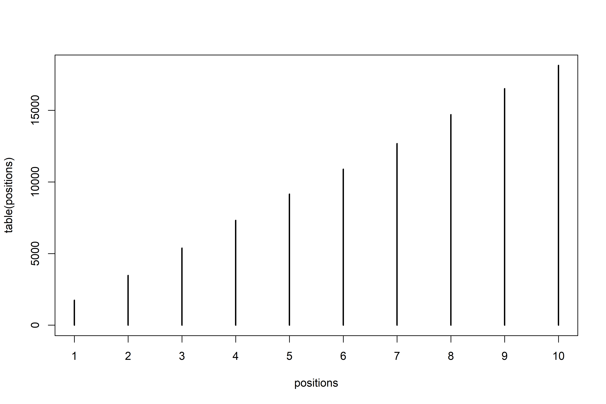

Markov Chain Monte Carlo
================

-   *Markov Chain Monte Carlo (MCMC)* is a stochastic process that
    allows for the estimation of posterior probability distributions
    without maximizing anything (unlike `quap()`).
-   `{rethinking}` has tools to interface to *Stan*, a probabilistic
    programming language.

## 9.1 Good King Markov and his island kingdom

-   Consider the tale of King Markov visiting the islands (in a ring) of
    varying populations under his domain:
-   The *Metropolis Algorithm* can describe a method for where King
    Markov will visit:
    1.  Each week, the King can either stay on his current island or
        move to one of the two adjacent islands in the ring. To decide
        to move or stay he flips a coin.
    2.  If the coin is heads, he considers moving to the adjacent
        clockwise island. If tails, he considers moving to the adjacent
        counterclockwise island.
    3.  If the proposed island has a greater population than the current
        island, he moves.
    4.  If the proposed island has a lesser population, the probability
        that he moves there is `proposed_island_pop/current_island_pop`.

``` r
# lets simulate the king's movement!
# the island index (1:10) is equivalent to its population
num_weeks <- 1e5
positions <- rep(0, num_weeks)
current <- 10

for (i in 1:num_weeks) {
  
  # record current position
  positions[i] <- current
  
  # flip coin to generate proposal
  proposal <- current + sample(c(-1, 1), size = 1)
  
  # now make sure he loops around the ring of islands!
  if (proposal < 1) proposal <- 10
  if (proposal > 10) proposal <- 1
  
  # move?
  prob_move <- proposal/current
  current <- ifelse(runif(1) < prob_move, proposal, current)
  
}

plot(1:100, positions[1:100])
```

<!-- -->

``` r
plot(table(positions))
```

<!-- -->

## 9.2 Metropolis algorithms

-   The above method for King Markov was a special case of the general
    *Metropolis Algorithm*:
    -   The islands are like parameter values (but they can be
        continuous instead of discrete).
    -   The population sizes are posterior probabilities
    -   The weeks are samples from the joint posterior

### 9.2.1 Gibbs sampling

-   Gibbs sampling is much better than plain Metropolis, and while it’s
    still common in applied Bayesian statistics, it’s rapidly being
    replaced by other algorithms.
-   The above algorithm for King Markov gave equal probability to moving
    to either adjacent island — a more general method allows asymmetric
    proposals.
-   *Gibbs sampling* is a variant that uses clever asymmetric proposals
    to sample more efficiently (*adaptive proposals*). It makes use of
    particular combinations of priors/likelihoods known as *conjugate
    pairs* (ex, beta-binomial)
-   `BUGS` (Bayesian inference Using Gibbs Sampling) and `JAGS` (Just
    Another Gibbs Sampler) are two popular programs for Gibbs sampling.

### 9.2.2 High-dimensional problems

-   Some limitations of Gibbs sampling:
    1.  Maybe you don’t want to use conjugate priors
    2.  Complex models with hundreds or thousands of parameters make
        both Metropolis and Gibbs shockingly inefficient (they can get
        stuck in small regions of the posterior for a while)
    3.  Another problem with many parameters is that the maximum
        probability mass is not at the mode (read page 269 for a more
        thorough explanation from McElreath):

``` r
library(rethinking)

# set a 10 dimensional mvnorm:
D <- 10
T <- 1e3
Y <- rmvnorm(T, rep(0, D), diag(D))

# find the distance from the mode
rad_dist <- function(Y) sqrt(sum(Y^2))
Rd <- sapply(1:T, function(i) rad_dist(Y[i,]))

# a 10-dimensional mv normal --- the mode is far away from the values we want to sample
dens(Rd)
```

<!-- -->

## 9.3 Hamiltonian Monte Carlo

-   *Hamiltonian Monte Carlo* (HMC) is more computationally costly than
    Metropolis or Gibbs, but it’s proposals are much more efficient, so
    ends up taking far fewer samples to describe the posterior.
-   HMC can even shine when there are thousands (or tens of thousands)
    of parameters.

### 9.3.1 Another parable

-   Let’s consider another tale, this time of King Monty, who needs to
    visit his citizens in a continuous valley in accordance to their
    local population density.
-   In the valley, people are distributed in inverse proportion to the
    elevation (more people at low elevation, fewer at high elevation).
-   An algorithm that involves fewer instances of staying in the same
    spot looks like this:
    1.  Pick a random direction (north or south) and drive off at a
        random momentum. If the vehicle goes uphill, it will slow down
        (and potentially go in reverse). If the vehicle goes downhill,
        it will speed up.
    2.  After a fixed period of time, stop.
    3.  Repeat!
-   The *autocorrelation* between locations visited is very low under
    this strategy.

### 9.3.2 Particles in space

-   Suppose we have 100 *x* and 100 *y* variables, all sampled from
    *N**o**r**m**a**l*(0,1).

$$
\\begin{gather}
x_i \\sim Normal(\\mu_x, 1) \\\\
y_i \\sim Normal(\\mu_y, 1) \\\\
\\mu_x \\sim Normal(0, 0.5) \\\\
\\mu_y \\sim Normal(0, 0.5)
\\end{gather}
$$

-   HMC needs two functions and two settings:
    -   The first function computes the log probability of the data and
        parameters.
    -   The second function it needs is the *gradient*.
    -   The first setting is the number of *leapfrog steps*.
    -   The second setting is the *step size*.
-   Sometimes, combinations of leapfrog steps and step size will run
    into a *U-turn* problem. Stan has two ways of dealing with this:
    1.  Firstly, Stan chooses the number of steps and step size in the
        *warmup* phase of sampling.
    2.  Secondly, Stan cleverly adapts the number of leapfrog steps
        during sampling with the *No-U-Turn-Sampler* (NUTS) algorithm.

``` r
# Hamiltonian Monte Carlo in the raw!

# function for the log posterior
U <- function(q, a = 0, b = 1, k = 0, d = 1) {
  
  muy <- q[1]
  mux <- q[2]
  
  U <- 
    sum(dnorm(y, muy, 1, log = TRUE)) + 
    sum(dnorm(x, mux, 1, log = TRUE)) +
    dnorm(muy, a, b, log = TRUE) + 
    dnorm(mux, k, d, log = TRUE)
  
  return(-U)
  
}

# gradient function
# need a vector of partial derivatives of U with respect to vector q
U_gradient <- function(q, a = 0, b = 1, k = 0, d = 1) {
  
  muy <- q[1]
  mux <- q[2]
  G1 <- sum(y - muy) + (a - muy)/b^2
  G2 <- sum(x - mux) + (k - mux)/d^2
  
  return(c(-G1, -G2))
  
}

# test it oot
set.seed(7)
y <- rnorm(50)
x <- rnorm(50)
x <- as.numeric(scale(x))
y <- as.numeric(scale(y))

library(shape) # fancy arrows
Q <- list()
Q$q <- c(-0.1, 0.2)
pr <- 0.3

plot(NULL, 
     xlab = "mux",
     ylab = "muy",
     xlim = c(-pr, pr),
     ylim = c(-pr, pr))

step <- 0.03
L <- 11

n_samples <- 4
path_col <- col.alpha("black", 0.5)

points(Q$q[1], Q$q[2], pch = 4, col = "black")

for (i in 1:n_samples) {
  
  Q <- HMC2(U, U_gradient, step, L, Q$q)
  if (n_samples < 10) {
    for (j in 1:L) {
      K0 <- sum(Q$ptraj[j,]^2)/2
      lines(Q$traj[j:(j+1), 1], Q$traj[j:(j+1), 2], col = path_col, lwd = 1 + 2*K0)
    }
    points(Q$traj[1:L+1,], pch = 16, col = "white", cex = 0.35)
    Arrows(Q$traj[L, 1], Q$traj[L, 2], Q$traj[L + 1, 1], Q$traj[L + 1, 2], arr.length = 0.35, arr.adj = 0.7)
    text(Q$traj[L + 1, 1], Q$traj[L + 1, 2], i, cex = 0.8, pos = 4, offset = 0.4)
  }
  
  points(Q$traj[L + 1, 1], Q$traj[L + 1, 2], pch = ifelse(Q$accept == 1, 16, 1),
         col = ifelse(abs(Q$dH) > 0.1, "red", "black"))
}
```

<!-- -->

-   `HMC2()` is built into rethinking:

``` r
HMC2
```

    ## function (U, grad_U, epsilon, L, current_q, ...) 
    ## {
    ##     q = current_q
    ##     p = rnorm(length(q), 0, 1)
    ##     current_p = p
    ##     p = p - epsilon * grad_U(q, ...)/2
    ##     qtraj <- matrix(NA, nrow = L + 1, ncol = length(q))
    ##     ptraj <- qtraj
    ##     qtraj[1, ] <- current_q
    ##     ptraj[1, ] <- p
    ##     for (i in 1:L) {
    ##         q = q + epsilon * p
    ##         if (i != L) {
    ##             p = p - epsilon * grad_U(q, ...)
    ##             ptraj[i + 1, ] <- p
    ##         }
    ##         qtraj[i + 1, ] <- q
    ##     }
    ##     p = p - epsilon * grad_U(q, ...)/2
    ##     ptraj[L + 1, ] <- p
    ##     p = -p
    ##     current_U = U(current_q, ...)
    ##     current_K = sum(current_p^2)/2
    ##     proposed_U = U(q, ...)
    ##     proposed_K = sum(p^2)/2
    ##     H0 <- current_U + current_K
    ##     H1 <- proposed_U + proposed_K
    ##     new_q <- q
    ##     accept <- 0
    ##     if (runif(1) < exp(current_U - proposed_U + current_K - proposed_K)) {
    ##         new_q <- q
    ##         accept <- 1
    ##     }
    ##     else new_q <- current_q
    ##     return(list(q = new_q, traj = qtraj, ptraj = ptraj, accept = accept, 
    ##         dH = H1 - H0))
    ## }
    ## <bytecode: 0x000001b482e4f9d8>
    ## <environment: namespace:rethinking>

-   Really the momentum aspect is a huge part of HMC — the “total
    energy” must remain constant. If the energy at the start of the
    trajectory differs substantially from the energy at the end,
    something has gone awry and we get a *divergent transition*.

### 9.3.3 Limitations

-   HMC requires continuous parameters (so we’ll have to code some
    tricks to use certain techniques, like the imputation of missing
    data).
-   HMC is not magic and some posterior distributions are just very
    difficult to sample from.

## 9.4 Easy HMC: `ulam()`

-   `ulam()` works a lot like `quap()`, but needs a little bit of
    housekeeping: preprocess any variable transformations and construct
    a clean data list with only the variables you will use.
-   Other R packages, like
    [`{brms}`](https://paul-buerkner.github.io/brms/index.html) and
    [`{rstanarm}`](https://mc-stan.org/rstanarm/index.html) for
    multilevel models and
    [`{blavaan}`](https://ecmerkle.github.io/blavaan/) for structural
    equation models, are even easier, though McElreath recommends
    sticking with `ulam()` until we are comfortable with full and
    explicit formulas.
-   Recall the ruggedness `quap()` model from chapter 8:

``` r
# load data
data("rugged")
d <- rugged

# prep data
d$log_gdp <- log(d$rgdppc_2000)
dd <- d[complete.cases(d$rgdppc_2000), ]
dd$log_gdp_std <- dd$log_gdp/mean(dd$log_gdp)
dd$rugged_std <- dd$rugged/max(dd$rugged)
dd$cid <- ifelse(dd$cont_africa == 1, 1, 2)

# model
m8.3 <- 
  quap(
    alist(log_gdp_std ~ dnorm(mu, sigma), 
          mu <- a[cid] + b[cid]*(rugged_std - 0.215),
          a[cid] ~ dnorm(1, 0.1),
          b[cid] ~ dnorm(0, 0.3),
          sigma ~ dexp(1)),
    data = dd
  )

precis(m8.3, depth = 2)
```

    ##             mean          sd        5.5%       94.5%
    ## a[1]   0.8865640 0.015674552  0.86151302  0.91161495
    ## a[2]   1.0505666 0.009935872  1.03468714  1.06644602
    ## b[1]   0.1324981 0.074199237  0.01391344  0.25108286
    ## b[2]  -0.1426057 0.054745410 -0.23009945 -0.05511197
    ## sigma  0.1094859 0.005934188  0.10000194  0.11896990

### 9.4.1 Preparation

-   To refit `m8.3` using HMC via `ulam()`, we’ll need to do a few
    things:
    1.  Preprocess all variable transformations, like logs, squares,
        polynomials, etc. (it’s a waste of compute to do this with HMC)
    2.  Trim down the training data frame to just the variables used in
        the model directly.

``` r
# for m8.3, all variables are already pre-processed
# so we just need a slim list of data
dat_slim <-
  list(log_gdp_std = dd$log_gdp_std,
       rugged_std = dd$rugged_std,
       cid = as.integer(dd$cid))

str(dat_slim)
```

    ## List of 3
    ##  $ log_gdp_std: num [1:170] 0.88 0.965 1.166 1.104 0.915 ...
    ##  $ rugged_std : num [1:170] 0.138 0.553 0.124 0.125 0.433 ...
    ##  $ cid        : int [1:170] 1 2 2 2 2 2 2 2 2 1 ...

-   It’s better to use a list than a dataframe, since lists can be
    varying lengths (with some models, like multilevel models, this
    isn’t unusual).

### 9.4.2 Sampling from the posterior

``` r
m9.1 <-
  ulam(
    alist(log_gdp_std ~ dnorm(mu, sigma),
          mu <- a[cid] + b[cid]*(rugged_std - 0.215),
          a[cid] ~ dnorm(1, 0.1),
          b[cid] ~ dnorm(0, 0.3),
          sigma ~ dexp(1)),
    data = dat_slim,
    chains = 1
  )
```

    ## Running MCMC with 1 chain, with 1 thread(s) per chain...
    ## 
    ## Chain 1 Iteration:   1 / 1000 [  0%]  (Warmup) 
    ## Chain 1 Iteration: 100 / 1000 [ 10%]  (Warmup) 
    ## Chain 1 Iteration: 200 / 1000 [ 20%]  (Warmup) 
    ## Chain 1 Iteration: 300 / 1000 [ 30%]  (Warmup) 
    ## Chain 1 Iteration: 400 / 1000 [ 40%]  (Warmup) 
    ## Chain 1 Iteration: 500 / 1000 [ 50%]  (Warmup) 
    ## Chain 1 Iteration: 501 / 1000 [ 50%]  (Sampling) 
    ## Chain 1 Iteration: 600 / 1000 [ 60%]  (Sampling) 
    ## Chain 1 Iteration: 700 / 1000 [ 70%]  (Sampling) 
    ## Chain 1 Iteration: 800 / 1000 [ 80%]  (Sampling) 
    ## Chain 1 Iteration: 900 / 1000 [ 90%]  (Sampling) 
    ## Chain 1 Iteration: 1000 / 1000 [100%]  (Sampling) 
    ## Chain 1 finished in 0.2 seconds.

``` r
precis(m9.1, depth = 2)
```

    ##             mean          sd         5.5%       94.5%    n_eff     Rhat4
    ## a[1]   0.8867640 0.014327070  0.863226055  0.90927205 828.2130 1.0003776
    ## a[2]   1.0505185 0.010136472  1.035520050  1.06744995 523.9357 1.0029986
    ## b[1]   0.1323973 0.072424321  0.008925831  0.25163263 835.7581 0.9980446
    ## b[2]  -0.1426852 0.060104625 -0.233822870 -0.04110599 569.8732 0.9984743
    ## sigma  0.1117469 0.005715907  0.103508355  0.12204910 563.5279 0.9980095

-   The estimates here from `ulam()` are really similar to the estimates
    from `quap()`, with two new columns, `n_eff` and `Rhat4`. These are
    diagnostic criteria that we’ll discuss later.

### 9.4.3 Sampling again, in parallel

-   This was a pretty “easy” problem, so the default 1000 samples was
    effective, but we can run the program on multiple chains in parallel
    pretty easily:

``` r
m9.1 <-
  ulam(
    alist(log_gdp_std ~ dnorm(mu, sigma),
          mu <- a[cid] + b[cid]*(rugged_std - 0.215),
          a[cid] ~ dnorm(1, 0.1),
          b[cid] ~ dnorm(0, 0.3),
          sigma ~ dexp(1)),
    data = dat_slim,
    chains = 4,
    cores = 4
  )
```

    ## Running MCMC with 4 parallel chains, with 1 thread(s) per chain...
    ## 
    ## Chain 1 Iteration:   1 / 1000 [  0%]  (Warmup) 
    ## Chain 1 Iteration: 100 / 1000 [ 10%]  (Warmup) 
    ## Chain 1 Iteration: 200 / 1000 [ 20%]  (Warmup) 
    ## Chain 2 Iteration:   1 / 1000 [  0%]  (Warmup) 
    ## Chain 2 Iteration: 100 / 1000 [ 10%]  (Warmup) 
    ## Chain 3 Iteration:   1 / 1000 [  0%]  (Warmup) 
    ## Chain 1 Iteration: 300 / 1000 [ 30%]  (Warmup) 
    ## Chain 1 Iteration: 400 / 1000 [ 40%]  (Warmup) 
    ## Chain 1 Iteration: 500 / 1000 [ 50%]  (Warmup) 
    ## Chain 1 Iteration: 501 / 1000 [ 50%]  (Sampling) 
    ## Chain 1 Iteration: 600 / 1000 [ 60%]  (Sampling) 
    ## Chain 1 Iteration: 700 / 1000 [ 70%]  (Sampling) 
    ## Chain 1 Iteration: 800 / 1000 [ 80%]  (Sampling) 
    ## Chain 1 Iteration: 900 / 1000 [ 90%]  (Sampling) 
    ## Chain 1 Iteration: 1000 / 1000 [100%]  (Sampling) 
    ## Chain 1 finished in 0.2 seconds.
    ## Chain 2 Iteration: 200 / 1000 [ 20%]  (Warmup) 
    ## Chain 2 Iteration: 300 / 1000 [ 30%]  (Warmup) 
    ## Chain 2 Iteration: 400 / 1000 [ 40%]  (Warmup) 
    ## Chain 2 Iteration: 500 / 1000 [ 50%]  (Warmup) 
    ## Chain 2 Iteration: 501 / 1000 [ 50%]  (Sampling) 
    ## Chain 2 Iteration: 600 / 1000 [ 60%]  (Sampling) 
    ## Chain 2 Iteration: 700 / 1000 [ 70%]  (Sampling) 
    ## Chain 2 Iteration: 800 / 1000 [ 80%]  (Sampling) 
    ## Chain 2 Iteration: 900 / 1000 [ 90%]  (Sampling) 
    ## Chain 2 Iteration: 1000 / 1000 [100%]  (Sampling) 
    ## Chain 2 finished in 0.2 seconds.
    ## Chain 3 Iteration: 100 / 1000 [ 10%]  (Warmup) 
    ## Chain 3 Iteration: 200 / 1000 [ 20%]  (Warmup) 
    ## Chain 3 Iteration: 300 / 1000 [ 30%]  (Warmup) 
    ## Chain 3 Iteration: 400 / 1000 [ 40%]  (Warmup) 
    ## Chain 3 Iteration: 500 / 1000 [ 50%]  (Warmup) 
    ## Chain 3 Iteration: 501 / 1000 [ 50%]  (Sampling) 
    ## Chain 3 Iteration: 600 / 1000 [ 60%]  (Sampling) 
    ## Chain 3 Iteration: 700 / 1000 [ 70%]  (Sampling) 
    ## Chain 3 Iteration: 800 / 1000 [ 80%]  (Sampling) 
    ## Chain 3 Iteration: 900 / 1000 [ 90%]  (Sampling) 
    ## Chain 3 Iteration: 1000 / 1000 [100%]  (Sampling) 
    ## Chain 3 finished in 0.2 seconds.
    ## Chain 4 Iteration:   1 / 1000 [  0%]  (Warmup) 
    ## Chain 4 Iteration: 100 / 1000 [ 10%]  (Warmup) 
    ## Chain 4 Iteration: 200 / 1000 [ 20%]  (Warmup) 
    ## Chain 4 Iteration: 300 / 1000 [ 30%]  (Warmup) 
    ## Chain 4 Iteration: 400 / 1000 [ 40%]  (Warmup) 
    ## Chain 4 Iteration: 500 / 1000 [ 50%]  (Warmup) 
    ## Chain 4 Iteration: 501 / 1000 [ 50%]  (Sampling) 
    ## Chain 4 Iteration: 600 / 1000 [ 60%]  (Sampling) 
    ## Chain 4 Iteration: 700 / 1000 [ 70%]  (Sampling) 
    ## Chain 4 Iteration: 800 / 1000 [ 80%]  (Sampling) 
    ## Chain 4 Iteration: 900 / 1000 [ 90%]  (Sampling) 
    ## Chain 4 Iteration: 1000 / 1000 [100%]  (Sampling) 
    ## Chain 4 finished in 0.2 seconds.
    ## 
    ## All 4 chains finished successfully.
    ## Mean chain execution time: 0.2 seconds.
    ## Total execution time: 0.5 seconds.

``` r
precis(m9.1, depth = 2)
```

    ##             mean          sd        5.5%       94.5%    n_eff     Rhat4
    ## a[1]   0.8867297 0.016360786  0.86062648  0.91309922 2671.904 1.0004209
    ## a[2]   1.0508396 0.010419400  1.03401000  1.06764165 2888.744 0.9984309
    ## b[1]   0.1346739 0.077660268  0.01139941  0.26077373 2778.726 0.9994793
    ## b[2]  -0.1408245 0.054882757 -0.22579499 -0.04898273 2785.335 0.9993736
    ## sigma  0.1116600 0.006326714  0.10205368  0.12261532 2778.156 0.9990519

``` r
show(m9.1)
```

    ## Hamiltonian Monte Carlo approximation
    ## 2000 samples from 4 chains
    ## 
    ## Sampling durations (seconds):
    ##         warmup sample total
    ## chain:1   0.12   0.11  0.23
    ## chain:2   0.12   0.11  0.22
    ## chain:3   0.10   0.11  0.21
    ## chain:4   0.10   0.10  0.20
    ## 
    ## Formula:
    ## log_gdp_std ~ dnorm(mu, sigma)
    ## mu <- a[cid] + b[cid] * (rugged_std - 0.215)
    ## a[cid] ~ dnorm(1, 0.1)
    ## b[cid] ~ dnorm(0, 0.3)
    ## sigma ~ dexp(1)

-   Something interesting — there are 4 chains, running 1000 samples
    each, half of which are warmup. So we should expect 2000 samples in
    total. Why are there more than 2000 effective samples then?
-   Stan’s adaptive sampler is so good, it can produce sequential
    samples that are better than uncorrelated, they are
    *anti-correlated*.

### 9.4.4 Visualization

``` r
pairs(m9.1)
```

<!-- -->

-   Here we can see how the Gaussian approximation from `quap()` was
    likely a good approximation of what HMC found — all distributions
    are approximately normal, and `sigma` is skewed in the direction we
    expect (bound by 0).

### 9.4.5 Checking the chain

-   Some posterior distributions are hard to explore, so we need to
    diagnose whether or not HMC was able to fully explore the posterior
    before trusting it completely.
-   Two tools that can often (but not always) spot problems are *trace
    plots* and *trace rank* or *trank plots*.
-   Trace plots show the samples in sequential order. A healthy trace
    plot tends to have three qualities:
    1.  Stationarity: the chain should be generally in the same
        high-probability area
    2.  Good mixing: the chain rapidly explores the full region (jumping
        erratically rather than slowly moving)
    3.  Convergence: multiple independent chains stick around the same
        region of high probability

``` r
# show all chains, all paremeters, all samples
traceplot(m9.1)

# show only 1 chain for the sampling region:
traceplot(
  m9.1, 
  chains = 1,
  window = c(501, 1000)
)
```

<!-- --><!-- -->

-   A trankplot takes all the samples across all chains for each
    parameter and ranks them. Histograms of these ranks for individual
    chains should be similar to one another and largely overlapping if
    the chains are exploring the space efficiently.

``` r
trankplot(m9.1)
```

<!-- -->

-   Some overthinking — all that `ulam()` does is translate lists of
    formulas to Stan code. Using Stan directly gives more flexibility,
    but isn’t necessary for all model types.

``` r
stancode(m9.1)
```

    ## data{
    ##     vector[170] log_gdp_std;
    ##     vector[170] rugged_std;
    ##     int cid[170];
    ## }
    ## parameters{
    ##     vector[2] a;
    ##     vector[2] b;
    ##     real<lower=0> sigma;
    ## }
    ## model{
    ##     vector[170] mu;
    ##     sigma ~ exponential( 1 );
    ##     b ~ normal( 0 , 0.3 );
    ##     a ~ normal( 1 , 0.1 );
    ##     for ( i in 1:170 ) {
    ##         mu[i] = a[cid[i]] + b[cid[i]] * (rugged_std[i] - 0.215);
    ##     }
    ##     log_gdp_std ~ normal( mu , sigma );
    ## }

-   The `data` block is where observed variables are named and their
    types and sizes are declared.
-   The `parameters` block is where the unobserved variables go and are
    described just like the observed ones.
-   The `model` block is where the action is — this computes the
    log-probability of the data, running from top to bottom.

## 9.5 Care and feeding of your Markov Chain

-   While we don’t need to be able to write our own HMC sampler from
    scratch, it is important to understand the basics of how HMC might
    go awry.
-   The good news is that HMC makes it pretty easy to tell when
    something isn’t right.

### 9.5.1 How many samples do you need?

-   You can control the number of samples per chain from the `iter` and
    `warmup` parameters (the default is `iter = 1000` and
    `warmup = iter/2`).
-   What really matters is the *effective* number of samples, rather
    than the raw number.
-   Chains are *autocorrelated*, meaning sequential samples are not
    entirely independent. More autocorrelation means lower `n_eff`.
-   You can think of `n_eff` as the length of a Markov chain with no
    autocorreation that would provide the same quality of estimate as
    your chain.
-   How many samples you need depends on what you want to know. If all
    you want is the posterior mean, then perhaps a few hundred samples
    will do. But if you care about the shape of the distribution or the
    extreme tails, you’ll need many, many more samples.
-   Stan will warn about the “tail ESS” (the effective sample size of
    the tail regions) when it is nervous about the quality of extreme
    intervals. Sampling more usually helps.
-   Warmup is a bit more subtle — you want to have the shortest warmup
    period necessary to get on with actual sampling, but longer warmup
    can mean more efficient sampling.
-   Some rethinking — warmup is not *burn-in*, where early samples are
    tossed out because they are unlikely to be in the stationary region.
    Warmup is the phase Stan uses to tune the adaptive sampler & find
    good values for step size/number of steps.

### 9.5.2 How many chains do you need?

-   When debugging a model, McElreath recommends using a single chain
    (there are some error messages that don’t display unless you’re
    using one chain).
-   You’ll need more than one chain do run diagnostics with trace/trank
    plots.
-   Once you get to the final run where you’re making inferences, you
    really only need one chain, but more than one chain is fine!
-   You can play with the number of chains/warmup/iterations to get to
    the most efficient sampling, but a general rule of thumb can be:
    *one short chain for debugging, four chains for verification and
    inference*.

### 9.5.3 Taming a wild chain

-   One common problem with some models is that there are broad, flat
    regions of the posterior density (this happens most often when you
    use flat priors!).

``` r
# wild chain example!
y <- c(-1, 1)
set.seed(11)

# really really really wide priors!
m9.2 <-
  ulam(
    alist(y ~ dnorm(mu, sigma),
          mu <- alpha,
          alpha ~ dnorm(0, 1000),
          sigma ~ dexp(0.0001)),
    data = list(y = y),
    chains = 3
  )
```

    ## Running MCMC with 3 sequential chains, with 1 thread(s) per chain...
    ## 
    ## Chain 1 Iteration:   1 / 1000 [  0%]  (Warmup) 
    ## Chain 1 Iteration: 100 / 1000 [ 10%]  (Warmup) 
    ## Chain 1 Iteration: 200 / 1000 [ 20%]  (Warmup) 
    ## Chain 1 Iteration: 300 / 1000 [ 30%]  (Warmup) 
    ## Chain 1 Iteration: 400 / 1000 [ 40%]  (Warmup) 
    ## Chain 1 Iteration: 500 / 1000 [ 50%]  (Warmup) 
    ## Chain 1 Iteration: 501 / 1000 [ 50%]  (Sampling) 
    ## Chain 1 Iteration: 600 / 1000 [ 60%]  (Sampling) 
    ## Chain 1 Iteration: 700 / 1000 [ 70%]  (Sampling) 
    ## Chain 1 Iteration: 800 / 1000 [ 80%]  (Sampling) 
    ## Chain 1 Iteration: 900 / 1000 [ 90%]  (Sampling) 
    ## Chain 1 Iteration: 1000 / 1000 [100%]  (Sampling) 
    ## Chain 1 finished in 0.2 seconds.
    ## Chain 2 Iteration:   1 / 1000 [  0%]  (Warmup) 
    ## Chain 2 Iteration: 100 / 1000 [ 10%]  (Warmup) 
    ## Chain 2 Iteration: 200 / 1000 [ 20%]  (Warmup) 
    ## Chain 2 Iteration: 300 / 1000 [ 30%]  (Warmup) 
    ## Chain 2 Iteration: 400 / 1000 [ 40%]  (Warmup) 
    ## Chain 2 Iteration: 500 / 1000 [ 50%]  (Warmup) 
    ## Chain 2 Iteration: 501 / 1000 [ 50%]  (Sampling) 
    ## Chain 2 Iteration: 600 / 1000 [ 60%]  (Sampling) 
    ## Chain 2 Iteration: 700 / 1000 [ 70%]  (Sampling) 
    ## Chain 2 Iteration: 800 / 1000 [ 80%]  (Sampling) 
    ## Chain 2 Iteration: 900 / 1000 [ 90%]  (Sampling) 
    ## Chain 2 Iteration: 1000 / 1000 [100%]  (Sampling) 
    ## Chain 2 finished in 0.2 seconds.
    ## Chain 3 Iteration:   1 / 1000 [  0%]  (Warmup) 
    ## Chain 3 Iteration: 100 / 1000 [ 10%]  (Warmup) 
    ## Chain 3 Iteration: 200 / 1000 [ 20%]  (Warmup) 
    ## Chain 3 Iteration: 300 / 1000 [ 30%]  (Warmup) 
    ## Chain 3 Iteration: 400 / 1000 [ 40%]  (Warmup) 
    ## Chain 3 Iteration: 500 / 1000 [ 50%]  (Warmup) 
    ## Chain 3 Iteration: 501 / 1000 [ 50%]  (Sampling) 
    ## Chain 3 Iteration: 600 / 1000 [ 60%]  (Sampling) 
    ## Chain 3 Iteration: 700 / 1000 [ 70%]  (Sampling) 
    ## Chain 3 Iteration: 800 / 1000 [ 80%]  (Sampling) 
    ## Chain 3 Iteration: 900 / 1000 [ 90%]  (Sampling) 
    ## Chain 3 Iteration: 1000 / 1000 [100%]  (Sampling) 
    ## Chain 3 finished in 0.2 seconds.
    ## 
    ## All 3 chains finished successfully.
    ## Mean chain execution time: 0.2 seconds.
    ## Total execution time: 1.2 seconds.

``` r
# oh no! look at that wonky rhat! 
precis(m9.2)
```

    ##            mean        sd        5.5%    94.5%    n_eff    Rhat4
    ## alpha  16.81445  379.5485 -511.668400  580.269 145.7092 1.018089
    ## sigma 592.40254 1467.3659    5.163389 2451.272 133.2505 1.030748

-   This is a mess! `alpha` and `sigma` make no sense, `Rhat4` is large
    for all parameters, and even though we drew 1500 samples, the
    effective sample size is really small.
-   There are also warnings about *divergent transitions*, which is
    Stan’s way of telling us about problems with the chains.
-   For simple models, increasing the `adapt_delta` control parameter
    from the default of `0.95` can remove the transitions, but when
    there’s a problem with the model itself, this control won’t help.
-   Examining Stan’s `pairs()` method can also illuminate divergent
    transitions:

``` r
pairs(m9.2@stanfit)
```

<!-- -->

-   The trace/trank plots also show problems: unstable chains in the
    trace plot and long regions where one chain is more highly ranked
    than others:

``` r
traceplot(m9.2)
trankplot(m9.2)
```

<!-- --><!-- -->

-   It doesn’t take much more prior information to stop this
    foolishness, even without more data:

$$
\\begin{gather}
y_i \\sim Normal(\\mu, \\sigma) \\\\
\\mu = \\alpha \\\\
\\alpha \\sim Normal(1, 10) \\\\
\\sigma \\sim Exponential(1)
\\end{gather}
$$

``` r
# rerun with weakly informative priors
set.seed(11)
m9.3 <-
  ulam(
    alist(y ~ dnorm(mu, sigma),
          mu <- alpha,
          alpha ~ dnorm(1, 10),
          sigma ~ dexp(1)),
    data = list(y = y),
    chains = 3
  )
```

    ## Running MCMC with 3 sequential chains, with 1 thread(s) per chain...
    ## 
    ## Chain 1 Iteration:   1 / 1000 [  0%]  (Warmup) 
    ## Chain 1 Iteration: 100 / 1000 [ 10%]  (Warmup) 
    ## Chain 1 Iteration: 200 / 1000 [ 20%]  (Warmup) 
    ## Chain 1 Iteration: 300 / 1000 [ 30%]  (Warmup) 
    ## Chain 1 Iteration: 400 / 1000 [ 40%]  (Warmup) 
    ## Chain 1 Iteration: 500 / 1000 [ 50%]  (Warmup) 
    ## Chain 1 Iteration: 501 / 1000 [ 50%]  (Sampling) 
    ## Chain 1 Iteration: 600 / 1000 [ 60%]  (Sampling) 
    ## Chain 1 Iteration: 700 / 1000 [ 70%]  (Sampling) 
    ## Chain 1 Iteration: 800 / 1000 [ 80%]  (Sampling) 
    ## Chain 1 Iteration: 900 / 1000 [ 90%]  (Sampling) 
    ## Chain 1 Iteration: 1000 / 1000 [100%]  (Sampling) 
    ## Chain 1 finished in 0.1 seconds.
    ## Chain 2 Iteration:   1 / 1000 [  0%]  (Warmup) 
    ## Chain 2 Iteration: 100 / 1000 [ 10%]  (Warmup) 
    ## Chain 2 Iteration: 200 / 1000 [ 20%]  (Warmup) 
    ## Chain 2 Iteration: 300 / 1000 [ 30%]  (Warmup) 
    ## Chain 2 Iteration: 400 / 1000 [ 40%]  (Warmup) 
    ## Chain 2 Iteration: 500 / 1000 [ 50%]  (Warmup) 
    ## Chain 2 Iteration: 501 / 1000 [ 50%]  (Sampling) 
    ## Chain 2 Iteration: 600 / 1000 [ 60%]  (Sampling) 
    ## Chain 2 Iteration: 700 / 1000 [ 70%]  (Sampling) 
    ## Chain 2 Iteration: 800 / 1000 [ 80%]  (Sampling) 
    ## Chain 2 Iteration: 900 / 1000 [ 90%]  (Sampling) 
    ## Chain 2 Iteration: 1000 / 1000 [100%]  (Sampling) 
    ## Chain 2 finished in 0.1 seconds.
    ## Chain 3 Iteration:   1 / 1000 [  0%]  (Warmup) 
    ## Chain 3 Iteration: 100 / 1000 [ 10%]  (Warmup) 
    ## Chain 3 Iteration: 200 / 1000 [ 20%]  (Warmup) 
    ## Chain 3 Iteration: 300 / 1000 [ 30%]  (Warmup) 
    ## Chain 3 Iteration: 400 / 1000 [ 40%]  (Warmup) 
    ## Chain 3 Iteration: 500 / 1000 [ 50%]  (Warmup) 
    ## Chain 3 Iteration: 501 / 1000 [ 50%]  (Sampling) 
    ## Chain 3 Iteration: 600 / 1000 [ 60%]  (Sampling) 
    ## Chain 3 Iteration: 700 / 1000 [ 70%]  (Sampling) 
    ## Chain 3 Iteration: 800 / 1000 [ 80%]  (Sampling) 
    ## Chain 3 Iteration: 900 / 1000 [ 90%]  (Sampling) 
    ## Chain 3 Iteration: 1000 / 1000 [100%]  (Sampling) 
    ## Chain 3 finished in 0.1 seconds.
    ## 
    ## All 3 chains finished successfully.
    ## Mean chain execution time: 0.1 seconds.
    ## Total execution time: 0.8 seconds.

``` r
precis(m9.3)
```

    ##              mean       sd       5.5%    94.5%    n_eff    Rhat4
    ## alpha -0.03215911 1.331023 -1.9126768 1.778442 394.0790 1.012104
    ## sigma  1.57860880 0.839726  0.6838753 3.146200 250.2627 1.003271

-   In this case, a gentle nudge from the prior (i.e., we don’t think
    that the mean can range from -30,000 to +30,000) is enough to wash
    away the divergent transitions.
-   This matches up with Andrew Gelman’s *folk theorem of statistical
    computing*: when you have computational problems, often it’s really
    a problem with your model.

### 9.5.4 Non-identifiable parameters

-   In Chapter 6, we saw that highly correlated predictors can create
    non-identifiable parameters. Here, we’ll see how they look inside of
    a Markov chain.
-   The bad behavior here will be characteristic, so when (not if) you
    run into this in your own models, you can have a hunch about the
    remedy.

``` r
set.seed(41)
y <- rnorm(100, mean = 0, sd = 1)
```

-   Let’s fit a model with two parameters to this set of random data
    with mean 0 and standard deviation 1:

$$
\\begin{gather}
y_i \\sim Normal(\\mu, \\sigma) \\\\
\\mu = \\alpha_1 + \\alpha_2 \\\\
\\alpha_1 \\sim Normal(0, 1000) \\\\
\\alpha_2 \\sim Normal(0, 1000) \\\\
\\sigma \\sim Exponential(1)
\\end{gather}
$$

-   Here, *α*<sub>1</sub> and *α*<sub>2</sub> aren’t identifiable, only
    their sum is. Because we simulated the data, we know that it’s mean
    should be around 0.

``` r
set.seed(384)
m9.4 <- 
  ulam(
    alist(y ~ dnorm(mu, sigma),
          mu <- a1 + a2,
          a1 ~ dnorm(0, 1000),
          a2 ~ dnorm(0, 1000),
          sigma ~ dexp(1)),
    data = list(y = y),
    chains = 3
  )
```

    ## Running MCMC with 3 sequential chains, with 1 thread(s) per chain...
    ## 
    ## Chain 1 Iteration:   1 / 1000 [  0%]  (Warmup) 
    ## Chain 1 Iteration: 100 / 1000 [ 10%]  (Warmup) 
    ## Chain 1 Iteration: 200 / 1000 [ 20%]  (Warmup) 
    ## Chain 1 Iteration: 300 / 1000 [ 30%]  (Warmup) 
    ## Chain 1 Iteration: 400 / 1000 [ 40%]  (Warmup) 
    ## Chain 1 Iteration: 500 / 1000 [ 50%]  (Warmup) 
    ## Chain 1 Iteration: 501 / 1000 [ 50%]  (Sampling) 
    ## Chain 1 Iteration: 600 / 1000 [ 60%]  (Sampling) 
    ## Chain 1 Iteration: 700 / 1000 [ 70%]  (Sampling) 
    ## Chain 1 Iteration: 800 / 1000 [ 80%]  (Sampling) 
    ## Chain 1 Iteration: 900 / 1000 [ 90%]  (Sampling) 
    ## Chain 1 Iteration: 1000 / 1000 [100%]  (Sampling) 
    ## Chain 1 finished in 1.9 seconds.
    ## Chain 2 Iteration:   1 / 1000 [  0%]  (Warmup) 
    ## Chain 2 Iteration: 100 / 1000 [ 10%]  (Warmup) 
    ## Chain 2 Iteration: 200 / 1000 [ 20%]  (Warmup) 
    ## Chain 2 Iteration: 300 / 1000 [ 30%]  (Warmup) 
    ## Chain 2 Iteration: 400 / 1000 [ 40%]  (Warmup) 
    ## Chain 2 Iteration: 500 / 1000 [ 50%]  (Warmup) 
    ## Chain 2 Iteration: 501 / 1000 [ 50%]  (Sampling) 
    ## Chain 2 Iteration: 600 / 1000 [ 60%]  (Sampling) 
    ## Chain 2 Iteration: 700 / 1000 [ 70%]  (Sampling) 
    ## Chain 2 Iteration: 800 / 1000 [ 80%]  (Sampling) 
    ## Chain 2 Iteration: 900 / 1000 [ 90%]  (Sampling) 
    ## Chain 2 Iteration: 1000 / 1000 [100%]  (Sampling) 
    ## Chain 2 finished in 1.9 seconds.
    ## Chain 3 Iteration:   1 / 1000 [  0%]  (Warmup) 
    ## Chain 3 Iteration: 100 / 1000 [ 10%]  (Warmup) 
    ## Chain 3 Iteration: 200 / 1000 [ 20%]  (Warmup) 
    ## Chain 3 Iteration: 300 / 1000 [ 30%]  (Warmup) 
    ## Chain 3 Iteration: 400 / 1000 [ 40%]  (Warmup) 
    ## Chain 3 Iteration: 500 / 1000 [ 50%]  (Warmup) 
    ## Chain 3 Iteration: 501 / 1000 [ 50%]  (Sampling) 
    ## Chain 3 Iteration: 600 / 1000 [ 60%]  (Sampling) 
    ## Chain 3 Iteration: 700 / 1000 [ 70%]  (Sampling) 
    ## Chain 3 Iteration: 800 / 1000 [ 80%]  (Sampling) 
    ## Chain 3 Iteration: 900 / 1000 [ 90%]  (Sampling) 
    ## Chain 3 Iteration: 1000 / 1000 [100%]  (Sampling) 
    ## Chain 3 finished in 2.9 seconds.
    ## 
    ## All 3 chains finished successfully.
    ## Mean chain execution time: 2.2 seconds.
    ## Total execution time: 7.1 seconds.

``` r
precis(m9.4)
```

    ##             mean          sd         5.5%      94.5%     n_eff    Rhat4
    ## a1    -93.450730 305.1155469 -620.4929950 357.899500  2.039450 2.993144
    ## a2     93.641532 305.1145112 -357.7039600 620.610650  2.039476 2.993080
    ## sigma   1.029027   0.0669941    0.9250204   1.129514 15.400222 1.244164

-   Wow! Suspicious estimates and *horrible* `n_eff`/`Rhat4`!
-   There is also a warning about `max_treedepth` from Stan — this
    usually indicates inefficent chains, not broken chains. You can
    increase treedepth from the default of 10 in `ulam()` with
    `control = list(max_treedepth = 15)`, but it won’t help much here.
-   The trace/trank plots reveal more:

``` r
pairs(m9.4@stanfit)
```

<!-- -->

``` r
traceplot(m9.4)
```

<!-- -->

``` r
trankplot(m9.4)
```

<!-- -->

-   Again, weakly regularizing priors can come to the rescue:

``` r
m9.5 <-
  ulam(
    alist(y ~ dnorm(mu, sigma),
          mu <- a1 + a2,
          a1 ~ dnorm(0, 10),
          a2 ~ dnorm(0, 10),
          sigma ~ dexp(1)),
    data = list(y = y),
    chains = 3
  )
```

    ## Running MCMC with 3 sequential chains, with 1 thread(s) per chain...
    ## 
    ## Chain 1 Iteration:   1 / 1000 [  0%]  (Warmup) 
    ## Chain 1 Iteration: 100 / 1000 [ 10%]  (Warmup) 
    ## Chain 1 Iteration: 200 / 1000 [ 20%]  (Warmup) 
    ## Chain 1 Iteration: 300 / 1000 [ 30%]  (Warmup) 
    ## Chain 1 Iteration: 400 / 1000 [ 40%]  (Warmup) 
    ## Chain 1 Iteration: 500 / 1000 [ 50%]  (Warmup) 
    ## Chain 1 Iteration: 501 / 1000 [ 50%]  (Sampling) 
    ## Chain 1 Iteration: 600 / 1000 [ 60%]  (Sampling) 
    ## Chain 1 Iteration: 700 / 1000 [ 70%]  (Sampling) 
    ## Chain 1 Iteration: 800 / 1000 [ 80%]  (Sampling) 
    ## Chain 1 Iteration: 900 / 1000 [ 90%]  (Sampling) 
    ## Chain 1 Iteration: 1000 / 1000 [100%]  (Sampling) 
    ## Chain 1 finished in 0.7 seconds.
    ## Chain 2 Iteration:   1 / 1000 [  0%]  (Warmup) 
    ## Chain 2 Iteration: 100 / 1000 [ 10%]  (Warmup) 
    ## Chain 2 Iteration: 200 / 1000 [ 20%]  (Warmup) 
    ## Chain 2 Iteration: 300 / 1000 [ 30%]  (Warmup) 
    ## Chain 2 Iteration: 400 / 1000 [ 40%]  (Warmup) 
    ## Chain 2 Iteration: 500 / 1000 [ 50%]  (Warmup) 
    ## Chain 2 Iteration: 501 / 1000 [ 50%]  (Sampling) 
    ## Chain 2 Iteration: 600 / 1000 [ 60%]  (Sampling) 
    ## Chain 2 Iteration: 700 / 1000 [ 70%]  (Sampling) 
    ## Chain 2 Iteration: 800 / 1000 [ 80%]  (Sampling) 
    ## Chain 2 Iteration: 900 / 1000 [ 90%]  (Sampling) 
    ## Chain 2 Iteration: 1000 / 1000 [100%]  (Sampling) 
    ## Chain 2 finished in 1.3 seconds.
    ## Chain 3 Iteration:   1 / 1000 [  0%]  (Warmup) 
    ## Chain 3 Iteration: 100 / 1000 [ 10%]  (Warmup) 
    ## Chain 3 Iteration: 200 / 1000 [ 20%]  (Warmup) 
    ## Chain 3 Iteration: 300 / 1000 [ 30%]  (Warmup) 
    ## Chain 3 Iteration: 400 / 1000 [ 40%]  (Warmup) 
    ## Chain 3 Iteration: 500 / 1000 [ 50%]  (Warmup) 
    ## Chain 3 Iteration: 501 / 1000 [ 50%]  (Sampling) 
    ## Chain 3 Iteration: 600 / 1000 [ 60%]  (Sampling) 
    ## Chain 3 Iteration: 700 / 1000 [ 70%]  (Sampling) 
    ## Chain 3 Iteration: 800 / 1000 [ 80%]  (Sampling) 
    ## Chain 3 Iteration: 900 / 1000 [ 90%]  (Sampling) 
    ## Chain 3 Iteration: 1000 / 1000 [100%]  (Sampling) 
    ## Chain 3 finished in 0.8 seconds.
    ## 
    ## All 3 chains finished successfully.
    ## Mean chain execution time: 0.9 seconds.
    ## Total execution time: 3.1 seconds.

``` r
precis(m9.5)
```

    ##             mean         sd        5.5%     94.5%    n_eff    Rhat4
    ## a1    -0.1816462 6.75839762 -11.1915485 10.271653 391.4050 1.001848
    ## a2     0.3740405 6.76048247 -10.0349195 11.477067 391.3189 1.001888
    ## sigma  1.0354656 0.07774345   0.9221534  1.168177 456.5877 1.001587

-   So, not great effective sample size, but much more reasonable
    estimates and chains:

``` r
traceplot(m9.5)
```

<!-- -->

``` r
trankplot(m9.5)
```

<!-- -->

-   It’s easy for complex models with many predictors and interactions
    to become unidentified and have a lot of correlation among
    parameters.
-   In these cases, just a little prior information telling the model
    “none of these parameters can be 30 million” often helps.

## 9.6 Summary

-   `rethinking::ulam()` allows models to be sampled using HMC via Stan.
-   Stan is fussy and will provide warnings from bad chains — reference
    this chapter for some introductions to diagnosing common problems.
