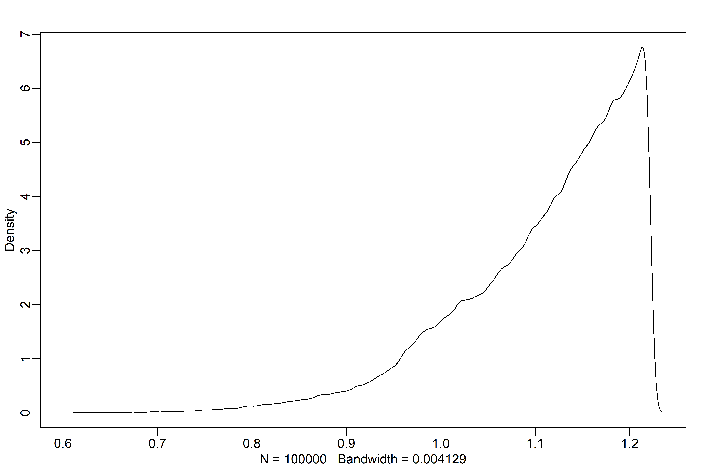

Big Entropy and the Generalized Linear Model
================

-   Statistical models force many choices on us — e.g., for each
    parameter we must choose a prior distribution.
-   Gaussian priors and Gaussian likelihoods are conventional choices,
    but very often conventional choices are not the best choices.
-   Entropy, particularly large entropy, can help guide choices. A
    distribution with the biggest entropy means spreading the
    probability as widely/evenly as is possible while remaining
    consistent with what we know about a process, and nature tends to
    produce distributions that have high entropy.
-   This chapter will introduce *generalized linear models* and the
    principle of *maximum entropy*.

## 10.1 Maximum entropy

-   Measures of uncertainty should meet 3 criteria (see chapter 7 for
    more detail):
    1.  The measure should be continuous
    2.  It should increase as the number of possible events increases.
    3.  It should be additive.
-   These requirements yield information entropy, the average
    log-probability:

$$
\\begin{gather}
H(p) = - \\sum_i \\ p_i \\ log(p_i)
\\end{gather}
$$

-   The simplest way to state maximum entropy is, per McElreath:

> The distribution that can happen the most ways is also the
> distribution with the biggest information entropy. The distribution
> with the biggest entropy is the most conservative distribution that
> obeys its constraints.

-   Consider a thought experiment with 5 empty buckets and a pile of 10
    individually numbered pebbles.
-   If you toss the 10 pebbles into the buckets with equal probability
    of landing in the buckets, some arrangements are fare more likely
    than others.

``` r
# pebble distributions of varying likelihood:
p <- list()
p$A <- c(0, 0, 10, 0, 0)
p$B <- c(0, 1, 8, 1, 0)
p$C <- c(0, 2, 6, 2, 0)
p$D <- c(1, 2, 4, 2, 1)
p$E <- c(2, 2, 2, 2, 2)

# normalize so that each is a probability distribution:
p_norm <- lapply(p, function(q) q/sum(q))

# calculate the information entropy of each distribution
H <- sapply(p_norm, function(q) -sum(ifelse(q == 0, 0, q*log(q))))

# distribution E maximizes information entropy:
H
```

    ##         A         B         C         D         E 
    ## 0.0000000 0.6390319 0.9502705 1.4708085 1.6094379

-   This is useful — the distribution that can happen the greatest
    number of ways is the most plausible distribution, the *maximum
    entropy distribution*.

### 10.1.1 Gaussian

-   See figure 10.2 on page 305 for three different *generalized normal
    distributions* alongside a Gaussian distribution, all with the same
    variance.
-   See the discussion on page 306 for why the Gaussian distribution
    maximizes the entropy for any generalized normal distribution.
-   If we assume that a collection of measurements has finite variance,
    then the Gaussian distribution represents the most conservative
    probability distribution to assign to those measurements.

### 10.1.2 Binomial

-   The *binomial distribution* can be defined for a discrete number of
    *n* trials, where the probability of *y* events where the
    probability of any individual event is *p* is given by:

$$
\\begin{gather}
Pr(y \| n, p) = \\frac{n!}{y! (n - y)!} \\ p^y (1 - p)^{n - y}
\\end{gather}
$$

-   Let’s use another thought experiment — drawing blue/white marbles
    out of a bag (with replacement).
-   If we draw two marbles, there are four possible sequences (ww, bw,
    wb, bb).
-   If we consider four candidate distributions with the same expected
    number of blue marbles, 1, (of which, the first is the only binomial
    distribution), then the binomial will emerge as the most probable:

``` r
# build out a list of candidate distributions
p <- list()
p[[1]] <- c(1/4, 1/4, 1/4, 1/4) # this is binomial(n = 2, p = 0.5)
p[[2]] <- c(2/6, 1/6, 1/6, 2/6)
p[[3]] <- c(1/6, 2/6, 2/6, 1/6)
p[[4]] <- c(1/8, 4/8, 2/8, 1/8)

# find the expected value of each (these should all be 1)
sapply(p, function(p) sum(p * c(0, 1, 1, 2)))
```

    ## [1] 1 1 1 1

``` r
# compute the entropy of each
sapply(p, function(p) -sum(p * log(p)))
```

    ## [1] 1.386294 1.329661 1.329661 1.213008

-   The binomial distribution here is as flat as possible over the
    possible outcomes, but what about when the distribution is not flat?
-   If we instead expect 1.4 marbles in 2 draws, this corresponds to a
    probability *p* of 0.7.

``` r
# what if there's uneven probability?
p <- 0.7

# compute density for each case
A <- 
  c((1 - p)^2, # ww
    p * (1-p), # bw
    (1-p) * p, # wb
    p^2)       # bb

# definitely not flat!
A
```

    ## [1] 0.09 0.21 0.21 0.49

``` r
# the entropy of this distribution:
-sum(A * log(A))
```

    ## [1] 1.221729

``` r
# let's simulate thousands of distributions with an expected value of 1.4
# we'll see that none have a larger entropy than this!
sim.p <- function(G = 1.4) {
  
  x123 <- runif(3)
  x4 <- (G * sum(x123) - x123[2] - x123[3])/(2 - G)
  z <- sum(c(x123, x4))
  p <- c(x123, x4)/z
  list(H = -sum(p * log(p)), 
       p = p)
  
}

# run sim.p 100,000 times:
H <- replicate(1e5, sim.p())
rethinking::dens(as.numeric(H[1,], adj = 0.1))
```

<!-- -->

``` r
# the simulated max entropy is nearly identical to the one calculated from the 
# binomial distribution (A)
entropies <- as.numeric(H[1,])
max(entropies)
```

    ## [1] 1.221728

``` r
# the distribution of that entropy is nearly identical to the distribution 
# calculated from the binomial distribution:
distributions <- H[2,]
distributions[which.max(entropies)]
```

    ## [[1]]
    ## [1] 0.08984616 0.21007724 0.21023045 0.48984616

-   So, tl;dr, when only two unordered outcomes are possible and the
    expected number of each type of event is assumed to be constant,
    then the distribution most consistent with these constraints is the
    binomial.
-   We usually want to estimate the expected value, but we’ll cover that
    detail later.

## 10.2 Generalized linear models

-   Gaussian models work in situations where an outcome is continuous
    and far from any theoretical maximum or minimum.
-   But there are lots of situations where the outcome is either
    discrete or bounded!
-   This is where *generalized linear models* come into play — here’s a
    binomial model as an example:

$$
\\begin{gather}
y_i \\sim Binomial(n, p_i) \\\\
f(p_i) = \\alpha + \\beta(x_i - \\overline x)
\\end{gather}
$$

-   Where *f*(*p*<sub>*i*</sub>) is a *link function* to coerce linear
    values that could range on a (−∞,∞) scale to some target scale (in
    this case, the *l**o**g**i**t* function will bind *p*<sub>*i*</sub>
    to (0,1))
-   A common practice is to determine the outcome distribution by
    plotting a histogram, but this isn’t a great idea, since the outcome
    should follow the distribution *after* conditioning on variables.
    For example, the heights of a group of men and women won’t be
    Gaussian, but condition on gender and the residual distributions
    will be.

### 10.2.1 Meet the family

-   The most common distributions in statistical modeling belong to the
    *Exponential Family*.
-   We’re already familiar with the Gaussian and binomial distributions,
    but here are the other family members:
    1.  The *Exponential Distribution* is constrained to be 0 or
        positive, and is described by a single parameter, the rate of
        events, *λ*. It’s the fundamental distribution of distance and
        duration that represent displacement from some reference point
        in either time or space and is the core of survival and event
        history analysis.
    2.  The *Gamma Distribution* is also constrained to be 0 or
        positive. It is also a fundamental distribution of distance and
        duration but have a peak greater than 0. It’s described by two
        parameters (but there are lots of interpretations of these
        parameters, so take care to read up ahead of implementing). It
        is also common in survival and event history analysis.
    3.  The *Poisson Distribution* is a special case of the binomial
        distribution, used for low probability events. It is described
        by a single parameter for the mean and variance, *λ*.

### 10.2.2 Linking linear models to distributions

-   We usually require a *link function* between a the linear model and
    the outcome distribution parameters to prevent any sort of
    mathematical accidents.
-   There are two exceedingly common link functions, the *logit link*
    and the *log link*.
-   The *logit link* constrains parameters between 0 and 1. The logit
    itself is the *log-odds*:

$$
\\begin{gather}
y_i \\sim Binomial(n, p_i) \\\\
logit(p_i) = \\alpha + \\beta x_i \\\\
logit(p_i) = log \\ \\frac{p_i}{1 - p_i}
\\end{gather}
$$

-   The compression from (−∞,∞) to (0,1) changes the interpretation of
    parameter estimates, since a unit change in a predictor variable no
    longer produces a unit change in the outcome.
-   Instead, a unit change in *x*<sub>*i*</sub> produces a larger or
    smaller change in the probability *p*<sub>*i*</sub> depending on how
    far from 0 the log-odds are.
-   The other very common function is the *log link* — here’s an example
    where the mean *μ* is constant but the standard deviation must be
    greater than 0:

$$
\\begin{gather}
y_i \\sim Normal(\\mu, \\sigma_i) \\\\
log(\\sigma_i) = \\alpha + \\beta x_i
\\end{gather}
$$

-   With a log link, a one unit increase represents an increase in
    *magnitude*.
-   Log links solve the problem of constraining parameters to be
    positive, but may introduce a problem when the model is asked to
    predict well outside the range of the data used to fit it.
    Exponential relationships grow exponentially, but relationships
    aren’t exponential forever! (just like how linear relationships
    aren’t linear forever).
-   When in doubt, play with your assumptions by conducting a
    *sensitivity analysis*.

### 10.2.3 Omitted variable bias again

-   In linear models, leaving out causally important variables leads to
    biased inference. The same thing can happen in GLMs, but can be
    worse, since even a variable that isn’t a confounder can bias
    inference through the link function.
-   This is because the ceiling/floor effects can distort estimates by
    suppressing the causal influence on a variable.

### 10.2.4 Absolute and relative differences

-   Parameter estimates themselves do not tell you the importance of a
    variable on the outcome, because of the link function.
-   Each parameter represents a relative difference on the scale of the
    linear model, when we’re really interested in the absolute
    differences in the outcome.

### 10.2.5 GLMs and information criteria

-   All the information criteria and regularization knowledge from
    chapter 7 still applies for GLMs.
-   However, WAIC (or other criterion) cannot help you sort out which
    likelihood function is best (poisson vs. binomial, gamma
    vs. exponential).
-   WAIC/other criterion can really only be used to compare models that
    use the same likelihood function.
-   There are other ways to compare models with different likelihood
    functions.

## 10.3 Maximum entropy priors

-   When pressed to choose a likelihood function, maximum entropy can
    nominate the least informative distribution consistent with the
    constraints on the outcome.
-   Maximum entropy provides a way to generate a prior that embodies our
    background information while assuming as little else as possible.

## 10.4 Summary

-   Maximum entropy provides a way to choose likelihood functions.
-   A link between a linear model and the likelihood is needed to ensure
    the likelihood’s mathematical assumptions are not violated.
