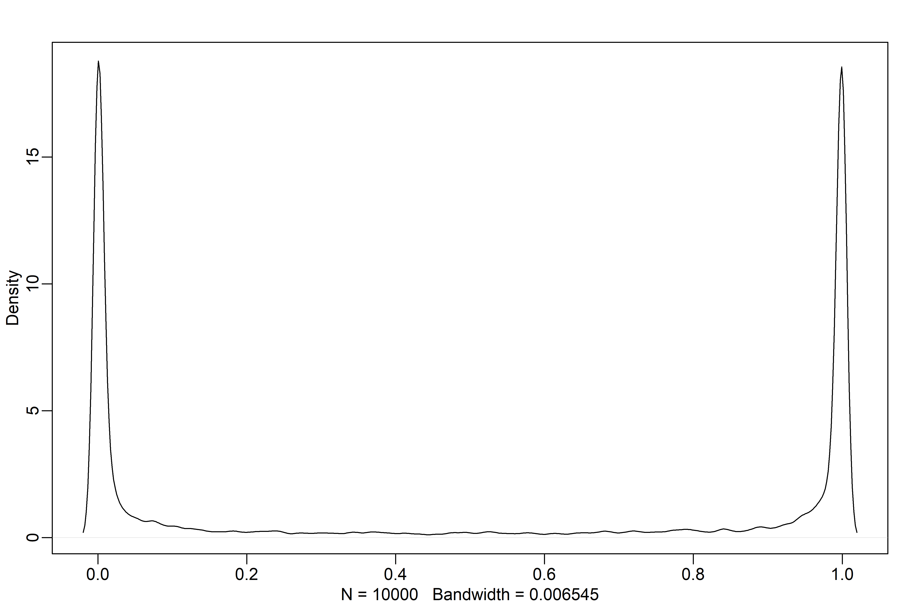
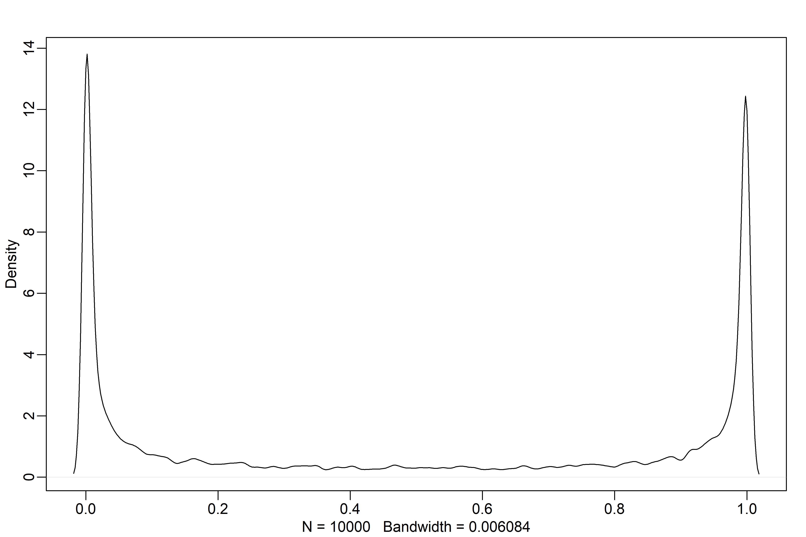
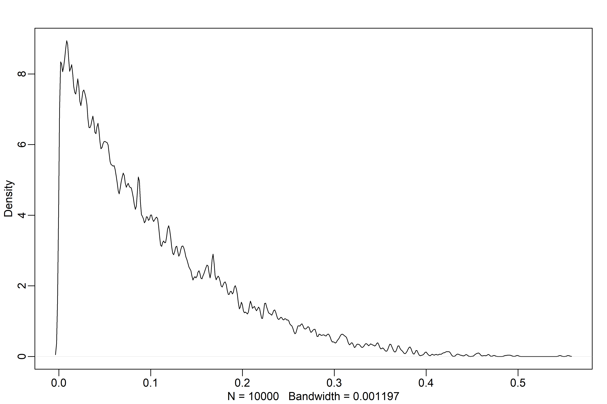
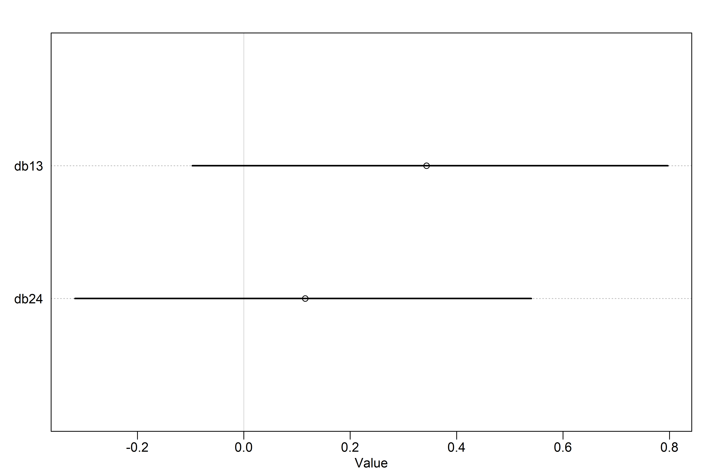
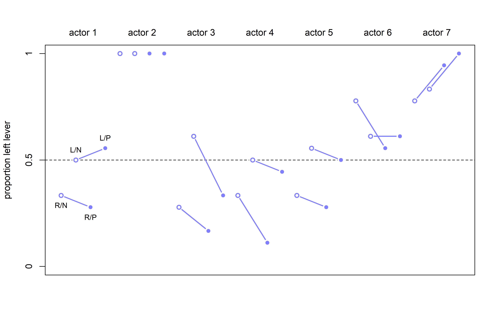
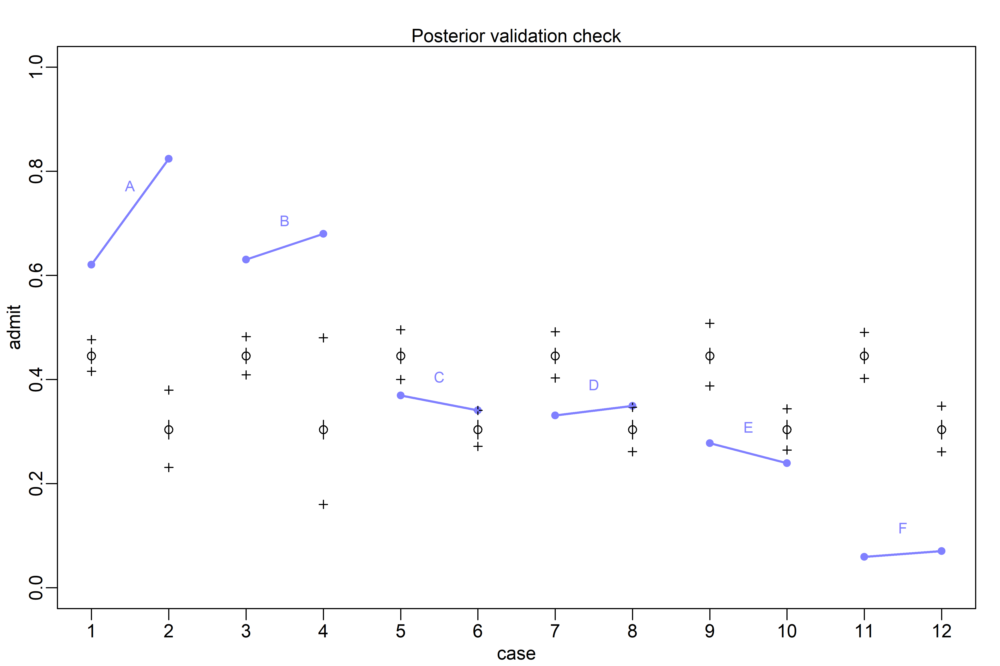
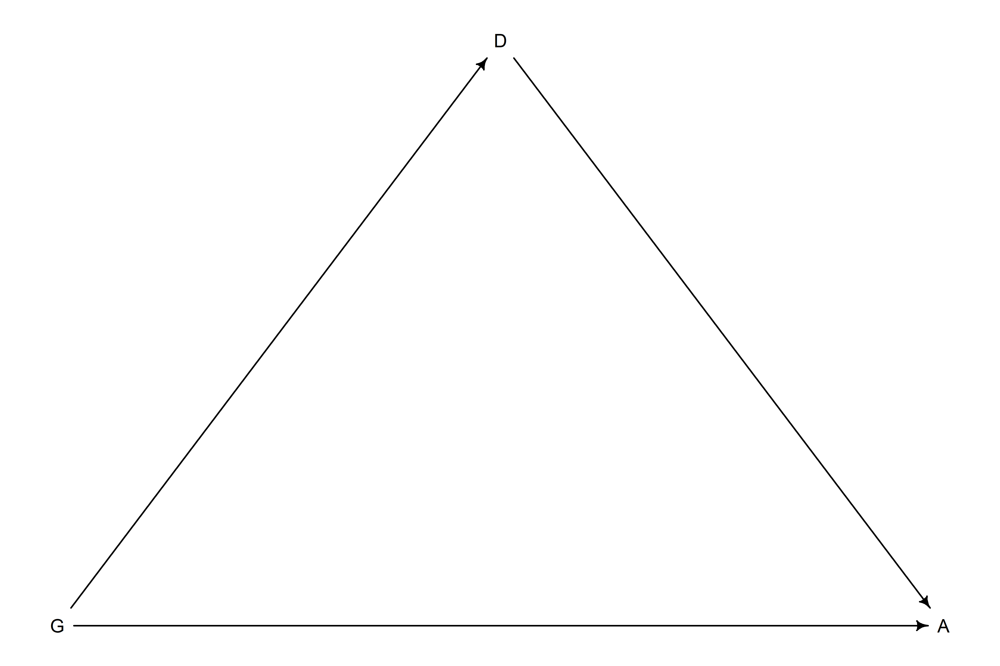
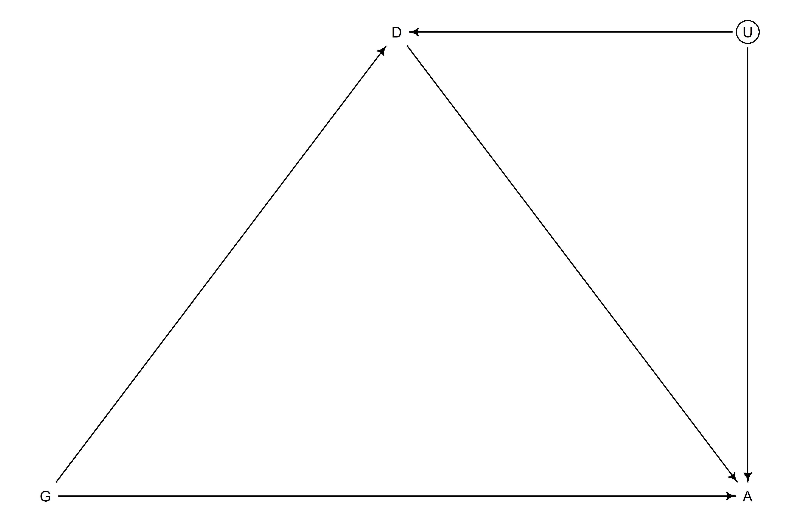
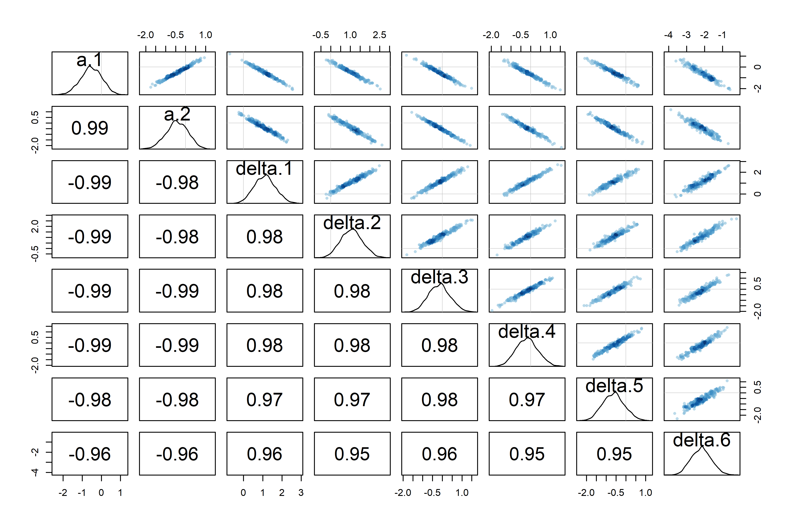
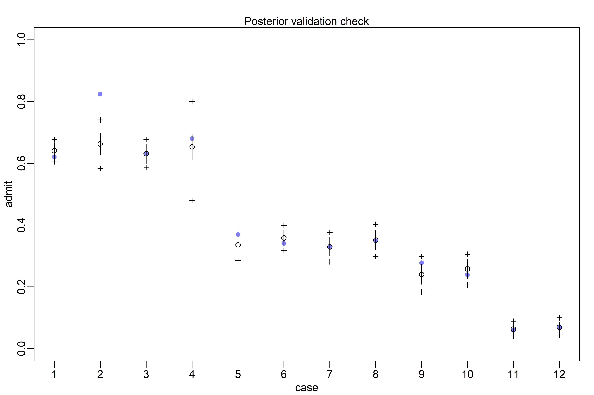

God Spiked the Integers
================

-   *Generalized Linear Models* (GLMs) are a lot like early mechanical
    computers — the moving pieces within (the parameters) interact to
    produce non-obvious predictions.
-   Understanding the parameters in GLMs will always involve more work
    than for Gaussian models, because of the transformation on the
    output scale.
-   GLMs let us model counts — two of the most common types of count
    models are *Binomial Regression*, which is useful for binary
    classification, and *Poisson Regression*, which is a special case of
    the binomial.

## 11.1 Binomial regression

$$
\begin{gather}
y \sim Binomial(n, p)
\end{gather}
$$

-   The binomial distribution is denoted above, where $y$ is a count on
    $[\ 0, \infty)$, $p$ is the probability that any particular “trial”
    is a success, and $n$ is the number of trials.
-   Two common flavors of binomial models are:
    1.  *Logistic Regression* — for single trial cases, when the outcome
        can only be 0 or 1
    2.  *Aggregated binomial regression* — for multi-trial cases, where
        the outcome can be any integer between 0 and $n$

### 11.1.1 Logistic regression: Prosocial chimpanzees

-   Consider an experiment where we want to test the social tendencies
    of chimpanzees. In the setup, the focal chimpanzee can pull a lever
    on the left to deliver food to himself or pull a lever on the right
    to deliver food to himself an another chimpanzee (see figure 11.2 on
    page 326).
-   If we set a variable to 1 when the chimpanzee pulls the left
    trigger, we can model this with a binomial model.

``` r
library(rethinking)
data("chimpanzees")
d <- chimpanzees

str(d)
```

    ## 'data.frame':    504 obs. of  8 variables:
    ##  $ actor       : int  1 1 1 1 1 1 1 1 1 1 ...
    ##  $ recipient   : int  NA NA NA NA NA NA NA NA NA NA ...
    ##  $ condition   : int  0 0 0 0 0 0 0 0 0 0 ...
    ##  $ block       : int  1 1 1 1 1 1 2 2 2 2 ...
    ##  $ trial       : int  2 4 6 8 10 12 14 16 18 20 ...
    ##  $ prosoc_left : int  0 0 1 0 1 1 1 1 0 0 ...
    ##  $ chose_prosoc: int  1 0 0 1 1 1 0 0 1 1 ...
    ##  $ pulled_left : int  0 1 0 0 1 1 0 0 0 0 ...

-   We want to infer what happens in each combination of `prosoc_left`
    and `condition`:
    1.  `prosoc_left = 0` and `condition = 0` : two food items on the
        right and no partner
    2.  `prosoc_left = 1` and `condition = 0` : two food items on the
        left and no partner
    3.  `prosoc_left = 0` and `condition = 1` : two food items on the
        right and partner present
    4.  `prosoc_left = 1` and `condition = 1` : two food items on the
        left and partner present

``` r
d$treatment <- 1 + d$prosoc_left + 2 * d$condition
xtabs( ~ treatment + prosoc_left + condition, d)
```

    ## , , condition = 0
    ## 
    ##          prosoc_left
    ## treatment   0   1
    ##         1 126   0
    ##         2   0 126
    ##         3   0   0
    ##         4   0   0
    ## 
    ## , , condition = 1
    ## 
    ##          prosoc_left
    ## treatment   0   1
    ##         1   0   0
    ##         2   0   0
    ##         3 126   0
    ##         4   0 126

-   Now each combination is an index in treatment. In mathematical form:

$$
\begin{gather}
L_i \sim Binomial(1, p_i) \\
logit(p_i) = \alpha_{ACTOR[i]} + \beta_{TREATMENT[i]} \\
\alpha_j \sim to \ be \ determined \\
\beta_k \sim to \ be \ determined 
\end{gather}
$$

-   Here, $L$ is the 0/1 variable for `pulled_left` and $\alpha_j$ is a
    parameter for each of the 7 chimpanzees. Alternatively, this could
    have been defined with a Bernoulli distribution:

$$
\begin{gather}
L_i \sim Bernoulli(p_i)
\end{gather}
$$

-   The TBD priors are a bit weird to work with for GLMs — let’s start
    off with a super simple example:

$$
\begin{gather}
L_i \sim Binomial(1, p_i) \\
logit(p_i) = \alpha \\
\alpha \sim Normal(0, \omega)
\end{gather}
$$

-   We’ll change up $\omega$ to see what happens. To start, we’ll
    illustrate the madness of flat priors with $\omega = 10$.

``` r
# model with wide prior
m11.1 <-
  quap(
    alist(pulled_left ~ dbinom(1, p),
          logit(p) <- a,
          a ~ dnorm(0, 10)),
    data = d
  )

# sample from the prior
set.seed(1999)
prior <- extract.prior(m11.1, n = 1e4)
p <- inv_logit(prior$a) # need to get the prior on the outcome scale!

# wonk!
dens(p, adj = 0.1)
```

<!-- -->

-   A flat prior in the logit space is not a flat prior in the
    probability space!
-   A *slightly* more regularized prior with $\omega = 1.5$ is more akin
    to what we want:

``` r
# model with better prior
m11.1a <-
  quap(
    alist(pulled_left ~ dbinom(1, p),
          logit(p) <- a,
          a ~ dnorm(0, 1.5)),
    data = d
  )

# sample from the prior
set.seed(1999)
prior <- extract.prior(m11.1a, n = 1e4)
p <- inv_logit(prior$a) # need to get the prior on the outcome scale!

# wonk!
dens(p, adj = 0.1)
```

<!-- -->

-   Now let’s do the same weirdness with unconventionally flat priors
    for the $\beta$ parameters, just to drive this home.

``` r
# model with bad priors on treatment
m11.2 <-
  quap(
    alist(pulled_left ~ dbinom(1, p),
          logit(p) <- a + b[treatment],
          a ~ dnorm(0, 1.5),
          b[treatment] ~ dnorm(0, 10)),
    data = d
  )

# extract priors
set.seed(1999)
prior <- extract.prior(m11.2, n = 1e4)
p <- sapply(1:4, function(k) inv_logit(prior$a + prior$b[,k]))

# plot the *difference* between treatments 1 and 2:
dens(abs(p[,1] - p[,2]), adj = 0.1)
```

<!-- -->

-   Again, the flat prior means that the model believes that the
    treatments are either completely alike or completely different,
    which is not necessarily what we think!
-   Changing to a $\beta_j \sim Normal(0, 0.5)$ prior results in priors
    outcome that a difference of 0 is the highest prior probability, and
    the average is about 10%

``` r
# model with better priors for alpha and beta
m11.3 <-
  quap(
    alist(pulled_left ~ dbinom(1, p),
          logit(p) <- a + b[treatment],
          a ~ dnorm(0, 1.5),
          b[treatment] ~ dnorm(0, 0.5)),
    data = d
  )

# extract priors
set.seed(1999)
prior <- extract.prior(m11.3, n = 1e4)
p <- sapply(1:4, function(k) inv_logit(prior$a + prior$b[,k]))

# return the average prior difference between treatments 1 and 2:
mean(abs(p[,1] - p[,2]))
```

    ## [1] 0.09838663

``` r
# plot!
dens(abs(p[,1] - p[,2]), adj = 0.1)
```

<!-- -->

-   This makes sense, because it’s the *difference* in treatment effect.
-   Each treatment runs relatively evenly between 0 and 1, so *on
    average* the difference is likelier to be small (it’s more likely
    that each is somewhere in the middle rather than being on opposite
    ends).

``` r
# prep data for ulam
dat_list <-
  list(
    pulled_left = d$pulled_left,
    actor = d$actor,
    treatment = as.integer(d$treatment)
  )

# model! 
# log_lik = TRUE will have ulam() compute the values necessary for PSIS/WAIC
m11.4 <-
  ulam(
    alist(pulled_left ~ dbinom(1, p),
          logit(p) <- a[actor] + b[treatment],
          a[actor] ~ dnorm(0, 1.5),
          b[treatment] ~ dnorm(0, 0.5)),
    data = dat_list,
    chains = 4,
    log_lik = TRUE
  )
```

    ## Running MCMC with 4 sequential chains, with 1 thread(s) per chain...
    ## 
    ## Chain 1 Iteration:   1 / 1000 [  0%]  (Warmup) 
    ## Chain 1 Iteration: 100 / 1000 [ 10%]  (Warmup) 
    ## Chain 1 Iteration: 200 / 1000 [ 20%]  (Warmup) 
    ## Chain 1 Iteration: 300 / 1000 [ 30%]  (Warmup) 
    ## Chain 1 Iteration: 400 / 1000 [ 40%]  (Warmup) 
    ## Chain 1 Iteration: 500 / 1000 [ 50%]  (Warmup) 
    ## Chain 1 Iteration: 501 / 1000 [ 50%]  (Sampling) 
    ## Chain 1 Iteration: 600 / 1000 [ 60%]  (Sampling) 
    ## Chain 1 Iteration: 700 / 1000 [ 70%]  (Sampling) 
    ## Chain 1 Iteration: 800 / 1000 [ 80%]  (Sampling) 
    ## Chain 1 Iteration: 900 / 1000 [ 90%]  (Sampling) 
    ## Chain 1 Iteration: 1000 / 1000 [100%]  (Sampling) 
    ## Chain 1 finished in 4.1 seconds.
    ## Chain 2 Iteration:   1 / 1000 [  0%]  (Warmup) 
    ## Chain 2 Iteration: 100 / 1000 [ 10%]  (Warmup) 
    ## Chain 2 Iteration: 200 / 1000 [ 20%]  (Warmup) 
    ## Chain 2 Iteration: 300 / 1000 [ 30%]  (Warmup) 
    ## Chain 2 Iteration: 400 / 1000 [ 40%]  (Warmup) 
    ## Chain 2 Iteration: 500 / 1000 [ 50%]  (Warmup) 
    ## Chain 2 Iteration: 501 / 1000 [ 50%]  (Sampling) 
    ## Chain 2 Iteration: 600 / 1000 [ 60%]  (Sampling) 
    ## Chain 2 Iteration: 700 / 1000 [ 70%]  (Sampling) 
    ## Chain 2 Iteration: 800 / 1000 [ 80%]  (Sampling) 
    ## Chain 2 Iteration: 900 / 1000 [ 90%]  (Sampling) 
    ## Chain 2 Iteration: 1000 / 1000 [100%]  (Sampling) 
    ## Chain 2 finished in 3.8 seconds.
    ## Chain 3 Iteration:   1 / 1000 [  0%]  (Warmup) 
    ## Chain 3 Iteration: 100 / 1000 [ 10%]  (Warmup) 
    ## Chain 3 Iteration: 200 / 1000 [ 20%]  (Warmup) 
    ## Chain 3 Iteration: 300 / 1000 [ 30%]  (Warmup) 
    ## Chain 3 Iteration: 400 / 1000 [ 40%]  (Warmup) 
    ## Chain 3 Iteration: 500 / 1000 [ 50%]  (Warmup) 
    ## Chain 3 Iteration: 501 / 1000 [ 50%]  (Sampling) 
    ## Chain 3 Iteration: 600 / 1000 [ 60%]  (Sampling) 
    ## Chain 3 Iteration: 700 / 1000 [ 70%]  (Sampling) 
    ## Chain 3 Iteration: 800 / 1000 [ 80%]  (Sampling) 
    ## Chain 3 Iteration: 900 / 1000 [ 90%]  (Sampling) 
    ## Chain 3 Iteration: 1000 / 1000 [100%]  (Sampling) 
    ## Chain 3 finished in 3.7 seconds.
    ## Chain 4 Iteration:   1 / 1000 [  0%]  (Warmup) 
    ## Chain 4 Iteration: 100 / 1000 [ 10%]  (Warmup) 
    ## Chain 4 Iteration: 200 / 1000 [ 20%]  (Warmup) 
    ## Chain 4 Iteration: 300 / 1000 [ 30%]  (Warmup) 
    ## Chain 4 Iteration: 400 / 1000 [ 40%]  (Warmup) 
    ## Chain 4 Iteration: 500 / 1000 [ 50%]  (Warmup) 
    ## Chain 4 Iteration: 501 / 1000 [ 50%]  (Sampling) 
    ## Chain 4 Iteration: 600 / 1000 [ 60%]  (Sampling) 
    ## Chain 4 Iteration: 700 / 1000 [ 70%]  (Sampling) 
    ## Chain 4 Iteration: 800 / 1000 [ 80%]  (Sampling) 
    ## Chain 4 Iteration: 900 / 1000 [ 90%]  (Sampling) 
    ## Chain 4 Iteration: 1000 / 1000 [100%]  (Sampling) 
    ## Chain 4 finished in 4.1 seconds.
    ## 
    ## All 4 chains finished successfully.
    ## Mean chain execution time: 3.9 seconds.
    ## Total execution time: 17.0 seconds.

``` r
# posterior parameter estimations
precis(m11.4, depth = 2)
```

    ##             mean        sd        5.5%       94.5%     n_eff     Rhat4
    ## a[1] -0.44980706 0.3139821 -0.92451657  0.05750894  751.5753 1.0028090
    ## a[2]  3.90740284 0.7538153  2.81275470  5.19920580 1116.3178 1.0017326
    ## a[3] -0.75910512 0.3233431 -1.26333640 -0.23774445  784.4718 1.0005620
    ## a[4] -0.75177396 0.3254611 -1.27921005 -0.22778914  697.3081 1.0021056
    ## a[5] -0.44661271 0.3216998 -0.96673022  0.05557138  694.0721 1.0025012
    ## a[6]  0.47361480 0.3275634 -0.04112770  1.00740750  709.2511 0.9995079
    ## a[7]  1.96755274 0.4227796  1.31846020  2.68217590  964.1751 0.9984666
    ## b[1] -0.04099327 0.2735485 -0.46622989  0.39314257  640.7081 0.9994378
    ## b[2]  0.48699046 0.2759573  0.02829271  0.93107828  650.7775 1.0009767
    ## b[3] -0.38451436 0.2752398 -0.83566229  0.04590361  566.9048 1.0002082
    ## b[4]  0.37136420 0.2712957 -0.07175438  0.80449968  693.3715 1.0014881

``` r
# plot parameters:
post <- extract.samples(m11.4)
p_left <- inv_logit(post$a)
precis_plot(precis(as.data.frame(p_left)), xlim = c(0, 1))
```

<!-- -->

-   Here each row is a chimpanzee. Chimps 1, 3, 4, and 5 show a
    preference for the right lever. 2 and 7 show a preference for the
    left, with 2 preferring it greatly.
-   Having repeat measurements per actor (chimp), is useful for
    subtracting out this chimp-level preference to isolate the treatment
    effect.

``` r
# plot posterior treatment
labs <- c("R/N", "L/N", "R/P", "L/P")
precis_plot(precis(m11.4, depth = 2, pars = "b"), labels = labs)
```

<!-- -->

-   Here, “L/N” means “prosocial on left, no partner” and “R/P” means
    “prosocial on right/partner.”
-   We’re looking to see if chimpanzees choose the prosocial option when
    a partner is present, so we ought to compare the first/third row and
    the second/fourth row:

``` r
diffs <-
  list(
    db13 = post$b[,1] - post$b[,3],
    db24 = post$b[,2] - post$b[,4]
  )

precis_plot(precis(diffs))
```

<!-- -->

-   Here, there is weak evidence of the pulling the prosocial choice on
    the right when the partner is present, but the interval is pretty
    wide.
-   There is pretty negligible evidence for pulling the prosocial choice
    when the option is on the left (if anything, they choose the
    prosocial option when the partner is absent!)
-   Let’s compare the proportion each chimp actually pulled the left
    lever with the model’s posterior predictions.

``` r
pl <- by(d$pulled_left, list(d$actor, d$treatment), mean)

# proportion of pulling left under each treatment for chimp 1:
pl[1,]
```

    ##         1         2         3         4 
    ## 0.3333333 0.5000000 0.2777778 0.5555556

``` r
# plot proportions:
plot(NULL, 
     xlim = c(1, 28),
     ylim = c(0, 1),
     xlab = "",
     ylab = "proportion left lever",
     xaxt = "n",
     yaxt = "n")

axis(2, 
     at = c(0, 0.5, 1),
     labels = c(0, 0.5, 1))

abline(h = 0.5,
       lty = 2)

for (j in 1:7) abline(y = (j - 1)*4 + 4.5, lwd = 0.5)
for (j in 1:7) text((j - 1)*4 + 2.5, 1.1, concat("actor ", j), xpd = TRUE)
for (j in (1:7)[-2]) {
  lines((j - 1)*4 + c(1, 3), pl[j, c(1, 3)], lwd = 2, col = rangi2)
  lines((j - 1)*4 + c(2, 4), pl[j, c(2, 4)], lwd = 2, col = rangi2)
}

points(1:28, t(pl), pch = 16, col = "white", cex = 1.7)
points(1:28, t(pl), pch = c(1, 1, 16, 16), col = rangi2, lwd = 2)

yoff <- 0.01
text(1, pl[1, 1] - yoff, "R/N", pos = 1, cex = 0.8)
text(2, pl[1, 2] + yoff, "L/N", pos = 3, cex = 0.8)
text(3, pl[1, 3] - yoff, "R/P", pos = 1, cex = 0.8)
text(4, pl[1, 4] + yoff, "L/P", pos = 3, cex = 0.8)
```

<!-- -->

``` r
# posterior predictions
# see figure 11.4 on page 333 for the actual plot lol
dat <- list(actor = rep(1:7, each = 4), treatment = rep(1:4, times = 7))
p_post <- link(m11.4, data = dat)
p_mu <- apply(p_post, 2, mean)
p_ci <- apply(p_post, 2, PI)
```

-   There doesn’t seem to be any much evidence of the prosocial option
    being chosen more when a partner is present, but to test it out
    explicitly, let’s build a model with an interaction effect.
-   The simpler model will likely do just fine, because we don’t expect
    to see an interaction:

``` r
# prep new vars
d$side <- d$prosoc_left + 1 # right 1, left 2
d$cond <- d$condition + 1 # no partner 1, partner 2

# prep new list for ulam
dat_list2 <-
  list(pulled_left = d$pulled_left,
       actor = d$actor,
       side = d$side,
       cond = d$cond)

# model
m11.5 <- 
  ulam(
    alist(pulled_left ~ dbinom(1, p),
          logit(p) <- a[actor] + bs[side] + bc[cond],
          a[actor] ~ dnorm(0, 1.5),
          bs[side] ~ dnorm(0, 0.5),
          bc[cond] ~ dnorm(0, 0.5)),
    data = dat_list2,
    chains = 4,
    log_lik = TRUE
  )
```

    ## Running MCMC with 4 sequential chains, with 1 thread(s) per chain...
    ## 
    ## Chain 1 Iteration:   1 / 1000 [  0%]  (Warmup) 
    ## Chain 1 Iteration: 100 / 1000 [ 10%]  (Warmup) 
    ## Chain 1 Iteration: 200 / 1000 [ 20%]  (Warmup) 
    ## Chain 1 Iteration: 300 / 1000 [ 30%]  (Warmup) 
    ## Chain 1 Iteration: 400 / 1000 [ 40%]  (Warmup) 
    ## Chain 1 Iteration: 500 / 1000 [ 50%]  (Warmup) 
    ## Chain 1 Iteration: 501 / 1000 [ 50%]  (Sampling) 
    ## Chain 1 Iteration: 600 / 1000 [ 60%]  (Sampling) 
    ## Chain 1 Iteration: 700 / 1000 [ 70%]  (Sampling) 
    ## Chain 1 Iteration: 800 / 1000 [ 80%]  (Sampling) 
    ## Chain 1 Iteration: 900 / 1000 [ 90%]  (Sampling) 
    ## Chain 1 Iteration: 1000 / 1000 [100%]  (Sampling) 
    ## Chain 1 finished in 4.8 seconds.
    ## Chain 2 Iteration:   1 / 1000 [  0%]  (Warmup) 
    ## Chain 2 Iteration: 100 / 1000 [ 10%]  (Warmup) 
    ## Chain 2 Iteration: 200 / 1000 [ 20%]  (Warmup) 
    ## Chain 2 Iteration: 300 / 1000 [ 30%]  (Warmup) 
    ## Chain 2 Iteration: 400 / 1000 [ 40%]  (Warmup) 
    ## Chain 2 Iteration: 500 / 1000 [ 50%]  (Warmup) 
    ## Chain 2 Iteration: 501 / 1000 [ 50%]  (Sampling) 
    ## Chain 2 Iteration: 600 / 1000 [ 60%]  (Sampling) 
    ## Chain 2 Iteration: 700 / 1000 [ 70%]  (Sampling) 
    ## Chain 2 Iteration: 800 / 1000 [ 80%]  (Sampling) 
    ## Chain 2 Iteration: 900 / 1000 [ 90%]  (Sampling) 
    ## Chain 2 Iteration: 1000 / 1000 [100%]  (Sampling) 
    ## Chain 2 finished in 4.8 seconds.
    ## Chain 3 Iteration:   1 / 1000 [  0%]  (Warmup) 
    ## Chain 3 Iteration: 100 / 1000 [ 10%]  (Warmup) 
    ## Chain 3 Iteration: 200 / 1000 [ 20%]  (Warmup) 
    ## Chain 3 Iteration: 300 / 1000 [ 30%]  (Warmup) 
    ## Chain 3 Iteration: 400 / 1000 [ 40%]  (Warmup) 
    ## Chain 3 Iteration: 500 / 1000 [ 50%]  (Warmup) 
    ## Chain 3 Iteration: 501 / 1000 [ 50%]  (Sampling) 
    ## Chain 3 Iteration: 600 / 1000 [ 60%]  (Sampling) 
    ## Chain 3 Iteration: 700 / 1000 [ 70%]  (Sampling) 
    ## Chain 3 Iteration: 800 / 1000 [ 80%]  (Sampling) 
    ## Chain 3 Iteration: 900 / 1000 [ 90%]  (Sampling) 
    ## Chain 3 Iteration: 1000 / 1000 [100%]  (Sampling) 
    ## Chain 3 finished in 4.7 seconds.
    ## Chain 4 Iteration:   1 / 1000 [  0%]  (Warmup) 
    ## Chain 4 Iteration: 100 / 1000 [ 10%]  (Warmup) 
    ## Chain 4 Iteration: 200 / 1000 [ 20%]  (Warmup) 
    ## Chain 4 Iteration: 300 / 1000 [ 30%]  (Warmup) 
    ## Chain 4 Iteration: 400 / 1000 [ 40%]  (Warmup) 
    ## Chain 4 Iteration: 500 / 1000 [ 50%]  (Warmup) 
    ## Chain 4 Iteration: 501 / 1000 [ 50%]  (Sampling) 
    ## Chain 4 Iteration: 600 / 1000 [ 60%]  (Sampling) 
    ## Chain 4 Iteration: 700 / 1000 [ 70%]  (Sampling) 
    ## Chain 4 Iteration: 800 / 1000 [ 80%]  (Sampling) 
    ## Chain 4 Iteration: 900 / 1000 [ 90%]  (Sampling) 
    ## Chain 4 Iteration: 1000 / 1000 [100%]  (Sampling) 
    ## Chain 4 finished in 4.5 seconds.
    ## 
    ## All 4 chains finished successfully.
    ## Mean chain execution time: 4.7 seconds.
    ## Total execution time: 20.1 seconds.

``` r
# finally, compare models w/PSIS
compare(m11.5, m11.4, func = PSIS)
```

    ##           PSIS       SE    dPSIS      dSE    pPSIS    weight
    ## m11.5 530.4818 19.09699 0.000000       NA 7.637648 0.6786693
    ## m11.4 531.9772 19.01157 1.495326 1.264601 8.404094 0.3213307

-   The modle comparison here is for the sake of understanding, but the
    experiment + hypothesis tell us which model to use (`m11.4`), this
    comparison just lets us know that `m11.5` doesn’t add a whole lot.

``` r
# follow along with the overthinking box on pages 334-336
post <- extract.samples(m11.4, clean = FALSE) # clean = FALSE returns the log-probability
str(post)
```

    ## List of 5
    ##  $ a      : num [1:2000, 1:7] 0.234 -0.348 -0.456 -0.444 -0.73 ...
    ##  $ b      : num [1:2000, 1:4] -0.3065 0.2728 0.2321 -0.1591 0.0697 ...
    ##  $ log_lik: num [1:2000, 1:504] -0.657 -0.656 -0.588 -0.437 -0.416 ...
    ##  $ p      : num [1:2000, 1:504] 0.482 0.481 0.444 0.354 0.341 ...
    ##  $ lp__   : num [1:2000(1d)] -267 -269 -265 -265 -268 ...
    ##  - attr(*, "source")= chr "ulam posterior: 2000 samples from object"

``` r
stancode(m11.4)
```

    ## data{
    ##     int pulled_left[504];
    ##     int treatment[504];
    ##     int actor[504];
    ## }
    ## parameters{
    ##     vector[7] a;
    ##     vector[4] b;
    ## }
    ## model{
    ##     vector[504] p;
    ##     b ~ normal( 0 , 0.5 );
    ##     a ~ normal( 0 , 1.5 );
    ##     for ( i in 1:504 ) {
    ##         p[i] = a[actor[i]] + b[treatment[i]];
    ##         p[i] = inv_logit(p[i]);
    ##     }
    ##     pulled_left ~ binomial( 1 , p );
    ## }
    ## generated quantities{
    ##     vector[504] log_lik;
    ##     vector[504] p;
    ##     for ( i in 1:504 ) {
    ##         p[i] = a[actor[i]] + b[treatment[i]];
    ##         p[i] = inv_logit(p[i]);
    ##     }
    ##     for ( i in 1:504 ) log_lik[i] = binomial_lpmf( pulled_left[i] | 1 , p[i] );
    ## }

### 11.1.2 Relative shark and absolute deer

-   The above focused on the posterior difference treatment made on the
    outcome scale — this focuses on *absolute effects*.
-   Oftentimes, we’re interested in the *relative effect* a term has in
    a logistic model — the proportional change in the odds of an
    outcome.
-   We can calculate these *proportional odds* relative effect sizes by
    exponentiating the parameter of interest.

``` r
post <- extract.samples(m11.4)

# what is the proportional odds difference between treatments 4 & 2?
mean(exp(post$b[,4] - post$b[,2]))
```

    ## [1] 0.9233304

-   On average, the switch from treatment 2 to treatment 4 (adding a
    partner) multiplies the odds of pulling the left lever by 0.92 (an
    8% reduction in odds).
-   The risk in proportional odds is that they don’t necessarily tell us
    if a parameter is important or not — for example if the odds of some
    event are 1 in 1 million, and a parameter change involves a 5.0
    proportional odds increase, then the resulting odds now only 5 in 1
    million.
-   Relative and absolute risks are both important in — consider
    relative sharks and absolute deer. People are very afraid of sharks
    but not so much of deer — sharks themselves are more dangerous
    *relative* to deer, but more people are killed by deer each year so
    deer are more *absolutely* dangerous.

### 11.1.3 Aggregated binomial: Chimpanzees again, condensed

-   The original model treated each pull of the lever as a separate
    trial, but we could aggregate the trials by chimp:

``` r
data("chimpanzees")
d <- chimpanzees
d$treatment <- 1 + d$prosoc_left + 2*d$condition
d$side <- d$prosoc_left + 1 # right = 1, left = 2
d$cond <- d$condition + 1 # no partner 1, partner 2

d_aggregated <- 
  aggregate(
    d$pulled_left,
    list(treatment = d$treatment,
         actor = d$actor,
         side = d$side,
         cond = d$cond),
    sum
  )

colnames(d_aggregated)[5] <- "left_pulls"

d_aggregated
```

    ##    treatment actor side cond left_pulls
    ## 1          1     1    1    1          6
    ## 2          1     2    1    1         18
    ## 3          1     3    1    1          5
    ## 4          1     4    1    1          6
    ## 5          1     5    1    1          6
    ## 6          1     6    1    1         14
    ## 7          1     7    1    1         14
    ## 8          2     1    2    1          9
    ## 9          2     2    2    1         18
    ## 10         2     3    2    1         11
    ## 11         2     4    2    1          9
    ## 12         2     5    2    1         10
    ## 13         2     6    2    1         11
    ## 14         2     7    2    1         15
    ## 15         3     1    1    2          5
    ## 16         3     2    1    2         18
    ## 17         3     3    1    2          3
    ## 18         3     4    1    2          2
    ## 19         3     5    1    2          5
    ## 20         3     6    1    2         10
    ## 21         3     7    1    2         17
    ## 22         4     1    2    2         10
    ## 23         4     2    2    2         18
    ## 24         4     3    2    2          6
    ## 25         4     4    2    2          8
    ## 26         4     5    2    2          9
    ## 27         4     6    2    2         11
    ## 28         4     7    2    2         18

-   We can redefine the model in these aggregated terms & get the same
    inferences as before:

``` r
# prep new aggregated data for ulam
dat <- 
  with(
    d_aggregated,
    list(left_pulls = left_pulls,
         treatment = treatment,
         actor = actor,
         side = side,
         cond = cond)
  )

# model the aggregated data!
m11.6 <- 
  ulam(
    alist(left_pulls ~ dbinom(18, p), # each chimp has 18 pulls
          logit(p) <- a[actor] + b[treatment],
          a[actor] ~ dnorm(0, 1.5),
          b[treatment] ~ dnorm(0, 0.5)),
    data = dat,
    chains = 4,
    log_lik = TRUE
  )
```

    ## Running MCMC with 4 sequential chains, with 1 thread(s) per chain...
    ## 
    ## Chain 1 Iteration:   1 / 1000 [  0%]  (Warmup) 
    ## Chain 1 Iteration: 100 / 1000 [ 10%]  (Warmup) 
    ## Chain 1 Iteration: 200 / 1000 [ 20%]  (Warmup) 
    ## Chain 1 Iteration: 300 / 1000 [ 30%]  (Warmup) 
    ## Chain 1 Iteration: 400 / 1000 [ 40%]  (Warmup) 
    ## Chain 1 Iteration: 500 / 1000 [ 50%]  (Warmup) 
    ## Chain 1 Iteration: 501 / 1000 [ 50%]  (Sampling) 
    ## Chain 1 Iteration: 600 / 1000 [ 60%]  (Sampling) 
    ## Chain 1 Iteration: 700 / 1000 [ 70%]  (Sampling) 
    ## Chain 1 Iteration: 800 / 1000 [ 80%]  (Sampling) 
    ## Chain 1 Iteration: 900 / 1000 [ 90%]  (Sampling) 
    ## Chain 1 Iteration: 1000 / 1000 [100%]  (Sampling) 
    ## Chain 1 finished in 0.5 seconds.
    ## Chain 2 Iteration:   1 / 1000 [  0%]  (Warmup) 
    ## Chain 2 Iteration: 100 / 1000 [ 10%]  (Warmup) 
    ## Chain 2 Iteration: 200 / 1000 [ 20%]  (Warmup) 
    ## Chain 2 Iteration: 300 / 1000 [ 30%]  (Warmup) 
    ## Chain 2 Iteration: 400 / 1000 [ 40%]  (Warmup) 
    ## Chain 2 Iteration: 500 / 1000 [ 50%]  (Warmup) 
    ## Chain 2 Iteration: 501 / 1000 [ 50%]  (Sampling) 
    ## Chain 2 Iteration: 600 / 1000 [ 60%]  (Sampling) 
    ## Chain 2 Iteration: 700 / 1000 [ 70%]  (Sampling) 
    ## Chain 2 Iteration: 800 / 1000 [ 80%]  (Sampling) 
    ## Chain 2 Iteration: 900 / 1000 [ 90%]  (Sampling) 
    ## Chain 2 Iteration: 1000 / 1000 [100%]  (Sampling) 
    ## Chain 2 finished in 0.3 seconds.
    ## Chain 3 Iteration:   1 / 1000 [  0%]  (Warmup) 
    ## Chain 3 Iteration: 100 / 1000 [ 10%]  (Warmup) 
    ## Chain 3 Iteration: 200 / 1000 [ 20%]  (Warmup) 
    ## Chain 3 Iteration: 300 / 1000 [ 30%]  (Warmup) 
    ## Chain 3 Iteration: 400 / 1000 [ 40%]  (Warmup) 
    ## Chain 3 Iteration: 500 / 1000 [ 50%]  (Warmup) 
    ## Chain 3 Iteration: 501 / 1000 [ 50%]  (Sampling) 
    ## Chain 3 Iteration: 600 / 1000 [ 60%]  (Sampling) 
    ## Chain 3 Iteration: 700 / 1000 [ 70%]  (Sampling) 
    ## Chain 3 Iteration: 800 / 1000 [ 80%]  (Sampling) 
    ## Chain 3 Iteration: 900 / 1000 [ 90%]  (Sampling) 
    ## Chain 3 Iteration: 1000 / 1000 [100%]  (Sampling) 
    ## Chain 3 finished in 0.5 seconds.
    ## Chain 4 Iteration:   1 / 1000 [  0%]  (Warmup) 
    ## Chain 4 Iteration: 100 / 1000 [ 10%]  (Warmup) 
    ## Chain 4 Iteration: 200 / 1000 [ 20%]  (Warmup) 
    ## Chain 4 Iteration: 300 / 1000 [ 30%]  (Warmup) 
    ## Chain 4 Iteration: 400 / 1000 [ 40%]  (Warmup) 
    ## Chain 4 Iteration: 500 / 1000 [ 50%]  (Warmup) 
    ## Chain 4 Iteration: 501 / 1000 [ 50%]  (Sampling) 
    ## Chain 4 Iteration: 600 / 1000 [ 60%]  (Sampling) 
    ## Chain 4 Iteration: 700 / 1000 [ 70%]  (Sampling) 
    ## Chain 4 Iteration: 800 / 1000 [ 80%]  (Sampling) 
    ## Chain 4 Iteration: 900 / 1000 [ 90%]  (Sampling) 
    ## Chain 4 Iteration: 1000 / 1000 [100%]  (Sampling) 
    ## Chain 4 finished in 0.5 seconds.
    ## 
    ## All 4 chains finished successfully.
    ## Mean chain execution time: 0.5 seconds.
    ## Total execution time: 3.0 seconds.

``` r
# compare!
compare(m11.6, m11.4, func = PSIS)
```

    ##           PSIS        SE    dPSIS      dSE    pPSIS       weight
    ## m11.6 114.6926  8.487133   0.0000       NA 8.665204 1.000000e+00
    ## m11.4 531.9772 19.011568 417.2846 9.514502 8.404094 2.442332e-91

-   Here, PSIS shows very different values, even though they’re
    effectively the same. This is just because `dbinom()` contains the
    multiplicity term for all the possible orders the successes could
    appear (for example, here’s 6 successes in 9 trials):

$$
\begin{gather}
Pr(6|9, p) = \frac{6!}{6!(9 - 6)!} \ p^6 (1 - p)^{9 - 6}
\end{gather}
$$

-   When all the trials are split into 9 different 0/1 trials, there is
    no multiplicity term. So the joint probability for the aggregated
    data is larger — there are more ways to see the data — and the
    PSIS/WAIC scores end up smaller.

``` r
# deviance of aggregated 6-in-9
-2*dbinom(6, 9, 0.2, log = TRUE)
```

    ## [1] 11.79048

``` r
# deviance of disaggregated
-2*sum(dbern(c(1, 1, 1, 1, 1, 1, 0, 0, 0), 0.2, log = TRUE))
```

    ## [1] 20.65212

-   This difference is meaningless — it’s just a side effect of how the
    data is organized. Posterior inference will be the same!
-   We do, however, get a warning about Pareto *k* values — why didn’t
    we get this warning for the diaggregated data?
-   This is because of WAIC/PSIS are calculated with loo, but when there
    are multiple (18) trials per observation, it’s more like leave 18
    out! So we get a warning for highly influential observations.
-   Long story short — if you want to calculate WAIC or PSIS, you should
    use a *logistic regression* format, otherwise you implicitly assume
    only large chunks of data are separable (though there are times
    where this makes sense, like multilevel models!).

### 11.1.4 Aggregated binomial: Graduate schoold admissions

-   In the chimpanzee case, the aggregated data had the same number of
    trials for each observation, but this often isn’t the case.
-   This can be handled simply by inserting a variable for the number of
    trials!

``` r
data("UCBadmit")
d <- UCBadmit

d
```

    ##    dept applicant.gender admit reject applications
    ## 1     A             male   512    313          825
    ## 2     A           female    89     19          108
    ## 3     B             male   353    207          560
    ## 4     B           female    17      8           25
    ## 5     C             male   120    205          325
    ## 6     C           female   202    391          593
    ## 7     D             male   138    279          417
    ## 8     D           female   131    244          375
    ## 9     E             male    53    138          191
    ## 10    E           female    94    299          393
    ## 11    F             male    22    351          373
    ## 12    F           female    24    317          341

-   Our job here is to evaluate whether the data contains evidence of
    gender bias in admissions. Here’s what we’ll model:

$$
\begin{gather}
A_i \sim Binomial(N_i, p_i) \\
logit(p_i) = \alpha_{GID[i]} \\
\alpha_j \sim Normal(0, 1.5)
\end{gather}
$$

``` r
# prep data for ulam
dat_list <-
  list(admit = d$admit,
       applications = d$applications,
       gid = ifelse(d$applicant.gender == "male", 1, 2))

# model!
m11.7 <- 
  ulam(
    alist(admit ~ dbinom(applications, p),
          logit(p) <- a[gid],
          a[gid] ~ dnorm(0, 1.5)),
    data = dat_list,
    chains = 4
  )
```

    ## Running MCMC with 4 sequential chains, with 1 thread(s) per chain...
    ## 
    ## Chain 1 Iteration:   1 / 1000 [  0%]  (Warmup) 
    ## Chain 1 Iteration: 100 / 1000 [ 10%]  (Warmup) 
    ## Chain 1 Iteration: 200 / 1000 [ 20%]  (Warmup) 
    ## Chain 1 Iteration: 300 / 1000 [ 30%]  (Warmup) 
    ## Chain 1 Iteration: 400 / 1000 [ 40%]  (Warmup) 
    ## Chain 1 Iteration: 500 / 1000 [ 50%]  (Warmup) 
    ## Chain 1 Iteration: 501 / 1000 [ 50%]  (Sampling) 
    ## Chain 1 Iteration: 600 / 1000 [ 60%]  (Sampling) 
    ## Chain 1 Iteration: 700 / 1000 [ 70%]  (Sampling) 
    ## Chain 1 Iteration: 800 / 1000 [ 80%]  (Sampling) 
    ## Chain 1 Iteration: 900 / 1000 [ 90%]  (Sampling) 
    ## Chain 1 Iteration: 1000 / 1000 [100%]  (Sampling) 
    ## Chain 1 finished in 0.2 seconds.
    ## Chain 2 Iteration:   1 / 1000 [  0%]  (Warmup) 
    ## Chain 2 Iteration: 100 / 1000 [ 10%]  (Warmup) 
    ## Chain 2 Iteration: 200 / 1000 [ 20%]  (Warmup) 
    ## Chain 2 Iteration: 300 / 1000 [ 30%]  (Warmup) 
    ## Chain 2 Iteration: 400 / 1000 [ 40%]  (Warmup) 
    ## Chain 2 Iteration: 500 / 1000 [ 50%]  (Warmup) 
    ## Chain 2 Iteration: 501 / 1000 [ 50%]  (Sampling) 
    ## Chain 2 Iteration: 600 / 1000 [ 60%]  (Sampling) 
    ## Chain 2 Iteration: 700 / 1000 [ 70%]  (Sampling) 
    ## Chain 2 Iteration: 800 / 1000 [ 80%]  (Sampling) 
    ## Chain 2 Iteration: 900 / 1000 [ 90%]  (Sampling) 
    ## Chain 2 Iteration: 1000 / 1000 [100%]  (Sampling) 
    ## Chain 2 finished in 0.2 seconds.
    ## Chain 3 Iteration:   1 / 1000 [  0%]  (Warmup) 
    ## Chain 3 Iteration: 100 / 1000 [ 10%]  (Warmup) 
    ## Chain 3 Iteration: 200 / 1000 [ 20%]  (Warmup) 
    ## Chain 3 Iteration: 300 / 1000 [ 30%]  (Warmup) 
    ## Chain 3 Iteration: 400 / 1000 [ 40%]  (Warmup) 
    ## Chain 3 Iteration: 500 / 1000 [ 50%]  (Warmup) 
    ## Chain 3 Iteration: 501 / 1000 [ 50%]  (Sampling) 
    ## Chain 3 Iteration: 600 / 1000 [ 60%]  (Sampling) 
    ## Chain 3 Iteration: 700 / 1000 [ 70%]  (Sampling) 
    ## Chain 3 Iteration: 800 / 1000 [ 80%]  (Sampling) 
    ## Chain 3 Iteration: 900 / 1000 [ 90%]  (Sampling) 
    ## Chain 3 Iteration: 1000 / 1000 [100%]  (Sampling) 
    ## Chain 3 finished in 0.2 seconds.
    ## Chain 4 Iteration:   1 / 1000 [  0%]  (Warmup) 
    ## Chain 4 Iteration: 100 / 1000 [ 10%]  (Warmup) 
    ## Chain 4 Iteration: 200 / 1000 [ 20%]  (Warmup) 
    ## Chain 4 Iteration: 300 / 1000 [ 30%]  (Warmup) 
    ## Chain 4 Iteration: 400 / 1000 [ 40%]  (Warmup) 
    ## Chain 4 Iteration: 500 / 1000 [ 50%]  (Warmup) 
    ## Chain 4 Iteration: 501 / 1000 [ 50%]  (Sampling) 
    ## Chain 4 Iteration: 600 / 1000 [ 60%]  (Sampling) 
    ## Chain 4 Iteration: 700 / 1000 [ 70%]  (Sampling) 
    ## Chain 4 Iteration: 800 / 1000 [ 80%]  (Sampling) 
    ## Chain 4 Iteration: 900 / 1000 [ 90%]  (Sampling) 
    ## Chain 4 Iteration: 1000 / 1000 [100%]  (Sampling) 
    ## Chain 4 finished in 0.2 seconds.
    ## 
    ## All 4 chains finished successfully.
    ## Mean chain execution time: 0.2 seconds.
    ## Total execution time: 2.2 seconds.

``` r
precis(m11.7, depth = 2)
```

    ##            mean         sd       5.5%      94.5%    n_eff     Rhat4
    ## a[1] -0.2195115 0.03806626 -0.2794260 -0.1597669 1535.812 0.9988373
    ## a[2] -0.8309675 0.05232007 -0.9158516 -0.7476005 1395.712 1.0014077

-   There certainly seems to be a difference! To get better insight,
    let’s compare on the logit scale (relative shark!) as well as on the
    outcome (absolute deer!)

``` r
post <- extract.samples(m11.7)
diff_a <- post$a[,1] - post$a[,2]
diff_p <- inv_logit(post$a[,1]) - inv_logit(post$a[,2])
precis(list(diff_a = diff_a, diff_p = diff_p))
```

    ##             mean         sd      5.5%     94.5%  histogram
    ## diff_a 0.6114560 0.06342569 0.5063865 0.7144296  ▁▁▃▇▇▅▂▁▁
    ## diff_p 0.1418067 0.01420426 0.1182517 0.1646082 ▁▁▂▃▇▇▅▂▁▁

-   Here, the log-odds difference is certainly positive, and the
    difference (in favor of males) is somewhere between 12% and 16% on
    the probability scale.
-   However, our predictions aren’t very good!

``` r
postcheck(m11.7)

# draw lines connecting points from the same dept
for (i in 1:6) {
  
  x <- 1 + 2*(i-1)
  y1 <- d$admit[x]/d$applications[x]
  y2 <- d$admit[x + 1]/d$applications[x + 1]
  lines(c(x, x+1), c(y1, y2), col = rangi2, lwd = 2)
  text(x + 0.5, (y1 + y2)/2 + 0.05, d$dept[x], cex = 0.8, col = rangi2)
  
}
```

<!-- -->

-   Sometimes bad fits are the result of coding mistakes, but this
    isn’t. The model is correctly answering the bad question, *what are
    the average probabilities of admission for men and women across all
    departments?*
-   We instead want to answer the question, *what is the average
    difference in probability of admission between men and women within
    departments?*

$$
\begin{gather}
A_i \sim Binomial(N_i, p_i) \\
logit(p_i) = \alpha_{GID[i]} + \delta_{DEPT[i]} \\
\alpha_j \sim Normal(0, 1.5) \\ 
\delta_k \sim Normal(0, 1.5)
\end{gather}
$$

``` r
# create an id for each department
dat_list$dept_id <- rep(1:6, each = 2)

# model!
m11.8 <-
  ulam(
    alist(admit ~ dbinom(applications, p),
          logit(p) <- a[gid] + delta[dept_id],
          a[gid] ~ dnorm(0, 1.5),
          delta[dept_id] ~ dnorm(0, 1.5)),
    data = dat_list,
    chains = 4,
    iter = 4000
  )
```

    ## Running MCMC with 4 sequential chains, with 1 thread(s) per chain...
    ## 
    ## Chain 1 Iteration:    1 / 4000 [  0%]  (Warmup) 
    ## Chain 1 Iteration:  100 / 4000 [  2%]  (Warmup) 
    ## Chain 1 Iteration:  200 / 4000 [  5%]  (Warmup) 
    ## Chain 1 Iteration:  300 / 4000 [  7%]  (Warmup) 
    ## Chain 1 Iteration:  400 / 4000 [ 10%]  (Warmup) 
    ## Chain 1 Iteration:  500 / 4000 [ 12%]  (Warmup) 
    ## Chain 1 Iteration:  600 / 4000 [ 15%]  (Warmup) 
    ## Chain 1 Iteration:  700 / 4000 [ 17%]  (Warmup) 
    ## Chain 1 Iteration:  800 / 4000 [ 20%]  (Warmup) 
    ## Chain 1 Iteration:  900 / 4000 [ 22%]  (Warmup) 
    ## Chain 1 Iteration: 1000 / 4000 [ 25%]  (Warmup) 
    ## Chain 1 Iteration: 1100 / 4000 [ 27%]  (Warmup) 
    ## Chain 1 Iteration: 1200 / 4000 [ 30%]  (Warmup) 
    ## Chain 1 Iteration: 1300 / 4000 [ 32%]  (Warmup) 
    ## Chain 1 Iteration: 1400 / 4000 [ 35%]  (Warmup) 
    ## Chain 1 Iteration: 1500 / 4000 [ 37%]  (Warmup) 
    ## Chain 1 Iteration: 1600 / 4000 [ 40%]  (Warmup) 
    ## Chain 1 Iteration: 1700 / 4000 [ 42%]  (Warmup) 
    ## Chain 1 Iteration: 1800 / 4000 [ 45%]  (Warmup) 
    ## Chain 1 Iteration: 1900 / 4000 [ 47%]  (Warmup) 
    ## Chain 1 Iteration: 2000 / 4000 [ 50%]  (Warmup) 
    ## Chain 1 Iteration: 2001 / 4000 [ 50%]  (Sampling) 
    ## Chain 1 Iteration: 2100 / 4000 [ 52%]  (Sampling) 
    ## Chain 1 Iteration: 2200 / 4000 [ 55%]  (Sampling) 
    ## Chain 1 Iteration: 2300 / 4000 [ 57%]  (Sampling) 
    ## Chain 1 Iteration: 2400 / 4000 [ 60%]  (Sampling) 
    ## Chain 1 Iteration: 2500 / 4000 [ 62%]  (Sampling) 
    ## Chain 1 Iteration: 2600 / 4000 [ 65%]  (Sampling) 
    ## Chain 1 Iteration: 2700 / 4000 [ 67%]  (Sampling) 
    ## Chain 1 Iteration: 2800 / 4000 [ 70%]  (Sampling) 
    ## Chain 1 Iteration: 2900 / 4000 [ 72%]  (Sampling) 
    ## Chain 1 Iteration: 3000 / 4000 [ 75%]  (Sampling) 
    ## Chain 1 Iteration: 3100 / 4000 [ 77%]  (Sampling) 
    ## Chain 1 Iteration: 3200 / 4000 [ 80%]  (Sampling) 
    ## Chain 1 Iteration: 3300 / 4000 [ 82%]  (Sampling) 
    ## Chain 1 Iteration: 3400 / 4000 [ 85%]  (Sampling) 
    ## Chain 1 Iteration: 3500 / 4000 [ 87%]  (Sampling) 
    ## Chain 1 Iteration: 3600 / 4000 [ 90%]  (Sampling) 
    ## Chain 1 Iteration: 3700 / 4000 [ 92%]  (Sampling) 
    ## Chain 1 Iteration: 3800 / 4000 [ 95%]  (Sampling) 
    ## Chain 1 Iteration: 3900 / 4000 [ 97%]  (Sampling) 
    ## Chain 1 Iteration: 4000 / 4000 [100%]  (Sampling) 
    ## Chain 1 finished in 1.6 seconds.
    ## Chain 2 Iteration:    1 / 4000 [  0%]  (Warmup) 
    ## Chain 2 Iteration:  100 / 4000 [  2%]  (Warmup) 
    ## Chain 2 Iteration:  200 / 4000 [  5%]  (Warmup) 
    ## Chain 2 Iteration:  300 / 4000 [  7%]  (Warmup) 
    ## Chain 2 Iteration:  400 / 4000 [ 10%]  (Warmup) 
    ## Chain 2 Iteration:  500 / 4000 [ 12%]  (Warmup) 
    ## Chain 2 Iteration:  600 / 4000 [ 15%]  (Warmup) 
    ## Chain 2 Iteration:  700 / 4000 [ 17%]  (Warmup) 
    ## Chain 2 Iteration:  800 / 4000 [ 20%]  (Warmup) 
    ## Chain 2 Iteration:  900 / 4000 [ 22%]  (Warmup) 
    ## Chain 2 Iteration: 1000 / 4000 [ 25%]  (Warmup) 
    ## Chain 2 Iteration: 1100 / 4000 [ 27%]  (Warmup) 
    ## Chain 2 Iteration: 1200 / 4000 [ 30%]  (Warmup) 
    ## Chain 2 Iteration: 1300 / 4000 [ 32%]  (Warmup) 
    ## Chain 2 Iteration: 1400 / 4000 [ 35%]  (Warmup) 
    ## Chain 2 Iteration: 1500 / 4000 [ 37%]  (Warmup) 
    ## Chain 2 Iteration: 1600 / 4000 [ 40%]  (Warmup) 
    ## Chain 2 Iteration: 1700 / 4000 [ 42%]  (Warmup) 
    ## Chain 2 Iteration: 1800 / 4000 [ 45%]  (Warmup) 
    ## Chain 2 Iteration: 1900 / 4000 [ 47%]  (Warmup) 
    ## Chain 2 Iteration: 2000 / 4000 [ 50%]  (Warmup) 
    ## Chain 2 Iteration: 2001 / 4000 [ 50%]  (Sampling) 
    ## Chain 2 Iteration: 2100 / 4000 [ 52%]  (Sampling) 
    ## Chain 2 Iteration: 2200 / 4000 [ 55%]  (Sampling) 
    ## Chain 2 Iteration: 2300 / 4000 [ 57%]  (Sampling) 
    ## Chain 2 Iteration: 2400 / 4000 [ 60%]  (Sampling) 
    ## Chain 2 Iteration: 2500 / 4000 [ 62%]  (Sampling) 
    ## Chain 2 Iteration: 2600 / 4000 [ 65%]  (Sampling) 
    ## Chain 2 Iteration: 2700 / 4000 [ 67%]  (Sampling) 
    ## Chain 2 Iteration: 2800 / 4000 [ 70%]  (Sampling) 
    ## Chain 2 Iteration: 2900 / 4000 [ 72%]  (Sampling) 
    ## Chain 2 Iteration: 3000 / 4000 [ 75%]  (Sampling) 
    ## Chain 2 Iteration: 3100 / 4000 [ 77%]  (Sampling) 
    ## Chain 2 Iteration: 3200 / 4000 [ 80%]  (Sampling) 
    ## Chain 2 Iteration: 3300 / 4000 [ 82%]  (Sampling) 
    ## Chain 2 Iteration: 3400 / 4000 [ 85%]  (Sampling) 
    ## Chain 2 Iteration: 3500 / 4000 [ 87%]  (Sampling) 
    ## Chain 2 Iteration: 3600 / 4000 [ 90%]  (Sampling) 
    ## Chain 2 Iteration: 3700 / 4000 [ 92%]  (Sampling) 
    ## Chain 2 Iteration: 3800 / 4000 [ 95%]  (Sampling) 
    ## Chain 2 Iteration: 3900 / 4000 [ 97%]  (Sampling) 
    ## Chain 2 Iteration: 4000 / 4000 [100%]  (Sampling) 
    ## Chain 2 finished in 1.2 seconds.
    ## Chain 3 Iteration:    1 / 4000 [  0%]  (Warmup) 
    ## Chain 3 Iteration:  100 / 4000 [  2%]  (Warmup) 
    ## Chain 3 Iteration:  200 / 4000 [  5%]  (Warmup) 
    ## Chain 3 Iteration:  300 / 4000 [  7%]  (Warmup) 
    ## Chain 3 Iteration:  400 / 4000 [ 10%]  (Warmup) 
    ## Chain 3 Iteration:  500 / 4000 [ 12%]  (Warmup) 
    ## Chain 3 Iteration:  600 / 4000 [ 15%]  (Warmup) 
    ## Chain 3 Iteration:  700 / 4000 [ 17%]  (Warmup) 
    ## Chain 3 Iteration:  800 / 4000 [ 20%]  (Warmup) 
    ## Chain 3 Iteration:  900 / 4000 [ 22%]  (Warmup) 
    ## Chain 3 Iteration: 1000 / 4000 [ 25%]  (Warmup) 
    ## Chain 3 Iteration: 1100 / 4000 [ 27%]  (Warmup) 
    ## Chain 3 Iteration: 1200 / 4000 [ 30%]  (Warmup) 
    ## Chain 3 Iteration: 1300 / 4000 [ 32%]  (Warmup) 
    ## Chain 3 Iteration: 1400 / 4000 [ 35%]  (Warmup) 
    ## Chain 3 Iteration: 1500 / 4000 [ 37%]  (Warmup) 
    ## Chain 3 Iteration: 1600 / 4000 [ 40%]  (Warmup) 
    ## Chain 3 Iteration: 1700 / 4000 [ 42%]  (Warmup) 
    ## Chain 3 Iteration: 1800 / 4000 [ 45%]  (Warmup) 
    ## Chain 3 Iteration: 1900 / 4000 [ 47%]  (Warmup) 
    ## Chain 3 Iteration: 2000 / 4000 [ 50%]  (Warmup) 
    ## Chain 3 Iteration: 2001 / 4000 [ 50%]  (Sampling) 
    ## Chain 3 Iteration: 2100 / 4000 [ 52%]  (Sampling) 
    ## Chain 3 Iteration: 2200 / 4000 [ 55%]  (Sampling) 
    ## Chain 3 Iteration: 2300 / 4000 [ 57%]  (Sampling) 
    ## Chain 3 Iteration: 2400 / 4000 [ 60%]  (Sampling) 
    ## Chain 3 Iteration: 2500 / 4000 [ 62%]  (Sampling) 
    ## Chain 3 Iteration: 2600 / 4000 [ 65%]  (Sampling) 
    ## Chain 3 Iteration: 2700 / 4000 [ 67%]  (Sampling) 
    ## Chain 3 Iteration: 2800 / 4000 [ 70%]  (Sampling) 
    ## Chain 3 Iteration: 2900 / 4000 [ 72%]  (Sampling) 
    ## Chain 3 Iteration: 3000 / 4000 [ 75%]  (Sampling) 
    ## Chain 3 Iteration: 3100 / 4000 [ 77%]  (Sampling) 
    ## Chain 3 Iteration: 3200 / 4000 [ 80%]  (Sampling) 
    ## Chain 3 Iteration: 3300 / 4000 [ 82%]  (Sampling) 
    ## Chain 3 Iteration: 3400 / 4000 [ 85%]  (Sampling) 
    ## Chain 3 Iteration: 3500 / 4000 [ 87%]  (Sampling) 
    ## Chain 3 Iteration: 3600 / 4000 [ 90%]  (Sampling) 
    ## Chain 3 Iteration: 3700 / 4000 [ 92%]  (Sampling) 
    ## Chain 3 Iteration: 3800 / 4000 [ 95%]  (Sampling) 
    ## Chain 3 Iteration: 3900 / 4000 [ 97%]  (Sampling) 
    ## Chain 3 Iteration: 4000 / 4000 [100%]  (Sampling) 
    ## Chain 3 finished in 1.2 seconds.
    ## Chain 4 Iteration:    1 / 4000 [  0%]  (Warmup) 
    ## Chain 4 Iteration:  100 / 4000 [  2%]  (Warmup) 
    ## Chain 4 Iteration:  200 / 4000 [  5%]  (Warmup) 
    ## Chain 4 Iteration:  300 / 4000 [  7%]  (Warmup) 
    ## Chain 4 Iteration:  400 / 4000 [ 10%]  (Warmup) 
    ## Chain 4 Iteration:  500 / 4000 [ 12%]  (Warmup) 
    ## Chain 4 Iteration:  600 / 4000 [ 15%]  (Warmup) 
    ## Chain 4 Iteration:  700 / 4000 [ 17%]  (Warmup) 
    ## Chain 4 Iteration:  800 / 4000 [ 20%]  (Warmup) 
    ## Chain 4 Iteration:  900 / 4000 [ 22%]  (Warmup) 
    ## Chain 4 Iteration: 1000 / 4000 [ 25%]  (Warmup) 
    ## Chain 4 Iteration: 1100 / 4000 [ 27%]  (Warmup) 
    ## Chain 4 Iteration: 1200 / 4000 [ 30%]  (Warmup) 
    ## Chain 4 Iteration: 1300 / 4000 [ 32%]  (Warmup) 
    ## Chain 4 Iteration: 1400 / 4000 [ 35%]  (Warmup) 
    ## Chain 4 Iteration: 1500 / 4000 [ 37%]  (Warmup) 
    ## Chain 4 Iteration: 1600 / 4000 [ 40%]  (Warmup) 
    ## Chain 4 Iteration: 1700 / 4000 [ 42%]  (Warmup) 
    ## Chain 4 Iteration: 1800 / 4000 [ 45%]  (Warmup) 
    ## Chain 4 Iteration: 1900 / 4000 [ 47%]  (Warmup) 
    ## Chain 4 Iteration: 2000 / 4000 [ 50%]  (Warmup) 
    ## Chain 4 Iteration: 2001 / 4000 [ 50%]  (Sampling) 
    ## Chain 4 Iteration: 2100 / 4000 [ 52%]  (Sampling) 
    ## Chain 4 Iteration: 2200 / 4000 [ 55%]  (Sampling) 
    ## Chain 4 Iteration: 2300 / 4000 [ 57%]  (Sampling) 
    ## Chain 4 Iteration: 2400 / 4000 [ 60%]  (Sampling) 
    ## Chain 4 Iteration: 2500 / 4000 [ 62%]  (Sampling) 
    ## Chain 4 Iteration: 2600 / 4000 [ 65%]  (Sampling) 
    ## Chain 4 Iteration: 2700 / 4000 [ 67%]  (Sampling) 
    ## Chain 4 Iteration: 2800 / 4000 [ 70%]  (Sampling) 
    ## Chain 4 Iteration: 2900 / 4000 [ 72%]  (Sampling) 
    ## Chain 4 Iteration: 3000 / 4000 [ 75%]  (Sampling) 
    ## Chain 4 Iteration: 3100 / 4000 [ 77%]  (Sampling) 
    ## Chain 4 Iteration: 3200 / 4000 [ 80%]  (Sampling) 
    ## Chain 4 Iteration: 3300 / 4000 [ 82%]  (Sampling) 
    ## Chain 4 Iteration: 3400 / 4000 [ 85%]  (Sampling) 
    ## Chain 4 Iteration: 3500 / 4000 [ 87%]  (Sampling) 
    ## Chain 4 Iteration: 3600 / 4000 [ 90%]  (Sampling) 
    ## Chain 4 Iteration: 3700 / 4000 [ 92%]  (Sampling) 
    ## Chain 4 Iteration: 3800 / 4000 [ 95%]  (Sampling) 
    ## Chain 4 Iteration: 3900 / 4000 [ 97%]  (Sampling) 
    ## Chain 4 Iteration: 4000 / 4000 [100%]  (Sampling) 
    ## Chain 4 finished in 1.2 seconds.
    ## 
    ## All 4 chains finished successfully.
    ## Mean chain execution time: 1.3 seconds.
    ## Total execution time: 6.5 seconds.

``` r
precis(m11.8, depth = 2)
```

    ##                mean        sd       5.5%      94.5%    n_eff    Rhat4
    ## a[1]     -0.5273260 0.5448279 -1.4304711  0.3237814 549.8394 1.010350
    ## a[2]     -0.4295921 0.5450116 -1.3272510  0.4262662 548.9617 1.010248
    ## delta[1]  1.1070674 0.5468813  0.2500116  2.0126897 554.3811 1.010447
    ## delta[2]  1.0652002 0.5497726  0.1989398  1.9740331 556.2982 1.010186
    ## delta[3] -0.1541426 0.5452043 -1.0093398  0.7474074 553.6880 1.010143
    ## delta[4] -0.1850053 0.5471316 -1.0431144  0.7174822 550.4670 1.010843
    ## delta[5] -0.6291181 0.5493816 -1.4924787  0.2762383 553.4161 1.010351
    ## delta[6] -2.1833940 0.5574312 -3.0696698 -1.2749762 568.3959 1.011109

-   Now the intercept for male applicants, `a[1]`, is now a little
    smaller than the female applicants. Let’s calculate the contrasts
    again on both scales:

``` r
post <- extract.samples(m11.8)
diff_a <- post$a[,1] - post$a[,2]
diff_p <- inv_logit(post$a[,1]) - inv_logit(post$a[,2])
precis(list(diff_a = diff_a, diff_p = diff_p))
```

    ##               mean         sd        5.5%       94.5%     histogram
    ## diff_a -0.09773393 0.08081934 -0.22708731 0.031601440 ▁▁▁▂▅▇▇▅▂▁▁▁▁
    ## diff_p -0.02182667 0.01837005 -0.05203146 0.006878461      ▁▁▂▇▇▂▁▁

-   Now we see that if male applicants have it worse, it’s only by a
    seemingly little bit (\~ 2% on average).
-   Adding in departments changed the inference about gender because the
    rates of admission vary quite a bit across departments:

``` r
pg <- 
  with(
    dat_list, 
    sapply(1:6, function(k) applications[dept_id == k]/sum(applications[dept_id == k]))
  )

rownames(pg) <- c("male", "female")
colnames(pg) <- unique(d$dept)
round(pg, 2)
```

    ##           A    B    C    D    E    F
    ## male   0.88 0.96 0.35 0.53 0.33 0.52
    ## female 0.12 0.04 0.65 0.47 0.67 0.48

-   Department is both a confound and legitimate predictor — in DAG
    form:

``` r
library(dagitty)
admit_dag <- 
  dagitty(
    "dag{
      G -> A
      G -> D
      D -> A
    }"
  )

coordinates(admit_dag) <- 
  list(x = c(G = 1, D = 2, A = 3),
       y = c(G = 1, D = 0, A = 1))

drawdag(admit_dag)
```

<!-- -->

-   Including *D* as a predictor in the model closes the indirect path
    between *G* and *A*.
-   This is an example of *mediation* analysis.
-   There could still be unobserved confounders, for example, if an
    unobserved variable for academic ability influences both which
    department a candidate selects and their admit rate, a DAG might be:

``` r
admit_dag <- 
  dagitty(
    "dag{
      U[unobserved]
      G -> D
      G -> A
      D -> A
      U -> D
      U -> A
    }"
  )

coordinates(admit_dag) <- 
  list(x = c(G = 1, D = 2, A = 3, U = 3),
       y = c(G = 1, D = 0, A = 1, U = 0))

drawdag(admit_dag)
```

<!-- -->

-   Finally, `m11.8` is technicall overparametereized — we don’t
    actually need one of the parameters (either `a[1]` or `a[2]`). Since
    we just care about the delta, we can use a dummy variable. Though we
    do see high correlations among the predictors:

``` r
pairs(m11.8)
```

<!-- -->

-   On the outcome scale, the posterior predictions are much tighter:

``` r
postcheck(m11.8)
```

<!-- -->

-   Over-parameterizing the model like we’ve done here isn’t a violation
    of any statistical principle (and we get the benefit of assigning
    priors and not making assumptions about the indicator being more
    uncertain than baseline), we just need to make sure the model can
    handle the high correlations.
