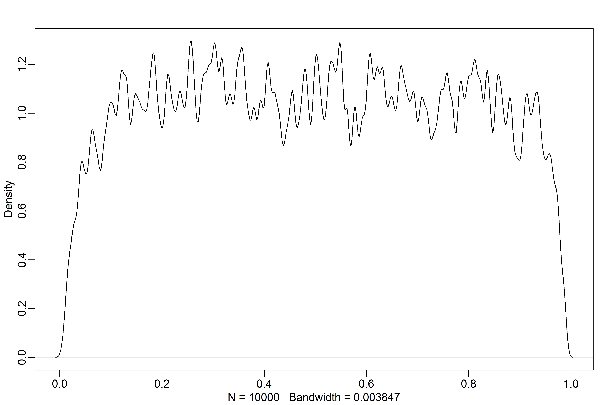
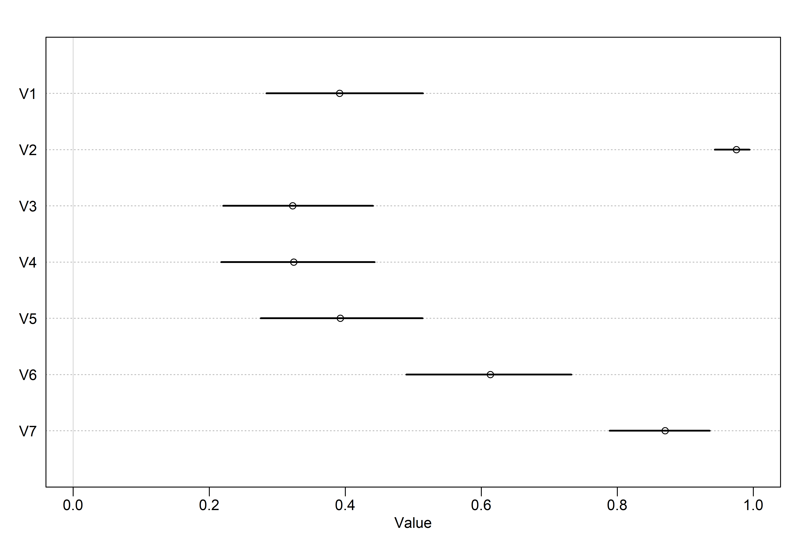
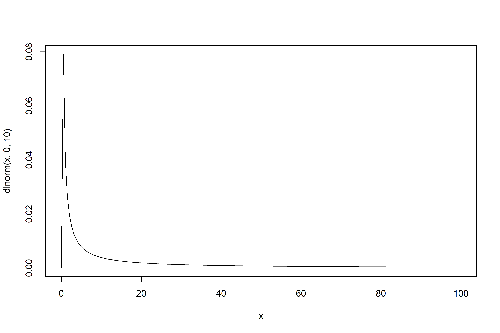
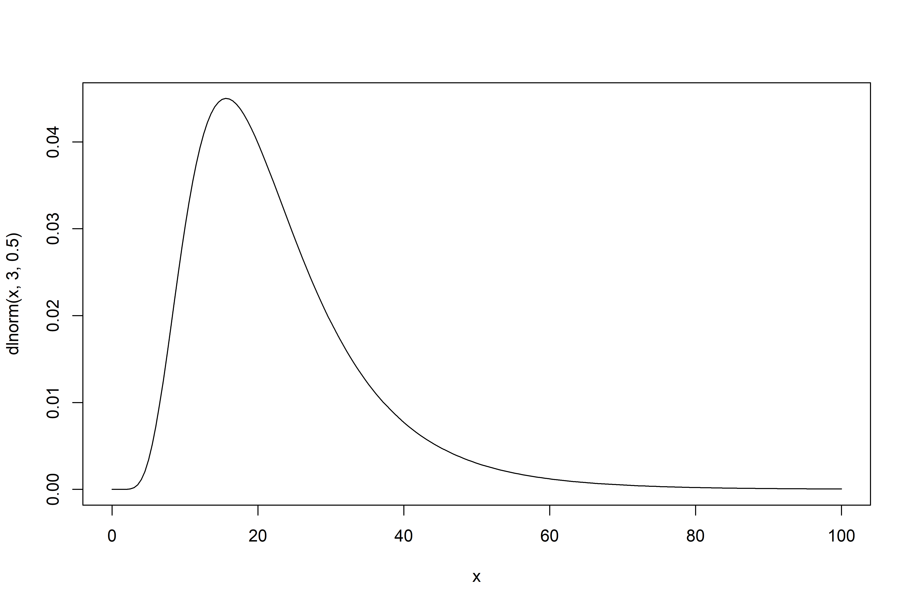
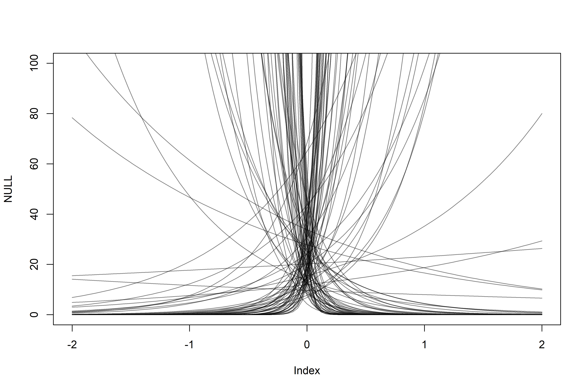
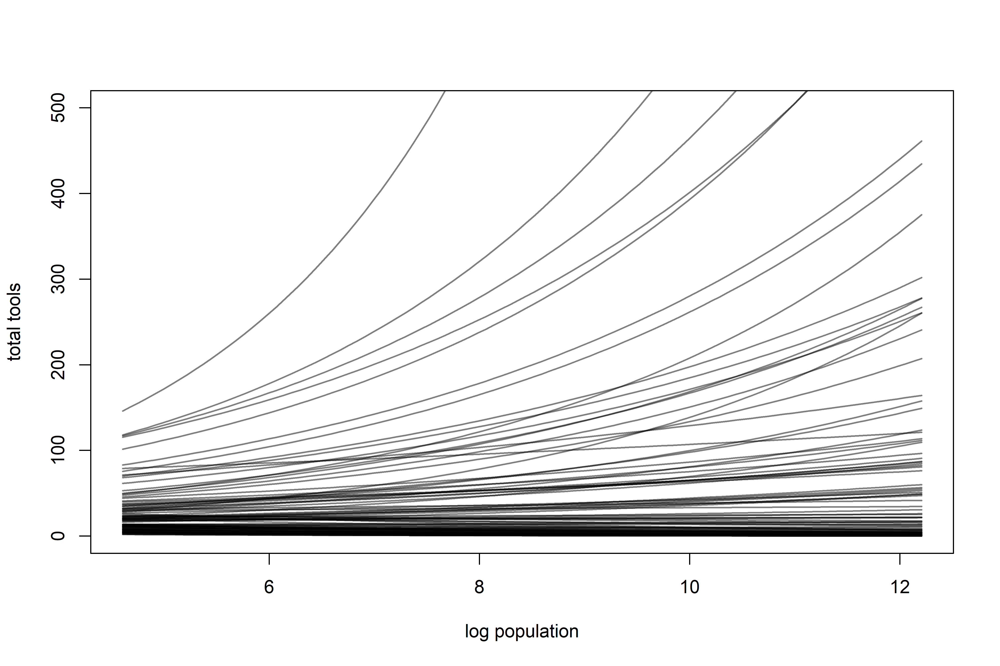
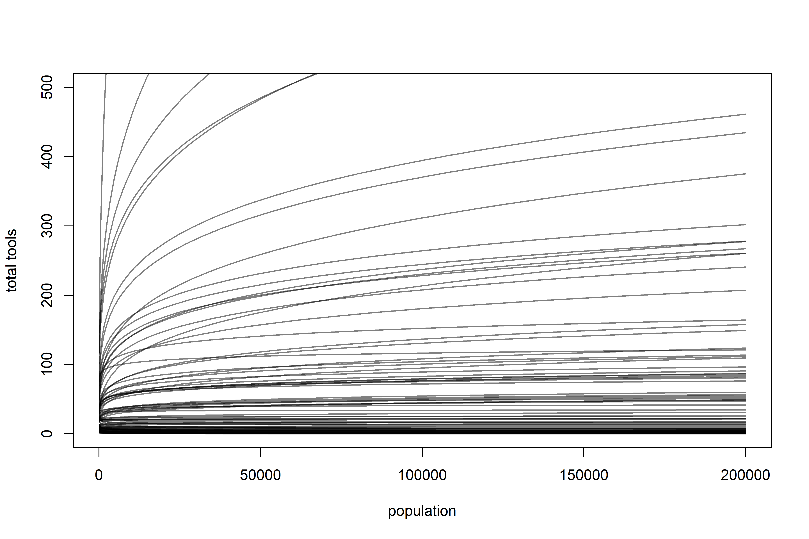
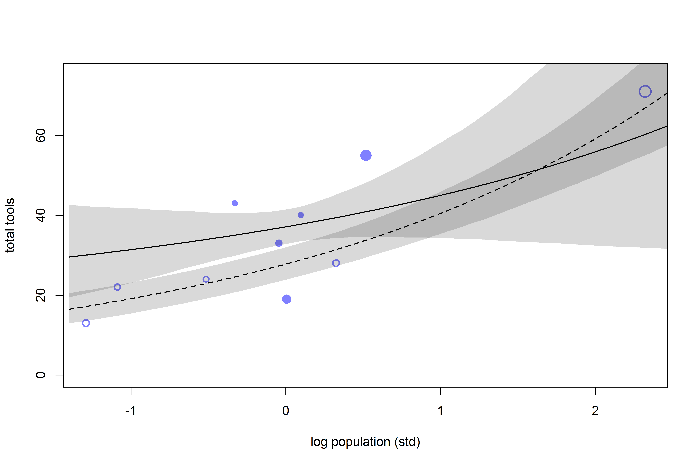
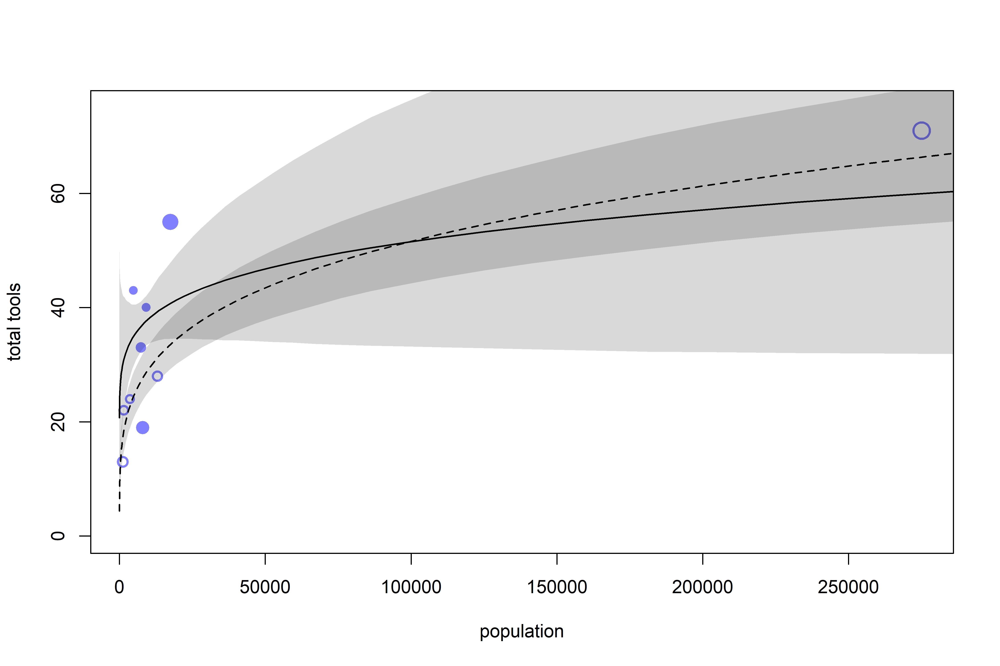

God Spiked the Integers
================

-   *Generalized Linear Models* (GLMs) are a lot like early mechanical
    computers — the moving pieces within (the parameters) interact to
    produce non-obvious predictions.
-   Understanding the parameters in GLMs will always involve more work
    than for Gaussian models, because of the transformation on the
    output scale.
-   GLMs let us model counts — two of the most common types of count
    models are *Binomial Regression*, which is useful for binary
    classification, and *Poisson Regression*, which is a special case of
    the binomial.

## 11.1 Binomial regression

$$
\begin{gather}
y \sim Binomial(n, p)
\end{gather}
$$

-   The binomial distribution is denoted above, where $y$ is a count on
    $[\ 0, \infty)$, $p$ is the probability that any particular “trial”
    is a success, and $n$ is the number of trials.
-   Two common flavors of binomial models are:
    1.  *Logistic Regression* — for single trial cases, when the outcome
        can only be 0 or 1
    2.  *Aggregated binomial regression* — for multi-trial cases, where
        the outcome can be any integer between 0 and $n$

### 11.1.1 Logistic regression: Prosocial chimpanzees

-   Consider an experiment where we want to test the social tendencies
    of chimpanzees. In the setup, the focal chimpanzee can pull a lever
    on the left to deliver food to himself or pull a lever on the right
    to deliver food to himself an another chimpanzee (see figure 11.2 on
    page 326).
-   If we set a variable to 1 when the chimpanzee pulls the left
    trigger, we can model this with a binomial model.

``` r
library(rethinking)
data("chimpanzees")
d <- chimpanzees

str(d)
```

    ## 'data.frame':    504 obs. of  8 variables:
    ##  $ actor       : int  1 1 1 1 1 1 1 1 1 1 ...
    ##  $ recipient   : int  NA NA NA NA NA NA NA NA NA NA ...
    ##  $ condition   : int  0 0 0 0 0 0 0 0 0 0 ...
    ##  $ block       : int  1 1 1 1 1 1 2 2 2 2 ...
    ##  $ trial       : int  2 4 6 8 10 12 14 16 18 20 ...
    ##  $ prosoc_left : int  0 0 1 0 1 1 1 1 0 0 ...
    ##  $ chose_prosoc: int  1 0 0 1 1 1 0 0 1 1 ...
    ##  $ pulled_left : int  0 1 0 0 1 1 0 0 0 0 ...

-   We want to infer what happens in each combination of `prosoc_left`
    and `condition`:
    1.  `prosoc_left = 0` and `condition = 0` : two food items on the
        right and no partner
    2.  `prosoc_left = 1` and `condition = 0` : two food items on the
        left and no partner
    3.  `prosoc_left = 0` and `condition = 1` : two food items on the
        right and partner present
    4.  `prosoc_left = 1` and `condition = 1` : two food items on the
        left and partner present

``` r
d$treatment <- 1 + d$prosoc_left + 2 * d$condition
xtabs( ~ treatment + prosoc_left + condition, d)
```

    ## , , condition = 0
    ## 
    ##          prosoc_left
    ## treatment   0   1
    ##         1 126   0
    ##         2   0 126
    ##         3   0   0
    ##         4   0   0
    ## 
    ## , , condition = 1
    ## 
    ##          prosoc_left
    ## treatment   0   1
    ##         1   0   0
    ##         2   0   0
    ##         3 126   0
    ##         4   0 126

-   Now each combination is an index in treatment. In mathematical form:

$$
\begin{gather}
L_i \sim Binomial(1, p_i) \\
logit(p_i) = \alpha_{ACTOR[i]} + \beta_{TREATMENT[i]} \\
\alpha_j \sim to \ be \ determined \\
\beta_k \sim to \ be \ determined 
\end{gather}
$$

-   Here, $L$ is the 0/1 variable for `pulled_left` and $\alpha_j$ is a
    parameter for each of the 7 chimpanzees. Alternatively, this could
    have been defined with a Bernoulli distribution:

$$
\begin{gather}
L_i \sim Bernoulli(p_i)
\end{gather}
$$

-   The TBD priors are a bit weird to work with for GLMs — let’s start
    off with a super simple example:

$$
\begin{gather}
L_i \sim Binomial(1, p_i) \\
logit(p_i) = \alpha \\
\alpha \sim Normal(0, \omega)
\end{gather}
$$

-   We’ll change up $\omega$ to see what happens. To start, we’ll
    illustrate the madness of flat priors with $\omega = 10$.

``` r
# model with wide prior
m11.1 <-
  quap(
    alist(pulled_left ~ dbinom(1, p),
          logit(p) <- a,
          a ~ dnorm(0, 10)),
    data = d
  )

# sample from the prior
set.seed(1999)
prior <- extract.prior(m11.1, n = 1e4)
p <- inv_logit(prior$a) # need to get the prior on the outcome scale!

# wonk!
dens(p, adj = 0.1)
```

<!-- -->

-   A flat prior in the logit space is not a flat prior in the
    probability space!
-   A *slightly* more regularized prior with $\omega = 1.5$ is more akin
    to what we want:

``` r
# model with better prior
m11.1a <-
  quap(
    alist(pulled_left ~ dbinom(1, p),
          logit(p) <- a,
          a ~ dnorm(0, 1.5)),
    data = d
  )

# sample from the prior
set.seed(1999)
prior <- extract.prior(m11.1a, n = 1e4)
p <- inv_logit(prior$a) # need to get the prior on the outcome scale!

# wonk!
dens(p, adj = 0.1)
```

<!-- -->

-   Now let’s do the same weirdness with unconventionally flat priors
    for the $\beta$ parameters, just to drive this home.

``` r
# model with bad priors on treatment
m11.2 <-
  quap(
    alist(pulled_left ~ dbinom(1, p),
          logit(p) <- a + b[treatment],
          a ~ dnorm(0, 1.5),
          b[treatment] ~ dnorm(0, 10)),
    data = d
  )

# extract priors
set.seed(1999)
prior <- extract.prior(m11.2, n = 1e4)
p <- sapply(1:4, function(k) inv_logit(prior$a + prior$b[,k]))

# plot the *difference* between treatments 1 and 2:
dens(abs(p[,1] - p[,2]), adj = 0.1)
```

<!-- -->

-   Again, the flat prior means that the model believes that the
    treatments are either completely alike or completely different,
    which is not necessarily what we think!
-   Changing to a $\beta_j \sim Normal(0, 0.5)$ prior results in priors
    outcome that a difference of 0 is the highest prior probability, and
    the average is about 10%

``` r
# model with better priors for alpha and beta
m11.3 <-
  quap(
    alist(pulled_left ~ dbinom(1, p),
          logit(p) <- a + b[treatment],
          a ~ dnorm(0, 1.5),
          b[treatment] ~ dnorm(0, 0.5)),
    data = d
  )

# extract priors
set.seed(1999)
prior <- extract.prior(m11.3, n = 1e4)
p <- sapply(1:4, function(k) inv_logit(prior$a + prior$b[,k]))

# return the average prior difference between treatments 1 and 2:
mean(abs(p[,1] - p[,2]))
```

    ## [1] 0.09838663

``` r
# plot!
dens(abs(p[,1] - p[,2]), adj = 0.1)
```

<!-- -->

-   This makes sense, because it’s the *difference* in treatment effect.
-   Each treatment runs relatively evenly between 0 and 1, so *on
    average* the difference is likelier to be small (it’s more likely
    that each is somewhere in the middle rather than being on opposite
    ends).

``` r
# prep data for ulam
dat_list <-
  list(
    pulled_left = d$pulled_left,
    actor = d$actor,
    treatment = as.integer(d$treatment)
  )

# model! 
# log_lik = TRUE will have ulam() compute the values necessary for PSIS/WAIC
m11.4 <-
  ulam(
    alist(pulled_left ~ dbinom(1, p),
          logit(p) <- a[actor] + b[treatment],
          a[actor] ~ dnorm(0, 1.5),
          b[treatment] ~ dnorm(0, 0.5)),
    data = dat_list,
    chains = 4,
    log_lik = TRUE
  )
```

    ## Running MCMC with 4 sequential chains, with 1 thread(s) per chain...
    ## 
    ## Chain 1 Iteration:   1 / 1000 [  0%]  (Warmup) 
    ## Chain 1 Iteration: 100 / 1000 [ 10%]  (Warmup) 
    ## Chain 1 Iteration: 200 / 1000 [ 20%]  (Warmup) 
    ## Chain 1 Iteration: 300 / 1000 [ 30%]  (Warmup) 
    ## Chain 1 Iteration: 400 / 1000 [ 40%]  (Warmup) 
    ## Chain 1 Iteration: 500 / 1000 [ 50%]  (Warmup) 
    ## Chain 1 Iteration: 501 / 1000 [ 50%]  (Sampling) 
    ## Chain 1 Iteration: 600 / 1000 [ 60%]  (Sampling) 
    ## Chain 1 Iteration: 700 / 1000 [ 70%]  (Sampling) 
    ## Chain 1 Iteration: 800 / 1000 [ 80%]  (Sampling) 
    ## Chain 1 Iteration: 900 / 1000 [ 90%]  (Sampling) 
    ## Chain 1 Iteration: 1000 / 1000 [100%]  (Sampling) 
    ## Chain 1 finished in 3.0 seconds.
    ## Chain 2 Iteration:   1 / 1000 [  0%]  (Warmup) 
    ## Chain 2 Iteration: 100 / 1000 [ 10%]  (Warmup) 
    ## Chain 2 Iteration: 200 / 1000 [ 20%]  (Warmup) 
    ## Chain 2 Iteration: 300 / 1000 [ 30%]  (Warmup) 
    ## Chain 2 Iteration: 400 / 1000 [ 40%]  (Warmup) 
    ## Chain 2 Iteration: 500 / 1000 [ 50%]  (Warmup) 
    ## Chain 2 Iteration: 501 / 1000 [ 50%]  (Sampling) 
    ## Chain 2 Iteration: 600 / 1000 [ 60%]  (Sampling) 
    ## Chain 2 Iteration: 700 / 1000 [ 70%]  (Sampling) 
    ## Chain 2 Iteration: 800 / 1000 [ 80%]  (Sampling) 
    ## Chain 2 Iteration: 900 / 1000 [ 90%]  (Sampling) 
    ## Chain 2 Iteration: 1000 / 1000 [100%]  (Sampling) 
    ## Chain 2 finished in 2.3 seconds.
    ## Chain 3 Iteration:   1 / 1000 [  0%]  (Warmup) 
    ## Chain 3 Iteration: 100 / 1000 [ 10%]  (Warmup) 
    ## Chain 3 Iteration: 200 / 1000 [ 20%]  (Warmup) 
    ## Chain 3 Iteration: 300 / 1000 [ 30%]  (Warmup) 
    ## Chain 3 Iteration: 400 / 1000 [ 40%]  (Warmup) 
    ## Chain 3 Iteration: 500 / 1000 [ 50%]  (Warmup) 
    ## Chain 3 Iteration: 501 / 1000 [ 50%]  (Sampling) 
    ## Chain 3 Iteration: 600 / 1000 [ 60%]  (Sampling) 
    ## Chain 3 Iteration: 700 / 1000 [ 70%]  (Sampling) 
    ## Chain 3 Iteration: 800 / 1000 [ 80%]  (Sampling) 
    ## Chain 3 Iteration: 900 / 1000 [ 90%]  (Sampling) 
    ## Chain 3 Iteration: 1000 / 1000 [100%]  (Sampling) 
    ## Chain 3 finished in 2.2 seconds.
    ## Chain 4 Iteration:   1 / 1000 [  0%]  (Warmup) 
    ## Chain 4 Iteration: 100 / 1000 [ 10%]  (Warmup) 
    ## Chain 4 Iteration: 200 / 1000 [ 20%]  (Warmup) 
    ## Chain 4 Iteration: 300 / 1000 [ 30%]  (Warmup) 
    ## Chain 4 Iteration: 400 / 1000 [ 40%]  (Warmup) 
    ## Chain 4 Iteration: 500 / 1000 [ 50%]  (Warmup) 
    ## Chain 4 Iteration: 501 / 1000 [ 50%]  (Sampling) 
    ## Chain 4 Iteration: 600 / 1000 [ 60%]  (Sampling) 
    ## Chain 4 Iteration: 700 / 1000 [ 70%]  (Sampling) 
    ## Chain 4 Iteration: 800 / 1000 [ 80%]  (Sampling) 
    ## Chain 4 Iteration: 900 / 1000 [ 90%]  (Sampling) 
    ## Chain 4 Iteration: 1000 / 1000 [100%]  (Sampling) 
    ## Chain 4 finished in 2.3 seconds.
    ## 
    ## All 4 chains finished successfully.
    ## Mean chain execution time: 2.4 seconds.
    ## Total execution time: 11.1 seconds.

``` r
# posterior parameter estimations
precis(m11.4, depth = 2)
```

    ##             mean        sd        5.5%       94.5%     n_eff     Rhat4
    ## a[1] -0.44980706 0.3139821 -0.92451657  0.05750894  751.5753 1.0028090
    ## a[2]  3.90740284 0.7538153  2.81275470  5.19920580 1116.3178 1.0017326
    ## a[3] -0.75910512 0.3233431 -1.26333640 -0.23774445  784.4718 1.0005620
    ## a[4] -0.75177396 0.3254611 -1.27921005 -0.22778914  697.3081 1.0021056
    ## a[5] -0.44661271 0.3216998 -0.96673022  0.05557138  694.0721 1.0025012
    ## a[6]  0.47361480 0.3275634 -0.04112770  1.00740750  709.2511 0.9995079
    ## a[7]  1.96755274 0.4227796  1.31846020  2.68217590  964.1751 0.9984666
    ## b[1] -0.04099327 0.2735485 -0.46622989  0.39314257  640.7081 0.9994378
    ## b[2]  0.48699046 0.2759573  0.02829271  0.93107828  650.7775 1.0009767
    ## b[3] -0.38451436 0.2752398 -0.83566229  0.04590361  566.9048 1.0002082
    ## b[4]  0.37136420 0.2712957 -0.07175438  0.80449968  693.3715 1.0014881

``` r
# plot parameters:
post <- extract.samples(m11.4)
p_left <- inv_logit(post$a)
precis_plot(precis(as.data.frame(p_left)), xlim = c(0, 1))
```

<!-- -->

-   Here each row is a chimpanzee. Chimps 1, 3, 4, and 5 show a
    preference for the right lever. 2 and 7 show a preference for the
    left, with 2 preferring it greatly.
-   Having repeat measurements per actor (chimp), is useful for
    subtracting out this chimp-level preference to isolate the treatment
    effect.

``` r
# plot posterior treatment
labs <- c("R/N", "L/N", "R/P", "L/P")
precis_plot(precis(m11.4, depth = 2, pars = "b"), labels = labs)
```

<!-- -->

-   Here, “L/N” means “prosocial on left, no partner” and “R/P” means
    “prosocial on right/partner.”
-   We’re looking to see if chimpanzees choose the prosocial option when
    a partner is present, so we ought to compare the first/third row and
    the second/fourth row:

``` r
diffs <-
  list(
    db13 = post$b[,1] - post$b[,3],
    db24 = post$b[,2] - post$b[,4]
  )

precis_plot(precis(diffs))
```

<!-- -->

-   Here, there is weak evidence of the pulling the prosocial choice on
    the right when the partner is present, but the interval is pretty
    wide.
-   There is pretty negligible evidence for pulling the prosocial choice
    when the option is on the left (if anything, they choose the
    prosocial option when the partner is absent!)
-   Let’s compare the proportion each chimp actually pulled the left
    lever with the model’s posterior predictions.

``` r
pl <- by(d$pulled_left, list(d$actor, d$treatment), mean)

# proportion of pulling left under each treatment for chimp 1:
pl[1,]
```

    ##         1         2         3         4 
    ## 0.3333333 0.5000000 0.2777778 0.5555556

``` r
# plot proportions:
plot(NULL, 
     xlim = c(1, 28),
     ylim = c(0, 1),
     xlab = "",
     ylab = "proportion left lever",
     xaxt = "n",
     yaxt = "n")

axis(2, 
     at = c(0, 0.5, 1),
     labels = c(0, 0.5, 1))

abline(h = 0.5,
       lty = 2)

for (j in 1:7) abline(y = (j - 1)*4 + 4.5, lwd = 0.5)
for (j in 1:7) text((j - 1)*4 + 2.5, 1.1, concat("actor ", j), xpd = TRUE)
for (j in (1:7)[-2]) {
  lines((j - 1)*4 + c(1, 3), pl[j, c(1, 3)], lwd = 2, col = rangi2)
  lines((j - 1)*4 + c(2, 4), pl[j, c(2, 4)], lwd = 2, col = rangi2)
}

points(1:28, t(pl), pch = 16, col = "white", cex = 1.7)
points(1:28, t(pl), pch = c(1, 1, 16, 16), col = rangi2, lwd = 2)

yoff <- 0.01
text(1, pl[1, 1] - yoff, "R/N", pos = 1, cex = 0.8)
text(2, pl[1, 2] + yoff, "L/N", pos = 3, cex = 0.8)
text(3, pl[1, 3] - yoff, "R/P", pos = 1, cex = 0.8)
text(4, pl[1, 4] + yoff, "L/P", pos = 3, cex = 0.8)
```

<!-- -->

``` r
# posterior predictions
# see figure 11.4 on page 333 for the actual plot lol
dat <- list(actor = rep(1:7, each = 4), treatment = rep(1:4, times = 7))
p_post <- link(m11.4, data = dat)
p_mu <- apply(p_post, 2, mean)
p_ci <- apply(p_post, 2, PI)
```

-   There doesn’t seem to be any much evidence of the prosocial option
    being chosen more when a partner is present, but to test it out
    explicitly, let’s build a model with an interaction effect.
-   The simpler model will likely do just fine, because we don’t expect
    to see an interaction:

``` r
# prep new vars
d$side <- d$prosoc_left + 1 # right 1, left 2
d$cond <- d$condition + 1 # no partner 1, partner 2

# prep new list for ulam
dat_list2 <-
  list(pulled_left = d$pulled_left,
       actor = d$actor,
       side = d$side,
       cond = d$cond)

# model
m11.5 <- 
  ulam(
    alist(pulled_left ~ dbinom(1, p),
          logit(p) <- a[actor] + bs[side] + bc[cond],
          a[actor] ~ dnorm(0, 1.5),
          bs[side] ~ dnorm(0, 0.5),
          bc[cond] ~ dnorm(0, 0.5)),
    data = dat_list2,
    chains = 4,
    log_lik = TRUE
  )
```

    ## Running MCMC with 4 sequential chains, with 1 thread(s) per chain...
    ## 
    ## Chain 1 Iteration:   1 / 1000 [  0%]  (Warmup) 
    ## Chain 1 Iteration: 100 / 1000 [ 10%]  (Warmup) 
    ## Chain 1 Iteration: 200 / 1000 [ 20%]  (Warmup) 
    ## Chain 1 Iteration: 300 / 1000 [ 30%]  (Warmup) 
    ## Chain 1 Iteration: 400 / 1000 [ 40%]  (Warmup) 
    ## Chain 1 Iteration: 500 / 1000 [ 50%]  (Warmup) 
    ## Chain 1 Iteration: 501 / 1000 [ 50%]  (Sampling) 
    ## Chain 1 Iteration: 600 / 1000 [ 60%]  (Sampling) 
    ## Chain 1 Iteration: 700 / 1000 [ 70%]  (Sampling) 
    ## Chain 1 Iteration: 800 / 1000 [ 80%]  (Sampling) 
    ## Chain 1 Iteration: 900 / 1000 [ 90%]  (Sampling) 
    ## Chain 1 Iteration: 1000 / 1000 [100%]  (Sampling) 
    ## Chain 1 finished in 3.6 seconds.
    ## Chain 2 Iteration:   1 / 1000 [  0%]  (Warmup) 
    ## Chain 2 Iteration: 100 / 1000 [ 10%]  (Warmup) 
    ## Chain 2 Iteration: 200 / 1000 [ 20%]  (Warmup) 
    ## Chain 2 Iteration: 300 / 1000 [ 30%]  (Warmup) 
    ## Chain 2 Iteration: 400 / 1000 [ 40%]  (Warmup) 
    ## Chain 2 Iteration: 500 / 1000 [ 50%]  (Warmup) 
    ## Chain 2 Iteration: 501 / 1000 [ 50%]  (Sampling) 
    ## Chain 2 Iteration: 600 / 1000 [ 60%]  (Sampling) 
    ## Chain 2 Iteration: 700 / 1000 [ 70%]  (Sampling) 
    ## Chain 2 Iteration: 800 / 1000 [ 80%]  (Sampling) 
    ## Chain 2 Iteration: 900 / 1000 [ 90%]  (Sampling) 
    ## Chain 2 Iteration: 1000 / 1000 [100%]  (Sampling) 
    ## Chain 2 finished in 3.3 seconds.
    ## Chain 3 Iteration:   1 / 1000 [  0%]  (Warmup) 
    ## Chain 3 Iteration: 100 / 1000 [ 10%]  (Warmup) 
    ## Chain 3 Iteration: 200 / 1000 [ 20%]  (Warmup) 
    ## Chain 3 Iteration: 300 / 1000 [ 30%]  (Warmup) 
    ## Chain 3 Iteration: 400 / 1000 [ 40%]  (Warmup) 
    ## Chain 3 Iteration: 500 / 1000 [ 50%]  (Warmup) 
    ## Chain 3 Iteration: 501 / 1000 [ 50%]  (Sampling) 
    ## Chain 3 Iteration: 600 / 1000 [ 60%]  (Sampling) 
    ## Chain 3 Iteration: 700 / 1000 [ 70%]  (Sampling) 
    ## Chain 3 Iteration: 800 / 1000 [ 80%]  (Sampling) 
    ## Chain 3 Iteration: 900 / 1000 [ 90%]  (Sampling) 
    ## Chain 3 Iteration: 1000 / 1000 [100%]  (Sampling) 
    ## Chain 3 finished in 3.6 seconds.
    ## Chain 4 Iteration:   1 / 1000 [  0%]  (Warmup) 
    ## Chain 4 Iteration: 100 / 1000 [ 10%]  (Warmup) 
    ## Chain 4 Iteration: 200 / 1000 [ 20%]  (Warmup) 
    ## Chain 4 Iteration: 300 / 1000 [ 30%]  (Warmup) 
    ## Chain 4 Iteration: 400 / 1000 [ 40%]  (Warmup) 
    ## Chain 4 Iteration: 500 / 1000 [ 50%]  (Warmup) 
    ## Chain 4 Iteration: 501 / 1000 [ 50%]  (Sampling) 
    ## Chain 4 Iteration: 600 / 1000 [ 60%]  (Sampling) 
    ## Chain 4 Iteration: 700 / 1000 [ 70%]  (Sampling) 
    ## Chain 4 Iteration: 800 / 1000 [ 80%]  (Sampling) 
    ## Chain 4 Iteration: 900 / 1000 [ 90%]  (Sampling) 
    ## Chain 4 Iteration: 1000 / 1000 [100%]  (Sampling) 
    ## Chain 4 finished in 4.0 seconds.
    ## 
    ## All 4 chains finished successfully.
    ## Mean chain execution time: 3.6 seconds.
    ## Total execution time: 15.1 seconds.

``` r
# finally, compare models w/PSIS
compare(m11.5, m11.4, func = PSIS)
```

    ##           PSIS       SE    dPSIS      dSE    pPSIS    weight
    ## m11.5 530.4818 19.09699 0.000000       NA 7.637648 0.6786693
    ## m11.4 531.9772 19.01157 1.495326 1.264601 8.404094 0.3213307

-   The modle comparison here is for the sake of understanding, but the
    experiment + hypothesis tell us which model to use (`m11.4`), this
    comparison just lets us know that `m11.5` doesn’t add a whole lot.

``` r
# follow along with the overthinking box on pages 334-336
post <- extract.samples(m11.4, clean = FALSE) # clean = FALSE returns the log-probability
str(post)
```

    ## List of 5
    ##  $ a      : num [1:2000, 1:7] 0.234 -0.348 -0.456 -0.444 -0.73 ...
    ##  $ b      : num [1:2000, 1:4] -0.3065 0.2728 0.2321 -0.1591 0.0697 ...
    ##  $ log_lik: num [1:2000, 1:504] -0.657 -0.656 -0.588 -0.437 -0.416 ...
    ##  $ p      : num [1:2000, 1:504] 0.482 0.481 0.444 0.354 0.341 ...
    ##  $ lp__   : num [1:2000(1d)] -267 -269 -265 -265 -268 ...
    ##  - attr(*, "source")= chr "ulam posterior: 2000 samples from object"

``` r
stancode(m11.4)
```

    ## data{
    ##     int pulled_left[504];
    ##     int treatment[504];
    ##     int actor[504];
    ## }
    ## parameters{
    ##     vector[7] a;
    ##     vector[4] b;
    ## }
    ## model{
    ##     vector[504] p;
    ##     b ~ normal( 0 , 0.5 );
    ##     a ~ normal( 0 , 1.5 );
    ##     for ( i in 1:504 ) {
    ##         p[i] = a[actor[i]] + b[treatment[i]];
    ##         p[i] = inv_logit(p[i]);
    ##     }
    ##     pulled_left ~ binomial( 1 , p );
    ## }
    ## generated quantities{
    ##     vector[504] log_lik;
    ##     vector[504] p;
    ##     for ( i in 1:504 ) {
    ##         p[i] = a[actor[i]] + b[treatment[i]];
    ##         p[i] = inv_logit(p[i]);
    ##     }
    ##     for ( i in 1:504 ) log_lik[i] = binomial_lpmf( pulled_left[i] | 1 , p[i] );
    ## }

### 11.1.2 Relative shark and absolute deer

-   The above focused on the posterior difference treatment made on the
    outcome scale — this focuses on *absolute effects*.
-   Oftentimes, we’re interested in the *relative effect* a term has in
    a logistic model — the proportional change in the odds of an
    outcome.
-   We can calculate these *proportional odds* relative effect sizes by
    exponentiating the parameter of interest.

``` r
post <- extract.samples(m11.4)

# what is the proportional odds difference between treatments 4 & 2?
mean(exp(post$b[,4] - post$b[,2]))
```

    ## [1] 0.9233304

-   On average, the switch from treatment 2 to treatment 4 (adding a
    partner) multiplies the odds of pulling the left lever by 0.92 (an
    8% reduction in odds).
-   The risk in proportional odds is that they don’t necessarily tell us
    if a parameter is important or not — for example if the odds of some
    event are 1 in 1 million, and a parameter change involves a 5.0
    proportional odds increase, then the resulting odds now only 5 in 1
    million.
-   Relative and absolute risks are both important in — consider
    relative sharks and absolute deer. People are very afraid of sharks
    but not so much of deer — sharks themselves are more dangerous
    *relative* to deer, but more people are killed by deer each year so
    deer are more *absolutely* dangerous.

### 11.1.3 Aggregated binomial: Chimpanzees again, condensed

-   The original model treated each pull of the lever as a separate
    trial, but we could aggregate the trials by chimp:

``` r
data("chimpanzees")
d <- chimpanzees
d$treatment <- 1 + d$prosoc_left + 2*d$condition
d$side <- d$prosoc_left + 1 # right = 1, left = 2
d$cond <- d$condition + 1 # no partner 1, partner 2

d_aggregated <- 
  aggregate(
    d$pulled_left,
    list(treatment = d$treatment,
         actor = d$actor,
         side = d$side,
         cond = d$cond),
    sum
  )

colnames(d_aggregated)[5] <- "left_pulls"

d_aggregated
```

    ##    treatment actor side cond left_pulls
    ## 1          1     1    1    1          6
    ## 2          1     2    1    1         18
    ## 3          1     3    1    1          5
    ## 4          1     4    1    1          6
    ## 5          1     5    1    1          6
    ## 6          1     6    1    1         14
    ## 7          1     7    1    1         14
    ## 8          2     1    2    1          9
    ## 9          2     2    2    1         18
    ## 10         2     3    2    1         11
    ## 11         2     4    2    1          9
    ## 12         2     5    2    1         10
    ## 13         2     6    2    1         11
    ## 14         2     7    2    1         15
    ## 15         3     1    1    2          5
    ## 16         3     2    1    2         18
    ## 17         3     3    1    2          3
    ## 18         3     4    1    2          2
    ## 19         3     5    1    2          5
    ## 20         3     6    1    2         10
    ## 21         3     7    1    2         17
    ## 22         4     1    2    2         10
    ## 23         4     2    2    2         18
    ## 24         4     3    2    2          6
    ## 25         4     4    2    2          8
    ## 26         4     5    2    2          9
    ## 27         4     6    2    2         11
    ## 28         4     7    2    2         18

-   We can redefine the model in these aggregated terms & get the same
    inferences as before:

``` r
# prep new aggregated data for ulam
dat <- 
  with(
    d_aggregated,
    list(left_pulls = left_pulls,
         treatment = treatment,
         actor = actor,
         side = side,
         cond = cond)
  )

# model the aggregated data!
m11.6 <- 
  ulam(
    alist(left_pulls ~ dbinom(18, p), # each chimp has 18 pulls
          logit(p) <- a[actor] + b[treatment],
          a[actor] ~ dnorm(0, 1.5),
          b[treatment] ~ dnorm(0, 0.5)),
    data = dat,
    chains = 4,
    log_lik = TRUE
  )
```

    ## Running MCMC with 4 sequential chains, with 1 thread(s) per chain...
    ## 
    ## Chain 1 Iteration:   1 / 1000 [  0%]  (Warmup) 
    ## Chain 1 Iteration: 100 / 1000 [ 10%]  (Warmup) 
    ## Chain 1 Iteration: 200 / 1000 [ 20%]  (Warmup) 
    ## Chain 1 Iteration: 300 / 1000 [ 30%]  (Warmup) 
    ## Chain 1 Iteration: 400 / 1000 [ 40%]  (Warmup) 
    ## Chain 1 Iteration: 500 / 1000 [ 50%]  (Warmup) 
    ## Chain 1 Iteration: 501 / 1000 [ 50%]  (Sampling) 
    ## Chain 1 Iteration: 600 / 1000 [ 60%]  (Sampling) 
    ## Chain 1 Iteration: 700 / 1000 [ 70%]  (Sampling) 
    ## Chain 1 Iteration: 800 / 1000 [ 80%]  (Sampling) 
    ## Chain 1 Iteration: 900 / 1000 [ 90%]  (Sampling) 
    ## Chain 1 Iteration: 1000 / 1000 [100%]  (Sampling) 
    ## Chain 1 finished in 0.2 seconds.
    ## Chain 2 Iteration:   1 / 1000 [  0%]  (Warmup) 
    ## Chain 2 Iteration: 100 / 1000 [ 10%]  (Warmup) 
    ## Chain 2 Iteration: 200 / 1000 [ 20%]  (Warmup) 
    ## Chain 2 Iteration: 300 / 1000 [ 30%]  (Warmup) 
    ## Chain 2 Iteration: 400 / 1000 [ 40%]  (Warmup) 
    ## Chain 2 Iteration: 500 / 1000 [ 50%]  (Warmup) 
    ## Chain 2 Iteration: 501 / 1000 [ 50%]  (Sampling) 
    ## Chain 2 Iteration: 600 / 1000 [ 60%]  (Sampling) 
    ## Chain 2 Iteration: 700 / 1000 [ 70%]  (Sampling) 
    ## Chain 2 Iteration: 800 / 1000 [ 80%]  (Sampling) 
    ## Chain 2 Iteration: 900 / 1000 [ 90%]  (Sampling) 
    ## Chain 2 Iteration: 1000 / 1000 [100%]  (Sampling) 
    ## Chain 2 finished in 0.4 seconds.
    ## Chain 3 Iteration:   1 / 1000 [  0%]  (Warmup) 
    ## Chain 3 Iteration: 100 / 1000 [ 10%]  (Warmup) 
    ## Chain 3 Iteration: 200 / 1000 [ 20%]  (Warmup) 
    ## Chain 3 Iteration: 300 / 1000 [ 30%]  (Warmup) 
    ## Chain 3 Iteration: 400 / 1000 [ 40%]  (Warmup) 
    ## Chain 3 Iteration: 500 / 1000 [ 50%]  (Warmup) 
    ## Chain 3 Iteration: 501 / 1000 [ 50%]  (Sampling) 
    ## Chain 3 Iteration: 600 / 1000 [ 60%]  (Sampling) 
    ## Chain 3 Iteration: 700 / 1000 [ 70%]  (Sampling) 
    ## Chain 3 Iteration: 800 / 1000 [ 80%]  (Sampling) 
    ## Chain 3 Iteration: 900 / 1000 [ 90%]  (Sampling) 
    ## Chain 3 Iteration: 1000 / 1000 [100%]  (Sampling) 
    ## Chain 3 finished in 0.4 seconds.
    ## Chain 4 Iteration:   1 / 1000 [  0%]  (Warmup) 
    ## Chain 4 Iteration: 100 / 1000 [ 10%]  (Warmup) 
    ## Chain 4 Iteration: 200 / 1000 [ 20%]  (Warmup) 
    ## Chain 4 Iteration: 300 / 1000 [ 30%]  (Warmup) 
    ## Chain 4 Iteration: 400 / 1000 [ 40%]  (Warmup) 
    ## Chain 4 Iteration: 500 / 1000 [ 50%]  (Warmup) 
    ## Chain 4 Iteration: 501 / 1000 [ 50%]  (Sampling) 
    ## Chain 4 Iteration: 600 / 1000 [ 60%]  (Sampling) 
    ## Chain 4 Iteration: 700 / 1000 [ 70%]  (Sampling) 
    ## Chain 4 Iteration: 800 / 1000 [ 80%]  (Sampling) 
    ## Chain 4 Iteration: 900 / 1000 [ 90%]  (Sampling) 
    ## Chain 4 Iteration: 1000 / 1000 [100%]  (Sampling) 
    ## Chain 4 finished in 0.3 seconds.
    ## 
    ## All 4 chains finished successfully.
    ## Mean chain execution time: 0.3 seconds.
    ## Total execution time: 2.0 seconds.

``` r
# compare!
compare(m11.6, m11.4, func = PSIS)
```

    ##           PSIS        SE    dPSIS      dSE    pPSIS       weight
    ## m11.6 114.6926  8.487133   0.0000       NA 8.665204 1.000000e+00
    ## m11.4 531.9772 19.011568 417.2846 9.514502 8.404094 2.442332e-91

-   Here, PSIS shows very different values, even though they’re
    effectively the same. This is just because `dbinom()` contains the
    multiplicity term for all the possible orders the successes could
    appear (for example, here’s 6 successes in 9 trials):

$$
\begin{gather}
Pr(6|9, p) = \frac{6!}{6!(9 - 6)!} \ p^6 (1 - p)^{9 - 6}
\end{gather}
$$

-   When all the trials are split into 9 different 0/1 trials, there is
    no multiplicity term. So the joint probability for the aggregated
    data is larger — there are more ways to see the data — and the
    PSIS/WAIC scores end up smaller.

``` r
# deviance of aggregated 6-in-9
-2*dbinom(6, 9, 0.2, log = TRUE)
```

    ## [1] 11.79048

``` r
# deviance of disaggregated
-2*sum(dbern(c(1, 1, 1, 1, 1, 1, 0, 0, 0), 0.2, log = TRUE))
```

    ## [1] 20.65212

-   This difference is meaningless — it’s just a side effect of how the
    data is organized. Posterior inference will be the same!
-   We do, however, get a warning about Pareto *k* values — why didn’t
    we get this warning for the diaggregated data?
-   This is because of WAIC/PSIS are calculated with loo, but when there
    are multiple (18) trials per observation, it’s more like leave 18
    out! So we get a warning for highly influential observations.
-   Long story short — if you want to calculate WAIC or PSIS, you should
    use a *logistic regression* format, otherwise you implicitly assume
    only large chunks of data are separable (though there are times
    where this makes sense, like multilevel models!).

### 11.1.4 Aggregated binomial: Graduate schoold admissions

-   In the chimpanzee case, the aggregated data had the same number of
    trials for each observation, but this often isn’t the case.
-   This can be handled simply by inserting a variable for the number of
    trials!

``` r
data("UCBadmit")
d <- UCBadmit

d
```

    ##    dept applicant.gender admit reject applications
    ## 1     A             male   512    313          825
    ## 2     A           female    89     19          108
    ## 3     B             male   353    207          560
    ## 4     B           female    17      8           25
    ## 5     C             male   120    205          325
    ## 6     C           female   202    391          593
    ## 7     D             male   138    279          417
    ## 8     D           female   131    244          375
    ## 9     E             male    53    138          191
    ## 10    E           female    94    299          393
    ## 11    F             male    22    351          373
    ## 12    F           female    24    317          341

-   Our job here is to evaluate whether the data contains evidence of
    gender bias in admissions. Here’s what we’ll model:

$$
\begin{gather}
A_i \sim Binomial(N_i, p_i) \\
logit(p_i) = \alpha_{GID[i]} \\
\alpha_j \sim Normal(0, 1.5)
\end{gather}
$$

``` r
# prep data for ulam
dat_list <-
  list(admit = d$admit,
       applications = d$applications,
       gid = ifelse(d$applicant.gender == "male", 1, 2))

# model!
m11.7 <- 
  ulam(
    alist(admit ~ dbinom(applications, p),
          logit(p) <- a[gid],
          a[gid] ~ dnorm(0, 1.5)),
    data = dat_list,
    chains = 4
  )
```

    ## Running MCMC with 4 sequential chains, with 1 thread(s) per chain...
    ## 
    ## Chain 1 Iteration:   1 / 1000 [  0%]  (Warmup) 
    ## Chain 1 Iteration: 100 / 1000 [ 10%]  (Warmup) 
    ## Chain 1 Iteration: 200 / 1000 [ 20%]  (Warmup) 
    ## Chain 1 Iteration: 300 / 1000 [ 30%]  (Warmup) 
    ## Chain 1 Iteration: 400 / 1000 [ 40%]  (Warmup) 
    ## Chain 1 Iteration: 500 / 1000 [ 50%]  (Warmup) 
    ## Chain 1 Iteration: 501 / 1000 [ 50%]  (Sampling) 
    ## Chain 1 Iteration: 600 / 1000 [ 60%]  (Sampling) 
    ## Chain 1 Iteration: 700 / 1000 [ 70%]  (Sampling) 
    ## Chain 1 Iteration: 800 / 1000 [ 80%]  (Sampling) 
    ## Chain 1 Iteration: 900 / 1000 [ 90%]  (Sampling) 
    ## Chain 1 Iteration: 1000 / 1000 [100%]  (Sampling) 
    ## Chain 1 finished in 0.1 seconds.
    ## Chain 2 Iteration:   1 / 1000 [  0%]  (Warmup) 
    ## Chain 2 Iteration: 100 / 1000 [ 10%]  (Warmup) 
    ## Chain 2 Iteration: 200 / 1000 [ 20%]  (Warmup) 
    ## Chain 2 Iteration: 300 / 1000 [ 30%]  (Warmup) 
    ## Chain 2 Iteration: 400 / 1000 [ 40%]  (Warmup) 
    ## Chain 2 Iteration: 500 / 1000 [ 50%]  (Warmup) 
    ## Chain 2 Iteration: 501 / 1000 [ 50%]  (Sampling) 
    ## Chain 2 Iteration: 600 / 1000 [ 60%]  (Sampling) 
    ## Chain 2 Iteration: 700 / 1000 [ 70%]  (Sampling) 
    ## Chain 2 Iteration: 800 / 1000 [ 80%]  (Sampling) 
    ## Chain 2 Iteration: 900 / 1000 [ 90%]  (Sampling) 
    ## Chain 2 Iteration: 1000 / 1000 [100%]  (Sampling) 
    ## Chain 2 finished in 0.1 seconds.
    ## Chain 3 Iteration:   1 / 1000 [  0%]  (Warmup) 
    ## Chain 3 Iteration: 100 / 1000 [ 10%]  (Warmup) 
    ## Chain 3 Iteration: 200 / 1000 [ 20%]  (Warmup) 
    ## Chain 3 Iteration: 300 / 1000 [ 30%]  (Warmup) 
    ## Chain 3 Iteration: 400 / 1000 [ 40%]  (Warmup) 
    ## Chain 3 Iteration: 500 / 1000 [ 50%]  (Warmup) 
    ## Chain 3 Iteration: 501 / 1000 [ 50%]  (Sampling) 
    ## Chain 3 Iteration: 600 / 1000 [ 60%]  (Sampling) 
    ## Chain 3 Iteration: 700 / 1000 [ 70%]  (Sampling) 
    ## Chain 3 Iteration: 800 / 1000 [ 80%]  (Sampling) 
    ## Chain 3 Iteration: 900 / 1000 [ 90%]  (Sampling) 
    ## Chain 3 Iteration: 1000 / 1000 [100%]  (Sampling) 
    ## Chain 3 finished in 0.1 seconds.
    ## Chain 4 Iteration:   1 / 1000 [  0%]  (Warmup) 
    ## Chain 4 Iteration: 100 / 1000 [ 10%]  (Warmup) 
    ## Chain 4 Iteration: 200 / 1000 [ 20%]  (Warmup) 
    ## Chain 4 Iteration: 300 / 1000 [ 30%]  (Warmup) 
    ## Chain 4 Iteration: 400 / 1000 [ 40%]  (Warmup) 
    ## Chain 4 Iteration: 500 / 1000 [ 50%]  (Warmup) 
    ## Chain 4 Iteration: 501 / 1000 [ 50%]  (Sampling) 
    ## Chain 4 Iteration: 600 / 1000 [ 60%]  (Sampling) 
    ## Chain 4 Iteration: 700 / 1000 [ 70%]  (Sampling) 
    ## Chain 4 Iteration: 800 / 1000 [ 80%]  (Sampling) 
    ## Chain 4 Iteration: 900 / 1000 [ 90%]  (Sampling) 
    ## Chain 4 Iteration: 1000 / 1000 [100%]  (Sampling) 
    ## Chain 4 finished in 0.1 seconds.
    ## 
    ## All 4 chains finished successfully.
    ## Mean chain execution time: 0.1 seconds.
    ## Total execution time: 1.1 seconds.

``` r
precis(m11.7, depth = 2)
```

    ##            mean         sd       5.5%      94.5%    n_eff     Rhat4
    ## a[1] -0.2195115 0.03806626 -0.2794260 -0.1597669 1535.812 0.9988373
    ## a[2] -0.8309675 0.05232007 -0.9158516 -0.7476005 1395.712 1.0014077

-   There certainly seems to be a difference! To get better insight,
    let’s compare on the logit scale (relative shark!) as well as on the
    outcome (absolute deer!)

``` r
post <- extract.samples(m11.7)
diff_a <- post$a[,1] - post$a[,2]
diff_p <- inv_logit(post$a[,1]) - inv_logit(post$a[,2])
precis(list(diff_a = diff_a, diff_p = diff_p))
```

    ##             mean         sd      5.5%     94.5%  histogram
    ## diff_a 0.6114560 0.06342569 0.5063865 0.7144296  ▁▁▃▇▇▅▂▁▁
    ## diff_p 0.1418067 0.01420426 0.1182517 0.1646082 ▁▁▂▃▇▇▅▂▁▁

-   Here, the log-odds difference is certainly positive, and the
    difference (in favor of males) is somewhere between 12% and 16% on
    the probability scale.
-   However, our predictions aren’t very good!

``` r
postcheck(m11.7)

# draw lines connecting points from the same dept
for (i in 1:6) {
  
  x <- 1 + 2*(i-1)
  y1 <- d$admit[x]/d$applications[x]
  y2 <- d$admit[x + 1]/d$applications[x + 1]
  lines(c(x, x+1), c(y1, y2), col = rangi2, lwd = 2)
  text(x + 0.5, (y1 + y2)/2 + 0.05, d$dept[x], cex = 0.8, col = rangi2)
  
}
```

<!-- -->

-   Sometimes bad fits are the result of coding mistakes, but this
    isn’t. The model is correctly answering the bad question, *what are
    the average probabilities of admission for men and women across all
    departments?*
-   We instead want to answer the question, *what is the average
    difference in probability of admission between men and women within
    departments?*

$$
\begin{gather}
A_i \sim Binomial(N_i, p_i) \\
logit(p_i) = \alpha_{GID[i]} + \delta_{DEPT[i]} \\
\alpha_j \sim Normal(0, 1.5) \\ 
\delta_k \sim Normal(0, 1.5)
\end{gather}
$$

``` r
# create an id for each department
dat_list$dept_id <- rep(1:6, each = 2)

# model!
m11.8 <-
  ulam(
    alist(admit ~ dbinom(applications, p),
          logit(p) <- a[gid] + delta[dept_id],
          a[gid] ~ dnorm(0, 1.5),
          delta[dept_id] ~ dnorm(0, 1.5)),
    data = dat_list,
    chains = 4,
    iter = 4000
  )
```

    ## Running MCMC with 4 sequential chains, with 1 thread(s) per chain...
    ## 
    ## Chain 1 Iteration:    1 / 4000 [  0%]  (Warmup) 
    ## Chain 1 Iteration:  100 / 4000 [  2%]  (Warmup) 
    ## Chain 1 Iteration:  200 / 4000 [  5%]  (Warmup) 
    ## Chain 1 Iteration:  300 / 4000 [  7%]  (Warmup) 
    ## Chain 1 Iteration:  400 / 4000 [ 10%]  (Warmup) 
    ## Chain 1 Iteration:  500 / 4000 [ 12%]  (Warmup) 
    ## Chain 1 Iteration:  600 / 4000 [ 15%]  (Warmup) 
    ## Chain 1 Iteration:  700 / 4000 [ 17%]  (Warmup) 
    ## Chain 1 Iteration:  800 / 4000 [ 20%]  (Warmup) 
    ## Chain 1 Iteration:  900 / 4000 [ 22%]  (Warmup) 
    ## Chain 1 Iteration: 1000 / 4000 [ 25%]  (Warmup) 
    ## Chain 1 Iteration: 1100 / 4000 [ 27%]  (Warmup) 
    ## Chain 1 Iteration: 1200 / 4000 [ 30%]  (Warmup) 
    ## Chain 1 Iteration: 1300 / 4000 [ 32%]  (Warmup) 
    ## Chain 1 Iteration: 1400 / 4000 [ 35%]  (Warmup) 
    ## Chain 1 Iteration: 1500 / 4000 [ 37%]  (Warmup) 
    ## Chain 1 Iteration: 1600 / 4000 [ 40%]  (Warmup) 
    ## Chain 1 Iteration: 1700 / 4000 [ 42%]  (Warmup) 
    ## Chain 1 Iteration: 1800 / 4000 [ 45%]  (Warmup) 
    ## Chain 1 Iteration: 1900 / 4000 [ 47%]  (Warmup) 
    ## Chain 1 Iteration: 2000 / 4000 [ 50%]  (Warmup) 
    ## Chain 1 Iteration: 2001 / 4000 [ 50%]  (Sampling) 
    ## Chain 1 Iteration: 2100 / 4000 [ 52%]  (Sampling) 
    ## Chain 1 Iteration: 2200 / 4000 [ 55%]  (Sampling) 
    ## Chain 1 Iteration: 2300 / 4000 [ 57%]  (Sampling) 
    ## Chain 1 Iteration: 2400 / 4000 [ 60%]  (Sampling) 
    ## Chain 1 Iteration: 2500 / 4000 [ 62%]  (Sampling) 
    ## Chain 1 Iteration: 2600 / 4000 [ 65%]  (Sampling) 
    ## Chain 1 Iteration: 2700 / 4000 [ 67%]  (Sampling) 
    ## Chain 1 Iteration: 2800 / 4000 [ 70%]  (Sampling) 
    ## Chain 1 Iteration: 2900 / 4000 [ 72%]  (Sampling) 
    ## Chain 1 Iteration: 3000 / 4000 [ 75%]  (Sampling) 
    ## Chain 1 Iteration: 3100 / 4000 [ 77%]  (Sampling) 
    ## Chain 1 Iteration: 3200 / 4000 [ 80%]  (Sampling) 
    ## Chain 1 Iteration: 3300 / 4000 [ 82%]  (Sampling) 
    ## Chain 1 Iteration: 3400 / 4000 [ 85%]  (Sampling) 
    ## Chain 1 Iteration: 3500 / 4000 [ 87%]  (Sampling) 
    ## Chain 1 Iteration: 3600 / 4000 [ 90%]  (Sampling) 
    ## Chain 1 Iteration: 3700 / 4000 [ 92%]  (Sampling) 
    ## Chain 1 Iteration: 3800 / 4000 [ 95%]  (Sampling) 
    ## Chain 1 Iteration: 3900 / 4000 [ 97%]  (Sampling) 
    ## Chain 1 Iteration: 4000 / 4000 [100%]  (Sampling) 
    ## Chain 1 finished in 0.9 seconds.
    ## Chain 2 Iteration:    1 / 4000 [  0%]  (Warmup) 
    ## Chain 2 Iteration:  100 / 4000 [  2%]  (Warmup) 
    ## Chain 2 Iteration:  200 / 4000 [  5%]  (Warmup) 
    ## Chain 2 Iteration:  300 / 4000 [  7%]  (Warmup) 
    ## Chain 2 Iteration:  400 / 4000 [ 10%]  (Warmup) 
    ## Chain 2 Iteration:  500 / 4000 [ 12%]  (Warmup) 
    ## Chain 2 Iteration:  600 / 4000 [ 15%]  (Warmup) 
    ## Chain 2 Iteration:  700 / 4000 [ 17%]  (Warmup) 
    ## Chain 2 Iteration:  800 / 4000 [ 20%]  (Warmup) 
    ## Chain 2 Iteration:  900 / 4000 [ 22%]  (Warmup) 
    ## Chain 2 Iteration: 1000 / 4000 [ 25%]  (Warmup) 
    ## Chain 2 Iteration: 1100 / 4000 [ 27%]  (Warmup) 
    ## Chain 2 Iteration: 1200 / 4000 [ 30%]  (Warmup) 
    ## Chain 2 Iteration: 1300 / 4000 [ 32%]  (Warmup) 
    ## Chain 2 Iteration: 1400 / 4000 [ 35%]  (Warmup) 
    ## Chain 2 Iteration: 1500 / 4000 [ 37%]  (Warmup) 
    ## Chain 2 Iteration: 1600 / 4000 [ 40%]  (Warmup) 
    ## Chain 2 Iteration: 1700 / 4000 [ 42%]  (Warmup) 
    ## Chain 2 Iteration: 1800 / 4000 [ 45%]  (Warmup) 
    ## Chain 2 Iteration: 1900 / 4000 [ 47%]  (Warmup) 
    ## Chain 2 Iteration: 2000 / 4000 [ 50%]  (Warmup) 
    ## Chain 2 Iteration: 2001 / 4000 [ 50%]  (Sampling) 
    ## Chain 2 Iteration: 2100 / 4000 [ 52%]  (Sampling) 
    ## Chain 2 Iteration: 2200 / 4000 [ 55%]  (Sampling) 
    ## Chain 2 Iteration: 2300 / 4000 [ 57%]  (Sampling) 
    ## Chain 2 Iteration: 2400 / 4000 [ 60%]  (Sampling) 
    ## Chain 2 Iteration: 2500 / 4000 [ 62%]  (Sampling) 
    ## Chain 2 Iteration: 2600 / 4000 [ 65%]  (Sampling) 
    ## Chain 2 Iteration: 2700 / 4000 [ 67%]  (Sampling) 
    ## Chain 2 Iteration: 2800 / 4000 [ 70%]  (Sampling) 
    ## Chain 2 Iteration: 2900 / 4000 [ 72%]  (Sampling) 
    ## Chain 2 Iteration: 3000 / 4000 [ 75%]  (Sampling) 
    ## Chain 2 Iteration: 3100 / 4000 [ 77%]  (Sampling) 
    ## Chain 2 Iteration: 3200 / 4000 [ 80%]  (Sampling) 
    ## Chain 2 Iteration: 3300 / 4000 [ 82%]  (Sampling) 
    ## Chain 2 Iteration: 3400 / 4000 [ 85%]  (Sampling) 
    ## Chain 2 Iteration: 3500 / 4000 [ 87%]  (Sampling) 
    ## Chain 2 Iteration: 3600 / 4000 [ 90%]  (Sampling) 
    ## Chain 2 Iteration: 3700 / 4000 [ 92%]  (Sampling) 
    ## Chain 2 Iteration: 3800 / 4000 [ 95%]  (Sampling) 
    ## Chain 2 Iteration: 3900 / 4000 [ 97%]  (Sampling) 
    ## Chain 2 Iteration: 4000 / 4000 [100%]  (Sampling) 
    ## Chain 2 finished in 0.9 seconds.
    ## Chain 3 Iteration:    1 / 4000 [  0%]  (Warmup) 
    ## Chain 3 Iteration:  100 / 4000 [  2%]  (Warmup) 
    ## Chain 3 Iteration:  200 / 4000 [  5%]  (Warmup) 
    ## Chain 3 Iteration:  300 / 4000 [  7%]  (Warmup) 
    ## Chain 3 Iteration:  400 / 4000 [ 10%]  (Warmup) 
    ## Chain 3 Iteration:  500 / 4000 [ 12%]  (Warmup) 
    ## Chain 3 Iteration:  600 / 4000 [ 15%]  (Warmup) 
    ## Chain 3 Iteration:  700 / 4000 [ 17%]  (Warmup) 
    ## Chain 3 Iteration:  800 / 4000 [ 20%]  (Warmup) 
    ## Chain 3 Iteration:  900 / 4000 [ 22%]  (Warmup) 
    ## Chain 3 Iteration: 1000 / 4000 [ 25%]  (Warmup) 
    ## Chain 3 Iteration: 1100 / 4000 [ 27%]  (Warmup) 
    ## Chain 3 Iteration: 1200 / 4000 [ 30%]  (Warmup) 
    ## Chain 3 Iteration: 1300 / 4000 [ 32%]  (Warmup) 
    ## Chain 3 Iteration: 1400 / 4000 [ 35%]  (Warmup) 
    ## Chain 3 Iteration: 1500 / 4000 [ 37%]  (Warmup) 
    ## Chain 3 Iteration: 1600 / 4000 [ 40%]  (Warmup) 
    ## Chain 3 Iteration: 1700 / 4000 [ 42%]  (Warmup) 
    ## Chain 3 Iteration: 1800 / 4000 [ 45%]  (Warmup) 
    ## Chain 3 Iteration: 1900 / 4000 [ 47%]  (Warmup) 
    ## Chain 3 Iteration: 2000 / 4000 [ 50%]  (Warmup) 
    ## Chain 3 Iteration: 2001 / 4000 [ 50%]  (Sampling) 
    ## Chain 3 Iteration: 2100 / 4000 [ 52%]  (Sampling) 
    ## Chain 3 Iteration: 2200 / 4000 [ 55%]  (Sampling) 
    ## Chain 3 Iteration: 2300 / 4000 [ 57%]  (Sampling) 
    ## Chain 3 Iteration: 2400 / 4000 [ 60%]  (Sampling) 
    ## Chain 3 Iteration: 2500 / 4000 [ 62%]  (Sampling) 
    ## Chain 3 Iteration: 2600 / 4000 [ 65%]  (Sampling) 
    ## Chain 3 Iteration: 2700 / 4000 [ 67%]  (Sampling) 
    ## Chain 3 Iteration: 2800 / 4000 [ 70%]  (Sampling) 
    ## Chain 3 Iteration: 2900 / 4000 [ 72%]  (Sampling) 
    ## Chain 3 Iteration: 3000 / 4000 [ 75%]  (Sampling) 
    ## Chain 3 Iteration: 3100 / 4000 [ 77%]  (Sampling) 
    ## Chain 3 Iteration: 3200 / 4000 [ 80%]  (Sampling) 
    ## Chain 3 Iteration: 3300 / 4000 [ 82%]  (Sampling) 
    ## Chain 3 Iteration: 3400 / 4000 [ 85%]  (Sampling) 
    ## Chain 3 Iteration: 3500 / 4000 [ 87%]  (Sampling) 
    ## Chain 3 Iteration: 3600 / 4000 [ 90%]  (Sampling) 
    ## Chain 3 Iteration: 3700 / 4000 [ 92%]  (Sampling) 
    ## Chain 3 Iteration: 3800 / 4000 [ 95%]  (Sampling) 
    ## Chain 3 Iteration: 3900 / 4000 [ 97%]  (Sampling) 
    ## Chain 3 Iteration: 4000 / 4000 [100%]  (Sampling) 
    ## Chain 3 finished in 1.1 seconds.
    ## Chain 4 Iteration:    1 / 4000 [  0%]  (Warmup) 
    ## Chain 4 Iteration:  100 / 4000 [  2%]  (Warmup) 
    ## Chain 4 Iteration:  200 / 4000 [  5%]  (Warmup) 
    ## Chain 4 Iteration:  300 / 4000 [  7%]  (Warmup) 
    ## Chain 4 Iteration:  400 / 4000 [ 10%]  (Warmup) 
    ## Chain 4 Iteration:  500 / 4000 [ 12%]  (Warmup) 
    ## Chain 4 Iteration:  600 / 4000 [ 15%]  (Warmup) 
    ## Chain 4 Iteration:  700 / 4000 [ 17%]  (Warmup) 
    ## Chain 4 Iteration:  800 / 4000 [ 20%]  (Warmup) 
    ## Chain 4 Iteration:  900 / 4000 [ 22%]  (Warmup) 
    ## Chain 4 Iteration: 1000 / 4000 [ 25%]  (Warmup) 
    ## Chain 4 Iteration: 1100 / 4000 [ 27%]  (Warmup) 
    ## Chain 4 Iteration: 1200 / 4000 [ 30%]  (Warmup) 
    ## Chain 4 Iteration: 1300 / 4000 [ 32%]  (Warmup) 
    ## Chain 4 Iteration: 1400 / 4000 [ 35%]  (Warmup) 
    ## Chain 4 Iteration: 1500 / 4000 [ 37%]  (Warmup) 
    ## Chain 4 Iteration: 1600 / 4000 [ 40%]  (Warmup) 
    ## Chain 4 Iteration: 1700 / 4000 [ 42%]  (Warmup) 
    ## Chain 4 Iteration: 1800 / 4000 [ 45%]  (Warmup) 
    ## Chain 4 Iteration: 1900 / 4000 [ 47%]  (Warmup) 
    ## Chain 4 Iteration: 2000 / 4000 [ 50%]  (Warmup) 
    ## Chain 4 Iteration: 2001 / 4000 [ 50%]  (Sampling) 
    ## Chain 4 Iteration: 2100 / 4000 [ 52%]  (Sampling) 
    ## Chain 4 Iteration: 2200 / 4000 [ 55%]  (Sampling) 
    ## Chain 4 Iteration: 2300 / 4000 [ 57%]  (Sampling) 
    ## Chain 4 Iteration: 2400 / 4000 [ 60%]  (Sampling) 
    ## Chain 4 Iteration: 2500 / 4000 [ 62%]  (Sampling) 
    ## Chain 4 Iteration: 2600 / 4000 [ 65%]  (Sampling) 
    ## Chain 4 Iteration: 2700 / 4000 [ 67%]  (Sampling) 
    ## Chain 4 Iteration: 2800 / 4000 [ 70%]  (Sampling) 
    ## Chain 4 Iteration: 2900 / 4000 [ 72%]  (Sampling) 
    ## Chain 4 Iteration: 3000 / 4000 [ 75%]  (Sampling) 
    ## Chain 4 Iteration: 3100 / 4000 [ 77%]  (Sampling) 
    ## Chain 4 Iteration: 3200 / 4000 [ 80%]  (Sampling) 
    ## Chain 4 Iteration: 3300 / 4000 [ 82%]  (Sampling) 
    ## Chain 4 Iteration: 3400 / 4000 [ 85%]  (Sampling) 
    ## Chain 4 Iteration: 3500 / 4000 [ 87%]  (Sampling) 
    ## Chain 4 Iteration: 3600 / 4000 [ 90%]  (Sampling) 
    ## Chain 4 Iteration: 3700 / 4000 [ 92%]  (Sampling) 
    ## Chain 4 Iteration: 3800 / 4000 [ 95%]  (Sampling) 
    ## Chain 4 Iteration: 3900 / 4000 [ 97%]  (Sampling) 
    ## Chain 4 Iteration: 4000 / 4000 [100%]  (Sampling) 
    ## Chain 4 finished in 1.0 seconds.
    ## 
    ## All 4 chains finished successfully.
    ## Mean chain execution time: 1.0 seconds.
    ## Total execution time: 4.6 seconds.

``` r
precis(m11.8, depth = 2)
```

    ##                mean        sd       5.5%      94.5%    n_eff    Rhat4
    ## a[1]     -0.5273260 0.5448279 -1.4304711  0.3237814 549.8394 1.010350
    ## a[2]     -0.4295921 0.5450116 -1.3272510  0.4262662 548.9617 1.010248
    ## delta[1]  1.1070674 0.5468813  0.2500116  2.0126897 554.3811 1.010447
    ## delta[2]  1.0652002 0.5497726  0.1989398  1.9740331 556.2982 1.010186
    ## delta[3] -0.1541426 0.5452043 -1.0093398  0.7474074 553.6880 1.010143
    ## delta[4] -0.1850053 0.5471316 -1.0431144  0.7174822 550.4670 1.010843
    ## delta[5] -0.6291181 0.5493816 -1.4924787  0.2762383 553.4161 1.010351
    ## delta[6] -2.1833940 0.5574312 -3.0696698 -1.2749762 568.3959 1.011109

-   Now the intercept for male applicants, `a[1]`, is now a little
    smaller than the female applicants. Let’s calculate the contrasts
    again on both scales:

``` r
post <- extract.samples(m11.8)
diff_a <- post$a[,1] - post$a[,2]
diff_p <- inv_logit(post$a[,1]) - inv_logit(post$a[,2])
precis(list(diff_a = diff_a, diff_p = diff_p))
```

    ##               mean         sd        5.5%       94.5%     histogram
    ## diff_a -0.09773393 0.08081934 -0.22708731 0.031601440 ▁▁▁▂▅▇▇▅▂▁▁▁▁
    ## diff_p -0.02182667 0.01837005 -0.05203146 0.006878461      ▁▁▂▇▇▂▁▁

-   Now we see that if male applicants have it worse, it’s only by a
    seemingly little bit (\~ 2% on average).
-   Adding in departments changed the inference about gender because the
    rates of admission vary quite a bit across departments:

``` r
pg <- 
  with(
    dat_list, 
    sapply(1:6, function(k) applications[dept_id == k]/sum(applications[dept_id == k]))
  )

rownames(pg) <- c("male", "female")
colnames(pg) <- unique(d$dept)
round(pg, 2)
```

    ##           A    B    C    D    E    F
    ## male   0.88 0.96 0.35 0.53 0.33 0.52
    ## female 0.12 0.04 0.65 0.47 0.67 0.48

-   Department is both a confound and legitimate predictor — in DAG
    form:

``` r
library(dagitty)
admit_dag <- 
  dagitty(
    "dag{
      G -> A
      G -> D
      D -> A
    }"
  )

coordinates(admit_dag) <- 
  list(x = c(G = 1, D = 2, A = 3),
       y = c(G = 1, D = 0, A = 1))

drawdag(admit_dag)
```

<!-- -->

-   Including *D* as a predictor in the model closes the indirect path
    between *G* and *A*.
-   This is an example of *mediation* analysis.
-   There could still be unobserved confounders, for example, if an
    unobserved variable for academic ability influences both which
    department a candidate selects and their admit rate, a DAG might be:

``` r
admit_dag <- 
  dagitty(
    "dag{
      U[unobserved]
      G -> D
      G -> A
      D -> A
      U -> D
      U -> A
    }"
  )

coordinates(admit_dag) <- 
  list(x = c(G = 1, D = 2, A = 3, U = 3),
       y = c(G = 1, D = 0, A = 1, U = 0))

drawdag(admit_dag)
```

<!-- -->

-   Finally, `m11.8` is technicall overparametereized — we don’t
    actually need one of the parameters (either `a[1]` or `a[2]`). Since
    we just care about the delta, we can use a dummy variable. Though we
    do see high correlations among the predictors:

``` r
pairs(m11.8)
```

<!-- -->

-   On the outcome scale, the posterior predictions are much tighter:

``` r
postcheck(m11.8)
```

<!-- -->

-   Over-parameterizing the model like we’ve done here isn’t a violation
    of any statistical principle (and we get the benefit of assigning
    priors and not making assumptions about the indicator being more
    uncertain than baseline), we just need to make sure the model can
    handle the high correlations.

## 11.2 Poisson regression

-   Binomial regression is good for when we know the upper bound of a
    count distribution, but what about when we don’t? For example, if I
    go fishing and return with 7 fish, what was the maximum?
-   The binomial models still works here! Just with a special condition
    that results in the Poisson distribution.
-   When a binomial distribution has a small probability $p$ and a large
    number of trials $N$, it takes on a special shape. The expected
    value $Np$ is approximately equal to the variance $Np(1 - p)$.

``` r
# simulate 100000 samples of 1000 trials of an event with 1/1000 probability
y <- rbinom(1e5, 1000, 1/1000)
c(mean(y), var(y))
```

    ## [1] 1.002140 1.000145

-   A Poisson model can be specified as:

$$
\begin{gather}
y_i \sim Poisson(\lambda_i) \\
log(\lambda_i) = \alpha + \beta(x_i - \overline x)
\end{gather}
$$

-   Where $\lambda$ is the mean/variance of the expected count of $y$
    and the log link ensures that $\lambda$ is always positive.
-   This log link also implies an exponential relationship between the
    predictors and the expected value — we need to check that the log
    link makes sens at all ranges of the predictor variables and that
    the priors are scaling appropriately.

### 11.2.1 Example: Oceanic tool complexity

-   Let’s walk through an example of predicting the number of types of
    tools on historical island populations.

``` r
data("Kline")
d <- Kline
d
```

    ##       culture population contact total_tools mean_TU
    ## 1    Malekula       1100     low          13     3.2
    ## 2     Tikopia       1500     low          22     4.7
    ## 3  Santa Cruz       3600     low          24     4.0
    ## 4         Yap       4791    high          43     5.0
    ## 5    Lau Fiji       7400    high          33     5.0
    ## 6   Trobriand       8000    high          19     4.0
    ## 7       Chuuk       9200    high          40     3.8
    ## 8       Manus      13000     low          28     6.6
    ## 9       Tonga      17500    high          55     5.4
    ## 10     Hawaii     275000     low          71     6.6

-   We’ll model `total_tools` using the idea that:
    1.  The number of tools increases with the log of the population
        size (from anthropological theory).
    2.  The number of tools increases with the contact rate among
        islands.
    3.  The impact of population on tool counts is moderated by high
        contact (aka, we’ll model an interaction between the two).

$$
\begin{gather}
T_i \sim Poisson(\lambda_i) \\
log(\lambda_i) = \alpha_{CID[i]} + \beta_{CID[i]} \ log(P_i) \\
\alpha_j \sim to \ be \ determined \\
\beta_j \sim to \ be \ determined
\end{gather}
$$

-   Let’s figure out sensible priors. To start, let’s consider a vague
    $Normal(0, 10)$ prior on a single intercept term:

$$
\begin{gather}
T_i \sim Poisson(\lambda_i) \\
log(\lambda_i) = \alpha \\
\alpha \sim Normal(0, 10)
\end{gather}
$$

``` r
# plot the prior distribution on the outcome scale
curve(dlnorm(x, 0, 10), from = 0, to = 100, n = 200)
```

<!-- -->

-   The range of number of tools spans from 0-100, like we want, but
    there is an implausibly large spike at 0 due to our poor prior
    choice!
-   A weakly informative suggestion via McElreath is to use a
    $\alpha \sim Normal(3, 0.5)$ prior:

``` r
curve(dlnorm(x, 3, 0.5), from = 0, to = 100, n = 200)
```

<!-- -->

-   That’s much better! Now let’s work on a prior for $\beta$ — for
    dramatic effect we’ll first consider an incredibly wide prior:

``` r
N <- 100
a <- rnorm(N, 3, 0.5) # reasonable prior for alpha
b <- rnorm(N, 0, 10) # wide prior for beta

# plot!
plot(NULL, xlim = c(-2, 2), ylim = c(0, 100))
for (i in 1:N) curve(exp(a[i] + b[i]*x), add = TRUE, col = grau())
```

<!-- -->

-   The priors on the are unreasonable in that there is explosive growth
    just beyond the mean or catastrophic decline just after.
-   McElreath settles on a $\beta \sim Normal(0, 0.2)$ prior, though
    notes that he’s tempted from his experience to force the prior to be
    positive.

``` r
# prior simulation for the tighter prior
set.seed(10)
N <- 100
a <- rnorm(N, 3, 0.5)
b <- rnorm(N, 0, 0.2)
plot(NULL, xlim = c(-2, 2), ylim = c(0, 100))
for (i in 1:N) curve(exp(a[i] + b[i]*x), add = TRUE, col = grau())
```

<!-- -->

-   This new prior still allows for strong relationships, but not as
    explosive.
-   Let’s switch over from the standardized to natural scales for the
    population:

``` r
x_seq <- seq(from = log(100), to = log(200000), length.out = 100)
lambda <- sapply(x_seq, function(x) exp(a + b*x))

# total tools vs. log-population
plot(NULL, 
     xlim = range(x_seq), 
     ylim = c(0, 500), 
     xlab = "log population", 
     ylab = "total tools")

for (i in 1:N) lines(x_seq, lambda[i,], col = grau(), lwd = 1.5)
```

<!-- -->

``` r
# total tools vs. population
plot(NULL,
     xlim = range(exp(x_seq)),
     ylim = c(0, 500), 
     xlab = "population",
     ylab = "total tools")

for(i in 1:N) lines(exp(x_seq), lambda[i,], col = grau(), lwd = 1.5)
```

<!-- -->

-   Let’s code both the interaction model and the intercept only model:

``` r
# prep data for passing to ulam
d$P <- scale(log(d$population))
d$contact_id <- ifelse(d$contact == "high", 2, 1)
dat <-
  list(
    T = d$total_tools,
    P = d$P,
    cid = d$contact_id
  )

# intercept only model
m11.9 <- 
  ulam(
    alist(T ~ dpois(lambda),
          log(lambda) <- a,
          a ~ dnorm(3, 0.5)),
    data = dat,
    chains = 4,
    log_lik = TRUE
  )
```

    ## Running MCMC with 4 sequential chains, with 1 thread(s) per chain...
    ## 
    ## Chain 1 Iteration:   1 / 1000 [  0%]  (Warmup) 
    ## Chain 1 Iteration: 100 / 1000 [ 10%]  (Warmup) 
    ## Chain 1 Iteration: 200 / 1000 [ 20%]  (Warmup) 
    ## Chain 1 Iteration: 300 / 1000 [ 30%]  (Warmup) 
    ## Chain 1 Iteration: 400 / 1000 [ 40%]  (Warmup) 
    ## Chain 1 Iteration: 500 / 1000 [ 50%]  (Warmup) 
    ## Chain 1 Iteration: 501 / 1000 [ 50%]  (Sampling) 
    ## Chain 1 Iteration: 600 / 1000 [ 60%]  (Sampling) 
    ## Chain 1 Iteration: 700 / 1000 [ 70%]  (Sampling) 
    ## Chain 1 Iteration: 800 / 1000 [ 80%]  (Sampling) 
    ## Chain 1 Iteration: 900 / 1000 [ 90%]  (Sampling) 
    ## Chain 1 Iteration: 1000 / 1000 [100%]  (Sampling) 
    ## Chain 1 finished in 0.2 seconds.
    ## Chain 2 Iteration:   1 / 1000 [  0%]  (Warmup) 
    ## Chain 2 Iteration: 100 / 1000 [ 10%]  (Warmup) 
    ## Chain 2 Iteration: 200 / 1000 [ 20%]  (Warmup) 
    ## Chain 2 Iteration: 300 / 1000 [ 30%]  (Warmup) 
    ## Chain 2 Iteration: 400 / 1000 [ 40%]  (Warmup) 
    ## Chain 2 Iteration: 500 / 1000 [ 50%]  (Warmup) 
    ## Chain 2 Iteration: 501 / 1000 [ 50%]  (Sampling) 
    ## Chain 2 Iteration: 600 / 1000 [ 60%]  (Sampling) 
    ## Chain 2 Iteration: 700 / 1000 [ 70%]  (Sampling) 
    ## Chain 2 Iteration: 800 / 1000 [ 80%]  (Sampling) 
    ## Chain 2 Iteration: 900 / 1000 [ 90%]  (Sampling) 
    ## Chain 2 Iteration: 1000 / 1000 [100%]  (Sampling) 
    ## Chain 2 finished in 0.2 seconds.
    ## Chain 3 Iteration:   1 / 1000 [  0%]  (Warmup) 
    ## Chain 3 Iteration: 100 / 1000 [ 10%]  (Warmup) 
    ## Chain 3 Iteration: 200 / 1000 [ 20%]  (Warmup) 
    ## Chain 3 Iteration: 300 / 1000 [ 30%]  (Warmup) 
    ## Chain 3 Iteration: 400 / 1000 [ 40%]  (Warmup) 
    ## Chain 3 Iteration: 500 / 1000 [ 50%]  (Warmup) 
    ## Chain 3 Iteration: 501 / 1000 [ 50%]  (Sampling) 
    ## Chain 3 Iteration: 600 / 1000 [ 60%]  (Sampling) 
    ## Chain 3 Iteration: 700 / 1000 [ 70%]  (Sampling) 
    ## Chain 3 Iteration: 800 / 1000 [ 80%]  (Sampling) 
    ## Chain 3 Iteration: 900 / 1000 [ 90%]  (Sampling) 
    ## Chain 3 Iteration: 1000 / 1000 [100%]  (Sampling) 
    ## Chain 3 finished in 0.2 seconds.
    ## Chain 4 Iteration:   1 / 1000 [  0%]  (Warmup) 
    ## Chain 4 Iteration: 100 / 1000 [ 10%]  (Warmup) 
    ## Chain 4 Iteration: 200 / 1000 [ 20%]  (Warmup) 
    ## Chain 4 Iteration: 300 / 1000 [ 30%]  (Warmup) 
    ## Chain 4 Iteration: 400 / 1000 [ 40%]  (Warmup) 
    ## Chain 4 Iteration: 500 / 1000 [ 50%]  (Warmup) 
    ## Chain 4 Iteration: 501 / 1000 [ 50%]  (Sampling) 
    ## Chain 4 Iteration: 600 / 1000 [ 60%]  (Sampling) 
    ## Chain 4 Iteration: 700 / 1000 [ 70%]  (Sampling) 
    ## Chain 4 Iteration: 800 / 1000 [ 80%]  (Sampling) 
    ## Chain 4 Iteration: 900 / 1000 [ 90%]  (Sampling) 
    ## Chain 4 Iteration: 1000 / 1000 [100%]  (Sampling) 
    ## Chain 4 finished in 0.2 seconds.
    ## 
    ## All 4 chains finished successfully.
    ## Mean chain execution time: 0.2 seconds.
    ## Total execution time: 1.6 seconds.

``` r
# interaction model
m11.10 <- 
  ulam(
    alist(T ~ dpois(lambda),
          log(lambda) <- a[cid] + b[cid]*P,
          a[cid] ~ dnorm(3, 0.5),
          b[cid] ~ dnorm(0, 0.2)),
    data = dat,
    chains = 4,
    log_lik = TRUE
  )
```

    ## Running MCMC with 4 sequential chains, with 1 thread(s) per chain...
    ## 
    ## Chain 1 Iteration:   1 / 1000 [  0%]  (Warmup) 
    ## Chain 1 Iteration: 100 / 1000 [ 10%]  (Warmup) 
    ## Chain 1 Iteration: 200 / 1000 [ 20%]  (Warmup) 
    ## Chain 1 Iteration: 300 / 1000 [ 30%]  (Warmup) 
    ## Chain 1 Iteration: 400 / 1000 [ 40%]  (Warmup) 
    ## Chain 1 Iteration: 500 / 1000 [ 50%]  (Warmup) 
    ## Chain 1 Iteration: 501 / 1000 [ 50%]  (Sampling) 
    ## Chain 1 Iteration: 600 / 1000 [ 60%]  (Sampling) 
    ## Chain 1 Iteration: 700 / 1000 [ 70%]  (Sampling) 
    ## Chain 1 Iteration: 800 / 1000 [ 80%]  (Sampling) 
    ## Chain 1 Iteration: 900 / 1000 [ 90%]  (Sampling) 
    ## Chain 1 Iteration: 1000 / 1000 [100%]  (Sampling) 
    ## Chain 1 finished in 0.2 seconds.
    ## Chain 2 Iteration:   1 / 1000 [  0%]  (Warmup) 
    ## Chain 2 Iteration: 100 / 1000 [ 10%]  (Warmup) 
    ## Chain 2 Iteration: 200 / 1000 [ 20%]  (Warmup) 
    ## Chain 2 Iteration: 300 / 1000 [ 30%]  (Warmup) 
    ## Chain 2 Iteration: 400 / 1000 [ 40%]  (Warmup) 
    ## Chain 2 Iteration: 500 / 1000 [ 50%]  (Warmup) 
    ## Chain 2 Iteration: 501 / 1000 [ 50%]  (Sampling) 
    ## Chain 2 Iteration: 600 / 1000 [ 60%]  (Sampling) 
    ## Chain 2 Iteration: 700 / 1000 [ 70%]  (Sampling) 
    ## Chain 2 Iteration: 800 / 1000 [ 80%]  (Sampling) 
    ## Chain 2 Iteration: 900 / 1000 [ 90%]  (Sampling) 
    ## Chain 2 Iteration: 1000 / 1000 [100%]  (Sampling) 
    ## Chain 2 finished in 0.3 seconds.
    ## Chain 3 Iteration:   1 / 1000 [  0%]  (Warmup) 
    ## Chain 3 Iteration: 100 / 1000 [ 10%]  (Warmup) 
    ## Chain 3 Iteration: 200 / 1000 [ 20%]  (Warmup) 
    ## Chain 3 Iteration: 300 / 1000 [ 30%]  (Warmup) 
    ## Chain 3 Iteration: 400 / 1000 [ 40%]  (Warmup) 
    ## Chain 3 Iteration: 500 / 1000 [ 50%]  (Warmup) 
    ## Chain 3 Iteration: 501 / 1000 [ 50%]  (Sampling) 
    ## Chain 3 Iteration: 600 / 1000 [ 60%]  (Sampling) 
    ## Chain 3 Iteration: 700 / 1000 [ 70%]  (Sampling) 
    ## Chain 3 Iteration: 800 / 1000 [ 80%]  (Sampling) 
    ## Chain 3 Iteration: 900 / 1000 [ 90%]  (Sampling) 
    ## Chain 3 Iteration: 1000 / 1000 [100%]  (Sampling) 
    ## Chain 3 finished in 0.2 seconds.
    ## Chain 4 Iteration:   1 / 1000 [  0%]  (Warmup) 
    ## Chain 4 Iteration: 100 / 1000 [ 10%]  (Warmup) 
    ## Chain 4 Iteration: 200 / 1000 [ 20%]  (Warmup) 
    ## Chain 4 Iteration: 300 / 1000 [ 30%]  (Warmup) 
    ## Chain 4 Iteration: 400 / 1000 [ 40%]  (Warmup) 
    ## Chain 4 Iteration: 500 / 1000 [ 50%]  (Warmup) 
    ## Chain 4 Iteration: 501 / 1000 [ 50%]  (Sampling) 
    ## Chain 4 Iteration: 600 / 1000 [ 60%]  (Sampling) 
    ## Chain 4 Iteration: 700 / 1000 [ 70%]  (Sampling) 
    ## Chain 4 Iteration: 800 / 1000 [ 80%]  (Sampling) 
    ## Chain 4 Iteration: 900 / 1000 [ 90%]  (Sampling) 
    ## Chain 4 Iteration: 1000 / 1000 [100%]  (Sampling) 
    ## Chain 4 finished in 0.2 seconds.
    ## 
    ## All 4 chains finished successfully.
    ## Mean chain execution time: 0.2 seconds.
    ## Total execution time: 1.7 seconds.

``` r
# compare the models with PSIS
compare(m11.9, m11.10, func = PSIS)
```

    ##             PSIS       SE    dPSIS      dSE    pPSIS       weight
    ## m11.10  86.71241 13.85851  0.00000       NA 7.669315 1.000000e+00
    ## m11.9  141.90822 33.89070 55.19582 33.35743 8.475937 1.033668e-12

-   Here we get another Pareto k warning for highly influential points —
    this is somewhat expected, given the size of the dataset (n = 10).
-   It’s no surprise that the interaction model does better than the
    intercept model, however it may be surprising that the “effective
    number of parameters” for the intercept model is *more* than the
    interaction model!

``` r
k <- PSIS(m11.10, pointwise = TRUE)$k
plot(dat$P,
     dat$T,
     xlab = "log population (std)",
     ylab = "total tools",
     col = rangi2,
     pch = ifelse(dat$cid == 1, 1, 16), 
     lwd = 2,
     ylim = c(0, 75),
     cex = 1 + normalize(k))

# set up the horizontal axis values to compute predictions at
ns <- 100 
P_seq <- seq(from = -1.4, to = 3, length.out = ns)

# predictions for cid = 1 (low contact)
lambda <- link(m11.10, data = data.frame(P = P_seq, cid = 1))
lmu <- apply(lambda, 2, mean)
lci <- apply(lambda, 2, PI)
lines(P_seq, lmu, lty = 2, lwd = 1.5)
shade(lci, P_seq)

# predictions for cid = 2 (high contact)
lambda <- link(m11.10, data = data.frame(P = P_seq, cid = 2))
lmu <- apply(lambda, 2, mean)
lci <- apply(lambda, 2, PI)
lines(P_seq, lmu, lty = 1, lwd = 1.5)
shade(lci, P_seq)
```

<!-- -->

-   Here, open points are low contact societies, filled are high contact
    societies, and the size of the points are scaled by the Pareto k
    values.
-   Here’s the same on the natural scale:

``` r
plot(d$population,
     d$total_tools,
     xlab = "population",
     ylab = "total tools",
     col = rangi2,
     pch = ifelse(dat$cid == 1, 1, 16), 
     lwd = 2,
     ylim = c(0, 75),
     cex = 1 + normalize(k))

# set up the horizontal axis values to compute predictions at
ns <- 100 
P_seq <- seq(from = -5, to = 3, length.out = ns)
pop_seq <- exp(P_seq * 1.53 + 9) # 9/1.53 are the mean/sd of log(pop)

# predictions for cid = 1 (low contact)
lambda <- link(m11.10, data = data.frame(P = P_seq, cid = 1))
lmu <- apply(lambda, 2, mean)
lci <- apply(lambda, 2, PI)
lines(pop_seq, lmu, lty = 2, lwd = 1.5)
shade(lci, pop_seq)

# predictions for cid = 2 (high contact)
lambda <- link(m11.10, data = data.frame(P = P_seq, cid = 2))
lmu <- apply(lambda, 2, mean)
lci <- apply(lambda, 2, PI)
lines(pop_seq, lmu, lty = 1, lwd = 1.5)
shade(lci, pop_seq)
```

<!-- -->

-   There are several influential points/islands that break beyond the
    threshold of Pareto k \< 0.5, but Hawaii is the most overtly
    influential at 1.01 (top right open circle).
-   Poor models would drop Hawaii as an “outlier”. We can do better with
    some careful thought.
-   Look at the dashed, low contact line vs the dark high contact line —
    the model currently thinks that (on average) low contact societies
    at higher populations will have a greater number of tools than high
    contact societies. From experience, we know this likely isn’t true!
-   This is an artifact of the statistical model we’ve built that allows
    for an intercept — at 0 population, there will be *more than 0*
    tools built. This is a bit nonsensical!
-   Let’s look at a scientific, rather than statistical, model. Tools
    develop over time — innovation adds them to a population while
    processes of loss remove them.
-   If we assume each person *adds* innovative power to a society with
    diminishing returns and tool loss is proportional to the number of
    tools without diminishing returns, we can model the change in the
    expected number of tools at one time step as:

$$ 
\begin{gather}
\Delta T = \alpha P^\beta - \gamma T
\end{gather}
$$

-   Here, $P$ is the population size, $T$ is the number of tools, and
    $\alpha$, $\beta$, and $\gamma$ are parameters to be estimated. To
    find the equilibrium number of tools, we just solve for $T$:

$$
\begin{gather}
\hat{T} = \frac{\alpha P^\beta}{\gamma} \\
\end{gather}
$$

-   Now, we can place this inside a Poisson model:

$$
\begin{gather}
T_i \sim Poisson(\lambda_i) \\
\lambda_i = \frac{\alpha P_i^\beta}{\gamma}
\end{gather}
$$

-   Note that there is no link! All we need to do to ensure a positive
    $\lambda$ is to make sure the parameters are positive.
-   McElreath sets $\alpha$ to a lognormal prior and $\beta$ and
    $\gamma$ to exponential priors to do so:

``` r
dat2 <- 
  list(
    T = d$total_tools,
    P = d$population,
    cid = d$contact_id
  )

m11.11 <-
  ulam(
    alist(T ~ dpois(lambda),
          lambda <- exp(a[cid])*P^b[cid]/g,
          a[cid] ~ dnorm(1,1),
          b[cid] ~ dexp(1),
          g ~ dexp(1)),
    data = dat2,
    chains = 4,
    log_lik = TRUE
  )
```

    ## Running MCMC with 4 sequential chains, with 1 thread(s) per chain...
    ## 
    ## Chain 1 Iteration:   1 / 1000 [  0%]  (Warmup) 
    ## Chain 1 Iteration: 100 / 1000 [ 10%]  (Warmup) 
    ## Chain 1 Iteration: 200 / 1000 [ 20%]  (Warmup) 
    ## Chain 1 Iteration: 300 / 1000 [ 30%]  (Warmup) 
    ## Chain 1 Iteration: 400 / 1000 [ 40%]  (Warmup) 
    ## Chain 1 Iteration: 500 / 1000 [ 50%]  (Warmup) 
    ## Chain 1 Iteration: 501 / 1000 [ 50%]  (Sampling) 
    ## Chain 1 Iteration: 600 / 1000 [ 60%]  (Sampling) 
    ## Chain 1 Iteration: 700 / 1000 [ 70%]  (Sampling) 
    ## Chain 1 Iteration: 800 / 1000 [ 80%]  (Sampling) 
    ## Chain 1 Iteration: 900 / 1000 [ 90%]  (Sampling) 
    ## Chain 1 Iteration: 1000 / 1000 [100%]  (Sampling) 
    ## Chain 1 finished in 1.1 seconds.
    ## Chain 2 Iteration:   1 / 1000 [  0%]  (Warmup) 
    ## Chain 2 Iteration: 100 / 1000 [ 10%]  (Warmup) 
    ## Chain 2 Iteration: 200 / 1000 [ 20%]  (Warmup) 
    ## Chain 2 Iteration: 300 / 1000 [ 30%]  (Warmup) 
    ## Chain 2 Iteration: 400 / 1000 [ 40%]  (Warmup) 
    ## Chain 2 Iteration: 500 / 1000 [ 50%]  (Warmup) 
    ## Chain 2 Iteration: 501 / 1000 [ 50%]  (Sampling) 
    ## Chain 2 Iteration: 600 / 1000 [ 60%]  (Sampling) 
    ## Chain 2 Iteration: 700 / 1000 [ 70%]  (Sampling) 
    ## Chain 2 Iteration: 800 / 1000 [ 80%]  (Sampling) 
    ## Chain 2 Iteration: 900 / 1000 [ 90%]  (Sampling) 
    ## Chain 2 Iteration: 1000 / 1000 [100%]  (Sampling) 
    ## Chain 2 finished in 1.4 seconds.
    ## Chain 3 Iteration:   1 / 1000 [  0%]  (Warmup) 
    ## Chain 3 Iteration: 100 / 1000 [ 10%]  (Warmup) 
    ## Chain 3 Iteration: 200 / 1000 [ 20%]  (Warmup) 
    ## Chain 3 Iteration: 300 / 1000 [ 30%]  (Warmup) 
    ## Chain 3 Iteration: 400 / 1000 [ 40%]  (Warmup) 
    ## Chain 3 Iteration: 500 / 1000 [ 50%]  (Warmup) 
    ## Chain 3 Iteration: 501 / 1000 [ 50%]  (Sampling) 
    ## Chain 3 Iteration: 600 / 1000 [ 60%]  (Sampling) 
    ## Chain 3 Iteration: 700 / 1000 [ 70%]  (Sampling) 
    ## Chain 3 Iteration: 800 / 1000 [ 80%]  (Sampling) 
    ## Chain 3 Iteration: 900 / 1000 [ 90%]  (Sampling) 
    ## Chain 3 Iteration: 1000 / 1000 [100%]  (Sampling) 
    ## Chain 3 finished in 1.4 seconds.
    ## Chain 4 Iteration:   1 / 1000 [  0%]  (Warmup) 
    ## Chain 4 Iteration: 100 / 1000 [ 10%]  (Warmup) 
    ## Chain 4 Iteration: 200 / 1000 [ 20%]  (Warmup) 
    ## Chain 4 Iteration: 300 / 1000 [ 30%]  (Warmup) 
    ## Chain 4 Iteration: 400 / 1000 [ 40%]  (Warmup) 
    ## Chain 4 Iteration: 500 / 1000 [ 50%]  (Warmup) 
    ## Chain 4 Iteration: 501 / 1000 [ 50%]  (Sampling) 
    ## Chain 4 Iteration: 600 / 1000 [ 60%]  (Sampling) 
    ## Chain 4 Iteration: 700 / 1000 [ 70%]  (Sampling) 
    ## Chain 4 Iteration: 800 / 1000 [ 80%]  (Sampling) 
    ## Chain 4 Iteration: 900 / 1000 [ 90%]  (Sampling) 
    ## Chain 4 Iteration: 1000 / 1000 [100%]  (Sampling) 
    ## Chain 4 finished in 1.3 seconds.
    ## 
    ## All 4 chains finished successfully.
    ## Mean chain execution time: 1.3 seconds.
    ## Total execution time: 5.9 seconds.

``` r
precis(m11.11, depth = 2)
```

    ##           mean         sd       5.5%     94.5%     n_eff     Rhat4
    ## a[1] 0.8603645 0.70340058 -0.2923004 1.9424214  713.6423 0.9988827
    ## a[2] 0.9097771 0.84459370 -0.4480563 2.2357615  812.5804 1.0056822
    ## b[1] 0.2621867 0.03452213  0.2091979 0.3164702 1043.1847 1.0026783
    ## b[2] 0.2894508 0.10364372  0.1196835 0.4568086  774.6861 1.0033199
    ## g    1.1362818 0.77676287  0.2810501 2.5728656  792.6123 0.9983612

-   We can replot the posterior predictions on the standardized/natural
    scale & see that thinking a bit more carefully about the process can
    generate better predictions (see figure 11.10 on page 355).

### 11.2.2 Negative binomial (gamma-Poisson) models

-   Typically, there is a lot of unexplained variation in Poisson
    models. Ignoring this can cause issues!
-   A very common extension is to swap the Poisson distribution out with
    a *Negative Binomial* distribution (this is really a Poisson
    distribution in disguise, sometimes called a *Gamma-Poisson*
    distribution, but you can think of it as the Poisson analogue of the
    student-t model).

### 11.2.3 Example: Exposure and the offset

-   $\lambda$ is the expected value, but it is also commonly thought of
    as the rate (both are correct).
-   This allows us to make Poisson models for which the *exposure*
    varies across cases.
-   Let’s use the example of a monastery completing manuscripts — we can
    model the rate of manuscripts per week using a Poisson model, where
    $\lambda$ is the rate.
-   We can rewrite the Poisson model in terms of $\mu / \tau$, the
    number of events per unit time (or distance):

$$
\begin{gather}
y_i \sim Poisson(\lambda_i) \\
log(\lambda_i) = \alpha + \beta x_i \\
\lambda_i = \frac{\mu_i}{\tau_i} \\
log(\frac{\mu_i}{\tau_i}) = \alpha + \beta x_i \\
log(\mu_i) - log(\tau_i) = \alpha + \beta x_i \\
log(\mu_i) = log(\tau_i) + \alpha + \beta x_i
\end{gather}
$$

-   Here, $\tau$ are “exposures”. It’ll be easier to walk through the
    monk example — let’s simulate a true rate $\lambda$ of 1.5
    manuscripts per day for *your* monastery:

``` r
num_days <- 30
y <- rpois(num_days, 1.5)
```

-   Let’s say you want to buy another monastery that doesn’t keep daily
    records, just weekly totals. Since we know the true underlying daily
    rate, we can simulate the weekly totals based on the exposure of 7
    days:

``` r
num_weeks <- 4
y_new <- rpois(num_weeks, 0.5 * 7)
```

-   To analyze `y_new` and `y` together, we just add the logarithm of
    the exposure to a linear model.

``` r
y_all <- c(y, y_new)
exposure <- c(rep(1, 30), rep(7, 4))
monastery <- c(rep(0, 30), rep(1, 4))
d <- data.frame(y = y_all, days = exposure, monastery = monastery)

# add the offset
d$log_days <- log(d$days)

# fit the model
m11.12 <- 
  quap(
    alist(y ~ dpois(lambda),
          log(lambda) <- log_days + a + b*monastery,
          a ~ dnorm(0, 1),
          b ~ dnorm(0, 1)),
    data = d
  )

# sample posterior *daily* lambda for each monastery, 
# even the one that just used weekly totals!
post <- extract.samples(m11.12)
lambda_old <- exp(post$a)
lambda_new <- exp(post$a + post$b)
precis(data.frame(lambda_old, lambda_new))
```

    ##                 mean        sd      5.5%     94.5%   histogram
    ## lambda_old 1.4882083 0.2209782 1.1588263 1.8657799  ▁▂▇▇▃▁▁▁▁▁
    ## lambda_new 0.3540796 0.1111759 0.2072613 0.5514514 ▁▁▇▇▃▁▁▁▁▁▁

## 11.3 Multinomial and categorical models

-   The binomial is relevant when there are only two categories, but
    what about when there are more (like drawing red, blue, or green
    marbles from a bag)?
-   When there are more than two type of unordered events possible and
    the probability of each type of event is constant across trials, the
    maximum entropy distribution is the *multinomial distribution*.
-   The binomial is really just a special case of the multinomial where
    the number of categories = 2.
-   When there are $K$ types of events with probabilities
    $p_1, \dots, p_K$ then the probability of observing
    $y_1, \dots, y_K$ events out of $n$ trials is:

$$
\begin{gather}
Pr(y_1, \dots, y_K | n, p_1, \dots, p_k) = \frac{n!}{\prod_i y_i!} \prod_{i = 1}^K p_i^{y_i}
\end{gather}
$$

-   Building a GLM from a multinomial likelihood is complicated. There
    are even two different approaches to constructing the likelihood!
-   The conventional and natural link is the *multinomial logit* (aka
    *softmax*), which takes a vector of *scores* for each event type $K$
    and computes the probability of an individual event $K$ as:

$$
\begin{gather}
Pr(k|s_1, \dots, s_k) = \frac{exp(s_k)}{\sum_{i = 1}^K \ exp(s_i)}
\end{gather}
$$

-   This gives us the *multinomial logistic regression*.
-   This setup yields $K - 1$ models, and we can use as many or as few
    predictors in each of the models (there are often good reaons to do
    so!). They can be the same predictors across each, or they can vary.

### 11.3.1 Predictors matched to outcomes

-   Let’s say that we want to model the career choice for a group of
    young adults, with one of the predictor variables being expected
    income. $\beta_{income}$ will appear in each model but different
    models with have different values for the parameter.

``` r
# simulate career choices for 500 individuals
N <- 500              # number of individuals
income <- c(1, 2, 5)  # expected income of each career
score <- 0.5 * income # scores for each career, based on income

# convert scores to probabilities:
p <- softmax(score[1], score[2], score[3])

# simulate choices
# outcome holds event type values, not counts
career <- rep(NA, N)

# sample chosen career for each individual
set.seed(34302)
for (i in 1:N) career[i] <- sample(1:3, size = 1, prob = p)
```

-   Let’s write a categorical model for this directly in Stan (I won’t
    run here, but this’ll just show the nice syntax highlighting):

``` stan
data{
  int N; // number of individuals
  int K; // number of possible careers
  int career[N]; // outcome (of length N)
  vector[K] career_income;
}
parameters{
  vector[K - 1] a; // intercepts (for each model)
  real<lower = 0> b; // parameter for association of income with choice
}
model{
  vector[K] p; // probability for each career
  vector[K] s; // score for each career
  a ~ normal(0, 1);
  b ~ normal(0, 0.5);
  s[1] = a[1] + b*career_income[1]; 
  s[2] = a[2] + b*career_income[2]; 
  s[3] = 0; // pivot/baseline/whatever you wanna call it
  p = softmax(s);
  career ~ categorical(p);
}
```

-   Nice, now that I have that syntax highlighting, let’s re-write as a
    string to use directly in the rmd file.

``` r
code_m11.13 <- "
data{
  int N; // number of individuals
  int K; // number of possible careers
  int career[N]; // outcome (of length N)
  vector[K] career_income;
}
parameters{
  vector[K - 1] a; // intercepts (for each model)
  real<lower = 0> b; // parameter for association of income with choice
}
model{
  vector[K] p; // probability for each career
  vector[K] s; // score for each career
  a ~ normal(0, 1);
  b ~ normal(0, 0.5);
  s[1] = a[1] + b*career_income[1]; 
  s[2] = a[2] + b*career_income[2]; 
  s[3] = 0; // pivot/baseline/whatever you wanna call it
  p = softmax(s);
  career ~ categorical(p);
}
"

# setup data
dat_list <- 
  list(
    N = N, 
    K = 3, 
    career = career, 
    career_income = income
  )

# invoke stan
m11.13 <-
  stan(
    model_code = code_m11.13,
    data = dat_list,
    chains = 4
  )
```

    ## Running MCMC with 4 sequential chains...
    ## 
    ## Chain 1 Iteration:   1 / 1000 [  0%]  (Warmup) 
    ## Chain 1 Iteration: 100 / 1000 [ 10%]  (Warmup) 
    ## Chain 1 Iteration: 200 / 1000 [ 20%]  (Warmup) 
    ## Chain 1 Iteration: 300 / 1000 [ 30%]  (Warmup) 
    ## Chain 1 Iteration: 400 / 1000 [ 40%]  (Warmup) 
    ## Chain 1 Iteration: 500 / 1000 [ 50%]  (Warmup) 
    ## Chain 1 Iteration: 501 / 1000 [ 50%]  (Sampling) 
    ## Chain 1 Iteration: 600 / 1000 [ 60%]  (Sampling) 
    ## Chain 1 Iteration: 700 / 1000 [ 70%]  (Sampling) 
    ## Chain 1 Iteration: 800 / 1000 [ 80%]  (Sampling) 
    ## Chain 1 Iteration: 900 / 1000 [ 90%]  (Sampling) 
    ## Chain 1 Iteration: 1000 / 1000 [100%]  (Sampling) 
    ## Chain 1 finished in 0.5 seconds.
    ## Chain 2 Iteration:   1 / 1000 [  0%]  (Warmup) 
    ## Chain 2 Iteration: 100 / 1000 [ 10%]  (Warmup) 
    ## Chain 2 Iteration: 200 / 1000 [ 20%]  (Warmup) 
    ## Chain 2 Iteration: 300 / 1000 [ 30%]  (Warmup) 
    ## Chain 2 Iteration: 400 / 1000 [ 40%]  (Warmup) 
    ## Chain 2 Iteration: 500 / 1000 [ 50%]  (Warmup) 
    ## Chain 2 Iteration: 501 / 1000 [ 50%]  (Sampling) 
    ## Chain 2 Iteration: 600 / 1000 [ 60%]  (Sampling) 
    ## Chain 2 Iteration: 700 / 1000 [ 70%]  (Sampling) 
    ## Chain 2 Iteration: 800 / 1000 [ 80%]  (Sampling) 
    ## Chain 2 Iteration: 900 / 1000 [ 90%]  (Sampling) 
    ## Chain 2 Iteration: 1000 / 1000 [100%]  (Sampling) 
    ## Chain 2 finished in 0.3 seconds.
    ## Chain 3 Iteration:   1 / 1000 [  0%]  (Warmup) 
    ## Chain 3 Iteration: 100 / 1000 [ 10%]  (Warmup) 
    ## Chain 3 Iteration: 200 / 1000 [ 20%]  (Warmup) 
    ## Chain 3 Iteration: 300 / 1000 [ 30%]  (Warmup) 
    ## Chain 3 Iteration: 400 / 1000 [ 40%]  (Warmup) 
    ## Chain 3 Iteration: 500 / 1000 [ 50%]  (Warmup) 
    ## Chain 3 Iteration: 501 / 1000 [ 50%]  (Sampling) 
    ## Chain 3 Iteration: 600 / 1000 [ 60%]  (Sampling) 
    ## Chain 3 Iteration: 700 / 1000 [ 70%]  (Sampling) 
    ## Chain 3 Iteration: 800 / 1000 [ 80%]  (Sampling) 
    ## Chain 3 Iteration: 900 / 1000 [ 90%]  (Sampling) 
    ## Chain 3 Iteration: 1000 / 1000 [100%]  (Sampling) 
    ## Chain 3 finished in 0.2 seconds.
    ## Chain 4 Iteration:   1 / 1000 [  0%]  (Warmup) 
    ## Chain 4 Iteration: 100 / 1000 [ 10%]  (Warmup) 
    ## Chain 4 Iteration: 200 / 1000 [ 20%]  (Warmup) 
    ## Chain 4 Iteration: 300 / 1000 [ 30%]  (Warmup) 
    ## Chain 4 Iteration: 400 / 1000 [ 40%]  (Warmup) 
    ## Chain 4 Iteration: 500 / 1000 [ 50%]  (Warmup) 
    ## Chain 4 Iteration: 501 / 1000 [ 50%]  (Sampling) 
    ## Chain 4 Iteration: 600 / 1000 [ 60%]  (Sampling) 
    ## Chain 4 Iteration: 700 / 1000 [ 70%]  (Sampling) 
    ## Chain 4 Iteration: 800 / 1000 [ 80%]  (Sampling) 
    ## Chain 4 Iteration: 900 / 1000 [ 90%]  (Sampling) 
    ## Chain 4 Iteration: 1000 / 1000 [100%]  (Sampling) 
    ## Chain 4 finished in 0.2 seconds.
    ## 
    ## All 4 chains finished successfully.
    ## Mean chain execution time: 0.3 seconds.
    ## Total execution time: 2.0 seconds.

``` r
precis(m11.13, depth = 2)
```

    ##            mean        sd         5.5%      94.5%    n_eff    Rhat4
    ## a[1] -2.1351730 0.1899310 -2.463382750 -1.8500771 457.3537 1.004422
    ## a[2] -1.7864944 0.2566300 -2.260360050 -1.4622395 399.4038 1.006153
    ## b     0.1304199 0.1201464  0.006356879  0.3758068 357.5296 1.006321

-   I’m getting different (but consistent) values than McElreath here…
-   The parameter interpretation is all *relative* to the baseline
    category — in this case, career 3. The predictions will be the same,
    but parameter values will change if we change the baseline category.
-   Let’s conduct a counterfactual simulation to compare a
    counterfactual career when income is changed.

``` r
post <- extract.samples(m11.13)

# setup logit scores
s1 <- with(post, a[,1] + b*income[1])
s2_orig <- with(post, a[,2] + b*income[2])
s2_new <- with(post, a[,2] + b*income[2]*2) # counterfactual doubling of income for career 2

# probabilities for original and counterfacutal
p_orig <- sapply(1:length(post$b), function(i) softmax(c(s1[i], s2_orig[i], 0)))
p_new <- sapply(1:length(post$b), function(i) softmax(c(s1[i], s2_new[i], 0)))

# summarise
p_diff <- p_new[2,] - p_orig[2,]
precis(p_diff)
```

    ##              mean         sd        5.5%     94.5% histogram
    ## p_diff 0.04139493 0.04311854 0.001717241 0.1282635    ▇▂▁▁▁▁

### 11.3.2 Predictors matched to observations

-   Now let’s consider the case where each observed outcome has unique
    predictor values.

``` r
N <- 500

# simulate a new parameter, family income, for each individual
family_income <- runif(N)

# assign a unique coefficient for each type of event
b <- c(-2, 0, 2)

career <- rep(NA, N)
for (i in 1:N) {
  
  score <- 0.5 * (1:3) + b*family_income[i]
  p <- softmax(score[1], score[2], score[3])
  career[i] <- sample(1:3, size = 1, prob = p)
  
}
```

``` stan
data{
  int N; // number of observations
  int K; // number of outcome values
  int career[N]; // outcome
  real family_income[N];
}
parameters{
  vector[K - 1] a; // intercepts
  vector[K - 1] b; // coefficients on family income
}
model{
  vector[K] p;
  vector[K] s;
  a ~ normal(0, 1.5);
  b ~ normal(0, 1);
  for (i in 1:N) {
    for (j in 1:(K - 1)) s[j] = a[j] + b[j]*family_income[i];
    s[K] = 0; // the pivot
    p = softmax(s);
    career[i] ~ categorical(p);
  }
}
```

``` r
code_m11.14 <- "
data{
  int N; // number of observations
  int K; // number of outcome values
  int career[N]; // outcome
  real family_income[N];
}
parameters{
  vector[K - 1] a; // intercepts
  vector[K - 1] b; // coefficients on family income
}
model{
  vector[K] p;
  vector[K] s;
  a ~ normal(0, 1.5);
  b ~ normal(0, 1);
  for (i in 1:N) {
    for (j in 1:(K - 1)) s[j] = a[j] + b[j]*family_income[i];
    s[K] = 0; // the pivot
    p = softmax(s);
    career[i] ~ categorical(p);
  }
}
"

# prep data for stan
dat_list <-
  list(
    N = N,
    K = 3,
    career = career, 
    family_income = family_income
  )

# invoke stan
m11.14 <- 
  stan(
    model_code = code_m11.14,
    data = dat_list,
    chains = 4
  )
```

    ## Running MCMC with 4 sequential chains...
    ## 
    ## Chain 1 Iteration:   1 / 1000 [  0%]  (Warmup) 
    ## Chain 1 Iteration: 100 / 1000 [ 10%]  (Warmup) 
    ## Chain 1 Iteration: 200 / 1000 [ 20%]  (Warmup) 
    ## Chain 1 Iteration: 300 / 1000 [ 30%]  (Warmup) 
    ## Chain 1 Iteration: 400 / 1000 [ 40%]  (Warmup) 
    ## Chain 1 Iteration: 500 / 1000 [ 50%]  (Warmup) 
    ## Chain 1 Iteration: 501 / 1000 [ 50%]  (Sampling) 
    ## Chain 1 Iteration: 600 / 1000 [ 60%]  (Sampling) 
    ## Chain 1 Iteration: 700 / 1000 [ 70%]  (Sampling) 
    ## Chain 1 Iteration: 800 / 1000 [ 80%]  (Sampling) 
    ## Chain 1 Iteration: 900 / 1000 [ 90%]  (Sampling) 
    ## Chain 1 Iteration: 1000 / 1000 [100%]  (Sampling) 
    ## Chain 1 finished in 9.7 seconds.
    ## Chain 2 Iteration:   1 / 1000 [  0%]  (Warmup) 
    ## Chain 2 Iteration: 100 / 1000 [ 10%]  (Warmup) 
    ## Chain 2 Iteration: 200 / 1000 [ 20%]  (Warmup) 
    ## Chain 2 Iteration: 300 / 1000 [ 30%]  (Warmup) 
    ## Chain 2 Iteration: 400 / 1000 [ 40%]  (Warmup) 
    ## Chain 2 Iteration: 500 / 1000 [ 50%]  (Warmup) 
    ## Chain 2 Iteration: 501 / 1000 [ 50%]  (Sampling) 
    ## Chain 2 Iteration: 600 / 1000 [ 60%]  (Sampling) 
    ## Chain 2 Iteration: 700 / 1000 [ 70%]  (Sampling) 
    ## Chain 2 Iteration: 800 / 1000 [ 80%]  (Sampling) 
    ## Chain 2 Iteration: 900 / 1000 [ 90%]  (Sampling) 
    ## Chain 2 Iteration: 1000 / 1000 [100%]  (Sampling) 
    ## Chain 2 finished in 5.3 seconds.
    ## Chain 3 Iteration:   1 / 1000 [  0%]  (Warmup) 
    ## Chain 3 Iteration: 100 / 1000 [ 10%]  (Warmup) 
    ## Chain 3 Iteration: 200 / 1000 [ 20%]  (Warmup) 
    ## Chain 3 Iteration: 300 / 1000 [ 30%]  (Warmup) 
    ## Chain 3 Iteration: 400 / 1000 [ 40%]  (Warmup) 
    ## Chain 3 Iteration: 500 / 1000 [ 50%]  (Warmup) 
    ## Chain 3 Iteration: 501 / 1000 [ 50%]  (Sampling) 
    ## Chain 3 Iteration: 600 / 1000 [ 60%]  (Sampling) 
    ## Chain 3 Iteration: 700 / 1000 [ 70%]  (Sampling) 
    ## Chain 3 Iteration: 800 / 1000 [ 80%]  (Sampling) 
    ## Chain 3 Iteration: 900 / 1000 [ 90%]  (Sampling) 
    ## Chain 3 Iteration: 1000 / 1000 [100%]  (Sampling) 
    ## Chain 3 finished in 5.3 seconds.
    ## Chain 4 Iteration:   1 / 1000 [  0%]  (Warmup) 
    ## Chain 4 Iteration: 100 / 1000 [ 10%]  (Warmup) 
    ## Chain 4 Iteration: 200 / 1000 [ 20%]  (Warmup) 
    ## Chain 4 Iteration: 300 / 1000 [ 30%]  (Warmup) 
    ## Chain 4 Iteration: 400 / 1000 [ 40%]  (Warmup) 
    ## Chain 4 Iteration: 500 / 1000 [ 50%]  (Warmup) 
    ## Chain 4 Iteration: 501 / 1000 [ 50%]  (Sampling) 
    ## Chain 4 Iteration: 600 / 1000 [ 60%]  (Sampling) 
    ## Chain 4 Iteration: 700 / 1000 [ 70%]  (Sampling) 
    ## Chain 4 Iteration: 800 / 1000 [ 80%]  (Sampling) 
    ## Chain 4 Iteration: 900 / 1000 [ 90%]  (Sampling) 
    ## Chain 4 Iteration: 1000 / 1000 [100%]  (Sampling) 
    ## Chain 4 finished in 20.4 seconds.
    ## 
    ## All 4 chains finished successfully.
    ## Mean chain execution time: 10.2 seconds.
    ## Total execution time: 41.5 seconds.

``` r
precis(m11.14, depth = 2)
```

    ##            mean        sd      5.5%      94.5%    n_eff    Rhat4
    ## a[1] -0.7853270 0.2540806 -1.193373 -0.3825202 821.6602 1.005849
    ## a[2] -0.8262777 0.2222138 -1.192846 -0.4865700 727.8675 1.002359
    ## b[1] -3.4864449 0.5731062 -4.446450 -2.5696974 937.3647 1.003057
    ## b[2] -1.1636177 0.3942613 -1.799044 -0.5491987 831.4157 1.002450

### 11.3.3 Multinomial in disguise as Poisson

-   It sounds crazy, but we can fit a multinomial/categorical model by
    refactoring into a series of Poisson likelihoods!
-   It’s actually both principled/commonplace, because the mathematics
    justifies it and it’s computationally easier to use Poisson rather
    than multinomial likelihoods.
-   Let’s work with the UCB admissions data again:

``` r
d <- UCBadmit

# binomial model of overall admission probability
m_binom <- 
  quap(
    alist(admit ~ dbinom(applications, p),
          logit(p) <- a,
          a ~ dnorm(0, 1.5)),
    data = d
  )

# poisson model of overall admission rate & rejection rate
# reject is a reserved word in stan, so we can't use it as a variable name
dat <- list(admit = d$admit, rej = d$reject)
m_pois <-
  ulam(
    alist(admit ~ dpois(lambda1),
          rej ~ dpois(lambda2),
          log(lambda1) <- a1,
          log(lambda2) <- a2,
          c(a1, a2) ~ dnorm(0, 1.5)),
    data = dat,
    chains = 3,
    cores = 3
  )
```

    ## Running MCMC with 3 parallel chains, with 1 thread(s) per chain...
    ## 
    ## Chain 1 Iteration:   1 / 1000 [  0%]  (Warmup) 
    ## Chain 1 Iteration: 100 / 1000 [ 10%]  (Warmup) 
    ## Chain 1 Iteration: 200 / 1000 [ 20%]  (Warmup) 
    ## Chain 1 Iteration: 300 / 1000 [ 30%]  (Warmup) 
    ## Chain 1 Iteration: 400 / 1000 [ 40%]  (Warmup) 
    ## Chain 1 Iteration: 500 / 1000 [ 50%]  (Warmup) 
    ## Chain 1 Iteration: 501 / 1000 [ 50%]  (Sampling) 
    ## Chain 1 Iteration: 600 / 1000 [ 60%]  (Sampling) 
    ## Chain 1 Iteration: 700 / 1000 [ 70%]  (Sampling) 
    ## Chain 1 Iteration: 800 / 1000 [ 80%]  (Sampling) 
    ## Chain 1 Iteration: 900 / 1000 [ 90%]  (Sampling) 
    ## Chain 1 Iteration: 1000 / 1000 [100%]  (Sampling) 
    ## Chain 2 Iteration:   1 / 1000 [  0%]  (Warmup) 
    ## Chain 2 Iteration: 100 / 1000 [ 10%]  (Warmup) 
    ## Chain 2 Iteration: 200 / 1000 [ 20%]  (Warmup) 
    ## Chain 2 Iteration: 300 / 1000 [ 30%]  (Warmup) 
    ## Chain 2 Iteration: 400 / 1000 [ 40%]  (Warmup) 
    ## Chain 2 Iteration: 500 / 1000 [ 50%]  (Warmup) 
    ## Chain 2 Iteration: 501 / 1000 [ 50%]  (Sampling) 
    ## Chain 2 Iteration: 600 / 1000 [ 60%]  (Sampling) 
    ## Chain 2 Iteration: 700 / 1000 [ 70%]  (Sampling) 
    ## Chain 2 Iteration: 800 / 1000 [ 80%]  (Sampling) 
    ## Chain 3 Iteration:   1 / 1000 [  0%]  (Warmup) 
    ## Chain 3 Iteration: 100 / 1000 [ 10%]  (Warmup) 
    ## Chain 3 Iteration: 200 / 1000 [ 20%]  (Warmup) 
    ## Chain 3 Iteration: 300 / 1000 [ 30%]  (Warmup) 
    ## Chain 3 Iteration: 400 / 1000 [ 40%]  (Warmup) 
    ## Chain 3 Iteration: 500 / 1000 [ 50%]  (Warmup) 
    ## Chain 3 Iteration: 501 / 1000 [ 50%]  (Sampling) 
    ## Chain 3 Iteration: 600 / 1000 [ 60%]  (Sampling) 
    ## Chain 3 Iteration: 700 / 1000 [ 70%]  (Sampling) 
    ## Chain 3 Iteration: 800 / 1000 [ 80%]  (Sampling) 
    ## Chain 1 finished in 0.2 seconds.
    ## Chain 2 Iteration: 900 / 1000 [ 90%]  (Sampling) 
    ## Chain 2 Iteration: 1000 / 1000 [100%]  (Sampling) 
    ## Chain 2 finished in 0.2 seconds.
    ## Chain 3 Iteration: 900 / 1000 [ 90%]  (Sampling) 
    ## Chain 3 Iteration: 1000 / 1000 [100%]  (Sampling) 
    ## Chain 3 finished in 0.2 seconds.
    ## 
    ## All 3 chains finished successfully.
    ## Mean chain execution time: 0.2 seconds.
    ## Total execution time: 0.5 seconds.

-   The implied probability from the admission/rejection *rates* in the
    poisson model is given by:

$$
\begin{gather}
p_{admit} = \frac{\lambda_1}{\lambda_1 + \lambda_2} = \frac{exp(a_1)}{exp(a_1) + exp(a_2)}
\end{gather}
$$

``` r
# posterior mean admission probability from poisson model
k <- coef(m_pois)
a1 <- k['a1']
a2 <- k['a2']
exp(a1)/(exp(a1) + exp(a2))
```

    ##        a1 
    ## 0.3876331

``` r
# posterior mean admission probability from binomial model
inv_logit(coef(m_binom))
```

    ##         a 
    ## 0.3878045

-   They’re basically the same!
-   This can be extended to the multinomial model as well. See the
    overthinking box on page 365 for a mathematical justification.

## 11.4 Summary

-   This chapter covered some of the most common GLMs for count models.
-   It’s important to never convert counts to proportions before
    modeling, since this destroys information about sample size!
-   The log or logit links distort the linear models so that the outcome
    scale is correct — it’s important to simulate counterfactuals to get
    an understanding of the model!
