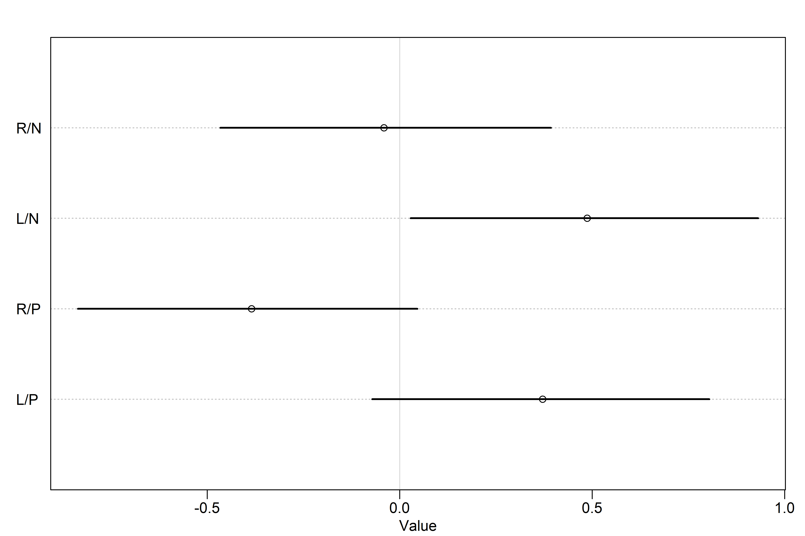

God Spiked the Integers
================

-   *Generalized Linear Models* (GLMs) are a lot like early mechanical
    computers — the moving pieces within (the parameters) interact to
    produce non-obvious predictions.
-   Understanding the parameters in GLMs will always involve more work
    than for Gaussian models, because of the transformation on the
    output scale.
-   GLMs let us model counts — two of the most common types of count
    models are *Binomial Regression*, which is useful for binary
    classification, and *Poisson Regression*, which is a special case of
    the binomial.

## 11.1 Binomial regression

$$
\begin{gather}
y \sim Binomial(n, p)
\end{gather}
$$

-   The binomial distribution is denoted above, where $y$ is a count on
    $[\ 0, \infty)$, $p$ is the probability that any particular “trial”
    is a success, and $n$ is the number of trials.
-   Two common flavors of binomial models are:
    1.  *Logistic Regression* — for single trial cases, when the outcome
        can only be 0 or 1
    2.  *Aggregated binomial regression* — for multi-trial cases, where
        the outcome can be any integer between 0 and $n$

### 11.1.1 Logistic regression: Prosocial chimpanzees

-   Consider an experiment where we want to test the social tendencies
    of chimpanzees. In the setup, the focal chimpanzee can pull a lever
    on the left to deliver food to himself or pull a lever on the right
    to deliver food to himself an another chimpanzee (see figure 11.2 on
    page 326).
-   If we set a variable to 1 when the chimpanzee pulls the left
    trigger, we can model this with a binomial model.

``` r
library(rethinking)
data("chimpanzees")
d <- chimpanzees

str(d)
```

    ## 'data.frame':    504 obs. of  8 variables:
    ##  $ actor       : int  1 1 1 1 1 1 1 1 1 1 ...
    ##  $ recipient   : int  NA NA NA NA NA NA NA NA NA NA ...
    ##  $ condition   : int  0 0 0 0 0 0 0 0 0 0 ...
    ##  $ block       : int  1 1 1 1 1 1 2 2 2 2 ...
    ##  $ trial       : int  2 4 6 8 10 12 14 16 18 20 ...
    ##  $ prosoc_left : int  0 0 1 0 1 1 1 1 0 0 ...
    ##  $ chose_prosoc: int  1 0 0 1 1 1 0 0 1 1 ...
    ##  $ pulled_left : int  0 1 0 0 1 1 0 0 0 0 ...

-   We want to infer what happens in each combination of `prosoc_left`
    and `condition`:
    1.  `prosoc_left = 0` and `condition = 0` : two food items on the
        right and no partner
    2.  `prosoc_left = 1` and `condition = 0` : two food items on the
        left and no partner
    3.  `prosoc_left = 0` and `condition = 1` : two food items on the
        right and partner present
    4.  `prosoc_left = 1` and `condition = 1` : two food items on the
        left and partner present

``` r
d$treatment <- 1 + d$prosoc_left + 2 * d$condition
xtabs( ~ treatment + prosoc_left + condition, d)
```

    ## , , condition = 0
    ## 
    ##          prosoc_left
    ## treatment   0   1
    ##         1 126   0
    ##         2   0 126
    ##         3   0   0
    ##         4   0   0
    ## 
    ## , , condition = 1
    ## 
    ##          prosoc_left
    ## treatment   0   1
    ##         1   0   0
    ##         2   0   0
    ##         3 126   0
    ##         4   0 126

-   Now each combination is an index in treatment. In mathematical form:

$$
\begin{gather}
L_i \sim Binomial(1, p_i) \\
logit(p_i) = \alpha_{ACTOR[i]} + \beta_{TREATMENT[i]} \\
\alpha_j \sim to \ be \ determined \\
\beta_k \sim to \ be \ determined 
\end{gather}
$$

-   Here, $L$ is the 0/1 variable for `pulled_left` and $\alpha_j$ is a
    parameter for each of the 7 chimpanzees. Alternatively, this could
    have been defined with a Bernoulli distribution:

$$
\begin{gather}
L_i \sim Bernoulli(p_i)
\end{gather}
$$

-   The TBD priors are a bit weird to work with for GLMs — let’s start
    off with a super simple example:

$$
\begin{gather}
L_i \sim Binomial(1, p_i) \\
logit(p_i) = \alpha \\
\alpha \sim Normal(0, \omega)
\end{gather}
$$

-   We’ll change up $\omega$ to see what happens. To start, we’ll
    illustrate the madness of flat priors with $\omega = 10$.

``` r
# model with wide prior
m11.1 <-
  quap(
    alist(pulled_left ~ dbinom(1, p),
          logit(p) <- a,
          a ~ dnorm(0, 10)),
    data = d
  )

# sample from the prior
set.seed(1999)
prior <- extract.prior(m11.1, n = 1e4)
p <- inv_logit(prior$a) # need to get the prior on the outcome scale!

# wonk!
dens(p, adj = 0.1)
```

<!-- -->

-   A flat prior in the logit space is not a flat prior in the
    probability space!
-   A *slightly* more regularized prior with $\omega = 1.5$ is more akin
    to what we want:

``` r
# model with better prior
m11.1a <-
  quap(
    alist(pulled_left ~ dbinom(1, p),
          logit(p) <- a,
          a ~ dnorm(0, 1.5)),
    data = d
  )

# sample from the prior
set.seed(1999)
prior <- extract.prior(m11.1a, n = 1e4)
p <- inv_logit(prior$a) # need to get the prior on the outcome scale!

# wonk!
dens(p, adj = 0.1)
```

<!-- -->

-   Now let’s do the same weirdness with unconventionally flat priors
    for the $\beta$ parameters, just to drive this home.

``` r
# model with bad priors on treatment
m11.2 <-
  quap(
    alist(pulled_left ~ dbinom(1, p),
          logit(p) <- a + b[treatment],
          a ~ dnorm(0, 1.5),
          b[treatment] ~ dnorm(0, 10)),
    data = d
  )

# extract priors
set.seed(1999)
prior <- extract.prior(m11.2, n = 1e4)
p <- sapply(1:4, function(k) inv_logit(prior$a + prior$b[,k]))

# plot the *difference* between treatments 1 and 2:
dens(abs(p[,1] - p[,2]), adj = 0.1)
```

<!-- -->

-   Again, the flat prior means that the model believes that the
    treatments are either completely alike or completely different,
    which is not necessarily what we think!
-   Changing to a $\beta_j \sim Normal(0, 0.5)$ prior results in priors
    outcome that a difference of 0 is the highest prior probability, and
    the average is about 10%

``` r
# model with better priors for alpha and beta
m11.3 <-
  quap(
    alist(pulled_left ~ dbinom(1, p),
          logit(p) <- a + b[treatment],
          a ~ dnorm(0, 1.5),
          b[treatment] ~ dnorm(0, 0.5)),
    data = d
  )

# extract priors
set.seed(1999)
prior <- extract.prior(m11.3, n = 1e4)
p <- sapply(1:4, function(k) inv_logit(prior$a + prior$b[,k]))

# return the average prior difference between treatments 1 and 2:
mean(abs(p[,1] - p[,2]))
```

    ## [1] 0.09838663

``` r
# plot!
dens(abs(p[,1] - p[,2]), adj = 0.1)
```

<!-- -->

-   This makes sense, because it’s the *difference* in treatment effect.
-   Each treatment runs relatively evenly between 0 and 1, so *on
    average* the difference is likelier to be small (it’s more likely
    that each is somewhere in the middle rather than being on opposite
    ends).

``` r
# prep data for ulam
dat_list <-
  list(
    pulled_left = d$pulled_left,
    actor = d$actor,
    treatment = as.integer(d$treatment)
  )

# model! 
# log_lik = TRUE will have ulam() compute the values necessary for PSIS/WAIC
m11.4 <-
  ulam(
    alist(pulled_left ~ dbinom(1, p),
          logit(p) <- a[actor] + b[treatment],
          a[actor] ~ dnorm(0, 1.5),
          b[treatment] ~ dnorm(0, 0.5)),
    data = dat_list,
    chains = 4,
    log_lik = TRUE
  )
```

    ## Running MCMC with 4 sequential chains, with 1 thread(s) per chain...
    ## 
    ## Chain 1 Iteration:   1 / 1000 [  0%]  (Warmup) 
    ## Chain 1 Iteration: 100 / 1000 [ 10%]  (Warmup) 
    ## Chain 1 Iteration: 200 / 1000 [ 20%]  (Warmup) 
    ## Chain 1 Iteration: 300 / 1000 [ 30%]  (Warmup) 
    ## Chain 1 Iteration: 400 / 1000 [ 40%]  (Warmup) 
    ## Chain 1 Iteration: 500 / 1000 [ 50%]  (Warmup) 
    ## Chain 1 Iteration: 501 / 1000 [ 50%]  (Sampling) 
    ## Chain 1 Iteration: 600 / 1000 [ 60%]  (Sampling) 
    ## Chain 1 Iteration: 700 / 1000 [ 70%]  (Sampling) 
    ## Chain 1 Iteration: 800 / 1000 [ 80%]  (Sampling) 
    ## Chain 1 Iteration: 900 / 1000 [ 90%]  (Sampling) 
    ## Chain 1 Iteration: 1000 / 1000 [100%]  (Sampling) 
    ## Chain 1 finished in 3.8 seconds.
    ## Chain 2 Iteration:   1 / 1000 [  0%]  (Warmup) 
    ## Chain 2 Iteration: 100 / 1000 [ 10%]  (Warmup) 
    ## Chain 2 Iteration: 200 / 1000 [ 20%]  (Warmup) 
    ## Chain 2 Iteration: 300 / 1000 [ 30%]  (Warmup) 
    ## Chain 2 Iteration: 400 / 1000 [ 40%]  (Warmup) 
    ## Chain 2 Iteration: 500 / 1000 [ 50%]  (Warmup) 
    ## Chain 2 Iteration: 501 / 1000 [ 50%]  (Sampling) 
    ## Chain 2 Iteration: 600 / 1000 [ 60%]  (Sampling) 
    ## Chain 2 Iteration: 700 / 1000 [ 70%]  (Sampling) 
    ## Chain 2 Iteration: 800 / 1000 [ 80%]  (Sampling) 
    ## Chain 2 Iteration: 900 / 1000 [ 90%]  (Sampling) 
    ## Chain 2 Iteration: 1000 / 1000 [100%]  (Sampling) 
    ## Chain 2 finished in 3.5 seconds.
    ## Chain 3 Iteration:   1 / 1000 [  0%]  (Warmup) 
    ## Chain 3 Iteration: 100 / 1000 [ 10%]  (Warmup) 
    ## Chain 3 Iteration: 200 / 1000 [ 20%]  (Warmup) 
    ## Chain 3 Iteration: 300 / 1000 [ 30%]  (Warmup) 
    ## Chain 3 Iteration: 400 / 1000 [ 40%]  (Warmup) 
    ## Chain 3 Iteration: 500 / 1000 [ 50%]  (Warmup) 
    ## Chain 3 Iteration: 501 / 1000 [ 50%]  (Sampling) 
    ## Chain 3 Iteration: 600 / 1000 [ 60%]  (Sampling) 
    ## Chain 3 Iteration: 700 / 1000 [ 70%]  (Sampling) 
    ## Chain 3 Iteration: 800 / 1000 [ 80%]  (Sampling) 
    ## Chain 3 Iteration: 900 / 1000 [ 90%]  (Sampling) 
    ## Chain 3 Iteration: 1000 / 1000 [100%]  (Sampling) 
    ## Chain 3 finished in 3.7 seconds.
    ## Chain 4 Iteration:   1 / 1000 [  0%]  (Warmup) 
    ## Chain 4 Iteration: 100 / 1000 [ 10%]  (Warmup) 
    ## Chain 4 Iteration: 200 / 1000 [ 20%]  (Warmup) 
    ## Chain 4 Iteration: 300 / 1000 [ 30%]  (Warmup) 
    ## Chain 4 Iteration: 400 / 1000 [ 40%]  (Warmup) 
    ## Chain 4 Iteration: 500 / 1000 [ 50%]  (Warmup) 
    ## Chain 4 Iteration: 501 / 1000 [ 50%]  (Sampling) 
    ## Chain 4 Iteration: 600 / 1000 [ 60%]  (Sampling) 
    ## Chain 4 Iteration: 700 / 1000 [ 70%]  (Sampling) 
    ## Chain 4 Iteration: 800 / 1000 [ 80%]  (Sampling) 
    ## Chain 4 Iteration: 900 / 1000 [ 90%]  (Sampling) 
    ## Chain 4 Iteration: 1000 / 1000 [100%]  (Sampling) 
    ## Chain 4 finished in 3.3 seconds.
    ## 
    ## All 4 chains finished successfully.
    ## Mean chain execution time: 3.6 seconds.
    ## Total execution time: 15.6 seconds.

``` r
# posterior parameter estimations
precis(m11.4, depth = 2)
```

    ##             mean        sd        5.5%       94.5%     n_eff     Rhat4
    ## a[1] -0.44980706 0.3139821 -0.92451657  0.05750894  751.5753 1.0028090
    ## a[2]  3.90740284 0.7538153  2.81275470  5.19920580 1116.3178 1.0017326
    ## a[3] -0.75910512 0.3233431 -1.26333640 -0.23774445  784.4718 1.0005620
    ## a[4] -0.75177396 0.3254611 -1.27921005 -0.22778914  697.3081 1.0021056
    ## a[5] -0.44661271 0.3216998 -0.96673022  0.05557138  694.0721 1.0025012
    ## a[6]  0.47361480 0.3275634 -0.04112770  1.00740750  709.2511 0.9995079
    ## a[7]  1.96755274 0.4227796  1.31846020  2.68217590  964.1751 0.9984666
    ## b[1] -0.04099327 0.2735485 -0.46622989  0.39314257  640.7081 0.9994378
    ## b[2]  0.48699046 0.2759573  0.02829271  0.93107828  650.7775 1.0009767
    ## b[3] -0.38451436 0.2752398 -0.83566229  0.04590361  566.9048 1.0002082
    ## b[4]  0.37136420 0.2712957 -0.07175438  0.80449968  693.3715 1.0014881

``` r
# plot parameters:
post <- extract.samples(m11.4)
p_left <- inv_logit(post$a)
precis_plot(precis(as.data.frame(p_left)), xlim = c(0, 1))
```

<!-- -->

-   Here each row is a chimpanzee. Chimps 1, 3, 4, and 5 show a
    preference for the right lever. 2 and 7 show a preference for the
    left, with 2 preferring it greatly.
-   Having repeat measurements per actor (chimp), is useful for
    subtracting out this chimp-level preference to isolate the treatment
    effect.

``` r
# plot posterior treatment
labs <- c("R/N", "L/N", "R/P", "L/P")
precis_plot(precis(m11.4, depth = 2, pars = "b"), labels = labs)
```

<!-- -->

-   Here, “L/N” means “prosocial on left, no partner” and “R/P” means
    “prosocial on right/partner.”
-   We’re looking to see if chimpanzees choose the prosocial option when
    a partner is present, so we ought to compare the first/third row and
    the second/fourth row:

``` r
diffs <-
  list(
    db13 = post$b[,1] - post$b[,3],
    db24 = post$b[,2] - post$b[,4]
  )

precis_plot(precis(diffs))
```

<!-- -->

-   Here, there is weak evidence of the pulling the prosocial choice on
    the right when the partner is present, but the interval is pretty
    wide.
-   There is pretty negligible evidence for pulling the prosocial choice
    when the option is on the left (if anything, they choose the
    prosocial option when the partner is absent!)
-   Let’s compare the proportion each chimp actually pulled the left
    lever with the model’s posterior predictions.

``` r
pl <- by(d$pulled_left, list(d$actor, d$treatment), mean)

# proportion of pulling left under each treatment for chimp 1:
pl[1,]
```

    ##         1         2         3         4 
    ## 0.3333333 0.5000000 0.2777778 0.5555556

``` r
# plot proportions:
plot(NULL, 
     xlim = c(1, 28),
     ylim = c(0, 1),
     xlab = "",
     ylab = "proportion left lever",
     xaxt = "n",
     yaxt = "n")

axis(2, 
     at = c(0, 0.5, 1),
     labels = c(0, 0.5, 1))

abline(h = 0.5,
       lty = 2)

for (j in 1:7) abline(y = (j - 1)*4 + 4.5, lwd = 0.5)
for (j in 1:7) text((j - 1)*4 + 2.5, 1.1, concat("actor ", j), xpd = TRUE)
for (j in (1:7)[-2]) {
  lines((j - 1)*4 + c(1, 3), pl[j, c(1, 3)], lwd = 2, col = rangi2)
  lines((j - 1)*4 + c(2, 4), pl[j, c(2, 4)], lwd = 2, col = rangi2)
}

points(1:28, t(pl), pch = 16, col = "white", cex = 1.7)
points(1:28, t(pl), pch = c(1, 1, 16, 16), col = rangi2, lwd = 2)

yoff <- 0.01
text(1, pl[1, 1] - yoff, "R/N", pos = 1, cex = 0.8)
text(2, pl[1, 2] + yoff, "L/N", pos = 3, cex = 0.8)
text(3, pl[1, 3] - yoff, "R/P", pos = 1, cex = 0.8)
text(4, pl[1, 4] + yoff, "L/P", pos = 3, cex = 0.8)
```

<!-- -->

``` r
# posterior predictions
# see figure 11.4 on page 333 for the actual plot lol
dat <- list(actor = rep(1:7, each = 4), treatment = rep(1:4, times = 7))
p_post <- link(m11.4, data = dat)
p_mu <- apply(p_post, 2, mean)
p_ci <- apply(p_post, 2, PI)
```

-   There doesn’t seem to be any much evidence of the prosocial option
    being chosen more when a partner is present, but to test it out
    explicitly, let’s build a model with an interaction effect.
-   The simpler model will likely do just fine, because we don’t expect
    to see an interaction:

``` r
# prep new vars
d$side <- d$prosoc_left + 1 # right 1, left 2
d$cond <- d$condition + 1 # no partner 1, partner 2

# prep new list for ulam
dat_list2 <-
  list(pulled_left = d$pulled_left,
       actor = d$actor,
       side = d$side,
       cond = d$cond)

# model
m11.5 <- 
  ulam(
    alist(pulled_left ~ dbinom(1, p),
          logit(p) <- a[actor] + bs[side] + bc[cond],
          a[actor] ~ dnorm(0, 1.5),
          bs[side] ~ dnorm(0, 0.5),
          bc[cond] ~ dnorm(0, 0.5)),
    data = dat_list2,
    chains = 4,
    log_lik = TRUE
  )
```

    ## Running MCMC with 4 sequential chains, with 1 thread(s) per chain...
    ## 
    ## Chain 1 Iteration:   1 / 1000 [  0%]  (Warmup) 
    ## Chain 1 Iteration: 100 / 1000 [ 10%]  (Warmup) 
    ## Chain 1 Iteration: 200 / 1000 [ 20%]  (Warmup) 
    ## Chain 1 Iteration: 300 / 1000 [ 30%]  (Warmup) 
    ## Chain 1 Iteration: 400 / 1000 [ 40%]  (Warmup) 
    ## Chain 1 Iteration: 500 / 1000 [ 50%]  (Warmup) 
    ## Chain 1 Iteration: 501 / 1000 [ 50%]  (Sampling) 
    ## Chain 1 Iteration: 600 / 1000 [ 60%]  (Sampling) 
    ## Chain 1 Iteration: 700 / 1000 [ 70%]  (Sampling) 
    ## Chain 1 Iteration: 800 / 1000 [ 80%]  (Sampling) 
    ## Chain 1 Iteration: 900 / 1000 [ 90%]  (Sampling) 
    ## Chain 1 Iteration: 1000 / 1000 [100%]  (Sampling) 
    ## Chain 1 finished in 5.5 seconds.
    ## Chain 2 Iteration:   1 / 1000 [  0%]  (Warmup) 
    ## Chain 2 Iteration: 100 / 1000 [ 10%]  (Warmup) 
    ## Chain 2 Iteration: 200 / 1000 [ 20%]  (Warmup) 
    ## Chain 2 Iteration: 300 / 1000 [ 30%]  (Warmup) 
    ## Chain 2 Iteration: 400 / 1000 [ 40%]  (Warmup) 
    ## Chain 2 Iteration: 500 / 1000 [ 50%]  (Warmup) 
    ## Chain 2 Iteration: 501 / 1000 [ 50%]  (Sampling) 
    ## Chain 2 Iteration: 600 / 1000 [ 60%]  (Sampling) 
    ## Chain 2 Iteration: 700 / 1000 [ 70%]  (Sampling) 
    ## Chain 2 Iteration: 800 / 1000 [ 80%]  (Sampling) 
    ## Chain 2 Iteration: 900 / 1000 [ 90%]  (Sampling) 
    ## Chain 2 Iteration: 1000 / 1000 [100%]  (Sampling) 
    ## Chain 2 finished in 4.8 seconds.
    ## Chain 3 Iteration:   1 / 1000 [  0%]  (Warmup) 
    ## Chain 3 Iteration: 100 / 1000 [ 10%]  (Warmup) 
    ## Chain 3 Iteration: 200 / 1000 [ 20%]  (Warmup) 
    ## Chain 3 Iteration: 300 / 1000 [ 30%]  (Warmup) 
    ## Chain 3 Iteration: 400 / 1000 [ 40%]  (Warmup) 
    ## Chain 3 Iteration: 500 / 1000 [ 50%]  (Warmup) 
    ## Chain 3 Iteration: 501 / 1000 [ 50%]  (Sampling) 
    ## Chain 3 Iteration: 600 / 1000 [ 60%]  (Sampling) 
    ## Chain 3 Iteration: 700 / 1000 [ 70%]  (Sampling) 
    ## Chain 3 Iteration: 800 / 1000 [ 80%]  (Sampling) 
    ## Chain 3 Iteration: 900 / 1000 [ 90%]  (Sampling) 
    ## Chain 3 Iteration: 1000 / 1000 [100%]  (Sampling) 
    ## Chain 3 finished in 4.2 seconds.
    ## Chain 4 Iteration:   1 / 1000 [  0%]  (Warmup) 
    ## Chain 4 Iteration: 100 / 1000 [ 10%]  (Warmup) 
    ## Chain 4 Iteration: 200 / 1000 [ 20%]  (Warmup) 
    ## Chain 4 Iteration: 300 / 1000 [ 30%]  (Warmup) 
    ## Chain 4 Iteration: 400 / 1000 [ 40%]  (Warmup) 
    ## Chain 4 Iteration: 500 / 1000 [ 50%]  (Warmup) 
    ## Chain 4 Iteration: 501 / 1000 [ 50%]  (Sampling) 
    ## Chain 4 Iteration: 600 / 1000 [ 60%]  (Sampling) 
    ## Chain 4 Iteration: 700 / 1000 [ 70%]  (Sampling) 
    ## Chain 4 Iteration: 800 / 1000 [ 80%]  (Sampling) 
    ## Chain 4 Iteration: 900 / 1000 [ 90%]  (Sampling) 
    ## Chain 4 Iteration: 1000 / 1000 [100%]  (Sampling) 
    ## Chain 4 finished in 4.4 seconds.
    ## 
    ## All 4 chains finished successfully.
    ## Mean chain execution time: 4.7 seconds.
    ## Total execution time: 20.1 seconds.

``` r
# finally, compare models w/PSIS
compare(m11.5, m11.4, func = PSIS)
```

    ##           PSIS       SE    dPSIS      dSE    pPSIS    weight
    ## m11.5 530.4818 19.09699 0.000000       NA 7.637648 0.6786693
    ## m11.4 531.9772 19.01157 1.495326 1.264601 8.404094 0.3213307

-   The modle comparison here is for the sake of understanding, but the
    experiment + hypothesis tell us which model to use (`m11.4`), this
    comparison just lets us know that `m11.5` doesn’t add a whole lot.

``` r
# follow along with the overthinking box on pages 334-336
post <- extract.samples(m11.4, clean = FALSE) # clean = FALSE returns the log-probability
str(post)
```

    ## List of 5
    ##  $ a      : num [1:2000, 1:7] 0.234 -0.348 -0.456 -0.444 -0.73 ...
    ##  $ b      : num [1:2000, 1:4] -0.3065 0.2728 0.2321 -0.1591 0.0697 ...
    ##  $ log_lik: num [1:2000, 1:504] -0.657 -0.656 -0.588 -0.437 -0.416 ...
    ##  $ p      : num [1:2000, 1:504] 0.482 0.481 0.444 0.354 0.341 ...
    ##  $ lp__   : num [1:2000(1d)] -267 -269 -265 -265 -268 ...
    ##  - attr(*, "source")= chr "ulam posterior: 2000 samples from object"

``` r
stancode(m11.4)
```

    ## data{
    ##     int pulled_left[504];
    ##     int treatment[504];
    ##     int actor[504];
    ## }
    ## parameters{
    ##     vector[7] a;
    ##     vector[4] b;
    ## }
    ## model{
    ##     vector[504] p;
    ##     b ~ normal( 0 , 0.5 );
    ##     a ~ normal( 0 , 1.5 );
    ##     for ( i in 1:504 ) {
    ##         p[i] = a[actor[i]] + b[treatment[i]];
    ##         p[i] = inv_logit(p[i]);
    ##     }
    ##     pulled_left ~ binomial( 1 , p );
    ## }
    ## generated quantities{
    ##     vector[504] log_lik;
    ##     vector[504] p;
    ##     for ( i in 1:504 ) {
    ##         p[i] = a[actor[i]] + b[treatment[i]];
    ##         p[i] = inv_logit(p[i]);
    ##     }
    ##     for ( i in 1:504 ) log_lik[i] = binomial_lpmf( pulled_left[i] | 1 , p[i] );
    ## }
