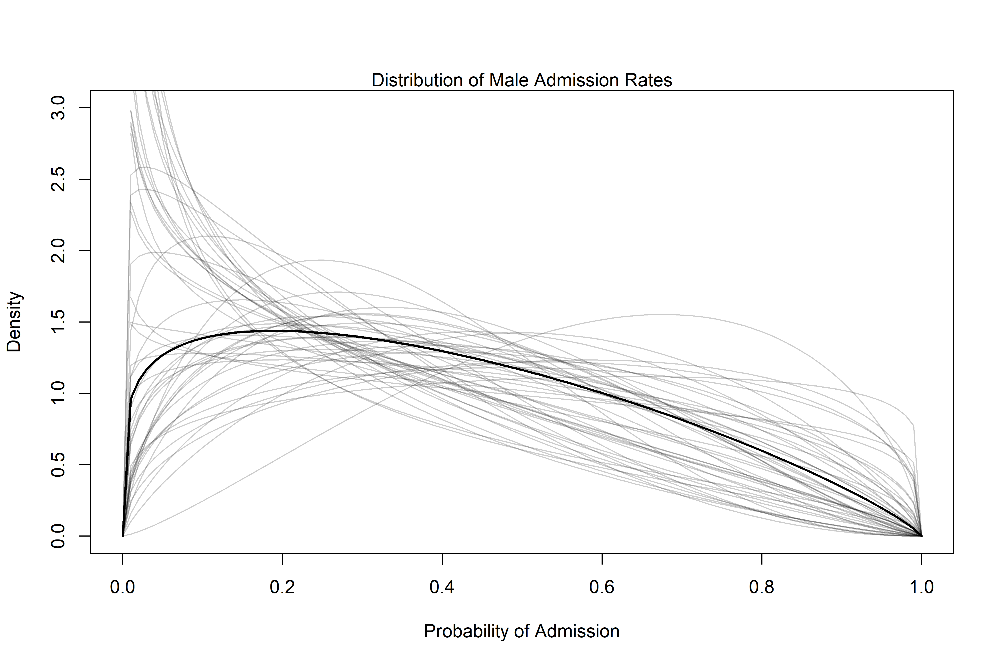

Monsters and Mixtures
================

-   This chapter is all about constructing hybrid statistical models by
    piecing together smipler components of previous chapters.
-   There are three common and useful examples:
    1.  **Over-dispersion**: extensions of binomial and Poisson models
        to cope with unmeasured sources of variation.
    2.  **Zero-inlated/zero-augmented models**: mixes a binary event
        with an ordinary GLM.
    3.  **Ordered categorical models**: like the name suggests, models
        where the outcome has an implied order to the categories.
-   This is not an exhaustive list! There are many more.

## 12.1 Over-dispersed counts

-   Earlier, “outliers” in normal models were able to be dealt with the
    student-t likelihood, which is a mixture of normal likelihoods. We
    can do something similar in count models!
-   When counts are more variable than a pure process, they exhibit
    *over-dispersion*.
-   For example, the expected value of a binomial process is $Np$ and
    the variance/dispersion is $Np(1 - p)$.
-   When the observed variance exceeds this (after conditioning on
    variables) it implies that some omitted variable is producing
    additional dispersion!
-   The best solution would be to be able to discover the source of
    dispersion and include it in the model, but that often isn’t
    possible. Even without, however, we can mitigate the effects of
    over-dispersion.
-   We’ll consider *continuous mixture* models where the linear model
    isn’t attached to the observations themselves but instead to a
    distribution of observations.

### 12.1.1 Beta-binomial

-   A *beta-binomial* model is a mixture of binomial distributions that
    assumes each binomial count has its own probability of success.
-   The beta distribution can be used to describe a distribution of
    probabilities — this also makes the math easier, since it’s the
    conjugate pair for the binomial.

``` r
library(rethinking)

beta_plot <- function(pbar, theta) {
  
  curve(dbeta2(x, pbar, theta),
        from = 0,
        to = 1,
        xlab = "probability",
        ylab = "density")
  
}

beta_plot(0.5, 5)
```

<!-- -->

``` r
beta_plot(0.8, 10)
```

<!-- -->

-   Let’s build out a model for `UCBadmit`, where the admission rate is
    modeled purely on gender.

$$
\begin{gather}
A_i \sim BetaBinomial(N_i, \overline{p_i}, \theta) \\
logit(\overline{p_i}) = \alpha_{GID[i]} \\
\alpha_j \sim Normal(0, 1.5) \\
\theta = \phi + 2 \\ 
\phi \sim Exponential(1)
\end{gather}
$$

``` r
# load data
data("UCBadmit")
d <- UCBadmit

# prep for stan
d$gid <- ifelse(d$applicant.gender == "male", 1L, 2L)
dat <- list(A = d$admit, N = d$applications, gid = d$gid)

# model!
m12.1 <- 
  ulam(
    alist(A ~ dbetabinom(N, pbar, theta),
          logit(pbar) <- a[gid],
          a[gid] ~ dnorm(0, 1.5),
          transpars> theta <<- phi + 2.0,
          phi ~ dexp(1)),
    data = dat,
    chains = 4
  )
```

    ## Running MCMC with 4 sequential chains, with 1 thread(s) per chain...
    ## 
    ## Chain 1 Iteration:   1 / 1000 [  0%]  (Warmup) 
    ## Chain 1 Iteration: 100 / 1000 [ 10%]  (Warmup) 
    ## Chain 1 Iteration: 200 / 1000 [ 20%]  (Warmup) 
    ## Chain 1 Iteration: 300 / 1000 [ 30%]  (Warmup) 
    ## Chain 1 Iteration: 400 / 1000 [ 40%]  (Warmup) 
    ## Chain 1 Iteration: 500 / 1000 [ 50%]  (Warmup) 
    ## Chain 1 Iteration: 501 / 1000 [ 50%]  (Sampling) 
    ## Chain 1 Iteration: 600 / 1000 [ 60%]  (Sampling) 
    ## Chain 1 Iteration: 700 / 1000 [ 70%]  (Sampling) 
    ## Chain 1 Iteration: 800 / 1000 [ 80%]  (Sampling) 
    ## Chain 1 Iteration: 900 / 1000 [ 90%]  (Sampling) 
    ## Chain 1 Iteration: 1000 / 1000 [100%]  (Sampling) 
    ## Chain 1 finished in 0.2 seconds.
    ## Chain 2 Iteration:   1 / 1000 [  0%]  (Warmup) 
    ## Chain 2 Iteration: 100 / 1000 [ 10%]  (Warmup) 
    ## Chain 2 Iteration: 200 / 1000 [ 20%]  (Warmup) 
    ## Chain 2 Iteration: 300 / 1000 [ 30%]  (Warmup) 
    ## Chain 2 Iteration: 400 / 1000 [ 40%]  (Warmup) 
    ## Chain 2 Iteration: 500 / 1000 [ 50%]  (Warmup) 
    ## Chain 2 Iteration: 501 / 1000 [ 50%]  (Sampling) 
    ## Chain 2 Iteration: 600 / 1000 [ 60%]  (Sampling) 
    ## Chain 2 Iteration: 700 / 1000 [ 70%]  (Sampling) 
    ## Chain 2 Iteration: 800 / 1000 [ 80%]  (Sampling) 
    ## Chain 2 Iteration: 900 / 1000 [ 90%]  (Sampling) 
    ## Chain 2 Iteration: 1000 / 1000 [100%]  (Sampling) 
    ## Chain 2 finished in 0.2 seconds.
    ## Chain 3 Iteration:   1 / 1000 [  0%]  (Warmup) 
    ## Chain 3 Iteration: 100 / 1000 [ 10%]  (Warmup) 
    ## Chain 3 Iteration: 200 / 1000 [ 20%]  (Warmup) 
    ## Chain 3 Iteration: 300 / 1000 [ 30%]  (Warmup) 
    ## Chain 3 Iteration: 400 / 1000 [ 40%]  (Warmup) 
    ## Chain 3 Iteration: 500 / 1000 [ 50%]  (Warmup) 
    ## Chain 3 Iteration: 501 / 1000 [ 50%]  (Sampling) 
    ## Chain 3 Iteration: 600 / 1000 [ 60%]  (Sampling) 
    ## Chain 3 Iteration: 700 / 1000 [ 70%]  (Sampling) 
    ## Chain 3 Iteration: 800 / 1000 [ 80%]  (Sampling) 
    ## Chain 3 Iteration: 900 / 1000 [ 90%]  (Sampling) 
    ## Chain 3 Iteration: 1000 / 1000 [100%]  (Sampling) 
    ## Chain 3 finished in 0.3 seconds.
    ## Chain 4 Iteration:   1 / 1000 [  0%]  (Warmup) 
    ## Chain 4 Iteration: 100 / 1000 [ 10%]  (Warmup) 
    ## Chain 4 Iteration: 200 / 1000 [ 20%]  (Warmup) 
    ## Chain 4 Iteration: 300 / 1000 [ 30%]  (Warmup) 
    ## Chain 4 Iteration: 400 / 1000 [ 40%]  (Warmup) 
    ## Chain 4 Iteration: 500 / 1000 [ 50%]  (Warmup) 
    ## Chain 4 Iteration: 501 / 1000 [ 50%]  (Sampling) 
    ## Chain 4 Iteration: 600 / 1000 [ 60%]  (Sampling) 
    ## Chain 4 Iteration: 700 / 1000 [ 70%]  (Sampling) 
    ## Chain 4 Iteration: 800 / 1000 [ 80%]  (Sampling) 
    ## Chain 4 Iteration: 900 / 1000 [ 90%]  (Sampling) 
    ## Chain 4 Iteration: 1000 / 1000 [100%]  (Sampling) 
    ## Chain 4 finished in 0.2 seconds.
    ## 
    ## All 4 chains finished successfully.
    ## Mean chain execution time: 0.2 seconds.
    ## Total execution time: 1.7 seconds.

-   Here, McElreath added `transpars>` (transformed parameters) so that
    Stan will return `theta` in the samples.

``` r
post <- extract.samples(m12.1) 
post$da <- post$a[,1] - post$a[,2]
precis(post, depth = 2)
```

    ##             mean        sd       5.5%     94.5%      histogram
    ## a[1]  -0.4420148 0.3979151 -1.0868850 0.1812110 ▁▁▁▂▃▅▇▇▅▂▁▁▁▁
    ## a[2]  -0.3154094 0.4056810 -0.9964372 0.2982597        ▁▁▃▇▃▁▁
    ## phi    1.0205078 0.8217415  0.0915374 2.5799573   ▇▇▅▂▁▁▁▁▁▁▁▁
    ## theta  3.0205078 0.8217415  2.0915348 4.5799573   ▇▇▅▂▁▁▁▁▁▁▁▁
    ## da    -0.1266054 0.5766707 -1.0393172 0.7950266       ▁▁▅▇▇▂▁▁

-   Here, `a[1]` and `a[2]` are the log-odds of admission for
    male/female applicants. The difference between the two, `da` is
    highly uncertain and basically centered around 0.
-   In the previous chapter, a binomial model for these data that
    omitted department ended up being misleading, since there’s an
    indirect path from gender to admission through department. Here, the
    model is not confounded, despite not containing the department
    variable! How?
-   The beta-binomial model allows each row to have its own unobserved
    intercept:

``` r
ucb_beta <- function(gid) {
  
  # draw posterior mean beta distribution
  curve(dbeta2(x, mean(logistic(post$a[,gid])), mean(post$theta)),
        from = 0, 
        to = 1,
        ylab = "Density",
        xlab = "Probability of Admission",
        ylim = c(0, 3),
        lwd = 2)
  
  # draw 50 samples from the posterior
  for (i in 1:50) {
    
    p <- logistic(post$a[i, gid])
    theta <- post$theta[i]
    curve(dbeta2(x, p, theta),
          add = TRUE,
          col = col.alpha("black", 0.2))
    
  }
  
  if (gid == 1) gender <- "Male" else gender <- "Female"
  
  mtext(paste("Distribution of", gender, "Admission Rates"))
  
}

ucb_beta(1)
```

<!-- -->

``` r
ucb_beta(2)
```

<!-- -->

``` r
postcheck(m12.1)
```

<!-- -->

### 12.1.2 Negative-binomial or Gamma-Poisson

-   A *negative-binomial* model is more usefully described as a
    *gamma-Poisson* model and assumes that each Poisson count
    observation has its own rate.
-   This is similar to the beta-binomial model, where the beta
    distribution describes a distribution of probabilities and the gamma
    distribution describes a distribution of rates (+ the conjugate
    pairing makes the math easier).
-   A gamma-Poisson distribution has two terms — one for the mean rate,
    $\lambda$ and another for the dispersion/scale of the rates, $\phi$.

$$
\begin{gather}
y_i \sim \text{Gamma-Poisson}(\lambda_i, \phi)
\end{gather}
$$

-   Here, the variance is described by
    $\lambda + \frac{\lambda^2}{\phi}$, so larger values for $\phi$ mean
    the distribution is more similar to a pure Poisson process.
-   Let’s look back at the island civilization tool model:

``` r
# load and prep data for stan
data("Kline")
d <- Kline
d$P <- standardize(log(d$population))
d$contact_id <- ifelse(d$contact == "high", 2L, 1L)

dat2 <-
  list(
    tools = d$total_tools,
    P = d$population,
    cid = d$contact_id
  )

# model!
m12.2 <- ulam(
  alist(tools ~ dgampois(lambda, phi),
        lambda <- exp(a[cid]) * P^b[cid]/g,
        a[cid] ~ dnorm(1, 1),
        b[cid] ~ dexp(1),
        g ~ dexp(1),
        phi ~ dexp(1)),
  data = dat2,
  chains = 4, 
  log_lik = TRUE
)
```

    ## Running MCMC with 4 sequential chains, with 1 thread(s) per chain...
    ## 
    ## Chain 1 Iteration:   1 / 1000 [  0%]  (Warmup) 
    ## Chain 1 Iteration: 100 / 1000 [ 10%]  (Warmup) 
    ## Chain 1 Iteration: 200 / 1000 [ 20%]  (Warmup) 
    ## Chain 1 Iteration: 300 / 1000 [ 30%]  (Warmup) 
    ## Chain 1 Iteration: 400 / 1000 [ 40%]  (Warmup) 
    ## Chain 1 Iteration: 500 / 1000 [ 50%]  (Warmup) 
    ## Chain 1 Iteration: 501 / 1000 [ 50%]  (Sampling) 
    ## Chain 1 Iteration: 600 / 1000 [ 60%]  (Sampling) 
    ## Chain 1 Iteration: 700 / 1000 [ 70%]  (Sampling) 
    ## Chain 1 Iteration: 800 / 1000 [ 80%]  (Sampling) 
    ## Chain 1 Iteration: 900 / 1000 [ 90%]  (Sampling) 
    ## Chain 1 Iteration: 1000 / 1000 [100%]  (Sampling) 
    ## Chain 1 finished in 0.5 seconds.
    ## Chain 2 Iteration:   1 / 1000 [  0%]  (Warmup) 
    ## Chain 2 Iteration: 100 / 1000 [ 10%]  (Warmup) 
    ## Chain 2 Iteration: 200 / 1000 [ 20%]  (Warmup) 
    ## Chain 2 Iteration: 300 / 1000 [ 30%]  (Warmup) 
    ## Chain 2 Iteration: 400 / 1000 [ 40%]  (Warmup) 
    ## Chain 2 Iteration: 500 / 1000 [ 50%]  (Warmup) 
    ## Chain 2 Iteration: 501 / 1000 [ 50%]  (Sampling) 
    ## Chain 2 Iteration: 600 / 1000 [ 60%]  (Sampling) 
    ## Chain 2 Iteration: 700 / 1000 [ 70%]  (Sampling) 
    ## Chain 2 Iteration: 800 / 1000 [ 80%]  (Sampling) 
    ## Chain 2 Iteration: 900 / 1000 [ 90%]  (Sampling) 
    ## Chain 2 Iteration: 1000 / 1000 [100%]  (Sampling) 
    ## Chain 2 finished in 0.5 seconds.
    ## Chain 3 Iteration:   1 / 1000 [  0%]  (Warmup) 
    ## Chain 3 Iteration: 100 / 1000 [ 10%]  (Warmup) 
    ## Chain 3 Iteration: 200 / 1000 [ 20%]  (Warmup) 
    ## Chain 3 Iteration: 300 / 1000 [ 30%]  (Warmup) 
    ## Chain 3 Iteration: 400 / 1000 [ 40%]  (Warmup) 
    ## Chain 3 Iteration: 500 / 1000 [ 50%]  (Warmup) 
    ## Chain 3 Iteration: 501 / 1000 [ 50%]  (Sampling) 
    ## Chain 3 Iteration: 600 / 1000 [ 60%]  (Sampling) 
    ## Chain 3 Iteration: 700 / 1000 [ 70%]  (Sampling) 
    ## Chain 3 Iteration: 800 / 1000 [ 80%]  (Sampling) 
    ## Chain 3 Iteration: 900 / 1000 [ 90%]  (Sampling) 
    ## Chain 3 Iteration: 1000 / 1000 [100%]  (Sampling) 
    ## Chain 3 finished in 0.4 seconds.
    ## Chain 4 Iteration:   1 / 1000 [  0%]  (Warmup) 
    ## Chain 4 Iteration: 100 / 1000 [ 10%]  (Warmup) 
    ## Chain 4 Iteration: 200 / 1000 [ 20%]  (Warmup) 
    ## Chain 4 Iteration: 300 / 1000 [ 30%]  (Warmup) 
    ## Chain 4 Iteration: 400 / 1000 [ 40%]  (Warmup) 
    ## Chain 4 Iteration: 500 / 1000 [ 50%]  (Warmup) 
    ## Chain 4 Iteration: 501 / 1000 [ 50%]  (Sampling) 
    ## Chain 4 Iteration: 600 / 1000 [ 60%]  (Sampling) 
    ## Chain 4 Iteration: 700 / 1000 [ 70%]  (Sampling) 
    ## Chain 4 Iteration: 800 / 1000 [ 80%]  (Sampling) 
    ## Chain 4 Iteration: 900 / 1000 [ 90%]  (Sampling) 
    ## Chain 4 Iteration: 1000 / 1000 [100%]  (Sampling) 
    ## Chain 4 finished in 0.5 seconds.
    ## 
    ## All 4 chains finished successfully.
    ## Mean chain execution time: 0.5 seconds.
    ## Total execution time: 2.5 seconds.

``` r
precis(m12.2, depth = 2)
```

    ##           mean         sd        5.5%     94.5%     n_eff     Rhat4
    ## a[1] 0.9460800 0.82233516 -0.33911356 2.2755665  933.6561 0.9995377
    ## a[2] 1.0078956 0.96182294 -0.51841474 2.5480037 1056.8075 1.0015906
    ## b[1] 0.2463654 0.09511725  0.09746376 0.4013604  506.8810 1.0070448
    ## b[2] 0.2699631 0.13007630  0.06422481 0.4857704  669.9433 1.0104508
    ## g    1.0733141 0.82329378  0.21412897 2.6568226  712.3243 1.0047303
    ## phi  3.6715685 1.58022439  1.62135355 6.4959518 1403.5138 1.0026883

-   See figure 12.2 on page 375 for a comparison of the outputs from
    `m11.11` and `m12.2`.

### 12.1.3 Over-dispersion, entropy, and information criteria

-   Both the beta-binomial and gamma-Poisson are similarly the maximum
    entropy distributions as their binomial/Poisson counterparts.
-   In terms of model comparison, you can treat a beta-binomial like a
    binomial and a gamma-Poisson like a Poisson.
-   You shouldn’t, however, use WAIC or PSIS for these models, since
    beta-binomial/gamma-Poisson models cannot be
    aggregated/disaggregated across rows without changing causal
    assumptions.
-   Multilevel models help reduce this obstacle, since they can handle
    heterogeneity in probabilities/rates at any level of aggregation.

## 12.2 Zero-inflated outcomes

-   Often, things we measure are not pure processes, but are mixtures of
    multiple processes. Whenever there are multiple causes for the same
    observation, then a *mixture model* may be useful.
-   Count variables are especially prone to mixture models — very often
    a count of 0 can arise in more than one way (i.e., the rate of
    events is low or that the process to generate events hasn’t even
    started).

### 12.2.1 Example: Zero-inflated Poisson

-   Recall the monk manuscript writing example from chapter 11. Let’s
    say that some days, instead of working on manuscripts, the monks
    take the day of to go drinking.
-   On those days — no manuscripts will be produced. On the days they
    are working, there will still be some days that no manuscripts are
    produced, but that is due to the rate of the poisson model!
-   A mixture model can help solve this problem (see figure 12.3 on page
    377 for the process diagram).

$$
\begin{gather}
\text{Pr}(0|p, \lambda) = \text{Pr}(\text{drink}|p) + \text{Pr}(\text{work}|p) \times \text{Pr}(0|\lambda) \\
\text{Pr}(0|p, \lambda) = p + (1 - p)\ \text{exp} (-\lambda) \\
\text{and ...} \\
\text{Pr}(y|y > 0, p, \lambda) = \text{Pr}(\text{drink}|p)(0) + \text{Pr}(\text{work}|p) \ \text{Pr}(y|\lambda) \\
\text{Pr}(y|y > 0, p, \lambda) = (1 - p) \frac{\lambda^y - \text{exp}(-\lambda)}{y!}
\end{gather}
$$

-   This is just a lot of math to say the following:

> The probability of observing a zero is the probability that the monks
> didn’t drink OR $(+)$ the probability that the monks worked AND
> $(\times)$ failed to finish anything.

-   We can define ZIPoisson as the above distribution with parameters
    $p$ (the probability of 0) and $\lambda$ (the mean of the Poisson).

$$
\begin{gather}
y_i \sim \text{ZIPoisson}(p_i, \lambda_i) \\
\text{logit}(p_i) = \alpha_p + \beta_p x_i \\
\text{log}(\lambda_i) = \alpha_{\lambda} + \beta_{\lambda} x_i
\end{gather}
$$

-   Notice two things:
    1.  There are two linear models and two link functions.
    2.  The parameters of the linear models differ — the association
        between a variable may be different for $p$ and $\lambda$. Also,
        you don’t need to use the same predictors in both models!

``` r
# let's simulate some data!
prob_drink <- 0.2 # 20% of days are taken off for drinking
rate_work <- 1 # average 1 manuscript per day when actually working

# sample over one year
N <- 365

# simulate the days monks drink
set.seed(365)
drink <- rbinom(N, 1, prob_drink)

# simulate the manuscripts completed
y <- (1 - drink) * rpois(N, rate_work)

# plot!
simplehist(y, xlab = "manuscripts completed", lwd = 4)
zeros_drink <- sum(drink)
zeros_work <- sum(y == 0 & drink == 0)
zeros_total <- sum(y == 0)
lines(c(0, 0), c(zeros_work, zeros_total), col = rangi2, lwd = 4)
```

<!-- -->

``` r
# model
m12.3 <-
  ulam(
    alist(y ~ dzipois(p, lambda),
          logit(p) <- ap,
          log(lambda) <- al,
          ap ~ dnorm(-1.5, 1), # we think monks are less likely to drink 50% of the time
          al ~ dnorm(1, 0.5)),
    data = list(y = y),
    chains = 4
  )
```

    ## Running MCMC with 4 sequential chains, with 1 thread(s) per chain...
    ## 
    ## Chain 1 Iteration:   1 / 1000 [  0%]  (Warmup) 
    ## Chain 1 Iteration: 100 / 1000 [ 10%]  (Warmup) 
    ## Chain 1 Iteration: 200 / 1000 [ 20%]  (Warmup) 
    ## Chain 1 Iteration: 300 / 1000 [ 30%]  (Warmup) 
    ## Chain 1 Iteration: 400 / 1000 [ 40%]  (Warmup) 
    ## Chain 1 Iteration: 500 / 1000 [ 50%]  (Warmup) 
    ## Chain 1 Iteration: 501 / 1000 [ 50%]  (Sampling) 
    ## Chain 1 Iteration: 600 / 1000 [ 60%]  (Sampling) 
    ## Chain 1 Iteration: 700 / 1000 [ 70%]  (Sampling) 
    ## Chain 1 Iteration: 800 / 1000 [ 80%]  (Sampling) 
    ## Chain 1 Iteration: 900 / 1000 [ 90%]  (Sampling) 
    ## Chain 1 Iteration: 1000 / 1000 [100%]  (Sampling) 
    ## Chain 1 finished in 0.7 seconds.
    ## Chain 2 Iteration:   1 / 1000 [  0%]  (Warmup) 
    ## Chain 2 Iteration: 100 / 1000 [ 10%]  (Warmup) 
    ## Chain 2 Iteration: 200 / 1000 [ 20%]  (Warmup) 
    ## Chain 2 Iteration: 300 / 1000 [ 30%]  (Warmup) 
    ## Chain 2 Iteration: 400 / 1000 [ 40%]  (Warmup) 
    ## Chain 2 Iteration: 500 / 1000 [ 50%]  (Warmup) 
    ## Chain 2 Iteration: 501 / 1000 [ 50%]  (Sampling) 
    ## Chain 2 Iteration: 600 / 1000 [ 60%]  (Sampling) 
    ## Chain 2 Iteration: 700 / 1000 [ 70%]  (Sampling) 
    ## Chain 2 Iteration: 800 / 1000 [ 80%]  (Sampling) 
    ## Chain 2 Iteration: 900 / 1000 [ 90%]  (Sampling) 
    ## Chain 2 Iteration: 1000 / 1000 [100%]  (Sampling) 
    ## Chain 2 finished in 0.6 seconds.
    ## Chain 3 Iteration:   1 / 1000 [  0%]  (Warmup) 
    ## Chain 3 Iteration: 100 / 1000 [ 10%]  (Warmup) 
    ## Chain 3 Iteration: 200 / 1000 [ 20%]  (Warmup) 
    ## Chain 3 Iteration: 300 / 1000 [ 30%]  (Warmup) 
    ## Chain 3 Iteration: 400 / 1000 [ 40%]  (Warmup) 
    ## Chain 3 Iteration: 500 / 1000 [ 50%]  (Warmup) 
    ## Chain 3 Iteration: 501 / 1000 [ 50%]  (Sampling) 
    ## Chain 3 Iteration: 600 / 1000 [ 60%]  (Sampling) 
    ## Chain 3 Iteration: 700 / 1000 [ 70%]  (Sampling) 
    ## Chain 3 Iteration: 800 / 1000 [ 80%]  (Sampling) 
    ## Chain 3 Iteration: 900 / 1000 [ 90%]  (Sampling) 
    ## Chain 3 Iteration: 1000 / 1000 [100%]  (Sampling) 
    ## Chain 3 finished in 0.7 seconds.
    ## Chain 4 Iteration:   1 / 1000 [  0%]  (Warmup) 
    ## Chain 4 Iteration: 100 / 1000 [ 10%]  (Warmup) 
    ## Chain 4 Iteration: 200 / 1000 [ 20%]  (Warmup) 
    ## Chain 4 Iteration: 300 / 1000 [ 30%]  (Warmup) 
    ## Chain 4 Iteration: 400 / 1000 [ 40%]  (Warmup) 
    ## Chain 4 Iteration: 500 / 1000 [ 50%]  (Warmup) 
    ## Chain 4 Iteration: 501 / 1000 [ 50%]  (Sampling) 
    ## Chain 4 Iteration: 600 / 1000 [ 60%]  (Sampling) 
    ## Chain 4 Iteration: 700 / 1000 [ 70%]  (Sampling) 
    ## Chain 4 Iteration: 800 / 1000 [ 80%]  (Sampling) 
    ## Chain 4 Iteration: 900 / 1000 [ 90%]  (Sampling) 
    ## Chain 4 Iteration: 1000 / 1000 [100%]  (Sampling) 
    ## Chain 4 finished in 0.7 seconds.
    ## 
    ## All 4 chains finished successfully.
    ## Mean chain execution time: 0.7 seconds.
    ## Total execution time: 3.4 seconds.

``` r
# posterior summary
precis(m12.3)
```

    ##           mean         sd       5.5%      94.5%    n_eff    Rhat4
    ## ap -1.28609016 0.36729314 -1.9030041 -0.7951623 541.8312 1.001693
    ## al  0.01077641 0.08767695 -0.1312203  0.1506697 475.7454 1.005102

``` r
# convert to the natural scale
post <- extract.samples(m12.3)
mean(inv_logit(post$ap)) # probability of drinking
```

    ## [1] 0.2227404

``` r
mean(exp(post$al)) # rate finishing manuscripts when not drinking
```

    ## [1] 1.014725

## 12.3 Ordered categorical outcomes

-   It’s very common to have a discrete outcome, like a count, but in
    which values indicate ordered levels (*ahem*, **NPS**).
-   Unlike counts, the differences in values are not necessarily equal.
    It may be much more difficult to move someone’s response from 9 -\>
    10 than from 3 -\> 4.
-   We want to any associated predictor variable to move predictions
    progressively through the multinomial categories (e.g., if the
    preference for black/white movies is positively associated with age,
    the model should sequentially move predictions upwards as age
    increases).
-   The solution to this challenge is the *cumulative link* function, in
    which the probability of a value is the probability of that value
    *or any smaller value*.

### 12.3.1 Example: Moral intuition

-   Let’s consider the trolley problem — someone can pull a lever that
    saves five people but kills one or do nothing. How morally
    permissible is it to pull the lever?
-   Let’s consider three principles of unconscious reasoning that may
    explain variations in responses to this question:
    1.  **The action principle**: harm caused by action is morally worse
        than harm caused by omission.
    2.  **The intention principle**: harm intended as the outcome is
        morally worse than harm foreseen as a side effect.
    3.  **The contact principle**: Physical contact to cause harm is
        morally worse than harm without physical contact.

``` r
data("Trolley")
d <- Trolley
```

### 12.3.2 Describing an ordered distribution with intercepts

``` r
simplehist(d$response, xlim = c(1, 7), xlab = "response")
```

<!-- -->

``` r
# discrete proportion of each response value
pr_k <- table(d$response)/nrow(d)

# convert to cumulative proportions
cum_pr_k <- cumsum(pr_k)

# plot
plot(
  1:7, 
  cum_pr_k, 
  type = "b", 
  xlab = "response", 
  ylab = "cumulative proportion",
  ylim = c(0, 1)
)
```

<!-- -->

``` r
# logit plot
plot(
  1:7,
  riekelib::logit(cum_pr_k) |> round(2),
  xlab = "response",
  ylab = "log-cumulative odds",
  ylim = c(-2, 2)
)
```

<!-- -->

-   Here, each of the plots on the log-cumulative odds can be thought of
    as an “intercept” unique to each possible outcome value $k$. The
    largest response, 7, doesn’t appear on the log-cumulative odds scale
    because it’s one on the probability scale/infinity on the log scale.
-   This is okay, because we only need $K - 1$ intercepts for $K = 7$
    possible outcomes.
-   There are a lot of conventions for ordered-logit models, but here’s
    how McElreath describes it:

$$
\begin{gather}
R_i \sim \text{Ordered-logit} (\phi_i, \kappa) \\
\phi_i = 0 \\
\kappa_k \sim Normal(0, 1.5)
\end{gather}
$$

-   We can also express it even more literally:

$$
\begin{gather}
R_i \sim \text{Categorical}(p) \\
p_1 = q_1 \\ 
p_k = q_k - q_{k-1} \ \ \ \ \ \ \ \text{for} \ K > k > 1 \\
p_K = 1 - q{k - 1} \\
\text{logit}(q_k) = \kappa_k - \phi_i \\
\phi_i = \text{terms of linear model} \\
\kappa_k \sim Normal(0, 1.5)
\end{gather}
$$

-   This second form is a bit cruel, but exposes that the ordered logit
    model is really just a categorical distribution that takes a vector
    $p = \{p_1, \dots, p_{k-1}\}$ for probabilities.

``` r
m12.4 <- 
  ulam(
    alist(R ~ dordlogit(0, cutpoints),
          cutpoints ~ dnorm(0, 1.5)),
    data = list(R = d$response),
    chains = 4,
    cores = 4
  )
```

-   Damn that took a while. Here’s how the posterior of the cutpoints
    looks on the log-cumulative scale:

``` r
precis(m12.4, depth = 2)
```

    ##                    mean         sd       5.5%      94.5%    n_eff     Rhat4
    ## cutpoints[1] -1.9161160 0.03051743 -1.9651171 -1.8669451 1438.376 1.0013539
    ## cutpoints[2] -1.2666099 0.02404824 -1.3048627 -1.2279734 1894.959 1.0003599
    ## cutpoints[3] -0.7178999 0.02137176 -0.7532194 -0.6849070 2042.242 1.0002298
    ## cutpoints[4]  0.2483339 0.01992731  0.2159665  0.2799734 2498.423 0.9989386
    ## cutpoints[5]  0.8901811 0.02205264  0.8552044  0.9242784 2535.977 0.9997201
    ## cutpoints[6]  1.7701744 0.02930053  1.7235395  1.8168206 2307.285 0.9996744

-   The 0 is a placeholder for the linear model that we’ll construct
    later.
-   We can generate this model with `quap()` as well, but we’ll have to
    provide `start` values explicitly:

``` r
m12.4q <- 
  quap(
    alist(response ~ dordlogit(0, c(a1, a2, a3, a4, a5, a6)),
          c(a1, a2, a3, a4, a5, a6) ~ dnorm(0, 1.5)),
    data = d,
    start = list(a1 = -2, a2 = -1, a3 = 0, a4 = 1, a5 = 2, a6 = 2.5)
  )

precis(m12.4q)
```

    ##          mean         sd       5.5%      94.5%
    ## a1 -1.9151111 0.02998740 -1.9630367 -1.8671854
    ## a2 -1.2659285 0.02421690 -1.3046318 -1.2272252
    ## a3 -0.7182221 0.02136931 -0.7523744 -0.6840698
    ## a4  0.2477890 0.02021625  0.2154795  0.2800984
    ## a5  0.8896250 0.02208010  0.8543368  0.9249133
    ## a6  1.7688071 0.02843564  1.7233615  1.8142528

-   To get the cumulative probabilities back:

``` r
round(inv_logit(coef(m12.4)), 3)
```

    ## cutpoints[1] cutpoints[2] cutpoints[3] cutpoints[4] cutpoints[5] cutpoints[6] 
    ##        0.128        0.220        0.328        0.562        0.709        0.854

### 12.3.3 Adding predictor variables

-   So far, `m12.4` is really just a Bayesian representation of a
    histogram. Let’s add predictors.
-   The mathematical representation of each cumulative logit is:

$$
\begin{gather}
\text{log} \ \frac{\text{Pr}(y_i \le k)}{1 - \text{Pr}(y_i \le k)} = \alpha_k - \phi_i \\
\phi_i = \beta x_i
\end{gather}
$$

-   $\phi$ is subtracted from $\alpha$ to ensure that a positive $\beta$
    results in a positive change in the ordered outcome.

``` r
pk <- dordlogit(1:7, 0, coef(m12.4))
pk
```

    ## [1] 0.12829531 0.09154282 0.10801748 0.23391077 0.14716117 0.14555181 0.14552064

``` r
# these give average outcome of:
sum(pk*(1:7))
```

    ## [1] 4.198838

``` r
# subtract 0.5 from each
pk <- dordlogit(1:7, 0, coef(m12.4)-0.5)
pk
```

    ## [1] 0.08195200 0.06401242 0.08234182 0.20910722 0.15891284 0.18444631 0.21922739

``` r
sum(pk*(1:7))
```

    ## [1] 4.729265

``` r
# that's why we subtract phi!
```

-   Back to the trolley data — we can use predictors to explain
    variation in the response. In this case, we’ll use `action`,
    `intention`, and `contact`.
-   There are 6 total possible combinations in the dataset:
    1.  No action, contact, or intention
    2.  Action
    3.  Contact
    4.  Intention
    5.  Action and intention
    6.  Contact and intention
-   The last two are interactions — let’s write this up in a bit of an
    odd way that’ll make it easier to debug later:

$$
\begin{gather}
\text{log} \ \frac{\text{Pr}(y_i \le k)}{1 - \text{Pr}(y_i \le k)} = \alpha_k - \phi_i \\
\phi_i = \beta_A A_i + \beta_C C_i + B_{I,i} I_i \\
B_{I,i} = \beta_I + \beta_{IA} A_i + \beta_{IC} C_i
\end{gather}
$$

-   We could substitute $B_I$ into the equation for $\phi$ without
    changing anything, this just makes the notation a bit clearer.

``` r
dat <-
  list(
    R = d$response,
    A = d$action,
    I = d$intention,
    C = d$contact
  )
```

``` r
m12.5 <-
  ulam(
    alist(R ~ dordlogit(phi, cutpoints),
          phi <- bA*A + bC*C + BI*I,
          BI <- bI + bIA*A + bIC*C,
          c(bA, bI, bC, bIA, bIC) ~ dnorm(0, 0.5),
          cutpoints ~ dnorm(0, 1.5)),
    data = dat,
    chains = 4,
    cores = 4
  )
```

``` r
precis(m12.5)
```

    ##           mean         sd       5.5%      94.5%     n_eff     Rhat4
    ## bIC -1.2304165 0.09455167 -1.3807452 -1.0779030  807.3215 1.0029400
    ## bIA -0.4338161 0.07536262 -0.5542232 -0.3167599 1074.7963 0.9996623
    ## bC  -0.3459866 0.06563178 -0.4480572 -0.2395965  961.0757 1.0028795
    ## bI  -0.2923971 0.05487303 -0.3818046 -0.2011549  827.1790 1.0011248
    ## bA  -0.4723521 0.05173630 -0.5564895 -0.3898588  849.6476 1.0018808

``` r
precis_plot(precis(m12.5))
```

<!-- -->

-   All parameters are negative — the interaction between intention and
    contact is the worst in terms of lowering the response.
-   Let’s plot some data that contains different combinations of
    predictors & look at the response:

``` r
# create an empty plot
plot(
  NULL,
  type = "n",
  xlab = "intention",
  ylab = "probability",
  xlim = c(0, 1),
  ylim = c(0, 1),
  xaxp = c(0, 1, 1),
  yaxp = c(0, 1, 2)
)

# prep data
kA <- 0
kC <- 0
kI <- 0:1
pdat <- data.frame(A = kA, C = kC, I = kI)
phi <- link(m12.5, data = pdat)$phi

# plot samples 
post <- extract.samples(m12.5)
for (s in 1:50) {
  
  pk <- pordlogit(1:6, phi[s,], post$cutpoints[s,])
  for (i in 1:6) lines(kI, pk[,i], col = grau(0.1))
  
}
```

<!-- -->

-   This shows the cumulative probabilities as intention is changed.
-   We can also plot a histogram of the response using `sim()`

``` r
kA <- 0
kC <- 1
kI <- 0:1
pdat <- data.frame(A = kA, C = kC, I = kI)
s <- sim(m12.5, data = pdat)
simplehist(s, xlab = "response")
```

<!-- -->

## 12.4 Ordered categorical predictors

-   A cumulative link handles ordered categorical outcomes, but what
    about ordered predictors? Treating them like any other continuous
    predictor isn’t ideal.

``` r
levels(d$edu)
```

    ## [1] "Bachelor's Degree"    "Elementary School"    "Graduate Degree"     
    ## [4] "High School Graduate" "Master's Degree"      "Middle School"       
    ## [7] "Some College"         "Some High School"

-   Here, there are 8 different levels, though they aren’t already in
    proper order. Let’s fix that.

``` r
edu_levels <- c(6, 1, 8, 4, 7, 2, 5, 3)
d$edu_new <- edu_levels[d$edu]
str(d)
```

    ## 'data.frame':    9930 obs. of  13 variables:
    ##  $ case     : Factor w/ 30 levels "cfaqu","cfbur",..: 1 2 3 4 5 6 7 8 9 10 ...
    ##  $ response : int  4 3 4 3 3 3 5 4 4 4 ...
    ##  $ order    : int  2 31 16 32 4 9 29 12 23 22 ...
    ##  $ id       : Factor w/ 331 levels "96;434","96;445",..: 1 1 1 1 1 1 1 1 1 1 ...
    ##  $ age      : int  14 14 14 14 14 14 14 14 14 14 ...
    ##  $ male     : int  0 0 0 0 0 0 0 0 0 0 ...
    ##  $ edu      : Factor w/ 8 levels "Bachelor's Degree",..: 6 6 6 6 6 6 6 6 6 6 ...
    ##  $ action   : int  0 0 0 0 0 0 1 1 1 1 ...
    ##  $ intention: int  0 0 0 1 1 1 0 0 0 0 ...
    ##  $ contact  : int  1 1 1 1 1 1 0 0 0 0 ...
    ##  $ story    : Factor w/ 12 levels "aqu","boa","box",..: 1 4 8 3 4 11 1 2 3 4 ...
    ##  $ action2  : int  1 1 1 1 1 1 1 1 1 1 ...
    ##  $ edu_new  : num  2 2 2 2 2 2 2 2 2 2 ...

-   Now, `edu_new` is an indicator from 1-8. With 8 levels, we’ll need 7
    parameters — the first level (Elementary School) will be absorbed
    into the intercept.
-   The terms in the linear model can be expressed by:

$$
\begin{gather}
\phi_i = \beta_E \sum_{j = 0}^{E_i - 1} \delta_j + \text{other terms in linear model}
\end{gather}
$$

-   Here, $E_i$ is the completed education level of individual $i$ and
    $\delta_j$ is the effect of completing that education level.
-   $\beta_E$ is maximized when education is at the max level, because
    then the sum of $\delta_j$ is 1. This setup also helps ensure that
    the effects are always incremental.
-   This is all a bit bizarre, let’s look at a model for some more
    clarity.

$$
\begin{gather}
R_i \sim \text{Ordered-logit}(\phi_i, \kappa) \\
\phi_i = \beta_E \sum_{j = 0}^{E_i - 1} \delta_j + \beta_A A_I + \beta_I I_i + \beta_C C_i \\
\kappa_k \sim \text{Normal}(0, 1.5) \\
\beta_A,\beta_I,\beta_C,\beta_E \sim \text{Normal}(0, 1) \\
\delta \sim \text{Dirichlet}(\alpha)
\end{gather}
$$

-   The last line uses a *Dirichlet distribution* as a prior for
    $\delta$ — the Dirichlet distribution is a multivariate extension of
    the beta distribution.
-   Here, the distribution is defined by a vector of pseudo-counts for
    each category, $\alpha$. If we set the values of $\alpha$ to be the
    same, we are assuming a uniform prior. Let’s simulate a weak prior
    where each value for $\alpha$ is 2.

``` r
set.seed(1805)
delta <- gtools::rdirichlet(10, alpha = rep(2, 7))
str(delta)
```

    ##  num [1:10, 1:7] 0.1053 0.2504 0.1917 0.1241 0.0877 ...

``` r
h <- 3
plot(NULL, xlim = c(1, 7), ylim = c(0, 0.4), xlab = "index", ylab = "probability")
for (i in 1:nrow(delta)) {
  
  lines(
    1:7,
    delta[i,],
    type = "b",
    pch = ifelse(i == h, 16, 1),
    lwd = ifelse(i == h, 4, 1.5),
    col = ifelse(i == h, "black", col.alpha("black", 0.7))
  )
  
}
```

<!-- -->

``` r
# prep data for stan
dat <-
  list(
    R = d$response,
    action = d$action,
    intention = d$intention,
    contact = d$contact,
    E = as.integer(d$edu_new),
    alpha = rep(2, 7)
  )
```

``` r
# this straight up didn't evaluate, sent a note to ISD. Here is the workaround.
m12.6 <- 
  ulam(
    alist(R ~ ordered_logistic(phi, kappa),
          phi <- bE*sum(delta_j[1:E]) + bA*action + bI*intention + bC*contact,
          kappa ~ normal(0, 1.5),
          c(bA, bI, bC, bE) ~ normal(0, 1),
          vector[8]: delta_j <<- append_row(0, delta),
          simplex[7]: delta ~ dirichlet(alpha)),
    data = dat,
    chains = 4,
    cores = 4,
    sample = FALSE
  )

# instead passed it over to rstan
m12.6_rstan <- 
  rstan::stan(
    model_code = stancode(m12.6), 
    data = dat,
    chains = 4,
    iter = 1000,
    cores = 4
  )
```

> Something is going wonky between Stan/ulam/ISD. I’ve reached out to
> ISD to help resolve, but in the interim I’ve got a workaround where
> I’m generating the model code via `ulam(sample = FALSE)` then passing
> that over to `rstan::stan()`.

``` r
precis(m12.6_rstan, depth = 2)
```

    ##                 mean         sd         5.5%       94.5%    n_eff     Rhat4
    ## kappa[1] -3.07727575 0.15173995 -3.343479359 -2.86394114 1150.473 1.0036781
    ## kappa[2] -2.39494453 0.15079016 -2.667102278 -2.18520278 1165.370 1.0036007
    ## kappa[3] -1.81223250 0.15032485 -2.077269560 -1.60350188 1176.298 1.0034395
    ## kappa[4] -0.79105532 0.14876859 -1.050809379 -0.58528798 1171.812 1.0032056
    ## kappa[5] -0.12244453 0.14889347 -0.382920833  0.08386527 1182.634 1.0032481
    ## kappa[6]  0.78427853 0.14778677  0.528055997  0.98758180 1183.160 1.0032621
    ## bE       -0.31652899 0.16876563 -0.610377408 -0.07187664 1194.031 1.0018641
    ## bC       -0.95515682 0.05385484 -1.039448168 -0.86778242 2500.094 1.0010207
    ## bI       -0.71738206 0.03641905 -0.773721423 -0.65727416 2783.615 0.9998955
    ## bA       -0.70353464 0.04205401 -0.767902919 -0.63532405 2381.284 1.0010541
    ## delta[1]  0.22734298 0.13487698  0.048387142  0.47489468 1532.175 1.0014053
    ## delta[2]  0.14370236 0.08883507  0.031293494  0.30217110 3151.129 0.9989118
    ## delta[3]  0.19234128 0.10576513  0.048850562  0.38635549 2589.470 1.0008160
    ## delta[4]  0.16926541 0.09513300  0.043219423  0.33949053 2374.352 1.0008762
    ## delta[5]  0.04249350 0.04833308  0.005789054  0.12390681 1256.123 1.0006776
    ## delta[6]  0.09830487 0.06424407  0.020502736  0.21803413 2111.470 1.0007436
    ## delta[7]  0.12654959 0.07560555  0.030370279  0.26577957 2058.481 1.0012651

-   There’s a bit of involvement in the call to `alist()`. There’s a mix
    of Stan code in there as well — see page 394 for a more detailed
    explanation.
-   One thing to note is that Stan provides a *simplex* type — this just
    coerces the vector `delta` to sum to 1.

``` r
precis_plot(precis(m12.6_rstan, depth = 2))
```

<!-- -->

-   Each delta associated with an education level incrementally moves up
    the probability ladder, but `bE` is negative — more educated
    individuals disapproved more!
-   This association with education is smaller than the treatment
    effects (C/I/A). Be careful to not consider this a causal effect —
    education is not a randomized treatment variable!

``` r
# let's look at a pairs plot
delta_labels <- c("Elem", "MidSch", "SHS", "HSG", "SCol", "Bach", "Mast", "Grad")
pairs(m12.6_rstan, pars = "delta", labels = delta_labels)
```

<!-- -->

-   All pairs of education levels are negatively correlated — this makes
    sense, since they have to sum to one (as one gets larger the rest
    must implicitly get smaller).
-   Let’s look at what we might get if we treat the education level as a
    regular ole continuous variable (normalized).

``` r
# doing my workaround trick for ulam...
dat$edu_norm <- normalize(d$edu_new)
m12.7 <-
  ulam(
    alist(R ~ ordered_logistic(mu, cutpoints),
          mu <- bE*edu_norm + bA*action + bI*intention + bC*contact,
          c(bA, bI, bC, bE) ~ normal(0, 1),
          cutpoints ~ normal(0, 1.5)),
    data = dat,
    chains = 4, 
    cores = 4,
    sample = FALSE
  )
```

``` r
m12.7_rstan <-
  rstan::stan(
    model_code = stancode(m12.7),
    data = dat,
    iter = 1000,
    chains = 4,
    cores = 4
  )
```

``` r
precis(m12.7_rstan)
```

    ##           mean         sd       5.5%       94.5%    n_eff     Rhat4
    ## bE -0.09751338 0.08745338 -0.2440609  0.04239059 1280.400 0.9991593
    ## bC -0.95440189 0.04998042 -1.0344612 -0.87340002 1554.772 0.9989396
    ## bI -0.71595370 0.03631100 -0.7734466 -0.65846596 1908.439 0.9994452
    ## bA -0.70438860 0.04033714 -0.7723382 -0.64174821 1558.250 1.0005620

-   This model finds that education is much more weakly associated with
    rating — possibly because the effect isn’t actually linear like it
    assumes!
-   From a causal perspective, there’s a lurking concern with whether
    the association between education is spurious (is there a causal
    backdoor through age?).
