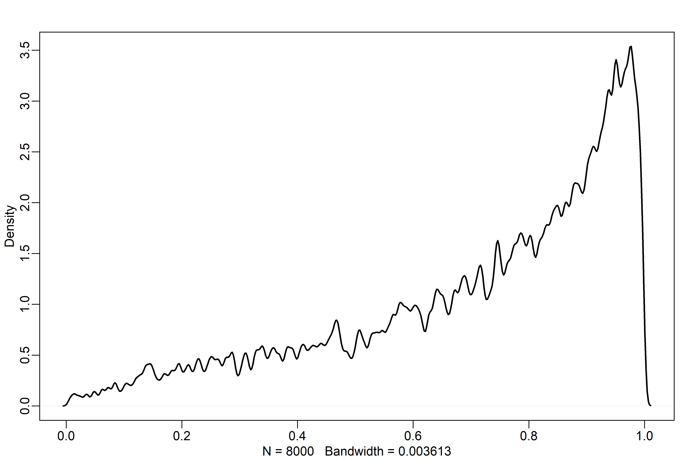

Models with Memory
================

-   Thus far, all models have used dummy or indicator variables,
    implictly making the assumption that there’s nothing to be learned
    from one category to another.
-   We want, instead, to be able to learn how categories are different
    while also learning how they may be similar!
-   *Multilevel models* help in this regard. Here are some benefits:
    1.  **Improved estimates for repeat sampling**: When there are more
        than one observation from the same individual, location, or
        time, traditional, single-level models either maximally underfit
        or overit the data.
    2.  **Improved estimates for imbalance in sampling**: When some
        individuals, locations, or times are sampled more than others,
        multilvel models automatically cope with differing uncertainty
        (i.e., over-sampled clusters don’t dominate inference unfairly).
    3.  **Estimates of variation**: Multilevel models model variation
        within and between groups explicitly.
    4.  **Avoid averaging, retain variation**: Summarising at a roll-up
        level with an average is dangerous, since it removes variation!

## 13.1 Example: Multilevel tadpoles

``` r
library(rethinking)

# frogs!
data(reedfrogs)
d <- reedfrogs
str(d)
```

    ## 'data.frame':    48 obs. of  5 variables:
    ##  $ density : int  10 10 10 10 10 10 10 10 10 10 ...
    ##  $ pred    : Factor w/ 2 levels "no","pred": 1 1 1 1 1 1 1 1 2 2 ...
    ##  $ size    : Factor w/ 2 levels "big","small": 1 1 1 1 2 2 2 2 1 1 ...
    ##  $ surv    : int  9 10 7 10 9 9 10 9 4 9 ...
    ##  $ propsurv: num  0.9 1 0.7 1 0.9 0.9 1 0.9 0.4 0.9 ...

-   Let’s model the number surviving, `surv`, out of an initial count,
    `density`.
-   Each row is a tank containing tadpoles, so let’s create a *varying
    intercept* model based on each tank.
-   As a comparison point, let’s start with a categorical model.

$$
\begin{gather}
S_i \sim \text{Binomial}(N_i, p_i) \\
\text{logit}(p_i) = \alpha_{TANK[i]} \\
\alpha_j \sim \text{Normal}(0, 1.5)
\end{gather}
$$

``` r
# make the tank cluster variable
d$tank <- 1:nrow(d)

# prep for stan
dat <-
  list(
    S = d$surv,
    N = d$density,
    tank = d$tank
  )

# approximate posterior
m13.1 <-
  ulam(
    alist(S ~ dbinom(N, p),
          logit(p) <- a[tank],
          a[tank] ~ dnorm(0, 1.5)),
    data = dat,
    chains = 4,
    log_lik = TRUE
  )
```

    ## Running MCMC with 4 sequential chains, with 1 thread(s) per chain...
    ## 
    ## Chain 1 Iteration:   1 / 1000 [  0%]  (Warmup) 
    ## Chain 1 Iteration: 100 / 1000 [ 10%]  (Warmup) 
    ## Chain 1 Iteration: 200 / 1000 [ 20%]  (Warmup) 
    ## Chain 1 Iteration: 300 / 1000 [ 30%]  (Warmup) 
    ## Chain 1 Iteration: 400 / 1000 [ 40%]  (Warmup) 
    ## Chain 1 Iteration: 500 / 1000 [ 50%]  (Warmup) 
    ## Chain 1 Iteration: 501 / 1000 [ 50%]  (Sampling) 
    ## Chain 1 Iteration: 600 / 1000 [ 60%]  (Sampling) 
    ## Chain 1 Iteration: 700 / 1000 [ 70%]  (Sampling) 
    ## Chain 1 Iteration: 800 / 1000 [ 80%]  (Sampling) 
    ## Chain 1 Iteration: 900 / 1000 [ 90%]  (Sampling) 
    ## Chain 1 Iteration: 1000 / 1000 [100%]  (Sampling) 
    ## Chain 1 finished in 0.6 seconds.
    ## Chain 2 Iteration:   1 / 1000 [  0%]  (Warmup) 
    ## Chain 2 Iteration: 100 / 1000 [ 10%]  (Warmup) 
    ## Chain 2 Iteration: 200 / 1000 [ 20%]  (Warmup) 
    ## Chain 2 Iteration: 300 / 1000 [ 30%]  (Warmup) 
    ## Chain 2 Iteration: 400 / 1000 [ 40%]  (Warmup) 
    ## Chain 2 Iteration: 500 / 1000 [ 50%]  (Warmup) 
    ## Chain 2 Iteration: 501 / 1000 [ 50%]  (Sampling) 
    ## Chain 2 Iteration: 600 / 1000 [ 60%]  (Sampling) 
    ## Chain 2 Iteration: 700 / 1000 [ 70%]  (Sampling) 
    ## Chain 2 Iteration: 800 / 1000 [ 80%]  (Sampling) 
    ## Chain 2 Iteration: 900 / 1000 [ 90%]  (Sampling) 
    ## Chain 2 Iteration: 1000 / 1000 [100%]  (Sampling) 
    ## Chain 2 finished in 0.7 seconds.
    ## Chain 3 Iteration:   1 / 1000 [  0%]  (Warmup) 
    ## Chain 3 Iteration: 100 / 1000 [ 10%]  (Warmup) 
    ## Chain 3 Iteration: 200 / 1000 [ 20%]  (Warmup) 
    ## Chain 3 Iteration: 300 / 1000 [ 30%]  (Warmup) 
    ## Chain 3 Iteration: 400 / 1000 [ 40%]  (Warmup) 
    ## Chain 3 Iteration: 500 / 1000 [ 50%]  (Warmup) 
    ## Chain 3 Iteration: 501 / 1000 [ 50%]  (Sampling) 
    ## Chain 3 Iteration: 600 / 1000 [ 60%]  (Sampling) 
    ## Chain 3 Iteration: 700 / 1000 [ 70%]  (Sampling) 
    ## Chain 3 Iteration: 800 / 1000 [ 80%]  (Sampling) 
    ## Chain 3 Iteration: 900 / 1000 [ 90%]  (Sampling) 
    ## Chain 3 Iteration: 1000 / 1000 [100%]  (Sampling) 
    ## Chain 3 finished in 0.7 seconds.
    ## Chain 4 Iteration:   1 / 1000 [  0%]  (Warmup) 
    ## Chain 4 Iteration: 100 / 1000 [ 10%]  (Warmup) 
    ## Chain 4 Iteration: 200 / 1000 [ 20%]  (Warmup) 
    ## Chain 4 Iteration: 300 / 1000 [ 30%]  (Warmup) 
    ## Chain 4 Iteration: 400 / 1000 [ 40%]  (Warmup) 
    ## Chain 4 Iteration: 500 / 1000 [ 50%]  (Warmup) 
    ## Chain 4 Iteration: 501 / 1000 [ 50%]  (Sampling) 
    ## Chain 4 Iteration: 600 / 1000 [ 60%]  (Sampling) 
    ## Chain 4 Iteration: 700 / 1000 [ 70%]  (Sampling) 
    ## Chain 4 Iteration: 800 / 1000 [ 80%]  (Sampling) 
    ## Chain 4 Iteration: 900 / 1000 [ 90%]  (Sampling) 
    ## Chain 4 Iteration: 1000 / 1000 [100%]  (Sampling) 
    ## Chain 4 finished in 0.7 seconds.
    ## 
    ## All 4 chains finished successfully.
    ## Mean chain execution time: 0.7 seconds.
    ## Total execution time: 4.0 seconds.

``` r
precis(m13.1, depth = 2)
```

    ##               mean        sd        5.5%       94.5%    n_eff     Rhat4
    ## a[1]   1.715082307 0.7570828  0.56404289  2.95158080 4809.725 1.0007175
    ## a[2]   2.397276711 0.8877323  1.10537290  4.00115710 6190.430 0.9989829
    ## a[3]   0.738896280 0.6379913 -0.23301721  1.76852490 5405.946 0.9987116
    ## a[4]   2.411694659 0.8896173  1.08658250  3.96009255 3586.772 0.9982805
    ## a[5]   1.711859109 0.7766801  0.59303549  2.98433665 4802.881 0.9985744
    ## a[6]   1.710168427 0.7542551  0.58778696  3.01398450 4049.029 0.9993881
    ## a[7]   2.407487682 0.9088415  1.05025440  3.92295535 4092.354 0.9992842
    ## a[8]   1.703462365 0.7402970  0.58295083  2.88526315 4586.756 0.9986081
    ## a[9]  -0.371215436 0.6126003 -1.36707700  0.61881740 5235.402 0.9988718
    ## a[10]  1.733386053 0.7811396  0.58937690  3.03661375 4196.537 0.9988110
    ## a[11]  0.770474069 0.6725167 -0.27962184  1.91899605 3683.246 0.9992027
    ## a[12]  0.372249460 0.6103638 -0.59661235  1.33366565 4662.680 0.9984847
    ## a[13]  0.753138253 0.6162913 -0.19276570  1.71969905 6286.620 0.9987629
    ## a[14] -0.002246745 0.6080427 -0.96294186  0.96392193 5939.866 0.9995174
    ## a[15]  1.727229740 0.7816100  0.52741201  3.00930235 4751.553 0.9987552
    ## a[16]  1.715894042 0.7880404  0.51544127  3.05393815 3454.251 0.9992592
    ## a[17]  2.553752499 0.7060645  1.49239925  3.76231625 4220.549 0.9986459
    ## a[18]  2.146227534 0.5977851  1.24587730  3.16686460 3502.960 0.9992005
    ## a[19]  1.822473732 0.5545726  0.95220452  2.75595620 3527.796 0.9992288
    ## a[20]  3.095688208 0.8293481  1.89106180  4.42103620 3480.162 0.9998437
    ## a[21]  2.151121503 0.6134617  1.23254280  3.18360840 4390.483 0.9996621
    ## a[22]  2.153996395 0.6062068  1.25457395  3.14556305 4121.380 0.9989131
    ## a[23]  2.144406639 0.6002564  1.24119735  3.16948780 3670.898 0.9983142
    ## a[24]  1.535679696 0.5082994  0.75888795  2.39317240 5108.923 0.9984107
    ## a[25] -1.096165423 0.4519081 -1.81829100 -0.41377758 5686.944 0.9983030
    ## a[26]  0.068957339 0.3878921 -0.54774346  0.67279766 4736.077 0.9993725
    ## a[27] -1.532712834 0.5058944 -2.34206850 -0.74335784 4456.120 1.0000410
    ## a[28] -0.550159287 0.4203515 -1.23118170  0.11196479 3999.697 0.9997888
    ## a[29]  0.069461211 0.4100011 -0.59616715  0.75225615 4320.180 0.9986306
    ## a[30]  1.304288875 0.4558540  0.61971135  2.05226260 5942.476 0.9987348
    ## a[31] -0.722681757 0.4292801 -1.43206035 -0.04835242 5367.967 0.9987700
    ## a[32] -0.382716506 0.3908830 -1.00610410  0.22739050 5193.895 0.9991032
    ## a[33]  2.823026125 0.6472734  1.86868435  3.93998250 3840.904 0.9983866
    ## a[34]  2.457304968 0.5791225  1.59875705  3.41820770 3492.395 0.9988399
    ## a[35]  2.481006170 0.6010123  1.59615295  3.49569355 3196.179 0.9997702
    ## a[36]  1.912293035 0.4918698  1.15343725  2.76143480 4465.482 0.9984241
    ## a[37]  1.895324718 0.4809723  1.19001560  2.67547870 3536.900 0.9988342
    ## a[38]  3.348864215 0.7624425  2.26742235  4.65764390 4254.635 0.9993140
    ## a[39]  2.447893589 0.5928953  1.56765025  3.47377610 3752.609 0.9983841
    ## a[40]  2.155426364 0.5274793  1.37414415  3.03488325 3992.393 0.9986436
    ## a[41] -1.905604306 0.4566100 -2.66342420 -1.20415235 3879.731 0.9990361
    ## a[42] -0.626410999 0.3511891 -1.19549015 -0.06893107 4809.546 0.9988277
    ## a[43] -0.512758273 0.3320430 -1.06861055  0.01945376 4795.342 0.9982734
    ## a[44] -0.397861545 0.3380408 -0.94406167  0.13080173 5031.580 0.9986577
    ## a[45]  0.515097486 0.3603531 -0.07355393  1.09693345 6018.184 0.9989370
    ## a[46] -0.622378613 0.3496089 -1.18807130 -0.08392557 5077.645 0.9988498
    ## a[47]  1.910654956 0.4713722  1.20414945  2.67901195 3497.421 0.9990547
    ## a[48] -0.057773068 0.3326905 -0.57099764  0.47491249 4739.561 0.9986662

-   Here is nothing new — we have 48 different estimates of alpha, one
    for each tank.
-   Let’s do the multilevel version:

$$
\begin{gather}
S_i \sim \text{Binomial}(N_i, p_i) \\
\text{logit}(p_i) = \alpha_{TANK[i]} \\
\alpha_j \sim \text{Normal}(\overline{\alpha}, \sigma) \\
\overline{\alpha} \sim \text{Normal}(0, 1.5) \\
\sigma \sim \text{Exponential}(1)
\end{gather}
$$

-   Now, each tank intercept, $\alpha_j$, is a function of two
    parameters: $\overline{\alpha}$ and $\sigma$. There are two levels
    for $\alpha$ (hence, the name “multilevel”).
-   The two parameters, $\overline{\alpha}$ and $\sigma$ are often
    referred to as *hyperparameters*, and their priors, *hyperpriors*.
-   In principle, there is no limit to the number of “hypers” or levels
    we can model, but in practice there are computational limits and
    limits in our ability to understand the model.
-   We can fit this model with `ulam()`, but not with `quap()`! Since
    `quap()` just approximates posteriors by “climbing a hill,” it can’t
    infer the posterior across multiple levels (there is a more robust
    explanation later).

``` r
# multilevel tadpoles!
m13.2 <-
  ulam(
    alist(S ~ dbinom(N, p),
          logit(p) <- a[tank],
          a[tank] ~ dnorm(a_bar, sigma),
          a_bar ~ dnorm(0, 1.5),
          sigma ~ dexp(1)),
    data = dat,
    chains = 4,
    log_lik = TRUE
  )
```

    ## Running MCMC with 4 sequential chains, with 1 thread(s) per chain...
    ## 
    ## Chain 1 Iteration:   1 / 1000 [  0%]  (Warmup) 
    ## Chain 1 Iteration: 100 / 1000 [ 10%]  (Warmup) 
    ## Chain 1 Iteration: 200 / 1000 [ 20%]  (Warmup) 
    ## Chain 1 Iteration: 300 / 1000 [ 30%]  (Warmup) 
    ## Chain 1 Iteration: 400 / 1000 [ 40%]  (Warmup) 
    ## Chain 1 Iteration: 500 / 1000 [ 50%]  (Warmup) 
    ## Chain 1 Iteration: 501 / 1000 [ 50%]  (Sampling) 
    ## Chain 1 Iteration: 600 / 1000 [ 60%]  (Sampling) 
    ## Chain 1 Iteration: 700 / 1000 [ 70%]  (Sampling) 
    ## Chain 1 Iteration: 800 / 1000 [ 80%]  (Sampling) 
    ## Chain 1 Iteration: 900 / 1000 [ 90%]  (Sampling) 
    ## Chain 1 Iteration: 1000 / 1000 [100%]  (Sampling) 
    ## Chain 1 finished in 0.8 seconds.
    ## Chain 2 Iteration:   1 / 1000 [  0%]  (Warmup) 
    ## Chain 2 Iteration: 100 / 1000 [ 10%]  (Warmup) 
    ## Chain 2 Iteration: 200 / 1000 [ 20%]  (Warmup) 
    ## Chain 2 Iteration: 300 / 1000 [ 30%]  (Warmup) 
    ## Chain 2 Iteration: 400 / 1000 [ 40%]  (Warmup) 
    ## Chain 2 Iteration: 500 / 1000 [ 50%]  (Warmup) 
    ## Chain 2 Iteration: 501 / 1000 [ 50%]  (Sampling) 
    ## Chain 2 Iteration: 600 / 1000 [ 60%]  (Sampling) 
    ## Chain 2 Iteration: 700 / 1000 [ 70%]  (Sampling) 
    ## Chain 2 Iteration: 800 / 1000 [ 80%]  (Sampling) 
    ## Chain 2 Iteration: 900 / 1000 [ 90%]  (Sampling) 
    ## Chain 2 Iteration: 1000 / 1000 [100%]  (Sampling) 
    ## Chain 2 finished in 0.7 seconds.
    ## Chain 3 Iteration:   1 / 1000 [  0%]  (Warmup) 
    ## Chain 3 Iteration: 100 / 1000 [ 10%]  (Warmup) 
    ## Chain 3 Iteration: 200 / 1000 [ 20%]  (Warmup) 
    ## Chain 3 Iteration: 300 / 1000 [ 30%]  (Warmup) 
    ## Chain 3 Iteration: 400 / 1000 [ 40%]  (Warmup) 
    ## Chain 3 Iteration: 500 / 1000 [ 50%]  (Warmup) 
    ## Chain 3 Iteration: 501 / 1000 [ 50%]  (Sampling) 
    ## Chain 3 Iteration: 600 / 1000 [ 60%]  (Sampling) 
    ## Chain 3 Iteration: 700 / 1000 [ 70%]  (Sampling) 
    ## Chain 3 Iteration: 800 / 1000 [ 80%]  (Sampling) 
    ## Chain 3 Iteration: 900 / 1000 [ 90%]  (Sampling) 
    ## Chain 3 Iteration: 1000 / 1000 [100%]  (Sampling) 
    ## Chain 3 finished in 0.7 seconds.
    ## Chain 4 Iteration:   1 / 1000 [  0%]  (Warmup) 
    ## Chain 4 Iteration: 100 / 1000 [ 10%]  (Warmup) 
    ## Chain 4 Iteration: 200 / 1000 [ 20%]  (Warmup) 
    ## Chain 4 Iteration: 300 / 1000 [ 30%]  (Warmup) 
    ## Chain 4 Iteration: 400 / 1000 [ 40%]  (Warmup) 
    ## Chain 4 Iteration: 500 / 1000 [ 50%]  (Warmup) 
    ## Chain 4 Iteration: 501 / 1000 [ 50%]  (Sampling) 
    ## Chain 4 Iteration: 600 / 1000 [ 60%]  (Sampling) 
    ## Chain 4 Iteration: 700 / 1000 [ 70%]  (Sampling) 
    ## Chain 4 Iteration: 800 / 1000 [ 80%]  (Sampling) 
    ## Chain 4 Iteration: 900 / 1000 [ 90%]  (Sampling) 
    ## Chain 4 Iteration: 1000 / 1000 [100%]  (Sampling) 
    ## Chain 4 finished in 0.7 seconds.
    ## 
    ## All 4 chains finished successfully.
    ## Mean chain execution time: 0.7 seconds.
    ## Total execution time: 4.0 seconds.

``` r
compare(m13.1, m13.2)
```

    ##           WAIC       SE    dWAIC      dSE    pWAIC       weight
    ## m13.2 200.0182 7.288358  0.00000       NA 20.84652 0.9995273528
    ## m13.1 215.3316 4.487813 15.31338 3.961848 25.84807 0.0004726472

-   `m13.2` has only \~21 effective parameters! The prior shrinks all
    the intercept estimates towards the mean $\overline{\alpha}$.
-   This is despite the model having more actual parameters (50) than
    `m13.1` (48).

``` r
precis(m13.2)
```

    ##           mean        sd      5.5%    94.5%    n_eff     Rhat4
    ## a_bar 1.346720 0.2619527 0.9507726 1.772600 2995.549 0.9998721
    ## sigma 1.615024 0.2151387 1.3057078 1.995722 1633.902 1.0007397

-   `sigma` is a regularizing prior, like from earlier chapters, but now
    the amount of regularization has been learned from the model itself!

``` r
# extract samples
post <- extract.samples(m13.2)

# find mean for each tank
# and transform to log-probability
d$propsurv.est <- logistic(apply(post$a, 2, mean))

# display raw proportions surviving in each tank
plot(
  d$propsurv,
  ylim = c(0, 1),
  pch = 16,
  xaxt = "n",
  xlab = "tank",
  ylab = "proportion survival",
  col = rangi2
)

axis(1, at=c(1, 16, 32, 48), labels = c(1, 16, 32, 48))

# overlay posterior means
points(d$propsurv.est)

# mark posterior mean probability across tanks
abline(h = mean(inv_logit(post$a_bar)), lty = 2)

# draw vertical dividers between tank densities
abline(v = 16.5, lwd = 0.5)
abline(v = 32.5, lwd = 0.5)
text(8, 0, "small tanks")
text(16 + 8, 0, "medium tanks")
text(32 + 8, 0, "large tanks")
```

<!-- -->

-   In every case, the multilevel estimate (open) is closer to the prior
    mean (dashed line) than the raw estimates (blue). This is called
    *shrinkage*.
-   The smaller tanks (with fewer tadpoles) also shrink back towards the
    group mean more than the tanks with many tadpoles.
-   Shrinkage is also proportional to how far away from the group mean
    the estimate is — the further away, the greater the shrinkage.
-   All of these arise because of *pooling* — sharing information across
    groups.

``` r
# show first 100 populations in the posterior
plot(
  NULL,
  xlim = c(-3, 4),
  ylim = c(0, 0.35), 
  xlab = "log-odds survive",
  ylab = "Density"
)

for (i in 1:100) {
  
  curve(dnorm(x, post$a_bar[i], post$sigma[i]), add = TRUE, col = col.alpha("black", 0.2))
  
}
```

<!-- -->

``` r
# sample 8000 imaginary tanks from the posterior distribution
sim_tanks <- rnorm(8000, post$a_bar, post$sigma)

# transform to probability and visualize
dens(inv_logit(sim_tanks), lwd = 2, adj = 0.1)
```

<!-- -->

-   Thus far, exponential priors on $\sigma$ terms have worked well, and
    they often continue to work well in multilevel models. There are,
    however, sometimes times when there are too few clusters to estimate
    variance from the max-entropy exponential distribution, so a
    half-normal may be more appropriate, i.e.:

$$
\begin{gather}
S_i \sim \text{Binomial}(N_i, p_i) \\
\text{logit}(p_i) = \alpha_{TANK[i]} \\
\alpha_j \sim \text{Normal}(\overline{\alpha}, \sigma) \\
\overline{\alpha} \sim \text{Normal}(0, 1.5) \\
\sigma \sim \text{Half-Normal}(0, 1)
\end{gather}
$$

-   This can be done in `ulam()` with `dhalfnorm()` with a parameter for
    the lower bound of 0: `lower = 0`.
