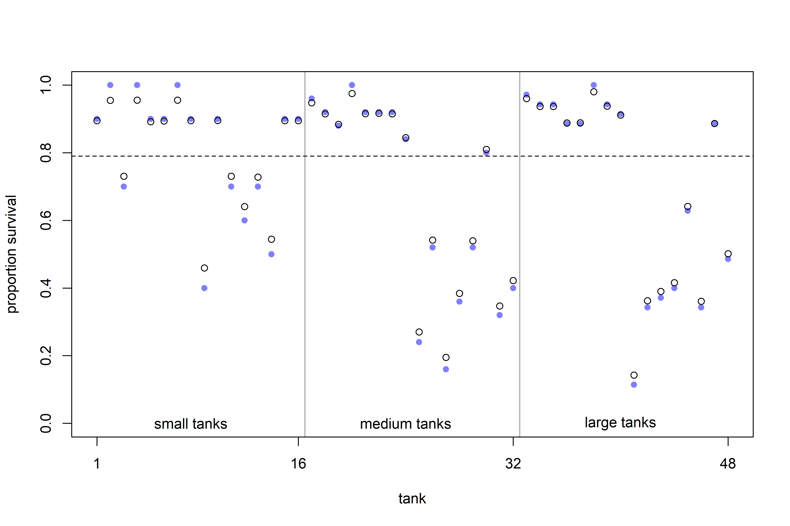

Models with Memory
================

-   Thus far, all models have used dummy or indicator variables,
    implictly making the assumption that there’s nothing to be learned
    from one category to another.
-   We want, instead, to be able to learn how categories are different
    while also learning how they may be similar!
-   *Multilevel models* help in this regard. Here are some benefits:
    1.  **Improved estimates for repeat sampling**: When there are more
        than one observation from the same individual, location, or
        time, traditional, single-level models either maximally underfit
        or overit the data.
    2.  **Improved estimates for imbalance in sampling**: When some
        individuals, locations, or times are sampled more than others,
        multilvel models automatically cope with differing uncertainty
        (i.e., over-sampled clusters don’t dominate inference unfairly).
    3.  **Estimates of variation**: Multilevel models model variation
        within and between groups explicitly.
    4.  **Avoid averaging, retain variation**: Summarising at a roll-up
        level with an average is dangerous, since it removes variation!

## 13.1 Example: Multilevel tadpoles

``` r
library(rethinking)

# frogs!
data(reedfrogs)
d <- reedfrogs
str(d)
```

    ## 'data.frame':    48 obs. of  5 variables:
    ##  $ density : int  10 10 10 10 10 10 10 10 10 10 ...
    ##  $ pred    : Factor w/ 2 levels "no","pred": 1 1 1 1 1 1 1 1 2 2 ...
    ##  $ size    : Factor w/ 2 levels "big","small": 1 1 1 1 2 2 2 2 1 1 ...
    ##  $ surv    : int  9 10 7 10 9 9 10 9 4 9 ...
    ##  $ propsurv: num  0.9 1 0.7 1 0.9 0.9 1 0.9 0.4 0.9 ...

-   Let’s model the number surviving, `surv`, out of an initial count,
    `density`.
-   Each row is a tank containing tadpoles, so let’s create a *varying
    intercept* model based on each tank.
-   As a comparison point, let’s start with a categorical model.

$$
\begin{gather}
S_i \sim \text{Binomial}(N_i, p_i) \\
\text{logit}(p_i) = \alpha_{TANK[i]} \\
\alpha_j \sim \text{Normal}(0, 1.5)
\end{gather}
$$

``` r
# make the tank cluster variable
d$tank <- 1:nrow(d)

# prep for stan
dat <-
  list(
    S = d$surv,
    N = d$density,
    tank = d$tank
  )

# approximate posterior
m13.1 <-
  ulam(
    alist(S ~ dbinom(N, p),
          logit(p) <- a[tank],
          a[tank] ~ dnorm(0, 1.5)),
    data = dat,
    chains = 4,
    log_lik = TRUE
  )
```

    ## Running MCMC with 4 sequential chains, with 1 thread(s) per chain...
    ## 
    ## Chain 1 Iteration:   1 / 1000 [  0%]  (Warmup) 
    ## Chain 1 Iteration: 100 / 1000 [ 10%]  (Warmup) 
    ## Chain 1 Iteration: 200 / 1000 [ 20%]  (Warmup) 
    ## Chain 1 Iteration: 300 / 1000 [ 30%]  (Warmup) 
    ## Chain 1 Iteration: 400 / 1000 [ 40%]  (Warmup) 
    ## Chain 1 Iteration: 500 / 1000 [ 50%]  (Warmup) 
    ## Chain 1 Iteration: 501 / 1000 [ 50%]  (Sampling) 
    ## Chain 1 Iteration: 600 / 1000 [ 60%]  (Sampling) 
    ## Chain 1 Iteration: 700 / 1000 [ 70%]  (Sampling) 
    ## Chain 1 Iteration: 800 / 1000 [ 80%]  (Sampling) 
    ## Chain 1 Iteration: 900 / 1000 [ 90%]  (Sampling) 
    ## Chain 1 Iteration: 1000 / 1000 [100%]  (Sampling) 
    ## Chain 1 finished in 0.4 seconds.
    ## Chain 2 Iteration:   1 / 1000 [  0%]  (Warmup) 
    ## Chain 2 Iteration: 100 / 1000 [ 10%]  (Warmup) 
    ## Chain 2 Iteration: 200 / 1000 [ 20%]  (Warmup) 
    ## Chain 2 Iteration: 300 / 1000 [ 30%]  (Warmup) 
    ## Chain 2 Iteration: 400 / 1000 [ 40%]  (Warmup) 
    ## Chain 2 Iteration: 500 / 1000 [ 50%]  (Warmup) 
    ## Chain 2 Iteration: 501 / 1000 [ 50%]  (Sampling) 
    ## Chain 2 Iteration: 600 / 1000 [ 60%]  (Sampling) 
    ## Chain 2 Iteration: 700 / 1000 [ 70%]  (Sampling) 
    ## Chain 2 Iteration: 800 / 1000 [ 80%]  (Sampling) 
    ## Chain 2 Iteration: 900 / 1000 [ 90%]  (Sampling) 
    ## Chain 2 Iteration: 1000 / 1000 [100%]  (Sampling) 
    ## Chain 2 finished in 0.4 seconds.
    ## Chain 3 Iteration:   1 / 1000 [  0%]  (Warmup) 
    ## Chain 3 Iteration: 100 / 1000 [ 10%]  (Warmup) 
    ## Chain 3 Iteration: 200 / 1000 [ 20%]  (Warmup) 
    ## Chain 3 Iteration: 300 / 1000 [ 30%]  (Warmup) 
    ## Chain 3 Iteration: 400 / 1000 [ 40%]  (Warmup) 
    ## Chain 3 Iteration: 500 / 1000 [ 50%]  (Warmup) 
    ## Chain 3 Iteration: 501 / 1000 [ 50%]  (Sampling) 
    ## Chain 3 Iteration: 600 / 1000 [ 60%]  (Sampling) 
    ## Chain 3 Iteration: 700 / 1000 [ 70%]  (Sampling) 
    ## Chain 3 Iteration: 800 / 1000 [ 80%]  (Sampling) 
    ## Chain 3 Iteration: 900 / 1000 [ 90%]  (Sampling) 
    ## Chain 3 Iteration: 1000 / 1000 [100%]  (Sampling) 
    ## Chain 3 finished in 0.4 seconds.
    ## Chain 4 Iteration:   1 / 1000 [  0%]  (Warmup) 
    ## Chain 4 Iteration: 100 / 1000 [ 10%]  (Warmup) 
    ## Chain 4 Iteration: 200 / 1000 [ 20%]  (Warmup) 
    ## Chain 4 Iteration: 300 / 1000 [ 30%]  (Warmup) 
    ## Chain 4 Iteration: 400 / 1000 [ 40%]  (Warmup) 
    ## Chain 4 Iteration: 500 / 1000 [ 50%]  (Warmup) 
    ## Chain 4 Iteration: 501 / 1000 [ 50%]  (Sampling) 
    ## Chain 4 Iteration: 600 / 1000 [ 60%]  (Sampling) 
    ## Chain 4 Iteration: 700 / 1000 [ 70%]  (Sampling) 
    ## Chain 4 Iteration: 800 / 1000 [ 80%]  (Sampling) 
    ## Chain 4 Iteration: 900 / 1000 [ 90%]  (Sampling) 
    ## Chain 4 Iteration: 1000 / 1000 [100%]  (Sampling) 
    ## Chain 4 finished in 0.4 seconds.
    ## 
    ## All 4 chains finished successfully.
    ## Mean chain execution time: 0.4 seconds.
    ## Total execution time: 2.4 seconds.

``` r
precis(m13.1, depth = 2)
```

    ##               mean        sd       5.5%       94.5%    n_eff     Rhat4
    ## a[1]   1.720349075 0.7490020  0.5418372  3.01037535 3465.355 0.9992196
    ## a[2]   2.412486721 0.9012310  1.0897586  4.01757325 3740.426 0.9984917
    ## a[3]   0.763008123 0.6341772 -0.2287947  1.81082745 3778.640 0.9988332
    ## a[4]   2.418030611 0.8607024  1.1094674  3.88844885 4413.767 0.9983315
    ## a[5]   1.720526573 0.7589328  0.5776629  3.01837580 4032.349 0.9990605
    ## a[6]   1.719645923 0.7638006  0.5828110  2.98967050 3274.609 0.9990220
    ## a[7]   2.395919773 0.9005443  1.0746157  3.88944445 3621.177 0.9986960
    ## a[8]   1.722569771 0.7702474  0.5708997  2.99673530 3679.950 0.9982415
    ## a[9]  -0.357501905 0.6119873 -1.3669973  0.62909896 4660.909 0.9991427
    ## a[10]  1.730477182 0.7640720  0.5750144  2.97605900 3159.897 0.9990225
    ## a[11]  0.756559710 0.6466556 -0.2874808  1.84760900 5004.423 0.9986935
    ## a[12]  0.390496882 0.6311579 -0.5954448  1.41822390 4022.466 0.9987772
    ## a[13]  0.770579506 0.6728724 -0.2785233  1.86308355 4606.228 0.9984452
    ## a[14]  0.005897101 0.6078918 -0.9865917  0.98103752 4164.201 1.0001201
    ## a[15]  1.723362778 0.7700010  0.5462132  3.01784345 4932.416 0.9983830
    ## a[16]  1.717250680 0.7701714  0.5521484  3.02551310 3864.658 0.9988856
    ## a[17]  2.535662301 0.6807564  1.5430404  3.67266305 3797.459 0.9995811
    ## a[18]  2.134150758 0.5917106  1.2716707  3.13524335 4090.534 0.9991402
    ## a[19]  1.816013866 0.5428696  0.9909353  2.71780880 3874.618 1.0002800
    ## a[20]  3.072290479 0.8020999  1.9004390  4.46293010 4485.901 0.9988159
    ## a[21]  2.151208112 0.6136881  1.2341660  3.18339785 4595.903 0.9985076
    ## a[22]  2.124844712 0.5946688  1.2406611  3.12790035 4114.923 0.9989982
    ## a[23]  2.132156823 0.5966200  1.2488245  3.16082530 3340.970 0.9985161
    ## a[24]  1.543504851 0.5043346  0.7781976  2.35620320 3759.583 0.9989689
    ## a[25] -1.097998686 0.4489821 -1.8286149 -0.41584876 5146.496 0.9988342
    ## a[26]  0.072840242 0.3883098 -0.5425466  0.67028371 4557.906 0.9986785
    ## a[27] -1.539577984 0.4812866 -2.3528300 -0.80906022 3902.603 0.9986075
    ## a[28] -0.553630839 0.4116455 -1.2430455  0.09586449 4970.277 0.9985722
    ## a[29]  0.086217440 0.3927471 -0.5557624  0.70619341 4303.535 0.9992108
    ## a[30]  1.293759143 0.4642718  0.5936843  2.03251470 3878.316 0.9990920
    ## a[31] -0.729494279 0.4307609 -1.4349604 -0.06145757 4958.543 0.9989717
    ## a[32] -0.387183128 0.4000453 -1.0304678  0.24521477 4307.160 0.9988625
    ## a[33]  2.849561760 0.6648380  1.8602933  3.92868885 4000.297 0.9981864
    ## a[34]  2.469096931 0.6016894  1.5659109  3.46800140 3785.935 1.0001748
    ## a[35]  2.466443542 0.5924534  1.6089623  3.47914775 4062.510 0.9988957
    ## a[36]  1.910059284 0.4795234  1.1870911  2.69874175 4361.929 0.9996013
    ## a[37]  1.900161219 0.4900712  1.1605069  2.73524260 3765.200 0.9992031
    ## a[38]  3.367655305 0.7834513  2.1958899  4.65564455 3979.084 0.9994416
    ## a[39]  2.463213750 0.5560508  1.6327519  3.40413675 4428.326 0.9999886
    ## a[40]  2.170978459 0.5297730  1.3486257  3.07088060 3511.801 0.9996629
    ## a[41] -1.896517366 0.4838960 -2.6789317 -1.17436180 4282.737 0.9991971
    ## a[42] -0.627598719 0.3639628 -1.2210510 -0.04919419 4207.389 0.9985980
    ## a[43] -0.512076492 0.3514068 -1.0880471  0.05765492 5079.809 0.9985618
    ## a[44] -0.393474787 0.3341185 -0.9293712  0.14323645 4025.074 0.9994995
    ## a[45]  0.508640544 0.3462437 -0.0240114  1.07121015 5478.397 0.9982784
    ## a[46] -0.644578420 0.3698364 -1.2258538 -0.06365843 4903.814 0.9983275
    ## a[47]  1.917421100 0.4846106  1.1837836  2.70492580 3121.289 0.9987817
    ## a[48] -0.058285586 0.3330102 -0.5855410  0.47138732 5793.615 0.9992769

-   Here is nothing new — we have 48 different estimates of alpha, one
    for each tank.
-   Let’s do the multilevel version:

$$
\begin{gather}
S_i \sim \text{Binomial}(N_i, p_i) \\
\text{logit}(p_i) = \alpha_{TANK[i]} \\
\alpha_j \sim \text{Normal}(\overline{\alpha}, \sigma) \\
\overline{\alpha} \sim \text{Normal}(0, 1.5) \\
\sigma \sim \text{Exponential}(1)
\end{gather}
$$

-   Now, each tank intercept, $\alpha_j$, is a function of two
    parameters: $\overline{\alpha}$ and $\sigma$. There are two levels
    for $\alpha$ (hence, the name “multilevel”).
-   The two parameters, $\overline{\alpha}$ and $\sigma$ are often
    referred to as *hyperparameters*, and their priors, *hyperpriors*.
-   In principle, there is no limit to the number of “hypers” or levels
    we can model, but in practice there are computational limits and
    limits in our ability to understand the model.
-   We can fit this model with `ulam()`, but not with `quap()`! Since
    `quap()` just approximates posteriors by “climbing a hill,” it can’t
    infer the posterior across multiple levels (there is a more robust
    explanation later).

``` r
# multilevel tadpoles!
m13.2 <-
  ulam(
    alist(S ~ dbinom(N, p),
          logit(p) <- a[tank],
          a[tank] ~ dnorm(a_bar, sigma),
          a_bar ~ dnorm(0, 1.5),
          sigma ~ dexp(1)),
    data = dat,
    chains = 4,
    log_lik = TRUE
  )
```

    ## Running MCMC with 4 sequential chains, with 1 thread(s) per chain...
    ## 
    ## Chain 1 Iteration:   1 / 1000 [  0%]  (Warmup) 
    ## Chain 1 Iteration: 100 / 1000 [ 10%]  (Warmup) 
    ## Chain 1 Iteration: 200 / 1000 [ 20%]  (Warmup) 
    ## Chain 1 Iteration: 300 / 1000 [ 30%]  (Warmup) 
    ## Chain 1 Iteration: 400 / 1000 [ 40%]  (Warmup) 
    ## Chain 1 Iteration: 500 / 1000 [ 50%]  (Warmup) 
    ## Chain 1 Iteration: 501 / 1000 [ 50%]  (Sampling) 
    ## Chain 1 Iteration: 600 / 1000 [ 60%]  (Sampling) 
    ## Chain 1 Iteration: 700 / 1000 [ 70%]  (Sampling) 
    ## Chain 1 Iteration: 800 / 1000 [ 80%]  (Sampling) 
    ## Chain 1 Iteration: 900 / 1000 [ 90%]  (Sampling) 
    ## Chain 1 Iteration: 1000 / 1000 [100%]  (Sampling) 
    ## Chain 1 finished in 0.4 seconds.
    ## Chain 2 Iteration:   1 / 1000 [  0%]  (Warmup) 
    ## Chain 2 Iteration: 100 / 1000 [ 10%]  (Warmup) 
    ## Chain 2 Iteration: 200 / 1000 [ 20%]  (Warmup) 
    ## Chain 2 Iteration: 300 / 1000 [ 30%]  (Warmup) 
    ## Chain 2 Iteration: 400 / 1000 [ 40%]  (Warmup) 
    ## Chain 2 Iteration: 500 / 1000 [ 50%]  (Warmup) 
    ## Chain 2 Iteration: 501 / 1000 [ 50%]  (Sampling) 
    ## Chain 2 Iteration: 600 / 1000 [ 60%]  (Sampling) 
    ## Chain 2 Iteration: 700 / 1000 [ 70%]  (Sampling) 
    ## Chain 2 Iteration: 800 / 1000 [ 80%]  (Sampling) 
    ## Chain 2 Iteration: 900 / 1000 [ 90%]  (Sampling) 
    ## Chain 2 Iteration: 1000 / 1000 [100%]  (Sampling) 
    ## Chain 2 finished in 0.5 seconds.
    ## Chain 3 Iteration:   1 / 1000 [  0%]  (Warmup) 
    ## Chain 3 Iteration: 100 / 1000 [ 10%]  (Warmup) 
    ## Chain 3 Iteration: 200 / 1000 [ 20%]  (Warmup) 
    ## Chain 3 Iteration: 300 / 1000 [ 30%]  (Warmup) 
    ## Chain 3 Iteration: 400 / 1000 [ 40%]  (Warmup) 
    ## Chain 3 Iteration: 500 / 1000 [ 50%]  (Warmup) 
    ## Chain 3 Iteration: 501 / 1000 [ 50%]  (Sampling) 
    ## Chain 3 Iteration: 600 / 1000 [ 60%]  (Sampling) 
    ## Chain 3 Iteration: 700 / 1000 [ 70%]  (Sampling) 
    ## Chain 3 Iteration: 800 / 1000 [ 80%]  (Sampling) 
    ## Chain 3 Iteration: 900 / 1000 [ 90%]  (Sampling) 
    ## Chain 3 Iteration: 1000 / 1000 [100%]  (Sampling) 
    ## Chain 3 finished in 0.4 seconds.
    ## Chain 4 Iteration:   1 / 1000 [  0%]  (Warmup) 
    ## Chain 4 Iteration: 100 / 1000 [ 10%]  (Warmup) 
    ## Chain 4 Iteration: 200 / 1000 [ 20%]  (Warmup) 
    ## Chain 4 Iteration: 300 / 1000 [ 30%]  (Warmup) 
    ## Chain 4 Iteration: 400 / 1000 [ 40%]  (Warmup) 
    ## Chain 4 Iteration: 500 / 1000 [ 50%]  (Warmup) 
    ## Chain 4 Iteration: 501 / 1000 [ 50%]  (Sampling) 
    ## Chain 4 Iteration: 600 / 1000 [ 60%]  (Sampling) 
    ## Chain 4 Iteration: 700 / 1000 [ 70%]  (Sampling) 
    ## Chain 4 Iteration: 800 / 1000 [ 80%]  (Sampling) 
    ## Chain 4 Iteration: 900 / 1000 [ 90%]  (Sampling) 
    ## Chain 4 Iteration: 1000 / 1000 [100%]  (Sampling) 
    ## Chain 4 finished in 0.4 seconds.
    ## 
    ## All 4 chains finished successfully.
    ## Mean chain execution time: 0.4 seconds.
    ## Total execution time: 2.4 seconds.

``` r
compare(m13.1, m13.2)
```

    ##           WAIC       SE    dWAIC      dSE    pWAIC       weight
    ## m13.2 200.9482 7.362119  0.00000       NA 21.35319 0.9990932041
    ## m13.1 214.9575 4.703881 14.00937 3.874138 25.67133 0.0009067959

-   `m13.2` has only \~21 effective parameters! The prior shrinks all
    the intercept estimates towards the mean $\overline{\alpha}$.
-   This is despite the model having more actual parameters (50) than
    `m13.1` (48).

``` r
precis(m13.2)
```

    ##           mean        sd      5.5%    94.5%    n_eff     Rhat4
    ## a_bar 1.343081 0.2504325 0.9498331 1.758372 2518.973 0.9997271
    ## sigma 1.618131 0.2119827 1.3159034 1.974037 1679.570 0.9986895

-   `sigma` is a regularizing prior, like from earlier chapters, but now
    the amount of regularization has been learned from the model itself!

``` r
# extract samples
post <- extract.samples(m13.2)

# find mean for each tank
# and transform to log-probability
d$propsurv.est <- logistic(apply(post$a, 2, mean))

# display raw proportions surviving in each tank
plot(
  d$propsurv,
  ylim = c(0, 1),
  pch = 16,
  xaxt = "n",
  xlab = "tank",
  ylab = "proportion survival",
  col = rangi2
)

axis(1, at=c(1, 16, 32, 48), labels = c(1, 16, 32, 48))

# overlay posterior means
points(d$propsurv.est)

# mark posterior mean probability across tanks
abline(h = mean(inv_logit(post$a_bar)), lty = 2)

# draw vertical dividers between tank densities
abline(v = 16.5, lwd = 0.5)
abline(v = 32.5, lwd = 0.5)
text(8, 0, "small tanks")
text(16 + 8, 0, "medium tanks")
text(32 + 8, 0, "large tanks")
```

<!-- -->

-   In every case, the multilevel estimate (open) is closer to the prior
    mean (dashed line) than the raw estimates (blue). This is called
    *shrinkage*.
-   The smaller tanks (with fewer tadpoles) also shrink back towards the
    group mean more than the tanks with many tadpoles.
-   Shrinkage is also proportional to how far away from the group mean
    the estimate is — the further away, the greater the shrinkage.
-   All of these arise because of *pooling* — sharing information across
    groups.

``` r
# show first 100 populations in the posterior
plot(
  NULL,
  xlim = c(-3, 4),
  ylim = c(0, 0.35), 
  xlab = "log-odds survive",
  ylab = "Density"
)

for (i in 1:100) {
  
  curve(dnorm(x, post$a_bar[i], post$sigma[i]), add = TRUE, col = col.alpha("black", 0.2))
  
}
```

<!-- -->

``` r
# sample 8000 imaginary tanks from the posterior distribution
sim_tanks <- rnorm(8000, post$a_bar, post$sigma)

# transform to probability and visualize
dens(inv_logit(sim_tanks), lwd = 2, adj = 0.1)
```

<!-- -->

-   Thus far, exponential priors on $\sigma$ terms have worked well, and
    they often continue to work well in multilevel models. There are,
    however, sometimes times when there are too few clusters to estimate
    variance from the max-entropy exponential distribution, so a
    half-normal may be more appropriate, i.e.:

$$
\begin{gather}
S_i \sim \text{Binomial}(N_i, p_i) \\
\text{logit}(p_i) = \alpha_{TANK[i]} \\
\alpha_j \sim \text{Normal}(\overline{\alpha}, \sigma) \\
\overline{\alpha} \sim \text{Normal}(0, 1.5) \\
\sigma \sim \text{Half-Normal}(0, 1)
\end{gather}
$$

-   This can be done in `ulam()` with `dhalfnorm()` with a parameter for
    the lower bound of 0: `lower = 0`.

## 13.2 Varying effects and the underfitting/overfitting trade-off

-   Varying intercepts are just regularized estimates, but adaptively
    regularized by estimating how diverse the clusters are while also
    estimating the features of each cluster.
-   Varying effects provide more accurate estimates of the cluster
    intercepts. This is because they do a better job of trading off
    between overfitting/underfitting.
-   Let’s look at predicting the survival of frogs from several ponds
    using a few different methods:
    1.  Complete pooling — assume the population does not vary at all
        from pond to pond.
    2.  No pooling — assume that each pond tells us nothing about any
        other pond.
    3.  Partial pooling — using an adaptive regularizing prior (like the
        last section).
-   Complete pooling will underfit the data, since the estimate for
    $\alpha$ across all ponds is unlikely to fit any particular pond
    well.
-   No pooling will overfit the data, since there is little data about
    each pond in particular.
-   Partial pooling strikes a balance!

### 13.2.1 The model

-   We’ll be simulating data from this model, then use each strategy to
    see how well it recovers the parameters:

$$
\begin{gather}
S_i \sim \text{Binomial}(N_i, p_i) \\
\text{logit}(p_i) = \alpha_{POND[i]} \\
\alpha_j \sim \text{Normal}(\overline{\alpha}, \sigma) \\
\overline{\alpha} \sim \text{Normal}(0, 1.5) \\
\sigma \sim \text{Exponential}(1)
\end{gather}
$$

-   We’ll need to assign values to:
    -   $\overline{\alpha}$, the average log-odds of survival in the
        entire population of ponds.
    -   $\sigma$, the standard deviation of the distribution of log-odds
        of survival among ponds.
    -   $\alpha$, a vector of individual pond intercepts, one for each
        pond.
    -   $N_i$, a sample size for each pond.

### 13.2.2 Assign values to the parameters

``` r
# specify parameters
a_bar <- 1.5
sigma <- 1.5
nponds <- 60
Ni <- as.integer(rep(c(5, 10, 25, 35), each = 15))

# setup df
set.seed(5005)
a_pond <- rnorm(nponds, mean = a_bar, sd = sigma)
d_sim <- data.frame(pond = 1:nponds, Ni = Ni, true_a = a_pond)
```

-   We’ve used `as.integer()` when creating `Ni`. R doesn’t care too
    much about this being a `"numeric"` rather than an `"integer"`, but
    Stan does!

### 13.2.3 Simulate survivors

``` r
d_sim$Si <- rbinom(nponds, prob = logistic(d_sim$true_a), size = d_sim$Ni)
```

### 13.2.4 Compute the no-pooling estimates

``` r
d_sim$p_nopool <- d_sim$Si / d_sim$Ni
```

-   The no pooling estimate we’ve added here is the same thing we’d get
    if we’d fit a model with flat priors that induce no regularization.

### 13.2.5 Compute the partial-pooling estimate

``` r
# prep for stan
dat <- 
  list(
    Si = d_sim$Si, 
    Ni = d_sim$Ni, 
    pond = d_sim$pond
  )

# model!
m13.3 <-
  ulam(
    alist(Si ~ dbinom(Ni, p),
          logit(p) <- a_pond[pond],
          a_pond[pond] ~ dnorm(a_bar, sigma),
          a_bar ~ dnorm(0, 1.5),
          sigma ~ dexp(1)),
    data = dat,
    chains = 4
  )
```

    ## Running MCMC with 4 sequential chains, with 1 thread(s) per chain...
    ## 
    ## Chain 1 Iteration:   1 / 1000 [  0%]  (Warmup) 
    ## Chain 1 Iteration: 100 / 1000 [ 10%]  (Warmup) 
    ## Chain 1 Iteration: 200 / 1000 [ 20%]  (Warmup) 
    ## Chain 1 Iteration: 300 / 1000 [ 30%]  (Warmup) 
    ## Chain 1 Iteration: 400 / 1000 [ 40%]  (Warmup) 
    ## Chain 1 Iteration: 500 / 1000 [ 50%]  (Warmup) 
    ## Chain 1 Iteration: 501 / 1000 [ 50%]  (Sampling) 
    ## Chain 1 Iteration: 600 / 1000 [ 60%]  (Sampling) 
    ## Chain 1 Iteration: 700 / 1000 [ 70%]  (Sampling) 
    ## Chain 1 Iteration: 800 / 1000 [ 80%]  (Sampling) 
    ## Chain 1 Iteration: 900 / 1000 [ 90%]  (Sampling) 
    ## Chain 1 Iteration: 1000 / 1000 [100%]  (Sampling) 
    ## Chain 1 finished in 0.5 seconds.
    ## Chain 2 Iteration:   1 / 1000 [  0%]  (Warmup) 
    ## Chain 2 Iteration: 100 / 1000 [ 10%]  (Warmup) 
    ## Chain 2 Iteration: 200 / 1000 [ 20%]  (Warmup) 
    ## Chain 2 Iteration: 300 / 1000 [ 30%]  (Warmup) 
    ## Chain 2 Iteration: 400 / 1000 [ 40%]  (Warmup) 
    ## Chain 2 Iteration: 500 / 1000 [ 50%]  (Warmup) 
    ## Chain 2 Iteration: 501 / 1000 [ 50%]  (Sampling) 
    ## Chain 2 Iteration: 600 / 1000 [ 60%]  (Sampling) 
    ## Chain 2 Iteration: 700 / 1000 [ 70%]  (Sampling) 
    ## Chain 2 Iteration: 800 / 1000 [ 80%]  (Sampling) 
    ## Chain 2 Iteration: 900 / 1000 [ 90%]  (Sampling) 
    ## Chain 2 Iteration: 1000 / 1000 [100%]  (Sampling) 
    ## Chain 2 finished in 0.5 seconds.
    ## Chain 3 Iteration:   1 / 1000 [  0%]  (Warmup) 
    ## Chain 3 Iteration: 100 / 1000 [ 10%]  (Warmup) 
    ## Chain 3 Iteration: 200 / 1000 [ 20%]  (Warmup) 
    ## Chain 3 Iteration: 300 / 1000 [ 30%]  (Warmup) 
    ## Chain 3 Iteration: 400 / 1000 [ 40%]  (Warmup) 
    ## Chain 3 Iteration: 500 / 1000 [ 50%]  (Warmup) 
    ## Chain 3 Iteration: 501 / 1000 [ 50%]  (Sampling) 
    ## Chain 3 Iteration: 600 / 1000 [ 60%]  (Sampling) 
    ## Chain 3 Iteration: 700 / 1000 [ 70%]  (Sampling) 
    ## Chain 3 Iteration: 800 / 1000 [ 80%]  (Sampling) 
    ## Chain 3 Iteration: 900 / 1000 [ 90%]  (Sampling) 
    ## Chain 3 Iteration: 1000 / 1000 [100%]  (Sampling) 
    ## Chain 3 finished in 0.4 seconds.
    ## Chain 4 Iteration:   1 / 1000 [  0%]  (Warmup) 
    ## Chain 4 Iteration: 100 / 1000 [ 10%]  (Warmup) 
    ## Chain 4 Iteration: 200 / 1000 [ 20%]  (Warmup) 
    ## Chain 4 Iteration: 300 / 1000 [ 30%]  (Warmup) 
    ## Chain 4 Iteration: 400 / 1000 [ 40%]  (Warmup) 
    ## Chain 4 Iteration: 500 / 1000 [ 50%]  (Warmup) 
    ## Chain 4 Iteration: 501 / 1000 [ 50%]  (Sampling) 
    ## Chain 4 Iteration: 600 / 1000 [ 60%]  (Sampling) 
    ## Chain 4 Iteration: 700 / 1000 [ 70%]  (Sampling) 
    ## Chain 4 Iteration: 800 / 1000 [ 80%]  (Sampling) 
    ## Chain 4 Iteration: 900 / 1000 [ 90%]  (Sampling) 
    ## Chain 4 Iteration: 1000 / 1000 [100%]  (Sampling) 
    ## Chain 4 finished in 0.5 seconds.
    ## 
    ## All 4 chains finished successfully.
    ## Mean chain execution time: 0.5 seconds.
    ## Total execution time: 2.7 seconds.

``` r
# display output
precis(m13.3, depth = 2)
```

    ##                   mean        sd         5.5%       94.5%     n_eff     Rhat4
    ## a_pond[1]   1.69057602 0.9696394  0.171820335  3.32659750 3081.1528 1.0004124
    ## a_pond[2]   2.88938764 1.3041403  1.003804025  5.09379965 2470.3985 0.9991508
    ## a_pond[3]  -0.62765160 0.8574147 -2.007948700  0.71526967 2886.3775 0.9982876
    ## a_pond[4]   2.86243656 1.2468991  1.083340350  4.89757560 2425.9140 0.9990962
    ## a_pond[5]   2.85135661 1.2539477  1.014984650  4.99649700 2399.6930 0.9995221
    ## a_pond[6]   2.86770870 1.2788727  1.046039900  5.06942445 2758.8731 0.9996212
    ## a_pond[7]   0.04653569 0.8254234 -1.250867700  1.31744495 3186.5238 0.9997329
    ## a_pond[8]   2.90099655 1.2453263  1.108947450  5.02948865 2537.0973 0.9991087
    ## a_pond[9]   1.66341677 1.0454380  0.112602980  3.47742795 2789.6798 0.9984895
    ## a_pond[10]  1.61034881 0.9614488  0.148074210  3.23400720 3232.4911 1.0008598
    ## a_pond[11]  2.86746880 1.2959425  0.992894865  5.06583530 2152.4240 1.0000455
    ## a_pond[12]  0.06856778 0.8293690 -1.267179950  1.36777185 3303.3015 0.9987685
    ## a_pond[13]  2.87434180 1.2750254  0.993951000  5.09111315 2296.4182 0.9984062
    ## a_pond[14]  2.88623830 1.2651400  1.088326250  5.19428535 2601.8423 0.9991245
    ## a_pond[15]  2.89218655 1.3128219  1.044428450  5.06421280 2299.2256 0.9999248
    ## a_pond[16]  1.57873717 0.7668694  0.409919160  2.95305335 3063.8785 0.9999458
    ## a_pond[17] -1.44502238 0.7706410 -2.725465400 -0.33010133 2401.0632 1.0000048
    ## a_pond[18]  1.05500626 0.6523897  0.059370174  2.16571015 2821.8951 0.9988549
    ## a_pond[19] -0.94245662 0.6546203 -2.033426900  0.05991308 3416.9791 0.9986682
    ## a_pond[20]  1.57356632 0.8032256  0.392057895  2.95944875 2647.8603 1.0003094
    ## a_pond[21] -0.14033520 0.6315116 -1.154259900  0.91912237 3736.4677 0.9988373
    ## a_pond[22]  2.22746104 0.9014484  0.913420025  3.71530290 2747.1989 1.0000703
    ## a_pond[23]  3.30581350 1.2261376  1.622769250  5.41868355 1924.1304 0.9989970
    ## a_pond[24]  0.62911042 0.6641018 -0.411591595  1.73463740 3369.1745 1.0003407
    ## a_pond[25]  3.25463335 1.1773144  1.555464800  5.27866330 2032.5185 0.9990547
    ## a_pond[26]  2.24278845 0.9269187  0.903882715  3.80853075 2653.5248 0.9996193
    ## a_pond[27]  1.05642030 0.6679804  0.029429238  2.20041425 3669.2174 1.0003224
    ## a_pond[28]  2.25707952 0.8967401  0.993532685  3.82391280 1706.6192 1.0017491
    ## a_pond[29]  1.55618807 0.7575435  0.433353455  2.77984475 2790.2503 0.9991458
    ## a_pond[30]  1.05251453 0.6510024  0.050723562  2.14160740 3755.6005 0.9995276
    ## a_pond[31]  2.46170124 0.6630393  1.470582500  3.59403095 2630.4797 0.9992298
    ## a_pond[32]  2.06173119 0.6079320  1.165568900  3.06621775 2740.3258 0.9994743
    ## a_pond[33]  1.72639768 0.5513346  0.899826855  2.67596975 3381.3278 0.9983114
    ## a_pond[34]  1.23947555 0.4442594  0.550527125  1.94816600 2904.8941 0.9992231
    ## a_pond[35]  0.66388206 0.4227995  0.004558146  1.34671690 3283.6148 0.9988225
    ## a_pond[36]  3.85266264 1.0918492  2.330695150  5.76721135 2025.4460 0.9983414
    ## a_pond[37] -0.99319212 0.4536412 -1.715902000 -0.28220333 3328.0283 0.9985758
    ## a_pond[38] -1.18110060 0.4149972 -1.860462100 -0.55234138 2713.6378 0.9994123
    ## a_pond[39]  0.67757601 0.4061146  0.037834357  1.34993980 4116.6726 0.9983234
    ## a_pond[40]  3.88888771 1.0822476  2.348142650  5.75616780 1479.5725 1.0014950
    ## a_pond[41]  3.86466389 1.0738140  2.374247750  5.67138500 1598.5961 1.0004404
    ## a_pond[42]  2.43788371 0.6831780  1.443301850  3.58260570 2948.4069 0.9991983
    ## a_pond[43] -0.12745810 0.3788010 -0.746890740  0.46099720 3904.9809 0.9983916
    ## a_pond[44]  0.66998161 0.4066384  0.056888011  1.31391365 2700.1808 0.9987685
    ## a_pond[45] -1.20588633 0.4683606 -1.975658800 -0.50794980 2353.5577 0.9995668
    ## a_pond[46]  0.01597718 0.3377263 -0.533772630  0.57435622 3078.5637 0.9990045
    ## a_pond[47]  4.03470949 0.9838553  2.621939400  5.78106875 2200.2469 0.9984817
    ## a_pond[48]  2.11231761 0.5348655  1.312427550  3.01754040 2521.3282 0.9993398
    ## a_pond[49]  1.85228236 0.4544399  1.167586700  2.59701530 3962.7588 0.9991617
    ## a_pond[50]  2.76363222 0.6301237  1.828476450  3.81084300 2572.4514 0.9999756
    ## a_pond[51]  2.38926489 0.5244173  1.618218350  3.25917390 3377.4711 0.9989168
    ## a_pond[52]  0.35775929 0.3311128 -0.175081760  0.89059836 3946.0451 0.9984909
    ## a_pond[53]  2.09439501 0.5195456  1.306026000  2.95945330 3107.8709 0.9990561
    ## a_pond[54]  4.09839495 1.0714085  2.597225200  5.98168520 1997.3636 0.9987116
    ## a_pond[55]  1.13183532 0.3932403  0.507778245  1.75752695 3312.5678 0.9999554
    ## a_pond[56]  2.77178749 0.6731752  1.781638900  3.90344540 2945.1970 0.9995765
    ## a_pond[57]  0.72361909 0.3429821  0.202428340  1.25044340 2999.7333 1.0008419
    ## a_pond[58]  4.04396550 1.0021676  2.612761050  5.77530560 1585.7584 1.0007847
    ## a_pond[59]  1.64766666 0.4435001  0.971773495  2.36436735 3051.5512 1.0003471
    ## a_pond[60]  2.39052234 0.5771943  1.543070300  3.34291450 3199.2037 0.9996222
    ## a_bar       1.66959916 0.2610380  1.274270100  2.08440825 1713.0058 1.0003674
    ## sigma       1.67392563 0.2354407  1.333771800  2.07892895  772.0146 1.0018294

``` r
# extract means for comparison
post <- extract.samples(m13.3)
d_sim$p_partpool <- apply(inv_logit(post$a_pond), 2, mean)

# true per-pond survival probabilities
d_sim$p_true <- inv_logit(d_sim$true_a)

# compute error between estimates and true effects
nopool_error <- abs(d_sim$p_nopool - d_sim$p_true)
partpool_error <- abs(d_sim$p_partpool - d_sim$p_true)

# plot!
plot(
  1:60, 
  nopool_error,
  xlab = "pond",
  ylab = "absolute error",
  col = rangi2,
  pch = 16
)

points(1:60, partpool_error)
```

<!-- -->

-   The blue points are the no-pooling estimates, the black circles show
    the varying effect estimates.
-   At the high end, the partially pooled/no pooled estimates are
    similar, but at the low end, the partially pooled estimates are way
    better!

``` r
nopool_avg <- aggregate(nopool_error, list(d_sim$Ni), mean)
partpool_avg <- aggregate(partpool_error, list(d_sim$Ni), mean)

nopool_avg
```

    ##   Group.1          x
    ## 1       5 0.12122935
    ## 2      10 0.10245961
    ## 3      25 0.04057566
    ## 4      35 0.03583510

``` r
partpool_avg
```

    ##   Group.1          x
    ## 1       5 0.08683174
    ## 2      10 0.07617887
    ## 3      25 0.04808259
    ## 4      35 0.03623471

-   Smaller tanks (with less information) are shrunk more towards the
    mean than large tanks (with lots more info).
