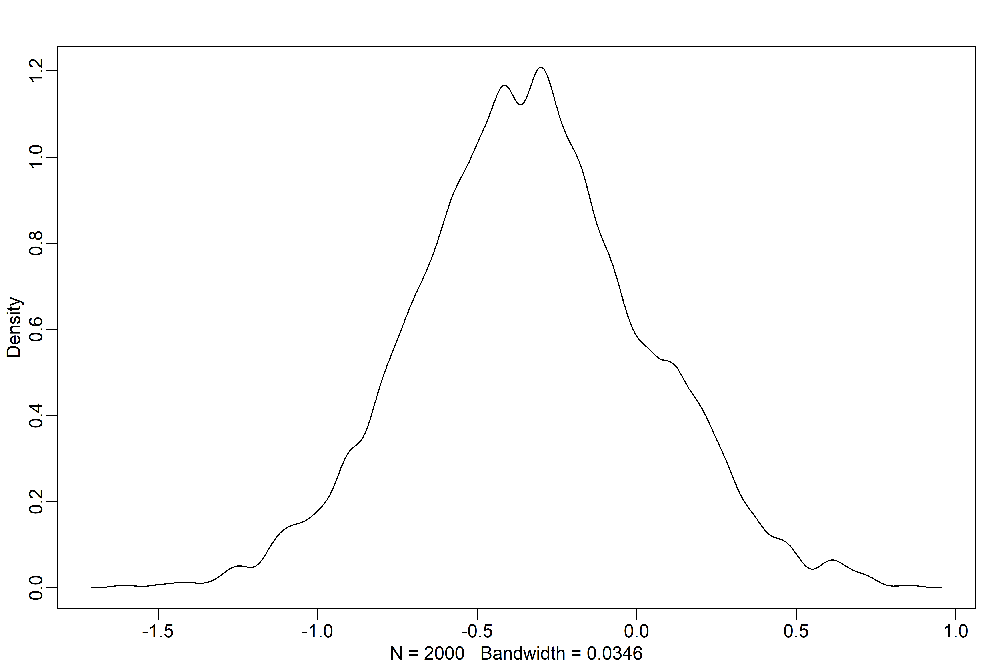
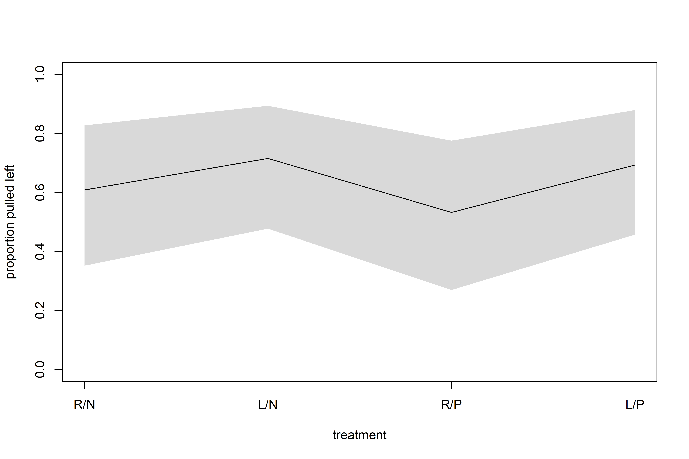
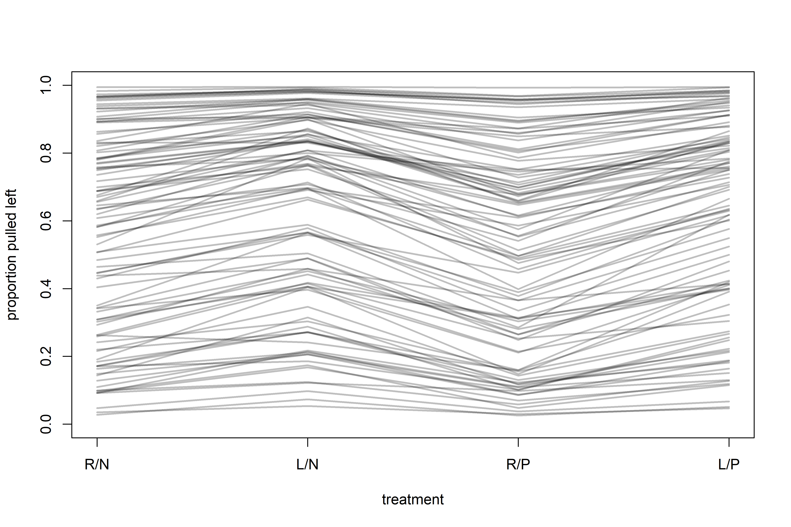

Models with Memory
================

-   Thus far, all models have used dummy or indicator variables,
    implictly making the assumption that there’s nothing to be learned
    from one category to another.
-   We want, instead, to be able to learn how categories are different
    while also learning how they may be similar!
-   *Multilevel models* help in this regard. Here are some benefits:
    1.  **Improved estimates for repeat sampling**: When there are more
        than one observation from the same individual, location, or
        time, traditional, single-level models either maximally underfit
        or overit the data.
    2.  **Improved estimates for imbalance in sampling**: When some
        individuals, locations, or times are sampled more than others,
        multilvel models automatically cope with differing uncertainty
        (i.e., over-sampled clusters don’t dominate inference unfairly).
    3.  **Estimates of variation**: Multilevel models model variation
        within and between groups explicitly.
    4.  **Avoid averaging, retain variation**: Summarising at a roll-up
        level with an average is dangerous, since it removes variation!

## 13.1 Example: Multilevel tadpoles

``` r
library(rethinking)

# frogs!
data(reedfrogs)
d <- reedfrogs
str(d)
```

    ## 'data.frame':    48 obs. of  5 variables:
    ##  $ density : int  10 10 10 10 10 10 10 10 10 10 ...
    ##  $ pred    : Factor w/ 2 levels "no","pred": 1 1 1 1 1 1 1 1 2 2 ...
    ##  $ size    : Factor w/ 2 levels "big","small": 1 1 1 1 2 2 2 2 1 1 ...
    ##  $ surv    : int  9 10 7 10 9 9 10 9 4 9 ...
    ##  $ propsurv: num  0.9 1 0.7 1 0.9 0.9 1 0.9 0.4 0.9 ...

-   Let’s model the number surviving, `surv`, out of an initial count,
    `density`.
-   Each row is a tank containing tadpoles, so let’s create a *varying
    intercept* model based on each tank.
-   As a comparison point, let’s start with a categorical model.

$$
\begin{gather}
S_i \sim \text{Binomial}(N_i, p_i) \\
\text{logit}(p_i) = \alpha_{TANK[i]} \\
\alpha_j \sim \text{Normal}(0, 1.5)
\end{gather}
$$

``` r
# make the tank cluster variable
d$tank <- 1:nrow(d)

# prep for stan
dat <-
  list(
    S = d$surv,
    N = d$density,
    tank = d$tank
  )

# approximate posterior
m13.1 <-
  ulam(
    alist(S ~ dbinom(N, p),
          logit(p) <- a[tank],
          a[tank] ~ dnorm(0, 1.5)),
    data = dat,
    chains = 4,
    log_lik = TRUE
  )
```

    ## Running MCMC with 4 sequential chains, with 1 thread(s) per chain...
    ## 
    ## Chain 1 Iteration:   1 / 1000 [  0%]  (Warmup) 
    ## Chain 1 Iteration: 100 / 1000 [ 10%]  (Warmup) 
    ## Chain 1 Iteration: 200 / 1000 [ 20%]  (Warmup) 
    ## Chain 1 Iteration: 300 / 1000 [ 30%]  (Warmup) 
    ## Chain 1 Iteration: 400 / 1000 [ 40%]  (Warmup) 
    ## Chain 1 Iteration: 500 / 1000 [ 50%]  (Warmup) 
    ## Chain 1 Iteration: 501 / 1000 [ 50%]  (Sampling) 
    ## Chain 1 Iteration: 600 / 1000 [ 60%]  (Sampling) 
    ## Chain 1 Iteration: 700 / 1000 [ 70%]  (Sampling) 
    ## Chain 1 Iteration: 800 / 1000 [ 80%]  (Sampling) 
    ## Chain 1 Iteration: 900 / 1000 [ 90%]  (Sampling) 
    ## Chain 1 Iteration: 1000 / 1000 [100%]  (Sampling) 
    ## Chain 1 finished in 0.5 seconds.
    ## Chain 2 Iteration:   1 / 1000 [  0%]  (Warmup) 
    ## Chain 2 Iteration: 100 / 1000 [ 10%]  (Warmup) 
    ## Chain 2 Iteration: 200 / 1000 [ 20%]  (Warmup) 
    ## Chain 2 Iteration: 300 / 1000 [ 30%]  (Warmup) 
    ## Chain 2 Iteration: 400 / 1000 [ 40%]  (Warmup) 
    ## Chain 2 Iteration: 500 / 1000 [ 50%]  (Warmup) 
    ## Chain 2 Iteration: 501 / 1000 [ 50%]  (Sampling) 
    ## Chain 2 Iteration: 600 / 1000 [ 60%]  (Sampling) 
    ## Chain 2 Iteration: 700 / 1000 [ 70%]  (Sampling) 
    ## Chain 2 Iteration: 800 / 1000 [ 80%]  (Sampling) 
    ## Chain 2 Iteration: 900 / 1000 [ 90%]  (Sampling) 
    ## Chain 2 Iteration: 1000 / 1000 [100%]  (Sampling) 
    ## Chain 2 finished in 0.5 seconds.
    ## Chain 3 Iteration:   1 / 1000 [  0%]  (Warmup) 
    ## Chain 3 Iteration: 100 / 1000 [ 10%]  (Warmup) 
    ## Chain 3 Iteration: 200 / 1000 [ 20%]  (Warmup) 
    ## Chain 3 Iteration: 300 / 1000 [ 30%]  (Warmup) 
    ## Chain 3 Iteration: 400 / 1000 [ 40%]  (Warmup) 
    ## Chain 3 Iteration: 500 / 1000 [ 50%]  (Warmup) 
    ## Chain 3 Iteration: 501 / 1000 [ 50%]  (Sampling) 
    ## Chain 3 Iteration: 600 / 1000 [ 60%]  (Sampling) 
    ## Chain 3 Iteration: 700 / 1000 [ 70%]  (Sampling) 
    ## Chain 3 Iteration: 800 / 1000 [ 80%]  (Sampling) 
    ## Chain 3 Iteration: 900 / 1000 [ 90%]  (Sampling) 
    ## Chain 3 Iteration: 1000 / 1000 [100%]  (Sampling) 
    ## Chain 3 finished in 0.5 seconds.
    ## Chain 4 Iteration:   1 / 1000 [  0%]  (Warmup) 
    ## Chain 4 Iteration: 100 / 1000 [ 10%]  (Warmup) 
    ## Chain 4 Iteration: 200 / 1000 [ 20%]  (Warmup) 
    ## Chain 4 Iteration: 300 / 1000 [ 30%]  (Warmup) 
    ## Chain 4 Iteration: 400 / 1000 [ 40%]  (Warmup) 
    ## Chain 4 Iteration: 500 / 1000 [ 50%]  (Warmup) 
    ## Chain 4 Iteration: 501 / 1000 [ 50%]  (Sampling) 
    ## Chain 4 Iteration: 600 / 1000 [ 60%]  (Sampling) 
    ## Chain 4 Iteration: 700 / 1000 [ 70%]  (Sampling) 
    ## Chain 4 Iteration: 800 / 1000 [ 80%]  (Sampling) 
    ## Chain 4 Iteration: 900 / 1000 [ 90%]  (Sampling) 
    ## Chain 4 Iteration: 1000 / 1000 [100%]  (Sampling) 
    ## Chain 4 finished in 0.4 seconds.
    ## 
    ## All 4 chains finished successfully.
    ## Mean chain execution time: 0.5 seconds.
    ## Total execution time: 2.6 seconds.

``` r
precis(m13.1, depth = 2)
```

    ##               mean        sd       5.5%       94.5%    n_eff     Rhat4
    ## a[1]   1.700479500 0.7887162  0.5070037  3.04236695 4403.108 0.9995898
    ## a[2]   2.417027799 0.9049143  1.0587426  3.95754300 4588.071 0.9983482
    ## a[3]   0.768139859 0.6842861 -0.2929276  1.89781895 4790.781 0.9988669
    ## a[4]   2.412460650 0.9383307  1.0356913  4.02517925 5541.249 0.9987555
    ## a[5]   1.712267528 0.7847265  0.5256442  3.04223185 4550.576 0.9988267
    ## a[6]   1.719931215 0.7928336  0.5235716  3.02013480 3393.201 0.9993671
    ## a[7]   2.394667543 0.8815309  1.0813018  3.89118770 3380.635 0.9993157
    ## a[8]   1.710972896 0.7659825  0.5758478  3.00584565 3525.135 0.9997786
    ## a[9]  -0.373428557 0.6178822 -1.3445139  0.62143575 5826.394 0.9990670
    ## a[10]  1.703205465 0.7739432  0.5486362  2.97208145 5053.840 0.9989920
    ## a[11]  0.756112824 0.6638846 -0.2637839  1.83864380 4517.452 0.9982698
    ## a[12]  0.376856686 0.5809826 -0.5093072  1.34651210 4328.423 0.9996242
    ## a[13]  0.735666564 0.6160900 -0.2153404  1.74869445 5912.456 0.9985371
    ## a[14] -0.001988707 0.6037378 -0.9621815  0.96761505 4431.178 0.9991725
    ## a[15]  1.714189115 0.7821686  0.6169842  3.05617650 3773.411 0.9987270
    ## a[16]  1.702327245 0.7456272  0.5987266  2.95371490 4907.418 0.9987964
    ## a[17]  2.552257607 0.6821778  1.5439953  3.69318475 2676.098 0.9994171
    ## a[18]  2.143712346 0.5956001  1.2335942  3.20789845 3944.151 0.9991559
    ## a[19]  1.819031709 0.5679765  0.9541487  2.77674160 3886.937 0.9983747
    ## a[20]  3.094078983 0.8120214  1.8829017  4.47240000 3735.085 0.9984503
    ## a[21]  2.139885589 0.5830502  1.2556593  3.10954835 5287.579 0.9984810
    ## a[22]  2.125059525 0.6027027  1.2268674  3.11044515 3913.776 0.9996947
    ## a[23]  2.129780407 0.5980149  1.2467491  3.12520145 4983.633 0.9987304
    ## a[24]  1.530761510 0.4923086  0.7848602  2.33832725 3962.781 0.9989220
    ## a[25] -1.093559560 0.4307271 -1.8107701 -0.44285650 5539.215 0.9991243
    ## a[26]  0.068482302 0.4168000 -0.6068098  0.74944451 6082.327 0.9984400
    ## a[27] -1.541696364 0.5167387 -2.4365635 -0.75161801 4513.359 0.9985845
    ## a[28] -0.554319077 0.3916626 -1.2050923  0.04828916 4201.508 0.9982041
    ## a[29]  0.084855527 0.4103554 -0.5988266  0.74936939 6602.060 0.9985298
    ## a[30]  1.314739564 0.4822204  0.5925474  2.12191500 5047.215 0.9990449
    ## a[31] -0.726543956 0.4211832 -1.4072790 -0.06497538 5765.343 0.9989683
    ## a[32] -0.383327106 0.4055485 -1.0426692  0.24308925 4140.427 0.9987347
    ## a[33]  2.849641203 0.6560532  1.8556689  3.97812590 4180.188 0.9983925
    ## a[34]  2.451336728 0.5696447  1.6078300  3.42084825 3959.487 0.9991687
    ## a[35]  2.452191884 0.5762067  1.6063803  3.43865055 5088.521 0.9999087
    ## a[36]  1.891494351 0.4797413  1.1759974  2.66472785 3307.387 0.9987888
    ## a[37]  1.901580978 0.5071237  1.1561832  2.74739185 3951.683 0.9984702
    ## a[38]  3.335624390 0.7628331  2.1916845  4.61077265 3828.794 0.9987848
    ## a[39]  2.471525768 0.5958352  1.5908663  3.49583845 4275.079 0.9994280
    ## a[40]  2.148996350 0.5079094  1.3828492  2.99897220 3817.485 0.9983936
    ## a[41] -1.903467736 0.4791681 -2.6814560 -1.19705640 4670.873 0.9995863
    ## a[42] -0.640891252 0.3614946 -1.2363882 -0.07770522 4631.320 0.9989427
    ## a[43] -0.508750614 0.3440298 -1.0805974  0.03689256 5174.797 0.9989402
    ## a[44] -0.390946016 0.3302895 -0.9130374  0.13432322 4464.368 0.9992811
    ## a[45]  0.497127419 0.3443826 -0.0610501  1.05485140 4822.419 0.9991463
    ## a[46] -0.634389743 0.3313873 -1.1705188 -0.09993799 4975.464 0.9988170
    ## a[47]  1.917558966 0.4929114  1.1521530  2.72695135 3226.498 0.9997053
    ## a[48] -0.051321844 0.3307753 -0.5758490  0.46003856 3470.571 0.9994032

-   Here is nothing new — we have 48 different estimates of alpha, one
    for each tank.
-   Let’s do the multilevel version:

$$
\begin{gather}
S_i \sim \text{Binomial}(N_i, p_i) \\
\text{logit}(p_i) = \alpha_{TANK[i]} \\
\alpha_j \sim \text{Normal}(\overline{\alpha}, \sigma) \\
\overline{\alpha} \sim \text{Normal}(0, 1.5) \\
\sigma \sim \text{Exponential}(1)
\end{gather}
$$

-   Now, each tank intercept, $\alpha_j$, is a function of two
    parameters: $\overline{\alpha}$ and $\sigma$. There are two levels
    for $\alpha$ (hence, the name “multilevel”).
-   The two parameters, $\overline{\alpha}$ and $\sigma$ are often
    referred to as *hyperparameters*, and their priors, *hyperpriors*.
-   In principle, there is no limit to the number of “hypers” or levels
    we can model, but in practice there are computational limits and
    limits in our ability to understand the model.
-   We can fit this model with `ulam()`, but not with `quap()`! Since
    `quap()` just approximates posteriors by “climbing a hill,” it can’t
    infer the posterior across multiple levels (there is a more robust
    explanation later).

``` r
# multilevel tadpoles!
m13.2 <-
  ulam(
    alist(S ~ dbinom(N, p),
          logit(p) <- a[tank],
          a[tank] ~ dnorm(a_bar, sigma),
          a_bar ~ dnorm(0, 1.5),
          sigma ~ dexp(1)),
    data = dat,
    chains = 4,
    log_lik = TRUE
  )
```

    ## Running MCMC with 4 sequential chains, with 1 thread(s) per chain...
    ## 
    ## Chain 1 Iteration:   1 / 1000 [  0%]  (Warmup) 
    ## Chain 1 Iteration: 100 / 1000 [ 10%]  (Warmup) 
    ## Chain 1 Iteration: 200 / 1000 [ 20%]  (Warmup) 
    ## Chain 1 Iteration: 300 / 1000 [ 30%]  (Warmup) 
    ## Chain 1 Iteration: 400 / 1000 [ 40%]  (Warmup) 
    ## Chain 1 Iteration: 500 / 1000 [ 50%]  (Warmup) 
    ## Chain 1 Iteration: 501 / 1000 [ 50%]  (Sampling) 
    ## Chain 1 Iteration: 600 / 1000 [ 60%]  (Sampling) 
    ## Chain 1 Iteration: 700 / 1000 [ 70%]  (Sampling) 
    ## Chain 1 Iteration: 800 / 1000 [ 80%]  (Sampling) 
    ## Chain 1 Iteration: 900 / 1000 [ 90%]  (Sampling) 
    ## Chain 1 Iteration: 1000 / 1000 [100%]  (Sampling) 
    ## Chain 1 finished in 0.6 seconds.
    ## Chain 2 Iteration:   1 / 1000 [  0%]  (Warmup) 
    ## Chain 2 Iteration: 100 / 1000 [ 10%]  (Warmup) 
    ## Chain 2 Iteration: 200 / 1000 [ 20%]  (Warmup) 
    ## Chain 2 Iteration: 300 / 1000 [ 30%]  (Warmup) 
    ## Chain 2 Iteration: 400 / 1000 [ 40%]  (Warmup) 
    ## Chain 2 Iteration: 500 / 1000 [ 50%]  (Warmup) 
    ## Chain 2 Iteration: 501 / 1000 [ 50%]  (Sampling) 
    ## Chain 2 Iteration: 600 / 1000 [ 60%]  (Sampling) 
    ## Chain 2 Iteration: 700 / 1000 [ 70%]  (Sampling) 
    ## Chain 2 Iteration: 800 / 1000 [ 80%]  (Sampling) 
    ## Chain 2 Iteration: 900 / 1000 [ 90%]  (Sampling) 
    ## Chain 2 Iteration: 1000 / 1000 [100%]  (Sampling) 
    ## Chain 2 finished in 0.5 seconds.
    ## Chain 3 Iteration:   1 / 1000 [  0%]  (Warmup) 
    ## Chain 3 Iteration: 100 / 1000 [ 10%]  (Warmup) 
    ## Chain 3 Iteration: 200 / 1000 [ 20%]  (Warmup) 
    ## Chain 3 Iteration: 300 / 1000 [ 30%]  (Warmup) 
    ## Chain 3 Iteration: 400 / 1000 [ 40%]  (Warmup) 
    ## Chain 3 Iteration: 500 / 1000 [ 50%]  (Warmup) 
    ## Chain 3 Iteration: 501 / 1000 [ 50%]  (Sampling) 
    ## Chain 3 Iteration: 600 / 1000 [ 60%]  (Sampling) 
    ## Chain 3 Iteration: 700 / 1000 [ 70%]  (Sampling) 
    ## Chain 3 Iteration: 800 / 1000 [ 80%]  (Sampling) 
    ## Chain 3 Iteration: 900 / 1000 [ 90%]  (Sampling) 
    ## Chain 3 Iteration: 1000 / 1000 [100%]  (Sampling) 
    ## Chain 3 finished in 0.5 seconds.
    ## Chain 4 Iteration:   1 / 1000 [  0%]  (Warmup) 
    ## Chain 4 Iteration: 100 / 1000 [ 10%]  (Warmup) 
    ## Chain 4 Iteration: 200 / 1000 [ 20%]  (Warmup) 
    ## Chain 4 Iteration: 300 / 1000 [ 30%]  (Warmup) 
    ## Chain 4 Iteration: 400 / 1000 [ 40%]  (Warmup) 
    ## Chain 4 Iteration: 500 / 1000 [ 50%]  (Warmup) 
    ## Chain 4 Iteration: 501 / 1000 [ 50%]  (Sampling) 
    ## Chain 4 Iteration: 600 / 1000 [ 60%]  (Sampling) 
    ## Chain 4 Iteration: 700 / 1000 [ 70%]  (Sampling) 
    ## Chain 4 Iteration: 800 / 1000 [ 80%]  (Sampling) 
    ## Chain 4 Iteration: 900 / 1000 [ 90%]  (Sampling) 
    ## Chain 4 Iteration: 1000 / 1000 [100%]  (Sampling) 
    ## Chain 4 finished in 0.7 seconds.
    ## 
    ## All 4 chains finished successfully.
    ## Mean chain execution time: 0.6 seconds.
    ## Total execution time: 3.1 seconds.

``` r
compare(m13.1, m13.2)
```

    ##           WAIC       SE   dWAIC      dSE    pWAIC       weight
    ## m13.2 200.7816 7.115864  0.0000       NA 21.24165 0.9995229437
    ## m13.1 216.0764 4.381793 15.2948 3.794304 26.17237 0.0004770563

-   `m13.2` has only \~21 effective parameters! The prior shrinks all
    the intercept estimates towards the mean $\overline{\alpha}$.
-   This is despite the model having more actual parameters (50) than
    `m13.1` (48).

``` r
precis(m13.2)
```

    ##           mean        sd      5.5%    94.5%    n_eff     Rhat4
    ## a_bar 1.344013 0.2462554 0.9646372 1.750061 2863.730 0.9983345
    ## sigma 1.605299 0.2047881 1.3059543 1.939233 1589.651 1.0019174

-   `sigma` is a regularizing prior, like from earlier chapters, but now
    the amount of regularization has been learned from the model itself!

``` r
# extract samples
post <- extract.samples(m13.2)

# find mean for each tank
# and transform to log-probability
d$propsurv.est <- logistic(apply(post$a, 2, mean))

# display raw proportions surviving in each tank
plot(
  d$propsurv,
  ylim = c(0, 1),
  pch = 16,
  xaxt = "n",
  xlab = "tank",
  ylab = "proportion survival",
  col = rangi2
)

axis(1, at=c(1, 16, 32, 48), labels = c(1, 16, 32, 48))

# overlay posterior means
points(d$propsurv.est)

# mark posterior mean probability across tanks
abline(h = mean(inv_logit(post$a_bar)), lty = 2)

# draw vertical dividers between tank densities
abline(v = 16.5, lwd = 0.5)
abline(v = 32.5, lwd = 0.5)
text(8, 0, "small tanks")
text(16 + 8, 0, "medium tanks")
text(32 + 8, 0, "large tanks")
```

<!-- -->

-   In every case, the multilevel estimate (open) is closer to the prior
    mean (dashed line) than the raw estimates (blue). This is called
    *shrinkage*.
-   The smaller tanks (with fewer tadpoles) also shrink back towards the
    group mean more than the tanks with many tadpoles.
-   Shrinkage is also proportional to how far away from the group mean
    the estimate is — the further away, the greater the shrinkage.
-   All of these arise because of *pooling* — sharing information across
    groups.

``` r
# show first 100 populations in the posterior
plot(
  NULL,
  xlim = c(-3, 4),
  ylim = c(0, 0.35), 
  xlab = "log-odds survive",
  ylab = "Density"
)

for (i in 1:100) {
  
  curve(dnorm(x, post$a_bar[i], post$sigma[i]), add = TRUE, col = col.alpha("black", 0.2))
  
}
```

<!-- -->

``` r
# sample 8000 imaginary tanks from the posterior distribution
sim_tanks <- rnorm(8000, post$a_bar, post$sigma)

# transform to probability and visualize
dens(inv_logit(sim_tanks), lwd = 2, adj = 0.1)
```

<!-- -->

-   Thus far, exponential priors on $\sigma$ terms have worked well, and
    they often continue to work well in multilevel models. There are,
    however, sometimes times when there are too few clusters to estimate
    variance from the max-entropy exponential distribution, so a
    half-normal may be more appropriate, i.e.:

$$
\begin{gather}
S_i \sim \text{Binomial}(N_i, p_i) \\
\text{logit}(p_i) = \alpha_{TANK[i]} \\
\alpha_j \sim \text{Normal}(\overline{\alpha}, \sigma) \\
\overline{\alpha} \sim \text{Normal}(0, 1.5) \\
\sigma \sim \text{Half-Normal}(0, 1)
\end{gather}
$$

-   This can be done in `ulam()` with `dhalfnorm()` with a parameter for
    the lower bound of 0: `lower = 0`.

## 13.2 Varying effects and the underfitting/overfitting trade-off

-   Varying intercepts are just regularized estimates, but adaptively
    regularized by estimating how diverse the clusters are while also
    estimating the features of each cluster.
-   Varying effects provide more accurate estimates of the cluster
    intercepts. This is because they do a better job of trading off
    between overfitting/underfitting.
-   Let’s look at predicting the survival of frogs from several ponds
    using a few different methods:
    1.  Complete pooling — assume the population does not vary at all
        from pond to pond.
    2.  No pooling — assume that each pond tells us nothing about any
        other pond.
    3.  Partial pooling — using an adaptive regularizing prior (like the
        last section).
-   Complete pooling will underfit the data, since the estimate for
    $\alpha$ across all ponds is unlikely to fit any particular pond
    well.
-   No pooling will overfit the data, since there is little data about
    each pond in particular.
-   Partial pooling strikes a balance!

### 13.2.1 The model

-   We’ll be simulating data from this model, then use each strategy to
    see how well it recovers the parameters:

$$
\begin{gather}
S_i \sim \text{Binomial}(N_i, p_i) \\
\text{logit}(p_i) = \alpha_{POND[i]} \\
\alpha_j \sim \text{Normal}(\overline{\alpha}, \sigma) \\
\overline{\alpha} \sim \text{Normal}(0, 1.5) \\
\sigma \sim \text{Exponential}(1)
\end{gather}
$$

-   We’ll need to assign values to:
    -   $\overline{\alpha}$, the average log-odds of survival in the
        entire population of ponds.
    -   $\sigma$, the standard deviation of the distribution of log-odds
        of survival among ponds.
    -   $\alpha$, a vector of individual pond intercepts, one for each
        pond.
    -   $N_i$, a sample size for each pond.

### 13.2.2 Assign values to the parameters

``` r
# specify parameters
a_bar <- 1.5
sigma <- 1.5
nponds <- 60
Ni <- as.integer(rep(c(5, 10, 25, 35), each = 15))

# setup df
set.seed(5005)
a_pond <- rnorm(nponds, mean = a_bar, sd = sigma)
d_sim <- data.frame(pond = 1:nponds, Ni = Ni, true_a = a_pond)
```

-   We’ve used `as.integer()` when creating `Ni`. R doesn’t care too
    much about this being a `"numeric"` rather than an `"integer"`, but
    Stan does!

### 13.2.3 Simulate survivors

``` r
d_sim$Si <- rbinom(nponds, prob = logistic(d_sim$true_a), size = d_sim$Ni)
```

### 13.2.4 Compute the no-pooling estimates

``` r
d_sim$p_nopool <- d_sim$Si / d_sim$Ni
```

-   The no pooling estimate we’ve added here is the same thing we’d get
    if we’d fit a model with flat priors that induce no regularization.

### 13.2.5 Compute the partial-pooling estimate

``` r
# prep for stan
dat <- 
  list(
    Si = d_sim$Si, 
    Ni = d_sim$Ni, 
    pond = d_sim$pond
  )

# model!
m13.3 <-
  ulam(
    alist(Si ~ dbinom(Ni, p),
          logit(p) <- a_pond[pond],
          a_pond[pond] ~ dnorm(a_bar, sigma),
          a_bar ~ dnorm(0, 1.5),
          sigma ~ dexp(1)),
    data = dat,
    chains = 4
  )
```

    ## Running MCMC with 4 sequential chains, with 1 thread(s) per chain...
    ## 
    ## Chain 1 Iteration:   1 / 1000 [  0%]  (Warmup) 
    ## Chain 1 Iteration: 100 / 1000 [ 10%]  (Warmup) 
    ## Chain 1 Iteration: 200 / 1000 [ 20%]  (Warmup) 
    ## Chain 1 Iteration: 300 / 1000 [ 30%]  (Warmup) 
    ## Chain 1 Iteration: 400 / 1000 [ 40%]  (Warmup) 
    ## Chain 1 Iteration: 500 / 1000 [ 50%]  (Warmup) 
    ## Chain 1 Iteration: 501 / 1000 [ 50%]  (Sampling) 
    ## Chain 1 Iteration: 600 / 1000 [ 60%]  (Sampling) 
    ## Chain 1 Iteration: 700 / 1000 [ 70%]  (Sampling) 
    ## Chain 1 Iteration: 800 / 1000 [ 80%]  (Sampling) 
    ## Chain 1 Iteration: 900 / 1000 [ 90%]  (Sampling) 
    ## Chain 1 Iteration: 1000 / 1000 [100%]  (Sampling) 
    ## Chain 1 finished in 0.5 seconds.
    ## Chain 2 Iteration:   1 / 1000 [  0%]  (Warmup) 
    ## Chain 2 Iteration: 100 / 1000 [ 10%]  (Warmup) 
    ## Chain 2 Iteration: 200 / 1000 [ 20%]  (Warmup) 
    ## Chain 2 Iteration: 300 / 1000 [ 30%]  (Warmup) 
    ## Chain 2 Iteration: 400 / 1000 [ 40%]  (Warmup) 
    ## Chain 2 Iteration: 500 / 1000 [ 50%]  (Warmup) 
    ## Chain 2 Iteration: 501 / 1000 [ 50%]  (Sampling) 
    ## Chain 2 Iteration: 600 / 1000 [ 60%]  (Sampling) 
    ## Chain 2 Iteration: 700 / 1000 [ 70%]  (Sampling) 
    ## Chain 2 Iteration: 800 / 1000 [ 80%]  (Sampling) 
    ## Chain 2 Iteration: 900 / 1000 [ 90%]  (Sampling) 
    ## Chain 2 Iteration: 1000 / 1000 [100%]  (Sampling) 
    ## Chain 2 finished in 0.5 seconds.
    ## Chain 3 Iteration:   1 / 1000 [  0%]  (Warmup) 
    ## Chain 3 Iteration: 100 / 1000 [ 10%]  (Warmup) 
    ## Chain 3 Iteration: 200 / 1000 [ 20%]  (Warmup) 
    ## Chain 3 Iteration: 300 / 1000 [ 30%]  (Warmup) 
    ## Chain 3 Iteration: 400 / 1000 [ 40%]  (Warmup) 
    ## Chain 3 Iteration: 500 / 1000 [ 50%]  (Warmup) 
    ## Chain 3 Iteration: 501 / 1000 [ 50%]  (Sampling) 
    ## Chain 3 Iteration: 600 / 1000 [ 60%]  (Sampling) 
    ## Chain 3 Iteration: 700 / 1000 [ 70%]  (Sampling) 
    ## Chain 3 Iteration: 800 / 1000 [ 80%]  (Sampling) 
    ## Chain 3 Iteration: 900 / 1000 [ 90%]  (Sampling) 
    ## Chain 3 Iteration: 1000 / 1000 [100%]  (Sampling) 
    ## Chain 3 finished in 0.5 seconds.
    ## Chain 4 Iteration:   1 / 1000 [  0%]  (Warmup) 
    ## Chain 4 Iteration: 100 / 1000 [ 10%]  (Warmup) 
    ## Chain 4 Iteration: 200 / 1000 [ 20%]  (Warmup) 
    ## Chain 4 Iteration: 300 / 1000 [ 30%]  (Warmup) 
    ## Chain 4 Iteration: 400 / 1000 [ 40%]  (Warmup) 
    ## Chain 4 Iteration: 500 / 1000 [ 50%]  (Warmup) 
    ## Chain 4 Iteration: 501 / 1000 [ 50%]  (Sampling) 
    ## Chain 4 Iteration: 600 / 1000 [ 60%]  (Sampling) 
    ## Chain 4 Iteration: 700 / 1000 [ 70%]  (Sampling) 
    ## Chain 4 Iteration: 800 / 1000 [ 80%]  (Sampling) 
    ## Chain 4 Iteration: 900 / 1000 [ 90%]  (Sampling) 
    ## Chain 4 Iteration: 1000 / 1000 [100%]  (Sampling) 
    ## Chain 4 finished in 0.5 seconds.
    ## 
    ## All 4 chains finished successfully.
    ## Mean chain execution time: 0.5 seconds.
    ## Total execution time: 2.8 seconds.

``` r
# display output
precis(m13.3, depth = 2)
```

    ##                   mean        sd         5.5%       94.5%     n_eff     Rhat4
    ## a_pond[1]   1.69057602 0.9696394  0.171820335  3.32659750 3081.1528 1.0004124
    ## a_pond[2]   2.88938764 1.3041403  1.003804025  5.09379965 2470.3985 0.9991508
    ## a_pond[3]  -0.62765160 0.8574147 -2.007948700  0.71526967 2886.3775 0.9982876
    ## a_pond[4]   2.86243656 1.2468991  1.083340350  4.89757560 2425.9140 0.9990962
    ## a_pond[5]   2.85135661 1.2539477  1.014984650  4.99649700 2399.6930 0.9995221
    ## a_pond[6]   2.86770870 1.2788727  1.046039900  5.06942445 2758.8731 0.9996212
    ## a_pond[7]   0.04653569 0.8254234 -1.250867700  1.31744495 3186.5238 0.9997329
    ## a_pond[8]   2.90099655 1.2453263  1.108947450  5.02948865 2537.0973 0.9991087
    ## a_pond[9]   1.66341677 1.0454380  0.112602980  3.47742795 2789.6798 0.9984895
    ## a_pond[10]  1.61034881 0.9614488  0.148074210  3.23400720 3232.4911 1.0008598
    ## a_pond[11]  2.86746880 1.2959425  0.992894865  5.06583530 2152.4240 1.0000455
    ## a_pond[12]  0.06856778 0.8293690 -1.267179950  1.36777185 3303.3015 0.9987685
    ## a_pond[13]  2.87434180 1.2750254  0.993951000  5.09111315 2296.4182 0.9984062
    ## a_pond[14]  2.88623830 1.2651400  1.088326250  5.19428535 2601.8423 0.9991245
    ## a_pond[15]  2.89218655 1.3128219  1.044428450  5.06421280 2299.2256 0.9999248
    ## a_pond[16]  1.57873717 0.7668694  0.409919160  2.95305335 3063.8785 0.9999458
    ## a_pond[17] -1.44502238 0.7706410 -2.725465400 -0.33010133 2401.0632 1.0000048
    ## a_pond[18]  1.05500626 0.6523897  0.059370174  2.16571015 2821.8951 0.9988549
    ## a_pond[19] -0.94245662 0.6546203 -2.033426900  0.05991308 3416.9791 0.9986682
    ## a_pond[20]  1.57356632 0.8032256  0.392057895  2.95944875 2647.8603 1.0003094
    ## a_pond[21] -0.14033520 0.6315116 -1.154259900  0.91912237 3736.4677 0.9988373
    ## a_pond[22]  2.22746104 0.9014484  0.913420025  3.71530290 2747.1989 1.0000703
    ## a_pond[23]  3.30581350 1.2261376  1.622769250  5.41868355 1924.1304 0.9989970
    ## a_pond[24]  0.62911042 0.6641018 -0.411591595  1.73463740 3369.1745 1.0003407
    ## a_pond[25]  3.25463335 1.1773144  1.555464800  5.27866330 2032.5185 0.9990547
    ## a_pond[26]  2.24278845 0.9269187  0.903882715  3.80853075 2653.5248 0.9996193
    ## a_pond[27]  1.05642030 0.6679804  0.029429238  2.20041425 3669.2174 1.0003224
    ## a_pond[28]  2.25707952 0.8967401  0.993532685  3.82391280 1706.6192 1.0017491
    ## a_pond[29]  1.55618807 0.7575435  0.433353455  2.77984475 2790.2503 0.9991458
    ## a_pond[30]  1.05251453 0.6510024  0.050723562  2.14160740 3755.6005 0.9995276
    ## a_pond[31]  2.46170124 0.6630393  1.470582500  3.59403095 2630.4797 0.9992298
    ## a_pond[32]  2.06173119 0.6079320  1.165568900  3.06621775 2740.3258 0.9994743
    ## a_pond[33]  1.72639768 0.5513346  0.899826855  2.67596975 3381.3278 0.9983114
    ## a_pond[34]  1.23947555 0.4442594  0.550527125  1.94816600 2904.8941 0.9992231
    ## a_pond[35]  0.66388206 0.4227995  0.004558146  1.34671690 3283.6148 0.9988225
    ## a_pond[36]  3.85266264 1.0918492  2.330695150  5.76721135 2025.4460 0.9983414
    ## a_pond[37] -0.99319212 0.4536412 -1.715902000 -0.28220333 3328.0283 0.9985758
    ## a_pond[38] -1.18110060 0.4149972 -1.860462100 -0.55234138 2713.6378 0.9994123
    ## a_pond[39]  0.67757601 0.4061146  0.037834357  1.34993980 4116.6726 0.9983234
    ## a_pond[40]  3.88888771 1.0822476  2.348142650  5.75616780 1479.5725 1.0014950
    ## a_pond[41]  3.86466389 1.0738140  2.374247750  5.67138500 1598.5961 1.0004404
    ## a_pond[42]  2.43788371 0.6831780  1.443301850  3.58260570 2948.4069 0.9991983
    ## a_pond[43] -0.12745810 0.3788010 -0.746890740  0.46099720 3904.9809 0.9983916
    ## a_pond[44]  0.66998161 0.4066384  0.056888011  1.31391365 2700.1808 0.9987685
    ## a_pond[45] -1.20588633 0.4683606 -1.975658800 -0.50794980 2353.5577 0.9995668
    ## a_pond[46]  0.01597718 0.3377263 -0.533772630  0.57435622 3078.5637 0.9990045
    ## a_pond[47]  4.03470949 0.9838553  2.621939400  5.78106875 2200.2469 0.9984817
    ## a_pond[48]  2.11231761 0.5348655  1.312427550  3.01754040 2521.3282 0.9993398
    ## a_pond[49]  1.85228236 0.4544399  1.167586700  2.59701530 3962.7588 0.9991617
    ## a_pond[50]  2.76363222 0.6301237  1.828476450  3.81084300 2572.4514 0.9999756
    ## a_pond[51]  2.38926489 0.5244173  1.618218350  3.25917390 3377.4711 0.9989168
    ## a_pond[52]  0.35775929 0.3311128 -0.175081760  0.89059836 3946.0451 0.9984909
    ## a_pond[53]  2.09439501 0.5195456  1.306026000  2.95945330 3107.8709 0.9990561
    ## a_pond[54]  4.09839495 1.0714085  2.597225200  5.98168520 1997.3636 0.9987116
    ## a_pond[55]  1.13183532 0.3932403  0.507778245  1.75752695 3312.5678 0.9999554
    ## a_pond[56]  2.77178749 0.6731752  1.781638900  3.90344540 2945.1970 0.9995765
    ## a_pond[57]  0.72361909 0.3429821  0.202428340  1.25044340 2999.7333 1.0008419
    ## a_pond[58]  4.04396550 1.0021676  2.612761050  5.77530560 1585.7584 1.0007847
    ## a_pond[59]  1.64766666 0.4435001  0.971773495  2.36436735 3051.5512 1.0003471
    ## a_pond[60]  2.39052234 0.5771943  1.543070300  3.34291450 3199.2037 0.9996222
    ## a_bar       1.66959916 0.2610380  1.274270100  2.08440825 1713.0058 1.0003674
    ## sigma       1.67392563 0.2354407  1.333771800  2.07892895  772.0146 1.0018294

``` r
# extract means for comparison
post <- extract.samples(m13.3)
d_sim$p_partpool <- apply(inv_logit(post$a_pond), 2, mean)

# true per-pond survival probabilities
d_sim$p_true <- inv_logit(d_sim$true_a)

# compute error between estimates and true effects
nopool_error <- abs(d_sim$p_nopool - d_sim$p_true)
partpool_error <- abs(d_sim$p_partpool - d_sim$p_true)

# plot!
plot(
  1:60, 
  nopool_error,
  xlab = "pond",
  ylab = "absolute error",
  col = rangi2,
  pch = 16
)

points(1:60, partpool_error)
```

<!-- -->

-   The blue points are the no-pooling estimates, the black circles show
    the varying effect estimates.
-   At the high end, the partially pooled/no pooled estimates are
    similar, but at the low end, the partially pooled estimates are way
    better!

``` r
nopool_avg <- aggregate(nopool_error, list(d_sim$Ni), mean)
partpool_avg <- aggregate(partpool_error, list(d_sim$Ni), mean)

nopool_avg
```

    ##   Group.1          x
    ## 1       5 0.12122935
    ## 2      10 0.10245961
    ## 3      25 0.04057566
    ## 4      35 0.03583510

``` r
partpool_avg
```

    ##   Group.1          x
    ## 1       5 0.08683174
    ## 2      10 0.07617887
    ## 3      25 0.04808259
    ## 4      35 0.03623471

-   Smaller tanks (with less information) are shrunk more towards the
    mean than large tanks (with lots more info).

## 13.3 More than one type of cluster

-   We can (and often should) include more than one type of cluster in a
    model.
-   Let’s look back at the chimpanzee lever-pulling data — each chimp is
    its own cluster, but there are also clusters of experimental groups.
-   The data structure in `data(chimpanzees)` is *cross-classified*,
    since actors are not nested within unique blocks. The model
    specification will still be the same for MCMC.

### 13.3.1 Multilevel chimpanzees

-   Let’s add varying intercepts to our chimpanzee model (recall that we
    had 4 treatment cases):

$$
\begin{gather}
L_i \sim \text{Binomial}(1, p_i) \\
\text{logit}(p_i) = \alpha_{ACTOR[i]} + \gamma_{BLOCK[i]} + \beta_{TREATMENT[i]} \\
\beta_j \sim \text{Normal}(0, 0.5) \\ 
\alpha_j \sim \text{Normal}(\overline{\alpha}, \sigma_{\alpha}) \\
\gamma_j \sim \text{Normal}(0, \sigma_{\gamma}) \\
\overline{\alpha} \sim \text{Normal}(0, 1.5) \\
\sigma_{\alpha} \sim \text{Exponential}(1) \\
\sigma_{\gamma} \sim \text{Exponential}(1)
\end{gather}
$$

-   Note that there is only one global mean variable,
    $\overline{\alpha}$. We can’t identify a separate mean for each
    varying intercept type, since both are added to the same linear
    prediction.
-   Doing so won’t be the end of the world, but would be like the
    right/left leg example from Chapter 6.

``` r
# load data
data("chimpanzees")
d <- chimpanzees
d$treatment <- 1 + d$prosoc_left + 2*d$condition

# prep for stan
dat_list <-
  list(
    pulled_left = d$pulled_left,
    actor = d$actor,
    block_id = d$block,
    treatment = as.integer(d$treatment)
  )

# model!
set.seed(13)
m13.4 <-
  ulam(
    alist(
      # model
      pulled_left ~ dbinom(1, p),
      logit(p) <- a[actor] + g[block_id] + b[treatment],
      
      # prior
      b[treatment] ~ dnorm(0, 0.5),
      
      # adaptive priors
      a[actor] ~ dnorm(a_bar, sigma_a),
      g[block_id] ~ dnorm(0, sigma_g),
      
      # hyper-priors
      a_bar ~ dnorm(0, 1.5),
      sigma_a ~ dexp(1),
      sigma_g ~ dexp(1)
    ),
    
    data = dat_list,
    chains = 4,
    cores = 4,
    log_lik = TRUE
  )
```

    ## Running MCMC with 4 parallel chains, with 1 thread(s) per chain...
    ## 
    ## Chain 1 Iteration:   1 / 1000 [  0%]  (Warmup) 
    ## Chain 2 Iteration:   1 / 1000 [  0%]  (Warmup) 
    ## Chain 3 Iteration:   1 / 1000 [  0%]  (Warmup) 
    ## Chain 4 Iteration:   1 / 1000 [  0%]  (Warmup) 
    ## Chain 1 Iteration: 100 / 1000 [ 10%]  (Warmup) 
    ## Chain 2 Iteration: 100 / 1000 [ 10%]  (Warmup) 
    ## Chain 3 Iteration: 100 / 1000 [ 10%]  (Warmup) 
    ## Chain 4 Iteration: 100 / 1000 [ 10%]  (Warmup) 
    ## Chain 1 Iteration: 200 / 1000 [ 20%]  (Warmup) 
    ## Chain 2 Iteration: 200 / 1000 [ 20%]  (Warmup) 
    ## Chain 3 Iteration: 200 / 1000 [ 20%]  (Warmup) 
    ## Chain 4 Iteration: 200 / 1000 [ 20%]  (Warmup) 
    ## Chain 1 Iteration: 300 / 1000 [ 30%]  (Warmup) 
    ## Chain 3 Iteration: 300 / 1000 [ 30%]  (Warmup) 
    ## Chain 1 Iteration: 400 / 1000 [ 40%]  (Warmup) 
    ## Chain 4 Iteration: 300 / 1000 [ 30%]  (Warmup) 
    ## Chain 3 Iteration: 400 / 1000 [ 40%]  (Warmup) 
    ## Chain 4 Iteration: 400 / 1000 [ 40%]  (Warmup) 
    ## Chain 1 Iteration: 500 / 1000 [ 50%]  (Warmup) 
    ## Chain 2 Iteration: 300 / 1000 [ 30%]  (Warmup) 
    ## Chain 3 Iteration: 500 / 1000 [ 50%]  (Warmup) 
    ## Chain 1 Iteration: 501 / 1000 [ 50%]  (Sampling) 
    ## Chain 3 Iteration: 501 / 1000 [ 50%]  (Sampling) 
    ## Chain 1 Iteration: 600 / 1000 [ 60%]  (Sampling) 
    ## Chain 3 Iteration: 600 / 1000 [ 60%]  (Sampling) 
    ## Chain 4 Iteration: 500 / 1000 [ 50%]  (Warmup) 
    ## Chain 4 Iteration: 501 / 1000 [ 50%]  (Sampling) 
    ## Chain 1 Iteration: 700 / 1000 [ 70%]  (Sampling) 
    ## Chain 2 Iteration: 400 / 1000 [ 40%]  (Warmup) 
    ## Chain 3 Iteration: 700 / 1000 [ 70%]  (Sampling) 
    ## Chain 4 Iteration: 600 / 1000 [ 60%]  (Sampling) 
    ## Chain 1 Iteration: 800 / 1000 [ 80%]  (Sampling) 
    ## Chain 3 Iteration: 800 / 1000 [ 80%]  (Sampling) 
    ## Chain 2 Iteration: 500 / 1000 [ 50%]  (Warmup) 
    ## Chain 2 Iteration: 501 / 1000 [ 50%]  (Sampling) 
    ## Chain 1 Iteration: 900 / 1000 [ 90%]  (Sampling) 
    ## Chain 3 Iteration: 900 / 1000 [ 90%]  (Sampling) 
    ## Chain 4 Iteration: 700 / 1000 [ 70%]  (Sampling) 
    ## Chain 2 Iteration: 600 / 1000 [ 60%]  (Sampling) 
    ## Chain 1 Iteration: 1000 / 1000 [100%]  (Sampling) 
    ## Chain 3 Iteration: 1000 / 1000 [100%]  (Sampling) 
    ## Chain 1 finished in 6.0 seconds.
    ## Chain 3 finished in 5.9 seconds.
    ## Chain 4 Iteration: 800 / 1000 [ 80%]  (Sampling) 
    ## Chain 2 Iteration: 700 / 1000 [ 70%]  (Sampling) 
    ## Chain 2 Iteration: 800 / 1000 [ 80%]  (Sampling) 
    ## Chain 4 Iteration: 900 / 1000 [ 90%]  (Sampling) 
    ## Chain 2 Iteration: 900 / 1000 [ 90%]  (Sampling) 
    ## Chain 4 Iteration: 1000 / 1000 [100%]  (Sampling) 
    ## Chain 4 finished in 7.1 seconds.
    ## Chain 2 Iteration: 1000 / 1000 [100%]  (Sampling) 
    ## Chain 2 finished in 7.4 seconds.
    ## 
    ## All 4 chains finished successfully.
    ## Mean chain execution time: 6.6 seconds.
    ## Total execution time: 7.6 seconds.

-   In the book, McElreath expected 22 divergent transitions. McElreath
    notes that this is fine, but the sampler had some trouble
    efficiently exploring the posterior. We’ll fix this later.
-   Let’s explore the model — this is the most complicated model we’ve
    put together so far:

``` r
precis(m13.4, depth = 2)
```

    ##                 mean        sd        5.5%       94.5%     n_eff     Rhat4
    ## b[1]    -0.151271322 0.2917121 -0.62397160  0.31827337  550.6561 1.0025574
    ## b[2]     0.380818175 0.2959266 -0.10239053  0.83639762  532.8338 1.0055399
    ## b[3]    -0.495519979 0.3035780 -0.99081850 -0.01914779  608.2773 1.0032906
    ## b[4]     0.261278965 0.3013455 -0.23274653  0.73978374  491.4415 1.0063042
    ## a[1]    -0.335064116 0.3628073 -0.90140597  0.24966478  531.4998 1.0020375
    ## a[2]     4.769753480 1.3642878  3.02849600  7.05246695  715.7969 1.0013466
    ## a[3]    -0.639852578 0.3643614 -1.22644070 -0.07451138  528.3749 1.0026814
    ## a[4]    -0.638243052 0.3745068 -1.22127630 -0.02540016  559.8474 1.0045913
    ## a[5]    -0.334052981 0.3612879 -0.90435982  0.25533117  592.7247 1.0041918
    ## a[6]     0.610392630 0.3648185  0.03796449  1.19263460  530.8618 1.0018512
    ## a[7]     2.139333271 0.4617689  1.39976525  2.87895035  783.0858 1.0008911
    ## g[1]    -0.182393504 0.2261186 -0.59217019  0.07424323  582.9506 1.0005803
    ## g[2]     0.040514582 0.1791954 -0.22398016  0.34374918 1302.3215 0.9988363
    ## g[3]     0.052076740 0.1775660 -0.21035093  0.35100696 1130.2783 1.0024707
    ## g[4]     0.005591961 0.1783925 -0.26522308  0.28284979 1141.4036 1.0005948
    ## g[5]    -0.035386524 0.1778859 -0.33209991  0.22422660 1248.1184 1.0019953
    ## g[6]     0.109275209 0.1882717 -0.14917160  0.42925906  846.6328 1.0026579
    ## a_bar    0.634942868 0.7077410 -0.52519050  1.74305830 1227.5966 1.0009295
    ## sigma_a  2.052673332 0.6722321  1.22494630  3.23038155  921.5895 0.9985904
    ## sigma_g  0.222820117 0.1716902  0.04519144  0.54579843  429.4329 1.0045743

``` r
precis_plot(precis(m13.4, depth = 2))
```

<!-- -->

-   A couple things worth noting:
    1.  `n_eff` varies quite a lot across parameters. This is common in
        complex models and may be a result of the sampler spending a lot
        of time near a boundary for one parameter (here, that’s
        `sigma_g` spending too much time near 0).
    2.  Compare `sigma_a` to `sigma_g` — the estimated variation among
        actors is a lot larger than the estimated variation among
        blocks. The chimps vary, but the blocks are all the same.

``` r
# fit a model that ignores block
set.seed(14)
m13.5 <-
  ulam(
    alist(pulled_left ~ dbinom(1, p),
          logit(p) <- a[actor] + b[treatment],
          b[treatment] ~ dnorm(0, 0.5),
          a[actor] ~ dnorm(a_bar, sigma_a),
          a_bar ~ dnorm(0, 1.5),
          sigma_a ~ dexp(1)),
    data = dat_list,
    chains = 4,
    cores = 4,
    log_lik = TRUE
  )
```

    ## Running MCMC with 4 parallel chains, with 1 thread(s) per chain...
    ## 
    ## Chain 1 Iteration:   1 / 1000 [  0%]  (Warmup) 
    ## Chain 2 Iteration:   1 / 1000 [  0%]  (Warmup) 
    ## Chain 3 Iteration:   1 / 1000 [  0%]  (Warmup) 
    ## Chain 4 Iteration:   1 / 1000 [  0%]  (Warmup) 
    ## Chain 1 Iteration: 100 / 1000 [ 10%]  (Warmup) 
    ## Chain 2 Iteration: 100 / 1000 [ 10%]  (Warmup) 
    ## Chain 3 Iteration: 100 / 1000 [ 10%]  (Warmup) 
    ## Chain 4 Iteration: 100 / 1000 [ 10%]  (Warmup) 
    ## Chain 1 Iteration: 200 / 1000 [ 20%]  (Warmup) 
    ## Chain 2 Iteration: 200 / 1000 [ 20%]  (Warmup) 
    ## Chain 4 Iteration: 200 / 1000 [ 20%]  (Warmup) 
    ## Chain 3 Iteration: 200 / 1000 [ 20%]  (Warmup) 
    ## Chain 1 Iteration: 300 / 1000 [ 30%]  (Warmup) 
    ## Chain 2 Iteration: 300 / 1000 [ 30%]  (Warmup) 
    ## Chain 3 Iteration: 300 / 1000 [ 30%]  (Warmup) 
    ## Chain 4 Iteration: 300 / 1000 [ 30%]  (Warmup) 
    ## Chain 1 Iteration: 400 / 1000 [ 40%]  (Warmup) 
    ## Chain 2 Iteration: 400 / 1000 [ 40%]  (Warmup) 
    ## Chain 3 Iteration: 400 / 1000 [ 40%]  (Warmup) 
    ## Chain 4 Iteration: 400 / 1000 [ 40%]  (Warmup) 
    ## Chain 1 Iteration: 500 / 1000 [ 50%]  (Warmup) 
    ## Chain 2 Iteration: 500 / 1000 [ 50%]  (Warmup) 
    ## Chain 3 Iteration: 500 / 1000 [ 50%]  (Warmup) 
    ## Chain 4 Iteration: 500 / 1000 [ 50%]  (Warmup) 
    ## Chain 1 Iteration: 501 / 1000 [ 50%]  (Sampling) 
    ## Chain 2 Iteration: 501 / 1000 [ 50%]  (Sampling) 
    ## Chain 3 Iteration: 501 / 1000 [ 50%]  (Sampling) 
    ## Chain 4 Iteration: 501 / 1000 [ 50%]  (Sampling) 
    ## Chain 2 Iteration: 600 / 1000 [ 60%]  (Sampling) 
    ## Chain 3 Iteration: 600 / 1000 [ 60%]  (Sampling) 
    ## Chain 4 Iteration: 600 / 1000 [ 60%]  (Sampling) 
    ## Chain 1 Iteration: 600 / 1000 [ 60%]  (Sampling) 
    ## Chain 2 Iteration: 700 / 1000 [ 70%]  (Sampling) 
    ## Chain 3 Iteration: 700 / 1000 [ 70%]  (Sampling) 
    ## Chain 4 Iteration: 700 / 1000 [ 70%]  (Sampling) 
    ## Chain 1 Iteration: 700 / 1000 [ 70%]  (Sampling) 
    ## Chain 2 Iteration: 800 / 1000 [ 80%]  (Sampling) 
    ## Chain 3 Iteration: 800 / 1000 [ 80%]  (Sampling) 
    ## Chain 4 Iteration: 800 / 1000 [ 80%]  (Sampling) 
    ## Chain 1 Iteration: 800 / 1000 [ 80%]  (Sampling) 
    ## Chain 4 Iteration: 900 / 1000 [ 90%]  (Sampling) 
    ## Chain 2 Iteration: 900 / 1000 [ 90%]  (Sampling) 
    ## Chain 3 Iteration: 900 / 1000 [ 90%]  (Sampling) 
    ## Chain 1 Iteration: 900 / 1000 [ 90%]  (Sampling) 
    ## Chain 4 Iteration: 1000 / 1000 [100%]  (Sampling) 
    ## Chain 4 finished in 5.1 seconds.
    ## Chain 2 Iteration: 1000 / 1000 [100%]  (Sampling) 
    ## Chain 3 Iteration: 1000 / 1000 [100%]  (Sampling) 
    ## Chain 2 finished in 5.3 seconds.
    ## Chain 3 finished in 5.2 seconds.
    ## Chain 1 Iteration: 1000 / 1000 [100%]  (Sampling) 
    ## Chain 1 finished in 5.3 seconds.
    ## 
    ## All 4 chains finished successfully.
    ## Mean chain execution time: 5.2 seconds.
    ## Total execution time: 5.6 seconds.

``` r
# compare to the model with both clusters
compare(m13.4, m13.5)
```

    ##           WAIC       SE     dWAIC      dSE     pWAIC    weight
    ## m13.5 531.5856 19.19042 0.0000000       NA  8.695202 0.5419143
    ## m13.4 531.9217 19.40196 0.3361032 1.753878 10.594594 0.4580857

-   Here, the `pWAIC` column reports the effective number of parameters.
    `m13.4` has 7 more parameters than `m13.5`, but only 2 more
    effective parameters, because the posterior distribution for
    `sigma_g` ended up close to 0.
-   This means that each of the 6 `g` parameters are pretty inflexible,
    while the `a` parameters resulted in less shrinkage.
-   The difference in `WAIC` between the models is small — the block
    parameters contribute little additional information to the model.
-   There is nothing to gain by selecting either model, but the
    comparison tells a rich story: whether we include block or not
    hardly matters, and the `g` and `sigma_g` parameters tell us why.

### 13.3.2 Even more clusters

-   Let’s fit again with a varying effect for treatment (this will piss
    off certain folks with a specific background in statistical
    semantics).

``` r
set.seed(15)
m13.6 <-
  ulam(
    alist(
      # model
      pulled_left ~ dbinom(1, p),
      logit(p) <- a[actor] + g[block_id] + b[treatment],
      
      # adaptive priors
      b[treatment] ~ dnorm(0, sigma_b),
      a[actor] ~ dnorm(a_bar, sigma_a),
      g[block_id] ~ dnorm(0, sigma_g),
      
      # hyper-priors
      a_bar ~ dnorm(0, 1.5),
      sigma_a ~ dexp(1),
      sigma_g ~ dexp(1),
      sigma_b ~ dexp(1)
    ),
    
    data = dat_list,
    chains = 4, 
    cores = 4,
    log_lik = TRUE
  )
```

    ## Running MCMC with 4 parallel chains, with 1 thread(s) per chain...
    ## 
    ## Chain 1 Iteration:   1 / 1000 [  0%]  (Warmup) 
    ## Chain 2 Iteration:   1 / 1000 [  0%]  (Warmup) 
    ## Chain 3 Iteration:   1 / 1000 [  0%]  (Warmup) 
    ## Chain 4 Iteration:   1 / 1000 [  0%]  (Warmup) 
    ## Chain 3 Iteration: 100 / 1000 [ 10%]  (Warmup) 
    ## Chain 4 Iteration: 100 / 1000 [ 10%]  (Warmup) 
    ## Chain 1 Iteration: 100 / 1000 [ 10%]  (Warmup) 
    ## Chain 2 Iteration: 100 / 1000 [ 10%]  (Warmup) 
    ## Chain 3 Iteration: 200 / 1000 [ 20%]  (Warmup) 
    ## Chain 4 Iteration: 200 / 1000 [ 20%]  (Warmup) 
    ## Chain 3 Iteration: 300 / 1000 [ 30%]  (Warmup) 
    ## Chain 1 Iteration: 200 / 1000 [ 20%]  (Warmup) 
    ## Chain 2 Iteration: 200 / 1000 [ 20%]  (Warmup) 
    ## Chain 4 Iteration: 300 / 1000 [ 30%]  (Warmup) 
    ## Chain 3 Iteration: 400 / 1000 [ 40%]  (Warmup) 
    ## Chain 1 Iteration: 300 / 1000 [ 30%]  (Warmup) 
    ## Chain 2 Iteration: 300 / 1000 [ 30%]  (Warmup) 
    ## Chain 4 Iteration: 400 / 1000 [ 40%]  (Warmup) 
    ## Chain 3 Iteration: 500 / 1000 [ 50%]  (Warmup) 
    ## Chain 3 Iteration: 501 / 1000 [ 50%]  (Sampling) 
    ## Chain 1 Iteration: 400 / 1000 [ 40%]  (Warmup) 
    ## Chain 3 Iteration: 600 / 1000 [ 60%]  (Sampling) 
    ## Chain 4 Iteration: 500 / 1000 [ 50%]  (Warmup) 
    ## Chain 2 Iteration: 400 / 1000 [ 40%]  (Warmup) 
    ## Chain 4 Iteration: 501 / 1000 [ 50%]  (Sampling) 
    ## Chain 1 Iteration: 500 / 1000 [ 50%]  (Warmup) 
    ## Chain 3 Iteration: 700 / 1000 [ 70%]  (Sampling) 
    ## Chain 1 Iteration: 501 / 1000 [ 50%]  (Sampling) 
    ## Chain 2 Iteration: 500 / 1000 [ 50%]  (Warmup) 
    ## Chain 4 Iteration: 600 / 1000 [ 60%]  (Sampling) 
    ## Chain 2 Iteration: 501 / 1000 [ 50%]  (Sampling) 
    ## Chain 1 Iteration: 600 / 1000 [ 60%]  (Sampling) 
    ## Chain 3 Iteration: 800 / 1000 [ 80%]  (Sampling) 
    ## Chain 4 Iteration: 700 / 1000 [ 70%]  (Sampling) 
    ## Chain 2 Iteration: 600 / 1000 [ 60%]  (Sampling) 
    ## Chain 1 Iteration: 700 / 1000 [ 70%]  (Sampling) 
    ## Chain 3 Iteration: 900 / 1000 [ 90%]  (Sampling) 
    ## Chain 2 Iteration: 700 / 1000 [ 70%]  (Sampling) 
    ## Chain 4 Iteration: 800 / 1000 [ 80%]  (Sampling) 
    ## Chain 1 Iteration: 800 / 1000 [ 80%]  (Sampling) 
    ## Chain 2 Iteration: 800 / 1000 [ 80%]  (Sampling) 
    ## Chain 3 Iteration: 1000 / 1000 [100%]  (Sampling) 
    ## Chain 3 finished in 8.7 seconds.
    ## Chain 4 Iteration: 900 / 1000 [ 90%]  (Sampling) 
    ## Chain 1 Iteration: 900 / 1000 [ 90%]  (Sampling) 
    ## Chain 2 Iteration: 900 / 1000 [ 90%]  (Sampling) 
    ## Chain 4 Iteration: 1000 / 1000 [100%]  (Sampling) 
    ## Chain 4 finished in 9.7 seconds.
    ## Chain 1 Iteration: 1000 / 1000 [100%]  (Sampling) 
    ## Chain 2 Iteration: 1000 / 1000 [100%]  (Sampling) 
    ## Chain 1 finished in 10.2 seconds.
    ## Chain 2 finished in 10.3 seconds.
    ## 
    ## All 4 chains finished successfully.
    ## Mean chain execution time: 9.7 seconds.
    ## Total execution time: 10.6 seconds.

``` r
precis(m13.6, depth = 2)
```

    ##                 mean        sd        5.5%       94.5%     n_eff     Rhat4
    ## b[1]    -0.086007710 0.3298502 -0.57533950  0.42611053  426.1025 1.0050301
    ## b[2]     0.404528269 0.3630766 -0.07218956  0.99097660  408.4146 1.0015473
    ## b[3]    -0.410957900 0.3494859 -0.96192083  0.08883822  412.9184 1.0081533
    ## b[4]     0.308975519 0.3513093 -0.17756353  0.88595720  420.6486 1.0019752
    ## a[1]    -0.390663772 0.3991074 -1.01380300  0.20281940  444.1036 1.0042778
    ## a[2]     4.553820710 1.2158126  2.99920480  6.64409445  544.2434 1.0001459
    ## a[3]    -0.698438640 0.4045194 -1.33840275 -0.09983740  417.1458 1.0049152
    ## a[4]    -0.702559595 0.4075026 -1.35630855 -0.10064754  425.2828 1.0042723
    ## a[5]    -0.397464957 0.3936444 -1.04653685  0.18835521  467.8641 1.0054846
    ## a[6]     0.546664577 0.4112035 -0.09262478  1.15409575  461.9781 1.0046324
    ## a[7]     2.065370554 0.4718346  1.35449420  2.81698820  540.7290 1.0025484
    ## g[1]    -0.154652528 0.2146860 -0.56507879  0.06957587  304.2532 1.0207689
    ## g[2]     0.042103709 0.1695586 -0.19098848  0.35223915  915.6168 1.0038102
    ## g[3]     0.045158582 0.1686725 -0.18478215  0.34252595  775.3787 1.0019710
    ## g[4]     0.002901591 0.1609603 -0.24674455  0.25612233 1205.2585 1.0002284
    ## g[5]    -0.026017469 0.1594274 -0.29042810  0.20971909 1297.0757 1.0040366
    ## g[6]     0.100505832 0.1837296 -0.11052618  0.44782528  441.3487 1.0027480
    ## a_bar    0.573867790 0.6903944 -0.51641714  1.65037200  687.0416 0.9993232
    ## sigma_a  1.956178982 0.6260791  1.17253630  3.03771695  729.6221 1.0009958
    ## sigma_g  0.193380150 0.1607222  0.02559283  0.49464170  166.1626 1.0200381
    ## sigma_b  0.567064700 0.3536679  0.19321751  1.23737490  478.3898 1.0118923

``` r
precis_plot(precis(m13.6, depth = 2))
```

<!-- -->

``` r
compare(m13.4, m13.6)
```

    ##           WAIC       SE    dWAIC       dSE    pWAIC    weight
    ## m13.4 531.9217 19.40196 0.000000        NA 10.59459 0.5922075
    ## m13.6 532.6679 19.21735 0.746197 0.5218316 10.54338 0.4077925

-   Here, we don’t get a whole lot of additonal info by setting the
    intercept to vary by treatment — we do get divergent transitions
    though. Let’s deal with those.

## 13.4 Divergent transitions and non-centered priors

-   Divergent transitions are commonplace in multilevel models (don’t I
    know!).
-   Recall that HMC simulates each parameter as a particle in a physics
    system. In this system, the total energy should be conserved, but
    sometimes the calculation shows different energy values between the
    start/end of a step.
-   This a divergence — it tends to happen when the posterior is very
    steep in some region of the parameter space.
-   Divergent transitions are rejected — they don’t directly damage the
    approximation of the posterior, but they do hurt it indirectly,
    since the region where the divergence occurred is hard to explore
    correctly.
-   There are two easy tricks to reducing the impact of divergent
    transitions:
    1.  Amp up Stan’s `adapt_delta` parameter — do more warmup with a
        higher target acceptance rate.
    2.  *Reparameterize* the model.

### 13.4.1 The Devil’s Funnel

-   Let’s look at an example of a joint distribution with two variables:

$$
\begin{gather}
\nu \sim \text{Normal}(0, 3) \\
x \sim \text{Normal}(0, \text{exp}(\nu))
\end{gather}
$$

-   Here’s a basic fit of this joint distribution with `ulam()`

``` r
m13.7 <-
  ulam(
    alist(v ~ normal(0, 3),
          x ~ normal(0, exp(v))),
    data = list(N = 1),
    chains = 4
  )
```

    ## Running MCMC with 4 sequential chains, with 1 thread(s) per chain...
    ## 
    ## Chain 1 Iteration:   1 / 1000 [  0%]  (Warmup) 
    ## Chain 1 Iteration: 100 / 1000 [ 10%]  (Warmup) 
    ## Chain 1 Iteration: 200 / 1000 [ 20%]  (Warmup) 
    ## Chain 1 Iteration: 300 / 1000 [ 30%]  (Warmup) 
    ## Chain 1 Iteration: 400 / 1000 [ 40%]  (Warmup) 
    ## Chain 1 Iteration: 500 / 1000 [ 50%]  (Warmup) 
    ## Chain 1 Iteration: 501 / 1000 [ 50%]  (Sampling) 
    ## Chain 1 Iteration: 600 / 1000 [ 60%]  (Sampling) 
    ## Chain 1 Iteration: 700 / 1000 [ 70%]  (Sampling) 
    ## Chain 1 Iteration: 800 / 1000 [ 80%]  (Sampling) 
    ## Chain 1 Iteration: 900 / 1000 [ 90%]  (Sampling) 
    ## Chain 1 Iteration: 1000 / 1000 [100%]  (Sampling) 
    ## Chain 1 finished in 0.2 seconds.
    ## Chain 2 Iteration:   1 / 1000 [  0%]  (Warmup) 
    ## Chain 2 Iteration: 100 / 1000 [ 10%]  (Warmup) 
    ## Chain 2 Iteration: 200 / 1000 [ 20%]  (Warmup) 
    ## Chain 2 Iteration: 300 / 1000 [ 30%]  (Warmup) 
    ## Chain 2 Iteration: 400 / 1000 [ 40%]  (Warmup) 
    ## Chain 2 Iteration: 500 / 1000 [ 50%]  (Warmup) 
    ## Chain 2 Iteration: 501 / 1000 [ 50%]  (Sampling) 
    ## Chain 2 Iteration: 600 / 1000 [ 60%]  (Sampling) 
    ## Chain 2 Iteration: 700 / 1000 [ 70%]  (Sampling) 
    ## Chain 2 Iteration: 800 / 1000 [ 80%]  (Sampling) 
    ## Chain 2 Iteration: 900 / 1000 [ 90%]  (Sampling) 
    ## Chain 2 Iteration: 1000 / 1000 [100%]  (Sampling) 
    ## Chain 2 finished in 0.2 seconds.
    ## Chain 3 Iteration:   1 / 1000 [  0%]  (Warmup) 
    ## Chain 3 Iteration: 100 / 1000 [ 10%]  (Warmup) 
    ## Chain 3 Iteration: 200 / 1000 [ 20%]  (Warmup) 
    ## Chain 3 Iteration: 300 / 1000 [ 30%]  (Warmup) 
    ## Chain 3 Iteration: 400 / 1000 [ 40%]  (Warmup) 
    ## Chain 3 Iteration: 500 / 1000 [ 50%]  (Warmup) 
    ## Chain 3 Iteration: 501 / 1000 [ 50%]  (Sampling) 
    ## Chain 3 Iteration: 600 / 1000 [ 60%]  (Sampling) 
    ## Chain 3 Iteration: 700 / 1000 [ 70%]  (Sampling) 
    ## Chain 3 Iteration: 800 / 1000 [ 80%]  (Sampling) 
    ## Chain 3 Iteration: 900 / 1000 [ 90%]  (Sampling) 
    ## Chain 3 Iteration: 1000 / 1000 [100%]  (Sampling) 
    ## Chain 3 finished in 0.2 seconds.
    ## Chain 4 Iteration:   1 / 1000 [  0%]  (Warmup) 
    ## Chain 4 Iteration: 100 / 1000 [ 10%]  (Warmup) 
    ## Chain 4 Iteration: 200 / 1000 [ 20%]  (Warmup) 
    ## Chain 4 Iteration: 300 / 1000 [ 30%]  (Warmup) 
    ## Chain 4 Iteration: 400 / 1000 [ 40%]  (Warmup) 
    ## Chain 4 Iteration: 500 / 1000 [ 50%]  (Warmup) 
    ## Chain 4 Iteration: 501 / 1000 [ 50%]  (Sampling) 
    ## Chain 4 Iteration: 600 / 1000 [ 60%]  (Sampling) 
    ## Chain 4 Iteration: 700 / 1000 [ 70%]  (Sampling) 
    ## Chain 4 Iteration: 800 / 1000 [ 80%]  (Sampling) 
    ## Chain 4 Iteration: 900 / 1000 [ 90%]  (Sampling) 
    ## Chain 4 Iteration: 1000 / 1000 [100%]  (Sampling) 
    ## Chain 4 finished in 0.2 seconds.
    ## 
    ## All 4 chains finished successfully.
    ## Mean chain execution time: 0.2 seconds.
    ## Total execution time: 1.6 seconds.

``` r
precis(m13.7)
```

    ##          mean          sd         5.5%      94.5%    n_eff    Rhat4
    ## v    2.873323    2.100031   -0.1085226   6.600606 43.41665 1.086946
    ## x -103.137587 1068.147345 -279.7316300 215.327705 71.94299 1.043991

-   This looks like an easy problem with only two parameters, but we get
    loads of divergent transitions!

``` r
traceplot(m13.7)
```

<!-- -->

-   This is an example of The Devil’s Funnel — at low values of $\nu$,
    the distribution of $x$ contracts around 0 in a very steep valley
    (see figure 13.5 on page 422).
-   Steep surfaces are difficult to simulate, because the simulation
    isn’t continuous but instead happens in discrete steps. If the steps
    are too big, the simulation will overshoot.
-   Here, we can reparameterize to fix!
-   The distribution of $x$ is conditional on $\nu$, so we’d call this a
    *centered parameterization*.
-   The *non-centered parameterization* of this would move the embedded
    parameter, $\nu$, out of the definition of the other parameter.

$$
\begin{gather}
\nu \sim \text{Normal}(0, 3) \\
z \sim \text{Normal}(0, 1) \\
x = z \ \text{exp}(\nu)
\end{gather}
$$

-   Now, when we run this through HMC, instead of sampling $x$ directly,
    the sampler draws from $\nu$ and $z$, which is much easier to sample
    from (just two normal distributions!). The right hand side of figure
    13.5 on page 422 shows this.

``` r
m13.7nc <-
  ulam(
    alist(v ~ normal(0, 3),
          z ~ normal(0, 1),
          gq> real[1]:x <<- z*exp(v)),
    data = list(N = 1),
    chains = 4
  )
```

    ## Running MCMC with 4 sequential chains, with 1 thread(s) per chain...
    ## 
    ## Chain 1 Iteration:   1 / 1000 [  0%]  (Warmup) 
    ## Chain 1 Iteration: 100 / 1000 [ 10%]  (Warmup) 
    ## Chain 1 Iteration: 200 / 1000 [ 20%]  (Warmup) 
    ## Chain 1 Iteration: 300 / 1000 [ 30%]  (Warmup) 
    ## Chain 1 Iteration: 400 / 1000 [ 40%]  (Warmup) 
    ## Chain 1 Iteration: 500 / 1000 [ 50%]  (Warmup) 
    ## Chain 1 Iteration: 501 / 1000 [ 50%]  (Sampling) 
    ## Chain 1 Iteration: 600 / 1000 [ 60%]  (Sampling) 
    ## Chain 1 Iteration: 700 / 1000 [ 70%]  (Sampling) 
    ## Chain 1 Iteration: 800 / 1000 [ 80%]  (Sampling) 
    ## Chain 1 Iteration: 900 / 1000 [ 90%]  (Sampling) 
    ## Chain 1 Iteration: 1000 / 1000 [100%]  (Sampling) 
    ## Chain 1 finished in 0.1 seconds.
    ## Chain 2 Iteration:   1 / 1000 [  0%]  (Warmup) 
    ## Chain 2 Iteration: 100 / 1000 [ 10%]  (Warmup) 
    ## Chain 2 Iteration: 200 / 1000 [ 20%]  (Warmup) 
    ## Chain 2 Iteration: 300 / 1000 [ 30%]  (Warmup) 
    ## Chain 2 Iteration: 400 / 1000 [ 40%]  (Warmup) 
    ## Chain 2 Iteration: 500 / 1000 [ 50%]  (Warmup) 
    ## Chain 2 Iteration: 501 / 1000 [ 50%]  (Sampling) 
    ## Chain 2 Iteration: 600 / 1000 [ 60%]  (Sampling) 
    ## Chain 2 Iteration: 700 / 1000 [ 70%]  (Sampling) 
    ## Chain 2 Iteration: 800 / 1000 [ 80%]  (Sampling) 
    ## Chain 2 Iteration: 900 / 1000 [ 90%]  (Sampling) 
    ## Chain 2 Iteration: 1000 / 1000 [100%]  (Sampling) 
    ## Chain 2 finished in 0.1 seconds.
    ## Chain 3 Iteration:   1 / 1000 [  0%]  (Warmup) 
    ## Chain 3 Iteration: 100 / 1000 [ 10%]  (Warmup) 
    ## Chain 3 Iteration: 200 / 1000 [ 20%]  (Warmup) 
    ## Chain 3 Iteration: 300 / 1000 [ 30%]  (Warmup) 
    ## Chain 3 Iteration: 400 / 1000 [ 40%]  (Warmup) 
    ## Chain 3 Iteration: 500 / 1000 [ 50%]  (Warmup) 
    ## Chain 3 Iteration: 501 / 1000 [ 50%]  (Sampling) 
    ## Chain 3 Iteration: 600 / 1000 [ 60%]  (Sampling) 
    ## Chain 3 Iteration: 700 / 1000 [ 70%]  (Sampling) 
    ## Chain 3 Iteration: 800 / 1000 [ 80%]  (Sampling) 
    ## Chain 3 Iteration: 900 / 1000 [ 90%]  (Sampling) 
    ## Chain 3 Iteration: 1000 / 1000 [100%]  (Sampling) 
    ## Chain 3 finished in 0.1 seconds.
    ## Chain 4 Iteration:   1 / 1000 [  0%]  (Warmup) 
    ## Chain 4 Iteration: 100 / 1000 [ 10%]  (Warmup) 
    ## Chain 4 Iteration: 200 / 1000 [ 20%]  (Warmup) 
    ## Chain 4 Iteration: 300 / 1000 [ 30%]  (Warmup) 
    ## Chain 4 Iteration: 400 / 1000 [ 40%]  (Warmup) 
    ## Chain 4 Iteration: 500 / 1000 [ 50%]  (Warmup) 
    ## Chain 4 Iteration: 501 / 1000 [ 50%]  (Sampling) 
    ## Chain 4 Iteration: 600 / 1000 [ 60%]  (Sampling) 
    ## Chain 4 Iteration: 700 / 1000 [ 70%]  (Sampling) 
    ## Chain 4 Iteration: 800 / 1000 [ 80%]  (Sampling) 
    ## Chain 4 Iteration: 900 / 1000 [ 90%]  (Sampling) 
    ## Chain 4 Iteration: 1000 / 1000 [100%]  (Sampling) 
    ## Chain 4 finished in 0.1 seconds.
    ## 
    ## All 4 chains finished successfully.
    ## Mean chain execution time: 0.1 seconds.
    ## Total execution time: 1.3 seconds.

``` r
precis(m13.7nc)
```

    ##           mean          sd       5.5%     94.5%    n_eff    Rhat4
    ## v   0.17291638   2.9814494  -4.681413  4.903135 1108.068 1.003682
    ## z  -0.02789353   0.9980554  -1.558092  1.560091 1457.195 1.001353
    ## x -20.28276492 386.6250457 -45.370020 24.963696 1312.524 1.003132

-   This is much better! Non-centered parameterizations are often
    helpful for multilevel models, but there are times when centered
    parameterizations are better, so it’s beneficial to be familiar with
    both.

### 13.4.2 Non-centered chimpanzees

-   For a real example, the adaptive priors in `m13.4` make it a
    multilevel model with parameters inside of them. This is causing
    regions of steep curvatures and divergent transitions that we can
    fix by non-centering.
-   Before attempting to fix with reparameterization, we ought to try
    increasing the `adapt_delta` control.
-   Higher `adapt_delta` means a smaller step size, so we may more
    accurately approximate a curved surface.

``` r
set.seed(13)
m13.4b <-
  ulam(
    m13.4,
    chains = 4,
    cores = 4,
    control = list(adapt_delta = 0.99)
  )
```

    ## Running MCMC with 4 parallel chains, with 1 thread(s) per chain...
    ## 
    ## Chain 1 Iteration:   1 / 1000 [  0%]  (Warmup) 
    ## Chain 2 Iteration:   1 / 1000 [  0%]  (Warmup) 
    ## Chain 3 Iteration:   1 / 1000 [  0%]  (Warmup) 
    ## Chain 4 Iteration:   1 / 1000 [  0%]  (Warmup) 
    ## Chain 1 Iteration: 100 / 1000 [ 10%]  (Warmup) 
    ## Chain 3 Iteration: 100 / 1000 [ 10%]  (Warmup) 
    ## Chain 4 Iteration: 100 / 1000 [ 10%]  (Warmup) 
    ## Chain 2 Iteration: 100 / 1000 [ 10%]  (Warmup) 
    ## Chain 3 Iteration: 200 / 1000 [ 20%]  (Warmup) 
    ## Chain 4 Iteration: 200 / 1000 [ 20%]  (Warmup) 
    ## Chain 1 Iteration: 200 / 1000 [ 20%]  (Warmup) 
    ## Chain 4 Iteration: 300 / 1000 [ 30%]  (Warmup) 
    ## Chain 3 Iteration: 300 / 1000 [ 30%]  (Warmup) 
    ## Chain 2 Iteration: 200 / 1000 [ 20%]  (Warmup) 
    ## Chain 3 Iteration: 400 / 1000 [ 40%]  (Warmup) 
    ## Chain 4 Iteration: 400 / 1000 [ 40%]  (Warmup) 
    ## Chain 2 Iteration: 300 / 1000 [ 30%]  (Warmup) 
    ## Chain 3 Iteration: 500 / 1000 [ 50%]  (Warmup) 
    ## Chain 3 Iteration: 501 / 1000 [ 50%]  (Sampling) 
    ## Chain 4 Iteration: 500 / 1000 [ 50%]  (Warmup) 
    ## Chain 4 Iteration: 501 / 1000 [ 50%]  (Sampling) 
    ## Chain 2 Iteration: 400 / 1000 [ 40%]  (Warmup) 
    ## Chain 1 Iteration: 300 / 1000 [ 30%]  (Warmup) 
    ## Chain 2 Iteration: 500 / 1000 [ 50%]  (Warmup) 
    ## Chain 3 Iteration: 600 / 1000 [ 60%]  (Sampling) 
    ## Chain 4 Iteration: 600 / 1000 [ 60%]  (Sampling) 
    ## Chain 2 Iteration: 501 / 1000 [ 50%]  (Sampling) 
    ## Chain 1 Iteration: 400 / 1000 [ 40%]  (Warmup) 
    ## Chain 2 Iteration: 600 / 1000 [ 60%]  (Sampling) 
    ## Chain 3 Iteration: 700 / 1000 [ 70%]  (Sampling) 
    ## Chain 4 Iteration: 700 / 1000 [ 70%]  (Sampling) 
    ## Chain 2 Iteration: 700 / 1000 [ 70%]  (Sampling) 
    ## Chain 3 Iteration: 800 / 1000 [ 80%]  (Sampling) 
    ## Chain 4 Iteration: 800 / 1000 [ 80%]  (Sampling) 
    ## Chain 2 Iteration: 800 / 1000 [ 80%]  (Sampling) 
    ## Chain 2 Iteration: 900 / 1000 [ 90%]  (Sampling) 
    ## Chain 3 Iteration: 900 / 1000 [ 90%]  (Sampling) 
    ## Chain 1 Iteration: 500 / 1000 [ 50%]  (Warmup) 
    ## Chain 4 Iteration: 900 / 1000 [ 90%]  (Sampling) 
    ## Chain 1 Iteration: 501 / 1000 [ 50%]  (Sampling) 
    ## Chain 2 Iteration: 1000 / 1000 [100%]  (Sampling) 
    ## Chain 2 finished in 8.6 seconds.
    ## Chain 3 Iteration: 1000 / 1000 [100%]  (Sampling) 
    ## Chain 3 finished in 8.9 seconds.
    ## Chain 4 Iteration: 1000 / 1000 [100%]  (Sampling) 
    ## Chain 4 finished in 9.0 seconds.
    ## Chain 1 Iteration: 600 / 1000 [ 60%]  (Sampling) 
    ## Chain 1 Iteration: 700 / 1000 [ 70%]  (Sampling) 
    ## Chain 1 Iteration: 800 / 1000 [ 80%]  (Sampling) 
    ## Chain 1 Iteration: 900 / 1000 [ 90%]  (Sampling) 
    ## Chain 1 Iteration: 1000 / 1000 [100%]  (Sampling) 
    ## Chain 1 finished in 26.7 seconds.
    ## 
    ## All 4 chains finished successfully.
    ## Mean chain execution time: 13.3 seconds.
    ## Total execution time: 26.9 seconds.

``` r
divergent(m13.4b)
```

    ## [1] 2

-   That knocked down the number of divergent transitions, but didn’t
    get rid of them all. And the `n_eff` is pretty low (around 300 when
    we sampled 2000 times!):

``` r
precis(m13.4b, depth = 2)
```

    ##                mean        sd        5.5%       94.5%    n_eff    Rhat4
    ## b[1]    -0.09691337 0.3111624 -0.57894253  0.40394500 363.4279 1.021376
    ## b[2]     0.43572580 0.2968277 -0.02839085  0.91515423 323.5440 1.023819
    ## b[3]    -0.43822485 0.3110132 -0.92704767  0.07911518 359.2091 1.019933
    ## b[4]     0.32354882 0.3083725 -0.17260363  0.82004270 349.7295 1.022386
    ## a[1]    -0.39835750 0.3658614 -0.97796890  0.16491086 343.7028 1.017932
    ## a[2]     4.58640192 1.2191508  2.93960150  6.62307015 555.1853 1.008394
    ## a[3]    -0.70240444 0.3655757 -1.30116750 -0.12970236 368.4345 1.020131
    ## a[4]    -0.70483351 0.3637510 -1.27877300 -0.10839513 304.1549 1.015795
    ## a[5]    -0.39391341 0.3523142 -0.97564690  0.17367075 305.6019 1.021154
    ## a[6]     0.54472549 0.3684750 -0.06180002  1.10656440 308.2036 1.017200
    ## a[7]     2.06670504 0.4608292  1.33865570  2.79639815 403.0760 1.009488
    ## g[1]    -0.16463325 0.2175835 -0.57135996  0.06790794 255.1559 1.019031
    ## g[2]     0.03222614 0.1719827 -0.21806724  0.32755108 852.0049 1.003225
    ## g[3]     0.05091683 0.1666142 -0.19282908  0.34221844 770.2468 1.001938
    ## g[4]     0.01034904 0.1751212 -0.27554085  0.30758323 897.7382 1.002390
    ## g[5]    -0.03195490 0.1688701 -0.32881880  0.21428217 864.3041 1.003604
    ## g[6]     0.10775141 0.1832337 -0.11248566  0.45924331 419.3799 1.011738
    ## a_bar    0.55081898 0.7210393 -0.57138634  1.64039930 813.9184 1.002493
    ## sigma_a  1.99811678 0.6538586  1.20343340  3.14070500 804.2344 1.003488
    ## sigma_g  0.19651407 0.1590733  0.01743318  0.49436591 162.5947 1.019873

-   The non-centered version can do much better! There are three
    centered/embedded parameters to smuggle out of the priors:
    $\overline{\alpha}$, $\sigma_{\alpha}$, and $\sigma_{\gamma}$.

$$
\begin{gather}
L_i \sim \text{Binomial}(1, p_i) \\
\text{logit}(p_i) = \underbrace{\overline{\alpha} + z_{\text{ACTOR}[i]} \ \sigma_\alpha}_{\alpha_{\text{ACTOR}[i]}} + \underbrace{x_{\text{BLOCK}[i]} \ \sigma_\gamma}_{\gamma_{\text{BLOCK}[i]}} + \beta_{\text{TREATMENT}[i]} \\
\beta_j \sim \text{Normal}(0, 0.5) \\
z_j \sim \text{Normal}(0, 1) \\
x_j \sim \text{Normal}(0, 1) \\
\overline{\alpha} \sim \text{Normal}(0, 1.5) \\
\sigma_\alpha \sim \text{Exponential}(1) \\
\sigma_\gamma \sim \text{Exponential}(1)
\end{gather}
$$

-   Here, the vector $z$ gives the standardized intercept for each actor
    and the vector $x$ gives the standardized intercept for each block.
-   Inside the linear model, all the parameters reappear, but the
    actor/block intercepts are no longer sampled from embedded
    parameters!

``` r
set.seed(13)
m13.4nc <-
  ulam(
    alist(
      # model, nc!
      pulled_left ~ dbinom(1, p),
      logit(p) <- a_bar + z[actor]*sigma_a + # actor intercepts
                  x[block_id]*sigma_g +      # block intercepts
                  b[treatment],
      
      # prior
      b[treatment] ~ dnorm(0, 0.5),
      
      # adaptive priors
      z[actor] ~ dnorm(0, 1),
      x[block_id] ~ dnorm(0, 1),
      
      # hyper-priors
      a_bar ~ dnorm(0, 1.5),
      sigma_a ~ dexp(1),
      sigma_g ~ dexp(1),
      
      # generated quantiles
      gq> vector[actor]:a <<- a_bar + z*sigma_a,
      gq> vector[block_id]:g <<- x*sigma_g
    ),
    
    data = dat_list,
    chains = 4,
    cores = 4
  )
```

    ## Running MCMC with 4 parallel chains, with 1 thread(s) per chain...
    ## 
    ## Chain 1 Iteration:   1 / 1000 [  0%]  (Warmup) 
    ## Chain 2 Iteration:   1 / 1000 [  0%]  (Warmup) 
    ## Chain 3 Iteration:   1 / 1000 [  0%]  (Warmup) 
    ## Chain 4 Iteration:   1 / 1000 [  0%]  (Warmup) 
    ## Chain 2 Iteration: 100 / 1000 [ 10%]  (Warmup) 
    ## Chain 3 Iteration: 100 / 1000 [ 10%]  (Warmup) 
    ## Chain 4 Iteration: 100 / 1000 [ 10%]  (Warmup) 
    ## Chain 1 Iteration: 100 / 1000 [ 10%]  (Warmup) 
    ## Chain 4 Iteration: 200 / 1000 [ 20%]  (Warmup) 
    ## Chain 2 Iteration: 200 / 1000 [ 20%]  (Warmup) 
    ## Chain 3 Iteration: 200 / 1000 [ 20%]  (Warmup) 
    ## Chain 1 Iteration: 200 / 1000 [ 20%]  (Warmup) 
    ## Chain 4 Iteration: 300 / 1000 [ 30%]  (Warmup) 
    ## Chain 2 Iteration: 300 / 1000 [ 30%]  (Warmup) 
    ## Chain 1 Iteration: 300 / 1000 [ 30%]  (Warmup) 
    ## Chain 3 Iteration: 300 / 1000 [ 30%]  (Warmup) 
    ## Chain 4 Iteration: 400 / 1000 [ 40%]  (Warmup) 
    ## Chain 1 Iteration: 400 / 1000 [ 40%]  (Warmup) 
    ## Chain 2 Iteration: 400 / 1000 [ 40%]  (Warmup) 
    ## Chain 3 Iteration: 400 / 1000 [ 40%]  (Warmup) 
    ## Chain 4 Iteration: 500 / 1000 [ 50%]  (Warmup) 
    ## Chain 1 Iteration: 500 / 1000 [ 50%]  (Warmup) 
    ## Chain 4 Iteration: 501 / 1000 [ 50%]  (Sampling) 
    ## Chain 1 Iteration: 501 / 1000 [ 50%]  (Sampling) 
    ## Chain 3 Iteration: 500 / 1000 [ 50%]  (Warmup) 
    ## Chain 3 Iteration: 501 / 1000 [ 50%]  (Sampling) 
    ## Chain 2 Iteration: 500 / 1000 [ 50%]  (Warmup) 
    ## Chain 2 Iteration: 501 / 1000 [ 50%]  (Sampling) 
    ## Chain 1 Iteration: 600 / 1000 [ 60%]  (Sampling) 
    ## Chain 4 Iteration: 600 / 1000 [ 60%]  (Sampling) 
    ## Chain 3 Iteration: 600 / 1000 [ 60%]  (Sampling) 
    ## Chain 2 Iteration: 600 / 1000 [ 60%]  (Sampling) 
    ## Chain 1 Iteration: 700 / 1000 [ 70%]  (Sampling) 
    ## Chain 4 Iteration: 700 / 1000 [ 70%]  (Sampling) 
    ## Chain 3 Iteration: 700 / 1000 [ 70%]  (Sampling) 
    ## Chain 1 Iteration: 800 / 1000 [ 80%]  (Sampling) 
    ## Chain 2 Iteration: 700 / 1000 [ 70%]  (Sampling) 
    ## Chain 4 Iteration: 800 / 1000 [ 80%]  (Sampling) 
    ## Chain 3 Iteration: 800 / 1000 [ 80%]  (Sampling) 
    ## Chain 1 Iteration: 900 / 1000 [ 90%]  (Sampling) 
    ## Chain 2 Iteration: 800 / 1000 [ 80%]  (Sampling) 
    ## Chain 4 Iteration: 900 / 1000 [ 90%]  (Sampling) 
    ## Chain 1 Iteration: 1000 / 1000 [100%]  (Sampling) 
    ## Chain 3 Iteration: 900 / 1000 [ 90%]  (Sampling) 
    ## Chain 1 finished in 7.8 seconds.
    ## Chain 2 Iteration: 900 / 1000 [ 90%]  (Sampling) 
    ## Chain 4 Iteration: 1000 / 1000 [100%]  (Sampling) 
    ## Chain 4 finished in 8.1 seconds.
    ## Chain 3 Iteration: 1000 / 1000 [100%]  (Sampling) 
    ## Chain 3 finished in 8.4 seconds.
    ## Chain 2 Iteration: 1000 / 1000 [100%]  (Sampling) 
    ## Chain 2 finished in 8.7 seconds.
    ## 
    ## All 4 chains finished successfully.
    ## Mean chain execution time: 8.2 seconds.
    ## Total execution time: 9.0 seconds.

-   Now, the `n_eff` is generally better:

``` r
precis(m13.4nc, depth = 2)
```

    ##                 mean        sd        5.5%       94.5%     n_eff     Rhat4
    ## b[1]    -0.139389584 0.2878608 -0.59270856  0.31084245 1050.2521 0.9998197
    ## b[2]     0.388344801 0.2927500 -0.06655769  0.85609605 1151.5536 0.9988267
    ## b[3]    -0.486520471 0.2998126 -0.96122255 -0.01523414 1089.4901 0.9999100
    ## b[4]     0.286324985 0.2973318 -0.18791086  0.74440550 1136.0300 0.9983053
    ## z[1]    -0.482911374 0.3968708 -1.15038125  0.11798588  377.9023 1.0093067
    ## z[2]     2.083162555 0.6044837  1.14467050  3.11895980 1108.8349 1.0007017
    ## z[3]    -0.633367700 0.4122837 -1.33077895 -0.01152536  374.1456 1.0088234
    ## z[4]    -0.635060913 0.4142646 -1.34361470 -0.01031573  382.7880 1.0102905
    ## z[5]    -0.479748284 0.3931731 -1.11513275  0.11453333  407.1355 1.0097639
    ## z[6]     0.009615127 0.3582813 -0.54981191  0.56674797  389.8182 1.0052217
    ## z[7]     0.816522999 0.4326086  0.15974078  1.54376970  600.4720 1.0013359
    ## x[1]    -0.652126900 0.8826092 -2.03578485  0.83294159 1543.7411 1.0023889
    ## x[2]     0.143850055 0.8399323 -1.15720370  1.45318205 1745.0232 0.9991580
    ## x[3]     0.225202157 0.8563883 -1.19022465  1.56393740 1731.1239 1.0017749
    ## x[4]     0.010864814 0.8641847 -1.36211910  1.36366850 1498.6748 1.0000421
    ## x[5]    -0.126284198 0.8747807 -1.51494560  1.21905210 1840.2328 1.0009843
    ## x[6]     0.402503655 0.8831039 -1.11297710  1.77338195 1918.2541 1.0001551
    ## a_bar    0.556973706 0.7343735 -0.68415606  1.66946035  394.3719 1.0055235
    ## sigma_a  2.078837187 0.6621976  1.23186525  3.23681035  601.4093 1.0053293
    ## sigma_g  0.203072954 0.1771622  0.01546634  0.50539663  655.3877 1.0042922
    ## g[1]    -0.158938020 0.2229536 -0.57094550  0.07291874 1216.5852 1.0008765
    ## g[2]     0.035239596 0.1743458 -0.21461581  0.32491562 1705.5795 0.9996260
    ## g[3]     0.050736140 0.1793405 -0.19393290  0.35821623 1561.6127 0.9994344
    ## g[4]     0.006290258 0.1763375 -0.26842336  0.28290074 1724.9267 0.9999027
    ## g[5]    -0.031612316 0.1763591 -0.32850967  0.22686097 1761.4948 0.9998614
    ## g[6]     0.102427228 0.1940312 -0.13351574  0.45838724 1425.6987 1.0008770
    ## a[1]    -0.353042813 0.3601571 -0.92343025  0.23483127 1247.8660 1.0002196
    ## a[2]     4.721011850 1.3260290  3.04205560  7.09775790 1470.5316 1.0003212
    ## a[3]    -0.641146657 0.3617037 -1.21543650 -0.06361267 1311.8388 1.0001072
    ## a[4]    -0.644743898 0.3658548 -1.25281540 -0.06501111 1316.2157 0.9995649
    ## a[5]    -0.349266890 0.3475924 -0.88786361  0.18718344 1302.4925 1.0004077
    ## a[6]     0.582117322 0.3613845  0.02078432  1.15441005 1231.3229 0.9990787
    ## a[7]     2.126074405 0.4482628  1.39864865  2.87286300 1453.6067 0.9996578

``` r
# get neff for centered/noncentered params in a single table
precis_c <- precis(m13.4, depth = 2)
precis_nc <- precis(m13.4nc, depth = 2)
pars <- c(paste0("a[", 1:7, "]"),
          paste0("g[", 1:6, "]"),
          paste0("b[", 1:4, "]"),
          "a_bar",
          "sigma_a",
          "sigma_g")

neff_table <- cbind(precis_c[pars, "n_eff"], precis_nc[pars, "n_eff"])

# plot
plot(
  neff_table,
  xlim = range(neff_table),
  ylim = range(neff_table),
  xlab = "n_eff (centered)",
  ylab = "n_eff (non-centered)",
  lwd = 2
)

abline(a = 0, b = 1, lty = 2)
```

<!-- -->

-   For all but two parameters, the n_eff is greater for the
    non-centered parameterization.
-   Typically, for a cluster with low variation like the blocks in
    `m13.4`, the non-centered version will perform better.
-   If you have a large number of units inside a cluster, but not much
    data for each unit, then the non-centered is also usually better.
-   Being able to switch between the two, however, is useful!
-   You can also obviously reparameterize distributions other than the
    Gaussian.

## 13.5 Multilevel posterior predictions

-   Producing implied predictions from a model’s fit is, once again, a
    useful endeavor.
-   Implied predictions are needed to consider causal effects.
-   Another role for constructing implied predictions is for computing
    *information criteria*, like AIC or WAIC, which provide estimates of
    out-of-sample accuracy (via KL divergence).

### 13.5.1 Posterior prediction for same clusters

-   When working with the same clusters that were used to fit a model,
    varying intercepts are just parameters.
-   For multilevel models, we shouldn’t expect the model to retrodict
    the data used to train it (this is actually the whole point of
    partial pooling — shrinking estimates towards a global mean when
    there is little data guards us from poor out-of-sample predictions).
-   Let’s compute posterior predictions for actor 2 using `m13.4`

``` r
# setup data
chimp <- 2
d_pred <-
  list(
    actor = rep(chimp, 4),
    treatment = 1:4,
    block_id = rep(1, 4)
  )

# extract mean samples using link
p <- link(m13.4, data = d_pred)
p_mu <- apply(p, 2, mean)
p_ci <- apply(p, 2, PI)
```

-   Alternatively, we can perform the same calculation manually using
    the posterior samples.

``` r
# posterior samples
post <- extract.samples(m13.4)
str(post)
```

    ## List of 6
    ##  $ b      : num [1:2000, 1:4] 0.4218 -0.1674 -0.9765 -0.0286 -0.5614 ...
    ##  $ a      : num [1:2000, 1:7] -1.076 -0.459 0.598 -0.279 -0.431 ...
    ##  $ g      : num [1:2000, 1:6] 0.2566 0.2619 -0.0221 -0.109 -0.122 ...
    ##  $ a_bar  : num [1:2000(1d)] 0.8458 0.0142 -0.1317 -0.1878 0.8999 ...
    ##  $ sigma_a: num [1:2000(1d)] 4.61 1.33 3.2 1.84 2.13 ...
    ##  $ sigma_g: num [1:2000(1d)] 0.77 0.225 0.067 0.113 0.164 ...
    ##  - attr(*, "source")= chr "ulam posterior: 2000 samples from object"

``` r
# posterior density for actor 5
dens(post$a[,5])
```

<!-- -->

``` r
# posterior prediction function
p_link <- function(treatment, actor = 1, block_id = 1) {
  
  logodds <- 
    with(
      post,
      a[,actor] + g[,block_id] + b[,treatment]
    )
  
  return(inv_logit(logodds))
  
}

p_raw <- sapply(1:4, function(i) p_link(i, actor = 2, block_id = 1))
p_mu <- apply(p_raw, 2, mean)
p_ci <- apply(p_raw, 2, PI)
```

-   At some point, you’ll run into a model that `link()` won’t be able
    to handle correctly. You can always work directly with the samples
    to get posterior predictions out.

### 13.5.2 Posterior prediction for new clusters

-   Let’s suppose you want to predict how chimpanzees in another
    population would respond to the lever pulling experiment.
-   The actor intercepts don’t give you what you need, since those
    intercepts are for the particular chimps from the original
    experiment.
-   One way to think about this is to generate predictions for a new,
    previously unobserved, *average* actor (aka, a chimpanzee with an
    intercept exactly at `a_bar`, $\overline{\alpha}$).
-   There will still be uncertainty around this “average” chimp, but it
    will be misleadingly smaller than it really should be.

``` r
p_link_abar <- function(treatment) {
  
  logodds <- with(post, a_bar + b[,treatment])
  return(inv_logit(logodds))
  
}
```

-   This link ignores `block`, since we are extrapolating to new blocks
    and making the assumption that the average block effect is zero.

``` r
post <- extract.samples(m13.4)
p_raw <- sapply(1:4, function(i) p_link_abar(i))
p_mu <- apply(p_raw, 2, mean)
p_ci <- apply(p_raw, 2, PI)

plot(
  NULL,
  xlab = "treatment",
  ylab = "proportion pulled left",
  ylim = c(0, 1),
  xaxt = "n",
  xlim = c(1, 4)
)

axis(
  1, 
  at = 1:4, 
  labels = c("R/N", "L/N", "R/P", "L/P")
)

lines(1:4, p_mu)
shade(p_ci, 1:4)
```

<!-- -->

-   This shows the variation around the *average* actor — to show the
    variation among individual (unobserved) actors, we’ll also need to
    use `sigma_a` $\sigma_{\alpha}$ in the calculation.

``` r
a_sim <- 
  with(
    post,
    rnorm(length(post$a_bar), a_bar, sigma_a)
  )

p_link_asim <- function(treatment) {
  
  logodds <- with(post, a_sim + b[,treatment])
  return(inv_logit(logodds))
  
}

p_raw_asim <- sapply(1:4, function(i) p_link_asim(i))

plot(
  NULL,
  xlab = "treatment",
  ylab = "proportion pulled left",
  ylim = c(0, 1),
  xaxt = "n",
  xlim = c(1, 4)
)

axis(
  1, 
  at = 1:4,
  labels = c("R/N", "L/N", "R/P", "L/P")
)

for (i in 1:100) lines(1:4, p_raw_asim[i,], col = grau(0.25), lwd = 2)
```

<!-- -->

-   Here, each trend is a simulated actor — the uncertainty around
    individual actor outputs is far greater than the “average” actor
    output!
-   Now the question is, which is better? Well, it depends.
-   The predictions for an average actor help visuazlize the impact of
    treatment.
-   The predictions that are marginal of actor illustrate how variable
    different chimpanzees are, according to the model.

### 13.5.3 Post-stratification

-   A common problem is how to use a non-representative sample of a
    population to generate representative predictions from the same
    population.
-   For example, we may survey voters about their voting intentions. One
    subgroup may respond at a greater rate than others, so our survey
    average will reflect this response bias.
-   *Post-stratification* helps address — the idea is to fit a model and
    estimate the voting intention for each slice of a demographic cake
    (i.e., race, age, educational attainment), then re-weight the
    estimated voting intentions based on general census information.
-   When combined with multilevel modeling, this is called *Multilevel
    Regression and Post-Stratification*/*MRP* (or “Mister P”).
-   Let’s say we have estimates $p_i$ for each demographic category $i$.
    The post-stratified prediction for the whole population is just the
    reweighting of the number of individuals in the general population:

$$
\begin{gather}
\frac{\sum_i N_i p_i}{\sum_i N_i}
\end{gather}
$$

-   Post-stratification doesn’t always work. Say, for example, selection
    bias itself is caused by the outcome of interest.
-   For example, we can work with a variable like age — if age $A$
    influences whether or not someone responds $R$ and is also
    associated with voting intention $V$, then we can still estimate the
    influence of $A$ on $V: \ R \leftarrow A \rightarrow V$.
-   On the other hand, if $V \rightarrow R$, there is little hope.
-   Say only supporters respond — then $V = 1$ for all respondents!
-   A general framework for this sort of generalizing to a population is
    *transportability* — post-stratification is a special case of this
    framework.
-   See *External validity: From do-calculus to transportability across
    populations* for more.

## 13.6 Summary

-   This chapter introduced the motivation, implementation, and
    interpretation of basic multilevel models.
-   We focused just on varying intercepts which can be thought of as
    pooling information within each cluster.
-   The next chapter extends these concepts to additional types of
    parameters and models.
