Adventures in Covariance
================

-   Consider fitting a model to estimate the wait time at a variety of
    cafes. We might estimate that the average wait time varies by cafe,
    and can represent with a hierarchical model:

$$
\begin{gather}
\mu_i = \alpha_{\text{CAFE}[i]}
\end{gather}
$$

-   The time of day may matter as well — if all cafes experience a
    similar slow down in the afternoon we can model using our previous
    methods:

$$
\begin{gather}
\mu_i = \alpha_{\text{CAFE}[i]} + \beta A_i
\end{gather}
$$

-   If, however, different cafes had different changes in the afternoon,
    the slope parameter can also be modeled hierarchically:

$$
\begin{gather}
\mu_i = \alpha_{\text{CAFE}[i]} + \beta_{\text{CAFE}[i]} A_i
\end{gather}
$$

-   This is also known as a *varying effects* model.
-   Here’s a fact that will allow us to squeeze more info out of the
    data: there is *covariance* in the intercept/slopes!
-   For example, at a really popular cafe, the wait will be really long
    in the morning, but less so in the afternoon. At a bone-dry cafe,
    the difference between morning and afternoon will be less
    noticeable, because you can expect a short wait time even in the
    morning.
-   We can use this covariance to pool information across parameter
    types — intercepts and slopes.
-   This chapter will explore the varying effects strategy & extend to
    more subtle model types, such as *Gaussian Processes*.
-   Ordinary varying effects only work with discrete, unordered
    categories like country or individual, but we can also use pooling
    with continuous categories like age or location.
-   We’ll also toe-dip back into causal inference and introduce
    *instrumental variables*, which allow ways of inferring cause
    without closing backdoor paths in a DAG.
-   The material in this chapter is difficult!

## 14.1 Varying slopes by construction

-   A joint multivariate Gaussian distribution is generally used to
    model the covariance of the intercepts and slopes.
-   There’s not inherent reason why the multivariate distribution of
    slopes/intercepts must be Gaussian, but there are practical and
    epidemiological reasons:
    -   **practical**: there aren’t many multivariate distributions that
        are easy to work with — the only common ones are the MV Gaussian
        & MV Student-t.
    -   **epistemological**: if all we want to say about the
        intercepts/slopes is their means, variances, and covariances,
        then the Gaussian is the maximum entropy distribution.
-   Let’s simulate some data from coffee shops to get a better idea.

### 14.1.1 Simulate the population

``` r
a <- 3.5        # average morning wait time
b <- -1         # average difference in afternoon wait time
sigma_a <- 1    # std dev in intercepts
sigma_b <- 0.5  # std dev in slopes
rho <- -0.7     # correlation between intercepts and slopes
```

-   To use these values to simulate a sample of cafes, we need a 2-d MV
    Gaussian which requires:
    1.  a vector of 2 means
    2.  a 2-by-2 matrix of variances and covariances
-   The means are easy:

``` r
Mu <- c(a, b)
```

-   The matrix of variances is arranged like this:

$$
\begin{gather}
\begin{pmatrix}
\text{variance of intercepts} & \text{covariance of intercepts and slopes} \\
\text{covariance of intercepts and slopes} & \text{variance of slopes}
\end{pmatrix}
\end{gather}
$$

$$
\begin{gather}
\begin{pmatrix}
\sigma_{\alpha}^2 & \sigma_{\alpha} \sigma_{\beta} \rho \\
\sigma_{\alpha} \sigma_{\beta} \rho & \sigma_{\beta}^2
\end{pmatrix}
\end{gather}
$$

-   We can build this covariance matrix in a few ways. The first is to
    use `matrix()`, which takes a vector and starts filling in a matrix
    by column:

``` r
# here's how the matrix is filled
matrix(c(1, 2, 3, 4), nrow = 2, ncol = 2)
```

    ##      [,1] [,2]
    ## [1,]    1    3
    ## [2,]    2    4

``` r
# construct the matrix directly
cov_ab <- sigma_a * sigma_b * rho
Sigma <- matrix(c(sigma_a^2, cov_ab, cov_ab, sigma_b^2), ncol = 2)
Sigma
```

    ##       [,1]  [,2]
    ## [1,]  1.00 -0.35
    ## [2,] -0.35  0.25

-   Alternatively, we can treat the standard deviations and covariances
    separately then use matrix multiplication to combine:

``` r
sigmas <- c(sigma_a, sigma_b) # std devs
Rho <- matrix(c(1, rho, rho, 1), nrow = 2) # correlation matrix
Sigma <- diag(sigmas) %*% Rho %*% diag(sigmas)
Sigma
```

    ##       [,1]  [,2]
    ## [1,]  1.00 -0.35
    ## [2,] -0.35  0.25

-   To simulate the properties of each cafe, we just sample randomly
    from the MV Gaussian:

``` r
library(rethinking)
```

    ## Loading required package: rstan

    ## Warning: package 'rstan' was built under R version 4.2.1

    ## Loading required package: StanHeaders

    ## Warning: package 'StanHeaders' was built under R version 4.2.1

    ## 
    ## rstan version 2.26.13 (Stan version 2.26.1)

    ## For execution on a local, multicore CPU with excess RAM we recommend calling
    ## options(mc.cores = parallel::detectCores()).
    ## To avoid recompilation of unchanged Stan programs, we recommend calling
    ## rstan_options(auto_write = TRUE)
    ## For within-chain threading using `reduce_sum()` or `map_rect()` Stan functions,
    ## change `threads_per_chain` option:
    ## rstan_options(threads_per_chain = 1)

    ## Do not specify '-march=native' in 'LOCAL_CPPFLAGS' or a Makevars file

    ## Loading required package: cmdstanr

    ## This is cmdstanr version 0.5.3

    ## - CmdStanR documentation and vignettes: mc-stan.org/cmdstanr

    ## - CmdStan path: C:/Users/E1735399/Documents/.cmdstan/cmdstan-2.30.1

    ## - CmdStan version: 2.30.1

    ## 
    ## A newer version of CmdStan is available. See ?install_cmdstan() to install it.
    ## To disable this check set option or environment variable CMDSTANR_NO_VER_CHECK=TRUE.

    ## Loading required package: parallel

    ## rethinking (Version 2.23)

    ## 
    ## Attaching package: 'rethinking'

    ## The following object is masked from 'package:rstan':
    ## 
    ##     stan

    ## The following object is masked from 'package:stats':
    ## 
    ##     rstudent

``` r
set_ulam_cmdstan(FALSE)

# simulate intercepts/slopes
N_cafes <- 20
set.seed(5)
vary_effects <- MASS::mvrnorm(N_cafes, Mu, Sigma)
vary_effects
```

    ##           [,1]       [,2]
    ##  [1,] 4.223962 -1.6093565
    ##  [2,] 2.010498 -0.7517704
    ##  [3,] 4.565811 -1.9482646
    ##  [4,] 3.343635 -1.1926539
    ##  [5,] 1.700971 -0.5855618
    ##  [6,] 4.134373 -1.1444539
    ##  [7,] 3.794469 -1.6264661
    ##  [8,] 3.946598 -1.7152794
    ##  [9,] 3.864267 -0.9071677
    ## [10,] 3.467614 -0.6804054
    ## [11,] 2.242875 -0.6181516
    ## [12,] 4.159506 -1.6592120
    ## [13,] 4.300283 -2.1125474
    ## [14,] 3.506948 -1.4406430
    ## [15,] 4.382086 -1.8798983
    ## [16,] 3.521133 -1.3506986
    ## [17,] 4.216713 -0.9192799
    ## [18,] 5.913003 -1.2313624
    ## [19,] 3.477306 -0.3570341
    ## [20,] 3.774899 -1.0570457

``` r
# assign to vectors
a_cafe <- vary_effects[,1]
b_cafe <- vary_effects[,2]

# plot!
plot(a_cafe, b_cafe,
     col = rangi2,
     xlab = "intercepts (`a_cafe`)",
     ylab = "slopes (`b_cafe`)")

# overlay population distribution
for (i in c(0.1, 0.3, 0.5, 0.8, 0.99))
  lines(ellipse::ellipse(Sigma, centre = Mu, level = i), 
        col = col.alpha("black", 0.2))
```

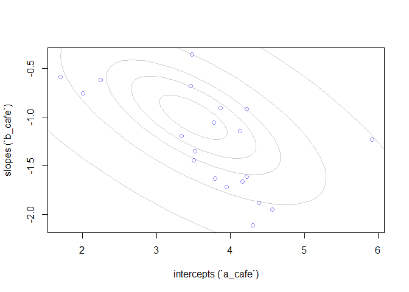<!-- -->

### 14.1.2 Simulate observations

-   The above gives the properties of 20 individual cafes.
-   Now let’s simulate 10 visits at each — 5 in the morning and 5 in the
    afternoon.

``` r
set.seed(22)
N_visits <- 10
afternoon <- rep(0:1, N_visits * N_cafes/2)
cafe_id <- rep(1:N_cafes, each = N_visits)
mu <- a_cafe[cafe_id] + b_cafe[cafe_id]*afternoon
sigma <- 0.5 # std dev within cafes
wait <- rnorm(N_visits * N_cafes, mu, sigma)
d <- data.frame(cafe = cafe_id, afternoon = afternoon, wait = wait)

str(d)
```

    ## 'data.frame':    200 obs. of  3 variables:
    ##  $ cafe     : int  1 1 1 1 1 1 1 1 1 1 ...
    ##  $ afternoon: int  0 1 0 1 0 1 0 1 0 1 ...
    ##  $ wait     : num  3.97 3.86 4.73 2.76 4.12 ...

-   Some rethinking — here we’re simulating data then analyzing with a
    model that reflects the exact correct structure of the data
    generating process. In the real world, we’re never so lucky.
-   We’re always forced to analyze data with a model that is
    *misspecified* — that is, the model is different than the true data
    generating process.

### 14.1.3 The varying slopes model

-   Now let’s do the reverse!

$$
\begin{gather}
W_i \sim \text{Normal}(\mu_i, \sigma) \\
\mu_i = \alpha_{\text{CAFE}[i]} + \beta_{\text{CAFE}[i]} A_i \\
\begin{bmatrix}
\alpha_{\text{CAFE}} \\
\beta_{\text{CAFE}}
\end{bmatrix}
\sim \text{MVNormal}
\left(\begin{bmatrix} \alpha \\ \beta \end{bmatrix}, \text{S}\right) \\
\text{S} = \begin{pmatrix} \sigma_\alpha & 0 \\ 0 & \sigma_\beta \end{pmatrix} \text{R} \begin{pmatrix} \sigma_\alpha & 0 \\ 0 & \sigma_\beta \end{pmatrix} \\
\alpha \sim \text{Normal}(5, 2) \\
\beta \sim \text{Normal}(-1, 0.5) \\
\sigma \sim \text{Exponential}(1) \\
\sigma_\alpha \sim \text{Exponential}(1) \\
\sigma_\beta \sim \text{Exponential}(1) \\
\text{R} \sim \text{LKJcorr}(2)
\end{gather}
$$

-   Okay, lots to unpack here — the wait time $W_i$ is defined by a
    linear model.
-   The terms of that linear model stat that each cafe has an intercept
    $\alpha_{\text{CAFE}}$ and slope $\beta_{\text{CAFE}}$ whose prior
    distribution is defined by the two-dimensional Gaussian with means
    $\alpha$ and $\beta$ and covariance matrix $\text{S}$.
-   This prior will adaptively regularize the individual intercepts,
    slopes, and the correlation among them.
-   $\text{S}$ can be factored into separate standard deviations
    $\sigma_\alpha$ and $\sigma_\beta$ and a correlation matrix
    $\text{R}$.
-   Then come all our hyper-priors that do the adaptive regularization.
-   The prior for $\text{R}$ is a “distribution of matrices”. In our
    case, $\text{R}$ looks like this:

$$
\begin{gather}
R = \begin{pmatrix} 1 & \rho \\ \rho & 1 \end{pmatrix}
\end{gather}
$$

-   $\rho$ is the correlation between intercepts and slopes (in larger
    matrices with additional varying slopes, it gets more complicated).
-   A $\text{LKJcorr}$ distribution takes a single parameter $\eta$ to
    control how skeptical the prior is of extremely high correlations.
-   $\eta = 1$ is a flat prior and $\eta = 2$ means that the prior is
    weakly skeptical of extreme correlations near -1 or +1.
-   Here’s a few visualizations just for kicks:

``` r
R <- rlkjcorr(1e4, K = 2, eta = 2)
dens(R[,1,2], xlab = "correlation")
```

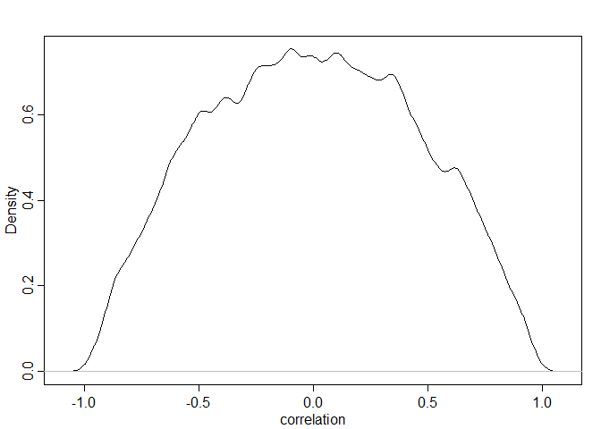<!-- -->

-   Let’s model! (note the use of `c()`)

``` r
set.seed(867530)
m14.1 <-
  ulam(
    alist(
      # model
      wait ~ normal(mu, sigma),
      mu <- a_cafe[cafe] + b_cafe[cafe] * afternoon,
      
      # priors
      c(a_cafe, b_cafe)[cafe] ~ multi_normal(c(a, b), Rho, sigma_cafe),
      
      # hyper-priors
      a ~ normal(5, 2),
      b ~ normal(-1, 0.5),
      sigma_cafe ~ exponential(1),
      sigma ~ exponential(1),
      Rho ~ lkj_corr(2)
    ),
    
    data = d,
    chains = 4,
    cores = 4
  )
```

-   The `multi_normal` distribution takes a vector of means, `c(a, b)`,
    a correlation matrix, `Rho`, and a vector of standard deviations,
    `sigma_cafe`, then constructs the matrix internally.
-   The `stancode()` shows how.

``` r
stancode(m14.1)
```

    ## data{
    ##      vector[200] wait;
    ##     array[200] int afternoon;
    ##     array[200] int cafe;
    ## }
    ## parameters{
    ##      vector[20] b_cafe;
    ##      vector[20] a_cafe;
    ##      real a;
    ##      real b;
    ##      vector<lower=0>[2] sigma_cafe;
    ##      real<lower=0> sigma;
    ##      corr_matrix[2] Rho;
    ## }
    ## model{
    ##      vector[200] mu;
    ##     Rho ~ lkj_corr( 2 );
    ##     sigma ~ exponential( 1 );
    ##     sigma_cafe ~ exponential( 1 );
    ##     b ~ normal( -1 , 0.5 );
    ##     a ~ normal( 5 , 2 );
    ##     {
    ##     vector[2] YY[20];
    ##     vector[2] MU;
    ##     MU = [ a , b ]';
    ##     for ( j in 1:20 ) YY[j] = [ a_cafe[j] , b_cafe[j] ]';
    ##     YY ~ multi_normal( MU , quad_form_diag(Rho , sigma_cafe) );
    ##     }
    ##     for ( i in 1:200 ) {
    ##         mu[i] = a_cafe[cafe[i]] + b_cafe[cafe[i]] * afternoon[i];
    ##     }
    ##     wait ~ normal( mu , sigma );
    ## }

-   Let’s jump into inspecting the posterior distribution.

``` r
plot_posterior_correlation <- function(model, eta) {
  
  post <- extract.samples(model)
  dens(post$Rho[,1,2], xlim = c(-1, 1), col = rangi2, lwd = 1) # posterior
  R <- rlkjcorr(1e4, K = 2, eta) # prior
  dens(R[,1,2], add = TRUE, lty = 2)
  
}

plot_posterior_correlation(m14.1, 2)
```

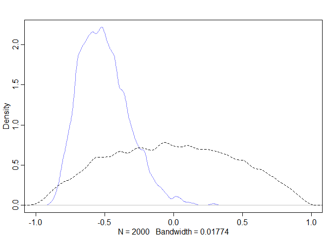<!-- -->

-   The posterior distribution of correlation between intercepts and
    slopes is mostly negative, whereas the prior is spread evenly.
-   Per McElreath’s suggestion, let’s fit models with different priors
    for the correlation.

``` r
# flat prior model
m14.1_flat <-
  ulam(
    alist(
      # model
      wait ~ normal(mu, sigma),
      mu <- a_cafe[cafe] + b_cafe[cafe]*afternoon,
      
      # priors
      c(a_cafe, b_cafe)[cafe] ~ multi_normal(c(a, b), Rho, sigma_cafe),
      
      # hyper-priors
      a ~ normal(5, 2),
      b ~ normal(-1, 0.5),
      sigma_cafe ~ exponential(1),
      sigma ~ exponential(1),
      Rho ~ lkj_corr(1)
    ),
    
    data = d,
    chains = 4,
    cores = 4
  )

plot_posterior_correlation(m14.1_flat, 1)
```

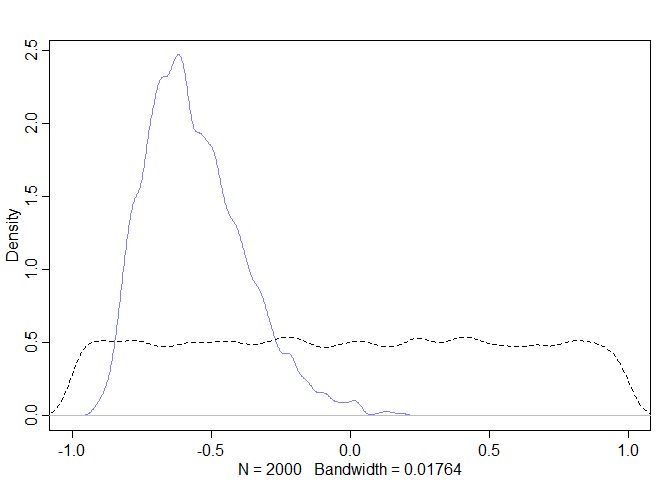<!-- -->

``` r
# strongly regularized
m14.1_strong <-
  ulam(
    alist(
      # model
      wait ~ normal(mu, sigma),
      mu <- a_cafe[cafe] + b_cafe[cafe]*afternoon,
      
      # priors
      c(a_cafe, b_cafe)[cafe] ~ multi_normal(c(a, b), Rho, sigma_cafe),
      a ~ normal(5, 2),
      b ~ normal(-1, 0.5),
      sigma_cafe ~ exponential(1),
      sigma ~ exponential(1),
      Rho ~ lkj_corr(4)
    ),
    
    data = d,
    chains = 4, 
    cores = 4
  )

plot_posterior_correlation(m14.1_strong, 4)
```

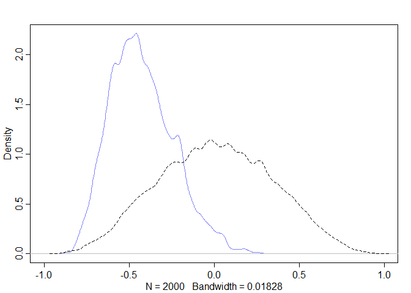<!-- -->

-   Next, let’s consider shrinkage. Information is pooled across
    intercepts and slopes of each cafe through an inferred correlation.
-   Let’s plot the posterior mean varying effects compared to the raw
    unpooled estimates to see the consequence of shrinkage.

``` r
# compute the unpooled estimates directly from the data
a1 <- sapply(1:N_cafes, function(i) mean(wait[cafe_id == i & afternoon == 0]))
b1 <- sapply(1:N_cafes, function(i) mean(wait[cafe_id == i & afternoon == 1])) - a1

# extract posterior means of partially pooled estimates
post <- extract.samples(m14.1)
a2 <- apply(post$a_cafe, 2, mean)
b2 <- apply(post$b_cafe, 2, mean)

# plot both & connect with lines
plot(
  a1, 
  b1,
  xlab = "intercept",
  ylab = "slope",
  pch = 16, 
  col = rangi2,
  ylim = c(min(b1) - 0.1, max(b1) + 0.1),
  xlim = c(min(a1) - 0.1, max(a1) + 0.1)
)
points(a2, b2, pch = 1)
for (i in 1:N_cafes) lines(c(a1[i], a2[i]), c(b1[i], b2[i]))

# compute the posterior mean bivariate gaussian
Mu_est <- c(mean(post$a), mean(post$b))
rho_est <- mean(post$Rho[,1,2])
sa_est <- mean(post$sigma_cafe[,1])
sb_est <- mean(post$sigma_cafe[,2])
cov_ab <- sa_est*sb_est*rho_est
Sigma_est <- matrix(c(sa_est^2, cov_ab, cov_ab, sb_est^2), ncol = 2)

# draw contours
for (i in c(0.1, 0.3, 0.5, 0.7, 0.9))
  lines(ellipse::ellipse(Sigma_est, centre = Mu_est, level = i),
        col = col.alpha("black", 0.2))
```

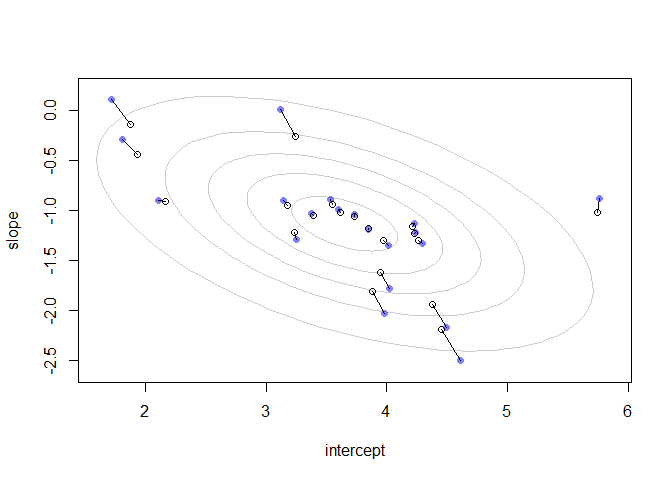<!-- -->

-   The open points are the posterior means & the blue points are
    unpooled estimates.
-   Note that shrinkage is not always in a direct line towards the
    center.
-   We can also look at the same information on the outcome scale

``` r
# convert varying effects to waiting times
wait_morning_1 <- a1
wait_afternoon_1 <- a1 + b1
wait_morning_2 <- a2
wait_afternoon_2 <- a2 + b2

# plot both & connect with lines
plot(
  wait_morning_1,
  wait_afternoon_1,
  xlab = "morning wait",
  ylab = "afternoon wait",
  pch = 16,
  col = rangi2,
  xlim = c(min(wait_morning_1) - 0.1, max(wait_morning_1) + 0.1),
  ylim = c(min(wait_afternoon_1) - 0.1, max(wait_afternoon_1) + 0.1)
)
points(wait_morning_2, wait_afternoon_2, pch = 1)
for (i in 1:N_cafes)
  lines(c(wait_morning_1[i], wait_morning_2[i]),
        c(wait_afternoon_1[i], wait_afternoon_2[i]))

# add line for y = x
abline(a = 0, b = 1, lty = 2)

# add shrinkage distribution by simulation
v <- MASS::mvrnorm(1e4, Mu_est, Sigma_est)
v[,2] <- v[,1] + v[,2] # calculate afternoon wait
Sigma_est2 <- cov(v)
Mu_est2 <- Mu_est
Mu_est2[2] <- Mu_est[1] + Mu_est[2]

# draw contours
for (i in c(0.1, 0.3, 0.5, 0.7, 0.9))
  lines(ellipse::ellipse(Sigma_est2, centre = Mu_est2, level = i),
        col = col.alpha("black", 0.5))
```

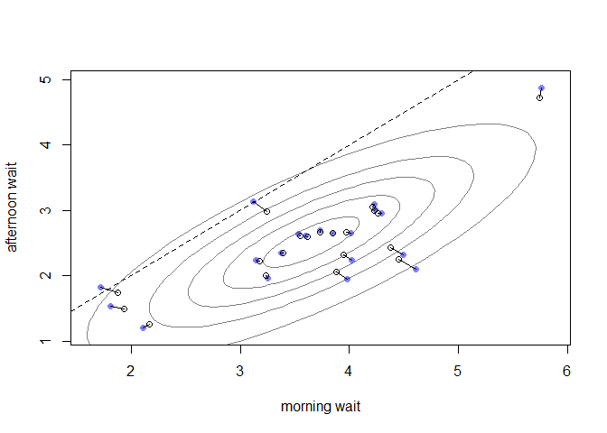<!-- -->

-   Appreciate the fact that shrinkage on the parameter scale
    *naturally* produces shrinkage on the scale we actually care about:
    the outcome scale.
-   Also, there is an implied population of wait times shown by the gray
    contours.
-   That population is potively correlated — cafes with long morning
    waits tend to also have long afternoon waits. But the wait times in
    the morning across the board are generally longer than the afternoon
    (under the dashed line).

## 14.2 Advanced varying slopes

-   Nice! But now let’s look at more than two varying effects — varying
    intercepts + more than one varying slope — as well as more than one
    type of cluster.
-   Let’s return to the chimpanzee data which introduced
    *cross-classification* with two varying intercepts for different
    clusters: actors and blocks. We also modeled the experiment with two
    different slopes: one for the effect of the prosocial option and one
    for the interaction of the prosocial option and the presence of
    another chimp.
-   We’ll also re-emphasize the importance of *non-centered
    parameterization*.
-   Here’s our baseline model:

$$
\begin{align*} 
L_i & \sim \text{Binomial}(1, p_i) \\
\text{logit(p_i)} & = \gamma_{\text{TID}[i]} + \alpha_{\text{ACTOR}[i], \text{TID}[i]} + \beta_{\text{BLOCK}[i], \text{TID}[i]}
\end{align*}
$$

-   The linear model for $\text{logit}(p_i)$ ncludes an average log-odds
    for each treatment, $\gamma_{\text{TID}[i]}$, an effect for each
    actor in each treatment, $\alpha_{\text{ACTOR}[i],\text{TID}[i]}$,
    and finally an effect for each block in each treatment,
    $\beta_{\text{BLOCK}[i],\text{TID}[i]}$.
-   This is essentially an interaction model allowing each treatment to
    vary by each actor and each block — the average treatment effect can
    vary by block and each individual chimpanzee can also respond
    (across blocks) to each treatment differently.
-   There are a total of $4 + 7 \times 4 + 6 \times 4 = 56$ paramters in
    this model so we really need pooling.
-   We’ll need two multivariate Gaussian priors, which are both
    4-dimensional in this example because there are 4 treatments:

$$
\begin{align*} 
L_i & \sim \text{Binomial}(1, p_i) \\
\text{logit(p_i)} & = \gamma_{\text{TID}[i]} + \alpha_{\text{ACTOR}[i], \text{TID}[i]} + \beta_{\text{BLOCK}[i], \text{TID}[i]} \\
\begin{bmatrix}
\alpha_{j, 1]} \\ \alpha_{j,2} \\ \alpha_{j,3} \\ \alpha_{j,4}
\end{bmatrix}
& \sim \text{MVNormal}
\begin{pmatrix}
\begin{bmatrix}
0 \\ 0 \\ 0 \\ 0
\end{bmatrix}, S_{\text{ACTOR}}
\end{pmatrix}
\\
\begin{bmatrix}
\beta_{j,1} \\ \beta_{j,2} \\ \beta_{j,3} \\ \beta_{j,4}
\end{bmatrix}
& \sim \text{MVNormal}
\begin{pmatrix}
\begin{bmatrix}
0 \\ 0 \\ 0 \\ 0
\end{bmatrix}, S_{\text{BLOCK}}
\end{pmatrix}
\end{align*}
$$

-   All that matrix math is just noting that the actors and blocks come
    from two different statistical populations, but within each the 4
    features of each actor or block are related through a covariance
    matrix $S$ specific to that population.
-   We don’t need means for these priors because we already placed the
    the average treatment effect $\gamma$ in the linear model.

``` r
# prep data
data("chimpanzees")
d <- chimpanzees
d$block_id <- d$block
d$treatment <- 1L + d$prosoc_left + 2L*d$condition

dat <- 
  list(
    L = d$pulled_left,
    tid = d$treatment,
    actor = d$actor,
    block_id = as.integer(d$block_id)
  )

set.seed(4387510)
m14.2 <-
  ulam(
    alist(
      # model
      L ~ dbinom(1, p),
      logit(p) <- g[tid] + alpha[actor,tid] + beta[block_id,tid],
      
      # adaptive priors
      vector[4]:alpha[actor] ~ multi_normal(0, Rho_actor, sigma_actor),
      vector[4]:beta[block_id] ~ multi_normal(0, Rho_block, sigma_block),
      
      # fixed priors
      g[tid] ~ dnorm(0, 1),
      sigma_actor ~ dexp(1),
      Rho_actor ~ dlkjcorr(4),
      sigma_block ~ dexp(1),
      Rho_block ~ dlkjcorr(4)
    ),
    
    data = dat,
    chains = 4,
    cores = 4
  )
```

    ## Warning: There were 21 divergent transitions after warmup. See
    ## https://mc-stan.org/misc/warnings.html#divergent-transitions-after-warmup
    ## to find out why this is a problem and how to eliminate them.

    ## Warning: Examine the pairs() plot to diagnose sampling problems

    ## Warning: The largest R-hat is NA, indicating chains have not mixed.
    ## Running the chains for more iterations may help. See
    ## https://mc-stan.org/misc/warnings.html#r-hat

    ## Warning: Bulk Effective Samples Size (ESS) is too low, indicating posterior means and medians may be unreliable.
    ## Running the chains for more iterations may help. See
    ## https://mc-stan.org/misc/warnings.html#bulk-ess

    ## Warning: Tail Effective Samples Size (ESS) is too low, indicating posterior variances and tail quantiles may be unreliable.
    ## Running the chains for more iterations may help. See
    ## https://mc-stan.org/misc/warnings.html#tail-ess

-   We get a lot of diagnostic warnings about divergent transitions,
    R-hat, and ESS. Looking at the trace/trank plots shows the chains
    aren’t mixing super well.

``` r
traceplot(m14.2, pars = paste0("beta[", 1:3, ",1]"))
```

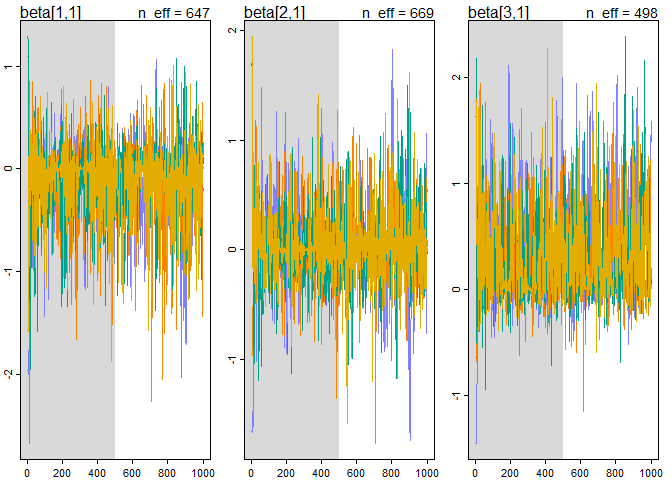<!-- -->

``` r
trankplot(m14.2, pars = paste0("beta[", 1:3, ",1]"))
```

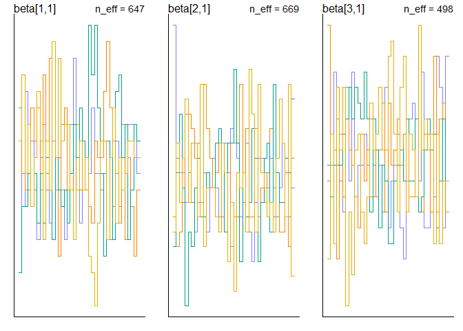<!-- -->

-   To remove, we need to repeat what we did in chapter 9 — factor all
    the parameters out of the adaptive priors and place them instead in
    the linear model.
-   How in the world do we do this with covariance matrices?
-   The basic strategy is the same, just extrapolated to matrices —
    making z-scores for each random of effect. Now, however, we need a
    matrix of z-scores.
-   We then multiply the z-scores into a covariance matrix so we get the
    random effects on the right scale for the linear model.
-   Note the use of `compose_noncentered()` within the model call.

``` r
set.seed(4387510)
m14.3 <- 
  ulam(
    alist(
      # model
      L ~ binomial(1, p),
      logit(p) <- g[tid] + alpha[actor,tid] + beta[block_id,tid],
      
      # non-centered adaptive priors
      transpars> matrix[actor,4]:alpha <- compose_noncentered(sigma_actor, L_Rho_actor, z_actor),
      transpars> matrix[block_id,4]:beta <- compose_noncentered(sigma_block, L_Rho_block, z_block),
      matrix[4,actor]:z_actor ~ normal(0, 1),
      matrix[4, block_id]:z_block ~ normal(0, 1),
      
      # fixed priors
      g[tid] ~ normal(0, 1),
      vector[4]:sigma_actor ~ dexp(1),
      cholesky_factor_corr[4]:L_Rho_actor ~ lkj_corr_cholesky(2),
      vector[4]:sigma_block ~ dexp(1),
      cholesky_factor_corr[4]:L_Rho_block ~ lkj_corr_cholesky(2),
      
      # compute ordinary correlation matrices from cholesky factors
      gq> matrix[4,4]:Rho_actor <<- Chol_to_Corr(L_Rho_actor),
      gq> matrix[4,4]:Rho_block <<- Chol_to_Corr(L_Rho_block)
    ),
    
    data = dat,
    chains = 4,
    cores = 4,
    log_lik = TRUE
  )
```

-   No more divergent transitions!
-   We also have much larger `n_eff` values for `m14.3`

``` r
# extract n_eff values for each model
neff_nc <- precis(m14.3, 3, pars = c("alpha", "beta"))$n_eff
neff_c <- precis(m14.2, 3, pars = c("alpha", "beta"))$n_eff
plot(neff_c, neff_nc,
     xlab = "centered (default)",
     ylab = "non-centered (cholesky)",
     lwd = 1.5)
abline(a = 0, b = 1, lty = 2)
```

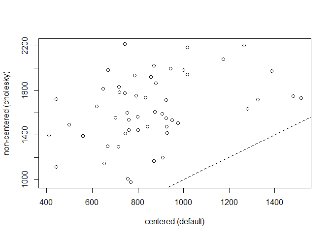<!-- -->

-   The model has 76 parameters: 4 average treatment effects, 4x7
    varying effects on actor, 4x6 varying effects on block, 8 standard
    deviations, and 12 free correlation parameters. Effectively,
    however, the model has only 27 parameters:

``` r
WAIC(m14.3)
```

    ##       WAIC      lppd  penalty  std_err
    ## 1 544.8237 -245.5995 26.81234 19.64687

-   Looking at the standard deviation parameters lets us get a sense of
    how aggressively the varying effects are being penalized:

``` r
precis(m14.3, depth = 2, pars = c("sigma_actor", "sigma_block"))
```

    ##                     mean        sd       5.5%     94.5%     n_eff     Rhat4
    ## sigma_actor[1] 1.3713319 0.4793108 0.77883327 2.2126929  945.9872 0.9994129
    ## sigma_actor[2] 0.9044352 0.3970416 0.40253207 1.5793492 1095.3232 1.0002436
    ## sigma_actor[3] 1.8567998 0.5741257 1.12539123 2.8653507 1228.5106 1.0027312
    ## sigma_actor[4] 1.5981507 0.6201954 0.81280602 2.7155693 1239.6040 1.0024156
    ## sigma_block[1] 0.4161125 0.3394756 0.03661482 0.9992425 1304.9311 0.9998333
    ## sigma_block[2] 0.4373600 0.3404598 0.03975568 1.0392074 1089.1033 1.0017467
    ## sigma_block[3] 0.3055642 0.2718354 0.02457146 0.7877798 1710.3946 0.9985674
    ## sigma_block[4] 0.4568233 0.3600259 0.03681381 1.1098462  995.5532 1.0026160

-   These are just the posterior means, but you can get the sense from
    the small values that the shrinkage is pretty agressive (especially
    for blocks).
-   Let’s also look at posterior predictions for block number 5.

``` r
# compute mean for each actor in each treatment
pl <- by(d$pulled_left, list(d$actor, d$treatment), mean)

# generate posterior predictions using link
datp <-
  list(
    actor = rep(1:7, each = 4),
    tid = rep(1:4, times = 7),
    block_id = rep(5, times = 4*7)
  )

p_post <- link(m14.3, data = datp)
p_mu <- apply(p_post, 2, mean)
p_ci <- apply(p_post, 2, PI)

# set up plot
plot(
  NULL,
  xlim = c(1, 28),
  ylim = c(0, 1),
  xlab = "",
  ylab = "proportion pulled left lever",
  xaxt = "n",
  yaxt = "n"
)

axis(2, at = c(0, 0.5, 1), labels = c(0, 0.5, 1))
abline(h = 0.5, lty = 2)
for (j in 1:7) abline(v = (j-1)*4 + 4.5, lwd = 0.5)
for (j in 1:7) text((j-1)*4 + 2.5, 1.1, concat("actor ", j), xpd = TRUE)

# offset distance ot stagger raw data and predictions
xo <- 0.1

# raw data
for(j in (1:7)[-2]) {
  
  lines((j-1)*4 + c(1, 3) - xo, pl[j, c(1, 3)], lwd = 2, col = rangi2)
  lines((j-1)*4 + c(2, 4) - xo, pl[j, c(2, 4)], lwd = 2, col = rangi2)
  
}
points(1:28 - xo, t(pl), pch = 16, col = "white", cex = 1.7)
points(1:28 - xo, t(pl), pch = c(1, 1, 16, 16), col = rangi2, lwd = 2)

yoff <- 0.175
text(1 - xo, pl[1,1] - yoff, "R/N", pos = 1, cex = 0.8)
text(2 - xo, pl[1,2] + yoff, "L/N", pos = 3, cex = 0.8)
text(3 - xo, pl[1,3] - yoff, "R/P", pos = 1, cex = 0.8)
text(4 - xo, pl[1,4] + yoff, "L/P", pos = 3, cex = 0.8)

# posterior predictions
for (j in (1:7)[-2]) {
  
  lines((j-1)*4 + c(1, 3) + xo, p_mu[(j-1)*4 + c(1, 3)], lwd = 2)
  lines((j-1)*4 + c(2, 4) + xo, p_mu[(j-1)*4 + c(2, 4)], lwd = 2)
  
}

for (i in 1:28) lines(c(i, i) + xo, p_ci[,i], lwd = 1)
points(1:28 + xo, p_mu, pch = 16, col = "white", cex = 1.3)
points(1:28 + xo, p_mu, pch = c(1, 1, 16, 16))
```

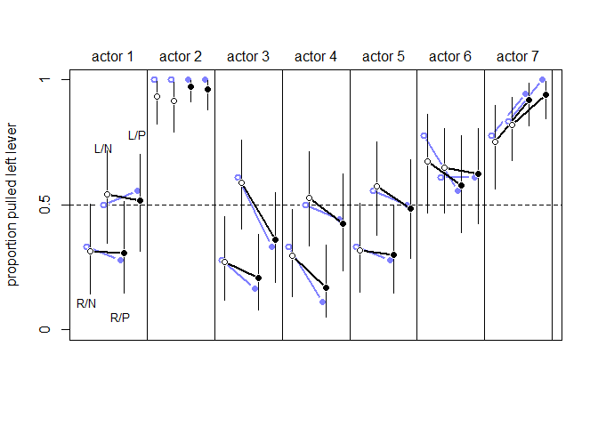<!-- -->

-   Here, the raw data are in blue, the posterior mean & 89% credible
    interval is in black. Open circles are treatments without a partner,
    closed circles are treatments with a partner.
-   This model accommodates a lot more variation among individuals than
    the previous version from chapter 11. Letting each actor have
    his/her own parameters allows this!
-   Notice that the posterior doesn’t just repeat the data — there’s
    shrinkage in several places.
-   Actor 2, for example, *always* pulled the left lever, but the
    posterior predictions shrink inward.
-   They also shrink inwards for some treatments (1/2) more than others
    (3/4). This is because those treatments had less overall variation
    between actors.
-   Our interpretation is unchanged: there is not a consistent change in
    behavior due to the partner treatments.
-   However, we can estimate the distribution of treatments across
    individuals, which is useful!

##### Some overthinking: Non-centered parameterization of the multilevel model

-   Often running inefficient chains long enough will produce reliable
    samples from the posterior. But this is inefficient & unreliable
    (there could be subtle biases)!
-   Cholesky decomposition is a useful trick to smuggle the covariance
    matrix out of the prior.
-   The `transpars>` sections define matrices of varying effects for
    alpha and beta.
-   Each is a matrix with a row for each actor/block and a column for
    each effect.
-   `compose_noncentered()` is taking the cholesky decomposition of
    $\text{R}$ such that $\text{R} = \text{LL}^{\text{T}}$. $\text{L}$
    is the `L_Rho_block`/`L_Rho_actor` line.
-   All this means is that `alpha` and `beta` are now deteriministic
    from the priors, rather than having a sample step in between.
-   The `transformed parameters` block just means that Stan will include
    them in the posterior even though they’re just functions of
    parameters:

``` r
stancode(m14.3)
```

    ## data{
    ##     array[504] int L;
    ##     array[504] int block_id;
    ##     array[504] int actor;
    ##     array[504] int tid;
    ## }
    ## parameters{
    ##      matrix[4,7] z_actor;
    ##      matrix[4,6] z_block;
    ##      vector[4] g;
    ##      vector<lower=0>[4] sigma_actor;
    ##      cholesky_factor_corr[4] L_Rho_actor;
    ##      vector<lower=0>[4] sigma_block;
    ##      cholesky_factor_corr[4] L_Rho_block;
    ## }
    ## transformed parameters{
    ##      matrix[7,4] alpha;
    ##      matrix[6,4] beta;
    ##     beta = (diag_pre_multiply(sigma_block, L_Rho_block) * z_block)';
    ##     alpha = (diag_pre_multiply(sigma_actor, L_Rho_actor) * z_actor)';
    ## }
    ## model{
    ##      vector[504] p;
    ##     L_Rho_block ~ lkj_corr_cholesky( 2 );
    ##     sigma_block ~ exponential( 1 );
    ##     L_Rho_actor ~ lkj_corr_cholesky( 2 );
    ##     sigma_actor ~ exponential( 1 );
    ##     g ~ normal( 0 , 1 );
    ##     to_vector( z_block ) ~ normal( 0 , 1 );
    ##     to_vector( z_actor ) ~ normal( 0 , 1 );
    ##     for ( i in 1:504 ) {
    ##         p[i] = g[tid[i]] + alpha[actor[i], tid[i]] + beta[block_id[i], tid[i]];
    ##         p[i] = inv_logit(p[i]);
    ##     }
    ##     L ~ binomial( 1 , p );
    ## }
    ## generated quantities{
    ##     vector[504] log_lik;
    ##      vector[504] p;
    ##      matrix[4,4] Rho_actor;
    ##      matrix[4,4] Rho_block;
    ##     Rho_block = multiply_lower_tri_self_transpose(L_Rho_block);
    ##     Rho_actor = multiply_lower_tri_self_transpose(L_Rho_actor);
    ##     for ( i in 1:504 ) {
    ##         p[i] = g[tid[i]] + alpha[actor[i], tid[i]] + beta[block_id[i], tid[i]];
    ##         p[i] = inv_logit(p[i]);
    ##     }
    ##     for ( i in 1:504 ) log_lik[i] = binomial_lpmf( L[i] | 1 , p[i] );
    ## }

-   `diag_pre_multiply()` just makes a diagonal matrix from the `sigma`
    vector then multiply, producing a Cholesky factor for the right
    covariance matrix.
-   This is then multiplied by the matrix of z-scores then transposed
    for convenience so we can index as `alpha[actor, effect]` instead of
    `alpha[effect, actor]`.
-   The z scores have a call to `to_vector()` just to ensure that each
    cell in the matrix z has the same `normal(0, 1)` prior.
-   The generated quantities block just runs calculations using the
    variables from each sample. This is used to dtransform the Cholesk
    factors to ordinary correlation matrices so they can be interpreted
    as such.
-   `multiply_lower_tri_self_transpose()` is just a compact way of
    turning the Cholesky factor $\text{L}$ into the corresponding matrix
    $\text{R} = \text{LL}^{\text{T}}$.

## 14.3 Instruments and causal designs

-   Back in chapter 6 we introduced DAGs that graphically connect
    variables to outcomes, often through multiple paths.
-   Some paths are causal, so we want to leave them open. Others are
    non-causal so we want to close these backdoor paths.
-   Sometimes it won’t be possible to close all of the non-causal paths
    or rule out unobserved confounds, but we can still do a little
    clever modeling to allow for causal inference!

### 14.3.1 Instrumental variables

-   What is the impact of education $E$ on wages $W$? We can regress
    education on wages, but there are likely some unobserved confounds
    $U$ that ruin our day:

``` r
library(dagitty)
```

    ## Warning: package 'dagitty' was built under R version 4.2.1

``` r
wages <-
  dagitty(
    "dag{
      U [unobserved]
      U -> E
      U -> W
      E -> W
    }"
  )

coordinates(wages) <-
  list(x = c(E = 1, U = 2, W = 3),
       y = c(E = 1, U = 0, W = 1))

drawdag(wages)
```

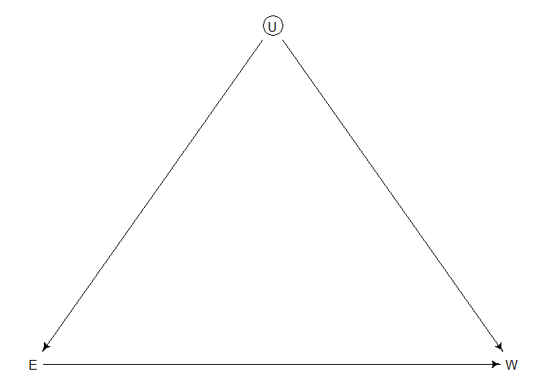<!-- -->

-   We haven’t observed $U$, so we can’t condition on it, but maybe we
    can find a suitable *instrumental variable*.
-   An instrumental variable $Q$ is a variable that satisfies these
    criteria:
    1.  Independent of $U$
    2.  Not independent of $E$
    3.  $Q$ cannot influence $W$ except through $E$
-   In a DAG, it’s a bit easier to understand:

``` r
wages <-
  dagitty(
    "dag{
      U [unobserved]
      Q -> E
      U -> E
      U -> W
      E -> W
    }"
  )

coordinates(wages) <-
  list(x = c(Q = 1, E = 2, U = 3, W = 4),
       y = c(Q = 0, E = 1, U = 0, W = 1))

drawdag(wages)
```

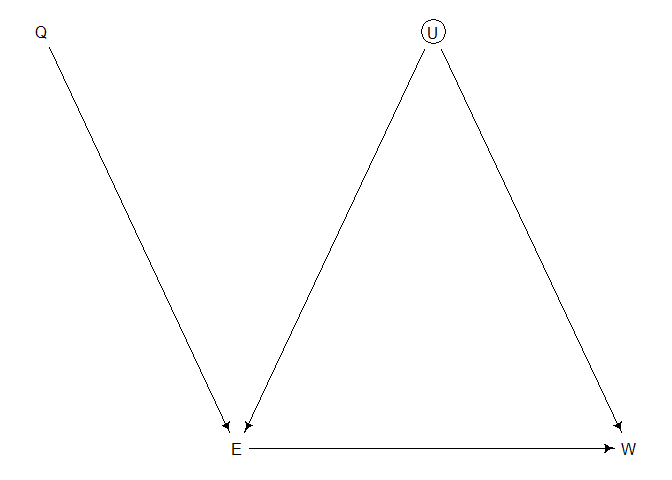<!-- -->

-   $Q$ here is our instrumental variable — how to add it to a model?
-   We can’t just toss it into a regression. There is no backdoor path
    through $Q$, but there still is a non-causal path from $Q$ to $W$
    through $U$: $Q \rightarrow E \leftarrow U \rightarrow W$.
-   Changing $Q$ doesn’t result in any change in $W$ through this path,
    but since we’re conditioning on $E$ in the same model and $E$ is a
    collider of $Q$ and $U$ the non-causal path is open.
-   This confounds the coefficient on $Q$ — it won’t be 0 since it’ll
    pick up on the association between $U$ and $W$ (and as a result, $E$
    gets more confounded).
-   Used this way, $Q$ may become a *bias amplifier*.
-   Let’s simulate some data — suppose $Q$ is the quarter of the year a
    person is born in and this influences education only (this
    influences education because people born earlier in the year tend to
    get less schooling, both because they’re biologically older when
    they start and they become eligible to drop out of school earlier).
    We can simulate some data from this DAG to illustrate how to use $Q$
    properly.

``` r
# simulate data from the DAG
set.seed(73)
N <- 500
U_sim <- rnorm(N)
Q_sim <- sample(1:4, size = N, replace = TRUE)
E_sim <- rnorm(N, U_sim + Q_sim)
W_sim <- rnorm(N, U_sim + 0*E_sim)

# prep for stan
dat_sim <-
  list(
    W = standardize(W_sim),
    E = standardize(E_sim),
    Q = standardize(Q_sim)
  )
```

-   The true effect of $E$ is 0 — if we put up a naive regression, we
    mistakenly find a relationship between $E$ and $W$:

``` r
m14.4 <-
  ulam(
    alist(
      W ~ dnorm(mu, sigma),
      mu <- aW + bEW*E,
      aW ~ dnorm(0, 0.2),
      bEW ~ dnorm(0, 0.5),
      sigma ~ dexp(1)
    ),
    data = dat_sim,
    chains = 4, 
    cores = 4
  )

precis(m14.4)
```

    ##              mean         sd        5.5%      94.5%    n_eff     Rhat4
    ## aW    0.001202152 0.04037652 -0.06347356 0.06607981 1706.487 1.0029059
    ## bEW   0.397292299 0.03973951  0.33541289 0.45833100 1786.064 1.0015440
    ## sigma 0.918847608 0.03116978  0.86996310 0.97097246 1846.831 0.9990899

-   This is just an ordinary confound where $U$ ruins our inference.
-   If we include $Q$ as a predictor, we hit a bit of a disaster:

``` r
m14.5 <-
  ulam(
    alist(
      W ~ dnorm(mu, sigma),
      mu <- aW + bEW*E + bQW*Q,
      aW ~ dnorm(0, 0.2),
      bEW ~ dnorm(0, 0.5),
      bQW ~ dnorm(0, 0.5),
      sigma ~ dexp(1)
    ),
    data = dat_sim,
    chains = 4,
    cores = 4
  )

precis(m14.5)
```

    ##               mean         sd        5.5%       94.5%    n_eff     Rhat4
    ## aW    -0.001420348 0.03796389 -0.06310167  0.05880091 1859.084 0.9994690
    ## bEW    0.636837583 0.04656647  0.56318393  0.71159853 1394.526 1.0023708
    ## bQW   -0.404594622 0.04705495 -0.47999277 -0.33128785 1495.233 1.0041473
    ## sigma  0.856158001 0.02734498  0.81318830  0.90082169 1805.371 0.9990282

-   Here, `bQW` finds an association through $U$ and `bEW` is even
    further from the truth (bias amplification!).
-   Now for the model that correctly uses $Q$:

$$
\begin{align*}
W_i & \sim \text{Normal}(\mu_{w, i}, \sigma_w) \\
\mu_{w, i} & = \alpha_w + \beta_{ew} E_i + U_i \\
E_i & \sim \text{Normal}(\mu_{e, i}, \sigma_e) \\
\mu_{e, i} & = \alpha_e + \beta_{qe} Q_i + U_i \\
Q_i & \sim \text{Categorical}([0.25, 0.25, 0.25, 0.25]) \\
U_i & \sim \text{Normal}(0, 1)
\end{align*}
$$

-   Wow that’s a lot of wonk in a model — we could treat $U_i$ values as
    missing data & impute them, but we won’t see how to do so until the
    next chapter.
-   A more efficient way is to use the covariance between $W$ and $E$:

$$
\begin{align*}
\begin{pmatrix} W_i \\ E_i \end{pmatrix} 
& \sim \text{MVNormal}
\begin{pmatrix}
\begin{pmatrix}
\mu_{w, i} \\ \mu_{e, i}
\end{pmatrix}, S
\end{pmatrix} \\
\mu_{w, i} & = \alpha_w + \beta_{ew} E_i \\
\mu_{e, i} & = \alpha_e + \beta_{qe} Q_i
\end{align*}
$$

-   This gives us a *multivariate linear model* — a regression with
    multiple outcomes. Here $S$ isn’t the descriptive covariance between
    variables, but the matrix equivalent of a typical $\sigma$ that we
    put into regular Gaussian regressions.
-   It may seem weird to have $E$ as both an outcome and a predictor —
    but this is a statistical relationship of the DAG & there’s nothing
    illegal about it.

``` r
m14.6 <-
  ulam(
    alist(
      c(W, E) ~ multi_normal(c(muW, muE), Rho, Sigma),
      muW <- aW + bEW*E,
      muE <- aE + bQE*Q,
      c(aW, aE) ~ normal(0, 0.2),
      c(bEW, bQE) ~ normal(0, 0.5),
      Rho ~ lkj_corr(2),
      Sigma ~ exponential(1)
    ),
    data = dat_sim,
    chains = 4,
    cores = 4
  )

precis(m14.6, depth = 3)
```

    ##                   mean           sd        5.5%      94.5%     n_eff     Rhat4
    ## aE        0.0005860671 3.524882e-02 -0.05518997 0.05854603 1252.2155 1.0045501
    ## aW        0.0001002765 4.470421e-02 -0.07179647 0.06960390 1324.5154 1.0003266
    ## bQE       0.5880281968 3.570527e-02  0.53087931 0.64550948 1093.1261 1.0013553
    ## bEW      -0.0517993567 7.830728e-02 -0.17755412 0.06840691  768.0384 1.0081419
    ## Rho[1,1]  1.0000000000 0.000000e+00  1.00000000 1.00000000       NaN       NaN
    ## Rho[1,2]  0.5437002594 5.345918e-02  0.45404924 0.62598226  972.9080 1.0062702
    ## Rho[2,1]  0.5437002594 5.345918e-02  0.45404924 0.62598226  972.9080 1.0062702
    ## Rho[2,2]  1.0000000000 7.820953e-17  1.00000000 1.00000000 1695.8467 0.9979980
    ## Sigma[1]  1.0258297083 4.857538e-02  0.95330462 1.10718216 1018.7797 1.0067045
    ## Sigma[2]  0.8091442654 2.610979e-02  0.76843024 0.85188647 1509.3109 0.9998755

-   Now, `bEW` is small and the credible interval straddles both sides
    of 0.
-   The correlation `Rho[1,2]` between wages and education is positive
    (reflecting the common influence of $U$).
-   If we instead have a negative influence from $U \rightarrow W$ and a
    positive influnce $U \rightarrow E \rightarrow W$ we get something
    different:

``` r
# simulate new data
set.seed(73)
N <- 500
U_sim <- rnorm(N)
Q_sim <- sample(1:4, size = N, replace = TRUE)
E_sim <- rnorm(N, U_sim + Q_sim)
W_sim <- rnorm(N, -U_sim + 0.2 * E_sim)
dat_sim <-
  list(
    W = standardize(W_sim),
    E = standardize(E_sim),
    Q = standardize(Q_sim)
  )

# rerun model (w/o compiling)
m14.6x <- 
  ulam(
    m14.6,
    data = dat_sim,
    chains = 4,
    cores = 4
  )

precis(m14.6x, depth = 3)
```

    ##                  mean           sd        5.5%       94.5%    n_eff     Rhat4
    ## aE       -0.001895028 3.519788e-02 -0.05810797  0.05468955 1683.905 1.0005343
    ## aW        0.001860427 4.655756e-02 -0.07273824  0.07780051 1515.965 1.0010341
    ## bQE       0.590873478 3.510018e-02  0.53447852  0.64467164 1505.538 1.0007144
    ## bEW       0.280352397 8.107522e-02  0.15158901  0.41494731 1109.470 1.0002916
    ## Rho[1,1]  1.000000000 0.000000e+00  1.00000000  1.00000000      NaN       NaN
    ## Rho[1,2] -0.458105508 5.961482e-02 -0.54890352 -0.35635440 1074.719 0.9999945
    ## Rho[2,1] -0.458105508 5.961482e-02 -0.54890352 -0.35635440 1074.719 0.9999945
    ## Rho[2,2]  1.000000000 8.137781e-17  1.00000000  1.00000000 1799.476 0.9979980
    ## Sigma[1]  1.072896079 4.575653e-02  1.00219539  1.14806131 1114.044 1.0012604
    ## Sigma[2]  0.808360919 2.600264e-02  0.76725811  0.85062110 1864.268 1.0002832

-   Now $E$ and $W$ have a negative correlation in their residual
    variance because the confound positvely influences one and
    negatively influences the other.
-   The `{dagitty}` package can also help find instruments if present in
    a DAG (this is more helpful for more complicated DAGs):

``` r
instrumentalVariables(wages, exposure = "E", outcome = "W")
```

    ##  Q

-   The hardest part of instrumental variables is believing in any
    particular instrument.
-   If you believe you DAG, they’re easy to believe, but should you
    believe in your DAG?
-   For example, the distance from a healthcare facility *may* be an
    instrument that influences the use of health care but does not
    influence health directly. But it’s not hard to think of ways that
    distance from a hospital could be associated with factors
    influencing health.
-   In general, we always need scientific knowledge outside of data to
    make sense of the data.

### 14.3.2 Other designs

-   Instrumental variables are essentially natural experiments that
    impersonate randomized experiments.
-   There are potentially other ways to find natural experiments — not
    all instrumental variables. For example, there is something called
    the *Front-Door Criterion* (in addition to the backdoor criterion
    that was introduced in Chapter 6):

``` r
front_door <- 
  dagitty(
    "dag{
      U [unobserved]
      U -> X
      U -> Y
      X -> Z
      Z -> Y
    }"
  )

coordinates(front_door) <-
  list(x = c(X = 1, Z = 2, U = 2, Y = 3),
       y = c(X = 1, Z = 1, U = 0, Y = 1))

drawdag(front_door)
```

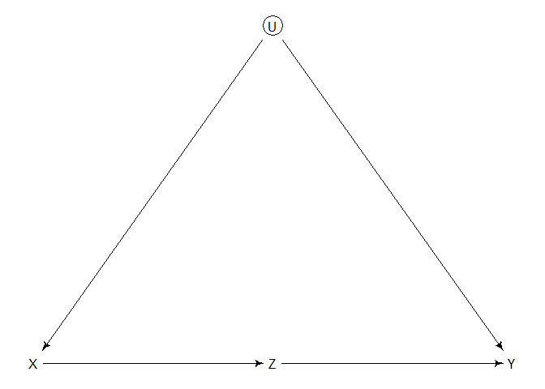<!-- -->

-   Here, we’re interested in the causal influence of $X$ on $Y$, but
    there’s an unobserved confound $U$.
-   If we can find a mediator $Z$ then we can possibly estimate the
    causal effect of $X$ on $Y$.
-   This front door criterion isn’t often used, but a more common design
    is a *Regression Discontinuity* (or *RDD*).
-   Suppose we want to estimate the effect of winning an academic award
    on future success — this is confounded by many unobserved factors.
-   But if we compare individuals who were just below the cutoff to
    individuals who were just above, these should be similar in the
    unobserved factors.
-   RDD fits one trend for individuals just above the cutoff and another
    to individuals just below.

## 14.4 Social relations as correlated varying effects

-   The basic strategy of using covariance matrices to represent
    populations of correlated effects is a superpower that lets you
    accomplish tons of scientific & modeling goals.
-   Let’s look at the Koster Leckie data with the goal of modeling gift
    exchanges between dyads of houses in a Nicaraguan community.

``` r
data(KosterLeckie)
plot(kl_dyads$giftsAB, kl_dyads$giftsBA)
```

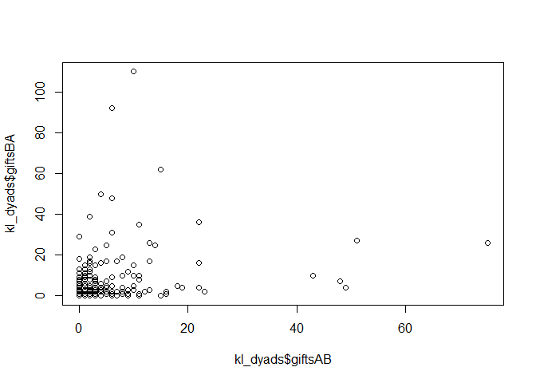<!-- -->

-   The overall correlation os 0.24, but this isn’t a great measure of
    the balance of exchange.
-   Gifts can be explained by both the special relationship in each dyad
    (some tend to exchange gifts frequently) as well as the fact that
    some households tend to give/receive a lot across all dyads (for
    example, a poor household might not give many gifts but may receive
    many).
-   We want to separate balanced exchange from generalized differences
    in giving/receiving so we’ll use a *Social Relations Model* (SRM) to
    treat them separately.
-   Gifts from $A \rightarrow B$ will be Poisson distributed with a
    combination of varying effects:

$$
\begin{align*}
y_{A \rightarrow B} & \sim \text{Poisson}(\lambda_{AB}) \\
\text{log} \ \lambda_{AB} & = \alpha + g_A + r_B + d_{AB}
\end{align*}
$$

-   Here, $\alpha$ is the average gift giving across all dyads, $g_A$ is
    the generalized giving tendency of household $A$ regardless of dyad,
    $r_B$ is the generalized receiving tendency of household $B$
    regardless of dyad, and $d_{AB}$ is the dyad-specific rate that $A$
    gives to $B$.
-   The corresponding model for the other direction is:

$$
\begin{align*}
y_{B \rightarrow A} & \sim \text{Poisson}(\lambda_{BA}) \\
\text{log} \ \lambda_{BA} & = \alpha + g_B + r_A + d_{BA}
\end{align*}
$$

-   Altogether, this implies that each household $H$ needs varying
    effects for $g_H$ and $r_H$ and each dyad $AB$ needs two varying
    effects $d_{AB}$ and $d_{BA}$.
-   We also want to allow $g$ and $r$ to be correlated — do people who
    give a lot also get a lot?
-   Similarly, we want to allow the dyad effects to be correlated — is
    there balance within the dyads?
-   We can do this with two different multinormal priors:

$$
\begin{align*}
\begin{pmatrix} g_i \\ r_i \end{pmatrix} & \sim \text{MVNormal} \begin{pmatrix} \begin{pmatrix} 0 \\ 0 \end{pmatrix} , \begin{pmatrix} \sigma_d^2 & \sigma_g \sigma_r \rho_{gr} \\ \sigma_g \sigma_r \rho_{gr} & \sigma_r^2 \end{pmatrix} \end{pmatrix} \\
\begin{pmatrix} d_{ij} \\ d_{ji} \end{pmatrix} & \sim \text{MVNormal} \begin{pmatrix} \begin{pmatrix} 0 \\ 0 \end{pmatrix} , \begin{pmatrix} \sigma_d^2 & \sigma_d^2 \rho_d \\ \sigma_d^2 \rho_d & \sigma_d^2\end{pmatrix} \end{pmatrix}
\end{align*}
$$

-   The covariance matrix for $g_i$ and $r_i$ is nothing new, but the
    dyad with households $i$ and $j$ is a little funny. Because the
    labels of households within a dyad are arbitrary, we only need one
    dyad standard deviation parameter $\sigma_d$. But we do need
    $\rho_d$ to estimate the correlation for homes within a dyad.

``` r
# prep data for stan
kl_data <-
  list(
    N = nrow(kl_dyads),
    N_households = max(kl_dyads$hidB),
    did = kl_dyads$did,
    hidA = kl_dyads$hidA,
    hidB = kl_dyads$hidB,
    giftsAB = kl_dyads$giftsAB,
    giftsBA = kl_dyads$giftsBA
  )

# model!
m14.7 <-
  ulam(
    alist(
      # model
      giftsAB ~ poisson(lambdaAB),
      giftsBA ~ poisson(lambdaBA),
      log(lambdaAB) <- a + gr[hidA,1] + gr[hidB,2] + d[did,1],
      log(lambdaBA) <- a + gr[hidB,1] + gr[hidA,2] + d[did,2],
      
      # fixed effect prior
      a ~ normal(0, 1),
      
      # gr matrix of varying effects
      vector[2]:gr[N_households] ~ multi_normal(0, Rho_gr, sigma_gr),
      Rho_gr ~ lkj_corr(4),
      sigma_gr ~ exponential(1),
      
      # dyad effects
      transpars> matrix[N,2]:d <- compose_noncentered(rep_vector(sigma_d, 2), L_Rho_d, z),
      matrix[2,N]:z ~ normal(0, 1),
      cholesky_factor_corr[2]:L_Rho_d ~ lkj_corr_cholesky(8),
      sigma_d ~ exponential(1),
      
      # compute correlation matrix for dyads
      gq> matrix[2,2]:Rho_d <<- Chol_to_Corr(L_Rho_d)
    ),
    
    data = kl_data,
    chains = 4,
    cores = 4,
    iter = 2000
  )
```

-   Some model translation:
    -   The first section defines the two outcomes of the linear model
        for the direction of giving in each dyad. $g$ and $r$ are in the
        same matrix, so the giving effect is `gr[hidA,1]` and the
        receiving effect is `gr[hidA,2]`.
    -   The second chunk is for the varying giving/receiving effects.
    -   The third is for the dyad matrix & is non-centered. The special
        piece is the `rep_vector(sigma_d,2)` call, which copies the
        standard deviation into a vector of length 2.
    -   Finally, there’s the generated quantities block for computing
        the correlation matrix of the dyads. The model is parameterized
        with a Cholesky factor, so if we want to interpret the
        correlations among the effects then we need to to convert the
        Cholesky factor back to a correlation matrix.

``` r
precis(m14.7, depth = 3, pars = c("Rho_gr", "sigma_gr"))
```

    ##                   mean           sd       5.5%       94.5%    n_eff     Rhat4
    ## Rho_gr[1,1]  1.0000000 0.000000e+00  1.0000000  1.00000000      NaN       NaN
    ## Rho_gr[1,2] -0.4128264 1.972881e-01 -0.7075526 -0.07481522 1263.049 1.0011568
    ## Rho_gr[2,1] -0.4128264 1.972881e-01 -0.7075526 -0.07481522 1263.049 1.0011568
    ## Rho_gr[2,2]  1.0000000 8.445322e-17  1.0000000  1.00000000 3746.764 0.9989995
    ## sigma_gr[1]  0.8282594 1.395236e-01  0.6342510  1.07666634 1931.529 1.0004088
    ## sigma_gr[2]  0.4181573 9.119028e-02  0.2870393  0.57431120  907.959 1.0030133

-   The diagonals of covariance matrices are always 1, so we can ignore
    these lines in the output.
-   `Rho_gr[1,2]` and `Rho_gr[2,1]` are actually the same parameter
    because the matrix is symmetric. The negative correlation implies
    that households that give more tend to receive less (& vice versa).
-   `sigma_gr[1]` shows that rates of giving are more variable than
    rates of receiving `sigma_gr[2]`.

``` r
post <- extract.samples(m14.7)
g <- sapply(1:25, function(i) post$a + post$gr[,i,1])
r <- sapply(1:25, function(i) post$a + post$gr[,i,2])
Eg_mu <- apply(exp(g), 2, mean)
Er_mu <- apply(exp(r), 2, mean)

plot(exp(g[,1]), exp(r[,1]))
```

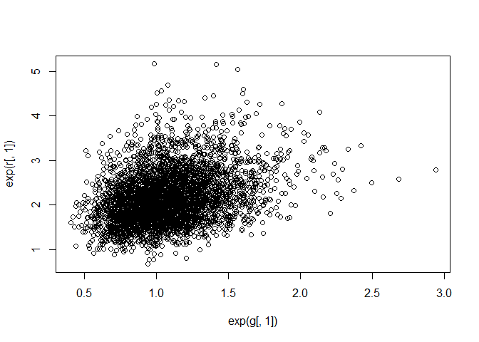<!-- -->

-   The posterior plot above shows the uncertainty in household 1’s
    giving/receiving rate — we can produce a cleaner visualization with
    some contours.

``` r
plot(
  NULL,
  xlim = c(0, 8.6),
  ylim = c(0, 8.6),
  xlab = "generalized giving",
  ylab = "generalized receiving",
  lwd = 1.5
)

abline(a = 0, b = 1, lty = 2)

for(i in 1:25) {
  
  Sigma <- cov(cbind(g[,i], r[,i]))
  Mu <- c(mean(g[,i]), mean(r[,i]))
  el <- ellipse::ellipse(Sigma, centre = Mu, level = 0.5)
  lines(exp(el), col = col.alpha("black", 0.5))
  
}

points(Eg_mu, Er_mu, pch = 21, bg = "white", lwd = 1.5)
```

<!-- -->

-   The covariance results in a negative relationship between giving &
    receiving! This is reflective of the negative relationship we found
    in the output from `precis()`.
-   Note also the wider uncertainty among giving — this corresponds to
    the standard deviation parameters.
-   Let’s look at the dyad effects now:

``` r
precis(m14.7, depth = 3, pars = c("Rho_d", "sigma_d"))
```

    ##                 mean         sd      5.5%     94.5%     n_eff    Rhat4
    ## Rho_d[1,1] 1.0000000 0.00000000 1.0000000 1.0000000       NaN      NaN
    ## Rho_d[1,2] 0.8796603 0.03447442 0.8203463 0.9287663  966.3197 1.001729
    ## Rho_d[2,1] 0.8796603 0.03447442 0.8203463 0.9287663  966.3197 1.001729
    ## Rho_d[2,2] 1.0000000 0.00000000 1.0000000 1.0000000       NaN      NaN
    ## sigma_d    1.1031251 0.05836288 1.0118644 1.1980340 1037.9416 1.001717

-   There is strong positive correlation within dyads. There is also
    more variation among dyads than there is among households in giving
    rates. This implies that the pairs of households are balanced — if
    one gives more on average the other likely gives more on average as
    well (after accounting for generalized giving/receiving).

``` r
dy1 <- apply(post$d[,,1], 2, mean)
dy2 <- apply(post$d[,,2], 2, mean)
plot(dy1, dy2)
abline(a = 0, b = 1, lty = 2)
abline(h = 0, lty = 2)
abline(v = 0, lty = 2)
```

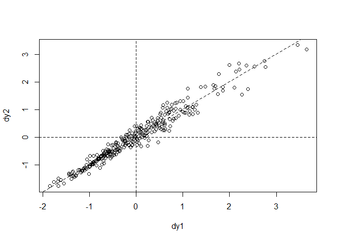<!-- -->

-   There is more information in the dataset that could be used to
    explain the effects we’re seeing here.
-   This is an example of a *social network* model — an important but
    missing feature is *transitivity*.
-   For example, if household A is friends with household B, and
    household B is friends with household C, then households A/C are
    also likely to be friends.
-   Fitting such a model can be done using a *stochastic block model*
    (to do so, we’ll need some more techniques from the next chapter).

## 14.5 Continuous categories and the Gaussian process

-   So far, all the varying effects have been defined over discrete,
    unordered categories. But what about continuous dimensions of
    variation like age or income or stature?
-   We can extend the varying effects approach to continuous categories
    using *Gaussian Process Regression* (which is unfortunately not a
    helpful name).

### 14.5.1 Example: Spatial autocorrelation in Oceanic tools

-   Let’s look back at the tool complexity model from chapter 11 but add
    in spatial relations.
-   For example, if tools were exchanged among societies, then the total
    number of tools for each island are not truly independent of one
    another.

``` r
data("islandsDistMatrix")
Dmat <- islandsDistMatrix
colnames(Dmat) <- c("Ml", "Ti", "SC", "Ya", "Fi", "Tr", "Ch", "Mn", "To", "Ha")
round(Dmat, 1)
```

    ##             Ml  Ti  SC  Ya  Fi  Tr  Ch  Mn  To  Ha
    ## Malekula   0.0 0.5 0.6 4.4 1.2 2.0 3.2 2.8 1.9 5.7
    ## Tikopia    0.5 0.0 0.3 4.2 1.2 2.0 2.9 2.7 2.0 5.3
    ## Santa Cruz 0.6 0.3 0.0 3.9 1.6 1.7 2.6 2.4 2.3 5.4
    ## Yap        4.4 4.2 3.9 0.0 5.4 2.5 1.6 1.6 6.1 7.2
    ## Lau Fiji   1.2 1.2 1.6 5.4 0.0 3.2 4.0 3.9 0.8 4.9
    ## Trobriand  2.0 2.0 1.7 2.5 3.2 0.0 1.8 0.8 3.9 6.7
    ## Chuuk      3.2 2.9 2.6 1.6 4.0 1.8 0.0 1.2 4.8 5.8
    ## Manus      2.8 2.7 2.4 1.6 3.9 0.8 1.2 0.0 4.6 6.7
    ## Tonga      1.9 2.0 2.3 6.1 0.8 3.9 4.8 4.6 0.0 5.0
    ## Hawaii     5.7 5.3 5.4 7.2 4.9 6.7 5.8 6.7 5.0 0.0

-   This is the “as the crow flies” distance. Note the diagonal is all
    0s & the matrix is symmetric about the diagonal.
-   Recall the scientifically derived tool model from chapter 11:

$$
\begin{align*}
T_i & \sim \text{Poisson}(\lambda_i) \\
\lambda_i & = \frac{\alpha P_i^\beta}{\gamma}
\end{align*}
$$

-   We want to have these $\lambda$ values adjusted by a varying
    intercept parameter — we’ll use an exponentiated parameter to ensure
    it stays above 0.

$$
\begin{align*}
T_i & \sim \text{Poisson}(\lambda_i) \\
\lambda_i & = \text{exp}(k_{\text{SOCIETY}[i]}) \frac{\alpha P_i^\beta}{\gamma}
\end{align*}
$$

-   Here, $k_{\text{SOCIETY}[i]}$ is the varying intercept. Unlike
    previous intercepts, however, it’ll be estimated in terms of
    geographic distance rather than category membership.
-   The heart of a Gaussian process is the multivariate prior for the
    intercepts:

$$
\begin{align*}
\begin{pmatrix} k_1 \\ k_2 \\ k_3 \\ \dots \\ k_{10} \end{pmatrix} & \sim \text{MVNormal} \begin{pmatrix} \begin{pmatrix} 0 \\ 0 \\ 0 \\ \dots \\ 0 \end{pmatrix} , \text{K} \end{pmatrix} \\
\text{K}_{ij} & = \eta^2 \ \text{exp}(-\rho^2 D_{ij}^2) + \delta_{ij} \sigma^2
\end{align*}
$$

-   The first line is the 10-dimensional prior for the intercepts (10
    dimensions for the 10 societies in the distance matrix).
-   The covariance matrix for these intercepts $\text{K}$ gives the
    covariance between any pair of societies $i$ and $j$.
-   The unfamiliar formula using $\eta$ $\rho$ and $\sigma$ models how
    covariance among societies changes wit distances between them.
-   $D_{ij}$ is the distance between the $i$-th and $j$-th societies. So
    this function says that the covariance between any two societies
    declines exponentially with the square of the distance between them
    (and $\rho$ is the rate of decline).
-   We don’t necessarily need to square the distance, but it’s often a
    realistic property that covariance declines more quickly as distance
    grows.
-   Here’s a comparison of a linear and square distance fn:

``` r
# linear (dashed)
curve(exp(-1*x), from = 0, to = 4, lty = 2)

# squared (solid)
curve(exp(-1*x^2), add = TRUE)
```

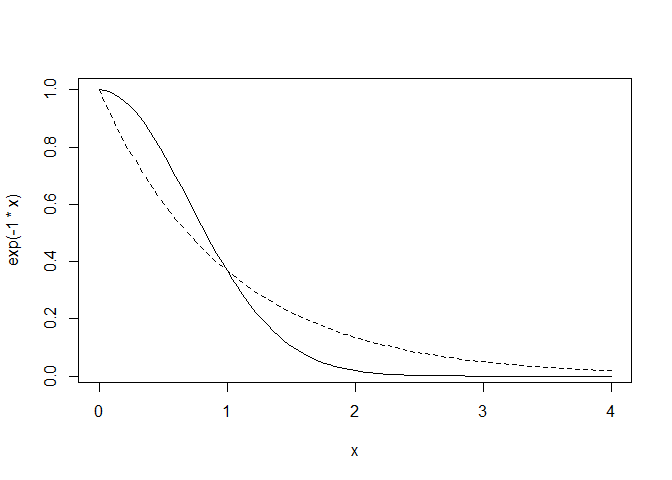<!-- -->

-   $\eta^2$ is the maximum covariance between any two societies.
-   $\delta_{ij}\sigma^2$ provides extra covariance beyond $\eta^2$ when
    $i = j$. The function $\delta_{ij}$ is equal to 1 when $i = j$ but 0
    otherwise.
    -   In the Oceanic data, this doesn’t matter because there’s only
        one observation per society. But if we had more than one
        observation per society, $\sigma$ would describe how those
        observations covary.

$$
\begin{align*}
\eta^2 & \sim \text{Exponential}(2) \\
\rho^2 & \sim \text{Exponential}(0.5)
\end{align*}
$$

-   `GPL2()` will allow us to use a square distance Gaussian process
    prior.

``` r
data(Kline2)
d <- Kline2
d$society <- 1:10 

dat_list <-
  list(
    T = d$total_tools,
    P = d$population,
    society = d$society,
    Dmat = islandsDistMatrix
  )

m14.8 <-
  ulam(
    alist(
      # model
      T ~ dpois(lambda),
      lambda <- (a*P^b/g)*exp(k[society]),
      
      # gaussian process prior
      vector[10]:k ~ multi_normal(0, SIGMA),
      matrix[10,10]:SIGMA <- cov_GPL2(Dmat, etasq, rhosq, 0.01),
      
      # priors
      c(a, b, g) ~ dexp(1),
      etasq ~ dexp(2),
      rhosq ~ dexp(0.5)
    ),
    
    data = dat_list,
    chains = 4,
    cores = 4,
    iter = 2000
  )
```

-   This sampled fine, but we can improve with a non-centered prior for
    $k$.

``` r
precis(m14.8, depth = 3)
```

    ##              mean         sd        5.5%      94.5%     n_eff    Rhat4
    ## k[1]  -0.16555981 0.32362112 -0.65097148 0.30381236  664.4249 1.004998
    ## k[2]  -0.01411406 0.31639533 -0.48626306 0.45609951  603.1247 1.005760
    ## k[3]  -0.06405856 0.30533625 -0.51968729 0.37507037  635.2280 1.005908
    ## k[4]   0.35818222 0.28207258 -0.04877359 0.77685119  678.0959 1.002374
    ## k[5]   0.07979226 0.27789978 -0.31642214 0.48762417  618.8043 1.004256
    ## k[6]  -0.38637411 0.29011911 -0.83939361 0.01118857  668.6409 1.005344
    ## k[7]   0.14831227 0.27031790 -0.24233934 0.53524228  665.1315 1.004638
    ## k[8]  -0.21090216 0.27758351 -0.63433268 0.18073866  668.6471 1.004215
    ## k[9]   0.26623368 0.26129431 -0.11036994 0.64068113  609.0194 1.003238
    ## k[10] -0.17168045 0.35074425 -0.71922829 0.36411874  864.3025 1.002159
    ## g      0.61023509 0.58674581  0.07006034 1.68813293 1633.6328 1.000915
    ## b      0.27963221 0.08651818  0.13906524 0.41386625 1017.8133 1.001785
    ## a      1.38216254 1.07505172  0.22740247 3.45419352 1939.3288 1.000182
    ## etasq  0.20290359 0.20611680  0.03171730 0.55266798  936.7644 1.002286
    ## rhosq  1.32652591 1.68191311  0.07934563 4.37518329 2078.7149 1.000156

-   Let’s try to understand the parameters that describe the covariance
    with distance: `rhosq` and `etasq`.

``` r
post <- extract.samples(m14.8)

# plot the posterior median covariance function
plot(NULL, 
     xlab = "distance (thousand km)",
     ylab = "covariance",
     xlim = c(0, 10),
     ylim = c(0, 2))

# compute the posterior mean covariance
x_seq <- seq(from = 0, to = 10, length.out = 100)
pmcov <- sapply(x_seq, function(x) post$etasq*exp(-post$rhosq*x^2))
pmcov_mu <- apply(pmcov, 2, mean)
lines(x_seq, pmcov_mu, lwd = 3)

# plot 50 functions sampled from the poster
for (i in 1:50)
  curve(post$etasq[i]*exp(-post$rhosq[i]*x^2), 
        add = TRUE,
        col = col.alpha(rangi2, 0.3))
```

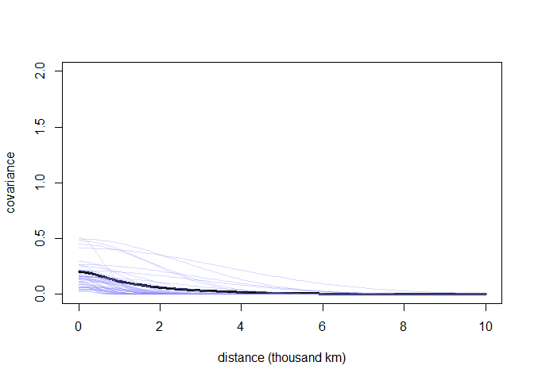<!-- -->

-   There’s a fair amount of uncertainty around the mean posterior
    spatial covariance.
-   Let’s consider the correlations among societies as implied by the
    posterior median by pushing paramters back through the generative
    model:

``` r
# compute posterior median covariance among societies
K <- matrix(0, nrow = 10, ncol = 10)
for (i in 1:10)
  for (j in 1:10)
    K[i,j] <- median(post$etasq) * exp(-median(post$rhosq) * islandsDistMatrix[i,j]^2)

diag(K) <- median(post$etasq) + 0.01

# convert K to a correlation matrix
Rho <- round(cov2cor(K), 2)

# add row/colnames for convenience
colnames(Rho) <- c("Ml", "Ti", "SC", "Ya", "Fi", "Tr", "Ch", "Mn", "To", "Ha")
rownames(Rho) <- colnames(Rho)
Rho
```

    ##      Ml   Ti   SC   Ya   Fi   Tr   Ch   Mn   To Ha
    ## Ml 1.00 0.80 0.70 0.00 0.31 0.05 0.00 0.00 0.08  0
    ## Ti 0.80 1.00 0.87 0.00 0.31 0.05 0.00 0.01 0.06  0
    ## SC 0.70 0.87 1.00 0.00 0.17 0.11 0.01 0.02 0.02  0
    ## Ya 0.00 0.00 0.00 1.00 0.00 0.01 0.16 0.14 0.00  0
    ## Fi 0.31 0.31 0.17 0.00 1.00 0.00 0.00 0.00 0.61  0
    ## Tr 0.05 0.05 0.11 0.01 0.00 1.00 0.09 0.56 0.00  0
    ## Ch 0.00 0.00 0.01 0.16 0.00 0.09 1.00 0.32 0.00  0
    ## Mn 0.00 0.01 0.02 0.14 0.00 0.56 0.32 1.00 0.00  0
    ## To 0.08 0.06 0.02 0.00 0.61 0.00 0.00 0.00 1.00  0
    ## Ha 0.00 0.00 0.00 0.00 0.00 0.00 0.00 0.00 0.00  1

-   There are a small set of islands that are highly correlated with one
    another (Ml/Ti/SC). They also have similar tool totals — though
    recall that this is taking into account the log-population.
-   Hawaii on the other hand is so far from everything that its
    correlation decays to 0 everywhere.

``` r
# scale point size to log-pop
psize <- d$logpop/max(d$logpop)
psize <- exp(psize*1.5) - 2

# plot raw data and labels
plot(
  d$lon2,
  d$lat,
  xlab = "longitude",
  ylab = "latitude",
  col = rangi2, 
  cex = psize,
  pch = 16,
  xlim = c(-50, 30)
)

labels <- as.character(d$culture)
text(d$lon2, d$lat, labels = labels, cex = 0.7, 
     pos = c(2, 4, 3, 3, 4, 1, 3, 2, 4, 2))

# overlay lines shaded by Rho
for (i in 1:10)
  for (j in 1:10)
    if (i < j)
      lines(c(d$lon2[i], d$lon2[j]),
            c(d$lat[i], d$lat[j]),
            lwd = 2,
            col = col.alpha("black", Rho[i,j]^2))
```

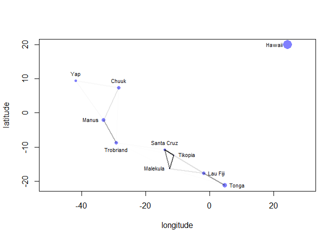<!-- -->

-   Darker connective lines indicate stronger correlations!
-   We can also compare the log-pop and total tools with the shaded
    correlations:

``` r
# compute posterior median relationship, ignoring distance
logpop.seq <- seq(from = 6, to = 14, length.out = 30)
lambda <- sapply(logpop.seq, function(lp) exp(post$a + post$b*lp))
lambda.median <- apply(lambda, 2, median)
lambda.PI80 <- apply(lambda, 2, PI, prob = 0.8)

# plot raw data & labels
plot(
  d$logpop,
  d$total_tools,
  col = rangi2, 
  cex = psize,
  pch = 16,
  xlab = "log population",
  ylab = "total tools"
)

text(d$logpop, d$total_tools, labels = labels, cex = 0.7,
     pos = c(4, 3, 4, 2, 2, 1, 4, 4, 4, 2))

# display posterior predictions
lines(logpop.seq, lambda.median, lty = 2)
lines(logpop.seq, lambda.PI80[1,], lty = 2)
lines(logpop.seq, lambda.PI80[2,], lty = 2)

# overlay correlations
for (i in 1:10)
  for (j in 1:10)
    if (i < j)
      lines(c(d$logpop[i], d$logpop[j]),
            c(d$total_tools[i], d$total_tools[j]),
            lwd = 2, 
            col = col.alpha("black", Rho[i,j]^2))
```

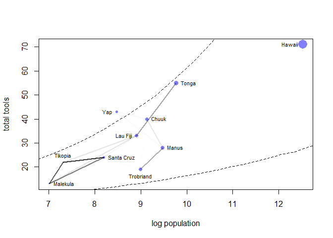<!-- -->

> Note this is a bit different than how it shows up in McElreaths text…

-   Some **overthinking: Non-centered islands**. We can use a Cholesky
    factor to get the non-centered version of a Gaussian process:

``` r
m14.8nc <-
  ulam(
    alist(
      # model
      T ~ dpois(lambda),
      lambda <- (a*P^b)/g*exp(k[society]),
      
      # non-centered gaussian process prior
      transpars> vector[10]: k <<- L_SIGMA*z,
      vector[10]:z ~ normal(0, 1),
      transpars> matrix[10,10]: L_SIGMA <<- cholesky_decompose(SIGMA),
      transpars> matrix[10,10]: SIGMA <- cov_GPL2(Dmat, etasq, rhosq, 0.01),
      
      # priors
      c(a, b, g) ~ dexp(1),
      etasq ~ dexp(2),
      rhosq ~ dexp(0.5)
    ),
    
    data = dat_list,
    chains = 4,
    cores = 4,
    iter = 2000
  )
```

-   The noncentered version uses the Stan function
    `cholesky_decompose()` to take a covariance (or correlation) matrix
    & return the cholesky factor.

### 14.5.2 Example: Phylogenetic distance

-   Distance doesn’t have to be physical — it could also be temporal.
    For example, given two species — how long since a common ancestor?
-   Let’s consider the causal influence of group size $G$ on brain size
    $B$. If we think that living in groups selects for larger brains in
    the evolutionary cycle, then we can end up with a causal time series
    graph:

``` r
brains <-
  dagitty(
    "dag{
      G_1 [unobserved]
      B_1 [unobserved]
      U_1 [unobserved]
      U_2 [unobserved]
      G_1 -> G_2
      G_1 -> B_2
      B_1 -> B_2
      U_1 -> G_2
      U_1 -> B_2
      U_1 -> U_2
    }"
  )

coordinates(brains) <-
  list(x = c(G_1 = 1, B_1 = 1, U_1 = 1, 
             G_2 = 2, B_2 = 2, U_2 = 2),
       y = c(G_1 = 1, B_1 = 2, U_1 = 3,
             G_2 = 1, B_2 = 2, U_2 = 3))

drawdag(brains)
```

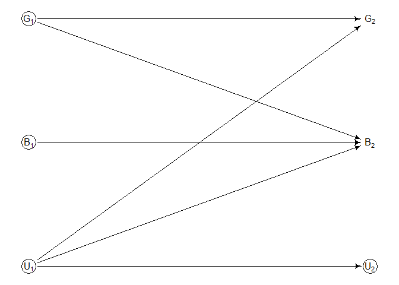<!-- -->

-   We don’t have direct measurements of the past, but need a way to
    estimate its influence. This is where the history of the species
    might help.
-   Recently diverged species in a branching history tend to be more
    similar — phylogenetic relationships, then, expressed as a distance,
    can be used to partially reconstruct confounds.
-   Let’s build out a DAG for our model:

``` r
phylogenetics <-
  dagitty(
    "dag{
      U [unobserved]
      P -> U
      U -> G 
      U -> M
      U -> B
      M -> G
      M -> B
      G -> B
    }"
  )

coordinates(phylogenetics) <-
  list(x = c(G = 1, U = 2, M = 2, B = 3, P = 3),
       y = c(G = 1, U = 3, M = 1.75, B = 1, P = 3))

drawdag(phylogenetics)
```

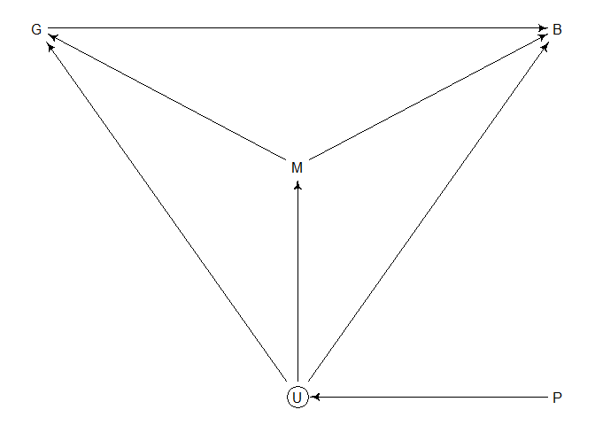<!-- -->

-   Here, we’re mostly interested in $G \rightarrow B$. We want to
    include one known confound for body mass $M$. Unobserved confounds
    $U$ could influence all three variables. We let phylogenetic
    relationships $P$ influence $U$ (since we expect that the
    differences in unobserved traits is influenced by phylogenetic
    distance).
-   There are backdoors between $G$ and $B$ — conditioning on $M$ closes
    one backdoor. We can’t, however, condition on $U$. But $P$ may be
    able to reconstruct the covariation that $U$ induces between $G$ and
    $B$.
-   There is actually a specific name for this — *phylogenetic
    regression*.

``` r
data("Primates301")
data("Primates301_nex")

# plot!
plot(ape::ladderize(Primates301_nex), 
     type = "fan",
     font = 1, 
     no.margin = TRUE,
     label.offset = 1,
     cex = 0.25)
```

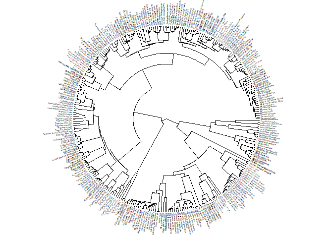<!-- -->

-   See page 479 for a more robust view of the fan. We’ll use this tree
    to model unobserved confounds & deal with the fact that some groups
    of closely related species are overrepresented in nature (there’s a
    lot of lemurs)!
-   This overrepresentation produces an imbalance in sampling, similar
    to ordinary multilevel models.
-   Before we build the phylogenetic regression, let’s run an ordinary
    linear regression where the (log) brain size is a function of the
    (log) group size and (log) body size.
-   We’ll build this ordinary regression in an un-ordinary style:

$$
\begin{align*}
\text{B} & \sim \text{MVNormal}(\mu, \text{S}) \\
\mu_i & = \alpha + \beta_G G_i + \beta_M M_i \\
\text{S} & = \sigma^2 \text{I}
\end{align*}
$$

-   Here, $\sigma$ is just the same standard deviation we’ve used since
    chapter 4 and $\text{I}$ is an *identity matrix*. In essence, it’s a
    correlation matrix where all the correlations are 0.
-   This is just an ordinary linear regression, but thought of as having
    a single multi-variate outcome.

``` r
# prep for stan
d <- Primates301
d$name <- as.character(d$name)
dstan <- d[complete.cases(d$group_size, d$body, d$brain),]
spp_obs <- dstan$name

dat_list <-
  list(
    N_spp = nrow(dstan),
    M = standardize(log(dstan$body)),
    B = standardize(log(dstan$brain)),
    G = standardize(log(dstan$group_size)),
    Imat = diag(nrow(dstan))
  )

# model!
m14.9 <-
  ulam(
    alist(
      # model
      B ~ multi_normal(mu, SIGMA),
      mu <- a + bM*M + bG*G,
      matrix[N_spp,N_spp]: SIGMA <- Imat * sigma_sq,
      
      # priors
      a ~ normal(0, 1),
      c(bM, bG) ~ normal(0, 0.5),
      sigma_sq ~ exponential(1)
    ),
    
    data = dat_list,
    chains = 4,
    cores = 4
  )

precis(m14.9)
```

    ##                  mean          sd        5.5%      94.5%    n_eff     Rhat4
    ## a        9.248674e-05 0.018000433 -0.02883585 0.02949875 1597.073 0.9989689
    ## bG       1.234147e-01 0.022534870  0.08777528 0.16050609 1265.001 1.0007382
    ## bM       8.930620e-01 0.022825042  0.85675013 0.93186998 1212.511 0.9997735
    ## sigma_sq 4.747841e-02 0.005632338  0.03926698 0.05708663 1928.970 0.9985354

-   It looks like there is a reliably positive association between brain
    size & group size, as well as brain size and body mass.
-   Let’s do two types of phylogenetic regression — in both, all we need
    to do is replace the covariance matrix $S$ with a different matrix
    that encodes phylogenetic information.
-   The first is one of the oldest & most conservative — a *Brownian
    motion* interpretation.
-   This just means Gaussian random walks. If species traits drift
    randomly with respect to one another after branching, then the
    covariance between a pair of species ends up being linearly related
    to the phylogenetic branch distance between them.

``` r
# compute covariance/distance matrix
tree_trimmed <- ape::keep.tip(Primates301_nex, spp_obs)
Rbm <- ape::corBrownian(phy = tree_trimmed)
V <- ape::vcv(Rbm)
```

    ## Warning in Initialize.corPhyl(phy, dummy.df): No covariate specified, species
    ## will be taken as ordered in the data frame. To avoid this message, specify a
    ## covariate containing the species names with the 'form' argument.

``` r
Dmat <- ape::cophenetic.phylo(tree_trimmed)
plot(Dmat, V, xlab = "phylogenetic distance", ylab = "covariance")
```

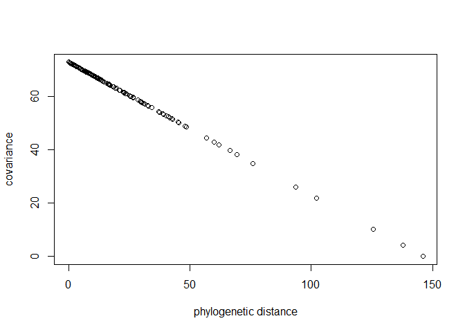<!-- -->

``` r
# V/Dmat are really just inverses of each other:
image(V)
```

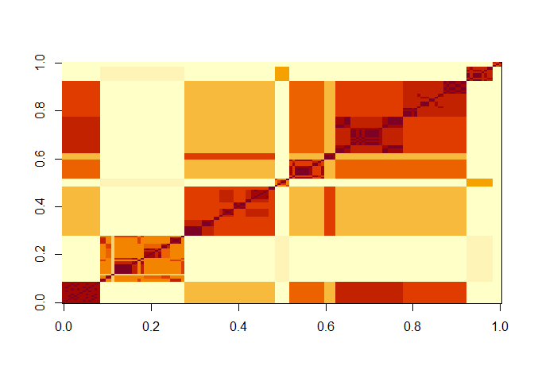<!-- -->

``` r
image(Dmat)
```

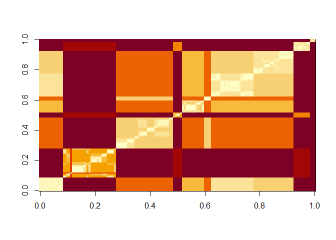<!-- -->

``` r
# put species in right order
dat_list$V <- V[spp_obs, spp_obs]

# convert to correlation matrix
dat_list$R <- dat_list$V / max(V)

# brownian motion model
m14.10 <-
  ulam(
    alist(
      # model
      B ~ multi_normal(mu, SIGMA),
      mu <- a + bM*M + bG*G,
      matrix[N_spp, N_spp]: SIGMA <- R * sigma_sq,
      
      # priors
      a ~ normal(0, 1),
      c(bM, bG) ~ normal(0, 0.5),
      sigma_sq ~ exponential(1)
    ),
    
    data = dat_list,
    chains = 4,
    cores = 4
  )

precis(m14.10)
```

    ##                 mean         sd        5.5%      94.5%    n_eff     Rhat4
    ## a        -0.19499351 0.16251661 -0.45423863 0.06882371 2633.849 0.9990323
    ## bG       -0.01251634 0.01988985 -0.04480033 0.01929201 2650.801 0.9996994
    ## bM        0.70016542 0.03755598  0.64319308 0.75796561 2297.907 1.0009128
    ## sigma_sq  0.16151025 0.01973481  0.13204093 0.19517345 2554.294 0.9985509

-   This model finds that group size has almost no effect on brain size.
    This suggests that there is a lot of clustering of brain size in the
    tree and this produces a spurious relationship with group size.
-   Brownian motion is a special kind of Gaussian process in which
    covariance declines in a very rigid way — there is no need to be so
    rigid.
-   One alternative is the *Ornstein-Uhlenbeck Process* (or OU process),
    which damps Brownian motion down towards some mean.
-   In practice, this constrains variation, making the relationship
    between phylogenetic distance and covariance non-linear.
-   More precisely, the OU process defines the covariance between two
    species $i$ and $j$ as:

$$
\begin{gather}
K(i, j) = \eta^2 \text{exp}(-\rho^2 D_{ij})
\end{gather}
$$

-   This is an exponential distance kernel, so unlike the quadratic
    kernel, covariance between points drops rapidly (see chart from
    beforehand) — this results in less smooth, but harder to fit,
    functions. In practice you’ll need to be very careful about priors.

``` r
# add scaled & reordered distance matrix
dat_list$Dmat <- Dmat[spp_obs, spp_obs]/max(Dmat)

# model!
m14.11 <-
  ulam(
    alist(
      # model
      B ~ multi_normal(mu, SIGMA),
      mu <- a + bM*M + bG*G,
      matrix[N_spp,N_spp]: SIGMA <- cov_GPL1(Dmat, etasq, rhosq, 0.01),
      
      # priors
      a ~ normal(0, 1),
      c(bM, bG) ~ normal(0, 0.5),
      etasq ~ half_normal(1, 0.25),
      rhosq ~ half_normal(3, 0.25)
    ),
    
    data = dat_list,
    chains = 4, 
    cores = 4
  )

precis(m14.11)
```

    ##              mean          sd        5.5%      94.5%    n_eff     Rhat4
    ## a     -0.06499560 0.075692327 -0.18656121 0.05194807 2283.478 0.9987063
    ## bG     0.04974175 0.024392564  0.01118995 0.08917158 2267.322 0.9993039
    ## bM     0.83369000 0.028890277  0.78759221 0.88046998 1970.384 1.0004881
    ## etasq  0.03505871 0.007011065  0.02534395 0.04768256 1663.397 1.0005316
    ## rhosq  2.80033964 0.244831142  2.41452676 3.18104571 2090.311 0.9999394

-   This now finds a small, but mostly positive, association between
    group size and brain size — this is due to the difference between
    the Brownian motion covariance and the OU process.
-   Let’s look at the posterior covariance implied by `etasq` and
    `rhosq` — we’ll need to push them through the Gaussian process
    function to get a more clear idea:

``` r
post <- extract.samples(m14.11)
plot(
  NULL, 
  xlim = c(0, max(dat_list$Dmat)),
  ylim = c(0, 1.5),
  xlab = "phylogenetic distance",
  ylab = "covariance"
)

# posterior
for (i in 1:30)
  curve(post$etasq[i]*exp(-post$rhosq[i]*x), add = TRUE, col = rangi2)

# prior mean & 89% interval
eta <- abs(rnorm(1e3, 1, 0.25))
rho <- abs(rnorm(1e3, 3, 0.25))
d_seq <- seq(from = 0, to = 1, length.out = 50)
K <- sapply(d_seq, function(x) eta*exp(-rho*x))
lines(d_seq, colMeans(K), lwd = 2)
shade(apply(K, 2, PI), d_seq)

# labels
text(0.5, 0.5, "prior")
text(0.2, 0.1, "posterior", col = rangi2)
```

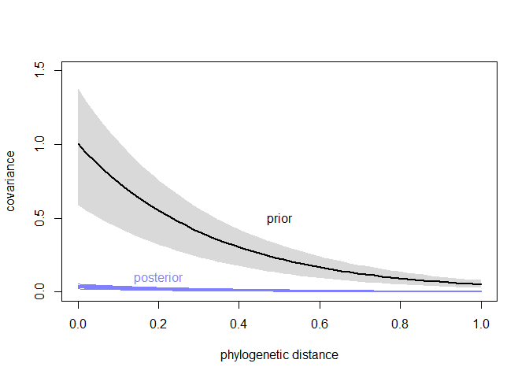<!-- -->

-   Here, the posterior finds little covariance between species at
    basically any distance. There just isn’t a lot of covariance for
    brain sizes, so the distance doesn’t completely explain away the
    association between group size and brain size as it did with the
    Brownian motion model.

## 14.6 Summary

-   This chapter extended the basic multilevel strategy of partial
    pooling to slopes as well as intercepts.
-   We used *a lot* of covariance strategies to do so.
-   The LKJcorr prior was introduced as a convenient family of priors
    for correlation matrices.
-   Gaussian processes extend the varying effects strategy to continuous
    dimensions of similarity — be it spatial, network, phylogenetic, or
    other abstract distances between entities.
-   The next chapter will continue to exted multilevel strategies by
    applying to common problems: measurement error and missing data.
