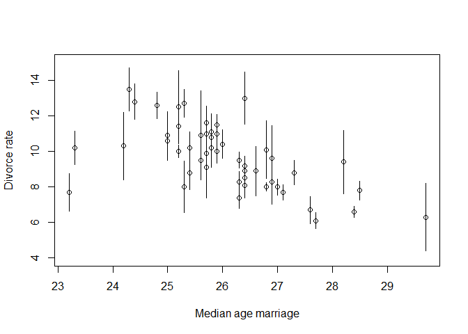
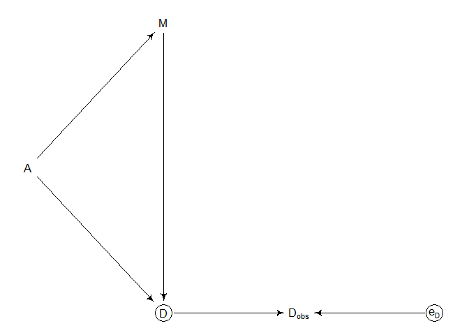
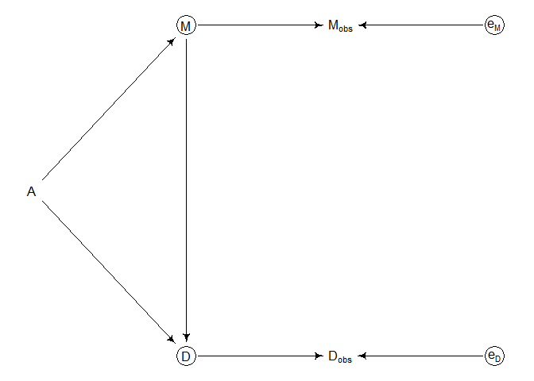
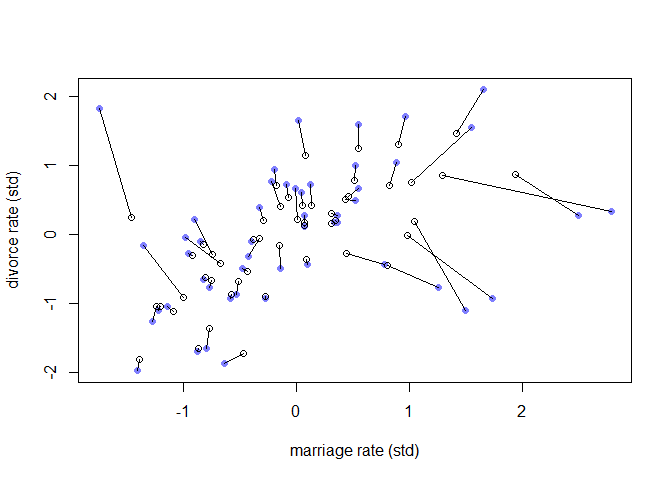

Missing Data and Other Opportunities
================

-   Consider three pancakes. One is burnt on both sides (BB). One is
    burnt on one side (BU). And one is wholly unburnt (UU). If you are
    served a pancake and the side face up is burnt, what is the
    probability the other side is burnt?
-   The intuitive answer is one half — but intuition misleads us!

$$
\begin{align*}
\text{Pr(burnt down|burnt up)} & = \frac{\text{Pr(burnt up & burnt down)}}{\text{Pr(burnt up)}} \\
& = \frac{1/3}{1/2} \\
& = \frac{2}{3}
\end{align*}
$$

-   We can also confirm this via simulation:

``` r
# simulate pancake & return rancomly ordered sides
sim_pancake <- function() {
  
  pancake <- sample(1:3, 1)
  sides <- matrix(c(1, 1, 1, 0, 0, 0), 2, 3)[,pancake]
  sample(sides)
  
}

# sim 10,000 pancakes
pancakes <- replicate(1e4, sim_pancake())
up <- pancakes[1,]
down <- pancakes[2,]

# compute proportion 1/1 (BB) out of all 1/1 and 1/0
num_11_10 <- sum(up == 1)
num_11 <- sum(up == 1 & down == 1)
num_11/num_11_10
```

    ## [1] 0.65716

-   This is just a matter of counting *sides* rather than *pancakes*.
-   Probability theory is not difficult mathematically — it’s just
    counting! The difficulty is in the interpretation/application.
-   Two commonplace applications that aren’t difficult mathematically
    but need some work are including *measurement error* in models, and
    using *Bayesian imputation* to account for *missing data*.

## 15.1 Measurement error

-   Let’s look back at the divorce/marriage data from chapter 5.

``` r
library(rethinking)
```

    ## Loading required package: rstan

    ## Warning: package 'rstan' was built under R version 4.2.1

    ## Loading required package: StanHeaders

    ## Warning: package 'StanHeaders' was built under R version 4.2.1

    ## 
    ## rstan version 2.26.13 (Stan version 2.26.1)

    ## For execution on a local, multicore CPU with excess RAM we recommend calling
    ## options(mc.cores = parallel::detectCores()).
    ## To avoid recompilation of unchanged Stan programs, we recommend calling
    ## rstan_options(auto_write = TRUE)
    ## For within-chain threading using `reduce_sum()` or `map_rect()` Stan functions,
    ## change `threads_per_chain` option:
    ## rstan_options(threads_per_chain = 1)

    ## Do not specify '-march=native' in 'LOCAL_CPPFLAGS' or a Makevars file

    ## Loading required package: cmdstanr

    ## This is cmdstanr version 0.5.3

    ## - CmdStanR documentation and vignettes: mc-stan.org/cmdstanr

    ## - CmdStan path: C:/Users/E1735399/Documents/.cmdstan/cmdstan-2.30.1

    ## - CmdStan version: 2.30.1

    ## Loading required package: parallel

    ## rethinking (Version 2.23)

    ## 
    ## Attaching package: 'rethinking'

    ## The following object is masked from 'package:rstan':
    ## 
    ##     stan

    ## The following object is masked from 'package:stats':
    ## 
    ##     rstudent

``` r
set_ulam_cmdstan(FALSE)

data(WaffleDivorce)
d <- WaffleDivorce

# points
plot(d$Divorce ~ d$MedianAgeMarriage,
     ylim = c(4, 15),
     xlab = "Median age marriage",
     ylab = "Divorce rate")

# standard errors
for (i in 1:nrow(d)) {
  
  ci <- d$Divorce[i] + c(-1, 1)*d$Divorce.SE[i]
  x <- d$MedianAgeMarriage[i]
  lines(c(x, x), ci)
  
}
```

<!-- -->

-   There’s lots of variation in the measured divorce rate! Since the
    standard errors for some states are smaller, we could reasonably
    expect that the model’s estimate for that state’s rate would also be
    smaller.

### 15.1.1 Error on the outcome

-   Let’s reintroduce the causal model and include an observation error
    on the outcome:

``` r
library(dagitty)
```

    ## Warning: package 'dagitty' was built under R version 4.2.1

``` r
marriage <-
  dagitty(
    "dag{
      D [unobserved]
      e_D [unobserved]
      A -> M
      A -> D
      M -> D
      D -> D_obs
      e_D -> D_obs
    }"
  )

coordinates(marriage) <-
  list(x = c(A = 1, M = 2, D = 2, D_obs = 3, e_D = 4),
       y = c(A = 2, M = 1, D = 3, D_obs = 3, e_D = 3))

drawdag(marriage)
```

<!-- -->

-   In this version of the DAG, age at marriage & marriage rate causally
    influence the divorce rate. We don’t observe the true divorce rate,
    but we do observe $D_{obs}$, which is a function of both D and some
    error, $\text{e}_D$.
-   The key benefit of Bayes is that we can simply put parameters in the
    gaps in our knowledge (i.e., the true divorce rate):

$$
\begin{align*}
D_{\text{OBS}[i]} & \sim \text{Normal}(D_{\text{TRUE}[i]}, D_{\text{SE}[i]}) \\
D_{\text{TRUE}[i]} & \sim \text{Normal}(\mu_i, \sigma) \\
\mu_i & = \alpha + \beta_A A_A + \beta_M M_M \\
\alpha & \sim \text{Normal}(0,\ 0.2) \\
\beta_A & \sim \text{Normal}(0, \ 0.5) \\
\beta_M & \sim \text{Normal}(0, \ 0.5) \\
\sigma & \sim \text{Exponential}(1)
\end{align*}
$$

-   Here, the true divorce rates just become a parameter in the
    distribution for the observed divorce rate.
-   This also allows information to flow in both directions — the
    uncertainty in measurement influences the regression parameters and
    the regression parameters influence the uncertainty in the
    measurements.

``` r
# prep for stan
dlist <- 
  list(
    D_obs = standardize(d$Divorce),
    D_sd = d$Divorce.SE / sd(d$Divorce),
    M = standardize(d$Marriage),
    A = standardize(d$MedianAgeMarriage),
    N = nrow(d)
  )

# model!
m15.1 <-
  ulam(
    alist(
      # model
      D_obs ~ dnorm(D_true, D_sd),
      vector[N]:D_true ~ dnorm(mu, sigma),
      mu <- a + bA*A + bM*M,
      
      # priors
      a ~ dnorm(0, 0.25),
      bA ~ dnorm(0, 0.5),
      bM ~ dnorm(0, 0.5),
      sigma ~ dexp(1)
    ),
    
    data = dlist,
    chains = 4,
    cores = 4
  )

precis(m15.1, depth = 2)
```

    ##                   mean         sd        5.5%       94.5%     n_eff     Rhat4
    ## D_true[1]   1.16233023 0.37392594  0.55207259  1.77324147 1746.3472 0.9987503
    ## D_true[2]   0.67418413 0.56108217 -0.20256820  1.63054061 1803.4817 0.9998227
    ## D_true[3]   0.41900987 0.33229892 -0.09512954  0.94737570 2223.2338 0.9999677
    ## D_true[4]   1.40651019 0.44883459  0.71131446  2.14953514 2077.3271 0.9994658
    ## D_true[5]  -0.90054203 0.12939576 -1.11213282 -0.69065786 2459.5305 0.9990862
    ## D_true[6]   0.65467460 0.40006891  0.02226102  1.32793466 1605.5080 1.0000749
    ## D_true[7]  -1.37434725 0.34844679 -1.94085341 -0.83328542 2261.1558 1.0000197
    ## D_true[8]  -0.36365110 0.48073242 -1.13257515  0.41850662 2102.9102 0.9992769
    ## D_true[9]  -1.92308970 0.62207998 -2.89008051 -0.89889503 1709.4094 0.9993049
    ## D_true[10] -0.62343452 0.17097515 -0.90012496 -0.35335734 2269.1181 0.9986092
    ## D_true[11]  0.76777015 0.27537547  0.32526582  1.19828999 1780.7439 0.9994286
    ## D_true[12] -0.56650900 0.47713173 -1.32464022  0.18798055 1842.7237 0.9987380
    ## D_true[13]  0.16150420 0.52022641 -0.70145762  0.98250599 1339.6426 1.0001078
    ## D_true[14] -0.86597506 0.22831486 -1.22813463 -0.50267487 2902.7543 1.0007605
    ## D_true[15]  0.54938308 0.29274267  0.07112620  1.00959442 2280.3042 0.9999962
    ## D_true[16]  0.28985771 0.38196350 -0.32278063  0.90807574 2168.6984 0.9984243
    ## D_true[17]  0.48317371 0.40458705 -0.15529959  1.15447441 2421.5982 0.9991825
    ## D_true[18]  1.24950769 0.34732359  0.69399172  1.80486201 1981.8003 0.9993527
    ## D_true[19]  0.42834965 0.39261444 -0.21561930  1.05292435 2125.4256 0.9988557
    ## D_true[20]  0.41174340 0.53142636 -0.40784859  1.29229870 1376.7847 0.9999665
    ## D_true[21] -0.55495006 0.32636372 -1.05856240 -0.02892474 2099.3528 0.9991101
    ## D_true[22] -1.10145933 0.25368027 -1.49721180 -0.69907457 2453.8845 0.9994479
    ## D_true[23] -0.27622760 0.25629091 -0.68634137  0.12901966 1767.8267 0.9994680
    ## D_true[24] -1.00834837 0.29535719 -1.48124118 -0.53269107 2457.5327 0.9989074
    ## D_true[25]  0.42791229 0.40284034 -0.20424437  1.06697380 2122.3888 1.0000134
    ## D_true[26] -0.03361221 0.30878990 -0.54054487  0.45337152 1881.6968 1.0000954
    ## D_true[27] -0.01514499 0.49324476 -0.82752634  0.75596614 2254.8024 0.9996069
    ## D_true[28] -0.15703725 0.38550507 -0.78517862  0.42943684 2008.0778 0.9991121
    ## D_true[29] -0.26941505 0.50622584 -1.05130485  0.55351595 1790.1535 1.0014893
    ## D_true[30] -1.79979237 0.24588330 -2.20077020 -1.41173436 2121.7907 0.9984992
    ## D_true[31]  0.18075847 0.40460966 -0.47242034  0.81425377 1747.0981 1.0025266
    ## D_true[32] -1.66027860 0.16139755 -1.91630648 -1.40193179 2210.3118 1.0000802
    ## D_true[33]  0.11749021 0.24005018 -0.25626211  0.51160440 2068.1917 1.0005625
    ## D_true[34] -0.06895091 0.52121811 -0.91857220  0.75033261 1442.7315 1.0010326
    ## D_true[35] -0.12001754 0.23723553 -0.48733221  0.24612170 2047.3999 1.0002020
    ## D_true[36]  1.27820488 0.41664459  0.63255354  1.94761734 1891.8909 0.9990727
    ## D_true[37]  0.23804786 0.34730329 -0.31555189  0.80400350 2560.5996 0.9987886
    ## D_true[38] -1.03236623 0.22174670 -1.39281953 -0.67247648 2291.3601 1.0008860
    ## D_true[39] -0.93441890 0.53231901 -1.75903467 -0.06063452 1608.5485 1.0013519
    ## D_true[40] -0.67887425 0.32513359 -1.18905976 -0.15946331 2597.0699 0.9985748
    ## D_true[41]  0.23375887 0.53452858 -0.60704645  1.09127848 2468.8448 0.9999864
    ## D_true[42]  0.73324631 0.34202149  0.16979723  1.29429181 2149.0366 1.0006071
    ## D_true[43]  0.19436224 0.18356547 -0.08943021  0.49108808 2696.3663 0.9993545
    ## D_true[44]  0.78258476 0.41568073  0.10927443  1.45259879 1581.2763 1.0017991
    ## D_true[45] -0.42012352 0.54060078 -1.26414929  0.46410538 2339.6958 1.0001191
    ## D_true[46] -0.39298112 0.26522717 -0.81022907  0.04602984 2363.3209 0.9995164
    ## D_true[47]  0.13186542 0.29332307 -0.32600604  0.60429237 2720.2786 0.9984403
    ## D_true[48]  0.53668563 0.45304442 -0.19903108  1.23207097 2308.3071 0.9996397
    ## D_true[49] -0.63338161 0.27860642 -1.07514085 -0.18947118 1529.7765 0.9997198
    ## D_true[50]  0.83655357 0.60081944 -0.15822533  1.77661499 1555.2923 1.0008233
    ## a          -0.05993749 0.09832212 -0.21381089  0.10387820 1446.7645 1.0002646
    ## bA         -0.62408599 0.16004261 -0.88622225 -0.37332867 1024.5044 0.9992164
    ## bM          0.04617591 0.16677089 -0.22002595  0.30703147  834.2990 1.0008597
    ## sigma       0.58450495 0.10716741  0.42693581  0.77114032  592.8372 1.0027639

> Note here the use of `vector[N]`. I’m not 100% sure why, but this the
> whole thing sample faster & with fewer diagnostic problems than a
> non-vectorized version.

-   The old model from chapter 5 ound that `bA` was about -1 — now it’s
    almost half that, but still reliably negative. Errors in measuremetn
    can sometimes exaggerate effects or diminish them, depending on the
    context!
-   Look at figure 15.2 on page 495 to see *shrinkage* in action — less
    certain estimates are improved by pooling information with more
    certain estimates.

### 15.1.2 Error on both outcome and predictor

-   What about when there’s measurement error on a predictor as well?
-   We can do the same as before!

``` r
marriage <-
  dagitty(
    "dag{
      M [unobserved]
      D [unobserved]
      e_M [unobserved]
      e_D [unobserved]
      A -> M
      A -> D
      M -> D
      D -> D_obs
      M -> M_obs
      e_D -> D_obs
      e_M -> M_obs
    }"
  )

coordinates(marriage) <-
  list(x = c(A = 1, M = 2, D = 2, M_obs = 3, D_obs = 3, e_M = 4, e_D = 4),
       y = c(A = 2, M = 1, D = 3, M_obs = 1, D_obs = 3, e_M = 1, e_D = 3))

drawdag(marriage)
```

<!-- -->

-   Fitting the model is much like before:

``` r
# prep data for stan
dlist <-
  list(
    D_obs = standardize(d$Divorce),
    D_sd = d$Divorce.SE/sd(d$Divorce),
    M_obs = standardize(d$Marriage),
    M_sd = d$Marriage.SE/sd(d$Marriage),
    A = standardize(d$MedianAgeMarriage),
    N = nrow(d)
  )

# model!
m15.2 <-
  ulam(
    alist(
      # model
      D_obs ~ dnorm(D_true, D_sd),
      vector[N]:D_true ~ dnorm(mu, sigma),
      mu <- a + bA*A + bM*M_true[i],
      M_obs ~ dnorm(M_true, M_sd),
      vector[N]:M_true ~ dnorm(0, 1),
      
      # priors
      a ~ dnorm(0, 0.2),
      bA ~ dnorm(0, 0.5),
      bM ~ dnorm(0, 0.5),
      sigma ~ dexp(1)
    ),
    
    data = dlist,
    chains = 4,
    cores = 4
  )

precis(m15.2, depth = 2)
```

    ##                    mean         sd        5.5%        94.5%     n_eff     Rhat4
    ## D_true[1]   1.123027989 0.35787799  0.57930357  1.713563698 1457.9501 1.0018941
    ## D_true[2]   0.767778409 0.53825051 -0.06666802  1.635684630 2514.6950 1.0004881
    ## D_true[3]   0.415832296 0.32230335 -0.08926198  0.934103737 2718.7881 0.9996636
    ## D_true[4]   1.447834931 0.44374714  0.76198773  2.207780369 1942.3485 0.9999901
    ## D_true[5]  -0.896963844 0.12675043 -1.09824864 -0.688240299 3021.8129 0.9981831
    ## D_true[6]   0.688785248 0.41660930  0.03942783  1.371425091 3099.8117 0.9998032
    ## D_true[7]  -1.345230807 0.34399840 -1.89941600 -0.798524794 2347.0934 1.0002498
    ## D_true[8]  -0.283364831 0.48173498 -1.05112400  0.487573900 2100.7865 0.9994524
    ## D_true[9]  -1.777332301 0.59676487 -2.73233983 -0.854341267 1474.0221 1.0009395
    ## D_true[10] -0.624157525 0.16923027 -0.89889899 -0.353219545 2563.0782 0.9992964
    ## D_true[11]  0.773322883 0.29335245  0.30970745  1.243123461 2679.4118 1.0002162
    ## D_true[12] -0.462586486 0.47845002 -1.22838785  0.273212152 1869.7352 1.0003335
    ## D_true[13]  0.209134762 0.50982999 -0.62630430  1.011495780 1471.1860 1.0013619
    ## D_true[14] -0.872728638 0.22625881 -1.23333908 -0.501925176 2703.9936 0.9993606
    ## D_true[15]  0.530030280 0.29970726  0.06387967  1.014083165 3412.1708 0.9984748
    ## D_true[16]  0.294010123 0.38455574 -0.32638356  0.904866324 2882.0846 0.9991897
    ## D_true[17]  0.514234829 0.43265039 -0.17232770  1.199708148 2893.1807 0.9994410
    ## D_true[18]  1.251153564 0.34179716  0.69788514  1.830129758 1926.8807 1.0004656
    ## D_true[19]  0.423596747 0.36494523 -0.14777996  1.010506060 3015.8057 1.0002547
    ## D_true[20]  0.251863355 0.56001067 -0.59482481  1.201509312  843.2540 1.0051096
    ## D_true[21] -0.541928273 0.32111517 -1.04039966 -0.029776599 2768.3436 1.0001516
    ## D_true[22] -1.106573940 0.25178499 -1.50551259 -0.702292852 2661.2138 0.9994101
    ## D_true[23] -0.289649475 0.25972022 -0.69369963  0.133438674 3034.2205 0.9989964
    ## D_true[24] -1.021860390 0.28784124 -1.49630495 -0.564519851 2001.4013 1.0003418
    ## D_true[25]  0.398816917 0.41573967 -0.25590387  1.064547360 2608.5389 1.0006862
    ## D_true[26] -0.043940815 0.31636667 -0.53146732  0.464274897 3133.3388 0.9991243
    ## D_true[27] -0.055582252 0.49473075 -0.86771045  0.719914623 2390.1010 0.9984338
    ## D_true[28] -0.171771300 0.39092794 -0.79707724  0.458625955 2794.7031 0.9999681
    ## D_true[29] -0.296465511 0.48536443 -1.06492907  0.488772349 2725.5512 1.0002321
    ## D_true[30] -1.803000744 0.23226861 -2.17184281 -1.430725658 2793.4206 0.9997250
    ## D_true[31]  0.181684126 0.40506327 -0.47962928  0.846588747 2827.2718 0.9991179
    ## D_true[32] -1.659181478 0.16268333 -1.91569130 -1.385522065 3218.5724 0.9990439
    ## D_true[33]  0.110905241 0.23499430 -0.25631328  0.472912890 3607.9893 1.0001238
    ## D_true[34] -0.007300190 0.48329202 -0.81594475  0.739132326 1624.9685 1.0027514
    ## D_true[35] -0.142419167 0.23462940 -0.51806594  0.231561707 2795.9714 0.9986681
    ## D_true[36]  1.289978105 0.40796714  0.66837175  1.947665949 2408.9830 0.9990895
    ## D_true[37]  0.199120118 0.36573942 -0.37489634  0.805979807 2486.5002 0.9986303
    ## D_true[38] -1.036989298 0.21372804 -1.36651462 -0.698366066 3277.9742 0.9986850
    ## D_true[39] -0.939005014 0.54698080 -1.79105611 -0.053091804 2266.8405 0.9991712
    ## D_true[40] -0.678949398 0.30971540 -1.16426945 -0.193192191 3095.5063 1.0008223
    ## D_true[41]  0.216009297 0.52569571 -0.61632310  1.046324569 1810.3811 0.9998180
    ## D_true[42]  0.709556676 0.33606938  0.16582327  1.251024791 2797.7514 1.0015553
    ## D_true[43]  0.197420215 0.18771724 -0.09796006  0.483734248 3047.4536 0.9993211
    ## D_true[44]  0.869368698 0.42238727  0.17423841  1.546754032 1483.0883 1.0004036
    ## D_true[45] -0.444023925 0.51956418 -1.28409939  0.412026746 2768.7789 0.9998331
    ## D_true[46] -0.383254922 0.25727137 -0.79692623  0.022048272 2915.5425 0.9991474
    ## D_true[47]  0.138045817 0.29859735 -0.33783091  0.620438305 3096.1525 0.9990796
    ## D_true[48]  0.571507591 0.45383269 -0.12809645  1.313340278 2986.8876 0.9987905
    ## D_true[49] -0.654390341 0.27165371 -1.09558681 -0.212610470 2879.1959 0.9998987
    ## D_true[50]  0.863831950 0.56083645 -0.02373490  1.719481239 1870.3548 1.0001756
    ## M_true[1]   0.078449930 0.31392989 -0.43288146  0.595207291 2998.3123 0.9999510
    ## M_true[2]   1.027371673 0.60847814  0.05929081  2.017331175 1987.7123 1.0007750
    ## M_true[3]   0.061196073 0.23822326 -0.30723039  0.439917111 1942.4826 0.9988746
    ## M_true[4]   1.425987137 0.40591204  0.76166729  2.058371214 2826.1957 1.0003683
    ## M_true[5]  -0.268134637 0.09958089 -0.42785614 -0.105679168 3500.5377 0.9991306
    ## M_true[6]   0.824018618 0.31717128  0.31321273  1.347127031 3323.2566 1.0008589
    ## M_true[7]  -0.762654486 0.26847530 -1.19306391 -0.336420220 2860.5211 0.9995238
    ## M_true[8]   0.453710106 0.60064649 -0.50524031  1.387887875 3062.6011 1.0003025
    ## M_true[9]  -0.466437561 0.54876325 -1.38111998  0.387840911 3087.0502 0.9989306
    ## M_true[10] -0.803100386 0.14493262 -1.03729469 -0.575992713 2581.9213 0.9986906
    ## M_true[11]  0.518585353 0.20308960  0.19153380  0.835450784 3231.6940 0.9989754
    ## M_true[12]  0.786569346 0.54818124 -0.10796034  1.655042142 2481.9753 0.9992509
    ## M_true[13]  1.061170514 0.44579527  0.37060592  1.777823130 1701.6858 1.0001377
    ## M_true[14] -0.576483323 0.15290806 -0.81337560 -0.336728491 3996.8865 0.9987449
    ## M_true[15] -0.062565501 0.21063492 -0.39469947  0.275168687 2999.0615 0.9994006
    ## M_true[16]  0.310034318 0.34938954 -0.22969173  0.873871138 2353.4456 1.0002117
    ## M_true[17]  0.447557857 0.36174442 -0.11523361  1.018042894 3408.0502 0.9992463
    ## M_true[18]  0.525827053 0.29063883  0.04540411  0.987875638 2985.5443 0.9991905
    ## M_true[19]  0.136935189 0.29493080 -0.33124688  0.614366688 2706.6317 1.0019332
    ## M_true[20] -1.479759974 0.34331100 -2.02246104 -0.931523900 2231.2417 0.9989390
    ## M_true[21] -0.435704453 0.25065328 -0.83427796 -0.040626004 3207.7299 0.9987059
    ## M_true[22] -1.090441998 0.17444396 -1.36975543 -0.809492243 2847.6505 0.9982430
    ## M_true[23] -0.922432052 0.17887542 -1.20468126 -0.637272135 3008.4274 1.0004569
    ## M_true[24] -1.229741570 0.19351654 -1.54007847 -0.915626984 3309.4247 0.9993877
    ## M_true[25] -0.146624608 0.38610266 -0.77529229  0.481810083 2999.1122 0.9993912
    ## M_true[26] -0.379504282 0.20933510 -0.71644351 -0.048714897 3459.1107 1.0007071
    ## M_true[27] -0.323745865 0.50344959 -1.15829369  0.455930055 2668.2482 0.9990725
    ## M_true[28] -0.143110202 0.35891348 -0.71342688  0.435510564 2075.7968 1.0000631
    ## M_true[29] -0.709575302 0.42618954 -1.39215518 -0.013383354 2952.1724 0.9991773
    ## M_true[30] -1.377210005 0.15164015 -1.60991875 -1.132170678 2820.8144 1.0003165
    ## M_true[31]  0.082613753 0.45437993 -0.63252115  0.825843312 3363.4945 0.9988223
    ## M_true[32] -0.864087040 0.12310253 -1.05751913 -0.665187477 2715.9621 0.9985679
    ## M_true[33]  0.069293990 0.24990963 -0.32719337  0.458026221 2394.5845 0.9994105
    ## M_true[34]  0.970808548 0.59698551  0.03093567  1.885014037 2155.5353 0.9988509
    ## M_true[35] -0.821450236 0.15776421 -1.06966703 -0.564883642 2849.7235 0.9999117
    ## M_true[36]  0.900778205 0.32777992  0.37285355  1.428430314 3418.3775 1.0007765
    ## M_true[37] -0.278268044 0.27367801 -0.71221729  0.150727686 3032.9499 0.9993203
    ## M_true[38] -1.198139681 0.12540916 -1.39473528 -0.996434975 2988.0745 0.9987612
    ## M_true[39] -0.982662173 0.48189996 -1.75702962 -0.232302401 3587.1046 0.9995961
    ## M_true[40] -0.505345751 0.30442306 -0.97698817 -0.009809281 2899.1702 0.9993273
    ## M_true[41]  0.008973332 0.57150527 -0.88293708  0.924342569 2639.8009 0.9995992
    ## M_true[42] -0.164533001 0.21294656 -0.49912709  0.172577971 2880.7213 0.9996368
    ## M_true[43]  0.348669165 0.16024558  0.08542279  0.602585510 3229.4690 0.9990687
    ## M_true[44]  1.968539589 0.42295379  1.30481657  2.645752576 2205.2720 1.0002406
    ## M_true[45] -0.693236130 0.53023144 -1.54574942  0.152336366 4013.4626 0.9985920
    ## M_true[46]  0.083894654 0.21615550 -0.27053148  0.431866277 3248.9808 0.9985768
    ## M_true[47]  0.311389421 0.24639210 -0.09121418  0.693549221 2530.9875 0.9999054
    ## M_true[48]  0.466627984 0.41682105 -0.19698790  1.117611327 2375.9130 1.0003388
    ## M_true[49] -0.740083033 0.20685919 -1.06881641 -0.414236400 2839.4945 0.9988240
    ## M_true[50]  1.319095212 0.72268410  0.14230279  2.464221453 2334.2422 1.0004413
    ## a          -0.042349160 0.09473833 -0.19441835  0.106027793 1894.4903 0.9991706
    ## bA         -0.545932941 0.15868636 -0.79322897 -0.293418167 1006.3598 1.0001028
    ## bM          0.194424617 0.20862183 -0.13327668  0.529391974  582.5932 1.0041956
    ## sigma       0.558781505 0.11068885  0.39455237  0.744294315  526.2742 1.0122752

-   The shrinkage here didn’t change the inference on the divorce rate,
    but it idd update the estimates of marriage rate:

``` r
post <- extract.samples(m15.2)
D_true <- apply(post$D_true, 2, mean)
M_true <- apply(post$M_true, 2, mean)
plot(dlist$M_obs,
     dlist$D_obs,
     pch = 16, 
     col = rangi2,
     xlab = "marriage rate (std)",
     ylab = "divorce rate (std)")

points(M_true, D_true)
for (i in 1:nrow(d)) 
  lines(c(dlist$M_obs[i], M_true[i]),
        c(dlist$D_obs[i], D_true[i]))
```

<!-- -->

> Hmmm this is really wonk…
