Missing Data and Other Opportunities
================

- Consider three pancakes. One is burnt on both sides (BB). One is burnt
  on one side (BU). And one is wholly unburnt (UU). If you are served a
  pancake and the side face up is burnt, what is the probability the
  other side is burnt?
- The intuitive answer is one half — but intuition misleads us!

$$
\begin{align*}
\text{Pr(burnt down|burnt up)} & = \frac{\text{Pr(burnt up & burnt down)}}{\text{Pr(burnt up)}} \\
& = \frac{1/3}{1/2} \\
& = \frac{2}{3}
\end{align*}
$$

- We can also confirm this via simulation:

``` r
# simulate pancake & return rancomly ordered sides
sim_pancake <- function() {
  
  pancake <- sample(1:3, 1)
  sides <- matrix(c(1, 1, 1, 0, 0, 0), 2, 3)[,pancake]
  sample(sides)
  
}

# sim 10,000 pancakes
pancakes <- replicate(1e4, sim_pancake())
up <- pancakes[1,]
down <- pancakes[2,]

# compute proportion 1/1 (BB) out of all 1/1 and 1/0
num_11_10 <- sum(up == 1)
num_11 <- sum(up == 1 & down == 1)
num_11/num_11_10
```

    ## [1] 0.6623534

- This is just a matter of counting *sides* rather than *pancakes*.
- Probability theory is not difficult mathematically — it’s just
  counting! The difficulty is in the interpretation/application.
- Two commonplace applications that aren’t difficult mathematically but
  need some work are including *measurement error* in models, and using
  *Bayesian imputation* to account for *missing data*.

## 15.1 Measurement error

- Let’s look back at the divorce/marriage data from chapter 5.

``` r
library(rethinking)
```

    ## Loading required package: rstan

    ## Loading required package: StanHeaders

    ## 
    ## rstan version 2.26.15 (Stan version 2.26.1)

    ## For execution on a local, multicore CPU with excess RAM we recommend calling
    ## options(mc.cores = parallel::detectCores()).
    ## To avoid recompilation of unchanged Stan programs, we recommend calling
    ## rstan_options(auto_write = TRUE)
    ## For within-chain threading using `reduce_sum()` or `map_rect()` Stan functions,
    ## change `threads_per_chain` option:
    ## rstan_options(threads_per_chain = 1)

    ## Do not specify '-march=native' in 'LOCAL_CPPFLAGS' or a Makevars file

    ## Loading required package: cmdstanr

    ## This is cmdstanr version 0.5.3

    ## - CmdStanR documentation and vignettes: mc-stan.org/cmdstanr

    ## - CmdStan path: C:/Users/E1735399/Documents/.cmdstan/cmdstan-2.31.0

    ## - CmdStan version: 2.31.0

    ## Loading required package: parallel

    ## rethinking (Version 2.31)

    ## 
    ## Attaching package: 'rethinking'

    ## The following object is masked from 'package:rstan':
    ## 
    ##     stan

    ## The following object is masked from 'package:stats':
    ## 
    ##     rstudent

``` r
set_ulam_cmdstan(FALSE)

data(WaffleDivorce)
d <- WaffleDivorce

# points
plot(d$Divorce ~ d$MedianAgeMarriage,
     ylim = c(4, 15),
     xlab = "Median age marriage",
     ylab = "Divorce rate")

# standard errors
for (i in 1:nrow(d)) {
  
  ci <- d$Divorce[i] + c(-1, 1)*d$Divorce.SE[i]
  x <- d$MedianAgeMarriage[i]
  lines(c(x, x), ci)
  
}
```

<!-- -->

- There’s lots of variation in the measured divorce rate! Since the
  standard errors for some states are smaller, we could reasonably
  expect that the model’s estimate for that state’s rate would also be
  smaller.

### 15.1.1 Error on the outcome

- Let’s reintroduce the causal model and include an observation error on
  the outcome:

``` r
library(dagitty)

marriage <-
  dagitty(
    "dag{
      D [unobserved]
      e_D [unobserved]
      A -> M
      A -> D
      M -> D
      D -> D_obs
      e_D -> D_obs
    }"
  )

coordinates(marriage) <-
  list(x = c(A = 1, M = 2, D = 2, D_obs = 3, e_D = 4),
       y = c(A = 2, M = 1, D = 3, D_obs = 3, e_D = 3))

drawdag(marriage)
```

<!-- -->

- In this version of the DAG, age at marriage & marriage rate causally
  influence the divorce rate. We don’t observe the true divorce rate,
  but we do observe $D_{obs}$, which is a function of both D and some
  error, $\text{e}_D$.
- The key benefit of Bayes is that we can simply put parameters in the
  gaps in our knowledge (i.e., the true divorce rate):

$$
\begin{align*}
D_{\text{OBS}[i]} & \sim \text{Normal}(D_{\text{TRUE}[i]}, D_{\text{SE}[i]}) \\
D_{\text{TRUE}[i]} & \sim \text{Normal}(\mu_i, \sigma) \\
\mu_i & = \alpha + \beta_A A_A + \beta_M M_M \\
\alpha & \sim \text{Normal}(0,\ 0.2) \\
\beta_A & \sim \text{Normal}(0, \ 0.5) \\
\beta_M & \sim \text{Normal}(0, \ 0.5) \\
\sigma & \sim \text{Exponential}(1)
\end{align*}
$$

- Here, the true divorce rates just become a parameter in the
  distribution for the observed divorce rate.
- This also allows information to flow in both directions — the
  uncertainty in measurement influences the regression parameters and
  the regression parameters influence the uncertainty in the
  measurements.

``` r
# prep for stan
dlist <- 
  list(
    D_obs = standardize(d$Divorce),
    D_sd = d$Divorce.SE / sd(d$Divorce),
    M = standardize(d$Marriage),
    A = standardize(d$MedianAgeMarriage),
    N = nrow(d)
  )

# model!
m15.1 <-
  ulam(
    alist(
      # model
      D_obs ~ dnorm(D_true, D_sd),
      vector[N]:D_true ~ dnorm(mu, sigma),
      mu <- a + bA*A + bM*M,
      
      # priors
      a ~ dnorm(0, 0.25),
      bA ~ dnorm(0, 0.5),
      bM ~ dnorm(0, 0.5),
      sigma ~ dexp(1)
    ),
    
    data = dlist,
    chains = 4,
    cores = 4
  )

precis(m15.1, depth = 2)
```

    ##                   mean        sd        5.5%       94.5%     n_eff     Rhat4
    ## D_true[1]   1.15590171 0.3500140  0.58089327  1.72510514 1785.4840 1.0001908
    ## D_true[2]   0.66014042 0.5497129 -0.23327351  1.54680910 2079.5707 0.9994580
    ## D_true[3]   0.40811095 0.3383621 -0.12141505  0.94596894 2347.3092 0.9996025
    ## D_true[4]   1.40819234 0.4628223  0.70083644  2.16490158 1678.0971 0.9985211
    ## D_true[5]  -0.90456125 0.1303501 -1.11006703 -0.69768201 1936.2386 1.0010143
    ## D_true[6]   0.64991770 0.4105024  0.02331705  1.33887996 2205.3813 1.0015248
    ## D_true[7]  -1.37908381 0.3527637 -1.93986516 -0.82558809 2241.3511 0.9993263
    ## D_true[8]  -0.34193493 0.4797053 -1.09749167  0.42088368 2264.1838 0.9994898
    ## D_true[9]  -1.89999043 0.5879117 -2.83006912 -0.93416352 1656.4080 1.0000092
    ## D_true[10] -0.61818474 0.1631218 -0.88645503 -0.35532289 2758.0925 0.9993284
    ## D_true[11]  0.76748613 0.2968536  0.30167116  1.25018233 2069.4288 0.9998577
    ## D_true[12] -0.56206235 0.4734415 -1.32703885  0.17784280 2177.9565 0.9988749
    ## D_true[13]  0.16706320 0.4951770 -0.62802197  0.93237627 1071.7652 1.0020324
    ## D_true[14] -0.86530240 0.2274236 -1.23481613 -0.49018824 2515.0374 0.9996957
    ## D_true[15]  0.55756738 0.3003754  0.08951604  1.03527440 2198.7524 0.9992617
    ## D_true[16]  0.27475726 0.3774074 -0.33822661  0.87664641 2581.3314 1.0000476
    ## D_true[17]  0.48037026 0.4178547 -0.18542800  1.15194834 2334.0830 1.0007245
    ## D_true[18]  1.24879814 0.3250648  0.72656876  1.75689003 1809.3544 0.9993011
    ## D_true[19]  0.42881770 0.3634778 -0.11501564  1.02718251 1972.7451 1.0018882
    ## D_true[20]  0.41124329 0.5273959 -0.39146151  1.25213446 1413.2605 0.9999764
    ## D_true[21] -0.55354611 0.3120773 -1.04219805 -0.03966336 2192.7314 0.9991043
    ## D_true[22] -1.10378256 0.2546737 -1.51522431 -0.69309285 2367.6096 0.9999719
    ## D_true[23] -0.26497443 0.2624048 -0.66305437  0.15263175 1917.4777 1.0008396
    ## D_true[24] -1.00238756 0.3008394 -1.47639276 -0.51205764 1667.9562 0.9994230
    ## D_true[25]  0.40418067 0.4102056 -0.24127181  1.06864994 2321.6678 1.0007123
    ## D_true[26] -0.02749994 0.3195721 -0.54972826  0.47311306 2266.8935 0.9995795
    ## D_true[27] -0.02679677 0.5146200 -0.82421678  0.79852077 2614.8419 0.9988299
    ## D_true[28] -0.16120494 0.4042708 -0.79792764  0.47507038 2434.1067 1.0007476
    ## D_true[29] -0.26153239 0.5053049 -1.04558906  0.54524225 2352.8391 1.0005612
    ## D_true[30] -1.80226077 0.2437912 -2.18467271 -1.40993003 2299.0761 0.9993578
    ## D_true[31]  0.17219990 0.4216115 -0.49179667  0.87503047 2538.1468 1.0007572
    ## D_true[32] -1.65678919 0.1636481 -1.91467637 -1.40785483 2551.6335 1.0007232
    ## D_true[33]  0.10636209 0.2502087 -0.26792078  0.50410337 2618.4054 0.9989948
    ## D_true[34] -0.07036948 0.5149250 -0.91606873  0.71611887 1503.1863 1.0007694
    ## D_true[35] -0.11831263 0.2232396 -0.45921000  0.24463685 2261.7400 1.0000260
    ## D_true[36]  1.27657693 0.3963953  0.65816879  1.91155944 1897.3439 1.0017444
    ## D_true[37]  0.23041612 0.3497211 -0.32970464  0.79452148 3261.7720 0.9990412
    ## D_true[38] -1.02302269 0.2271556 -1.38968707 -0.66978095 3305.7709 0.9997490
    ## D_true[39] -0.93457178 0.5367755 -1.78712316 -0.04814282 2110.9420 0.9991915
    ## D_true[40] -0.68361647 0.3395146 -1.24727779 -0.15240187 2383.7195 0.9998340
    ## D_true[41]  0.23625276 0.5649312 -0.64863706  1.13728483 2261.0619 1.0004674
    ## D_true[42]  0.73014839 0.3449464  0.19280242  1.30112690 2112.0847 0.9988892
    ## D_true[43]  0.19275783 0.1809710 -0.09531425  0.48486935 2396.0221 0.9991980
    ## D_true[44]  0.79533591 0.4285107  0.10354474  1.46866520 1486.3763 1.0018026
    ## D_true[45] -0.41400128 0.5210014 -1.23322204  0.44036176 2347.3046 0.9993117
    ## D_true[46] -0.38987773 0.2521636 -0.78770541  0.02152489 2609.5585 0.9984018
    ## D_true[47]  0.12398274 0.3113950 -0.36237438  0.62121218 2196.5819 1.0005408
    ## D_true[48]  0.54665076 0.4668285 -0.18656656  1.27232442 2069.9501 1.0009479
    ## D_true[49] -0.63910805 0.2741956 -1.07705033 -0.21368171 2039.3485 1.0002467
    ## D_true[50]  0.84485198 0.5850491 -0.09650646  1.75734892 1642.6547 1.0027777
    ## a          -0.06205191 0.1017161 -0.22153534  0.10338208 1140.0842 1.0017208
    ## bA         -0.61425911 0.1626268 -0.86722567 -0.35458633 1163.3833 1.0008611
    ## bM          0.05295965 0.1690706 -0.21862537  0.31542902 1044.9651 1.0006659
    ## sigma       0.58466744 0.1074184  0.42623547  0.76652548  570.1193 1.0068886

> Note here the use of `vector[N]`. I’m not 100% sure why, but this the
> whole thing sample faster & with fewer diagnostic problems than a
> non-vectorized version.

- The old model from chapter 5 ound that `bA` was about -1 — now it’s
  almost half that, but still reliably negative. Errors in measuremetn
  can sometimes exaggerate effects or diminish them, depending on the
  context!
- Look at figure 15.2 on page 495 to see *shrinkage* in action — less
  certain estimates are improved by pooling information with more
  certain estimates.

### 15.1.2 Error on both outcome and predictor

- What about when there’s measurement error on a predictor as well?
- We can do the same as before!

``` r
marriage <-
  dagitty(
    "dag{
      M [unobserved]
      D [unobserved]
      e_M [unobserved]
      e_D [unobserved]
      A -> M
      A -> D
      M -> D
      D -> D_obs
      M -> M_obs
      e_D -> D_obs
      e_M -> M_obs
    }"
  )

coordinates(marriage) <-
  list(x = c(A = 1, M = 2, D = 2, M_obs = 3, D_obs = 3, e_M = 4, e_D = 4),
       y = c(A = 2, M = 1, D = 3, M_obs = 1, D_obs = 3, e_M = 1, e_D = 3))

drawdag(marriage)
```

<!-- -->

- Fitting the model is much like before:

``` r
# prep data for stan
dlist <-
  list(
    D_obs = standardize(d$Divorce),
    D_sd = d$Divorce.SE/sd(d$Divorce),
    M_obs = standardize(d$Marriage),
    M_sd = d$Marriage.SE/sd(d$Marriage),
    A = standardize(d$MedianAgeMarriage),
    N = nrow(d)
  )

# model!
m15.2 <-
  ulam(
    alist(
      # model
      D_obs ~ dnorm(D_true, D_sd),
      vector[N]:D_true ~ dnorm(mu, sigma),
      mu <- a + bA*A + bM*M_true[i],
      M_obs ~ dnorm(M_true, M_sd),
      vector[N]:M_true ~ dnorm(0, 1),
      
      # priors
      a ~ dnorm(0, 0.2),
      bA ~ dnorm(0, 0.5),
      bM ~ dnorm(0, 0.5),
      sigma ~ dexp(1)
    ),
    
    data = dlist,
    chains = 4,
    cores = 4
  )
```

    ## Warning: Bulk Effective Samples Size (ESS) is too low, indicating posterior means and medians may be unreliable.
    ## Running the chains for more iterations may help. See
    ## https://mc-stan.org/misc/warnings.html#bulk-ess

``` r
precis(m15.2, depth = 2)
```

    ##                    mean         sd        5.5%        94.5%     n_eff     Rhat4
    ## D_true[1]   1.131725403 0.37776127  0.55455561  1.743557912 1355.0468 0.9988884
    ## D_true[2]   0.743596288 0.54432995 -0.09080615  1.603294025 2400.3662 0.9989664
    ## D_true[3]   0.416082931 0.34302667 -0.10540580  0.992770710 2502.3584 1.0011703
    ## D_true[4]   1.455307757 0.47099975  0.70921792  2.245845508 1958.1711 0.9986711
    ## D_true[5]  -0.900861337 0.12404181 -1.09940811 -0.705026212 2438.0030 0.9991170
    ## D_true[6]   0.690140631 0.38438372  0.09300088  1.316952232 2261.1169 0.9994566
    ## D_true[7]  -1.342064677 0.34192068 -1.89180424 -0.788765019 2484.1790 0.9984514
    ## D_true[8]  -0.297747910 0.47625669 -1.07473190  0.461849835 2656.4344 0.9998167
    ## D_true[9]  -1.736696041 0.62879310 -2.72184326 -0.705081360 1651.5393 1.0022452
    ## D_true[10] -0.621840641 0.15919945 -0.87326125 -0.365278472 3216.5179 0.9988711
    ## D_true[11]  0.775915105 0.28247674  0.31421134  1.225269313 2092.6488 1.0028440
    ## D_true[12] -0.457090660 0.45753210 -1.16794959  0.278229009 2324.6547 0.9997500
    ## D_true[13]  0.201495103 0.49191311 -0.59401766  0.971340644  794.1895 1.0016650
    ## D_true[14] -0.867033137 0.22762383 -1.23941051 -0.499900703 2743.9811 0.9992450
    ## D_true[15]  0.539441122 0.29322353  0.07505964  1.006290142 2403.7523 0.9989255
    ## D_true[16]  0.289554199 0.37904224 -0.29843079  0.888907394 2874.8726 0.9994090
    ## D_true[17]  0.504153243 0.42809470 -0.16025144  1.181049911 2904.1821 1.0004127
    ## D_true[18]  1.242223492 0.34449816  0.70592446  1.815673842 1865.5692 0.9989727
    ## D_true[19]  0.418669319 0.37840801 -0.17391309  1.048570750 2427.1585 0.9997513
    ## D_true[20]  0.263904219 0.53325908 -0.55323462  1.136438403  910.2569 1.0009355
    ## D_true[21] -0.544696463 0.31212788 -1.03986401 -0.037453660 2579.7319 0.9992142
    ## D_true[22] -1.107736301 0.25858515 -1.51083207 -0.690670625 2393.1178 0.9997141
    ## D_true[23] -0.293386366 0.26373636 -0.71338902  0.122217388 2533.2625 0.9983878
    ## D_true[24] -1.014691824 0.29608937 -1.49186289 -0.538907458 2278.5226 0.9997150
    ## D_true[25]  0.404104124 0.39746575 -0.22142021  1.039855618 1625.6106 0.9995398
    ## D_true[26] -0.043534383 0.31660000 -0.54063480  0.466588551 2793.1203 0.9999615
    ## D_true[27] -0.051929326 0.49985091 -0.85841007  0.755637602 2770.6041 0.9988688
    ## D_true[28] -0.164990685 0.40077211 -0.79733345  0.479373684 2356.9802 0.9998110
    ## D_true[29] -0.311251949 0.49712442 -1.08117420  0.483900424 1944.2966 0.9992804
    ## D_true[30] -1.802035614 0.22983567 -2.16661481 -1.436554243 2294.2283 0.9993736
    ## D_true[31]  0.164057656 0.43339565 -0.53184858  0.847311054 2444.7331 1.0005086
    ## D_true[32] -1.649134631 0.16972869 -1.91874769 -1.374724375 2420.8002 0.9996258
    ## D_true[33]  0.111908672 0.23573186 -0.26654639  0.481067514 2705.3624 0.9991284
    ## D_true[34] -0.013116749 0.50151403 -0.82116883  0.766559581 1701.3025 0.9997762
    ## D_true[35] -0.143781423 0.22450520 -0.50041979  0.217387619 2332.7681 0.9992626
    ## D_true[36]  1.276043127 0.40329746  0.64908998  1.914579910 2918.3428 0.9990479
    ## D_true[37]  0.212941998 0.36754820 -0.36792744  0.823743602 2560.1371 0.9992851
    ## D_true[38] -1.032748778 0.21898751 -1.37811234 -0.694627151 2979.6264 0.9985150
    ## D_true[39] -0.924296264 0.52731673 -1.75143241 -0.063025666 1706.1248 1.0004352
    ## D_true[40] -0.680348289 0.32150249 -1.18281515 -0.163468386 2427.6712 1.0003245
    ## D_true[41]  0.235621161 0.53957613 -0.61396397  1.109486593 2471.7468 0.9989722
    ## D_true[42]  0.711253603 0.35968873  0.13944697  1.309111756 2674.2235 0.9999537
    ## D_true[43]  0.203200822 0.17601710 -0.07199695  0.485059093 2162.9164 0.9986361
    ## D_true[44]  0.853343051 0.42747262  0.14921933  1.521607147 1173.5757 1.0001217
    ## D_true[45] -0.438125514 0.52476190 -1.26384094  0.429713017 2076.3339 0.9997823
    ## D_true[46] -0.371031499 0.25061642 -0.76436581  0.026876124 2735.8817 1.0000053
    ## D_true[47]  0.152903589 0.31323016 -0.34361410  0.650172897 2277.1585 1.0000032
    ## D_true[48]  0.566088908 0.46789534 -0.17596486  1.333038769 2486.0967 0.9988067
    ## D_true[49] -0.641826547 0.27834419 -1.10390934 -0.197330910 2587.3758 0.9994027
    ## D_true[50]  0.857932930 0.54914597 -0.05239499  1.738605629 2592.5386 0.9988652
    ## M_true[1]   0.074234238 0.31667688 -0.41890896  0.588435451 2724.9210 0.9982420
    ## M_true[2]   1.017671339 0.59419380  0.06418497  1.966577964 2738.3751 0.9997291
    ## M_true[3]   0.053811524 0.25077912 -0.34706982  0.452870585 2320.0791 0.9986219
    ## M_true[4]   1.425292399 0.41496553  0.76241168  2.095018013 2851.3674 0.9991098
    ## M_true[5]  -0.267698389 0.10298527 -0.43701197 -0.109615374 2690.0347 0.9997934
    ## M_true[6]   0.834587476 0.31764652  0.32512823  1.348998413 3529.8019 1.0003001
    ## M_true[7]  -0.761910528 0.27003093 -1.19624188 -0.337438281 2987.3251 0.9991638
    ## M_true[8]   0.453203019 0.61600437 -0.51579025  1.431073292 2661.3280 1.0011040
    ## M_true[9]  -0.463553001 0.56510171 -1.38387838  0.456076245 2568.9094 1.0005226
    ## M_true[10] -0.802377555 0.15306617 -1.04289207 -0.555884460 2658.0754 0.9984833
    ## M_true[11]  0.520050768 0.21260281  0.19000577  0.857804434 2099.7963 1.0002807
    ## M_true[12]  0.823718837 0.56153922 -0.07267226  1.737489357 3194.1987 0.9990251
    ## M_true[13]  1.085326438 0.45499490  0.38221895  1.811491446 1651.2640 0.9999071
    ## M_true[14] -0.578478416 0.15226503 -0.82185123 -0.334169136 2919.1685 0.9984277
    ## M_true[15] -0.056470810 0.21727917 -0.40940949  0.288939579 2633.2328 0.9990295
    ## M_true[16]  0.313602421 0.34865982 -0.24533282  0.880117834 2226.1514 0.9993754
    ## M_true[17]  0.455764422 0.34839526 -0.09749166  1.012137579 2322.8701 1.0002245
    ## M_true[18]  0.540518987 0.27826040  0.09926768  0.975441442 3310.6171 0.9986143
    ## M_true[19]  0.132718157 0.29497705 -0.33731028  0.597982108 2763.5257 0.9999354
    ## M_true[20] -1.471605899 0.35854978 -2.05310834 -0.920193609 2500.6132 0.9986930
    ## M_true[21] -0.437734206 0.25143029 -0.83691022 -0.039540941 3003.1369 0.9983523
    ## M_true[22] -1.094154801 0.18218217 -1.37622404 -0.806996504 2927.7364 0.9988012
    ## M_true[23] -0.920153808 0.17913372 -1.21000848 -0.626097392 2510.0503 1.0003514
    ## M_true[24] -1.238338154 0.20308640 -1.55670941 -0.909832154 2723.6529 0.9987871
    ## M_true[25] -0.141788738 0.36598796 -0.70430667  0.441371743 2072.3824 1.0023702
    ## M_true[26] -0.382866483 0.20621855 -0.71588602 -0.063763451 2601.0014 0.9982291
    ## M_true[27] -0.328962639 0.48836555 -1.12001606  0.459271313 3074.8953 0.9995507
    ## M_true[28] -0.142091989 0.34219761 -0.70010546  0.397796450 2817.0629 0.9988024
    ## M_true[29] -0.707003997 0.44478628 -1.41296852 -0.004834718 2915.1442 0.9995753
    ## M_true[30] -1.374570289 0.14875154 -1.61638459 -1.132560409 2770.9119 0.9986480
    ## M_true[31]  0.081554165 0.45514829 -0.65936589  0.791333710 2637.0159 0.9995470
    ## M_true[32] -0.862101711 0.12089376 -1.05629779 -0.672315561 2913.0868 0.9990607
    ## M_true[33]  0.081104745 0.24408439 -0.31258724  0.473068344 2177.2429 0.9986649
    ## M_true[34]  0.968650262 0.60773181  0.01078963  1.976891292 2189.6057 0.9991071
    ## M_true[35] -0.822797204 0.16077416 -1.08658336 -0.570347019 3693.0924 0.9993486
    ## M_true[36]  0.896499454 0.31642699  0.39886031  1.393731491 2398.8562 0.9990071
    ## M_true[37] -0.282397798 0.27180300 -0.71962192  0.146117858 2367.4632 0.9986883
    ## M_true[38] -1.192259292 0.12261442 -1.38435848 -0.997224317 2799.5031 0.9992621
    ## M_true[39] -0.985334403 0.47681510 -1.73908428 -0.212091396 2189.9429 0.9989603
    ## M_true[40] -0.500875060 0.29469151 -0.96281865 -0.037283162 2496.2666 0.9994094
    ## M_true[41]  0.005521469 0.56955649 -0.92079454  0.907511350 2512.3685 1.0001956
    ## M_true[42] -0.162776582 0.21803257 -0.51181279  0.190969903 2186.1122 1.0012390
    ## M_true[43]  0.354228394 0.15626012  0.10253307  0.600474659 2808.9513 0.9987428
    ## M_true[44]  1.961161927 0.44054749  1.27698000  2.667432433 1974.1842 0.9995682
    ## M_true[45] -0.681579866 0.54353249 -1.54552698  0.172599953 2459.3630 0.9992293
    ## M_true[46]  0.095528248 0.21981340 -0.24861039  0.441384182 2930.7886 0.9989820
    ## M_true[47]  0.312035967 0.24443984 -0.07690190  0.701573598 2371.7407 0.9997367
    ## M_true[48]  0.459530593 0.41806617 -0.22237857  1.123073834 3012.4461 0.9997400
    ## M_true[49] -0.740423095 0.20604115 -1.06687652 -0.414089914 2280.9198 0.9987738
    ## M_true[50]  1.278255654 0.72999484  0.12974609  2.422808229 2739.5922 0.9995294
    ## a          -0.041278859 0.09665394 -0.19288984  0.114314080 1521.4609 1.0012877
    ## bA         -0.543291484 0.15767613 -0.79859037 -0.290874854 1099.9454 1.0034164
    ## bM          0.192743002 0.20349228 -0.13671232  0.516995385  833.7745 1.0012577
    ## sigma       0.559675824 0.11133789  0.39035938  0.743941788  345.6937 1.0082533

- The shrinkage here didn’t change the inference on the divorce rate,
  but it idd update the estimates of marriage rate:

``` r
post <- extract.samples(m15.2)
D_true <- apply(post$D_true, 2, mean)
M_true <- apply(post$M_true, 2, mean)
plot(dlist$M_obs,
     dlist$D_obs,
     pch = 16, 
     col = rangi2,
     xlab = "marriage rate (std)",
     ylab = "divorce rate (std)")

points(M_true, D_true)
for (i in 1:nrow(d)) 
  lines(c(dlist$M_obs[i], M_true[i]),
        c(dlist$D_obs[i], D_true[i]))
```

<!-- -->

- The big take-home point is that when you have a distribution of
  values, don’t reduce it down to a single value to use in a regression!
  Incorporate the entire uncertainty.

### 15.1.3 Measurement terrors

- In the previous example, there are no new confounds introduced by the
  errors, but this isn’t always the case!
- consider the following DAG — the errors on $D$ and $M$ are correlated
  through an influence by $P$:

``` r
marriage <- 
  dagitty(
    "dag{
      M [unobserved]
      D [unobserved]
      e_M [unobserved]
      e_D [unobserved]
      A -> M
      A -> D
      M -> D
      M -> M_obs
      D -> D_obs
      e_M -> M_obs
      e_D -> D_obs
      P -> e_M
      P -> e_D
    }"
  )

coordinates(marriage) <-
  list(x = c(A = 1, M = 2, D = 2, M_obs = 3, D_obs = 3, e_M = 4, e_D = 4, P = 5),
       y = c(A = 1, M = 0, D = 2, M_obs = 0, D_obs = 2, e_M = 0, e_D = 2, P = 1))

drawdag(marriage)
```

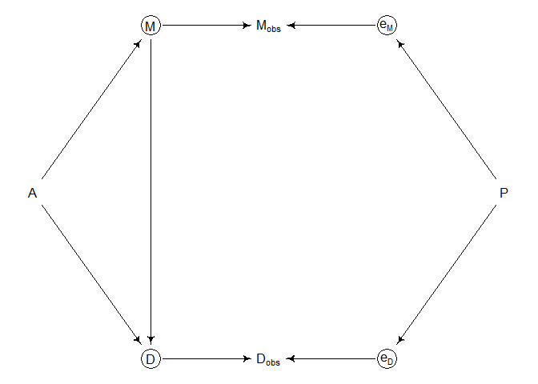<!-- -->

- Naively regressing $D_{obs}$ on $M_{obs}$ opens a non causal path
  through $P$.
- If we have information on the measurement process and can model the
  true variables $D$ and $M$, there’s hope, but we need to consider the
  covariance between the errors.
- Another potential case:

``` r
marriage <-
  dagitty(
    "dag{
      M [unobserved]
      D [unobserved]
      e_M [unobserved]
      e_D [unobserved]
      A -> M
      A -> D
      M -> D
      M -> e_D
      M -> M_obs
      D -> D_obs
      e_M -> M_obs
      e_D -> D_obs
    }"
  )

coordinates(marriage) <-
  list(x = c(A = 1, M = 2, M_obs = 3, e_M = 4, D = 2, D_obs = 3, e_D = 4),
       y = c(A = 1, M = 0, M_obs = 0, e_M = 0, D = 2, D_obs = 2, e_D = 2))

drawdag(marriage)
```

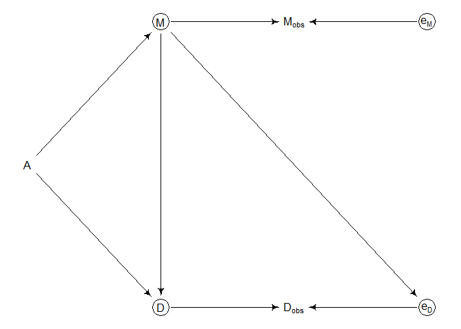<!-- -->

- This might occur if, say, marriages are rare. Then there aren’t as
  many couples that could possibly get divorced, so the smaller sample
  size induces a larger error on the measurement of the divorce rate.
- If we can average over the uncertainty in the true $M$ and $D$ using
  information about the measurement process, we might do alright.
- Another worry is when a causal variable is measured less precisely
  than a non-causal one. \*Let’s say for example that we know $D$ and
  $M$ very precisely but now $A$ is measured with error. Let’s also
  assume $M$ has zero causal impact on $D$:

``` r
marriage <-
  dagitty(
    "dag{
      e_A [unobserved]
      A [unobserved]
      e_A -> A_obs
      A -> A_obs
      A -> M
      A -> D
    }"
  )

coordinates(marriage) <-
  list(x = c(e_A = 1, A_obs = 2, A = 3, M = 4, D = 4),
       y = c(e_A = 1, A_obs = 1, A = 1, M = 0, D = 2))

drawdag(marriage)
```

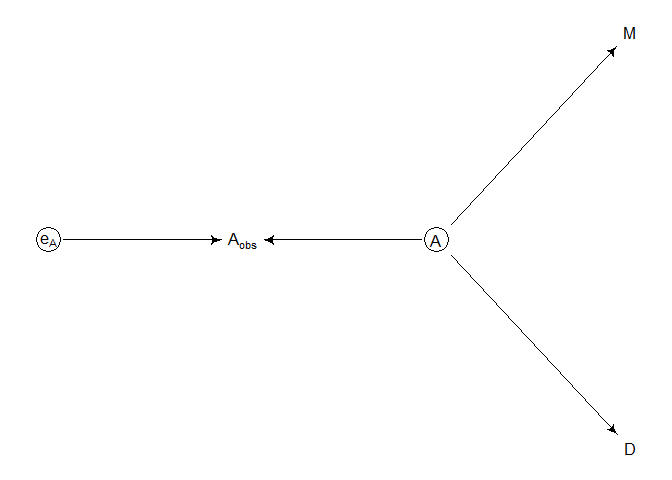<!-- -->

- If we plop a regression of $D$ on $A_{obs}$ and $M$ it’ll suggest that
  $M$ *strongly* influences $D$. This is because $M$ contains proxy
  information about the true $A$, but measured much more precisely than
  $A_{obs}$.
- Here’s a simulation to show the example:

``` r
N <- 500
A <- rnorm(N)
M <- rnorm(N, -A)
D <- rnorm(N, A)
A_obs <- rnorm(N, A)

plot(M, D)
```

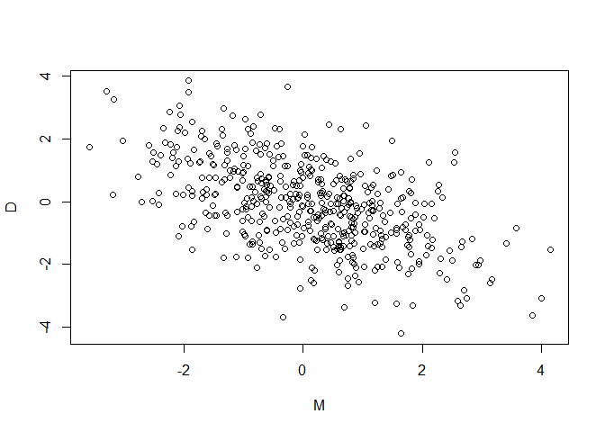<!-- -->

## 15.2 Missing Data

- The insight from measurement error is to realize that any uncertain
  piece of data can be replaced with a distribution that reflects that
  uncertainty, but what about when data is simply missing?
- So far, we’ve just been doing *complete case analysis*.
- Another common response to missing data is to replace with an assumed
  value — like the mean, median, or some assumed value like 0.
- Neither is truly safe — complete case throws away data & fixed
  imputation means the model will think it knows an unknown value with
  absolute certainty.
- If we think causally about missingness, we may be able to use the
  model to *impute* missing values.
- Some rethinking: missing data are still meaningful data. The fact that
  a variable has an unobserved value is still an observation. Thinking
  about the process that caused missingness can help solve big problems.

### 15.2.1 DAG ate my homework

- Let’s consider a sample of students who own dogs. The students
  homework $H$ is influenced by how much each student studies $S$.

``` r
N <- 100
S <- rnorm(N)

# grade students on a 10-point scale, influenced by S
H <- rbinom(N, size = 10, inv_logit(S))
```

- Then, oh-no! some dogs eat some homework. We’ll encode the missingness
  as a 0/1 indicator $D$.
- When homework has been eaten, we cannot observe the true distribution
  of homework, but we do get to observe the incomplete case $H^*$.
- In DAG form, $H \rightarrow H^* \leftarrow D$.
- If we want to learn the influence of $S$ on $H$ we have to rely on
  $H^*$ — we’re relying on $S \rightarrow H^*$ being a good
  approximation for $S \rightarrow H$.
- How good this assumption is depends on the cause of the missing values
  — let’s consider 4 scenarios considered as DAGs.

``` r
# Case 1: missing completely at random (simplest case)
case_1 <-
  dagitty(
    "dag{
      H [unobserved]
      S -> H
      D -> Hm
      H -> Hm
    }"
  )

coordinates(case_1) <-
  list(x = c(S = 1, D = 1, H = 2, Hm = 2),
       y = c(S = 1, D = 2, H = 1, Hm = 2))

drawdag(case_1)
```

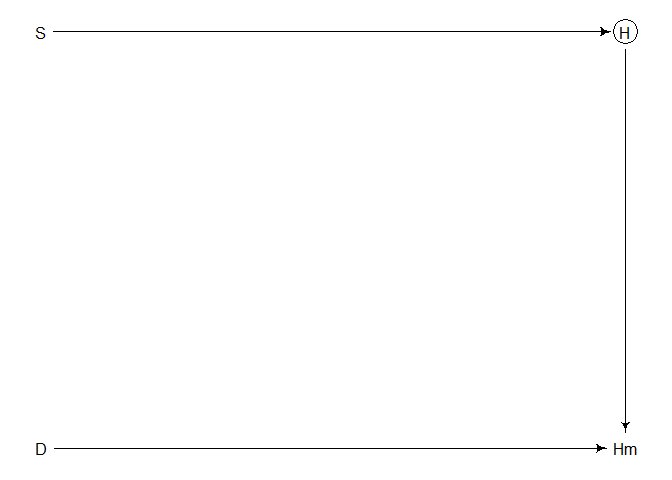<!-- -->

``` r
# simulate case 1
D <- rbern(N)
Hm <- H
Hm[D == 1] <- NA

Hm
```

    ##   [1]  3  6 NA  5  6  5 NA NA NA NA NA  5 NA NA NA  7 NA NA  4 NA  2 10  2  6 NA
    ##  [26] NA  7  2  3  3  5 NA NA  3 NA  3  7  4 NA  5 NA  5 NA  8 10 NA NA  3  9  8
    ##  [51] NA  7 NA  5 NA  7 NA NA  1  6  5  2 NA NA  5 NA  7 NA  1 NA NA  4  3  6  2
    ##  [76]  4 NA NA NA  2 NA NA 10  1  8 NA  8 NA NA NA NA NA NA NA  6  2 10 NA NA NA

- We now have `NA` scattered about the dataset — is this a problem? We
  can decide by considering whether the outcome $H$ is independent of
  $D$. In this case, $H$ is independent of $D$ because $H^*$ is a
  collider.
- Another way of thinking about it — random missingness doesn’t change
  the overall distribution of homework scores & therefore doesn’t bias
  our estimate on the causal effect of studying.

``` r
# Case 2: Studying influences whether or not dog eats homework
# (maybe studying a lot means less playtime with the dog, who gets restless)
case_2 <-
  dagitty(
    "dag{
      H [unobserved]
      S -> H
      S -> D
      D -> Hm
      H -> Hm
    }"
  )

coordinates(case_2) <-
  coordinates(case_1)

drawdag(case_2)
```

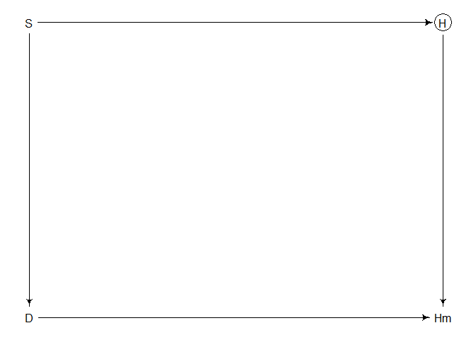<!-- -->

``` r
D <- ifelse(S > 0, 1, 0)
Hm <- H
Hm[D == 1] <- NA

Hm
```

    ##   [1]  3 NA NA  5  6 NA NA  2  1 NA NA  5  5 NA  3 NA NA NA  4  1  2 NA  2 NA  5
    ##  [26]  2 NA  2  3 NA  5  3 NA NA NA NA NA NA NA  5 NA NA  4 NA NA NA  0  3 NA NA
    ##  [51]  0 NA NA NA NA NA  0 NA  1 NA NA  2 NA NA NA  6 NA NA  1 NA NA  4  3 NA  2
    ##  [76] NA  4 NA NA  2 NA  7 NA  1 NA NA NA  5 NA NA NA  2  1 NA NA  2 NA NA NA NA

- In this second case the missingness is *not* random — every student
  who studies more than average is missing homework!
- There is now also a non-causal backdoor path from
  $H \rightarrow H^* \leftarrow D \leftarrow S$. We close this path by
  conditioning on $S$ (which we wanted to do anyway).

``` r
# Case 3: influence on both H and D
# say X is noise in the student's house 
# noisier houses produce worse homework and dogs more likely to misbehave
case_3 <-
  dagitty(
    "dag{
      H [unobserved]
      X [unobserved]
      S -> H
      X -> H
      X -> D
      D -> Hm
      H -> Hm
    }"
  )

coordinates(case_3) <-
  list(x = c(S = 1, D = 1, X = 2, H = 3, Hm = 3),
       y = c(S = 1, D = 3, X = 2, H = 1, Hm = 3))

drawdag(case_3)
```

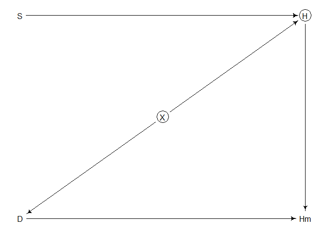<!-- -->

``` r
set.seed(501)
N <- 1000
X <- rnorm(N)
S <- rnorm(N)
H <- rbinom(N, size = 10, inv_logit(2 + S - 2*X))
D <- ifelse(X > 1, 1, 0)
Hm <- H
Hm[D == 1] <- NA
Hm
```

    ##    [1] 10  7  9  8 10 10 10  8  7 NA  7  5  9  5  8  8  9 NA 10  5 NA 10  8  4
    ##   [25] 10  9 NA  9 10  6  9  9  2  7 NA  9  7  6  9  8 10  8 NA  7  8 NA NA  8
    ##   [49] 10 NA NA 10 10 NA 10 10  5 10 NA 10 10 NA  5  6 NA 10  5  5 NA NA  7  8
    ##   [73] 10 10  7 NA 10 10 10  8  9  5  7  6  9 NA  8 NA  7  7  7  8  5 10 10  9
    ##   [97]  5 10  9  7 10  9  8  7 10 NA 10  1 10  8 10 10 10  8 NA NA  9  8 10  8
    ##  [121]  7 10 10 NA NA 10  7  9 10  9  9  5 NA 10  6  8  9 10  9  7  9  4  9 10
    ##  [145]  5 NA 10 10  5 10 10  5 NA NA 10  4  3  7  3  4  2 NA NA 10 10  6 NA  7
    ##  [169]  5 10  9 10 10 NA NA NA 10 10 NA  5 10  9  8  9 NA NA  9  9 10  9  9 10
    ##  [193]  9 10  9 NA 10  9  8  3 10 10  7 10  6 NA 10  8  8 10 NA NA NA  8 NA  9
    ##  [217] 10  8  5  6 10 NA NA  7  2 10 10 10 10  4 10  4 10  8  5 10 10  9  8  8
    ##  [241]  9  9  9 10  6 NA  9 10  9 10 10  9  9  9 10  9  8  5  7 NA  6  8  8  9
    ##  [265]  9 10  9 10  7  7  8  6  4 NA 10 10 NA NA  9 10 NA  7 10 NA 10 NA  8  9
    ##  [289] 10  9 NA  4 10  4  9  7  6  5 10  5  7 NA  5 10  9  9 NA 10 10  4  9 10
    ##  [313] 10 10 10 10 NA  6 NA  4 10 10  7  5 NA 10 10  9 NA 10  8 10  5 10 10 10
    ##  [337] 10 NA  6 10 NA 10 10  8  0 10 10  9  9  6  8 10 10  9 NA  8 10  7 10  7
    ##  [361] 10 NA 10  7 10 NA  7 10 NA  9  7 NA 10  4  6  8 10 NA 10  3  9 10  9 10
    ##  [385] 10  8 10  9  8 10 10 NA 10 10  9  9 10 10  8 NA 10  9 NA  7  7 NA NA  3
    ##  [409] 10 10  7 10  5 NA  5 NA NA NA 10 10 10  9  4 NA 10 10 10 NA  9  9 10 NA
    ##  [433] NA NA  9 10  9  6  7  9  2  8 10  7 NA 10 10 10  9 NA NA 10 10  8 10  8
    ##  [457] 10  6  8  8  2  9  6 10 10 10 10  8 10 10 NA NA NA  8  8 NA  4  8 NA  8
    ##  [481]  9 NA NA  6  9  8  9  9  7 NA NA 10  7  4  7 10  3  4  9 10 NA 10  9  9
    ##  [505] 10 10 10 NA  9  7  9  8 NA  8 10 10  9 NA 10  9 NA  7  9  9 NA  9  9  9
    ##  [529] 10 10 NA  6  8  4  8 NA  9 10 10  5 10 NA 10  9  7  6  4 10 10  9  6  9
    ##  [553] NA  5 10  7  7  9 10 NA  9  8 NA 10  9 10  9  8 NA  5  8  9  9 10 10 10
    ##  [577]  9 10 10  7 NA 10  8 10  6  9 NA 10 NA  9 10 10 NA  9  2 10 NA NA 10  7
    ##  [601]  6  5  4 NA  7  8 10  0  9 NA  4  7  9  9  4 10 10 10 10  9 NA 10 10 NA
    ##  [625] NA 10  8 10  6 10  6 NA  9  8  9  8 NA  8  3 10 10  8 NA 10 10  9 10 NA
    ##  [649]  8 10  9  9 10  4 10  8  9 NA  8  8 10  5  9  9  8  9 10 10  8  5 10 NA
    ##  [673] 10  6  9 10 10 NA NA 10  7 NA 10  9 10 10 NA  9 10 NA NA 10  7 10  8  8
    ##  [697] 10  1  9  9 NA 10 10  9  8  8  7 10 10  5 10  7  8 NA 10 NA 10  4  9 NA
    ##  [721] NA  8 10  7  9  9 10  7  7 NA  9  9  9  9 10  8  5 10 NA  8 10 10 NA 10
    ##  [745] NA NA 10 NA 10 10 10 NA  9 10  9  9 10  8  3  9 NA 10  6 10 10  9  7  7
    ##  [769] 10 10  6  7 10  8  9 10 10 NA NA 10 NA NA  9  9  5  9 10 NA 10  9 10  9
    ##  [793]  9 10 10 10  9 NA  7 10  4 NA 10 NA  2  5 10 10  6 10  9 10 10 10 10  8
    ##  [817]  9  9 10 NA 10  9  9  6  9 10 10  9  7  3 NA NA  9  8  9 10 NA 10  9  8
    ##  [841] 10  9 NA NA 10 10 10  9 10 10 NA  7  9 10  9  8  9  6 10  8  4  9  7  9
    ##  [865] NA NA  9 10 10  6  9 10 NA  8 10  8  9  8 10  5 10 10  9  9  6  6  0  9
    ##  [889] 10  2  4 10  8  5 10  5 NA 10 NA  9  9 10 NA 10 10  9 10 NA  8  4 10 NA
    ##  [913]  5 10 10  9  7  9  9 10 10 10 10 10  8 NA  9  2 NA  8 10  8 10  9  7 10
    ##  [937]  9  9 10  8  3 NA  8 10  9 10 NA NA  6  8 NA 10  4  8 NA  6 10 10 10 NA
    ##  [961]  9 10  3 10 10  8  7 10 10  9 10  0  9 10 NA  8  9  7 NA  9 10 10 10  7
    ##  [985] 10 10  8 NA NA  9  6  0  7  8 NA  1  7  6  8 NA

- Here, regressing $H^*$ on $S$ introduces a new non-causal path:
  $H^* \leftarrow D \leftarrow X \rightarrow H$.
- Let’s first see what we gt if we fully observe $H$. We haven’t
  observed $X$ so we can’t put it into the model.

``` r
dat_list <-
  list(
    H = H,
    S = S
  )

m15.3 <-
  ulam(
    alist(
      H ~ binomial(10 ,p),
      logit(p) <- a + bS*S,
      a ~ normal(0, 1),
      bS ~ normal(0, 0.5)
    ),
    
    data = dat_list,
    chains = 4
  )
```

    ## 
    ## SAMPLING FOR MODEL 'anon_model' NOW (CHAIN 1).
    ## Chain 1: 
    ## Chain 1: Gradient evaluation took 0.000262 seconds
    ## Chain 1: 1000 transitions using 10 leapfrog steps per transition would take 2.62 seconds.
    ## Chain 1: Adjust your expectations accordingly!
    ## Chain 1: 
    ## Chain 1: 
    ## Chain 1: Iteration:   1 / 1000 [  0%]  (Warmup)
    ## Chain 1: Iteration: 100 / 1000 [ 10%]  (Warmup)
    ## Chain 1: Iteration: 200 / 1000 [ 20%]  (Warmup)
    ## Chain 1: Iteration: 300 / 1000 [ 30%]  (Warmup)
    ## Chain 1: Iteration: 400 / 1000 [ 40%]  (Warmup)
    ## Chain 1: Iteration: 500 / 1000 [ 50%]  (Warmup)
    ## Chain 1: Iteration: 501 / 1000 [ 50%]  (Sampling)
    ## Chain 1: Iteration: 600 / 1000 [ 60%]  (Sampling)
    ## Chain 1: Iteration: 700 / 1000 [ 70%]  (Sampling)
    ## Chain 1: Iteration: 800 / 1000 [ 80%]  (Sampling)
    ## Chain 1: Iteration: 900 / 1000 [ 90%]  (Sampling)
    ## Chain 1: Iteration: 1000 / 1000 [100%]  (Sampling)
    ## Chain 1: 
    ## Chain 1:  Elapsed Time: 0.401 seconds (Warm-up)
    ## Chain 1:                0.409 seconds (Sampling)
    ## Chain 1:                0.81 seconds (Total)
    ## Chain 1: 
    ## 
    ## SAMPLING FOR MODEL 'anon_model' NOW (CHAIN 2).
    ## Chain 2: 
    ## Chain 2: Gradient evaluation took 0.000154 seconds
    ## Chain 2: 1000 transitions using 10 leapfrog steps per transition would take 1.54 seconds.
    ## Chain 2: Adjust your expectations accordingly!
    ## Chain 2: 
    ## Chain 2: 
    ## Chain 2: Iteration:   1 / 1000 [  0%]  (Warmup)
    ## Chain 2: Iteration: 100 / 1000 [ 10%]  (Warmup)
    ## Chain 2: Iteration: 200 / 1000 [ 20%]  (Warmup)
    ## Chain 2: Iteration: 300 / 1000 [ 30%]  (Warmup)
    ## Chain 2: Iteration: 400 / 1000 [ 40%]  (Warmup)
    ## Chain 2: Iteration: 500 / 1000 [ 50%]  (Warmup)
    ## Chain 2: Iteration: 501 / 1000 [ 50%]  (Sampling)
    ## Chain 2: Iteration: 600 / 1000 [ 60%]  (Sampling)
    ## Chain 2: Iteration: 700 / 1000 [ 70%]  (Sampling)
    ## Chain 2: Iteration: 800 / 1000 [ 80%]  (Sampling)
    ## Chain 2: Iteration: 900 / 1000 [ 90%]  (Sampling)
    ## Chain 2: Iteration: 1000 / 1000 [100%]  (Sampling)
    ## Chain 2: 
    ## Chain 2:  Elapsed Time: 0.443 seconds (Warm-up)
    ## Chain 2:                0.442 seconds (Sampling)
    ## Chain 2:                0.885 seconds (Total)
    ## Chain 2: 
    ## 
    ## SAMPLING FOR MODEL 'anon_model' NOW (CHAIN 3).
    ## Chain 3: 
    ## Chain 3: Gradient evaluation took 0.000148 seconds
    ## Chain 3: 1000 transitions using 10 leapfrog steps per transition would take 1.48 seconds.
    ## Chain 3: Adjust your expectations accordingly!
    ## Chain 3: 
    ## Chain 3: 
    ## Chain 3: Iteration:   1 / 1000 [  0%]  (Warmup)
    ## Chain 3: Iteration: 100 / 1000 [ 10%]  (Warmup)
    ## Chain 3: Iteration: 200 / 1000 [ 20%]  (Warmup)
    ## Chain 3: Iteration: 300 / 1000 [ 30%]  (Warmup)
    ## Chain 3: Iteration: 400 / 1000 [ 40%]  (Warmup)
    ## Chain 3: Iteration: 500 / 1000 [ 50%]  (Warmup)
    ## Chain 3: Iteration: 501 / 1000 [ 50%]  (Sampling)
    ## Chain 3: Iteration: 600 / 1000 [ 60%]  (Sampling)
    ## Chain 3: Iteration: 700 / 1000 [ 70%]  (Sampling)
    ## Chain 3: Iteration: 800 / 1000 [ 80%]  (Sampling)
    ## Chain 3: Iteration: 900 / 1000 [ 90%]  (Sampling)
    ## Chain 3: Iteration: 1000 / 1000 [100%]  (Sampling)
    ## Chain 3: 
    ## Chain 3:  Elapsed Time: 0.555 seconds (Warm-up)
    ## Chain 3:                0.421 seconds (Sampling)
    ## Chain 3:                0.976 seconds (Total)
    ## Chain 3: 
    ## 
    ## SAMPLING FOR MODEL 'anon_model' NOW (CHAIN 4).
    ## Chain 4: 
    ## Chain 4: Gradient evaluation took 0.000149 seconds
    ## Chain 4: 1000 transitions using 10 leapfrog steps per transition would take 1.49 seconds.
    ## Chain 4: Adjust your expectations accordingly!
    ## Chain 4: 
    ## Chain 4: 
    ## Chain 4: Iteration:   1 / 1000 [  0%]  (Warmup)
    ## Chain 4: Iteration: 100 / 1000 [ 10%]  (Warmup)
    ## Chain 4: Iteration: 200 / 1000 [ 20%]  (Warmup)
    ## Chain 4: Iteration: 300 / 1000 [ 30%]  (Warmup)
    ## Chain 4: Iteration: 400 / 1000 [ 40%]  (Warmup)
    ## Chain 4: Iteration: 500 / 1000 [ 50%]  (Warmup)
    ## Chain 4: Iteration: 501 / 1000 [ 50%]  (Sampling)
    ## Chain 4: Iteration: 600 / 1000 [ 60%]  (Sampling)
    ## Chain 4: Iteration: 700 / 1000 [ 70%]  (Sampling)
    ## Chain 4: Iteration: 800 / 1000 [ 80%]  (Sampling)
    ## Chain 4: Iteration: 900 / 1000 [ 90%]  (Sampling)
    ## Chain 4: Iteration: 1000 / 1000 [100%]  (Sampling)
    ## Chain 4: 
    ## Chain 4:  Elapsed Time: 0.496 seconds (Warm-up)
    ## Chain 4:                0.405 seconds (Sampling)
    ## Chain 4:                0.901 seconds (Total)
    ## Chain 4:

``` r
precis(m15.3)
```

    ##         mean         sd      5.5%     94.5%     n_eff    Rhat4
    ## a  1.1138049 0.02579002 1.0732201 1.1554344  940.5712 1.001608
    ## bS 0.6895852 0.02603040 0.6484871 0.7301994 1035.3165 1.003775

- The true coefficient on $S$ should be 1 — this estimate is way off!
  This used the complete data $H$ so it can’t be the missingness — this
  is a case of *omitted variable bias*.
- What impact does the missing data have?

``` r
dat_list0 <-
  list(
    H = H[D == 0],
    S = S[D == 0]
  )

m15.4 <-
  ulam(
    alist(
      H ~ binomial(10, p),
      logit(p) <- a + bS*S,
      a ~ normal(0, 1),
      bS ~ normal(0, 0.5)
    ),
    
    data = dat_list0,
    chains = 4
  )
```

    ## 
    ## SAMPLING FOR MODEL 'anon_model' NOW (CHAIN 1).
    ## Chain 1: 
    ## Chain 1: Gradient evaluation took 0.000348 seconds
    ## Chain 1: 1000 transitions using 10 leapfrog steps per transition would take 3.48 seconds.
    ## Chain 1: Adjust your expectations accordingly!
    ## Chain 1: 
    ## Chain 1: 
    ## Chain 1: Iteration:   1 / 1000 [  0%]  (Warmup)
    ## Chain 1: Iteration: 100 / 1000 [ 10%]  (Warmup)
    ## Chain 1: Iteration: 200 / 1000 [ 20%]  (Warmup)
    ## Chain 1: Iteration: 300 / 1000 [ 30%]  (Warmup)
    ## Chain 1: Iteration: 400 / 1000 [ 40%]  (Warmup)
    ## Chain 1: Iteration: 500 / 1000 [ 50%]  (Warmup)
    ## Chain 1: Iteration: 501 / 1000 [ 50%]  (Sampling)
    ## Chain 1: Iteration: 600 / 1000 [ 60%]  (Sampling)
    ## Chain 1: Iteration: 700 / 1000 [ 70%]  (Sampling)
    ## Chain 1: Iteration: 800 / 1000 [ 80%]  (Sampling)
    ## Chain 1: Iteration: 900 / 1000 [ 90%]  (Sampling)
    ## Chain 1: Iteration: 1000 / 1000 [100%]  (Sampling)
    ## Chain 1: 
    ## Chain 1:  Elapsed Time: 0.457 seconds (Warm-up)
    ## Chain 1:                0.43 seconds (Sampling)
    ## Chain 1:                0.887 seconds (Total)
    ## Chain 1: 
    ## 
    ## SAMPLING FOR MODEL 'anon_model' NOW (CHAIN 2).
    ## Chain 2: 
    ## Chain 2: Gradient evaluation took 0.00026 seconds
    ## Chain 2: 1000 transitions using 10 leapfrog steps per transition would take 2.6 seconds.
    ## Chain 2: Adjust your expectations accordingly!
    ## Chain 2: 
    ## Chain 2: 
    ## Chain 2: Iteration:   1 / 1000 [  0%]  (Warmup)
    ## Chain 2: Iteration: 100 / 1000 [ 10%]  (Warmup)
    ## Chain 2: Iteration: 200 / 1000 [ 20%]  (Warmup)
    ## Chain 2: Iteration: 300 / 1000 [ 30%]  (Warmup)
    ## Chain 2: Iteration: 400 / 1000 [ 40%]  (Warmup)
    ## Chain 2: Iteration: 500 / 1000 [ 50%]  (Warmup)
    ## Chain 2: Iteration: 501 / 1000 [ 50%]  (Sampling)
    ## Chain 2: Iteration: 600 / 1000 [ 60%]  (Sampling)
    ## Chain 2: Iteration: 700 / 1000 [ 70%]  (Sampling)
    ## Chain 2: Iteration: 800 / 1000 [ 80%]  (Sampling)
    ## Chain 2: Iteration: 900 / 1000 [ 90%]  (Sampling)
    ## Chain 2: Iteration: 1000 / 1000 [100%]  (Sampling)
    ## Chain 2: 
    ## Chain 2:  Elapsed Time: 0.552 seconds (Warm-up)
    ## Chain 2:                0.414 seconds (Sampling)
    ## Chain 2:                0.966 seconds (Total)
    ## Chain 2: 
    ## 
    ## SAMPLING FOR MODEL 'anon_model' NOW (CHAIN 3).
    ## Chain 3: 
    ## Chain 3: Gradient evaluation took 0.000184 seconds
    ## Chain 3: 1000 transitions using 10 leapfrog steps per transition would take 1.84 seconds.
    ## Chain 3: Adjust your expectations accordingly!
    ## Chain 3: 
    ## Chain 3: 
    ## Chain 3: Iteration:   1 / 1000 [  0%]  (Warmup)
    ## Chain 3: Iteration: 100 / 1000 [ 10%]  (Warmup)
    ## Chain 3: Iteration: 200 / 1000 [ 20%]  (Warmup)
    ## Chain 3: Iteration: 300 / 1000 [ 30%]  (Warmup)
    ## Chain 3: Iteration: 400 / 1000 [ 40%]  (Warmup)
    ## Chain 3: Iteration: 500 / 1000 [ 50%]  (Warmup)
    ## Chain 3: Iteration: 501 / 1000 [ 50%]  (Sampling)
    ## Chain 3: Iteration: 600 / 1000 [ 60%]  (Sampling)
    ## Chain 3: Iteration: 700 / 1000 [ 70%]  (Sampling)
    ## Chain 3: Iteration: 800 / 1000 [ 80%]  (Sampling)
    ## Chain 3: Iteration: 900 / 1000 [ 90%]  (Sampling)
    ## Chain 3: Iteration: 1000 / 1000 [100%]  (Sampling)
    ## Chain 3: 
    ## Chain 3:  Elapsed Time: 0.476 seconds (Warm-up)
    ## Chain 3:                0.456 seconds (Sampling)
    ## Chain 3:                0.932 seconds (Total)
    ## Chain 3: 
    ## 
    ## SAMPLING FOR MODEL 'anon_model' NOW (CHAIN 4).
    ## Chain 4: 
    ## Chain 4: Gradient evaluation took 0.000199 seconds
    ## Chain 4: 1000 transitions using 10 leapfrog steps per transition would take 1.99 seconds.
    ## Chain 4: Adjust your expectations accordingly!
    ## Chain 4: 
    ## Chain 4: 
    ## Chain 4: Iteration:   1 / 1000 [  0%]  (Warmup)
    ## Chain 4: Iteration: 100 / 1000 [ 10%]  (Warmup)
    ## Chain 4: Iteration: 200 / 1000 [ 20%]  (Warmup)
    ## Chain 4: Iteration: 300 / 1000 [ 30%]  (Warmup)
    ## Chain 4: Iteration: 400 / 1000 [ 40%]  (Warmup)
    ## Chain 4: Iteration: 500 / 1000 [ 50%]  (Warmup)
    ## Chain 4: Iteration: 501 / 1000 [ 50%]  (Sampling)
    ## Chain 4: Iteration: 600 / 1000 [ 60%]  (Sampling)
    ## Chain 4: Iteration: 700 / 1000 [ 70%]  (Sampling)
    ## Chain 4: Iteration: 800 / 1000 [ 80%]  (Sampling)
    ## Chain 4: Iteration: 900 / 1000 [ 90%]  (Sampling)
    ## Chain 4: Iteration: 1000 / 1000 [100%]  (Sampling)
    ## Chain 4: 
    ## Chain 4:  Elapsed Time: 0.461 seconds (Warm-up)
    ## Chain 4:                0.49 seconds (Sampling)
    ## Chain 4:                0.951 seconds (Total)
    ## Chain 4:

``` r
precis(m15.4)
```

    ##         mean         sd      5.5%     94.5%     n_eff    Rhat4
    ## a  1.7959583 0.03507498 1.7393783 1.8524947 1034.9354 1.000515
    ## bS 0.8286333 0.03541430 0.7738497 0.8862532  993.2018 1.001287

- The estimate here actually gets better (still not at 1)! But how?
- Since the missingness is caused in part by noise, the dataset with
  removed houses actually removes some of the omitted variable bias.
- This is not a general property of missing data in a DAG of this type —
  if the function for missingness is the following, the estimate gets
  worse:

``` r
D <- ifelse(abs(X) < 1, 1, 0)

dat_list0mod <- 
  list(
    H = H[D == 0],
    S = S[D == 0]
  )

m15.4mod <- 
  ulam(
    alist(
      H ~ binomial(10, p),
      logit(p) <- a + bS*S,
      a ~ normal(0, 1),
      bS ~ normal(0, 1)
    ),
    
    data = dat_list0mod,
    chains = 4
  )
```

    ## 
    ## SAMPLING FOR MODEL 'anon_model' NOW (CHAIN 1).
    ## Chain 1: 
    ## Chain 1: Gradient evaluation took 0.000137 seconds
    ## Chain 1: 1000 transitions using 10 leapfrog steps per transition would take 1.37 seconds.
    ## Chain 1: Adjust your expectations accordingly!
    ## Chain 1: 
    ## Chain 1: 
    ## Chain 1: Iteration:   1 / 1000 [  0%]  (Warmup)
    ## Chain 1: Iteration: 100 / 1000 [ 10%]  (Warmup)
    ## Chain 1: Iteration: 200 / 1000 [ 20%]  (Warmup)
    ## Chain 1: Iteration: 300 / 1000 [ 30%]  (Warmup)
    ## Chain 1: Iteration: 400 / 1000 [ 40%]  (Warmup)
    ## Chain 1: Iteration: 500 / 1000 [ 50%]  (Warmup)
    ## Chain 1: Iteration: 501 / 1000 [ 50%]  (Sampling)
    ## Chain 1: Iteration: 600 / 1000 [ 60%]  (Sampling)
    ## Chain 1: Iteration: 700 / 1000 [ 70%]  (Sampling)
    ## Chain 1: Iteration: 800 / 1000 [ 80%]  (Sampling)
    ## Chain 1: Iteration: 900 / 1000 [ 90%]  (Sampling)
    ## Chain 1: Iteration: 1000 / 1000 [100%]  (Sampling)
    ## Chain 1: 
    ## Chain 1:  Elapsed Time: 0.166 seconds (Warm-up)
    ## Chain 1:                0.161 seconds (Sampling)
    ## Chain 1:                0.327 seconds (Total)
    ## Chain 1: 
    ## 
    ## SAMPLING FOR MODEL 'anon_model' NOW (CHAIN 2).
    ## Chain 2: 
    ## Chain 2: Gradient evaluation took 9.3e-05 seconds
    ## Chain 2: 1000 transitions using 10 leapfrog steps per transition would take 0.93 seconds.
    ## Chain 2: Adjust your expectations accordingly!
    ## Chain 2: 
    ## Chain 2: 
    ## Chain 2: Iteration:   1 / 1000 [  0%]  (Warmup)
    ## Chain 2: Iteration: 100 / 1000 [ 10%]  (Warmup)
    ## Chain 2: Iteration: 200 / 1000 [ 20%]  (Warmup)
    ## Chain 2: Iteration: 300 / 1000 [ 30%]  (Warmup)
    ## Chain 2: Iteration: 400 / 1000 [ 40%]  (Warmup)
    ## Chain 2: Iteration: 500 / 1000 [ 50%]  (Warmup)
    ## Chain 2: Iteration: 501 / 1000 [ 50%]  (Sampling)
    ## Chain 2: Iteration: 600 / 1000 [ 60%]  (Sampling)
    ## Chain 2: Iteration: 700 / 1000 [ 70%]  (Sampling)
    ## Chain 2: Iteration: 800 / 1000 [ 80%]  (Sampling)
    ## Chain 2: Iteration: 900 / 1000 [ 90%]  (Sampling)
    ## Chain 2: Iteration: 1000 / 1000 [100%]  (Sampling)
    ## Chain 2: 
    ## Chain 2:  Elapsed Time: 0.183 seconds (Warm-up)
    ## Chain 2:                0.154 seconds (Sampling)
    ## Chain 2:                0.337 seconds (Total)
    ## Chain 2: 
    ## 
    ## SAMPLING FOR MODEL 'anon_model' NOW (CHAIN 3).
    ## Chain 3: 
    ## Chain 3: Gradient evaluation took 6.8e-05 seconds
    ## Chain 3: 1000 transitions using 10 leapfrog steps per transition would take 0.68 seconds.
    ## Chain 3: Adjust your expectations accordingly!
    ## Chain 3: 
    ## Chain 3: 
    ## Chain 3: Iteration:   1 / 1000 [  0%]  (Warmup)
    ## Chain 3: Iteration: 100 / 1000 [ 10%]  (Warmup)
    ## Chain 3: Iteration: 200 / 1000 [ 20%]  (Warmup)
    ## Chain 3: Iteration: 300 / 1000 [ 30%]  (Warmup)
    ## Chain 3: Iteration: 400 / 1000 [ 40%]  (Warmup)
    ## Chain 3: Iteration: 500 / 1000 [ 50%]  (Warmup)
    ## Chain 3: Iteration: 501 / 1000 [ 50%]  (Sampling)
    ## Chain 3: Iteration: 600 / 1000 [ 60%]  (Sampling)
    ## Chain 3: Iteration: 700 / 1000 [ 70%]  (Sampling)
    ## Chain 3: Iteration: 800 / 1000 [ 80%]  (Sampling)
    ## Chain 3: Iteration: 900 / 1000 [ 90%]  (Sampling)
    ## Chain 3: Iteration: 1000 / 1000 [100%]  (Sampling)
    ## Chain 3: 
    ## Chain 3:  Elapsed Time: 0.155 seconds (Warm-up)
    ## Chain 3:                0.154 seconds (Sampling)
    ## Chain 3:                0.309 seconds (Total)
    ## Chain 3: 
    ## 
    ## SAMPLING FOR MODEL 'anon_model' NOW (CHAIN 4).
    ## Chain 4: 
    ## Chain 4: Gradient evaluation took 8.9e-05 seconds
    ## Chain 4: 1000 transitions using 10 leapfrog steps per transition would take 0.89 seconds.
    ## Chain 4: Adjust your expectations accordingly!
    ## Chain 4: 
    ## Chain 4: 
    ## Chain 4: Iteration:   1 / 1000 [  0%]  (Warmup)
    ## Chain 4: Iteration: 100 / 1000 [ 10%]  (Warmup)
    ## Chain 4: Iteration: 200 / 1000 [ 20%]  (Warmup)
    ## Chain 4: Iteration: 300 / 1000 [ 30%]  (Warmup)
    ## Chain 4: Iteration: 400 / 1000 [ 40%]  (Warmup)
    ## Chain 4: Iteration: 500 / 1000 [ 50%]  (Warmup)
    ## Chain 4: Iteration: 501 / 1000 [ 50%]  (Sampling)
    ## Chain 4: Iteration: 600 / 1000 [ 60%]  (Sampling)
    ## Chain 4: Iteration: 700 / 1000 [ 70%]  (Sampling)
    ## Chain 4: Iteration: 800 / 1000 [ 80%]  (Sampling)
    ## Chain 4: Iteration: 900 / 1000 [ 90%]  (Sampling)
    ## Chain 4: Iteration: 1000 / 1000 [100%]  (Sampling)
    ## Chain 4: 
    ## Chain 4:  Elapsed Time: 0.192 seconds (Warm-up)
    ## Chain 4:                0.126 seconds (Sampling)
    ## Chain 4:                0.318 seconds (Total)
    ## Chain 4:

``` r
precis(m15.4mod)
```

    ##         mean         sd      5.5%     94.5%    n_eff    Rhat4
    ## a  0.3424152 0.03718837 0.2827800 0.4028754 1270.450 1.001241
    ## bS 0.4936650 0.04059251 0.4292724 0.5580524 1349.162 1.001434

``` r
# Case 4: Much ado about nothing
# here, let's say the quality of homework influences whether or not a dog eats it
# (just roll with it)
case_4 <-
  dagitty(
    "dag{
      H [unobserved]
      S -> H
      H -> D
      D -> Hm
      H -> Hm
    }"
  )

coordinates(case_4) <-
  coordinates(case_1)

drawdag(case_4)
```

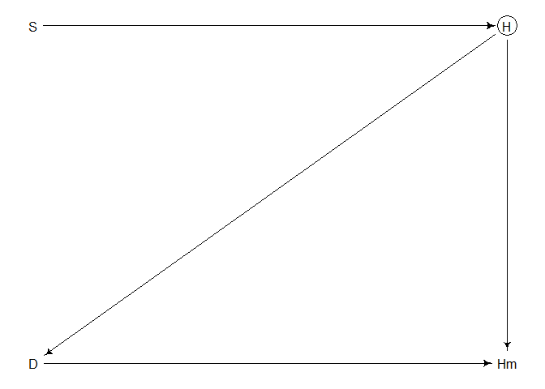<!-- -->

``` r
N <- 100
S <- rnorm(N)
H <- rbinom(N, size = 10, inv_logit(S))
D <- ifelse(H < 5, 1, 0)
Hm <- H
Hm[D == 1] <- NA
Hm
```

    ##   [1] NA NA  5 NA  7  6 10  7  9 NA  9  8  6  8  5  9  7 NA NA NA  8 NA  8  9 NA
    ##  [26] NA NA NA NA  6  7  9  6 NA NA NA NA  7  5 NA NA NA  5  5 NA  5 NA  7  5  6
    ##  [51]  7  6  7  7 NA  7 NA  6  8  6 10  9 NA NA  7  6 NA NA  5  6  6 NA  5  5  5
    ##  [76] NA NA  8  6  6 NA  6  7  6  9  6 NA  5 NA  7  5 NA  5 NA  6 NA NA  7 NA  6

- Here, there’s not much at all we can do! There’s nothing we can
  condition on to block the non-causal path
  $S \rightarrow H \rightarrow D \rightarrow H^*$.
- The point here is to illustrate the diverse consequences of missing
  data and the importance of exploring our own scenarios.
- Even when we cannot completely eliminate the impact of missing data,
  we may be able to show through simulation that the impact is small.

### 15.2.2 Imputing primates

- *Imputation* allows us to (hopefully) avoid biased information and
  also use all the observed data.
- In any generative model, information about variables is explained by
  the model regardless of whether or not the data is observed.
- Let’s return to the primate milk example from chapter 5, where we used
  a *complete case* analysis.
- Let’s say $M$ is body mass, $B$ is neocortex percent, $K$ is milk
  energy, and $U$ is an unobserved variable:

``` r
milk_basic <-
  dagitty(
    "dag{
      U [unobserved]
      U -> M
      U -> B
      M -> K
      B -> K
    }"
  )

coordinates(milk_basic) <-
  list(x = c(M = 1, U = 2, K = 2, B = 3),
       y = c(M = 1, U = 1, K = 2, B = 1))

drawdag(milk_basic)
```

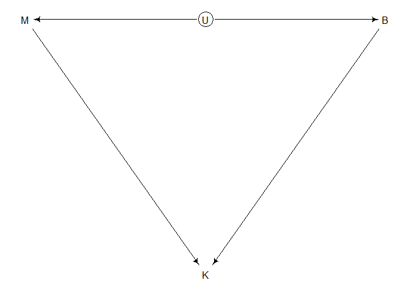<!-- -->

- Instead of having all these values directly, we have the observed
  $B^*$ that includes some missing values.
- We don’t know what process causes the missingness, so let’s consider
  some different DAGs that model the process of $B^*$ based on $R_B$ — a
  variable that indicates the species has missing values.
- First — let’s consider the hypothesis that $R_B$ is missing at random
  — there are no variables that influence it.

``` r
milk_1 <- 
  dagitty(
    "dag{
      U [unobserved]
      B [unobserved]
      U -> M
      U -> B
      M -> K
      B -> K
      B -> Bm
      R_B -> Bm
    }"
  )

coordinates(milk_1) <-
  list(x = c(M = 1, R_B = 2, U = 2, K = 2, Bm = 3, B = 3),
       y = c(M = 1, R_B = 0, U = 1, K = 2, Bm = 0, B = 1))

drawdag(milk_1)
```

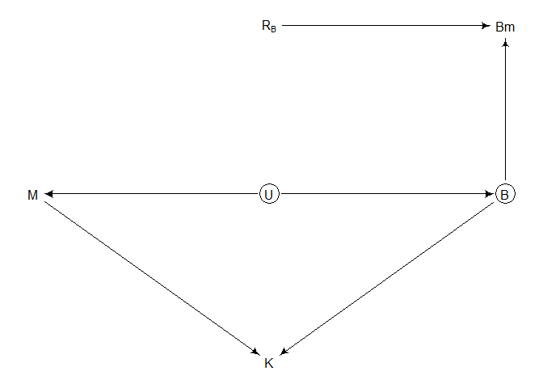<!-- -->

- Next, the body mass influences which species have missing values. This
  could happen if smaller primates are less often studied than larger
  ones.
- This introduces a non-causal path
  $B^* \leftarrow R_B \leftarrow M \rightarrow K$, but conditioning on
  $M$ blocks this path.

``` r
milk_2 <- 
  dagitty(
    "dag{
      U [unobserved]
      B [unobserved]
      U -> M
      U -> B
      M -> R_B
      M -> K
      B -> K
      B -> Bm
      R_B -> Bm
    }"
  )

coordinates(milk_2) <-
  coordinates(milk_1)

drawdag(milk_2)
```

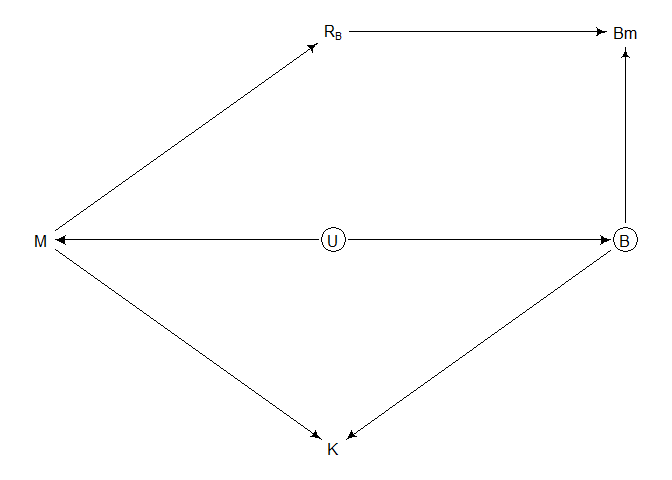<!-- -->

- Finally, let’s consider that the brain size itself influences $R_B$.
  This could be because anthropologists are more interested in
  large-brained species.
- If this is true, we won’t be able to test — the influence of
  $B \rightarrow K$ will be biased via a non-causal path through $R_B$.
- The statistical trick with Bayesian imputation is to model the
  variable with missing values. Each missing value receives a unique
  parameter — the observed data gives us a prior.
- Here, for example, we might have:

$$
\begin{gather}
B = [0.55, \ B_2, \ B_3, \ B_4, \ 0.65, \ 0.65, \ \dots, \ 0.76, \ 0.75]
\end{gather}
$$

- The simplest model for missing $B$ values will just draw from its own
  normal distribution:

$$
\begin{align*}
K_i & \sim \text{Normal}(\mu_i, \sigma) \\
\mu_i & = \alpha + \beta_B B_i + \beta_M \ \text{log} \ M_i \\
\color{orange}{B_i} & \color{orange}{\sim} \color{orange}{\text{Normal}(\nu, \sigma_B)} \\
\alpha & \sim \text{Normal}(0, 0.5) \\
\beta_B & \sim \text{Normal}(0, 0.5) \\
\beta_M & \sim \text{Normal}(0, 0.5) \\
\sigma & \sim \text{Exponential}(1) \\
\nu & \sim \text{Normal}(0.5, 1) \\
\sigma_B & \sim \text{Exponential}(1)
\end{align*}
$$

- This model ignores that $B$ and $M$ are associated through $U$. But
  let’s start with this just to keep things simple.
- The interpretation of $B_i \sim \text{Normal}(\nu, \sigma_B)$ is a bit
  weird.
- When $B_i$ is observed, this is a likelihood. When it’s missing, it’s
  a prior.
- In this case, $B$ is bound by 0 and 1, so a normal distribution might
  not be the best choice, but let’s just roll with it.
- All implementations of imputation are a bit awkward — since the
  locations of missing values have to be respected, it comes down to a
  lot of index management. `ulam()` handles a lot of this for us.

``` r
# load & prep data for stan
data(milk)
d <- milk
d$neocortex.prop <- d$neocortex.perc/100
d$logmass <- log(d$mass)

dat_list <-
  list(
    K = standardize(d$kcal.per.g),
    B = standardize(d$neocortex.prop),
    M = standardize(d$logmass)
  )

# model!
m15.5 <-
  ulam(
    alist(
      K ~ dnorm(mu, sigma),
      mu <- a + bB*B + bM*M,
      B ~ dnorm(nu, sigma_B),
      c(a, nu) ~ dnorm(0, 0.5),
      c(bB, bM) ~ dnorm(0, 0.5),
      sigma_B ~ dexp(1),
      sigma ~ dexp(1)
    ),
    
    data = dat_list,
    chains = 4,
    cores = 4
  )
```

    ## Found 12 NA values in B and attempting imputation.

``` r
precis(m15.5, depth = 2)
```

    ##                     mean        sd        5.5%      94.5%     n_eff     Rhat4
    ## nu           -0.03375601 0.2123511 -0.36414742  0.3102316 1836.5557 1.0003222
    ## a             0.02881734 0.1643644 -0.23457882  0.2870986 2724.1883 0.9999591
    ## bM           -0.53101002 0.2034316 -0.84807862 -0.2009409 1106.7066 1.0027951
    ## bB            0.48092165 0.2435120  0.08301144  0.8436267  863.0378 1.0026589
    ## sigma_B       1.00985221 0.1683427  0.77322971  1.2878488 1355.4752 1.0002386
    ## sigma         0.85299643 0.1429275  0.64632300  1.0973853 1289.2257 1.0010985
    ## B_impute[1]  -0.52232690 0.9519529 -1.94463981  1.0292449 1757.7138 1.0002946
    ## B_impute[2]  -0.66078752 0.9757835 -2.20175625  0.8989894 1435.5809 0.9992429
    ## B_impute[3]  -0.67420799 0.9949769 -2.29356907  0.8700286 1985.0711 1.0015302
    ## B_impute[4]  -0.22946653 0.9238075 -1.69184938  1.2135133 2613.8307 0.9988613
    ## B_impute[5]   0.45625419 0.8985267 -0.98630192  1.8528731 2578.7824 1.0001380
    ## B_impute[6]  -0.13826425 0.9498108 -1.58157366  1.3860490 2350.3319 1.0007201
    ## B_impute[7]   0.20228855 0.9166428 -1.25091582  1.6700400 2901.8077 0.9988039
    ## B_impute[8]   0.25860181 0.9270789 -1.23833620  1.7053715 2405.0797 1.0002929
    ## B_impute[9]   0.51523224 0.9284591 -0.95702804  1.9504728 2322.2177 1.0006388
    ## B_impute[10] -0.38607625 0.8941252 -1.76647810  0.9854197 1673.9399 0.9991061
    ## B_impute[11] -0.27799321 0.9022535 -1.68435290  1.1306616 2739.3411 0.9988508
    ## B_impute[12]  0.12849691 0.9260181 -1.41589641  1.5847263 2712.2609 0.9998876

- We get a parameter for each of the missing values! McElreath injects a
  function into the stan code to handle the accounting of keeping track
  of the indices:

``` r
stancode(m15.5)
```

    ## functions{
    ## 
    ## 
    ##     vector merge_missing( array[] int miss_indexes , vector x_obs , vector x_miss ) {
    ##         int N = dims(x_obs)[1];
    ##         int N_miss = dims(x_miss)[1];
    ##         vector[N] merged;
    ##         merged = x_obs;
    ##         for ( i in 1:N_miss )
    ##             merged[ miss_indexes[i] ] = x_miss[i];
    ##         return merged;
    ##     }
    ## }
    ## data{
    ##      vector[29] K;
    ##      vector[29] M;
    ##      vector[29] B;
    ##     array[12] int B_missidx;
    ## }
    ## parameters{
    ##      real nu;
    ##      real a;
    ##      real bM;
    ##      real bB;
    ##      real<lower=0> sigma_B;
    ##      real<lower=0> sigma;
    ##      vector[12] B_impute;
    ## }
    ## model{
    ##      vector[29] mu;
    ##      vector[29] B_merge;
    ##     sigma ~ exponential( 1 );
    ##     sigma_B ~ exponential( 1 );
    ##     bB ~ normal( 0 , 0.5 );
    ##     bM ~ normal( 0 , 0.5 );
    ##     a ~ normal( 0 , 0.5 );
    ##     nu ~ normal( 0 , 0.5 );
    ##     B_merge = merge_missing(B_missidx, to_vector(B), B_impute);
    ##     B_merge ~ normal( nu , sigma_B );
    ##     for ( i in 1:29 ) {
    ##         mu[i] = a + bB * B_merge[i] + bM * M[i];
    ##     }
    ##     K ~ normal( mu , sigma );
    ## }

- Let’s compare this to a model that drops the missing cases.

``` r
obs_idx <- which(!is.na(d$neocortex.prop))

dat_list_obs <-
  list(
    K = dat_list$K[obs_idx],
    B = dat_list$B[obs_idx],
    M = dat_list$M[obs_idx]
  )

m15.6 <-
  ulam(
    alist(
      # model
      K ~ dnorm(mu, sigma), 
      mu <- a + bB*B + bM*M,
      
      # missing (but it's not!)
      B ~ dnorm(nu, sigma_B),
      
      # priors
      c(a, nu) ~ dnorm(0, 0.5),
      c(bB, bM) ~ dnorm(0, 0.5),
      sigma_B ~ dexp(1),
      sigma ~ dexp(1)
    ),
    
    data = dat_list_obs,
    chains = 4,
    cores = 4
  )
```

- If we compare the parameter estimates — the model that imputes missing
  values, `m15.5`, has a narrower marginal distribution than the model
  that just drops cases, `m15.6`. This is because it’s using more data!

``` r
plot(coeftab(m15.5, m15.6), pars = c("bB", "bM"))
```

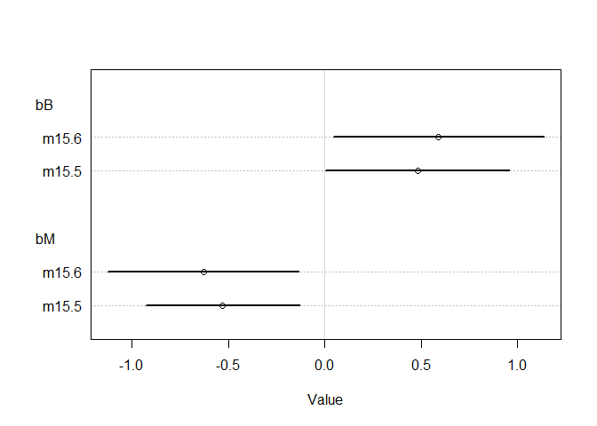<!-- -->

- We can also compare the imputed values alongside the non-missing
  values:

``` r
# get imputed values + ci
post <- extract.samples(m15.5)
B_impute_mu <- apply(post$B_impute, 2, mean)
B_impute_ci <- apply(post$B_impute, 2, PI)

# B vs K
plot(dat_list$B,
     dat_list$K,
     pch = 16,
     col = rangi2,
     xlab = "neocortex percent (std)",
     ylab = "kcal milk (std)")

miss_idx <- which(is.na(dat_list$B))
Ki <- dat_list$K[miss_idx]
points(B_impute_mu, Ki)
for (i in 1:12) lines(B_impute_ci[,i], rep(Ki[i], 2))
```

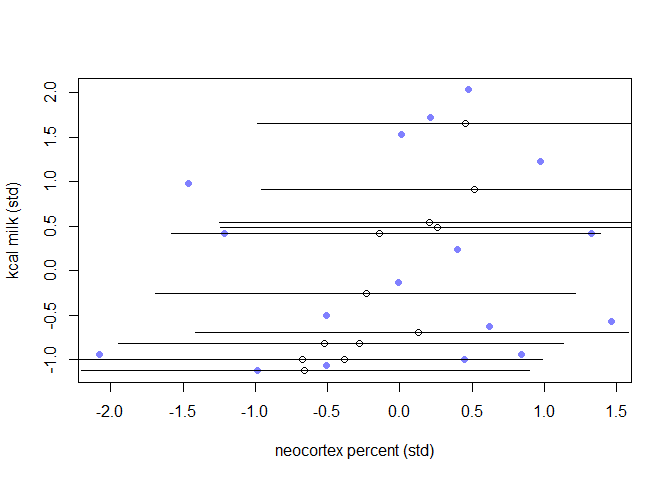<!-- -->

``` r
# next one!
plot(dat_list$M,
     dat_list$B,
     pch = 16,
     col = rangi2,
     ylab = "neocortex percent (std)",
     xlab = "log body mass (std)")

Mi <- dat_list$M[miss_idx]
points(Mi, B_impute_mu)
for (i in 1:12) lines(rep(Mi[i], 2), B_impute_ci[,i])
```

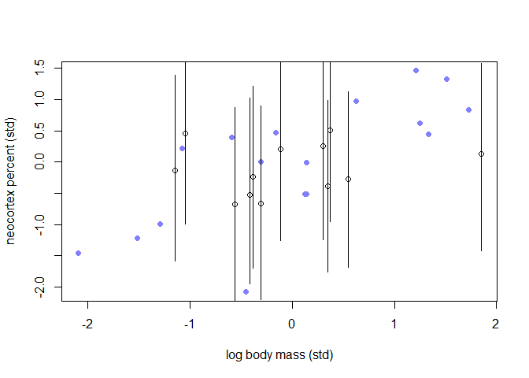<!-- -->

- Note that in the second plot, the imputed values do not show an upward
  slope. This is because the imputation model assumed no relationship
  between the predictors.
- We can improve the model by changing the imputation model to estimate
  the relationship between the two predictors.
- To do so, we just use the relationship between the predictors as
  indicated by the DAG — this just involves changing the imputation step
  for $B_i$ from a normal to a multivariate normal:

$$
\begin{gather}
(M_i, B_i) \sim \text{MVNormal}((\mu_M, \mu_B), S)
\end{gather}
$$

- This is the simplest model we could have used to describe the
  association between $M$ & $B$ — it assumes that the covariance is
  enough to describe the relationship.
- In `ulam()`, we have to construct a variable that includes both the
  observed $M$ values and the merged list of observed and imputed $B$
  values.

``` r
m15.7 <-
  ulam(
    alist(
      # K as a function of B and M
      K ~ dnorm(mu, sigma),
      mu <- a + bB*B_merge + bM*M,
      
      # M & B correlation
      MB ~ multi_normal(c(muM, muB), Rho_BM, Sigma_BM),
      matrix[29,2]:MB <<- append_col(M, B_merge),
      
      # define B_merge as a mix of observed and imputed values
      vector[29]:B_merge <- merge_missing(B, B_impute),
      
      # priors
      c(a, muB, muM) ~ dnorm(0, 0.5),
      c(bB, bM) ~ dnorm(0, 0.5),
      sigma ~ dexp(1),
      Rho_BM ~ lkj_corr(2),
      Sigma_BM ~ dexp(1)
    ),
    
    data = dat_list,
    chains = 4,
    cores = 4
  )

precis(m15.7, depth = 3, pars = c("bM", "bB", "Rho_BM"))
```

    ##                   mean           sd       5.5%      94.5%    n_eff     Rhat4
    ## bM          -0.6389530 2.260684e-01 -0.9951942 -0.2776904 1176.819 1.0019688
    ## bB           0.5753933 2.635759e-01  0.1350928  0.9709551 1041.479 1.0022923
    ## Rho_BM[1,1]  1.0000000 0.000000e+00  1.0000000  1.0000000      NaN       NaN
    ## Rho_BM[1,2]  0.6085015 1.291231e-01  0.3771064  0.7832287 1707.724 0.9999059
    ## Rho_BM[2,1]  0.6085015 1.291231e-01  0.3771064  0.7832287 1707.724 0.9999059
    ## Rho_BM[2,2]  1.0000000 7.192582e-17  1.0000000  1.0000000 1654.490 0.9979980

- The slopes for `bM` and `bB` haven’t changed too much, but if we look
  at the parameter comparison plot, we can see a positive association
  between the predictors (including the imputed ones):

``` r
# get imputed values + ci
post <- extract.samples(m15.7)
B_impute_mu <- apply(post$B_impute, 2, mean)
B_impute_ci <- apply(post$B_impute, 2, PI)

miss_idx <- which(is.na(dat_list$B))
Ki <- dat_list$K[miss_idx]

# next one!
plot(dat_list$M,
     dat_list$B,
     pch = 16,
     col = rangi2,
     ylab = "neocortex percent (std)",
     xlab = "log body mass (std)")

Mi <- dat_list$M[miss_idx]
points(Mi, B_impute_mu)
for (i in 1:12) lines(rep(Mi[i], 2), B_impute_ci[,i])
```

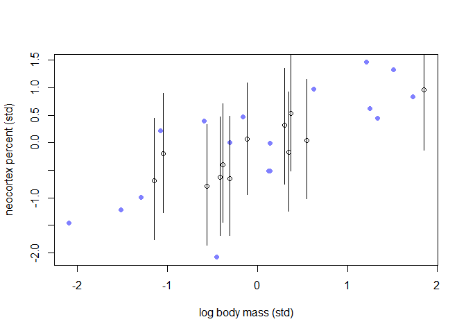<!-- -->

- This is clearly doing better and doing better is good!
- Some rethinking, *multiple imputation* gets used a lot in frequentist
  settings and is a bit more limited than full on Bayesian imputation,
  but you’ll still see it in the wild.
- Some overthinking with the stan code:

``` r
stancode(m15.5)
```

    ## functions{
    ## 
    ## 
    ##     vector merge_missing( array[] int miss_indexes , vector x_obs , vector x_miss ) {
    ##         int N = dims(x_obs)[1];
    ##         int N_miss = dims(x_miss)[1];
    ##         vector[N] merged;
    ##         merged = x_obs;
    ##         for ( i in 1:N_miss )
    ##             merged[ miss_indexes[i] ] = x_miss[i];
    ##         return merged;
    ##     }
    ## }
    ## data{
    ##      vector[29] K;
    ##      vector[29] M;
    ##      vector[29] B;
    ##     array[12] int B_missidx;
    ## }
    ## parameters{
    ##      real nu;
    ##      real a;
    ##      real bM;
    ##      real bB;
    ##      real<lower=0> sigma_B;
    ##      real<lower=0> sigma;
    ##      vector[12] B_impute;
    ## }
    ## model{
    ##      vector[29] mu;
    ##      vector[29] B_merge;
    ##     sigma ~ exponential( 1 );
    ##     sigma_B ~ exponential( 1 );
    ##     bB ~ normal( 0 , 0.5 );
    ##     bM ~ normal( 0 , 0.5 );
    ##     a ~ normal( 0 , 0.5 );
    ##     nu ~ normal( 0 , 0.5 );
    ##     B_merge = merge_missing(B_missidx, to_vector(B), B_impute);
    ##     B_merge ~ normal( nu , sigma_B );
    ##     for ( i in 1:29 ) {
    ##         mu[i] = a + bB * B_merge[i] + bM * M[i];
    ##     }
    ##     K ~ normal( mu , sigma );
    ## }

- The function at the top merges a vector of observed values with a
  vector of parameters to stand in the place of missing values.
- If you use `ulam()`, the `B_missidx` vector is built for you, but if
  you use stan directly you’ll need to build it yourself and pass to
  Stan as data:

``` r
B_missidx <- which(is.na(dat_list$B))
B_missidx
```

    ##  [1]  2  3  4  5  9 14 15 17 19 21 23 26

### 15.2.3 Where is your god now?

- Sometimes there aren’t statistical solutions to scientific problems,
  but in these cases we can still use statistical thinking to tell us
  there is no statistical solution!
- As an example, in some religions God punishes the wicked and rewards
  the just — these are “moralizing gods.” In others, gods behave
  independently from humans.
- One question might be — does such a difference in belief have any
  consequences for society? Say, do societies with moralizing gods grow
  faster/tend to replace societies with less moralizing gods?

``` r
data("Moralizing_gods")
str(Moralizing_gods)
```

    ## 'data.frame':    864 obs. of  5 variables:
    ##  $ polity         : Factor w/ 30 levels "Big Island Hawaii",..: 1 1 1 1 1 1 1 1 1 2 ...
    ##  $ year           : int  1000 1100 1200 1300 1400 1500 1600 1700 1800 -600 ...
    ##  $ population     : num  3.73 3.73 3.6 4.03 4.31 ...
    ##  $ moralizing_gods: int  NA NA NA NA NA NA NA NA 1 NA ...
    ##  $ writing        : int  0 0 0 0 0 0 0 0 0 0 ...

- The `population` is on the log scale for different regions (`polity`)
  across different centuries (`year`).
- `moralizing_gods` can be 1 for yes, 0 for no, or `NA` for unknown.
- Does belief in moralizing gods increase the rate of population growth?
- This is a tough causal cookie — there are many unobserved confounds.
  But if we (incorrectly) assume that the year moralizing gods appear in
  a society, we can sort of treat the problem as a *regression
  disontinuity* one.
- There are *a lot* of missing values here:

``` r
table(Moralizing_gods$moralizing_gods, useNA = "always")
```

    ## 
    ##    0    1 <NA> 
    ##   17  319  528

- There’s a lot of missing data, many 1s, and only a few 0s — remember
  that the impact of missing data depends on the process that produced
  them.
- Plotting may help visualize the problem:

``` r
symbol <- ifelse(Moralizing_gods$moralizing_gods == 1, 16, 1)
symbol <- ifelse(is.na(Moralizing_gods$moralizing_gods), 4, symbol)
color <- ifelse(is.na(Moralizing_gods$moralizing_gods), "black", rangi2)
plot(Moralizing_gods$year,
     Moralizing_gods$population,
     pch = symbol,
     col = color,
     xlab = "Time (year)",
     ylab = "Population size",
     lwd = 1.5)
```

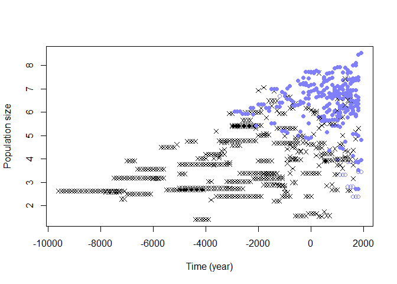<!-- -->

- Filled blue points are the presence of moralizing gods while open blue
  points are the presence of other types of gods. X’s are missing!
- This is highly non-random! Written records are usually needed to
  determine historical religious beliefs:

``` r
with(Moralizing_gods,
     table(gods = moralizing_gods, literacy = writing, useNA = "always"))
```

    ##       literacy
    ## gods     0   1 <NA>
    ##   0     16   1    0
    ##   1      9 310    0
    ##   <NA> 442  86    0

- The majority of the missing values are for non-literate polities — no
  writing means no evidence of any kind, generally.
- This situation can’t be saved by statistics, but it’s useful to reason
  as to why.
- Could we just drop the missing values & use a *complete case
  analysis*? Probably not! This will bias our inference.
- An optimistic DAG might be:

``` r
gods <-
  dagitty(
    "dag{
      G [unobserved]
      G -> P
      G -> Gm
      P -> W
      W -> R_G
      R_G -> Gm
    }"
  )

coordinates(gods) <-
  list(x = c(P = 1, W = 1.5, G = 2, R_G = 2.5, Gm = 3),
       y = c(P = 1, W = 2, G = 1, R_G = 2, Gm = 1))

drawdag(gods)
```

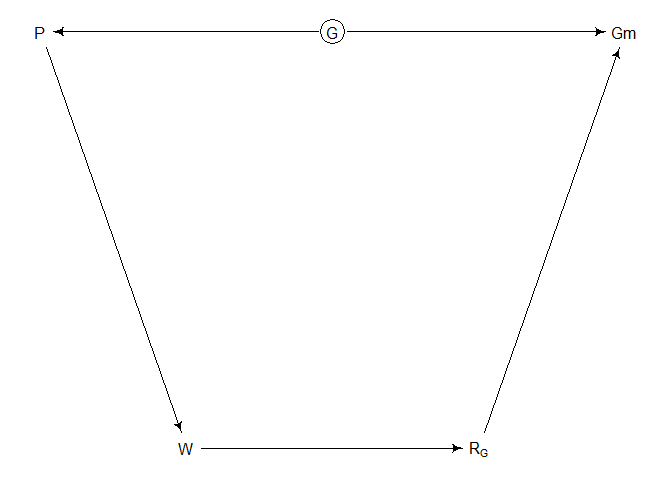<!-- -->

- Here, $P$ is the rate of population growth (not population size shown
  in the dataset), $G$ is the presence of belief in moralizing gods,
  $Gm$ is the observed variable with missing values, $W$ is writing, and
  $R_G$ is the missing values indicator.
- This is optimistic because it assumes there are no unobserved
  confounds.
- We want to know if the outcome, $P$, is independent of missingness,
  $R_G$.
- This is clearly not a dog-eats-homework at random scenario — $R_G$ is
  not missing randomly. $R_G$ is assumed to be explained by $W$, which
  is (unfortunately) influenced by $P$. If we condition on $W$ it could
  make things worse (it’d be like conditioning on the outcome variable),
  since $P \rightarrow W$. Conditioning on $R_G$ would not help —
  there’s no structural reason to trust an estimate of
  $Gm \rightarrow P$.
- If we could somehow condition on $G$ instead of $Gm$, we’d be in the
  clear. But we need to have a good approximation of the generative
  model of the variable, for which there’s no obvious answer.
- For example, Hawaii was a large complex polity with moralizing gods by
  1778 — the year that James Cook & his crew finally made contact:

``` r
haw <- which(Moralizing_gods$polity == "Big Island Hawaii")
columns <- c("year", "writing", "moralizing_gods")
t(Moralizing_gods[haw, columns])
```

    ##                    1    2    3    4    5    6    7    8    9
    ## year            1000 1100 1200 1300 1400 1500 1600 1700 1800
    ## writing            0    0    0    0    0    0    0    0    0
    ## moralizing_gods   NA   NA   NA   NA   NA   NA   NA   NA    1

- After contact, Hawaii is correctly coded with 1 for a belief in
  moralizing gods. But there’s no direct evidence of when these gods
  came into Hawaii’s society, since Hawaii had no writing system of its
  own.
- An imputation model would *have* to make very strong assumptions.
- One (unfortunately common) method might be to just assume that
  moralizing gods aren’t present when the value is missing. This
  procedure results in biased estimates.
- In principle, we could perform model based imputation for the missing
  values, but we don’t have any obviously correct way to do this. We
  can’t just associate the presence/absence of moralizing gods with
  population size, because that’s the very question under investigation!
- Our statistical investigation leads us to the conclusion that more
  research is needed to replace the `NA`s with observations!
- Another obstacle to imputing the `moralizing_gods` variable: it’s
  discrete! This is computationally trickier than imputing continuous
  variables.

## 15.3 Categorical errors and discrete absences

- Previous examples focused on nice continuous variables — discrete
  variables are a bit more difficult.
- Discrete variables don’t produce a smooth surface for HMC to glide
  around on & discrete jumps are difficult to calibrate, so chains tend
  to get stuck for long periods.
- To get around this, we can use a *weighted average* to remove discrete
  parameters from the model. We sample the other parameters, then use
  their samples to compute the posterior for the removed discrete
  parameter.

### 15.3.1 Discrete cats

- Imagine a neighborhood in which every house contains a songbird. Let’s
  survey the neighborhood & count the number of notes each bird sings in
  one minute.
- Some houses have cats, which may affect the amount each bird sings. In
  some cases, it’s easy to tell if a house has a cat (because the cat is
  there) or not (because someone lets you know). In about 20%, though,
  you can’t determine if there is or isn’t a cat.

``` r
cats <-
  dagitty(
    "dag{
      C [unobserved]
      R_C -> Cm
      C -> Cm
      C -> N
    }"
  )

coordinates(cats) <-
  list(x = c(R_C = 1, Cm = 2, C = 3, N = 4),
       y = c(R_C = 0, Cm = 0, C = 0, N = 0))

drawdag(cats)
```

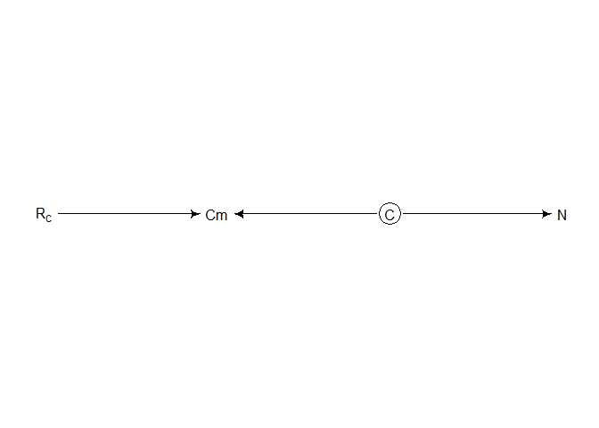<!-- -->

- Here, the presence/absence of a cat $C$ influences the number of notes
  sung $N$. Because of missing values $R_C$, however, we only observe
  $C^*$. A generative model of the DAG might be:

$$
\begin{align*}
N_i & \sim \text{Poisson}(\lambda_i) \\
\text{log} \ \lambda_i & = \alpha + \beta C_i \\
C_i & \sim \text{Bernoulli}(k) \\
R_{C, i} & \sim \text{Bernoulli}(r)
\end{align*}
$$

``` r
set.seed(9)

# set true parameters
N_houses <- 100L
alpha <- 5
beta <- -3
k <- 0.5
r <- 0.2

# simulate observations
cat <- rbern(N_houses, k)
notes <- rpois(N_houses, alpha + beta*cat)
R_C <- rbern(N_houses, r)
cat_obs <- cat
cat_obs[R_C == 1] <- -9L

# prep for stan
dat <-
  list(
    notes = notes,
    cat = cat_obs,
    RC = R_C,
    N = as.integer(N_houses)
  )
```

- Here, each unknown value of `cat_obs` is replaced with `-9`. The model
  should skip these anyway, but it’s useful to set to some invalid value
  in case there’s a bug & the model tries to sample them. In this case,
  `cat` is drawn from a Bernoulli distribution, so if the model ever
  asks for the probability of observing -9, there will be an error!
- We can’t declare a parameter for each unobserved cat, so we instead
  average over the uncertainty in whether the cat was there or not.

$$
\begin{align*}
\Pr(N_i) & = \Pr(C_i = 1) \ \Pr(N_i | C_i = 1) + \Pr(C_i = 0) \ \Pr(N_i | C_i = 0) 
\end{align*}
$$

- When we don’t know $C_i$, we compute the likelihood of $N_i$ for each
  possible $C_i$ then average the likelihoods with the probabilities
  that $C_i$ takes on each value.

``` r
m15.8 <-
  ulam(
    alist(
      # singing bird model
      ## cat known present/absent:
      notes|RC==0 ~ poisson(lambda),
      log(lambda) <- a + b*cat,
      ## cat NA
      notes|RC==1 ~ custom(log_sum_exp(
        log(k) + poisson_lpmf(notes | exp(a + b)),
        log(1 - k) + poisson_lpmf(notes | exp(a))
      )),
      
      # priors
      a ~ normal(0, 1),
      b ~ normal(0, 0.5),
      
      # sneaking cat model
      cat|RC==0 ~ bernoulli(k),
      k ~ beta(2, 2)
    ),
    
    data = dat,
    chains = 4,
    cores = 4
  )

precis(m15.8)
```

    ##         mean         sd       5.5%      94.5%    n_eff     Rhat4
    ## a  1.6065684 0.06253717  1.5051730  1.7069034 1334.194 0.9994578
    ## b -0.7963207 0.11645153 -0.9858555 -0.6178590 1350.469 1.0021709
    ## k  0.4619135 0.05278555  0.3791726  0.5470623 1679.410 0.9985862

- The likelihood gets split — `notes|RC==0` reads as “the probability of
  $N$ when $R_C = 0$. This is our normal model when we know the cat’s
  presence/absence.
- The next lines are for the average likelihood when the
  presence/absence isn’t observed. It’s basically just the previous line
  on the log scale.
- The sneaking cat presence/absence model is at the bottom — when we
  know the presence/absence of the cat $R_C = 0$, we want to use that
  observation to update $k$, the probability that a cat is present.
- Now let’s see how we can check the presence/absence of any given cat,
  given that we know how many notes were sung:

$$
\begin{align*}
\Pr(C_i=1|N_i) & = \frac{\Pr(N_i|C_i=1)\ \Pr(C_i=1)}{\Pr(N_i|C_i=1)\ \Pr(C_i=1)+\Pr(N_i|C_i=0)\ \Pr(C_i=0)}
\end{align*}
$$

- Take a look closesly — it’s less threatening than it looks.
- We can have Stan calculate this for us in the *generated quantities*
  block:

``` r
m15.9 <-
  ulam(
    alist(
      # singing bird model
      notes|RC==0 ~ poisson(lambda),
      notes|RC==1 ~ custom(log_sum_exp(
        log(k) + poisson_lpmf(notes | exp(a + b)),
        log(1 - k) + poisson_lpmf(notes | exp(a))
      )),
      log(lambda) <- a + b*cat,
      
      # priors
      a ~ normal(0, 1),
      b ~ normal(0, 0.5),
      
      # sneaking cat model
      cat|RC==0 ~ bernoulli(k),
      k ~ beta(2, 2),
      
      # imputed values
      gq> vector[N]:PrC1 <- exp(lpC1)/(exp(lpC1) + exp(lpC0)),
      gq> vector[N]:lpC1 <- log(k) + poisson_lpmf(notes[i] | exp(a + b)),
      gq> vector[N]:lpC0 <- log(1 - k) + poisson_lpmf(notes[i] | exp(a))
    ),
    
    data = dat,
    chains = 4,
    cores = 4
  )

# probability of the last few cats being present or nah
precis(m15.9, depth = 2)[293:303,]
```

    ##                 mean         sd       5.5%     94.5%    n_eff    Rhat4
    ## PrC1[90]  0.84861394 0.04622191 0.76674781 0.9123811 1241.868 1.002998
    ## PrC1[91]  0.35273468 0.06794378 0.24499825 0.4663046 1509.169 1.003449
    ## PrC1[92]  0.35273468 0.06794378 0.24499825 0.4663046 1509.169 1.003449
    ## PrC1[93]  0.54303945 0.06724622 0.43163805 0.6474952 1474.942 1.003455
    ## PrC1[94]  0.72168533 0.05887628 0.62406879 0.8084962 1344.062 1.003282
    ## PrC1[95]  0.05358407 0.02918060 0.01961007 0.1051728 1341.773 1.002792
    ## PrC1[96]  0.72168533 0.05887628 0.62406879 0.8084962 1344.062 1.003282
    ## PrC1[97]  0.72168533 0.05887628 0.62406879 0.8084962 1344.062 1.003282
    ## PrC1[98]  0.72168533 0.05887628 0.62406879 0.8084962 1344.062 1.003282
    ## PrC1[99]  0.10607967 0.04334385 0.04868658 0.1812624 1397.095 1.003034
    ## PrC1[100] 0.10607967 0.04334385 0.04868658 0.1812624 1397.095 1.003034

``` r
stancode(m15.9)
```

    ## data{
    ##      int N;
    ##     array[100] int RC;
    ##     array[100] int cat;
    ##     array[100] int notes;
    ## }
    ## parameters{
    ##      real a;
    ##      real b;
    ##      real<lower=0,upper=1> k;
    ## }
    ## model{
    ##      vector[100] lambda;
    ##     k ~ beta( 2 , 2 );
    ##     for ( i in 1:100 ) 
    ##         if ( RC[i] == 0 ) cat[i] ~ bernoulli( k );
    ##     b ~ normal( 0 , 0.5 );
    ##     a ~ normal( 0 , 1 );
    ##     for ( i in 1:100 ) {
    ##         lambda[i] = a + b * cat[i];
    ##         lambda[i] = exp(lambda[i]);
    ##     }
    ##     for ( i in 1:100 ) 
    ##         if ( RC[i] == 1 ) target += log_sum_exp(log(k) + poisson_lpmf(notes[i] | exp(a + b)), log(1 - k) + poisson_lpmf(notes[i] | exp(a)));
    ##     for ( i in 1:100 ) 
    ##         if ( RC[i] == 0 ) notes[i] ~ poisson( lambda[i] );
    ## }
    ## generated quantities{
    ##      vector[N] PrC1;
    ##      vector[N] lpC1;
    ##      vector[N] lpC0;
    ##     for ( i in 1:N ) {
    ##         lpC0[i] = log(1 - k) + poisson_lpmf(notes[i] | exp(a));
    ##     }
    ##     for ( i in 1:N ) {
    ##         lpC1[i] = log(k) + poisson_lpmf(notes[i] | exp(a + b));
    ##     }
    ##     for ( i in 1:N ) {
    ##         PrC1[i] = exp(lpC1[i])/(exp(lpC1[i]) + exp(lpC0[i]));
    ##     }
    ## }

- The strategy extrapolates to discrete variables with more than two
  possible values — you just need more than two terms in your average
  likelihood. For example, if houses can have up to two cats, the cats
  might be binomially distributed:

``` r
notes|RC==1 ~ custom(log_sum_exp(
  binomial_lpmf(2 | 2, k) + poisson_lpmf(notes | exp(a + b*2)),
  binomial_lpmf(1 | 2, k) + poisson_lpmf(notes | exp(a + b*1)),
  binomial_lpmf(0 | 2, k) + poisson_lpmf(notes | exp(a + b*0))
))
```

- Unordered terms work the same way, but the leading terms would be from
  some simplex of probabilities.
- We can also extend this to more than one discrete variable with
  missing values — say there’s also a variable for dog $D_i$
  presence/absence. In this case, we can have 4 possible cases:
  1.  cat and dog
  2.  cat
  3.  dog
  4.  neither cat nor dog (sad)
- If both the cat and dog variables are `NA`, we have to average over
  all four possibilities above, with prior terms for both cat and dog:

$$
\begin{align*}
\Pr(N_i) & = \Pr(C_i=1)\ \Pr(D_i=1)\ \Pr(N_i|C_i=1,D_i=1) \\
& \ + \Pr(C_i=1)\ \Pr(D_i=0)\ \Pr(N_i|C_i=1,D_i=0) \\
& \ + \Pr(C_i=0)\ \Pr(D_i=1)\ \Pr(N_i|C_i=0,D_i=1) \\
& \ + \Pr(C_i=0)\ \Pr(D_i=0)\ \Pr(N_i|C_i=0,D_i=0)
\end{align*}
$$

- If only the cat is `NA` and the dog is known present $D_i = 1$, then
  we only have to average over possibilities 1/3.
- If only the dog is `NA` and the cat is known absent $C_i = 0$, then we
  only have to average over possibilities 3/4.
- In principle, this is algorithmic and easy. In practice, it makes for
  complicated code, since you have to account for all combinations of
  missingness & assign each a different average likelihood.
- We’ll see this again in the next chapter when we encounter the *state
  space model*. State space models can have a large number of discrete
  or continuous unobserved variables.
- We typically don’t write out each possibility explicitly in code, but
  instead use an algorithm to compute the average likelihood.
- For example, in a *Hidden Markov Model*, an algorithm known as the
  *forward algorithm* does the averaging. You can read more in the Stan
  user manual.

### 15.3.2 Discrete error

- The example above concerned missing data, but when the data are
  measured with error, the procedure is very similar.

> Suppose for example that in the example above each house is assigned a
> probability of a cat being present. Call this probability $k_i$. When
> we are sure there is a cat there, $k_i = 1$. When we are sure there is
> no cat, $k_i = 0$. When we think it’s a coin flip, $k_i = 0.5$. These
> $k_i$ values replace the parameter $k$ in the previous model, becoming
> weights for averaging our uncertainty.

## 15.4 Summary

- This chapter introduced the design and implementation of measurement
  error and missing data models.
- Incorporating the cause of measurement error and missing data into a
  generative model helps decide how they impact inference & how we
  design a statistical procedure.
