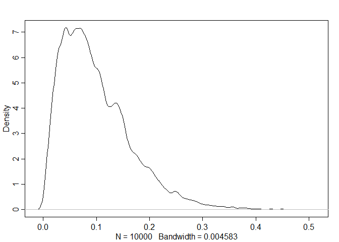

Generalized Linear Madness
================

- Sciences construct mathematical models of natural processes that are
  specialized and can fail in precise ways.
- Statistics has to apply to all the sciences, so it generally has much
  vaguer models that focus on average performance.
- GLMs are powerful tools (especially in combination with DAGs &
  *do*-calculus for causal inference) but they are descriptions of
  associations and are not necessarily credible scientific models for
  natural processes.
- GLMs can also be restrictive — not everything can be modeled as a
  linear combination of variables mapped onto a non-linear outcome.
- In this chapter, we’ll go beyond *generalized linear madness* and work
  through examples in which the scientific context provides a causal
  model to inform a statistical model.

## 16.1 Geometric people

- Let’s suppose a person is shaped like a cylinder (spherical cow!). We
  can then have a scientific model that predicts the weight of a person
  based on their volume, rather than a linear regression between height
  & weight.

### 16.1.1 The scientific model

- The volume of a cylinder is given by:

$$
V = \pi r^2 h
$$

- Let’s assume that a person’s radius is some constant proportion of
  their height, $p$. So we can substitute $r = ph$:

$$
\begin{align*}
V & = \pi(ph)^2h \\
V & = \pi p^2h^3
\end{align*}
$$

- Finally, weight is the volume multiplied by a density $k$:

$$
W = kV = k \pi p^2h^3
$$

- This is not a linear model! But that’s okay! It has a causal
  structure, it makes predictions, and we can fit it to data.

### 16.1.2 The statistical model

$$
\begin{align*}
W_i & \sim \text{Log-Normal}(\mu_i, \sigma) \\
\text{exp}(\mu_i) & = k \pi p^2h^3 \\
k & \sim \text{some prior} \\
p & \sim \text{some prior} \\
\sigma & \sim \text{Exponential}(1)
\end{align*}
$$

- Here, $W$ follows a Log Normal distribution, since it must be positive
  and continuous.
- $k$ and $p$ are multiplied together directly & therefore we’d say that
  these are *not identifiable*.
- We can, however, just replace $kp^2$ with a new parameter $\theta$
  instead:

$$
\text{exp}(\mu_i) = \pi \theta h_i^3
$$

- This’ll give us the same predictions, but will give us a harder time
  in setting a reasonable prior for $\theta$.
- $p$ is the ratio $r/h$, so must be greater than 0. It’s very likely
  less than 1 (not many people wider than they are tall!) and probably
  less than 0.5. Here’s a reasonable prior for $p$:

$$
p \sim \text{Beta}(2, 18)
$$

``` r
rbeta(1e4, 2, 18) |> rethinking::dens()
```

<!-- -->

- $k$ is really just a translation in measurement scales (i.e., if
  weight is measured in kg and volume in cm^3, then $k$ must have units
  kg/cm^3).
- One useful trick is to try to get rid of the measurement scales
  altogether! They’re an arbitrary human invention. We can do so by
  dividing out by a reference value to cancel units — in this case we’ll
  use the mean.

``` r
library(rethinking)
```

    ## Loading required package: rstan

    ## Loading required package: StanHeaders

    ## 
    ## rstan version 2.26.15 (Stan version 2.26.1)

    ## For execution on a local, multicore CPU with excess RAM we recommend calling
    ## options(mc.cores = parallel::detectCores()).
    ## To avoid recompilation of unchanged Stan programs, we recommend calling
    ## rstan_options(auto_write = TRUE)
    ## For within-chain threading using `reduce_sum()` or `map_rect()` Stan functions,
    ## change `threads_per_chain` option:
    ## rstan_options(threads_per_chain = 1)

    ## Do not specify '-march=native' in 'LOCAL_CPPFLAGS' or a Makevars file

    ## Loading required package: cmdstanr

    ## This is cmdstanr version 0.5.3

    ## - CmdStanR documentation and vignettes: mc-stan.org/cmdstanr

    ## - CmdStan path: C:/Users/E1735399/Documents/.cmdstan/cmdstan-2.31.0

    ## - CmdStan version: 2.31.0

    ## Loading required package: parallel

    ## rethinking (Version 2.31)

    ## 
    ## Attaching package: 'rethinking'

    ## The following object is masked from 'package:rstan':
    ## 
    ##     stan

    ## The following object is masked from 'package:stats':
    ## 
    ##     rstudent

``` r
data("Howell1")
d <- Howell1

# scale observed variables
d$w <- d$weight/mean(d$weight)
d$h <- d$height/mean(d$height)
```

- There’s nothing special about using the means, we just need to use a
  reference to cancel out the units.
- Now let’s consider $k$ — for a person with an average height & weight,
  we get:

$$
1 = k \pi p^2 1^3
$$

- Since $p < 0.5$, $k$ must be greater than 1. Let’s constrain it to be
  positive with a rough mean of 2:

$$
k \sim \text{Exponential}(0.5)
$$

- Prior-predictive simulation could reveal that we can do better, but
  this gives us a starting point to model:

``` r
m16.1 <-
  ulam(
    alist(
      w ~ dlnorm(mu, sigma),
      exp(mu) <- 3.1415926 * k * p^2 * h^3,
      p ~ beta(2, 18),
      k ~ exponential(0.5),
      sigma ~ exponential(1)
    ),
    
    data = d,
    chains = 4,
    cores = 4
  )
```

    ## In file included from stan/lib/stan_math/lib/boost_1.78.0/boost/multi_array/multi_array_ref.hpp:32,
    ##                  from stan/lib/stan_math/lib/boost_1.78.0/boost/multi_array.hpp:34,
    ##                  from stan/lib/stan_math/lib/boost_1.78.0/boost/numeric/odeint/algebra/multi_array_algebra.hpp:22,
    ##                  from stan/lib/stan_math/lib/boost_1.78.0/boost/numeric/odeint.hpp:63,
    ##                  from stan/lib/stan_math/stan/math/prim/functor/ode_rk45.hpp:9,
    ##                  from stan/lib/stan_math/stan/math/prim/functor/integrate_ode_rk45.hpp:6,
    ##                  from stan/lib/stan_math/stan/math/prim/functor.hpp:14,
    ##                  from stan/lib/stan_math/stan/math/rev/fun.hpp:198,
    ##                  from stan/lib/stan_math/stan/math/rev.hpp:10,
    ##                  from stan/lib/stan_math/stan/math.hpp:19,
    ##                  from stan/src/stan/model/model_header.hpp:4,
    ##                  from C:/Users/E1735399/AppData/Local/Temp/RtmpKW4jzY/model-27ec46b17987.hpp:3:
    ## stan/lib/stan_math/lib/boost_1.78.0/boost/functional.hpp:180:45: warning: 'template<class _Arg, class _Result> struct std::unary_function' is deprecated [-Wdeprecated-declarations]
    ##   180 |         : public boost::functional::detail::unary_function<typename unary_traits<Predicate>::argument_type,bool>
    ##       |                                             ^~~~~~~~~~~~~~

    ## In file included from C:/rtools42/ucrt64/include/c++/12.2.0/string:48,
    ##                  from C:/rtools42/ucrt64/include/c++/12.2.0/bits/locale_classes.h:40,
    ##                  from C:/rtools42/ucrt64/include/c++/12.2.0/bits/ios_base.h:41,
    ##                  from C:/rtools42/ucrt64/include/c++/12.2.0/ios:42,
    ##                  from C:/rtools42/ucrt64/include/c++/12.2.0/istream:38,
    ##                  from C:/rtools42/ucrt64/include/c++/12.2.0/sstream:38,
    ##                  from C:/rtools42/ucrt64/include/c++/12.2.0/complex:45,
    ##                  from stan/lib/stan_math/lib/eigen_3.3.9/Eigen/Core:96,
    ##                  from stan/lib/stan_math/lib/eigen_3.3.9/Eigen/Dense:1,
    ##                  from stan/lib/stan_math/stan/math/prim/fun/Eigen.hpp:22,
    ##                  from stan/lib/stan_math/stan/math/rev.hpp:4:
    ## C:/rtools42/ucrt64/include/c++/12.2.0/bits/stl_function.h:117:12: note: declared here
    ##   117 |     struct unary_function
    ##       |            ^~~~~~~~~~~~~~
    ## stan/lib/stan_math/lib/boost_1.78.0/boost/functional.hpp:214:45: warning: 'template<class _Arg1, class _Arg2, class _Result> struct std::binary_function' is deprecated [-Wdeprecated-declarations]
    ##   214 |         : public boost::functional::detail::binary_function<
    ##       |                                             ^~~~~~~~~~~~~~~
    ## C:/rtools42/ucrt64/include/c++/12.2.0/bits/stl_function.h:131:12: note: declared here
    ##   131 |     struct binary_function
    ##       |            ^~~~~~~~~~~~~~~
    ## stan/lib/stan_math/lib/boost_1.78.0/boost/functional.hpp:252:45: warning: 'template<class _Arg, class _Result> struct std::unary_function' is deprecated [-Wdeprecated-declarations]
    ##   252 |         : public boost::functional::detail::unary_function<
    ##       |                                             ^~~~~~~~~~~~~~
    ## C:/rtools42/ucrt64/include/c++/12.2.0/bits/stl_function.h:117:12: note: declared here
    ##   117 |     struct unary_function
    ##       |            ^~~~~~~~~~~~~~

    ## stan/lib/stan_math/lib/boost_1.78.0/boost/functional.hpp:299:45: warning: 'template<class _Arg, class _Result> struct std::unary_function' is deprecated [-Wdeprecated-declarations]
    ##   299 |         : public boost::functional::detail::unary_function<
    ##       |                                             ^~~~~~~~~~~~~~
    ## C:/rtools42/ucrt64/include/c++/12.2.0/bits/stl_function.h:117:12: note: declared here
    ##   117 |     struct unary_function
    ##       |            ^~~~~~~~~~~~~~
    ## stan/lib/stan_math/lib/boost_1.78.0/boost/functional.hpp:345:57: warning: 'template<class _Arg, class _Result> struct std::unary_function' is deprecated [-Wdeprecated-declarations]
    ##   345 |     class mem_fun_t : public boost::functional::detail::unary_function<T*, S>
    ##       |                                                         ^~~~~~~~~~~~~~
    ## C:/rtools42/ucrt64/include/c++/12.2.0/bits/stl_function.h:117:12: note: declared here
    ##   117 |     struct unary_function
    ##       |            ^~~~~~~~~~~~~~
    ## stan/lib/stan_math/lib/boost_1.78.0/boost/functional.hpp:361:58: warning: 'template<class _Arg1, class _Arg2, class _Result> struct std::binary_function' is deprecated [-Wdeprecated-declarations]
    ##   361 |     class mem_fun1_t : public boost::functional::detail::binary_function<T*, A, S>
    ##       |                                                          ^~~~~~~~~~~~~~~
    ## C:/rtools42/ucrt64/include/c++/12.2.0/bits/stl_function.h:131:12: note: declared here
    ##   131 |     struct binary_function
    ##       |            ^~~~~~~~~~~~~~~
    ## stan/lib/stan_math/lib/boost_1.78.0/boost/functional.hpp:377:63: warning: 'template<class _Arg, class _Result> struct std::unary_function' is deprecated [-Wdeprecated-declarations]
    ##   377 |     class const_mem_fun_t : public boost::functional::detail::unary_function<const T*, S>
    ##       |                                                               ^~~~~~~~~~~~~~
    ## C:/rtools42/ucrt64/include/c++/12.2.0/bits/stl_function.h:117:12: note: declared here
    ##   117 |     struct unary_function
    ##       |            ^~~

    ## ~~~~~~~~~~~
    ## stan/lib/stan_math/lib/boost_1.78.0/boost/functional.hpp:393:64: warning: 'template<class _Arg1, class _Arg2, class _Result> struct std::binary_function' is deprecated [-Wdeprecated-declarations]
    ##   393 |     class const_mem_fun1_t : public boost::functional::detail::binary_function<const T*, A, S>
    ##       |                                                                ^~~~~~~~~~~~~~~
    ## C:/rtools42/ucrt64/include/c++/12.2.0/bits/stl_function.h:131:12: note: declared here
    ##   131 |     struct binary_function
    ##       |            ^~~~~~~~~~~~~~~

    ## stan/lib/stan_math/lib/boost_1.78.0/boost/functional.hpp:438:61: warning: 'template<class _Arg, class _Result> struct std::unary_function' is deprecated [-Wdeprecated-declarations]
    ##   438 |     class mem_fun_ref_t : public boost::functional::detail::unary_function<T&, S>
    ##       |                                                             ^~~~~~~~~~~~~~
    ## C:/rtools42/ucrt64/include/c++/12.2.0/bits/stl_function.h:117:12: note: declared here
    ##   117 |     struct unary_function
    ##       |            ^~~~~~~~~~~~~~
    ## stan/lib/stan_math/lib/boost_1.78.0/boost/functional.hpp:454:62: warning: 'template<class _Arg1, class _Arg2, class _Result> struct std::binary_function' is deprecated [-Wdeprecated-declarations]
    ##   454 |     class mem_fun1_ref_t : public boost::functional::detail::binary_function<T&, A, S>
    ##       |                                                              ^~~~~~~~~~~~~~~
    ## C:/rtools42/ucrt64/include/c++/12.2.0/bits/stl_function.h:131:12: note: declared here
    ##   131 |     struct binary_function
    ##       |            ^~~~~~~~~~~~~~~
    ## stan/lib/stan_math/lib/boost_1.78.0/boost/functional.hpp:470:67: warning: 'template<class _Arg, class _Result> struct std::unary_function' is deprecated [-Wdeprecated-declarations]
    ##   470 |     class const_mem_fun_ref_t : public boost::functional::detail::unary_function<const T&, S>
    ##       |                                                                   ^~~~~~~~~~~~~~
    ## C:/rtools42/ucrt64/include/c++/12.2.0/bits/stl_function.h:117:12: note: declared here
    ##   117 |     struct unary_function
    ##       |            ^~~~~~~~~~~~~~
    ## stan/lib/stan_math/lib/boost_1.78.0/boost/functional.hpp:487:68: warning: 'template<class _Arg1, class _Arg2, class _Result> struct std::binary_function' is deprecated [-Wdeprecated-declarations]
    ##   487 |     class const_mem_fun1_ref_t : public boost::functional::detail::binary_function<const T&, A, S>
    ##       |                                                                    ^~~~~~~~~~~~~~~
    ## C:/rtools42/ucrt64/include/c++/12.2.0/bi

    ## ts/stl_function.h:131:12: note: declared here
    ##   131 |     struct binary_function
    ##       |            ^~~~~~~~~~~~~~~
    ## stan/lib/stan_math/lib/boost_1.78.0/boost/functional.hpp:533:73: warning: 'template<class _Arg, class _Result> struct std::unary_function' is deprecated [-Wdeprecated-declarations]
    ##   533 |     class pointer_to_unary_function : public boost::functional::detail::unary_function<Arg,Result>
    ##       |                                                                         ^~~~~~~~~~~~~~
    ## C:/rtools42/ucrt64/include/c++/12.2.0/bits/stl_function.h:117:12: note: declared here
    ##   117 |     struct unary_function
    ##       |            ^~~~~~~~~~~~~~
    ## stan/lib/stan_math/lib/boost_1.78.0/boost/functional.hpp:557:74: warning: 'template<class _Arg1, class _Arg2, class _Result> struct std::binary_function' is deprecated [-Wdeprecated-declarations]
    ##   557 |     class pointer_to_binary_function : public boost::functional::detail::binary_function<Arg1,Arg2,Result>
    ##       |                                                                          ^~~~~~~~~~~~~~~
    ## C:/rtools42/ucrt64/include/c++/12.2.0/bits/stl_function.h:131:12: note: declared here
    ##   131 |     struct binary_function
    ##       |            ^~~~~~~~~~~~~~~

    ## Running MCMC with 4 parallel chains, with 1 thread(s) per chain...
    ## 
    ## Chain 1 Iteration:   1 / 1000 [  0%]  (Warmup)

    ## Chain 1 Informational Message: The current Metropolis proposal is about to be rejected because of the following issue:

    ## Chain 1 Exception: lognormal_lpdf: Location parameter[1] is inf, but must be finite! (in 'C:/Users/E1735399/AppData/Local/Temp/RtmpKW4jzY/model-27ec46b17987.stan', line 23, column 4 to column 32)

    ## Chain 1 If this warning occurs sporadically, such as for highly constrained variable types like covariance matrices, then the sampler is fine,

    ## Chain 1 but if this warning occurs often then your model may be either severely ill-conditioned or misspecified.

    ## Chain 1

    ## Chain 1 Informational Message: The current Metropolis proposal is about to be rejected because of the following issue:

    ## Chain 1 Exception: lognormal_lpdf: Location parameter[1] is inf, but must be finite! (in 'C:/Users/E1735399/AppData/Local/Temp/RtmpKW4jzY/model-27ec46b17987.stan', line 23, column 4 to column 32)

    ## Chain 1 If this warning occurs sporadically, such as for highly constrained variable types like covariance matrices, then the sampler is fine,

    ## Chain 1 but if this warning occurs often then your model may be either severely ill-conditioned or misspecified.

    ## Chain 1

    ## Chain 1 Informational Message: The current Metropolis proposal is about to be rejected because of the following issue:

    ## Chain 1 Exception: lognormal_lpdf: Location parameter[1] is inf, but must be finite! (in 'C:/Users/E1735399/AppData/Local/Temp/RtmpKW4jzY/model-27ec46b17987.stan', line 23, column 4 to column 32)

    ## Chain 1 If this warning occurs sporadically, such as for highly constrained variable types like covariance matrices, then the sampler is fine,

    ## Chain 1 but if this warning occurs often then your model may be either severely ill-conditioned or misspecified.

    ## Chain 1

    ## Chain 1 Informational Message: The current Metropolis proposal is about to be rejected because of the following issue:

    ## Chain 1 Exception: lognormal_lpdf: Location parameter[1] is inf, but must be finite! (in 'C:/Users/E1735399/AppData/Local/Temp/RtmpKW4jzY/model-27ec46b17987.stan', line 23, column 4 to column 32)

    ## Chain 1 If this warning occurs sporadically, such as for highly constrained variable types like covariance matrices, then the sampler is fine,

    ## Chain 1 but if this warning occurs often then your model may be either severely ill-conditioned or misspecified.

    ## Chain 1

    ## Chain 1 Informational Message: The current Metropolis proposal is about to be rejected because of the following issue:

    ## Chain 1 Exception: lognormal_lpdf: Location parameter[1] is inf, but must be finite! (in 'C:/Users/E1735399/AppData/Local/Temp/RtmpKW4jzY/model-27ec46b17987.stan', line 23, column 4 to column 32)

    ## Chain 1 If this warning occurs sporadically, such as for highly constrained variable types like covariance matrices, then the sampler is fine,

    ## Chain 1 but if this warning occurs often then your model may be either severely ill-conditioned or misspecified.

    ## Chain 1

    ## Chain 2 Iteration:   1 / 1000 [  0%]  (Warmup)

    ## Chain 2 Informational Message: The current Metropolis proposal is about to be rejected because of the following issue:

    ## Chain 2 Exception: lognormal_lpdf: Location parameter[1] is -inf, but must be finite! (in 'C:/Users/E1735399/AppData/Local/Temp/RtmpKW4jzY/model-27ec46b17987.stan', line 23, column 4 to column 32)

    ## Chain 2 If this warning occurs sporadically, such as for highly constrained variable types like covariance matrices, then the sampler is fine,

    ## Chain 2 but if this warning occurs often then your model may be either severely ill-conditioned or misspecified.

    ## Chain 2

    ## Chain 3 Iteration:   1 / 1000 [  0%]  (Warmup)

    ## Chain 3 Informational Message: The current Metropolis proposal is about to be rejected because of the following issue:

    ## Chain 3 Exception: lognormal_lpdf: Location parameter[1] is -inf, but must be finite! (in 'C:/Users/E1735399/AppData/Local/Temp/RtmpKW4jzY/model-27ec46b17987.stan', line 23, column 4 to column 32)

    ## Chain 3 If this warning occurs sporadically, such as for highly constrained variable types like covariance matrices, then the sampler is fine,

    ## Chain 3 but if this warning occurs often then your model may be either severely ill-conditioned or misspecified.

    ## Chain 3

    ## Chain 4 Iteration:   1 / 1000 [  0%]  (Warmup)

    ## Chain 4 Informational Message: The current Metropolis proposal is about to be rejected because of the following issue:

    ## Chain 4 Exception: lognormal_lpdf: Location parameter[1] is inf, but must be finite! (in 'C:/Users/E1735399/AppData/Local/Temp/RtmpKW4jzY/model-27ec46b17987.stan', line 23, column 4 to column 32)

    ## Chain 4 If this warning occurs sporadically, such as for highly constrained variable types like covariance matrices, then the sampler is fine,

    ## Chain 4 but if this warning occurs often then your model may be either severely ill-conditioned or misspecified.

    ## Chain 4

    ## Chain 4 Informational Message: The current Metropolis proposal is about to be rejected because of the following issue:

    ## Chain 4 Exception: lognormal_lpdf: Location parameter[1] is inf, but must be finite! (in 'C:/Users/E1735399/AppData/Local/Temp/RtmpKW4jzY/model-27ec46b17987.stan', line 23, column 4 to column 32)

    ## Chain 4 If this warning occurs sporadically, such as for highly constrained variable types like covariance matrices, then the sampler is fine,

    ## Chain 4 but if this warning occurs often then your model may be either severely ill-conditioned or misspecified.

    ## Chain 4

    ## Chain 4 Informational Message: The current Metropolis proposal is about to be rejected because of the following issue:

    ## Chain 4 Exception: lognormal_lpdf: Location parameter[1] is -inf, but must be finite! (in 'C:/Users/E1735399/AppData/Local/Temp/RtmpKW4jzY/model-27ec46b17987.stan', line 23, column 4 to column 32)

    ## Chain 4 If this warning occurs sporadically, such as for highly constrained variable types like covariance matrices, then the sampler is fine,

    ## Chain 4 but if this warning occurs often then your model may be either severely ill-conditioned or misspecified.

    ## Chain 4

    ## Chain 4 Informational Message: The current Metropolis proposal is about to be rejected because of the following issue:

    ## Chain 4 Exception: lognormal_lpdf: Location parameter[1] is -inf, but must be finite! (in 'C:/Users/E1735399/AppData/Local/Temp/RtmpKW4jzY/model-27ec46b17987.stan', line 23, column 4 to column 32)

    ## Chain 4 If this warning occurs sporadically, such as for highly constrained variable types like covariance matrices, then the sampler is fine,

    ## Chain 4 but if this warning occurs often then your model may be either severely ill-conditioned or misspecified.

    ## Chain 4

    ## Chain 1 Iteration: 100 / 1000 [ 10%]  (Warmup) 
    ## Chain 3 Iteration: 100 / 1000 [ 10%]  (Warmup) 
    ## Chain 4 Iteration: 100 / 1000 [ 10%]  (Warmup) 
    ## Chain 2 Iteration: 100 / 1000 [ 10%]  (Warmup) 
    ## Chain 1 Iteration: 200 / 1000 [ 20%]  (Warmup) 
    ## Chain 2 Iteration: 200 / 1000 [ 20%]  (Warmup) 
    ## Chain 3 Iteration: 200 / 1000 [ 20%]  (Warmup) 
    ## Chain 4 Iteration: 200 / 1000 [ 20%]  (Warmup) 
    ## Chain 2 Iteration: 300 / 1000 [ 30%]  (Warmup) 
    ## Chain 1 Iteration: 300 / 1000 [ 30%]  (Warmup) 
    ## Chain 3 Iteration: 300 / 1000 [ 30%]  (Warmup) 
    ## Chain 4 Iteration: 300 / 1000 [ 30%]  (Warmup) 
    ## Chain 2 Iteration: 400 / 1000 [ 40%]  (Warmup) 
    ## Chain 3 Iteration: 400 / 1000 [ 40%]  (Warmup) 
    ## Chain 1 Iteration: 400 / 1000 [ 40%]  (Warmup) 
    ## Chain 4 Iteration: 400 / 1000 [ 40%]  (Warmup) 
    ## Chain 2 Iteration: 500 / 1000 [ 50%]  (Warmup) 
    ## Chain 2 Iteration: 501 / 1000 [ 50%]  (Sampling) 
    ## Chain 3 Iteration: 500 / 1000 [ 50%]  (Warmup) 
    ## Chain 3 Iteration: 501 / 1000 [ 50%]  (Sampling) 
    ## Chain 1 Iteration: 500 / 1000 [ 50%]  (Warmup) 
    ## Chain 4 Iteration: 500 / 1000 [ 50%]  (Warmup) 
    ## Chain 1 Iteration: 501 / 1000 [ 50%]  (Sampling) 
    ## Chain 4 Iteration: 501 / 1000 [ 50%]  (Sampling) 
    ## Chain 2 Iteration: 600 / 1000 [ 60%]  (Sampling) 
    ## Chain 3 Iteration: 600 / 1000 [ 60%]  (Sampling) 
    ## Chain 2 Iteration: 700 / 1000 [ 70%]  (Sampling) 
    ## Chain 4 Iteration: 600 / 1000 [ 60%]  (Sampling) 
    ## Chain 1 Iteration: 600 / 1000 [ 60%]  (Sampling) 
    ## Chain 3 Iteration: 700 / 1000 [ 70%]  (Sampling) 
    ## Chain 2 Iteration: 800 / 1000 [ 80%]  (Sampling) 
    ## Chain 4 Iteration: 700 / 1000 [ 70%]  (Sampling) 
    ## Chain 3 Iteration: 800 / 1000 [ 80%]  (Sampling) 
    ## Chain 1 Iteration: 700 / 1000 [ 70%]  (Sampling) 
    ## Chain 2 Iteration: 900 / 1000 [ 90%]  (Sampling) 
    ## Chain 4 Iteration: 800 / 1000 [ 80%]  (Sampling) 
    ## Chain 3 Iteration: 900 / 1000 [ 90%]  (Sampling) 
    ## Chain 1 Iteration: 800 / 1000 [ 80%]  (Sampling) 
    ## Chain 2 Iteration: 1000 / 1000 [100%]  (Sampling) 
    ## Chain 2 finished in 15.6 seconds.
    ## Chain 4 Iteration: 900 / 1000 [ 90%]  (Sampling) 
    ## Chain 1 Iteration: 900 / 1000 [ 90%]  (Sampling) 
    ## Chain 3 Iteration: 1000 / 1000 [100%]  (Sampling) 
    ## Chain 3 finished in 16.7 seconds.
    ## Chain 4 Iteration: 1000 / 1000 [100%]  (Sampling) 
    ## Chain 4 finished in 18.2 seconds.
    ## Chain 1 Iteration: 1000 / 1000 [100%]  (Sampling) 
    ## Chain 1 finished in 18.5 seconds.
    ## 
    ## All 4 chains finished successfully.
    ## Mean chain execution time: 17.2 seconds.
    ## Total execution time: 18.7 seconds.

``` r
precis(m16.1)
```

    ##            mean          sd      5.5%      94.5%    n_eff     Rhat4
    ## p     0.2474007 0.058551240 0.1676814  0.3526888 374.5334 1.0131517
    ## k     5.7557557 2.627144225 2.4271712 10.7201760 348.8055 1.0128950
    ## sigma 0.2065371 0.006334802 0.1963671  0.2169438 743.4989 0.9989348

- The non-identifiability of $p$ and $k$ means that we get a strong
  correlation in the parameters:

``` r
pairs(m16.1, pars = c("k", "p"))
```

    ## Warning in par(usr): argument 1 does not name a graphical parameter

    ## Warning in par(usr): argument 1 does not name a graphical parameter

<!-- -->

- The model has to maintain a constant $kp^2$ when $k$ and $p$ shift, at
  least according to this model.
- We could model $k$ and $p$ as functions of height or age or other
  parameters.
- Here’s the posterior predictive distribution across the observed
  height range:

``` r
h_seq <- seq(from = 0, to = max(d$h), length.out = 30)
w_sim <- sim(m16.1, data = list(h = h_seq))
mu_mean <- apply(w_sim, 2, mean)
w_CI <- apply(w_sim, 2, PI)

plot(d$h, d$w,
     xlim = c(0, max(d$h)),
     ylim = c(0, max(d$w)),
     col = rangi2,
     lwd = 2,
     xlab = "height (scaled)",
     ylab = "weight (scaled)")

lines(h_seq, mu_mean)
shade(w_CI, h_seq)
```

<!-- -->

- The model gets the general scaling right — the fixed exponent of 3
  from our theory does a great job.
- There’s a poor fit on some of the smaller heights, possibly because
  $p$ and/or $k$ is different for children.

### 16.1.3 GLM in disguize

- This model is actually a GLM in disguise!

$$
\begin{align*}
\log{w_i} & = \mu_i = \log{(k \pi p^2 h_i^3)} \\
\log{w_i} & = \log{k} + \log{\pi} + 2 \log{p} + 3 \log{h_i}
\end{align*}
$$

- On the log scale, this is just a plane jane linear regression! But our
  theory gave us the fixed parameters of 2 & 3.

## 16.2 Hidden minds and observed behavior

- The *inverse problem* is one of the most basic in scientific
  inference: how to figure out causes from observations.
- Let’s look at an inverse problem from developmental psychology — given
  some observation about children’s behavior, which decision making
  strategy caused the choice?
- Here’s an example in which 629 children from 4-14 saw four other
  children choose among colored boxes: 3 choose one color, one chooses
  another, and one is left unchosen.

``` r
data("Boxes")
precis(Boxes)
```

    ##                     mean        sd 5.5% 94.5%      histogram
    ## y              2.1208267 0.7279860    1     3     ▃▁▁▁▇▁▁▁▁▅
    ## gender         1.5055644 0.5003669    1     2     ▇▁▁▁▁▁▁▁▁▇
    ## age            8.0302067 2.4979055    5    13     ▇▃▅▃▃▃▂▂▂▁
    ## majority_first 0.4848967 0.5001696    0     1     ▇▁▁▁▁▁▁▁▁▇
    ## culture        3.7519873 1.9603189    1     8 ▃▂▁▇▁▂▁▂▁▂▁▁▁▁

- The outcome `y` indicates the chosen color: 1 is the unchosen color
  from the examples, 2 is the majority, and 3 is the minority.
- `majority_first` indicates if the example children selected the
  majority color first (1) or the minority color first (0).
- Here’s just the proportion of selections:

``` r
table(Boxes$y) / length(Boxes$y)
```

    ## 
    ##         1         2         3 
    ## 0.2114467 0.4562798 0.3322734

- Do 45% of children just use the “follow the majority” strategy? Not
  necessarily! There are many possible strategies that could produce
  these data.

### 16.2.1 The scientific model

- Let’s think of a generative process, where half of children choose
  randomly and half follow the majority:

``` r
set.seed(7)

# 30 random children
N <- 30

# half are random
y1 <- sample(1:3, size = N/2, replace = TRUE)

# half follow the majority
y2 <- rep(2, N/2)

# combine & shuffle
y <- sample(c(y1, y2))

# count the 2s:
sum(y == 2)/N
```

    ## [1] 0.7333333

- Over two-thirds chose the majority color, but only half are explicitly
  following this strategy!
- Let’s consider 5 different strategies children might use:
  1.  Follow the majority: copy the majority color (2)
  2.  Follow the minority: copy the minority color (3)
  3.  Maverick: Choose the unchosen color (1)
  4.  Random: Choose randomly
  5.  Follow first: Copy the color that was demonstrated first (could be
      2 or 3!)

### 16.2.2 The statistical model

- There are 5 possible strategies to choose from, but we only need to
  estimate 4 probabilities, since they must sum to 1.
- We can handle this with a *simplex* and a (weak) Dirichlet prior for
  the probabilities $p$:

$$
p \sim \text{Dirichlet}([4, 4, 4, 4, 4])
$$

``` r
gtools::rdirichlet(1e4, c(4, 4, 4, 4, 4))[,1] |> dens()
```

<!-- -->

- The probability of any individual choice is the probability of
  choosing said option under each of the possible strategies:

$$
\Pr(y_i) = \sum_{s=1}^5 p_s \Pr(y_i |s)
$$

- This is just the mathy way of saying that the probability of $y_i$ is
  weighted average of the probability based on each strategy $s$.
- Now, altogether in a statistical model:

$$
\begin{align*}
y_i & \sim \text{Categorical}(\theta) \\
\theta_j & = \sum_{s=1}^5 p_s \Pr(j|s) \\
p & \sim \text{Dirichlet}([4, 4, 4, 4, 4])
\end{align*}
$$

- Since we only have one observation per child here, we can’t really doo
  too much better than this. But if we did, we could assign a unique
  simplex $p$ to each child

### 16.2.3 Coding the statistical model

- We’ll write this model directly in Stan, because it’s actually easier
  to both code and extend.
- Previously, Stan has been optional, but now it’s really not!

``` r
# for clarity's sake, phi below refers to the Pr(j|s) above
data("Boxes_model")
cat(Boxes_model)
```

    ## 
    ## data{
    ##     int N;
    ##     int y[N];
    ##     int majority_first[N];
    ## }
    ## parameters{
    ##     simplex[5] p;
    ## }
    ## model{
    ##     vector[5] phi;
    ##     
    ##     // prior
    ##     p ~ dirichlet( rep_vector(4,5) );
    ##     
    ##     // probability of data
    ##     for ( i in 1:N ) {
    ##         if ( y[i]==2 ) phi[1]=1; else phi[1]=0; // majority
    ##         if ( y[i]==3 ) phi[2]=1; else phi[2]=0; // minority
    ##         if ( y[i]==1 ) phi[3]=1; else phi[3]=0; // maverick
    ##         phi[4]=1.0/3.0;                         // random
    ##         if ( majority_first[i]==1 )             // follow first
    ##             if ( y[i]==2 ) phi[5]=1; else phi[5]=0;
    ##         else
    ##             if ( y[i]==3 ) phi[5]=1; else phi[5]=0;
    ##         
    ##         // compute log( p_s * Pr(y_i|s )
    ##         for ( j in 1:5 ) phi[j] = log(p[j]) + log(phi[j]);
    ##         // compute average log-probability of y_i
    ##         target += log_sum_exp( phi );
    ##     }
    ## }

- Let’s walk through the stan code:
  1.  Observed data are declared in the *data block*. We also need to
      declare types and lengths.
  2.  The *parameters* block is similar to the data block, but for
      unobserved parameters. Declaring p as a `simplex` in Stan handles
      the probability conversion for us.
  3.  The *model block* is where the work happens. We declare `phi` to
      hold the probability of observing the chosen color based on each
      strategy — $\Pr(j|s)$ in the model. We also set a prior for `p`,
      then loop through all row. For each row `i` we calculate the log
      probability of the observed `y[i]`. Then, the `p` parameters are
      included by adding the log probabilities together. See pages
      535-536 for more detail in the overthinking box.

``` r
# prep data
dat_list <-
  list(
    N = nrow(Boxes),
    y = Boxes$y,
    majority_first = Boxes$majority_first
  )

# sample
m16.2 <-
  stan(
    model_code = Boxes_model,
    data = dat_list,
    chains = 3,
    cores = 3
  )
```

    ## Warning in 'C:/Users/E1735399/AppData/Local/Temp/RtmpKW4jzY/model-27ecc0ca88.stan', line 4, column 4: Declaration
    ##     of arrays by placing brackets after a variable name is deprecated and
    ##     will be removed in Stan 2.32.0. Instead use the array keyword before the
    ##     type. This can be changed automatically using the auto-format flag to
    ##     stanc
    ## Warning in 'C:/Users/E1735399/AppData/Local/Temp/RtmpKW4jzY/model-27ecc0ca88.stan', line 5, column 4: Declaration
    ##     of arrays by placing brackets after a variable name is deprecated and
    ##     will be removed in Stan 2.32.0. Instead use the array keyword before the
    ##     type. This can be changed automatically using the auto-format flag to
    ##     stanc

    ## Running MCMC with 3 parallel chains...
    ## 
    ## Chain 1 Iteration:   1 / 1000 [  0%]  (Warmup) 
    ## Chain 2 Iteration:   1 / 1000 [  0%]  (Warmup) 
    ## Chain 3 Iteration:   1 / 1000 [  0%]  (Warmup) 
    ## Chain 1 Iteration: 100 / 1000 [ 10%]  (Warmup) 
    ## Chain 3 Iteration: 100 / 1000 [ 10%]  (Warmup) 
    ## Chain 2 Iteration: 100 / 1000 [ 10%]  (Warmup) 
    ## Chain 1 Iteration: 200 / 1000 [ 20%]  (Warmup) 
    ## Chain 3 Iteration: 200 / 1000 [ 20%]  (Warmup) 
    ## Chain 2 Iteration: 200 / 1000 [ 20%]  (Warmup) 
    ## Chain 1 Iteration: 300 / 1000 [ 30%]  (Warmup) 
    ## Chain 3 Iteration: 300 / 1000 [ 30%]  (Warmup) 
    ## Chain 2 Iteration: 300 / 1000 [ 30%]  (Warmup) 
    ## Chain 1 Iteration: 400 / 1000 [ 40%]  (Warmup) 
    ## Chain 3 Iteration: 400 / 1000 [ 40%]  (Warmup) 
    ## Chain 2 Iteration: 400 / 1000 [ 40%]  (Warmup) 
    ## Chain 1 Iteration: 500 / 1000 [ 50%]  (Warmup) 
    ## Chain 1 Iteration: 501 / 1000 [ 50%]  (Sampling) 
    ## Chain 3 Iteration: 500 / 1000 [ 50%]  (Warmup) 
    ## Chain 3 Iteration: 501 / 1000 [ 50%]  (Sampling) 
    ## Chain 2 Iteration: 500 / 1000 [ 50%]  (Warmup) 
    ## Chain 2 Iteration: 501 / 1000 [ 50%]  (Sampling) 
    ## Chain 1 Iteration: 600 / 1000 [ 60%]  (Sampling) 
    ## Chain 3 Iteration: 600 / 1000 [ 60%]  (Sampling) 
    ## Chain 1 Iteration: 700 / 1000 [ 70%]  (Sampling) 
    ## Chain 2 Iteration: 600 / 1000 [ 60%]  (Sampling) 
    ## Chain 3 Iteration: 700 / 1000 [ 70%]  (Sampling) 
    ## Chain 2 Iteration: 700 / 1000 [ 70%]  (Sampling) 
    ## Chain 1 Iteration: 800 / 1000 [ 80%]  (Sampling) 
    ## Chain 3 Iteration: 800 / 1000 [ 80%]  (Sampling) 
    ## Chain 2 Iteration: 800 / 1000 [ 80%]  (Sampling) 
    ## Chain 1 Iteration: 900 / 1000 [ 90%]  (Sampling) 
    ## Chain 3 Iteration: 900 / 1000 [ 90%]  (Sampling) 
    ## Chain 2 Iteration: 900 / 1000 [ 90%]  (Sampling) 
    ## Chain 1 Iteration: 1000 / 1000 [100%]  (Sampling) 
    ## Chain 1 finished in 7.1 seconds.
    ## Chain 3 Iteration: 1000 / 1000 [100%]  (Sampling) 
    ## Chain 3 finished in 7.2 seconds.
    ## Chain 2 Iteration: 1000 / 1000 [100%]  (Sampling) 
    ## Chain 2 finished in 7.4 seconds.
    ## 
    ## All 3 chains finished successfully.
    ## Mean chain execution time: 7.2 seconds.
    ## Total execution time: 7.7 seconds.

``` r
# marginal posterior
p_labels <- c("1 Majority", "2 Minority", "3 Maverick", "4 Random", "5 Follow First")
precis_plot(precis(m16.2, 2), labels = p_labels)
```

<!-- -->

- We can also include a model for gender or age:

``` r
data("Boxes_model_gender")
data("Boxes_model_age")

cat(Boxes_model_gender)
```

    ## 
    ## // Boxes model with gender as covariate
    ## data{
    ##     int N;
    ##     int y[N];
    ##     int majority_first[N];
    ##     int gender[N];
    ## }
    ## parameters{
    ##     simplex[5] p[2];
    ## }
    ## model{
    ##     vector[5] phi;
    ##     
    ##     // prior
    ##     for ( j in 1:2 ) p[j] ~ dirichlet( rep_vector(4,5) );
    ##     
    ##     // probability of data
    ##     for ( i in 1:N ) {
    ##         if ( y[i]==2 ) phi[1]=1; else phi[1]=0; // majority
    ##         if ( y[i]==3 ) phi[2]=1; else phi[2]=0; // minority
    ##         if ( y[i]==1 ) phi[3]=1; else phi[3]=0; // maverick
    ##         phi[4]=1.0/3.0;                         // random
    ##         if ( majority_first[i]==1 )             // follow first
    ##             if ( y[i]==2 ) phi[5]=1; else phi[5]=0;
    ##         else
    ##             if ( y[i]==3 ) phi[5]=1; else phi[5]=0;
    ##         
    ##         // compute log( p_s * Pr(y_i|s) )
    ##         for ( s in 1:5 ) phi[s] = log(p[gender[i],s]) + log(phi[s]);
    ##         // compute average log-probability of y_i
    ##         target += log_sum_exp( phi );
    ##     }
    ## }

``` r
cat(Boxes_model_age)
```

    ## 
    ## // Boxes model with age as covariate
    ## data{
    ##     int N;
    ##     int y[N];
    ##     int majority_first[N];
    ##     real age[N];
    ## }
    ## parameters{
    ##     vector[5] alpha;
    ##     vector[5] beta;
    ## }
    ## model{
    ##     vector[5] phi;
    ##     vector[5] p;
    ##     
    ##     // prior
    ##     alpha ~ normal(0,1);
    ##     beta ~ normal(0,0.5);
    ##     
    ##     // probability of data
    ##     for ( i in 1:N ) {
    ##         if ( y[i]==2 ) phi[1]=1; else phi[1]=0; // majority
    ##         if ( y[i]==3 ) phi[2]=1; else phi[2]=0; // minority
    ##         if ( y[i]==1 ) phi[3]=1; else phi[3]=0; // maverick
    ##         phi[4]=1.0/3.0;                         // random
    ##         if ( majority_first[i]==1 )             // follow first
    ##             if ( y[i]==2 ) phi[5]=1; else phi[5]=0;
    ##         else
    ##             if ( y[i]==3 ) phi[5]=1; else phi[5]=0;
    ## 
    ##         // calculate p vector for this case
    ##         p = softmax( alpha + beta*age[i] );
    ##         // compute log( p_s * Pr(y_i|s) )
    ##         for ( s in 1:5 ) phi[s] = log(p[s]) + log(phi[s]);
    ##         // compute average log-probability of y_i
    ##         target += log_sum_exp( phi );
    ##     }
    ## }

### 16.2.4

- The model above represents a larger class of model called the *state
  space model*, which assumes there are multiple hidden states that
  produce observations.
- If states are discrete categories, it’s sometimes called a *hidden
  Markov model*.
- Many time series models are state space models! Since the true state
  of the time series is not observed, only noisy measures.

## 16.3 Ordinary differential nut cracking

- Panda nuts are have been opened by humans for millenia using
  stone/steel tools. Other animals have a more difficult time, but
  chimpanzees on the Ivory Coast also use tools!

``` r
data("Panda_nuts")
str(Panda_nuts)
```

    ## 'data.frame':    84 obs. of  7 variables:
    ##  $ chimpanzee : int  11 11 18 18 18 11 11 17 7 1 ...
    ##  $ age        : int  3 3 4 4 4 4 4 5 5 5 ...
    ##  $ sex        : Factor w/ 2 levels "f","m": 2 2 1 1 1 2 2 1 2 2 ...
    ##  $ hammer     : Factor w/ 4 levels "G","L","Q","wood": 1 1 4 1 2 3 3 4 1 2 ...
    ##  $ nuts_opened: int  0 0 0 0 0 0 0 0 3 0 ...
    ##  $ seconds    : num  61 37 20 14 13 24 30.5 135 24 13 ...
    ##  $ help       : Factor w/ 2 levels "N","y": 1 1 1 2 1 1 1 1 1 1 ...

- Each row is an individual chimp/opening bout attempt. We’re interested
  in the `nuts_opened`, the amount of time in the bout in `seconds`, and
  the chimp’s `age`.

### 16.3.1 Scientific model

- The simplest model from the scientific literature is still smarter
  than a GLM!
- Let’s say the only factor that matters is the chimp strength (which
  we’ll say increases as a chimp ages).
- We can model the rate of change in body mass at any given time, $t$,
  as a proportion of the maximum body mass $M_{\text{max}}$:

$$
\frac{\text{d}M}{\text{d}t} = k(M_{\text{max}} - M_t)
$$

- $k$ is the rate of skill gain with age, but now we need a formula for
  how fast mass changes at any given age.
- We’re not going to rehash differential equations, so here’s the
  solution for this particular problem:

$$
M_t = M_{\text{max}}(1 - \exp(-kt))
$$

- This makes a decelerating curve that levels off at $M_{\text{max}}$.
- We ultimately care about strength (not mass!). Let’s say that strength
  is proportional to mass by a parameter $\beta$:

$$
S_t = \beta M_t
$$

- Finally, we need to relate strength to the rate of nut cracking.
  Strength could be proportional, but let’s consider that it helps in
  three ways:
  1.  It lets the animal lift a heavier hammer, generating greater
      momentum.
  2.  It lets the animal accelerate the hammer faster than gravity.
  3.  Stronger animals also have longer limbs, which gives them more
      efficient levers.
- Mathematically, this implies a function like:

$$
\begin{align*}
\lambda & = \alpha S_t^{\theta} \\
\lambda & = \alpha (\beta M_{\text{max}}(1 - \exp(-kt)))^{\theta}
\end{align*}
$$

- $\theta$ is some exponent greater than 1 and $\alpha$ is the
  proportionality of strength to nut opening.
- We can simplify this down by scaling $M_{\text{max}}$ to 1
  (measurement scales are arbitrary!):

$$
\lambda = \alpha \beta^{\theta} (1 - \exp(-kt))^{\theta}
$$ \* Finally, $\alpha \beta^{\theta}$ can be replaced with a single
parameter:

$$
\lambda = \phi (1 - \exp(-kt))^{\theta}
$$

- This is a lot easier to work with! But it hides some useful facts,
  like the average adult mass differs for males and females.

### 16.3.2 Statistical model

- So long as the nut opening isn’t limited by nut availability, the
  Poisson distribution gives the right constraints for our statistical
  model:

$$
\begin{align*}
n_i & \sim \text{Poisson}(\lambda_i) \\
\lambda_i & = d_i \phi(1 - \exp(-kt_i))^{\theta}
\end{align*}
$$

- Here, $n_i$ is the number of nuts opened, $d_i$ is the duration spent
  openeing nuts, and $t_i$ is the individual’s age.
- What about priors? Here’s some background:
  - Chimpanzees tend to reach adult mass around 12 years old, so the
    prior growth curves need to plateau around 12 (by $k$ and $\theta$)
  - The prior for $\phi$ should have a mean around the maximum rate of
    nut opening. Let’s just say thats about 1 nut per second.
- Altogether now,

$$
\begin{align*}
n_i & \sim \text{Poisson}(\lambda_i) \\
\lambda_i & = d_i \phi (1 - \exp(-kt_i))^{\theta} \\
\phi & \sim \text{Log-Normal}(\log(1), 0.1) \\
k & \sim \text{Log-Normal}(\log(2), 0.25) \\
\theta & \sim \text{Log-Normal}(\log(5), 0.25)
\end{align*}
$$

``` r
# simulate priors
N <- 1e4
phi <- rlnorm(N, log(1), 0.1)
k <- rlnorm(N, log(2), 0.25)
theta <- rlnorm(N, log(5), 0.25)

# relative growth curve
plot(NULL, 
     xlim = c(0, 1.5),
     ylim = c(0, 1),
     xaxt = "n",
     xlab = "age",
     ylab = "body mass")

at <- seq(from = 0, to = 1.5, by = 0.25)
axis(1, at = at, labels = round(at * max(Panda_nuts$age)))
for (i in 1:20) 
  curve(1 - exp(-k[i]*x), add = TRUE, col = grau(), lwd = 1.5)
```

<!-- -->

``` r
# implied rate of nut opening curve
plot(NULL,
     xlim = c(0, 1.5),
     ylim = c(0, 1.2),
     xaxt = "n",
     xlab = "age",
     ylab = "nuts per second")

axis(1, at = at, labels = round(at * max(Panda_nuts$age)))
for (i in 1:20) 
  curve(phi[i]*(1-exp(-k[i]*x))^theta[i], add = TRUE, col = grau(), lwd = 1.5)
```

<!-- -->

- We can also inspect the parameter distributions:

``` r
dens(phi)
```

<!-- -->

``` r
dens(k)
```

<!-- -->

``` r
dens(theta)
```

<!-- -->

- Let’s model:

``` r
dat_list <-
  list(
    n = as.integer(Panda_nuts$nuts_opened),
    age = Panda_nuts$age/max(Panda_nuts$age),
    seconds = Panda_nuts$seconds
  )

m16.4 <-
  ulam(
    alist(
      # model
      n ~ poisson(lambda),
      lambda <- seconds*phi*(1 - exp(-k*age))^theta,
      
      # priors
      phi ~ lognormal(log(1), 0.1),
      k ~ lognormal(log(2), 0.25),
      theta ~ lognormal(log(5), 0.25)
    ),
    
    data = dat_list,
    chains = 4
  )
```

    ## In file included from stan/lib/stan_math/lib/boost_1.78.0/boost/multi_array/multi_array_ref.hpp:32,
    ##                  from stan/lib/stan_math/lib/boost_1.78.0/boost/multi_array.hpp:34,
    ##                  from stan/lib/stan_math/lib/boost_1.78.0/boost/numeric/odeint/algebra/multi_array_algebra.hpp:22,
    ##                  from stan/lib/stan_math/lib/boost_1.78.0/boost/numeric/odeint.hpp:63,
    ##                  from stan/lib/stan_math/stan/math/prim/functor/ode_rk45.hpp:9,
    ##                  from stan/lib/stan_math/stan/math/prim/functor/integrate_ode_rk45.hpp:6,
    ##                  from stan/lib/stan_math/stan/math/prim/functor.hpp:14,
    ##                  from stan/lib/stan_math/stan/math/rev/fun.hpp:198,
    ##                  from stan/lib/stan_math/stan/math/rev.hpp:10,
    ##                  from stan/lib/stan_math/stan/math.hpp:19,
    ##                  from stan/src/stan/model/model_header.hpp:4,
    ##                  from C:/Users/E1735399/AppData/Local/Temp/RtmpKW4jzY/model-27ec3f4f2b6e.hpp:3:
    ## stan/lib/stan_math/lib/boost_1.78.0/boost/functional.hpp:180:45: warning: 'template<class _Arg, class _Result> struct std::unary_function' is deprecated [-Wdeprecated-declarations]
    ##   180 |         : public boost::functional::detail::unary_function<typename unary_traits<Predicate>::argument_type,bool>
    ##       |                                             ^~~~~~~~~~~~~~

    ## In file included from C:/rtools42/ucrt64/include/c++/12.2.0/string:48,
    ##                  from C:/rtools42/ucrt64/include/c++/12.2.0/bits/locale_classes.h:40,
    ##                  from C:/rtools42/ucrt64/include/c++/12.2.0/bits/ios_base.h:41,
    ##                  from C:/rtools42/ucrt64/include/c++/12.2.0/ios:42,
    ##                  from C:/rtools42/ucrt64/include/c++/12.2.0/istream:38,
    ##                  from C:/rtools42/ucrt64/include/c++/12.2.0/sstream:38,
    ##                  from C:/rtools42/ucrt64/include/c++/12.2.0/complex:45,
    ##                  from stan/lib/stan_math/lib/eigen_3.3.9/Eigen/Core:96,
    ##                  from stan/lib/stan_math/lib/eigen_3.3.9/Eigen/Dense:1,
    ##                  from stan/lib/stan_math/stan/math/prim/fun/Eigen.hpp:22,
    ##                  from stan/lib/stan_math/stan/math/rev.hpp:4:
    ## C:/rtools42/ucrt64/include/c++/12.2.0/bits/stl_function.h:117:12: note: declared here
    ##   117 |     struct unary_function
    ##       |            ^~~~~~~~~~~~~~
    ## stan/lib/stan_math/lib/boost_1.78.0/boost/functional.hpp:214:45: warning: 'template<class _Arg1, class _Arg2, class _Result> struct std::binary_function' is deprecated [-Wdeprecated-declarations]
    ##   214 |         : public boost::functional::detail::binary_function<
    ##       |                                             ^~~~~~~~~~~~~~~
    ## C:/rtools42/ucrt64/include/c++/12.2.0/bits/stl_function.h:131:12: note: declared here
    ##   131 |     struct binary_function
    ##       |            ^~~~~~~~~~~~~~~
    ## stan/lib/stan_math/lib/boost_1.78.0/boost/functional.hpp:252:45: warning: 'template<class _Arg, class _Result> struct std::unary_function' is deprecated [-Wdeprecated-declarations]
    ##   252 |         : public boost::functional::detail::unary_function<
    ##       |                                             ^~~~~~~~~~~~~~
    ## C:/rtools42/ucrt64/include/c++/12.2.0/bits/stl_function.h:117:12: note: declared here
    ##   117 |     struct unary_function
    ##       |            ^~~~~~~~~~~~~~
    ## stan/lib/stan_math/lib/boost_1.78.0/boost/functional.hpp:299:45: warning: 'template<cl

    ## ass _Arg, class _Result> struct std::unary_function' is deprecated [-Wdeprecated-declarations]
    ##   299 |         : public boost::functional::detail::unary_function<
    ##       |                                             ^~~~~~~~~~~~~~
    ## C:/rtools42/ucrt64/include/c++/12.2.0/bits/stl_function.h:117:12: note: declared here
    ##   117 |     struct unary_function
    ##       |            ^~~~~~~~~~~~~~

    ## stan/lib/stan_math/lib/boost_1.78.0/boost/functional.hpp:345:57: warning: 'template<class _Arg, class _Result> struct std::unary_function' is deprecated [-Wdeprecated-declarations]
    ##   345 |     class mem_fun_t : public boost::functional::detail::unary_function<T*, S>
    ##       |                                                         ^~~~~~~~~~~~~~
    ## C:/rtools42/ucrt64/include/c++/12.2.0/bits/stl_function.h:117:12: note: declared here
    ##   117 |     struct unary_function
    ##       |            ^~~~~~~~~~~~~~
    ## stan/lib/stan_math/lib/boost_1.78.0/boost/functional.hpp:361:58: warning: 'template<class _Arg1, class _Arg2, class _Result> struct std::binary_function' is deprecated [-Wdeprecated-declarations]
    ##   361 |     class mem_fun1_t : public boost::functional::detail::binary_function<T*, A, S>
    ##       |                                                          ^~~~~~~~~~~~~~~
    ## C:/rtools42/ucrt64/include/c++/12.2.0/bits/stl_function.h:131:12: note: declared here
    ##   131 |     struct binary_function
    ##       |            ^~~~~~~~~~~~~~~
    ## stan/lib/stan_math/lib/boost_1.78.0/boost/functional.hpp:377:63: warning: 'template<class _Arg, class _Result> struct std::unary_function' is deprecated [-Wdeprecated-declarations]
    ##   377 |     class const_mem_fun_t : public boost::functional::detail::unary_function<const T*, S>
    ##       |                                                               ^~~~~~~~~~~~~~
    ## C:/rtools42/ucrt64/include/c++/12.2.0/bits/stl_function.h:117:12: note: declared here
    ##   117 |     struct unary_function
    ##       |            ^~~~~~~~~~~~~~
    ## stan/lib/stan_math/lib/boost_1.78.0/boost/functional.hpp:393:64: warning: 'template<class _Arg1, class _Arg2, class _Result> struct std::binary_function' is deprecated [-Wdeprecated-declarations]
    ##   393 |     class const_mem_fun1_t : public boost::functional::detail::binary_function<const T*, A, S>
    ##       |                                                                ^~~~~~~~~~~~~~~
    ## C:/rtools42/ucrt64/include/c++/12.2.0/bits/stl_function.h:131:12: note:

    ## declared here
    ##   131 |     struct binary_function
    ##       |            ^~~~~~~~~~~~~~~
    ## stan/lib/stan_math/lib/boost_1.78.0/boost/functional.hpp:438:61: warning: 'template<class _Arg, class _Result> struct std::unary_function' is deprecated [-Wdeprecated-declarations]
    ##   438 |     class mem_fun_ref_t : public boost::functional::detail::unary_function<T&, S>
    ##       |                                                             ^~~~~~~~~~~~~~
    ## C:/rtools42/ucrt64/include/c++/12.2.0/bits/stl_function.h:117:12: note: declared here
    ##   117 |     struct unary_function
    ##       |            ^~~~~~~~~~~~~~
    ## stan/lib/stan_math/lib/boost_1.78.0/boost/functional.hpp:454:62: warning: 'template<class _Arg1, class _Arg2, class _Result> struct std::binary_function' is deprecated [-Wdeprecated-declarations]
    ##   454 |     class mem_fun1_ref_t : public boost::functional::detail::binary_function<T&, A, S>
    ##       |                                                              ^~~~~~~~~~~~~~~
    ## C:/rtools42/ucrt64/include/c++/12.2.0/bits/stl_function.h:131:12: note: declared here
    ##   131 |     struct binary_function
    ##       |            ^~~~~~~~~~~~~~~
    ## stan/lib/stan_math/lib/boost_1.78.0/boost/functional.hpp:470:67: warning: 'template<class _Arg, class _Result> struct std::unary_function' is deprecated [-Wdeprecated-declarations]
    ##   470 |     class const_mem_fun_ref_t : public boost::functional::detail::unary_function<const T&, S>
    ##       |                                                                   ^~~~~~~~~~~~~~
    ## C:/rtools42/ucrt64/include/c++/12.2.0/bits/stl_function.h:117:12: note: declared here
    ##   117 |     struct unary_function
    ##       |            ^~~~~~~~~~~~~~
    ## stan/lib/stan_math/lib/boost_1.78.0/boost/functional.hpp:487:68: warning: 'template<class _Arg1, class _Arg2, class _Result> struct std::binary_function' is deprecated [-Wdeprecated-declarations]
    ##   487 |     class const_mem_fun1_ref_t : public boost::functional::detail::binary_function<const T&, A, S>
    ##       |

    ##                             ^~~~~~~~~~~~~~~
    ## C:/rtools42/ucrt64/include/c++/12.2.0/bits/stl_function.h:131:12: note: declared here
    ##   131 |     struct binary_function
    ##       |            ^~~~~~~~~~~~~~~
    ## stan/lib/stan_math/lib/boost_1.78.0/boost/functional.hpp:533:73: warning: 'template<class _Arg, class _Result> struct std::unary_function' is deprecated [-Wdeprecated-declarations]
    ##   533 |     class pointer_to_unary_function : public boost::functional::detail::unary_function<Arg,Result>
    ##       |                                                                         ^~~~~~~~~~~~~~
    ## C:/rtools42/ucrt64/include/c++/12.2.0/bits/stl_function.h:117:12: note: declared here
    ##   117 |     struct unary_function
    ##       |            ^~~~~~~~~~~~~~
    ## stan/lib/stan_math/lib/boost_1.78.0/boost/functional.hpp:557:74: warning: 'template<class _Arg1, class _Arg2, class _Result> struct std::binary_function' is deprecated [-Wdeprecated-declarations]
    ##   557 |     class pointer_to_binary_function : public boost::functional::detail::binary_function<Arg1,Arg2,Result>
    ##       |                                                                          ^~~~~~~~~~~~~~~
    ## C:/rtools42/ucrt64/include/c++/12.2.0/bits/stl_function.h:131:12: note: declared here
    ##   131 |     struct binary_function
    ##       |            ^~~~~~~~~~~~~~~

    ## Running MCMC with 4 sequential chains, with 1 thread(s) per chain...
    ## 
    ## Chain 1 Iteration:   1 / 1000 [  0%]  (Warmup) 
    ## Chain 1 Iteration: 100 / 1000 [ 10%]  (Warmup) 
    ## Chain 1 Iteration: 200 / 1000 [ 20%]  (Warmup) 
    ## Chain 1 Iteration: 300 / 1000 [ 30%]  (Warmup) 
    ## Chain 1 Iteration: 400 / 1000 [ 40%]  (Warmup) 
    ## Chain 1 Iteration: 500 / 1000 [ 50%]  (Warmup) 
    ## Chain 1 Iteration: 501 / 1000 [ 50%]  (Sampling) 
    ## Chain 1 Iteration: 600 / 1000 [ 60%]  (Sampling) 
    ## Chain 1 Iteration: 700 / 1000 [ 70%]  (Sampling) 
    ## Chain 1 Iteration: 800 / 1000 [ 80%]  (Sampling) 
    ## Chain 1 Iteration: 900 / 1000 [ 90%]  (Sampling) 
    ## Chain 1 Iteration: 1000 / 1000 [100%]  (Sampling) 
    ## Chain 1 finished in 0.5 seconds.
    ## Chain 2 Iteration:   1 / 1000 [  0%]  (Warmup) 
    ## Chain 2 Iteration: 100 / 1000 [ 10%]  (Warmup) 
    ## Chain 2 Iteration: 200 / 1000 [ 20%]  (Warmup) 
    ## Chain 2 Iteration: 300 / 1000 [ 30%]  (Warmup) 
    ## Chain 2 Iteration: 400 / 1000 [ 40%]  (Warmup) 
    ## Chain 2 Iteration: 500 / 1000 [ 50%]  (Warmup) 
    ## Chain 2 Iteration: 501 / 1000 [ 50%]  (Sampling) 
    ## Chain 2 Iteration: 600 / 1000 [ 60%]  (Sampling) 
    ## Chain 2 Iteration: 700 / 1000 [ 70%]  (Sampling) 
    ## Chain 2 Iteration: 800 / 1000 [ 80%]  (Sampling) 
    ## Chain 2 Iteration: 900 / 1000 [ 90%]  (Sampling) 
    ## Chain 2 Iteration: 1000 / 1000 [100%]  (Sampling) 
    ## Chain 2 finished in 0.5 seconds.
    ## Chain 3 Iteration:   1 / 1000 [  0%]  (Warmup) 
    ## Chain 3 Iteration: 100 / 1000 [ 10%]  (Warmup) 
    ## Chain 3 Iteration: 200 / 1000 [ 20%]  (Warmup) 
    ## Chain 3 Iteration: 300 / 1000 [ 30%]  (Warmup) 
    ## Chain 3 Iteration: 400 / 1000 [ 40%]  (Warmup) 
    ## Chain 3 Iteration: 500 / 1000 [ 50%]  (Warmup) 
    ## Chain 3 Iteration: 501 / 1000 [ 50%]  (Sampling) 
    ## Chain 3 Iteration: 600 / 1000 [ 60%]  (Sampling) 
    ## Chain 3 Iteration: 700 / 1000 [ 70%]  (Sampling) 
    ## Chain 3 Iteration: 800 / 1000 [ 80%]  (Sampling) 
    ## Chain 3 Iteration: 900 / 1000 [ 90%]  (Sampling) 
    ## Chain 3 Iteration: 1000 / 1000 [100%]  (Sampling) 
    ## Chain 3 finished in 0.5 seconds.
    ## Chain 4 Iteration:   1 / 1000 [  0%]  (Warmup) 
    ## Chain 4 Iteration: 100 / 1000 [ 10%]  (Warmup) 
    ## Chain 4 Iteration: 200 / 1000 [ 20%]  (Warmup) 
    ## Chain 4 Iteration: 300 / 1000 [ 30%]  (Warmup) 
    ## Chain 4 Iteration: 400 / 1000 [ 40%]  (Warmup) 
    ## Chain 4 Iteration: 500 / 1000 [ 50%]  (Warmup) 
    ## Chain 4 Iteration: 501 / 1000 [ 50%]  (Sampling) 
    ## Chain 4 Iteration: 600 / 1000 [ 60%]  (Sampling) 
    ## Chain 4 Iteration: 700 / 1000 [ 70%]  (Sampling) 
    ## Chain 4 Iteration: 800 / 1000 [ 80%]  (Sampling) 
    ## Chain 4 Iteration: 900 / 1000 [ 90%]  (Sampling) 
    ## Chain 4 Iteration: 1000 / 1000 [100%]  (Sampling) 
    ## Chain 4 finished in 0.5 seconds.
    ## 
    ## All 4 chains finished successfully.
    ## Mean chain execution time: 0.5 seconds.
    ## Total execution time: 2.8 seconds.

``` r
precis(m16.4)
```

    ##            mean         sd      5.5%      94.5%    n_eff    Rhat4
    ## phi   0.8680203 0.04193043 0.8012109  0.9356208 618.1372 1.000643
    ## k     5.9019393 0.55228010 5.0318401  6.7795463 572.2383 1.003013
    ## theta 9.5977185 1.96029732 6.8070151 12.8980775 597.1028 1.004009

``` r
traceplot(m16.4)
```

<!-- -->

``` r
trankplot(m16.4)
```

<!-- -->

``` r
post <- extract.samples(m16.4)
plot(NULL, 
     xlim = c(0, 1),
     ylim = c(0, 1.5),
     xlab = "age",
     ylab = "nuts per second",
     xaxt = "n")

axis(1, at = at, labels = round(at*max(Panda_nuts$age)))

# raw data
pts <- dat_list$n/dat_list$seconds
point_size <- normalize(dat_list$seconds)
points(jitter(dat_list$age), pts, col = rangi2, lwd = 2, cex = point_size*3)

# 30 posterior curves
for (i in 1:30) {
  with(
    post,
    curve(phi[i]*(1-exp(-k[i]*x))^theta[i], add = TRUE, col = grau())
  )
}
```

<!-- -->

- There’s still plenty of variation to explain, but it is leveling off
  as expected around 12 in each posterior curve.

### 16.3.3 Covariates and individual differences

- This is a simple, but scientifically reasonable start of a model.
- Extending additional covariates like sex, individual strength (repeat
  observations for chimps), and even strength over time for an
  individual could help.
- Some model parameters make sense to scale by individual while others
  do not. $\theta$, for example, is a feature of physics, not an
  individual.

## 16.4 Population dynamics

- The population of lynx and hares in a shared environment fluctuate
  over time. The number of each at any given point in time influence the
  numbers in the near future.
- Here, we’ll model a *time series* of hare and lynx populations.

``` r
data("Lynx_Hare")
str(Lynx_Hare)
```

    ## 'data.frame':    21 obs. of  3 variables:
    ##  $ Year: int  1900 1901 1902 1903 1904 1905 1906 1907 1908 1909 ...
    ##  $ Lynx: num  4 6.1 9.8 35.2 59.4 41.7 19 13 8.3 9.1 ...
    ##  $ Hare: num  30 47.2 70.2 77.4 36.3 20.6 18.1 21.4 22 25.4 ...

``` r
plot(1:21,
     Lynx_Hare[,3],
     ylim = c(0, 90),
     xlab = "year",
     ylab = "thousands of pelts",
     xaxt = "n",
     type = "l",
     lwd = 1.5)

at <- c(1, 11, 21)
axis(1, at = at, labels = Lynx_Hare$Year[at])
lines(1:21, Lynx_Hare[,2], lwd = 1.5, col = rangi2)
points(1:21, Lynx_Hare[,3], bg = "black", col = "white", pch = 21, cex = 1.4)
points(1:21, Lynx_Hare[,2], bg = rangi2, col = "white", pch = 21, cex = 1.4)
text(17, 80, "Lepus", pos = 2)
text(19, 50, "Lynx", pos = 2, col = rangi2)
```

<!-- -->

- A common (geocentric) way to model a time series would be to use
  something like an *autoregressive model*.
- In an autoregressive model, the value of the outcome is predicted by
  the previous time step using a *lag variable* as a predictor.
- For example, the average number of hares at time $t$ might be modeled
  as:

$$
\text{E}(H_t) = \alpha + \beta_1 H_{t-1}
$$

- Here $H_t$ is the number of hares at time $t$ and if $\beta_1$ is less
  than 1, the hares tend to regress towards some mean population
  $\alpha$.
- We can also add a lag variable for the predator in the previous time
  period, $L_{t-1}$:

$$
\text{E}(H_t) = \alpha + \beta_1 H_{t-1} + \beta_2 L_{t-1}
$$

- Some folks even add deeper lags, e.g.:

$$
\text{E}(H_t) = \alpha + \beta_1 H_{t-1} + \beta_2 L_{t-1} + \beta_3 H_{t-2} + \beta_4 L_{t-2} + \dots
$$

- Here, the most recent population predicts the present, but so too does
  the population size two time periods ago!
- Autoregressive models get used often, but there are some famous
  problems with them (McElreath says they are “surely generalized linear
  madness”).
- Firstly, nothing that happened two time periods ago can influence the
  present directly, so a lag beyond one time period doesn’t really make
  causal sense. Even if there are causal influences that are slow to
  act, this means you need a different predictor, not that you should
  allow the distant past to influence the present.
- Secondly, if the state of the system $H_t$ and $L_t$ are measured with
  error, then the model is propagating that error. We really want to
  estimate the real, unobserved $H_{t-1}$ that influences $H_t$, not the
  observed $H_{t-1}$. What we really need is a *state space model*.
- Thirdly, in most cases, there is no biological, economic, or physical
  interpretation of the parameters. It implies that when there are no
  hares, $H_{t-1} = 0$, that there can still be $\alpha$ hares in the
  next period!
- If all you care about is forecasting, then these sometimes do okay.
  But often these models don’t even make good forecasts, because getting
  the future right depends on a decent causal model.
- If we use a little science and incorporate the ecological model of
  population dynamics into a set of *ordinary differential equations*,
  we may be able to fit something sensible.

### 16.4.1 The scientific model

- The hare population reproduces at a rate that depends upon the plants
  and shrinks at a rate dependent on the predators. The rate of change
  of the hares could then be:

$$
\frac{\text{d}H}{\text{d}t} = H_t \times \text{(birth rate)} - H_t \times \text{(death rate)}
$$

- Everything is multiplied by $H_t$ because if there are no hares then
  there can be no births or deaths!
- Let’s call the *per capita* birth and death (mortality) rates $b_H$
  and $m_H$:

$$
\frac{\text{d}H}{\text{d}t} = H_tb_H - H_tm_H = H_t(b_H - m_H)
$$

- The *per capita* growth rate is the difference between the birth and
  death rate — this is a basic “first law” of ecology.
- We can also modify the mortality rate to depend on the number of lynx
  at time $t$, $L_t$. Similar (but inverse) logic can give us an
  equation for the rate of change of the lynx population:

$$
\begin{align*}
\frac{\text{d}H}{\text{d}t} & = H_t(b_H - L_tm_H) \\
\frac{\text{d}L}{\text{d}t} & = L_t(H_tb_L - m_L)
\end{align*}
$$

- Now we have a model of population dynamics, where the species are
  coupled by a pair of ODEs! This model is too simple to be realistic,
  but let’s see how far we can get with this simple, yet famous
  *Lotka-Volterra model*.
- In the previous section, we could have explicitly solved the ODE, but
  here, we *have* to use simulation as there is no explicit solution for
  $H_t$/$L_t$.
- Our model for $H_t$ can update itself based on the differential
  equation and a small timestep $\text{d}t$:

$$
\begin{align*}
H_{t+\text{d}t} & = H_t + \text{d}t\frac{\text{d}H}{\text{d}t} \\
& = H_t + \text{d}t H_t(b_H - L_tm_H)
\end{align*}
$$

- We need to be careful and choose $\text{d}t$ to be small enough to
  approximate continuous time (otherwise our computer will have trouble
  estimating).
- Let’s simulate some population dynamics prior to fitting a model:

``` r
sim_lynx_hare <- function(n_steps = 1e4, init = as.numeric(Lynx_Hare[1, 2:3]), theta, dt = 0.002) {
  
  L <- rep(NA, n_steps)
  H <- rep(NA, n_steps)
  L[1] <- init[1]
  H[1] <- init[2]
  for (i in 2:n_steps) {
    H[i] <- H[i-1] + dt*H[i-1]*(theta[1] - theta[2]*L[i-1])
    L[i] <- L[i-1] + dt*L[i-1]*(theta[3]*H[i-1] - theta[4])
  }
  
  z <- cbind(L,H)
  plot(z[,2],
       type = "l",
       ylim = c(0, max(z[,2])),
       lwd = 2, 
       xaxt = "n")
  lines(z[,1], col = rangi2, lwd = 2)
  mtext("time", 1)
  
}

theta <- c(0.5, 0.05, 0.025, 0.5)
sim_lynx_hare(theta = theta)
```

<!-- -->

``` r
sim_lynx_hare(theta = c(1, 1, 1, 1))
```

<!-- -->

``` r
sim_lynx_hare(theta = c(0.5, 0.01, 0.01, 0.25))
```

<!-- -->

- This model produces cycles similar to what we see in the data.
  Importantly, the populations can decline to 0!

### 16.4.2 The statistical model

- Now, we need to connect the ecological model to observed data.
- We never actually observe *all* hares and lynx(es?), we just have
  partial samples.
- If $H_t$ and $L_t$ are the *actual* number of hares and lynx, then
  lets say $h_t$ and $l_t$ are the *observed* number of hares and lynx.
- $H_t$ and $L_t$ *cause* things, but $h_t$ and $l_t$ *do not*.
- We’ll also need to define an error distribution for the observation
  process. Let’s try to think about the process that generates the
  observational data.
- Firstly, hares are trapped.
- Secondly, Let’s say each hare is trapped with a probability that can
  vary over time $p_t$.
- Thirdly, in this dataset, the *actual* number of pelts were rounded to
  the nearest 100 and divided by 1000, so they’re not exact counts.
  Messy.
- Let’s simulate an example of $H_t = 10^4$, with a trapping rate of
  $p_t \sim \text{Beta}(2, 18)$ (about 10% on average). Our
  observational data might look like:

``` r
N <- 1e4
Ht <- 1e4
p <- rbeta(N, 2, 18)
h <- rbinom(N, size = Ht, prob = p)
h <- round(h/1000, 2)
dens(h, xlab = "thousands of pelts", lwd = 2)
```

<!-- -->

- There are several reasonable ways to approximate this distribution,
  though the log-normal gets the right skew:

$$
h_t \sim \text{Log-Normal}(\log(pH_t), \sigma_H)
$$

- McElreath notes that there’s not a good way to estimate $p$ without
  lots and lots of data, so we’ll just fix it using a strong prior.
- We’ll also ignore the rounding error for now, since it’s at most
  50/4000 pelts (or 1.25%).
- All together, the full statistical model:

$$
\begin{align*}
h_t & \sim \text{Log-Normal}(\log(p_HH_t), \sigma_H) \\
l_t & \sim \text{Log-Normal}(\log(p_LL_t), \sigma_L) \\
H_1 & \sim \text{Log-Normal}(\log 10, 1) \\
L_1 & \sim \text{Log-Normal}(\log 10, 1) \\
H_{T > 1} & = H_1 + \int_1^T H_t(b_H - m_HL_t)\text{d}t \\
L_{T > 1} & = L_1 + \int_1^T L_t(b_LH_t - m_L)\text{d}t \\
\sigma_H & \sim \text{Exponential}(1) \\
\sigma_L & \sim \text{Exponential}(1) \\
p_H & \sim \text{Beta}(\alpha_H, \beta_H) \\
p_L & \sim \text{Beta}(\alpha_L, \beta_L) \\
b_H & \sim \text{Half-Normal}(1, 0.5) \\
b_L & \sim \text{Half-Normal}(0.05, 0.05) \\
m_H & \sim \text{Half-Normal}(0.05, 0.05) \\
m_L & \sim \text{Half-Normal}(1, 0.5)
\end{align*}
$$

- Now we’re ready to start putting together the code — the obstacle is
  computing $H_t$ and $L_t$ for each time $t$. The differential equation
  defines these variables, but the sampler needs to solve them on each
  iteration, so we need to write integration into the model.
- Fortunately, Stan has functions for solving differential equations.

``` r
data("Lynx_Hare_model")
cat(Lynx_Hare_model)
```

    ## functions {
    ##   real[] dpop_dt( real t,                 // time
    ##                 real[] pop_init,          // initial state {lynx, hares}
    ##                 real[] theta,             // parameters
    ##                 real[] x_r, int[] x_i) {  // unused
    ##     real L = pop_init[1];
    ##     real H = pop_init[2];
    ##     real bh = theta[1];
    ##     real mh = theta[2];
    ##     real ml = theta[3];
    ##     real bl = theta[4];
    ##     // differential equations
    ##     real dH_dt = (bh - mh * L) * H;
    ##     real dL_dt = (bl * H - ml) * L;
    ##     return { dL_dt , dH_dt };
    ##   }
    ## }
    ## data {
    ##   int<lower=0> N;              // number of measurement times
    ##   real<lower=0> pelts[N,2];    // measured populations
    ## }
    ## transformed data{
    ##   real times_measured[N-1];    // N-1 because first time is initial state
    ##   for ( i in 2:N ) times_measured[i-1] = i;
    ## }
    ## parameters {
    ##   real<lower=0> theta[4];      // { bh, mh, ml, bl }
    ##   real<lower=0> pop_init[2];   // initial population state
    ##   real<lower=0> sigma[2];      // measurement errors
    ##   real<lower=0,upper=1> p[2];  // trap rate
    ## }
    ## transformed parameters {
    ##   real pop[N, 2];
    ##   pop[1,1] = pop_init[1];
    ##   pop[1,2] = pop_init[2];
    ##   pop[2:N,1:2] = integrate_ode_rk45(
    ##     dpop_dt, pop_init, 0, times_measured, theta,
    ##     rep_array(0.0, 0), rep_array(0, 0),
    ##     1e-5, 1e-3, 5e2);
    ## }
    ## model {
    ##   // priors
    ##   theta[{1,3}] ~ normal( 1 , 0.5 );    // bh,ml
    ##   theta[{2,4}] ~ normal( 0.05, 0.05 ); // mh,bl
    ##   sigma ~ exponential( 1 );
    ##   pop_init ~ lognormal( log(10) , 1 );
    ##   p ~ beta(40,200);
    ##   // observation model
    ##   // connect latent population state to observed pelts
    ##   for ( t in 1:N )
    ##     for ( k in 1:2 )
    ##       pelts[t,k] ~ lognormal( log(pop[t,k]*p[k]) , sigma[k] );
    ## }
    ## generated quantities {
    ##   real pelts_pred[N,2];
    ##   for ( t in 1:N )
    ##     for ( k in 1:2 )
    ##       pelts_pred[t,k] = lognormal_rng( log(pop[t,k]*p[k]) , sigma[k] );
    ## }

- McElreath prewrote the full Stan model — note the `functions` block.
  This is where he’s place the function to compute the values of the
  differential equations.
- The actual solving takes place in the `transformed parameters` block,
  where the stan function `integrate_ode_rk45` gets put to work and
  stores the results in a matrix `pop`. Find more detail in the Stan
  maunal
  [here](https://mc-stan.org/docs/functions-reference/functions-old-ode-solver.html#non-stiff-solver-1).
- The rest of the model is pretty ordinary (el-oh-el) and we get
  posterior predictive simulations from the `generated quantities`
  block.

``` r
dat_list <-
  list(
    N = nrow(Lynx_Hare),
    pelts = Lynx_Hare[,2:3]
  )

m16.5 <-
  stan(
    model_code = Lynx_Hare_model,
    data = dat_list,
    chains = 4,
    cores = 4,
    control = list(adapt_delta = 0.95)
  )
```

    ## Warning in 'C:/Users/E1735399/AppData/Local/Temp/RtmpKW4jzY/model-27ec50c9a0c.stan', line 2, column 2: Declaration
    ##     of arrays by placing brackets after a type is deprecated and will be
    ##     removed in Stan 2.32.0. Instead use the array keyword before the type.
    ##     This can be changed automatically using the auto-format flag to stanc
    ## Warning in 'C:/Users/E1735399/AppData/Local/Temp/RtmpKW4jzY/model-27ec50c9a0c.stan', line 3, column 16: Declaration
    ##     of arrays by placing brackets after a type is deprecated and will be
    ##     removed in Stan 2.32.0. Instead use the array keyword before the type.
    ##     This can be changed automatically using the auto-format flag to stanc
    ## Warning in 'C:/Users/E1735399/AppData/Local/Temp/RtmpKW4jzY/model-27ec50c9a0c.stan', line 4, column 16: Declaration
    ##     of arrays by placing brackets after a type is deprecated and will be
    ##     removed in Stan 2.32.0. Instead use the array keyword before the type.
    ##     This can be changed automatically using the auto-format flag to stanc
    ## Warning in 'C:/Users/E1735399/AppData/Local/Temp/RtmpKW4jzY/model-27ec50c9a0c.stan', line 5, column 16: Declaration
    ##     of arrays by placing brackets after a type is deprecated and will be
    ##     removed in Stan 2.32.0. Instead use the array keyword before the type.
    ##     This can be changed automatically using the auto-format flag to stanc
    ## Warning in 'C:/Users/E1735399/AppData/Local/Temp/RtmpKW4jzY/model-27ec50c9a0c.stan', line 5, column 28: Declaration
    ##     of arrays by placing brackets after a type is deprecated and will be
    ##     removed in Stan 2.32.0. Instead use the array keyword before the type.
    ##     This can be changed automatically using the auto-format flag to stanc
    ## Warning in 'C:/Users/E1735399/AppData/Local/Temp/RtmpKW4jzY/model-27ec50c9a0c.stan', line 20, column 2: Declaration
    ##     of arrays by placing brackets after a variable name is deprecated and
    ##     will be removed in Stan 2.32.0. Instead use the array keyword before the
    ##     type. This can be

    ##  changed automatically using the auto-format flag to
    ##     stanc
    ## Warning in 'C:/Users/E1735399/AppData/Local/Temp/RtmpKW4jzY/model-27ec50c9a0c.stan', line 23, column 2: Declaration
    ##     of arrays by placing brackets after a variable name is deprecated and
    ##     will be removed in Stan 2.32.0. Instead use the array keyword before the
    ##     type. This can be changed automatically using the auto-format flag to
    ##     stanc
    ## Warning in 'C:/Users/E1735399/AppData/Local/Temp/RtmpKW4jzY/model-27ec50c9a0c.stan', line 27, column 2: Declaration
    ##     of arrays by placing brackets after a variable name is deprecated and
    ##     will be removed in Stan 2.32.0. Instead use the array keyword before the
    ##     type. This can be changed automatically using the auto-format flag to
    ##     stanc
    ## Warning in 'C:/Users/E1735399/AppData/Local/Temp/RtmpKW4jzY/model-27ec50c9a0c.stan', line 28, column 2: Declaration
    ##     of arrays by placing brackets after a variable name is deprecated and
    ##     will be removed in Stan 2.32.0. Instead use the array keyword before the
    ##     type. This can be changed automatically using the auto-format flag to
    ##     stanc
    ## Warning in 'C:/Users/E1735399/AppData/Local/Temp/RtmpKW4jzY/model-27ec50c9a0c.stan', line 29, column 2: Declaration
    ##     of arrays by placing brackets after a variable name is deprecated and
    ##     will be removed in Stan 2.32.0. Instead use the array keyword before the
    ##     type. This can be changed automatically using the auto-format flag to
    ##     stanc
    ## Warning in 'C:/Users/E1735399/AppData/Local/Temp/RtmpKW4jzY/model-27ec50c9a0c.stan', line 30, column 2: Declaration
    ##     of arrays by placing brackets after a variable name is deprecated and
    ##     will be removed in Stan 2.32.0. Instead use the array keyword before the
    ##     type. This can be changed automatically using the auto-format flag to
    ##     stanc
    ## Warning in 'C:/Users/E1735399/AppData/Local/Temp/RtmpKW4jzY/model-27ec50c9a0c.stan', line 33, column 2: Declaration
    ##     of arrays by placing brackets afte

    ## r a variable name is deprecated and
    ##     will be removed in Stan 2.32.0. Instead use the array keyword before the
    ##     type. This can be changed automatically using the auto-format flag to
    ##     stanc
    ## Warning in 'C:/Users/E1735399/AppData/Local/Temp/RtmpKW4jzY/model-27ec50c9a0c.stan', line 55, column 2: Declaration
    ##     of arrays by placing brackets after a variable name is deprecated and
    ##     will be removed in Stan 2.32.0. Instead use the array keyword before the
    ##     type. This can be changed automatically using the auto-format flag to
    ##     stanc
    ## Warning in 'C:/Users/E1735399/AppData/Local/Temp/RtmpKW4jzY/model-27ec50c9a0c.stan', line 36, column 17: integrate_ode_rk45
    ##     is deprecated and will be removed in Stan 3.0. Use ode_rk45 instead. 
    ##     The new interface is slightly different, see:
    ##     https://mc-stan.org/users/documentation/case-studies/convert_odes.html

    ## Running MCMC with 4 parallel chains...

    ## Chain 1 Rejecting initial value:

    ## Chain 1   Error evaluating the log probability at the initial value.

    ## Chain 1 Exception: lognormal_lpdf: Location parameter is nan, but must be finite! (in 'C:/Users/E1735399/AppData/Local/Temp/RtmpKW4jzY/model-27ec50c9a0c.stan', line 52, column 6 to column 62)
    ## Chain 1 Exception: lognormal_lpdf: Location parameter is nan, but must be finite! (in 'C:/Users/E1735399/AppData/Local/Temp/RtmpKW4jzY/model-27ec50c9a0c.stan', line 52, column 6 to column 62)

    ## Chain 1 Iteration:   1 / 1000 [  0%]  (Warmup)

    ## Chain 1 Informational Message: The current Metropolis proposal is about to be rejected because of the following issue:

    ## Chain 1 Exception: integrate_ode_rk45: initial state[2] is inf, but must be finite! (in 'C:/Users/E1735399/AppData/Local/Temp/RtmpKW4jzY/model-27ec50c9a0c.stan', line 36, column 2 to line 39, column 21)

    ## Chain 1 If this warning occurs sporadically, such as for highly constrained variable types like covariance matrices, then the sampler is fine,

    ## Chain 1 but if this warning occurs often then your model may be either severely ill-conditioned or misspecified.

    ## Chain 1

    ## Chain 1 Informational Message: The current Metropolis proposal is about to be rejected because of the following issue:

    ## Chain 1 Exception: integrate_ode_rk45: initial state[2] is inf, but must be finite! (in 'C:/Users/E1735399/AppData/Local/Temp/RtmpKW4jzY/model-27ec50c9a0c.stan', line 36, column 2 to line 39, column 21)

    ## Chain 1 If this warning occurs sporadically, such as for highly constrained variable types like covariance matrices, then the sampler is fine,

    ## Chain 1 but if this warning occurs often then your model may be either severely ill-conditioned or misspecified.

    ## Chain 1

    ## Chain 1 Informational Message: The current Metropolis proposal is about to be rejected because of the following issue:

    ## Chain 1 Exception: lognormal_lpdf: Scale parameter is inf, but must be positive finite! (in 'C:/Users/E1735399/AppData/Local/Temp/RtmpKW4jzY/model-27ec50c9a0c.stan', line 52, column 6 to column 62)

    ## Chain 1 If this warning occurs sporadically, such as for highly constrained variable types like covariance matrices, then the sampler is fine,

    ## Chain 1 but if this warning occurs often then your model may be either severely ill-conditioned or misspecified.

    ## Chain 1

    ## Chain 1 Informational Message: The current Metropolis proposal is about to be rejected because of the following issue:

    ## Chain 1 Exception: lognormal_lpdf: Location parameter is nan, but must be finite! (in 'C:/Users/E1735399/AppData/Local/Temp/RtmpKW4jzY/model-27ec50c9a0c.stan', line 52, column 6 to column 62)

    ## Chain 1 If this warning occurs sporadically, such as for highly constrained variable types like covariance matrices, then the sampler is fine,

    ## Chain 1 but if this warning occurs often then your model may be either severely ill-conditioned or misspecified.

    ## Chain 1

    ## Chain 1 Informational Message: The current Metropolis proposal is about to be rejected because of the following issue:

    ## Chain 1 Exception: lognormal_lpdf: Location parameter is nan, but must be finite! (in 'C:/Users/E1735399/AppData/Local/Temp/RtmpKW4jzY/model-27ec50c9a0c.stan', line 52, column 6 to column 62)

    ## Chain 1 If this warning occurs sporadically, such as for highly constrained variable types like covariance matrices, then the sampler is fine,

    ## Chain 1 but if this warning occurs often then your model may be either severely ill-conditioned or misspecified.

    ## Chain 1

    ## Chain 1 Informational Message: The current Metropolis proposal is about to be rejected because of the following issue:

    ## Chain 1 Exception: integrate_ode_rk45:  Failed to integrate to next output time (2) in less than max_num_steps steps (in 'C:/Users/E1735399/AppData/Local/Temp/RtmpKW4jzY/model-27ec50c9a0c.stan', line 36, column 2 to line 39, column 21)

    ## Chain 1 If this warning occurs sporadically, such as for highly constrained variable types like covariance matrices, then the sampler is fine,

    ## Chain 1 but if this warning occurs often then your model may be either severely ill-conditioned or misspecified.

    ## Chain 1

    ## Chain 1 Informational Message: The current Metropolis proposal is about to be rejected because of the following issue:

    ## Chain 1 Exception: integrate_ode_rk45: initial state[1] is inf, but must be finite! (in 'C:/Users/E1735399/AppData/Local/Temp/RtmpKW4jzY/model-27ec50c9a0c.stan', line 36, column 2 to line 39, column 21)

    ## Chain 1 If this warning occurs sporadically, such as for highly constrained variable types like covariance matrices, then the sampler is fine,

    ## Chain 1 but if this warning occurs often then your model may be either severely ill-conditioned or misspecified.

    ## Chain 1

    ## Chain 1 Informational Message: The current Metropolis proposal is about to be rejected because of the following issue:

    ## Chain 1 Exception: integrate_ode_rk45:  Failed to integrate to next output time (2) in less than max_num_steps steps (in 'C:/Users/E1735399/AppData/Local/Temp/RtmpKW4jzY/model-27ec50c9a0c.stan', line 36, column 2 to line 39, column 21)

    ## Chain 1 If this warning occurs sporadically, such as for highly constrained variable types like covariance matrices, then the sampler is fine,

    ## Chain 1 but if this warning occurs often then your model may be either severely ill-conditioned or misspecified.

    ## Chain 1

    ## Chain 2 Rejecting initial value:

    ## Chain 2   Error evaluating the log probability at the initial value.

    ## Chain 2 Exception: lognormal_lpdf: Location parameter is nan, but must be finite! (in 'C:/Users/E1735399/AppData/Local/Temp/RtmpKW4jzY/model-27ec50c9a0c.stan', line 52, column 6 to column 62)
    ## Chain 2 Exception: lognormal_lpdf: Location parameter is nan, but must be finite! (in 'C:/Users/E1735399/AppData/Local/Temp/RtmpKW4jzY/model-27ec50c9a0c.stan', line 52, column 6 to column 62)

    ## Chain 1 Informational Message: The current Metropolis proposal is about to be rejected because of the following issue:

    ## Chain 1 Exception: lognormal_lpdf: Location parameter is nan, but must be finite! (in 'C:/Users/E1735399/AppData/Local/Temp/RtmpKW4jzY/model-27ec50c9a0c.stan', line 52, column 6 to column 62)

    ## Chain 1 If this warning occurs sporadically, such as for highly constrained variable types like covariance matrices, then the sampler is fine,

    ## Chain 1 but if this warning occurs often then your model may be either severely ill-conditioned or misspecified.

    ## Chain 1

    ## Chain 2 Iteration:   1 / 1000 [  0%]  (Warmup)

    ## Chain 2 Informational Message: The current Metropolis proposal is about to be rejected because of the following issue:

    ## Chain 2 Exception: integrate_ode_rk45:  Failed to integrate to next output time (2) in less than max_num_steps steps (in 'C:/Users/E1735399/AppData/Local/Temp/RtmpKW4jzY/model-27ec50c9a0c.stan', line 36, column 2 to line 39, column 21)

    ## Chain 2 If this warning occurs sporadically, such as for highly constrained variable types like covariance matrices, then the sampler is fine,

    ## Chain 2 but if this warning occurs often then your model may be either severely ill-conditioned or misspecified.

    ## Chain 2

    ## Chain 2 Informational Message: The current Metropolis proposal is about to be rejected because of the following issue:

    ## Chain 2 Exception: integrate_ode_rk45:  Failed to integrate to next output time (2) in less than max_num_steps steps (in 'C:/Users/E1735399/AppData/Local/Temp/RtmpKW4jzY/model-27ec50c9a0c.stan', line 36, column 2 to line 39, column 21)

    ## Chain 2 If this warning occurs sporadically, such as for highly constrained variable types like covariance matrices, then the sampler is fine,

    ## Chain 2 but if this warning occurs often then your model may be either severely ill-conditioned or misspecified.

    ## Chain 2

    ## Chain 2 Informational Message: The current Metropolis proposal is about to be rejected because of the following issue:

    ## Chain 2 Exception: lognormal_lpdf: Location parameter is nan, but must be finite! (in 'C:/Users/E1735399/AppData/Local/Temp/RtmpKW4jzY/model-27ec50c9a0c.stan', line 52, column 6 to column 62)

    ## Chain 2 If this warning occurs sporadically, such as for highly constrained variable types like covariance matrices, then the sampler is fine,

    ## Chain 2 but if this warning occurs often then your model may be either severely ill-conditioned or misspecified.

    ## Chain 2

    ## Chain 2 Informational Message: The current Metropolis proposal is about to be rejected because of the following issue:

    ## Chain 2 Exception: lognormal_lpdf: Location parameter is -inf, but must be finite! (in 'C:/Users/E1735399/AppData/Local/Temp/RtmpKW4jzY/model-27ec50c9a0c.stan', line 52, column 6 to column 62)

    ## Chain 2 If this warning occurs sporadically, such as for highly constrained variable types like covariance matrices, then the sampler is fine,

    ## Chain 2 but if this warning occurs often then your model may be either severely ill-conditioned or misspecified.

    ## Chain 2

    ## Chain 2 Informational Message: The current Metropolis proposal is about to be rejected because of the following issue:

    ## Chain 2 Exception: lognormal_lpdf: Location parameter is nan, but must be finite! (in 'C:/Users/E1735399/AppData/Local/Temp/RtmpKW4jzY/model-27ec50c9a0c.stan', line 52, column 6 to column 62)

    ## Chain 2 If this warning occurs sporadically, such as for highly constrained variable types like covariance matrices, then the sampler is fine,

    ## Chain 2 but if this warning occurs often then your model may be either severely ill-conditioned or misspecified.

    ## Chain 2

    ## Chain 3 Rejecting initial value:

    ## Chain 3   Error evaluating the log probability at the initial value.

    ## Chain 3 Exception: lognormal_lpdf: Location parameter is nan, but must be finite! (in 'C:/Users/E1735399/AppData/Local/Temp/RtmpKW4jzY/model-27ec50c9a0c.stan', line 52, column 6 to column 62)
    ## Chain 3 Exception: lognormal_lpdf: Location parameter is nan, but must be finite! (in 'C:/Users/E1735399/AppData/Local/Temp/RtmpKW4jzY/model-27ec50c9a0c.stan', line 52, column 6 to column 62)

    ## Chain 3 Iteration:   1 / 1000 [  0%]  (Warmup)

    ## Chain 3 Informational Message: The current Metropolis proposal is about to be rejected because of the following issue:

    ## Chain 3 Exception: lognormal_lpdf: Scale parameter is inf, but must be positive finite! (in 'C:/Users/E1735399/AppData/Local/Temp/RtmpKW4jzY/model-27ec50c9a0c.stan', line 52, column 6 to column 62)

    ## Chain 3 If this warning occurs sporadically, such as for highly constrained variable types like covariance matrices, then the sampler is fine,

    ## Chain 3 but if this warning occurs often then your model may be either severely ill-conditioned or misspecified.

    ## Chain 3

    ## Chain 3 Informational Message: The current Metropolis proposal is about to be rejected because of the following issue:

    ## Chain 3 Exception: lognormal_lpdf: Scale parameter is inf, but must be positive finite! (in 'C:/Users/E1735399/AppData/Local/Temp/RtmpKW4jzY/model-27ec50c9a0c.stan', line 52, column 6 to column 62)

    ## Chain 3 If this warning occurs sporadically, such as for highly constrained variable types like covariance matrices, then the sampler is fine,

    ## Chain 3 but if this warning occurs often then your model may be either severely ill-conditioned or misspecified.

    ## Chain 3

    ## Chain 3 Informational Message: The current Metropolis proposal is about to be rejected because of the following issue:

    ## Chain 3 Exception: lognormal_lpdf: Location parameter is nan, but must be finite! (in 'C:/Users/E1735399/AppData/Local/Temp/RtmpKW4jzY/model-27ec50c9a0c.stan', line 52, column 6 to column 62)

    ## Chain 3 If this warning occurs sporadically, such as for highly constrained variable types like covariance matrices, then the sampler is fine,

    ## Chain 3 but if this warning occurs often then your model may be either severely ill-conditioned or misspecified.

    ## Chain 3

    ## Chain 3 Informational Message: The current Metropolis proposal is about to be rejected because of the following issue:

    ## Chain 3 Exception: integrate_ode_rk45:  Failed to integrate to next output time (2) in less than max_num_steps steps (in 'C:/Users/E1735399/AppData/Local/Temp/RtmpKW4jzY/model-27ec50c9a0c.stan', line 36, column 2 to line 39, column 21)

    ## Chain 3 If this warning occurs sporadically, such as for highly constrained variable types like covariance matrices, then the sampler is fine,

    ## Chain 3 but if this warning occurs often then your model may be either severely ill-conditioned or misspecified.

    ## Chain 3

    ## Chain 3 Informational Message: The current Metropolis proposal is about to be rejected because of the following issue:

    ## Chain 3 Exception: integrate_ode_rk45:  Failed to integrate to next output time (2) in less than max_num_steps steps (in 'C:/Users/E1735399/AppData/Local/Temp/RtmpKW4jzY/model-27ec50c9a0c.stan', line 36, column 2 to line 39, column 21)

    ## Chain 3 If this warning occurs sporadically, such as for highly constrained variable types like covariance matrices, then the sampler is fine,

    ## Chain 3 but if this warning occurs often then your model may be either severely ill-conditioned or misspecified.

    ## Chain 3

    ## Chain 3 Informational Message: The current Metropolis proposal is about to be rejected because of the following issue:

    ## Chain 3 Exception: lognormal_lpdf: Location parameter is nan, but must be finite! (in 'C:/Users/E1735399/AppData/Local/Temp/RtmpKW4jzY/model-27ec50c9a0c.stan', line 52, column 6 to column 62)

    ## Chain 3 If this warning occurs sporadically, such as for highly constrained variable types like covariance matrices, then the sampler is fine,

    ## Chain 3 but if this warning occurs often then your model may be either severely ill-conditioned or misspecified.

    ## Chain 3

    ## Chain 3 Informational Message: The current Metropolis proposal is about to be rejected because of the following issue:

    ## Chain 3 Exception: lognormal_lpdf: Location parameter is nan, but must be finite! (in 'C:/Users/E1735399/AppData/Local/Temp/RtmpKW4jzY/model-27ec50c9a0c.stan', line 52, column 6 to column 62)

    ## Chain 3 If this warning occurs sporadically, such as for highly constrained variable types like covariance matrices, then the sampler is fine,

    ## Chain 3 but if this warning occurs often then your model may be either severely ill-conditioned or misspecified.

    ## Chain 3

    ## Chain 3 Informational Message: The current Metropolis proposal is about to be rejected because of the following issue:

    ## Chain 3 Exception: lognormal_lpdf: Location parameter is -inf, but must be finite! (in 'C:/Users/E1735399/AppData/Local/Temp/RtmpKW4jzY/model-27ec50c9a0c.stan', line 52, column 6 to column 62)

    ## Chain 3 If this warning occurs sporadically, such as for highly constrained variable types like covariance matrices, then the sampler is fine,

    ## Chain 3 but if this warning occurs often then your model may be either severely ill-conditioned or misspecified.

    ## Chain 3

    ## Chain 4 Iteration:   1 / 1000 [  0%]  (Warmup)

    ## Chain 4 Informational Message: The current Metropolis proposal is about to be rejected because of the following issue:

    ## Chain 4 Exception: integrate_ode_rk45: ode parameters and data[1] is inf, but must be finite! (in 'C:/Users/E1735399/AppData/Local/Temp/RtmpKW4jzY/model-27ec50c9a0c.stan', line 36, column 2 to line 39, column 21)

    ## Chain 4 If this warning occurs sporadically, such as for highly constrained variable types like covariance matrices, then the sampler is fine,

    ## Chain 4 but if this warning occurs often then your model may be either severely ill-conditioned or misspecified.

    ## Chain 4

    ## Chain 4 Informational Message: The current Metropolis proposal is about to be rejected because of the following issue:

    ## Chain 4 Exception: integrate_ode_rk45: ode parameters and data[1] is inf, but must be finite! (in 'C:/Users/E1735399/AppData/Local/Temp/RtmpKW4jzY/model-27ec50c9a0c.stan', line 36, column 2 to line 39, column 21)

    ## Chain 4 If this warning occurs sporadically, such as for highly constrained variable types like covariance matrices, then the sampler is fine,

    ## Chain 4 but if this warning occurs often then your model may be either severely ill-conditioned or misspecified.

    ## Chain 4

    ## Chain 4 Informational Message: The current Metropolis proposal is about to be rejected because of the following issue:

    ## Chain 4 Exception: integrate_ode_rk45: ode parameters and data[3] is inf, but must be finite! (in 'C:/Users/E1735399/AppData/Local/Temp/RtmpKW4jzY/model-27ec50c9a0c.stan', line 36, column 2 to line 39, column 21)

    ## Chain 4 If this warning occurs sporadically, such as for highly constrained variable types like covariance matrices, then the sampler is fine,

    ## Chain 4 but if this warning occurs often then your model may be either severely ill-conditioned or misspecified.

    ## Chain 4

    ## Chain 4 Informational Message: The current Metropolis proposal is about to be rejected because of the following issue:

    ## Chain 4 Exception: lognormal_lpdf: Location parameter is nan, but must be finite! (in 'C:/Users/E1735399/AppData/Local/Temp/RtmpKW4jzY/model-27ec50c9a0c.stan', line 52, column 6 to column 62)

    ## Chain 4 If this warning occurs sporadically, such as for highly constrained variable types like covariance matrices, then the sampler is fine,

    ## Chain 4 but if this warning occurs often then your model may be either severely ill-conditioned or misspecified.

    ## Chain 4

    ## Chain 4 Informational Message: The current Metropolis proposal is about to be rejected because of the following issue:

    ## Chain 4 Exception: integrate_ode_rk45:  Failed to integrate to next output time (2) in less than max_num_steps steps (in 'C:/Users/E1735399/AppData/Local/Temp/RtmpKW4jzY/model-27ec50c9a0c.stan', line 36, column 2 to line 39, column 21)

    ## Chain 4 If this warning occurs sporadically, such as for highly constrained variable types like covariance matrices, then the sampler is fine,

    ## Chain 4 but if this warning occurs often then your model may be either severely ill-conditioned or misspecified.

    ## Chain 4

    ## Chain 4 Informational Message: The current Metropolis proposal is about to be rejected because of the following issue:

    ## Chain 4 Exception: integrate_ode_rk45:  Failed to integrate to next output time (2) in less than max_num_steps steps (in 'C:/Users/E1735399/AppData/Local/Temp/RtmpKW4jzY/model-27ec50c9a0c.stan', line 36, column 2 to line 39, column 21)

    ## Chain 4 If this warning occurs sporadically, such as for highly constrained variable types like covariance matrices, then the sampler is fine,

    ## Chain 4 but if this warning occurs often then your model may be either severely ill-conditioned or misspecified.

    ## Chain 4

    ## Chain 4 Informational Message: The current Metropolis proposal is about to be rejected because of the following issue:

    ## Chain 4 Exception: lognormal_lpdf: Location parameter is nan, but must be finite! (in 'C:/Users/E1735399/AppData/Local/Temp/RtmpKW4jzY/model-27ec50c9a0c.stan', line 52, column 6 to column 62)

    ## Chain 4 If this warning occurs sporadically, such as for highly constrained variable types like covariance matrices, then the sampler is fine,

    ## Chain 4 but if this warning occurs often then your model may be either severely ill-conditioned or misspecified.

    ## Chain 4

    ## Chain 4 Informational Message: The current Metropolis proposal is about to be rejected because of the following issue:

    ## Chain 4 Exception: integrate_ode_rk45: initial state[1] is inf, but must be finite! (in 'C:/Users/E1735399/AppData/Local/Temp/RtmpKW4jzY/model-27ec50c9a0c.stan', line 36, column 2 to line 39, column 21)

    ## Chain 4 If this warning occurs sporadically, such as for highly constrained variable types like covariance matrices, then the sampler is fine,

    ## Chain 4 but if this warning occurs often then your model may be either severely ill-conditioned or misspecified.

    ## Chain 4

    ## Chain 4 Informational Message: The current Metropolis proposal is about to be rejected because of the following issue:

    ## Chain 4 Exception: integrate_ode_rk45: ode parameters and data[1] is inf, but must be finite! (in 'C:/Users/E1735399/AppData/Local/Temp/RtmpKW4jzY/model-27ec50c9a0c.stan', line 36, column 2 to line 39, column 21)

    ## Chain 4 If this warning occurs sporadically, such as for highly constrained variable types like covariance matrices, then the sampler is fine,

    ## Chain 4 but if this warning occurs often then your model may be either severely ill-conditioned or misspecified.

    ## Chain 4

    ## Chain 2 Iteration: 100 / 1000 [ 10%]  (Warmup) 
    ## Chain 4 Iteration: 100 / 1000 [ 10%]  (Warmup) 
    ## Chain 1 Iteration: 100 / 1000 [ 10%]  (Warmup)

    ## Chain 2 Informational Message: The current Metropolis proposal is about to be rejected because of the following issue:

    ## Chain 2 Exception: lognormal_lpdf: Location parameter is nan, but must be finite! (in 'C:/Users/E1735399/AppData/Local/Temp/RtmpKW4jzY/model-27ec50c9a0c.stan', line 52, column 6 to column 62)

    ## Chain 2 If this warning occurs sporadically, such as for highly constrained variable types like covariance matrices, then the sampler is fine,

    ## Chain 2 but if this warning occurs often then your model may be either severely ill-conditioned or misspecified.

    ## Chain 2

    ## Chain 3 Iteration: 100 / 1000 [ 10%]  (Warmup) 
    ## Chain 4 Iteration: 200 / 1000 [ 20%]  (Warmup) 
    ## Chain 2 Iteration: 200 / 1000 [ 20%]  (Warmup) 
    ## Chain 1 Iteration: 200 / 1000 [ 20%]  (Warmup)

    ## Chain 1 Informational Message: The current Metropolis proposal is about to be rejected because of the following issue:

    ## Chain 1 Exception: lognormal_lpdf: Location parameter is nan, but must be finite! (in 'C:/Users/E1735399/AppData/Local/Temp/RtmpKW4jzY/model-27ec50c9a0c.stan', line 52, column 6 to column 62)

    ## Chain 1 If this warning occurs sporadically, such as for highly constrained variable types like covariance matrices, then the sampler is fine,

    ## Chain 1 but if this warning occurs often then your model may be either severely ill-conditioned or misspecified.

    ## Chain 1

    ## Chain 2 Iteration: 300 / 1000 [ 30%]  (Warmup) 
    ## Chain 4 Iteration: 300 / 1000 [ 30%]  (Warmup) 
    ## Chain 3 Iteration: 200 / 1000 [ 20%]  (Warmup) 
    ## Chain 1 Iteration: 300 / 1000 [ 30%]  (Warmup) 
    ## Chain 4 Iteration: 400 / 1000 [ 40%]  (Warmup) 
    ## Chain 2 Iteration: 400 / 1000 [ 40%]  (Warmup) 
    ## Chain 1 Iteration: 400 / 1000 [ 40%]  (Warmup) 
    ## Chain 4 Iteration: 500 / 1000 [ 50%]  (Warmup) 
    ## Chain 3 Iteration: 300 / 1000 [ 30%]  (Warmup) 
    ## Chain 4 Iteration: 501 / 1000 [ 50%]  (Sampling) 
    ## Chain 4 Iteration: 600 / 1000 [ 60%]  (Sampling) 
    ## Chain 1 Iteration: 500 / 1000 [ 50%]  (Warmup) 
    ## Chain 1 Iteration: 501 / 1000 [ 50%]  (Sampling) 
    ## Chain 2 Iteration: 500 / 1000 [ 50%]  (Warmup) 
    ## Chain 2 Iteration: 501 / 1000 [ 50%]  (Sampling) 
    ## Chain 3 Iteration: 400 / 1000 [ 40%]  (Warmup) 
    ## Chain 4 Iteration: 700 / 1000 [ 70%]  (Sampling) 
    ## Chain 1 Iteration: 600 / 1000 [ 60%]  (Sampling) 
    ## Chain 3 Iteration: 500 / 1000 [ 50%]  (Warmup) 
    ## Chain 3 Iteration: 501 / 1000 [ 50%]  (Sampling) 
    ## Chain 4 Iteration: 800 / 1000 [ 80%]  (Sampling) 
    ## Chain 2 Iteration: 600 / 1000 [ 60%]  (Sampling) 
    ## Chain 1 Iteration: 700 / 1000 [ 70%]  (Sampling) 
    ## Chain 3 Iteration: 600 / 1000 [ 60%]  (Sampling) 
    ## Chain 4 Iteration: 900 / 1000 [ 90%]  (Sampling) 
    ## Chain 3 Iteration: 700 / 1000 [ 70%]  (Sampling) 
    ## Chain 1 Iteration: 800 / 1000 [ 80%]  (Sampling) 
    ## Chain 4 Iteration: 1000 / 1000 [100%]  (Sampling) 
    ## Chain 4 finished in 24.8 seconds.
    ## Chain 2 Iteration: 700 / 1000 [ 70%]  (Sampling) 
    ## Chain 3 Iteration: 800 / 1000 [ 80%]  (Sampling) 
    ## Chain 1 Iteration: 900 / 1000 [ 90%]  (Sampling) 
    ## Chain 3 Iteration: 900 / 1000 [ 90%]  (Sampling) 
    ## Chain 2 Iteration: 800 / 1000 [ 80%]  (Sampling) 
    ## Chain 1 Iteration: 1000 / 1000 [100%]  (Sampling) 
    ## Chain 1 finished in 29.1 seconds.
    ## Chain 3 Iteration: 1000 / 1000 [100%]  (Sampling) 
    ## Chain 3 finished in 29.5 seconds.
    ## Chain 2 Iteration: 900 / 1000 [ 90%]  (Sampling) 
    ## Chain 2 Iteration: 1000 / 1000 [100%]  (Sampling) 
    ## Chain 2 finished in 32.9 seconds.
    ## 
    ## All 4 chains finished successfully.
    ## Mean chain execution time: 29.1 seconds.
    ## Total execution time: 33.2 seconds.

``` r
precis(m16.5, depth = 2)
```

    ## 84 matrix parameters hidden. Use depth=3 to show them.

    ##                     mean           sd         5.5%        94.5%     n_eff
    ## theta[1]    5.248374e-01 6.463336e-02 4.267400e-01 6.328790e-01  729.1935
    ## theta[2]    4.661533e-03 1.053760e-03 3.179476e-03 6.547047e-03  653.6077
    ## theta[3]    8.209280e-01 9.968572e-02 6.743747e-01 9.939678e-01  703.1034
    ## theta[4]    4.438350e-03 9.595985e-04 3.087935e-03 6.108231e-03  549.9708
    ## pop_init[1] 3.671158e+01 6.241535e+00 2.780620e+01 4.757995e+01 1233.6428
    ## pop_init[2] 1.407984e+02 2.370898e+01 1.072573e+02 1.838203e+02  707.3451
    ## sigma[1]    2.640941e-01 4.698386e-02 2.003838e-01 3.484470e-01 1493.0383
    ## sigma[2]    2.544297e-01 4.780139e-02 1.894785e-01 3.370221e-01 1578.0981
    ## p[1]        1.736492e-01 2.416100e-02 1.380837e-01 2.142760e-01 1104.3615
    ## p[2]        1.808714e-01 2.526431e-02 1.420741e-01 2.238713e-01  642.4979
    ##                 Rhat4
    ## theta[1]    1.0027680
    ## theta[2]    1.0031360
    ## theta[3]    1.0042678
    ## theta[4]    1.0030326
    ## pop_init[1] 1.0011322
    ## pop_init[2] 1.0026196
    ## sigma[1]    0.9990568
    ## sigma[2]    1.0009262
    ## p[1]        1.0011178
    ## p[2]        1.0013462

``` r
post <- extract.samples(m16.5)
pelts <- dat_list$pelts

# plot the pelts/pelt estimations
plot(1:21,
     pelts[,2],
     pch = 16, 
     ylim = c(0, 120),
     xlab = "year",
     ylab = "thousands of pelts",
     xaxt = "n")
at <- c(1, 11, 21)
axis(1, at = at, labels = Lynx_Hare$Year[at])
points(1:21, pelts[,1], col = rangi2, pch = 16)
for (s in 1:21) {
  lines(1:21, post$pelts_pred[s,,2], col = col.alpha("black", 0.2), lwd = 2)
  lines(1:21, post$pelts_pred[s,,1], col = col.alpha(rangi2, 0.3), lwd = 2)
}
text(17, 90, "Lepus", pos = 2)
text(19, 50, "Lynx", pos = 2, col = rangi2)
```

<!-- -->

- Note the jaggedness here — the underlying populations might be smooth
  but the measurements might not be! This is a result of uncorrelated
  measurement errors across time points.

> \*This is why it is almost always a mistake to model a time series as
> if observed data cause observed data in the next step. This is what is
> often done in autoregressive models. But if there is measurement
> error, and there always is, the data are emissions of some unseen
> state. The hidden states are the causes. The measurements don’t cause
> anything.

``` r
# plot estimated population dynamics
plot(NULL,
     pch = 16,
     xlim = c(1, 21),
     ylim = c(0, 500),
     xlab = "year",
     ylab = "thousands of animals",
     xaxt = "n")
at <- c(1, 11, 21)
axis(1, at = at, labels = Lynx_Hare$Year[at])
for (s in 1:21) {
  lines(1:21, post$pop[s,,2], col = col.alpha("black", 0.2), lwd = 2)
  lines(1:21, post$pop[s,,1], col = col.alpha(rangi2, 0.4), lwd = 2)
}
```

<!-- -->

- There is a lot of uncertainty about population size here, but the
  dynamics are smooth. This is because there isn’t measurement error at
  this level!

### 16.4.3 Lynx lessons

- This is not necessarily a good model of lynx and hares. Hares are prey
  to far more predators than just the lynx, and there are other
  ecological concerns (food supply for the hares) missing!

## 16.5 Summary

- This chapter looked at examples where a scientific model informed a
  statistical model.
- This is altogether a different approach than starting with a vague
  scientific model (either a DAG or just a “bowl of variables”) &
  plopping them into a GLM.
- The goal of this chapter was not to discourage use of GLMs, but to
  show that the use of a GLM is a decision itself, not an obligation.
